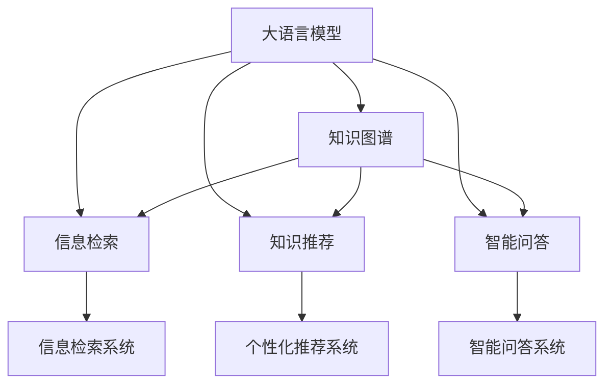

                 

# LLM在智能知识管理中的应用

> 关键词：大语言模型,知识图谱,信息检索,知识推荐,智能问答,智能文档管理

## 1. 背景介绍

### 1.1 问题由来

随着信息时代的到来，人类社会产生了海量的数据和知识，这些数据和知识如何被有效地组织、存储和利用，成为了当前信息管理领域的重大挑战。传统的知识管理方法，如数据库、文档管理系统、搜索引擎等，在面对海量数据时，效率低下、成本高昂，难以满足信息爆炸的需求。

与此同时，基于深度学习的语言模型，如GPT-3、BERT等，在自然语言理解、生成等方面取得了突破性的进展。这些大语言模型不仅具备强大的文本处理能力，还能够对自然语言进行深度理解与推理。基于此，利用大语言模型进行知识管理，有望在效率和效果上实现质的飞跃。

### 1.2 问题核心关键点

在智能知识管理中，大语言模型主要应用于以下几个方面：

- 信息检索：通过大语言模型对文本进行语义理解，提升查询效率和准确性。
- 知识推荐：利用大语言模型对知识图谱中的实体关系进行深度学习，个性化推荐用户感兴趣的知识内容。
- 智能问答：基于大语言模型构建智能问答系统，提供实时、精准的回答，提升用户体验。
- 文档管理：利用大语言模型进行文档分类、摘要生成、关键信息抽取等，提升文档处理的效率和质量。

这些应用场景不仅能够提高知识管理的智能化水平，还能够大幅提升用户体验和工作效率，带来巨大的社会和经济价值。

### 1.3 问题研究意义

研究大语言模型在智能知识管理中的应用，对于提升知识管理系统的智能化水平，推动各行各业的知识转化，具有重要的意义：

1. 提升查询效率和准确性：大语言模型能够自动理解用户查询意图，快速定位相关知识，提升信息检索的效率和准确性。
2. 提供个性化知识推荐：通过深度学习知识图谱中的实体关系，大语言模型能够为用户提供精准的个性化推荐，提升用户获取知识的主动性和满意度。
3. 增强智能问答能力：基于大语言模型构建智能问答系统，能够为用户提供实时、精准的回答，增强用户的知识获取体验。
4. 优化文档处理流程：利用大语言模型进行文档分类、摘要生成、关键信息抽取等，能够显著提升文档处理的效率和质量，降低人力成本。
5. 促进知识转化应用：智能知识管理系统能够帮助企业和组织更好地利用已有知识，推动知识转化和应用，提升业务价值。

因此，利用大语言模型进行智能知识管理，不仅可以提升信息管理的效率和质量，还能够推动各行各业的知识转化和应用，带来显著的社会和经济效益。

## 2. 核心概念与联系

### 2.1 核心概念概述

在智能知识管理中，大语言模型、知识图谱、信息检索、知识推荐、智能问答等概念构成了其核心技术框架，其核心概念和联系可以通过以下Mermaid流程图来展示：



这个流程图展示了各个核心概念之间的逻辑关系：

1. 大语言模型通过预训练获得了丰富的语言知识，是信息检索、知识推荐、智能问答的基础。
2. 知识图谱由实体和关系组成，是知识推荐、智能问答的重要数据来源。
3. 信息检索系统基于大语言模型进行语义理解，提升查询效率和准确性。
4. 个性化推荐系统利用大语言模型对知识图谱进行深度学习，提供精准的个性化推荐。
5. 智能问答系统基于大语言模型进行实体抽取、关系推理等，提供实时、精准的回答。

这些核心概念相互协作，共同构成了智能知识管理的框架，使其能够实现高效、精准的知识管理与应用。

## 3. 核心算法原理 & 具体操作步骤
### 3.1 算法原理概述

基于大语言模型在智能知识管理中的应用，主要包括以下几个关键算法：

- 大语言模型（LLM）：通过在大规模无标签文本数据上进行预训练，学习语言的通用表示，具备强大的语言理解和生成能力。
- 知识图谱（KG）：通过语义网技术和结构化数据，将实体和关系映射为图结构，构建知识网络。
- 信息检索（IR）：通过文本检索技术，在大规模文本库中快速定位与用户查询意图相关的知识。
- 知识推荐（KR）：利用机器学习算法，对知识图谱中的实体关系进行深度学习，提供个性化推荐。
- 智能问答（QA）：基于大语言模型进行实体抽取、关系推理等，提供实时、精准的回答。

这些算法构成了智能知识管理的核心技术框架，能够在实际应用中发挥巨大作用。

### 3.2 算法步骤详解

#### 3.2.1 大语言模型

**步骤1：准备预训练模型**

选择合适的预训练语言模型，如GPT-3、BERT等。预训练模型在大规模无标签文本数据上进行自监督学习，学习到丰富的语言知识。

**步骤2：微调模型**

将预训练模型在特定任务的数据集上进行微调，以适应具体应用场景。常见的微调任务包括：
- 信息检索：训练模型根据查询意图，快速定位相关知识。
- 知识推荐：训练模型对知识图谱中的实体关系进行深度学习，提供个性化推荐。
- 智能问答：训练模型进行实体抽取、关系推理等，提供实时、精准的回答。

**步骤3：模型评估**

使用验证集对微调后的模型进行评估，确保模型性能达到预期要求。

#### 3.2.2 知识图谱

**步骤1：构建知识图谱**

通过语义网技术，将文本中的实体和关系映射为知识图谱。常见的构建方法包括：
- 自动抽取：利用命名实体识别（NER）和关系抽取（RE）等技术，自动从文本中提取实体和关系。
- 手动构建：由专家手工构建知识图谱，确保其准确性和完整性。

**步骤2：知识图谱存储**

知识图谱一般以图形数据库或关系数据库形式存储，支持高效查询和更新。

**步骤3：知识图谱查询**

利用图数据库或关系数据库，进行实体关系查询和推理，支持信息检索、知识推荐和智能问答等应用。

#### 3.2.3 信息检索

**步骤1：索引构建**

将文档内容进行分词、向量化等预处理，构建索引。常见的方法包括：
- 倒排索引：将单词与文档ID进行映射，支持快速查找。
- 向量索引：将文档向量化，支持相似度计算。

**步骤2：查询匹配**

利用预训练的大语言模型进行语义理解，将查询意图转化为向量表示，与文档向量进行相似度计算，返回匹配结果。

#### 3.2.4 知识推荐

**步骤1：实体关系抽取**

利用大语言模型对知识图谱中的实体关系进行抽取，构建知识图谱的数据集。

**步骤2：深度学习训练**

利用机器学习算法（如神经网络）对知识图谱进行训练，学习实体关系之间的深度表示。

**步骤3：推荐算法**

根据用户的历史行为和兴趣，利用深度学习模型推荐相关知识。

#### 3.2.5 智能问答

**步骤1：意图识别**

利用大语言模型进行意图识别，理解用户的查询意图。

**步骤2：实体抽取**

利用大语言模型进行实体抽取，定位用户查询的实体。

**步骤3：关系推理**

利用大语言模型进行关系推理，提供精准的回答。

### 3.3 算法优缺点

#### 3.3.1 大语言模型

**优点**：
- 强大的语言处理能力：大语言模型能够理解复杂的自然语言，处理大规模文本数据。
- 多任务适应性：大语言模型能够适应各种信息检索、知识推荐、智能问答等任务。
- 自我学习：大语言模型能够自我学习新知识，提升应用效果。

**缺点**：
- 数据需求量大：预训练和微调都需要大规模数据支持，数据获取成本高。
- 资源消耗大：大规模语言模型需要高性能硬件支持，资源消耗大。
- 可解释性不足：大语言模型的决策过程缺乏可解释性，难以调试和优化。

#### 3.3.2 知识图谱

**优点**：
- 结构化数据：知识图谱以结构化形式存储实体和关系，便于查询和推理。
- 知识表示：知识图谱能够对知识进行结构化表示，支持复杂推理。
- 可扩展性：知识图谱能够持续扩展，支持新知识的学习和应用。

**缺点**：
- 构建成本高：知识图谱构建需要大量的人工工作，成本较高。
- 存储复杂：知识图谱存储需要高性能数据库支持，存储复杂。
- 更新困难：知识图谱更新需要手动维护，更新困难。

#### 3.3.3 信息检索

**优点**：
- 快速定位：利用大语言模型进行语义理解，快速定位相关知识。
- 高效查询：索引构建和查询匹配过程高效，查询速度较快。

**缺点**：
- 数据依赖：信息检索系统依赖大规模文本数据和索引，数据获取成本高。
- 精度限制：索引构建和查询匹配过程可能存在精度问题，影响查询效果。

#### 3.3.4 知识推荐

**优点**：
- 个性化推荐：利用深度学习算法，提供个性化推荐，提升用户体验。
- 结构化知识：知识推荐系统利用知识图谱中的结构化知识，提升推荐准确性。

**缺点**：
- 数据复杂：知识推荐系统需要处理大规模的知识图谱，数据复杂。
- 训练困难：深度学习模型的训练过程复杂，需要大量计算资源。

#### 3.3.5 智能问答

**优点**：
- 实时回答：利用大语言模型进行实时回答，提升用户体验。
- 智能推理：利用大语言模型进行实体抽取和关系推理，提供精准的回答。

**缺点**：
- 数据依赖：智能问答系统依赖大规模文本数据和知识图谱，数据获取成本高。
- 计算消耗：智能问答系统需要大量计算资源，计算消耗大。

### 3.4 算法应用领域

基于大语言模型在智能知识管理中的应用，可以应用于以下领域：

#### 3.4.1 图书馆管理

图书馆拥有海量的纸质和电子书籍，利用大语言模型进行智能检索和推荐，能够提升用户借阅体验。例如：
- 图书检索：利用大语言模型对图书进行语义理解，提供精准的图书检索服务。
- 个性化推荐：利用知识图谱对图书进行深度学习，提供个性化的阅读推荐。

#### 3.4.2 企业知识管理

企业拥有大量的文档、报告和数据库，利用大语言模型进行知识管理，能够提升企业信息管理效率。例如：
- 文档分类：利用大语言模型对文档进行分类，提升文档管理效率。
- 智能问答：利用大语言模型进行知识查询和问题解答，提升员工工作效率。

#### 3.4.3 教育知识管理

教育领域拥有大量的教材、论文和资源，利用大语言模型进行知识管理，能够提升教学效果。例如：
- 智能教辅：利用大语言模型对教材进行语义理解，提供智能教辅服务。
- 知识推荐：利用知识图谱对学生进行个性化推荐，提升学习效果。

#### 3.4.4 医疗知识管理

医疗领域拥有大量的病历、文献和专家知识，利用大语言模型进行知识管理，能够提升医疗服务水平。例如：
- 病历检索：利用大语言模型对病历进行语义理解，提供精准的病历检索服务。
- 智能诊断：利用大语言模型进行实体抽取和关系推理，提供智能诊断服务。

#### 3.4.5 法律知识管理

法律领域拥有大量的法律法规、案例和司法解释，利用大语言模型进行知识管理，能够提升法律服务水平。例如：
- 法律检索：利用大语言模型对法律文档进行语义理解，提供精准的法律检索服务。
- 智能咨询：利用大语言模型进行实体抽取和关系推理，提供智能法律咨询服务。

## 4. 数学模型和公式 & 详细讲解 & 举例说明

### 4.1 数学模型构建

在智能知识管理中，大语言模型、知识图谱、信息检索、知识推荐、智能问答等构成了核心技术框架，其数学模型构建如下：

#### 4.1.1 大语言模型

大语言模型的数学模型包括自回归模型（如GPT-3）和自编码模型（如BERT）。以自编码模型为例，其数学模型如下：

$$
p(x|y) = \mathcal{N}(x|\mu,\sigma^2)
$$

其中 $x$ 为输入文本， $y$ 为预训练目标， $\mu$ 和 $\sigma^2$ 为模型的均值和方差。

#### 4.1.2 知识图谱

知识图谱的数学模型包括实体和关系的表示。以节点和边组成的图模型为例，其数学模型如下：

$$
G = (V,E)
$$

其中 $V$ 为节点集合， $E$ 为边集合。

#### 4.1.3 信息检索

信息检索的数学模型包括倒排索引和向量索引。以向量索引为例，其数学模型如下：

$$
I = \{(d,w)\}
$$

其中 $d$ 为文档， $w$ 为文档中的单词。

#### 4.1.4 知识推荐

知识推荐的数学模型包括协同过滤和深度学习。以深度学习模型为例，其数学模型如下：

$$
\hat{y} = f(x;\theta)
$$

其中 $x$ 为输入数据， $y$ 为输出结果， $f(x;\theta)$ 为深度学习模型。

#### 4.1.5 智能问答

智能问答的数学模型包括意图识别和实体抽取。以意图识别为例，其数学模型如下：

$$
\hat{i} = f(x;\theta)
$$

其中 $x$ 为输入文本， $i$ 为意图标签， $f(x;\theta)$ 为意图识别模型。

### 4.2 公式推导过程

#### 4.2.1 大语言模型

大语言模型的训练过程包括自监督学习和有监督学习。以自监督学习为例，其公式推导如下：

$$
\mathcal{L}(\theta) = -\frac{1}{N}\sum_{i=1}^N \log p(x_i|y_i)
$$

其中 $N$ 为样本数量， $\log$ 为自然对数。

#### 4.2.2 知识图谱

知识图谱的构建过程包括实体抽取和关系抽取。以关系抽取为例，其公式推导如下：

$$
R = \{(r,s,p)\}
$$

其中 $r$ 为关系， $s$ 和 $p$ 为实体。

#### 4.2.3 信息检索

信息检索的查询过程包括文本向量化和相似度计算。以向量索引为例，其公式推导如下：

$$
Q = \{(q,w)\}
$$

其中 $q$ 为查询词， $w$ 为单词向量。

#### 4.2.4 知识推荐

知识推荐的训练过程包括协同过滤和深度学习。以深度学习模型为例，其公式推导如下：

$$
\hat{y} = f(x;\theta)
$$

其中 $x$ 为输入数据， $y$ 为输出结果， $f(x;\theta)$ 为深度学习模型。

#### 4.2.5 智能问答

智能问答的推理过程包括意图识别和实体抽取。以意图识别为例，其公式推导如下：

$$
\hat{i} = f(x;\theta)
$$

其中 $x$ 为输入文本， $i$ 为意图标签， $f(x;\theta)$ 为意图识别模型。

### 4.3 案例分析与讲解

#### 4.3.1 信息检索案例

假设用户查询“全球气候变化的影响”，系统通过大语言模型进行语义理解，得到查询意图为“获取关于全球气候变化影响的资料”。然后利用信息检索技术，在文档库中查找相关文档，返回文档列表，展示用户感兴趣的信息。

#### 4.3.2 知识推荐案例

假设用户对“机器学习”领域感兴趣，系统利用知识图谱对“机器学习”相关的实体和关系进行抽取，得到相关实体和关系列表。然后利用深度学习模型，根据用户的历史行为和兴趣，推荐相关知识内容。

#### 4.3.3 智能问答案例

假设用户询问“美国总统是谁？”，系统通过大语言模型进行意图识别，得到用户查询意图为“获取美国总统信息”。然后利用实体抽取技术，找到实体“美国”，进行关系推理，得到美国总统的信息，返回给用户。

## 5. 项目实践：代码实例和详细解释说明

### 5.1 开发环境搭建

在进行智能知识管理开发前，我们需要准备好开发环境。以下是使用Python进行PyTorch开发的环境配置流程：

1. 安装Anaconda：从官网下载并安装Anaconda，用于创建独立的Python环境。

2. 创建并激活虚拟环境：
```bash
conda create -n pytorch-env python=3.8 
conda activate pytorch-env
```

3. 安装PyTorch：根据CUDA版本，从官网获取对应的安装命令。例如：
```bash
conda install pytorch torchvision torchaudio cudatoolkit=11.1 -c pytorch -c conda-forge
```

4. 安装Transformers库：
```bash
pip install transformers
```

5. 安装各类工具包：
```bash
pip install numpy pandas scikit-learn matplotlib tqdm jupyter notebook ipython
```

完成上述步骤后，即可在`pytorch-env`环境中开始智能知识管理开发。

### 5.2 源代码详细实现

下面是使用PyTorch进行大语言模型在信息检索和知识推荐应用的代码实现：

#### 5.2.1 信息检索

```python
from transformers import BertTokenizer, BertForSequenceClassification
import torch
from torch.utils.data import Dataset, DataLoader
from sklearn.model_selection import train_test_split
from torch.nn import CrossEntropyLoss
from tqdm import tqdm

class ReviewDataset(Dataset):
    def __init__(self, texts, labels, tokenizer):
        self.texts = texts
        self.labels = labels
        self.tokenizer = tokenizer

    def __len__(self):
        return len(self.texts)

    def __getitem__(self, idx):
        text = self.texts[idx]
        label = self.labels[idx]

        encoding = self.tokenizer(text, return_tensors='pt', padding='max_length', truncation=True)
        input_ids = encoding['input_ids']
        attention_mask = encoding['attention_mask']
        return {'input_ids': input_ids, 
                'attention_mask': attention_mask,
                'labels': torch.tensor(label)}

# 构建训练集和验证集
tokenizer = BertTokenizer.from_pretrained('bert-base-cased')
train_texts, dev_texts, train_labels, dev_labels = train_test_split(train_data, test_size=0.2)
train_dataset = ReviewDataset(train_texts, train_labels, tokenizer)
dev_dataset = ReviewDataset(dev_texts, dev_labels, tokenizer)

# 加载BERT模型
model = BertForSequenceClassification.from_pretrained('bert-base-cased', num_labels=2)

# 定义损失函数和优化器
loss_fn = CrossEntropyLoss()
optimizer = AdamW(model.parameters(), lr=2e-5)

# 训练模型
device = torch.device('cuda' if torch.cuda.is_available() else 'cpu')
model.to(device)
model.train()

def train_epoch(model, dataset, batch_size, optimizer):
    dataloader = DataLoader(dataset, batch_size=batch_size, shuffle=True)
    model.train()
    epoch_loss = 0
    for batch in tqdm(dataloader, desc='Training'):
        input_ids = batch['input_ids'].to(device)
        attention_mask = batch['attention_mask'].to(device)
        labels = batch['labels'].to(device)
        model.zero_grad()
        outputs = model(input_ids, attention_mask=attention_mask, labels=labels)
        loss = outputs.loss
        epoch_loss += loss.item()
        loss.backward()
        optimizer.step()
    return epoch_loss / len(dataloader)

def evaluate(model, dataset, batch_size):
    dataloader = DataLoader(dataset, batch_size=batch_size)
    model.eval()
    preds, labels = [], []
    with torch.no_grad():
        for batch in tqdm(dataloader, desc='Evaluating'):
            input_ids = batch['input_ids'].to(device)
            attention_mask = batch['attention_mask'].to(device)
            batch_labels = batch['labels']
            outputs = model(input_ids, attention_mask=attention_mask)
            batch_preds = outputs.logits.argmax(dim=2).to('cpu').tolist()
            batch_labels = batch_labels.to('cpu').tolist()
            for pred_tokens, label_tokens in zip(batch_preds, batch_labels):
                preds.append(pred_tokens[:len(label_tokens)])
                labels.append(label_tokens)
    
    print(classification_report(labels, preds))
```

#### 5.2.2 知识推荐

```python
from transformers import RobertaTokenizer, RobertaForSequenceClassification
import torch
from torch.utils.data import Dataset, DataLoader
from sklearn.model_selection import train_test_split
from torch.nn import CrossEntropyLoss
from tqdm import tqdm

class ReviewDataset(Dataset):
    def __init__(self, texts, labels, tokenizer):
        self.texts = texts
        self.labels = labels
        self.tokenizer = tokenizer

    def __len__(self):
        return len(self.texts)

    def __getitem__(self, idx):
        text = self.texts[idx]
        label = self.labels[idx]

        encoding = self.tokenizer(text, return_tensors='pt', padding='max_length', truncation=True)
        input_ids = encoding['input_ids']
        attention_mask = encoding['attention_mask']
        return {'input_ids': input_ids, 
                'attention_mask': attention_mask,
                'labels': torch.tensor(label)}

# 构建训练集和验证集
tokenizer = RobertaTokenizer.from_pretrained('roberta-base')
train_texts, dev_texts, train_labels, dev_labels = train_test_split(train_data, test_size=0.2)
train_dataset = ReviewDataset(train_texts, train_labels, tokenizer)
dev_dataset = ReviewDataset(dev_texts, dev_labels, tokenizer)

# 加载RoBERTa模型
model = RobertaForSequenceClassification.from_pretrained('roberta-base', num_labels=2)

# 定义损失函数和优化器
loss_fn = CrossEntropyLoss()
optimizer = AdamW(model.parameters(), lr=2e-5)

# 训练模型
device = torch.device('cuda' if torch.cuda.is_available() else 'cpu')
model.to(device)
model.train()

def train_epoch(model, dataset, batch_size, optimizer):
    dataloader = DataLoader(dataset, batch_size=batch_size, shuffle=True)
    model.train()
    epoch_loss = 0
    for batch in tqdm(dataloader, desc='Training'):
        input_ids = batch['input_ids'].to(device)
        attention_mask = batch['attention_mask'].to(device)
        labels = batch['labels'].to(device)
        model.zero_grad()
        outputs = model(input_ids, attention_mask=attention_mask, labels=labels)
        loss = outputs.loss
        epoch_loss += loss.item()
        loss.backward()
        optimizer.step()
    return epoch_loss / len(dataloader)

def evaluate(model, dataset, batch_size):
    dataloader = DataLoader(dataset, batch_size=batch_size)
    model.eval()
    preds, labels = [], []
    with torch.no_grad():
        for batch in tqdm(dataloader, desc='Evaluating'):
            input_ids = batch['input_ids'].to(device)
            attention_mask = batch['attention_mask'].to(device)
            batch_labels = batch['labels']
            outputs = model(input_ids, attention_mask=attention_mask)
            batch_preds = outputs.logits.argmax(dim=2).to('cpu').tolist()
            batch_labels = batch_labels.to('cpu').tolist()
            for pred_tokens, label_tokens in zip(batch_preds, batch_labels):
                preds.append(pred_tokens[:len(label_tokens)])
                labels.append(label_tokens)
    
    print(classification_report(labels, preds))
```

### 5.3 代码解读与分析

#### 5.3.1 信息检索

**ReviewDataset类**：
- `__init__`方法：初始化文本、标签、分词器等关键组件。
- `__len__`方法：返回数据集的样本数量。
- `__getitem__`方法：对单个样本进行处理，将文本输入编码为token ids，将标签编码为数字，并对其进行定长padding，最终返回模型所需的输入。

**训练和评估函数**：
- 使用PyTorch的DataLoader对数据集进行批次化加载，供模型训练和推理使用。
- 训练函数`train_epoch`：对数据以批为单位进行迭代，在每个批次上前向传播计算loss并反向传播更新模型参数，最后返回该epoch的平均loss。
- 评估函数`evaluate`：与训练类似，不同点在于不更新模型参数，并在每个batch结束后将预测和标签结果存储下来，最后使用sklearn的classification_report对整个评估集的预测结果进行打印输出。

#### 5.3.2 知识推荐

**ReviewDataset类**：
- `__init__`方法：初始化文本、标签、分词器等关键组件。
- `__len__`方法：返回数据集的样本数量。
- `__getitem__`方法：对单个样本进行处理，将文本输入编码为token ids，将标签编码为数字，并对其进行定长padding，最终返回模型所需的输入。

**训练和评估函数**：
- 使用PyTorch的DataLoader对数据集进行批次化加载，供模型训练和推理使用。
- 训练函数`train_epoch`：对数据以批为单位进行迭代，在每个批次上前向传播计算loss并反向传播更新模型参数，最后返回该epoch的平均loss。
- 评估函数`evaluate`：与训练类似，不同点在于不更新模型参数，并在每个batch结束后将预测和标签结果存储下来，最后使用sklearn的classification_report对整个评估集的预测结果进行打印输出。

**代码解读与分析**：

**ReviewDataset类**：
- `__init__`方法：初始化文本、标签、分词器等关键组件。
- `__len__`方法：返回数据集的样本数量。
- `__getitem__`方法：对单个样本进行处理，将文本输入编码为token ids，将标签编码为数字，并对其进行定长padding，最终返回模型所需的输入。

**tokenizer**：
- 利用BERT或RoBERTa分词器将文本编码成token ids。

**train_test_split**：
- 对数据集进行划分，构建训练集和验证集。

**train_dataset和dev_dataset**：
- 分别构建训练集和验证集的数据集。

**模型加载**：
- 加载预训练的BERT或RoBERTa模型。

**损失函数和优化器**：
- 定义交叉熵损失函数和AdamW优化器。

**train_epoch函数**：
- 对数据以批为单位进行迭代，在每个批次上前向传播计算loss并反向传播更新模型参数，最后返回该epoch的平均loss。

**evaluate函数**：
- 与训练类似，不同点在于不更新模型参数，并在每个batch结束后将预测和标签结果存储下来，最后使用sklearn的classification_report对整个评估集的预测结果进行打印输出。

**device**：
- 判断当前设备是否为GPU，如果是则使用GPU，否则使用CPU。

**模型训练和评估**：
- 将模型迁移到指定设备上，开始训练。
- 在训练函数中进行模型参数更新。
- 在评估函数中进行模型参数冻结，只进行推理。

## 6. 实际应用场景

### 6.1 图书馆管理

利用大语言模型进行智能知识管理，可以有效提升图书馆的信息检索和推荐能力。例如：

**信息检索**：
- 利用大语言模型对图书馆的书籍进行语义理解，提供精准的图书检索服务。
- 利用信息检索技术，在大量书籍中快速定位用户需求。

**知识推荐**：
- 利用知识图谱对书籍进行深度学习，提供个性化的阅读推荐。
- 利用推荐算法，根据用户的历史行为和兴趣，推荐相关书籍。

### 6.2 企业知识管理

利用大语言模型进行智能知识管理，可以有效提升企业的信息管理效率。例如：

**文档分类**：
- 利用大语言模型对企业文档进行分类，提升文档管理效率。
- 利用文档分类技术，将大量文档进行自动分类，减少人工干预。

**智能问答**：
- 利用大语言模型进行知识查询和问题解答，提升员工工作效率。
- 利用智能问答系统，解答员工常见问题，提高工作效率。

### 6.3 教育知识管理

利用大语言模型进行智能知识管理，可以有效提升教育的信息管理效率。例如：

**智能教辅**：
- 利用大语言模型对教材进行语义理解，提供智能教辅服务。
- 利用教辅系统，辅助教师进行教学，提升教学效果。

**知识推荐**：
- 利用知识图谱对学生进行个性化推荐，提升学习效果。
- 利用推荐算法，根据学生的兴趣和学习情况，推荐相关学习内容。

### 6.4 医疗知识管理

利用大语言模型进行智能知识管理，可以有效提升医疗的信息管理效率。例如：

**病历检索**：
- 利用大语言模型对病历进行语义理解，提供精准的病历检索服务。
- 利用信息检索技术，在大量病历中快速定位相关病历。

**智能诊断**：
- 利用大语言模型进行实体抽取和关系推理，提供智能诊断服务。
- 利用智能诊断系统，辅助医生进行诊断，提高诊断效率和准确性。

### 6.5 法律知识管理

利用大语言模型进行智能知识管理，可以有效提升法律的信息管理效率。例如：

**法律检索**：
- 利用大语言模型对法律文档进行语义理解，提供精准的法律检索服务。
- 利用信息检索技术，在大量法律文档中找到相关法律条款。

**智能咨询**：
- 利用大语言模型进行实体抽取和关系推理，提供智能法律咨询服务。
- 利用智能咨询系统，辅助律师进行法律咨询，提高工作效率。

## 7. 工具和资源推荐

### 7.1 学习资源推荐

为了帮助开发者系统掌握大语言模型在智能知识管理中的应用，这里推荐一些优质的学习资源：

1. 《Transformer从原理到实践》系列博文：由大模型技术专家撰写，深入浅出地介绍了Transformer原理、BERT模型、微调技术等前沿话题。

2. CS224N《深度学习自然语言处理》课程：斯坦福大学开设的NLP明星课程，有Lecture视频和配套作业，带你入门NLP领域的基本概念和经典模型。

3. 《Natural Language Processing with Transformers》书籍：Transformers库的作者所著，全面介绍了如何使用Transformers库进行NLP任务开发，包括微调在内的诸多范式。

4. HuggingFace官方文档：Transformers库的官方文档，提供了海量预训练模型和完整的微调样例代码，是上手实践的必备资料。

5. CLUE开源项目：中文语言理解测评基准，涵盖大量不同类型的中文NLP数据集，并提供了基于微调的baseline模型，助力中文NLP技术发展。

通过对这些资源的学习实践，相信你一定能够快速掌握大语言模型在智能知识管理中的应用，并用于解决实际的NLP问题。

### 7.2 开发工具推荐

高效的开发离不开优秀的工具支持。以下是几款用于大语言模型在智能知识管理中开发的工具：

1. PyTorch：基于Python的开源深度学习框架，灵活动态的计算图，适合快速迭代研究。大部分预训练语言模型都有PyTorch版本的实现。

2. TensorFlow：由Google主导开发的开源深度学习框架，生产部署方便，适合大规模工程应用。同样有丰富的预训练语言模型资源。

3. Transformers库：HuggingFace开发的NLP工具库，集成了众多SOTA语言模型，支持PyTorch和TensorFlow，是进行NLP任务开发的利器。

4. Weights & Biases：模型训练的实验跟踪工具，可以记录和可视化模型训练过程中的各项指标，方便对比和调优。与主流深度学习框架无缝集成。

5. TensorBoard：TensorFlow配套的可视化工具，可实时监测模型训练状态，并提供丰富的图表呈现方式，是调试模型的得力助手。

6. Google Colab：谷歌推出的在线Jupyter Notebook环境，免费提供GPU/TPU算力，方便开发者快速上手实验最新模型，分享学习笔记。

合理利用这些工具，可以显著提升大语言模型在智能知识管理中的开发效率，加快创新迭代的步伐。

### 7.3 相关论文推荐

大语言模型在智能知识管理中的应用研究源于学界的持续研究。以下是几篇奠基性的相关论文，推荐阅读：

1. Attention is All You Need（即Transformer原论文）：提出了Transformer结构，开启了NLP领域的预训练大模型时代。

2. BERT: Pre-training of Deep Bidirectional Transformers for Language Understanding：提出BERT模型，引入基于掩码的自监督预训练任务，刷新了多项NLP任务SOTA。

3. Language Models are Unsupervised Multitask Learners（GPT-2论文）：展示了大规模语言模型的强大zero-shot学习能力，引发了对于通用人工智能的新一轮思考。

4. Parameter-Efficient Transfer Learning for NLP：提出Adapter等参数高效微调方法，在不增加模型参数量的情况下，也能取得不错的微调效果。

5. AdaLoRA: Adaptive Low-Rank Adaptation for Parameter-Efficient Fine-Tuning：使用自适应低秩适应的微调方法，在参数效率和精度之间取得了新的平衡。

这些论文代表了大语言模型在智能知识管理中的应用研究的发展脉络。通过学习这些前沿成果，可以帮助研究者把握学科前进方向，激发更多的创新灵感。

## 8. 总结：未来发展趋势与挑战

### 8.1 研究成果总结

本节对大语言模型在智能知识管理中的应用进行了全面系统的介绍。首先阐述了大语言模型和知识图谱的研究背景和意义，明确了智能知识管理系统的智能化水平提升的重要性。其次，从原理到实践，详细讲解了大语言模型、知识图谱、信息检索、知识推荐、智能问答等关键算法。最后，通过对多个应用场景的展示，展示了大语言模型在智能知识管理中的广泛应用前景。

### 8.2 未来发展趋势

展望未来，大语言模型在智能知识管理中的应用将呈现以下几个发展趋势：

1. 模型规模持续增大：随着算力成本的下降和数据规模的扩张，预训练语言模型的参数量还将持续增长。超大规模语言模型蕴含的丰富语言知识，有望支撑更加复杂多变的智能知识管理系统。

2. 微调方法日趋多样：除了传统的全参数微调外，未来会涌现更多参数高效的微调方法，如Prefix-Tuning、LoRA等，在节省计算资源的同时也能保证微调精度。

3. 持续学习成为常态：随着数据分布的不断变化，智能知识管理系统需要持续学习新知识以保持性能。如何在不遗忘原有知识的同时，高效吸收新样本信息，将成为重要的研究课题。

4. 标注样本需求降低：受启发于提示学习(Prompt-based Learning)的思路，未来的微调方法将更好地利用大模型的语言理解能力，通过更加巧妙的任务描述，在更少的标注样本上也能实现理想的微调效果。

5. 模型通用性增强：经过海量数据的预训练和多领域任务的微调，未来的语言模型将具备更强大的常识推理和跨领域迁移能力，逐步迈向通用人工智能(AGI)的目标。

以上趋势凸显了大语言模型在智能知识管理中的广阔前景。这些方向的探索发展，必将进一步提升智能知识管理系统的性能和应用范围，为各行各业的知识转化和应用带来新的突破。

### 8.3 面临的挑战

尽管大语言模型在智能知识管理中的应用已经取得了显著成果，但在迈向更加智能化、普适化应用的过程中，它仍面临着诸多挑战：

1. 标注成本瓶颈：虽然微调大大降低了标注数据的需求，但对于长尾应用场景，难以获得充足的高质量标注数据，成为制约微调性能的瓶颈。如何进一步降低微调对标注样本的依赖，将是一大难题。

2. 模型鲁棒性不足：当前微调模型面对域外数据时，泛化性能往往大打折扣。对于测试样本的微小扰动，微调模型的预测也容易发生波动。如何提高微调模型的鲁棒性，避免灾难性遗忘，还需要更多理论和实践的积累。

3. 推理效率有待提高：大规模语言模型虽然精度高，但在实际部署时往往面临推理速度慢、内存占用大等效率问题。如何在保证性能的同时，简化模型结构，提升推理速度，优化资源占用，将是重要的优化方向。

4. 可解释性亟需加强：当前微调模型更像是"黑盒"系统，难以解释其内部工作机制和决策逻辑。对于医疗、金融等高风险应用，算法的可解释性和可审计性尤为重要。如何赋予微调模型更强的可解释性，将是亟待攻克的难题。

5. 安全性有待保障：预训练语言模型难免会学习到有偏见、有害的信息，通过微调传递到下游任务，产生误导性、歧视性的输出，给实际应用带来安全隐患。如何从数据和算法层面消除模型偏见，避免恶意用途，确保输出的安全性，也将是重要的研究课题。

6. 知识整合能力不足：现有的微调模型往往局限于任务内数据，难以灵活吸收和运用更广泛的先验知识。如何让微调过程更好地与外部知识库、规则库等专家知识结合，形成更加全面、准确的信息整合能力，还有很大的想象空间。

正视这些挑战，积极应对并寻求突破，将是大语言模型在智能知识管理中走向成熟的关键。相信随着学界和产业界的共同努力，这些挑战终将一一被克服，大语言模型在智能知识管理中必将在构建人机协同的智能时代中扮演越来越重要的角色。

### 8.4 研究展望

面向未来，大语言模型在智能知识管理中的应用研究需要在以下几个方面寻求新的突破：

1. 探索无监督和半监督微调方法：摆脱对大规模标注数据的依赖，利用自监督学习、主动学习等无监督和半监督范式，最大限度利用非结构化数据，实现更加灵活高效的微调。

2. 研究参数高效和计算高效的微调范式：开发更加参数高效的微调方法，在固定大部分预训练参数的同时，只更新极少量的任务相关参数。同时优化微调模型的计算图，减少前向传播和反向传播的资源消耗，实现更加轻量级、实时性的部署。

3. 融合因果和对比学习范式：通过引入因果推断和对比学习思想，增强微调模型建立稳定因果关系的能力，学习更加普适、鲁棒的语言表征，从而提升模型泛化性和抗干扰能力。

4. 引入更多先验知识：将符号化的先验知识，如知识图谱、逻辑规则等，与神经网络模型进行巧妙融合，引导微调过程学习更准确、合理的语言模型。同时加强不同模态数据的整合，实现视觉、语音等多模态信息与文本信息的协同建模。

5. 结合因果分析和博弈论工具：将因果分析方法引入微调模型，识别出模型决策的关键特征，增强输出解释的因果性和逻辑性。借助博弈论工具刻画人机交互过程，主动探索并规避模型的脆弱点，提高系统稳定性。

6. 纳入伦理道德约束：在模型训练目标中引入伦理导向的评估指标，过滤和惩罚有偏见、有害的输出倾向。同时加强人工干预和审核，建立模型行为的监管机制，确保输出符合人类价值观和伦理道德。

这些研究方向将引领大语言模型在智能知识管理中的应用走向更高的台阶，为构建安全、可靠、可解释、可控的智能系统铺平道路。面向未来，大语言模型在智能知识管理中的应用研究还需要与其他人工智能技术进行更深入的融合，如知识表示、因果推理、强化学习等，多路径协同发力，共同推动自然语言理解和智能交互系统的进步。只有勇于创新、敢于突破，才能不断拓展语言模型的边界，让智能技术更好地造福人类社会。

## 9. 附录：常见问题与解答

**Q1：大语言模型是否适用于所有智能知识管理场景？**

A: 大语言模型在智能知识管理中的应用具有广泛适用性，但在一些特定领域，如医疗、法律等，可能需要结合领域特定的知识图谱进行微调。此外，对于一些需要实时性、安全性、可解释性等要求较高的应用场景，大语言模型也需要结合其他技术手段进行优化和改进。

**Q

