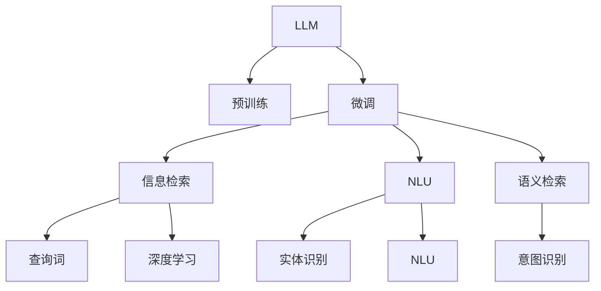

                 

# LLM对传统搜索引擎的挑战

## 1. 背景介绍

### 1.1 问题由来
随着互联网的迅猛发展，信息的海量增长对传统的搜索引擎提出了更高的要求。用户通过搜索引擎输入查询词，希望快速获取最相关、最全面、最准确的信息。然而，传统的搜索引擎算法难以处理大规模无结构文本数据，搜索效率和准确率受限，用户体验不佳。

为了应对这一挑战，近年来人工智能技术在搜索引擎领域得到了广泛应用，尤其是在语言理解和信息检索方面。基于预训练大语言模型(LLM)的搜索引擎技术应运而生，其核心思想是将大规模无标签文本数据进行预训练，构建语言模型，然后通过微调与特定任务和查询词进行结合，以提高搜索结果的相关性和准确性。

### 1.2 问题核心关键点
LLM在搜索引擎中的应用，核心在于其能够理解自然语言，并在大规模语料库上进行预训练，从而具备了强大的语言理解和生成能力。其基本工作流程包括以下几个步骤：
1. **预训练**：使用大规模无标签文本数据进行自监督学习，构建语言模型。
2. **微调**：在特定任务和查询词上进行微调，以适应具体的搜索需求。
3. **检索**：根据用户查询词和微调后的模型输出，进行相关性排序，返回最相关结果。
4. **部署**：将模型部署到搜索引擎系统中，实时处理用户查询。

### 1.3 问题研究意义
LLM技术的应用，不仅提升了搜索引擎的智能化水平，还为用户提供了更加个性化的搜索体验。通过理解用户查询词的真实意图，LLM能够提供更为准确、相关和及时的信息，从而提升用户满意度。同时，LLM还能处理多语言搜索需求，提供全球化的搜索服务。

此外，LLM技术还可以在图像、音频等非文本领域进行扩展应用，进一步丰富搜索引擎的功能，提高搜索效率和用户体验。然而，LLM技术在搜索引擎中的应用也面临一些挑战，需要在算法、数据、计算和部署等多个方面进行优化和改进。

## 2. 核心概念与联系

### 2.1 核心概念概述

为更好地理解LLM在搜索引擎中的应用，本节将介绍几个关键概念及其相互联系：

- **大语言模型(LLM)**：指使用Transformer等架构，在大规模语料库上进行自监督预训练的语言模型。LLM能够理解自然语言，生成符合语法和语义规则的文本。

- **预训练**：指在大规模无标签文本数据上进行自监督学习，构建语言模型。预训练使得模型学习到语言的一般知识，为后续微调任务打下基础。

- **微调**：指在预训练模型的基础上，针对特定任务和查询词进行有监督的微调，以适应具体的搜索需求。微调可以显著提升模型的相关性和准确性。

- **信息检索**：指根据用户查询词，从大规模文本数据中检索最相关的信息。信息检索是搜索引擎的核心功能，需要高效、准确、实时的处理能力。

- **深度学习**：指使用神经网络进行模型训练，特别是在自然语言处理领域，深度学习已成为主流技术。

- **自然语言理解(NLU)**：指让机器理解自然语言，包括语义理解、实体识别、意图识别等。

- **语义检索**：指根据查询词的语义，而非关键词进行信息检索，以提高检索的相关性和准确性。

这些概念之间的逻辑关系可以通过以下Mermaid流程图来展示：



这个流程图展示了LLM技术在搜索引擎中的核心流程：

1. LLM通过大规模语料预训练获得语言知识。
2. 针对特定查询词，通过微调调整LLM，以适应该查询的需求。
3. 使用微调后的模型进行信息检索，结合深度学习、NLU和语义检索等技术，提升检索效果。

## 3. 核心算法原理 & 具体操作步骤
### 3.1 算法原理概述

基于LLM的搜索引擎，其核心思想是利用大语言模型的语言理解和生成能力，提升信息检索的准确性和相关性。其核心算法流程包括以下几个关键步骤：

- **预训练**：在大规模无标签文本数据上，使用自监督任务训练通用语言模型，如掩码语言模型、预测下一位、语言建模等。预训练模型学习到语言的一般规律和知识。

- **微调**：在特定查询词和任务上，对预训练模型进行有监督的微调。微调模型能够理解查询词的语义，识别出与查询词相关的信息。

- **信息检索**：根据查询词和微调后的模型输出，从大量文本数据中检索最相关的信息。可以使用传统的倒排索引，也可以使用深度学习模型进行排序。

- **部署与优化**：将微调后的模型部署到搜索引擎系统中，实时处理用户查询，并进行性能优化，如查询速度、结果排序等。

### 3.2 算法步骤详解

基于LLM的搜索引擎技术，其基本步骤如下：

**Step 1: 预训练模型选择与准备**
- 选择合适的预训练模型，如BERT、GPT等，进行加载和预处理。
- 准备大规模无标签文本数据，如维基百科、新闻网站、社交媒体等，用于预训练。

**Step 2: 微调模型适配**
- 根据特定查询词，设计相应的任务适配层，如实体识别、意图识别等。
- 使用小规模标注数据对微调模型进行训练，优化模型输出与查询词的匹配度。

**Step 3: 信息检索与排序**
- 将查询词输入微调后的模型，得到语义表示或上下文信息。
- 在预处理后的文本数据集中，计算查询词与每个文本的相似度或相关性。
- 根据相似度或相关性对文本进行排序，返回最相关的结果。

**Step 4: 系统部署与优化**
- 将微调模型和检索算法部署到搜索引擎系统中。
- 对系统进行性能优化，如查询速度、结果排序等，确保实时响应。
- 持续监控系统运行状态，收集用户反馈，不断迭代优化。

### 3.3 算法优缺点

基于LLM的搜索引擎技术具有以下优点：
1. **高相关性**：LLM能够理解自然语言，提高查询结果的相关性。
2. **泛化能力强**：预训练模型在大规模语料上学习到的语言知识，能够泛化到不同领域和任务。
3. **多模态支持**：LLM不仅支持文本查询，还支持图像、音频等多模态数据，扩展了搜索引擎的功能。
4. **实时性**：通过微调和检索算法优化，LLM能够实现实时响应。

然而，该技术也存在一些缺点：
1. **计算资源需求高**：预训练和微调过程需要大量计算资源，部署复杂。
2. **数据质量要求高**：微调效果依赖于标注数据的质量和数量，标注成本高。
3. **可解释性不足**：LLM模型复杂，难以解释其内部决策逻辑。
4. **误导性输出**：预训练模型可能学习到有害信息，影响搜索结果的质量。

### 3.4 算法应用领域

基于LLM的搜索引擎技术，已经在多个领域得到了广泛应用，包括但不限于：

- **传统搜索引擎**：如Google、Bing等，通过LLM提高信息检索的准确性和相关性。
- **垂直搜索引擎**：如医疗、教育、法律等特定领域的搜索引擎，通过微调提高专业领域的检索效果。
- **多模态搜索引擎**：结合文本、图像、音频等不同模态数据，提供综合的搜索服务。
- **智能客服**：通过微调模型实现自然语言理解和对话，提供智能客服解决方案。
- **内容推荐**：根据用户查询词和历史行为，推荐相关内容，如新闻、文章、商品等。

## 4. 数学模型和公式 & 详细讲解  
### 4.1 数学模型构建

本节将使用数学语言对基于LLM的搜索引擎模型进行详细构建。

设预训练模型为 $M_{\theta}$，其中 $\theta$ 为模型参数。假设查询词为 $q$，文本数据集为 $\mathcal{D}$。

定义模型 $M_{\theta}$ 在查询词 $q$ 上的输出为 $M_{\theta}(q)$，表示查询词的语义表示。根据查询词 $q$，在文本数据集 $\mathcal{D}$ 中检索出相关文本 $\mathcal{D}_q$。定义文本 $d$ 与查询词 $q$ 的相似度函数为 $sim(d,q)$，可以采用余弦相似度、Jaccard相似度、BM25等方法。

最终，查询结果 $R$ 为所有相关文本的排名，可以采用排序算法，如基于排名模型的排序算法、基于深度学习的排序算法等。

### 4.2 公式推导过程

以下我们以文本检索为例，推导LLM在搜索引擎中的基本公式。

假设查询词 $q$ 在预训练模型 $M_{\theta}$ 上的语义表示为 $M_{\theta}(q)$，文本 $d_i$ 在模型上的语义表示为 $M_{\theta}(d_i)$。则文本 $d_i$ 与查询词 $q$ 的相似度可以表示为：

$$
sim(d_i, q) = cosine(M_{\theta}(d_i), M_{\theta}(q)) = \frac{M_{\theta}(d_i)^T M_{\theta}(q)}{\Vert M_{\theta}(d_i) \Vert \Vert M_{\theta}(q) \Vert}
$$

根据相似度函数，计算所有文本的相似度分数，得到相似度向量 $sim_q$：

$$
sim_q = \{sim(d_i, q)\}_{i=1}^N
$$

其中 $N$ 为文本数量。根据相似度向量，对文本进行排序，得到最终的查询结果 $R$：

$$
R = \mathop{\arg\min}_{d \in \mathcal{D}_q} sim(d,q)
$$

### 4.3 案例分析与讲解

在实际应用中，基于LLM的搜索引擎需要针对特定任务进行微调，以提高检索效果。以下以新闻推荐为例，介绍微调的基本过程。

假设新闻推荐系统需要根据用户的查询词 $q$，推荐最相关的最新新闻。在预训练模型 $M_{\theta}$ 上，设计一个文本分类器，将新闻分类为不同主题。假设新闻主题为 $\{health, sports, politics, entertainment\}$。

在训练集上，对预训练模型进行微调，优化分类器输出与查询词的匹配度。微调过程中，使用交叉熵损失函数，优化模型参数：

$$
\mathcal{L}(\theta) = -\frac{1}{N}\sum_{i=1}^N [y_i\log \hat{y}_i + (1-y_i)\log (1-\hat{y}_i)]
$$

其中 $y_i$ 为文本 $d_i$ 的真实主题标签，$\hat{y}_i$ 为模型对 $d_i$ 的分类预测。微调完成后，将模型部署到搜索引擎系统中，针对用户查询词 $q$，检索所有相关主题的新闻，并推荐最新的相关新闻。

## 5. 项目实践：代码实例和详细解释说明
### 5.1 开发环境搭建

在进行LLM在搜索引擎中的应用实践前，我们需要准备好开发环境。以下是使用Python进行PyTorch开发的环境配置流程：

1. 安装Anaconda：从官网下载并安装Anaconda，用于创建独立的Python环境。

2. 创建并激活虚拟环境：
```bash
conda create -n pytorch-env python=3.8 
conda activate pytorch-env
```

3. 安装PyTorch：根据CUDA版本，从官网获取对应的安装命令。例如：
```bash
conda install pytorch torchvision torchaudio cudatoolkit=11.1 -c pytorch -c conda-forge
```

4. 安装Transformers库：
```bash
pip install transformers
```

5. 安装各类工具包：
```bash
pip install numpy pandas scikit-learn matplotlib tqdm jupyter notebook ipython
```

完成上述步骤后，即可在`pytorch-env`环境中开始微调实践。

### 5.2 源代码详细实现

下面我们以新闻推荐为例，给出使用Transformers库对BERT模型进行微调的PyTorch代码实现。

首先，定义新闻推荐任务的数据处理函数：

```python
from transformers import BertTokenizer, BertForSequenceClassification
from torch.utils.data import Dataset
import torch

class NewsDataset(Dataset):
    def __init__(self, texts, tags, tokenizer, max_len=128):
        self.texts = texts
        self.tags = tags
        self.tokenizer = tokenizer
        self.max_len = max_len
        
    def __len__(self):
        return len(self.texts)
    
    def __getitem__(self, item):
        text = self.texts[item]
        tags = self.tags[item]
        
        encoding = self.tokenizer(text, return_tensors='pt', max_length=self.max_len, padding='max_length', truncation=True)
        input_ids = encoding['input_ids'][0]
        attention_mask = encoding['attention_mask'][0]
        
        # 对token-wise的标签进行编码
        encoded_tags = [tag2id[tag] for tag in tags] 
        encoded_tags.extend([tag2id['O']] * (self.max_len - len(encoded_tags)))
        labels = torch.tensor(encoded_tags, dtype=torch.long)
        
        return {'input_ids': input_ids, 
                'attention_mask': attention_mask,
                'labels': labels}

# 标签与id的映射
tag2id = {'health': 0, 'sports': 1, 'politics': 2, 'entertainment': 3, 'O': 4}
id2tag = {v: k for k, v in tag2id.items()}

# 创建dataset
tokenizer = BertTokenizer.from_pretrained('bert-base-cased')

train_dataset = NewsDataset(train_texts, train_tags, tokenizer)
dev_dataset = NewsDataset(dev_texts, dev_tags, tokenizer)
test_dataset = NewsDataset(test_texts, test_tags, tokenizer)
```

然后，定义模型和优化器：

```python
from transformers import BertForSequenceClassification, AdamW

model = BertForSequenceClassification.from_pretrained('bert-base-cased', num_labels=len(tag2id))

optimizer = AdamW(model.parameters(), lr=2e-5)
```

接着，定义训练和评估函数：

```python
from torch.utils.data import DataLoader
from tqdm import tqdm
from sklearn.metrics import classification_report

device = torch.device('cuda') if torch.cuda.is_available() else torch.device('cpu')
model.to(device)

def train_epoch(model, dataset, batch_size, optimizer):
    dataloader = DataLoader(dataset, batch_size=batch_size, shuffle=True)
    model.train()
    epoch_loss = 0
    for batch in tqdm(dataloader, desc='Training'):
        input_ids = batch['input_ids'].to(device)
        attention_mask = batch['attention_mask'].to(device)
        labels = batch['labels'].to(device)
        model.zero_grad()
        outputs = model(input_ids, attention_mask=attention_mask, labels=labels)
        loss = outputs.loss
        epoch_loss += loss.item()
        loss.backward()
        optimizer.step()
    return epoch_loss / len(dataloader)

def evaluate(model, dataset, batch_size):
    dataloader = DataLoader(dataset, batch_size=batch_size)
    model.eval()
    preds, labels = [], []
    with torch.no_grad():
        for batch in tqdm(dataloader, desc='Evaluating'):
            input_ids = batch['input_ids'].to(device)
            attention_mask = batch['attention_mask'].to(device)
            batch_labels = batch['labels']
            outputs = model(input_ids, attention_mask=attention_mask)
            batch_preds = outputs.logits.argmax(dim=2).to('cpu').tolist()
            batch_labels = batch_labels.to('cpu').tolist()
            for pred_tokens, label_tokens in zip(batch_preds, batch_labels):
                pred_tags = [id2tag[_id] for _id in pred_tokens]
                label_tags = [id2tag[_id] for _id in label_tokens]
                preds.append(pred_tags[:len(label_tokens)])
                labels.append(label_tags)
                
    print(classification_report(labels, preds))
```

最后，启动训练流程并在测试集上评估：

```python
epochs = 5
batch_size = 16

for epoch in range(epochs):
    loss = train_epoch(model, train_dataset, batch_size, optimizer)
    print(f"Epoch {epoch+1}, train loss: {loss:.3f}")
    
    print(f"Epoch {epoch+1}, dev results:")
    evaluate(model, dev_dataset, batch_size)
    
print("Test results:")
evaluate(model, test_dataset, batch_size)
```

以上就是使用PyTorch对BERT进行新闻推荐任务微调的完整代码实现。可以看到，得益于Transformers库的强大封装，我们可以用相对简洁的代码完成BERT模型的加载和微调。

### 5.3 代码解读与分析

让我们再详细解读一下关键代码的实现细节：

**NewsDataset类**：
- `__init__`方法：初始化文本、标签、分词器等关键组件。
- `__len__`方法：返回数据集的样本数量。
- `__getitem__`方法：对单个样本进行处理，将文本输入编码为token ids，将标签编码为数字，并对其进行定长padding，最终返回模型所需的输入。

**tag2id和id2tag字典**：
- 定义了标签与数字id之间的映射关系，用于将token-wise的预测结果解码回真实的标签。

**训练和评估函数**：
- 使用PyTorch的DataLoader对数据集进行批次化加载，供模型训练和推理使用。
- 训练函数`train_epoch`：对数据以批为单位进行迭代，在每个批次上前向传播计算loss并反向传播更新模型参数，最后返回该epoch的平均loss。
- 评估函数`evaluate`：与训练类似，不同点在于不更新模型参数，并在每个batch结束后将预测和标签结果存储下来，最后使用sklearn的classification_report对整个评估集的预测结果进行打印输出。

**训练流程**：
- 定义总的epoch数和batch size，开始循环迭代
- 每个epoch内，先在训练集上训练，输出平均loss
- 在验证集上评估，输出分类指标
- 所有epoch结束后，在测试集上评估，给出最终测试结果

可以看到，PyTorch配合Transformers库使得BERT微调的代码实现变得简洁高效。开发者可以将更多精力放在数据处理、模型改进等高层逻辑上，而不必过多关注底层的实现细节。

当然，工业级的系统实现还需考虑更多因素，如模型的保存和部署、超参数的自动搜索、更灵活的任务适配层等。但核心的微调范式基本与此类似。

## 6. 实际应用场景
### 6.1 智能客服系统

基于LLM的智能客服系统能够自动理解用户意图，提供个性化、实时响应的服务。传统客服系统需要大量人力，响应速度慢，且难以标准化。使用基于LLM的智能客服系统，可以显著提升客服效率和服务质量。

在技术实现上，可以收集企业的客服聊天记录，将问题和最佳答复构建成监督数据，在此基础上对预训练的LLM模型进行微调。微调后的模型能够自动理解用户意图，匹配最合适的答复模板进行回复。对于用户提出的新问题，还可以接入检索系统实时搜索相关内容，动态组织生成回答。如此构建的智能客服系统，能大幅提升客户咨询体验和问题解决效率。

### 6.2 金融舆情监测

金融机构需要实时监测市场舆论动向，以便及时应对负面信息传播，规避金融风险。传统的人工监测方式成本高、效率低，难以应对网络时代海量信息爆发的挑战。基于LLM的文本分类和情感分析技术，为金融舆情监测提供了新的解决方案。

具体而言，可以收集金融领域相关的新闻、报道、评论等文本数据，并对其进行主题标注和情感标注。在此基础上对预训练语言模型进行微调，使其能够自动判断文本属于何种主题，情感倾向是正面、中性还是负面。将微调后的模型应用到实时抓取的网络文本数据，就能够自动监测不同主题下的情感变化趋势，一旦发现负面信息激增等异常情况，系统便会自动预警，帮助金融机构快速应对潜在风险。

### 6.3 个性化推荐系统

当前的推荐系统往往只依赖用户的历史行为数据进行物品推荐，无法深入理解用户的真实兴趣偏好。基于LLM的个性化推荐系统可以更好地挖掘用户行为背后的语义信息，从而提供更精准、多样的推荐内容。

在实践中，可以收集用户浏览、点击、评论、分享等行为数据，提取和用户交互的物品标题、描述、标签等文本内容。将文本内容作为模型输入，用户的后续行为（如是否点击、购买等）作为监督信号，在此基础上微调预训练语言模型。微调后的模型能够从文本内容中准确把握用户的兴趣点。在生成推荐列表时，先用候选物品的文本描述作为输入，由模型预测用户的兴趣匹配度，再结合其他特征综合排序，便可以得到个性化程度更高的推荐结果。

### 6.4 未来应用展望

随着LLM技术的发展，基于LLM的搜索引擎将在更多领域得到应用，为传统行业带来变革性影响。

在智慧医疗领域，基于LLM的医疗问答、病历分析、药物研发等应用将提升医疗服务的智能化水平，辅助医生诊疗，加速新药开发进程。

在智能教育领域，LLM技术可应用于作业批改、学情分析、知识推荐等方面，因材施教，促进教育公平，提高教学质量。

在智慧城市治理中，LLM技术可应用于城市事件监测、舆情分析、应急指挥等环节，提高城市管理的自动化和智能化水平，构建更安全、高效的未来城市。

此外，在企业生产、社会治理、文娱传媒等众多领域，基于LLM的搜索引擎技术也将不断涌现，为NLP技术带来新的应用场景，推动人工智能技术的广泛应用。

## 7. 工具和资源推荐
### 7.1 学习资源推荐

为了帮助开发者系统掌握LLM在搜索引擎中的应用，这里推荐一些优质的学习资源：

1. 《Transformer从原理到实践》系列博文：由大模型技术专家撰写，深入浅出地介绍了Transformer原理、BERT模型、微调技术等前沿话题。

2. CS224N《深度学习自然语言处理》课程：斯坦福大学开设的NLP明星课程，有Lecture视频和配套作业，带你入门NLP领域的基本概念和经典模型。

3. 《Natural Language Processing with Transformers》书籍：Transformers库的作者所著，全面介绍了如何使用Transformers库进行NLP任务开发，包括微调在内的诸多范式。

4. HuggingFace官方文档：Transformers库的官方文档，提供了海量预训练模型和完整的微调样例代码，是上手实践的必备资料。

5. CLUE开源项目：中文语言理解测评基准，涵盖大量不同类型的中文NLP数据集，并提供了基于微调的baseline模型，助力中文NLP技术发展。

通过对这些资源的学习实践，相信你一定能够快速掌握LLM在搜索引擎中的应用，并用于解决实际的NLP问题。
###  7.2 开发工具推荐

高效的开发离不开优秀的工具支持。以下是几款用于LLM在搜索引擎中的应用开发的常用工具：

1. PyTorch：基于Python的开源深度学习框架，灵活动态的计算图，适合快速迭代研究。大部分预训练语言模型都有PyTorch版本的实现。

2. TensorFlow：由Google主导开发的开源深度学习框架，生产部署方便，适合大规模工程应用。同样有丰富的预训练语言模型资源。

3. Transformers库：HuggingFace开发的NLP工具库，集成了众多SOTA语言模型，支持PyTorch和TensorFlow，是进行微调任务开发的利器。

4. Weights & Biases：模型训练的实验跟踪工具，可以记录和可视化模型训练过程中的各项指标，方便对比和调优。与主流深度学习框架无缝集成。

5. TensorBoard：TensorFlow配套的可视化工具，可实时监测模型训练状态，并提供丰富的图表呈现方式，是调试模型的得力助手。

6. Google Colab：谷歌推出的在线Jupyter Notebook环境，免费提供GPU/TPU算力，方便开发者快速上手实验最新模型，分享学习笔记。

合理利用这些工具，可以显著提升LLM在搜索引擎中的应用开发效率，加快创新迭代的步伐。

### 7.3 相关论文推荐

LLM技术的发展源于学界的持续研究。以下是几篇奠基性的相关论文，推荐阅读：

1. Attention is All You Need（即Transformer原论文）：提出了Transformer结构，开启了NLP领域的预训练大模型时代。

2. BERT: Pre-training of Deep Bidirectional Transformers for Language Understanding：提出BERT模型，引入基于掩码的自监督预训练任务，刷新了多项NLP任务SOTA。

3. Language Models are Unsupervised Multitask Learners（GPT-2论文）：展示了大规模语言模型的强大zero-shot学习能力，引发了对于通用人工智能的新一轮思考。

4. Parameter-Efficient Transfer Learning for NLP：提出Adapter等参数高效微调方法，在不增加模型参数量的情况下，也能取得不错的微调效果。

5. Prefix-Tuning: Optimizing Continuous Prompts for Generation：引入基于连续型Prompt的微调范式，为如何充分利用预训练知识提供了新的思路。

6. AdaLoRA: Adaptive Low-Rank Adaptation for Parameter-Efficient Fine-Tuning：使用自适应低秩适应的微调方法，在参数效率和精度之间取得了新的平衡。

这些论文代表了大语言模型微调技术的发展脉络。通过学习这些前沿成果，可以帮助研究者把握学科前进方向，激发更多的创新灵感。

## 8. 总结：未来发展趋势与挑战

### 8.1 总结

本文对基于LLM的搜索引擎技术进行了全面系统的介绍。首先阐述了LLM技术在搜索引擎中的工作原理和应用背景，明确了其对提升信息检索相关性和准确性的独特价值。其次，从原理到实践，详细讲解了LLM在搜索引擎中的数学模型和核心算法，给出了微调任务开发的完整代码实例。同时，本文还广泛探讨了LLM在智能客服、金融舆情、个性化推荐等多个行业领域的应用前景，展示了其巨大的应用潜力。此外，本文精选了LLM技术的学习资源，力求为读者提供全方位的技术指引。

通过本文的系统梳理，可以看到，基于LLM的搜索引擎技术正在成为NLP领域的重要范式，极大地拓展了预训练语言模型的应用边界，催生了更多的落地场景。受益于大规模语料的预训练，LLM在搜索引擎中的应用，能够快速理解自然语言，处理海量文本数据，提供实时响应，提升用户体验。未来，伴随LLM技术的不断演进，基于LLM的搜索引擎必将在更多的领域中得到应用，推动人工智能技术在各行各业的数字化转型。

### 8.2 未来发展趋势

展望未来，基于LLM的搜索引擎技术将呈现以下几个发展趋势：

1. **模型规模持续增大**。随着算力成本的下降和数据规模的扩张，预训练语言模型的参数量还将持续增长。超大规模语言模型蕴含的丰富语言知识，有望支撑更加复杂多变的下游任务微调。

2. **微调方法日趋多样**。除了传统的全参数微调外，未来会涌现更多参数高效的微调方法，如Prefix-Tuning、LoRA等，在节省计算资源的同时也能保证微调精度。

3. **持续学习成为常态**。随着数据分布的不断变化，微调模型也需要持续学习新知识以保持性能。如何在不遗忘原有知识的同时，高效吸收新样本信息，将成为重要的研究课题。

4. **标注样本需求降低**。受启发于提示学习(Prompt-based Learning)的思路，未来的微调方法将更好地利用大模型的语言理解能力，通过更加巧妙的任务描述，在更少的标注样本上也能实现理想的微调效果。

5. **多模态微调崛起**。当前的微调主要聚焦于纯文本数据，未来会进一步拓展到图像、视频、语音等多模态数据微调。多模态信息的融合，将显著提升语言模型对现实世界的理解和建模能力。

6. **模型通用性增强**。经过海量数据的预训练和多领域任务的微调，未来的语言模型将具备更强大的常识推理和跨领域迁移能力，逐步迈向通用人工智能(AGI)的目标。

以上趋势凸显了大语言模型微调技术的广阔前景。这些方向的探索发展，必将进一步提升NLP系统的性能和应用范围，为人类认知智能的进化带来深远影响。

### 8.3 面临的挑战

尽管基于LLM的搜索引擎技术已经取得了瞩目成就，但在迈向更加智能化、普适化应用的过程中，它仍面临一些挑战：

1. **计算资源需求高**。预训练和微调过程需要大量计算资源，部署复杂。如何优化模型结构和算法，降低计算资源需求，提高计算效率，是一个重要的研究方向。

2. **数据质量要求高**。微调效果依赖于标注数据的质量和数量，标注成本高。如何降低标注成本，提高数据质量，仍是一个值得深入探索的问题。

3. **可解释性不足**。LLM模型复杂，难以解释其内部决策逻辑。如何提高模型的可解释性，使其行为更加透明和可控，是一个重要的研究课题。

4. **误导性输出**。预训练模型可能学习到有害信息，影响搜索结果的质量。如何从数据和算法层面消除模型偏见，避免恶意用途，确保输出的安全性，也将是重要的研究课题。

5. **知识整合能力不足**。现有的微调模型往往局限于任务内数据，难以灵活吸收和运用更广泛的先验知识。如何让微调过程更好地与外部知识库、规则库等专家知识结合，形成更加全面、准确的信息整合能力，还有很大的想象空间。

正视LLM在搜索引擎中面临的这些挑战，积极应对并寻求突破，将是大语言模型微调走向成熟的必由之路。相信随着学界和产业界的共同努力，这些挑战终将一一被克服，LLM必将在构建人机协同的智能时代中扮演越来越重要的角色。

### 8.4 研究展望

面对LLM在搜索引擎中面临的挑战，未来的研究需要在以下几个方面寻求新的突破：

1. **探索无监督和半监督微调方法**。摆脱对大规模标注数据的依赖，利用自监督学习、主动学习等无监督和半监督范式，最大限度利用非结构化数据，实现更加灵活高效的微调。

2. **研究参数高效和计算高效的微调范式**。开发更加参数高效的微调方法，在固定大部分预训练参数的同时，只更新极少量的任务相关参数。同时优化微调模型的计算图，减少前向传播和反向传播的资源消耗，实现更加轻量级、实时性的部署。

3. **融合因果和对比学习范式**。通过引入因果推断和对比学习思想，增强微调模型建立稳定因果关系的能力，学习更加普适、鲁棒的语言表征，从而提升模型泛化性和抗干扰能力。

4. **引入更多先验知识**。将符号化的先验知识，如知识图谱、逻辑规则等，与神经网络模型进行巧妙融合，引导微调过程学习更准确、合理的语言模型。同时加强不同模态数据的整合，实现视觉、语音等多模态信息与文本信息的协同建模。

5. **结合因果分析和博弈论工具**。将因果分析方法引入微调模型，识别出模型决策的关键特征，增强输出解释的因果性和逻辑性。借助博弈论工具刻画人机交互过程，主动探索并规避模型的脆弱点，提高系统稳定性。

6. **纳入伦理道德约束**。在模型训练目标中引入伦理导向的评估指标，过滤和惩罚有偏见、有害的输出倾向。同时加强人工干预和审核，建立模型行为的监管机制，确保输出符合人类价值观和伦理道德。

这些研究方向的探索，必将引领基于LLM的搜索引擎技术迈向更高的台阶，为构建安全、可靠、可解释、可控的智能系统铺平道路。面向未来，基于LLM的搜索引擎技术还需要与其他人工智能技术进行更深入的融合，如知识表示、因果推理、强化学习等，多路径协同发力，共同推动自然语言理解和智能交互系统的进步。只有勇于创新、敢于突破，才能不断拓展语言模型的边界，让智能技术更好地造福人类社会。

## 9. 附录：常见问题与解答

**Q1：LLM在搜索引擎中的应用有哪些优点和缺点？**

A: 基于LLM的搜索引擎技术具有以下优点：
1. **高相关性**：LLM能够理解自然语言，提高查询结果的相关性。
2. **泛化能力强**：预训练模型在大规模语料上学习到的语言知识，能够泛化到不同领域和任务。
3. **多模态支持**：LLM不仅支持文本查询，还支持图像、音频等多模态数据，扩展了搜索引擎的功能。
4. **实时性**：通过微调和检索算法优化，LLM能够实现实时响应。

然而，该技术也存在一些缺点：
1. **计算资源需求高**：预训练和微调过程需要大量计算资源，部署复杂。
2. **数据质量要求高**：微调效果依赖于标注数据的质量和数量，标注成本高。
3. **可解释性不足**：LLM模型复杂，难以解释其内部决策逻辑。
4. **误导性输出**：预训练模型可能学习到有害信息，影响搜索结果的质量。

**Q2：在LLM微调过程中，如何选择合适的学习率？**

A: 微调的学习率一般要比预训练时小1-2个数量级，如果使用过大的学习率，容易破坏预训练权重，导致过拟合。一般建议从1e-5开始调参，逐步减小学习率，直至收敛。也可以使用warmup策略，在开始阶段使用较小的学习率，再逐渐过渡到预设值。需要注意的是，不同的优化器(如AdamW、Adafactor等)以及不同的学习率调度策略，可能需要设置不同的学习率阈值。

**Q3：LLM在搜索引擎中的应用，如何处理长尾领域？**

A: 长尾领域的处理是一个重要挑战。LLM可以通过以下方式来应对：
1. **数据增强**：通过数据扩充技术，如近义替换、同义词替换、反义词替换等，增加长尾领域的数据量。
2. **多任务微调**：将多个长尾领域任务同时进行微调，共享预训练模型参数，提高模型的泛化能力。
3. **迁移学习**：将长尾领域数据转移到预训练模型中进行微调，利用其泛化能力提高长尾领域的性能。
4. **元学习**：通过少样本学习技术，如模型压缩、知识蒸馏等，在少量样本上实现对长尾领域的快速适应。

**Q4：LLM在搜索引擎中的应用，如何处理多语言数据？**

A: 多语言数据的处理是LLM的重要应用场景之一。LLM可以通过以下方式来应对：
1. **预训练模型选择**：选择多语言预训练模型，如mBERT、XLNet、XLM等，进行微调。
2. **数据集选择**：使用多语言数据集进行预训练和微调，确保模型对多种语言的理解能力。
3. **语言代码嵌入**：将多语言数据通过语言代码嵌入，与预训练模型结合，提升跨语言检索效果。
4. **多语言翻译**：使用多语言翻译技术，将不同语言的查询词翻译成通用语言，再进行处理。

**Q5：LLM在搜索引擎中的应用，如何处理多模态数据？**

A: 多模态数据的处理是LLM的重要应用场景之一。LLM可以通过以下方式来应对：
1. **多模态预训练**：在预训练阶段引入多模态数据，如文本、图像、音频等，构建多模态语言模型。
2. **跨模态微调**：在微调阶段引入多模态数据，与预训练模型结合，提升跨模态检索效果。
3. **融合算法**：使用融合算法，如FCA、SMI等，将不同模态的信息进行整合，提升检索效果。
4. **多模态检索模型**：设计多模态检索模型，如CNN-LSTM、Transformer-XL等，直接处理多模态数据，提升检索效果。

**Q6：LLM在搜索引擎中的应用，如何处理噪声数据？**

A: 噪声数据的处理是LLM的重要应用场景之一。LLM可以通过以下方式来应对：
1. **数据清洗**：使用数据清洗技术，如去重、去噪、填补等，去除噪声数据。
2. **异常检测**：使用异常检测算法，如孤立森林、基于密度的算法等，识别和去除噪声数据。
3. **数据增强**：使用数据增强技术，如数据扩充、数据合成等，增加数据量，提升模型鲁棒性。
4. **对抗训练**：使用对抗训练技术，生成对抗样本，提高模型对噪声数据的鲁棒性。

**Q7：LLM在搜索引擎中的应用，如何处理高维数据？**

A: 高维数据的处理是LLM的重要应用场景之一。LLM可以通过以下方式来应对：
1. **特征选择**：使用特征选择技术，如PCA、LDA等，选择关键特征，减少维度。
2. **降维技术**：使用降维技术，如主成分分析、t-SNE等，将高维数据映射到低维空间。
3. **稀疏编码**：使用稀疏编码技术，如稀疏PCA、字典学习等，将高维数据表示为稀疏向量。
4. **深度学习模型**：使用深度学习模型，如卷积神经网络、深度信念网络等，直接处理高维数据。

以上问题解答，希望能为读者提供全面的理解，帮助其在实际应用中更好地使用LLM技术，提升搜索引擎的性能和用户体验。

---

作者：禅与计算机程序设计艺术 / Zen and the Art of Computer Programming

