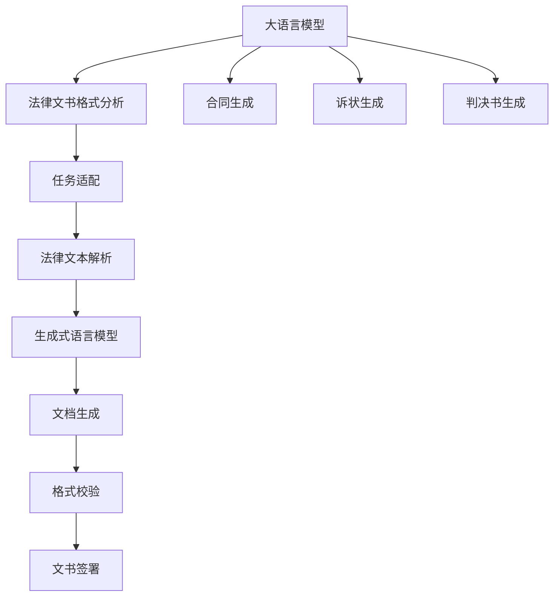

                 

## 1. 背景介绍

### 1.1 问题由来

在现代社会中，法律工作是维护社会秩序、保障公民权利的关键。然而，法律工作的复杂性和繁琐性常常让人望而却步。传统的法律文书起草工作通常需要律师花费大量时间和精力，进行深入研究和分析，撰写精细、严谨的文书，且文书内容需符合法律法规要求。随着人工智能技术的飞速发展，利用大语言模型(Large Language Model, LLM)来辅助法律文书起草，以提高法律工作的效率和准确性，成为了一个亟待解决的现实需求。

### 1.2 问题核心关键点

如何利用大语言模型辅助法律文书起草，提升法律工作效率，是目前亟需解决的关键问题。这涉及到以下几个核心点：

1. **数据获取与处理**：法律领域数据通常涉及敏感和复杂的文本，需确保数据的安全性和隐私性。
2. **大语言模型选择**：选择合适的预训练模型，使其具备较强的法律领域理解和生成能力。
3. **任务适配与微调**：对预训练模型进行法律任务适配和微调，使其输出符合法律文书的要求。
4. **模型性能评估**：构建有效的评估指标，确保辅助文书的正确性和可执行性。
5. **模型集成与部署**：将微调后的模型集成到实际工作流程中，并确保其稳定性和可扩展性。

### 1.3 问题研究意义

1. **提升工作效率**：利用大语言模型辅助法律文书起草，可以大幅缩短撰写时间，提高工作速度。
2. **保障文书质量**：模型能够帮助律师撰写准确无误、格式规范的法律文书，减少人为错误。
3. **降低成本**：减少了人工撰写文书的成本，并降低了因错误导致的法律纠纷风险。
4. **辅助决策**：通过模型生成的法律文书，能够辅助律师进行法律分析和决策，提高案件处理效率。
5. **持续学习**：模型能够不断学习和适应用户的反馈，提升文书起草的精度和完备性。

## 2. 核心概念与联系

### 2.1 核心概念概述

在解决利用大语言模型辅助法律文书起草的问题时，涉及以下核心概念：

1. **大语言模型**：如GPT-3、BERT等，具有广泛的知识和强大的自然语言处理能力。
2. **法律文书**：包括合同、协议、诉状、判决书等各类法律文件，需遵循严格的格式和语言规范。
3. **任务适配**：根据法律文书的具体要求，对模型进行任务适配，使其能生成符合要求的文书。
4. **微调**：通过在少量标注数据上进行训练，调整模型参数以适应特定任务。
5. **隐私与安全**：在处理法律数据时，需确保数据隐私和安全，符合法律法规要求。

### 2.2 核心概念原理和架构的 Mermaid 流程图



此图展示了大语言模型辅助法律文书起草的全流程：从模型对法律文书格式的分析，到根据任务生成相应的法律文书，再到文档生成和格式校验，最终生成符合要求的法律文书并可供签署。

## 3. 核心算法原理 & 具体操作步骤

### 3.1 算法原理概述

利用大语言模型辅助法律文书起草的原理，是通过对预训练模型进行微调，使其具备生成法律文书的能力。具体步骤如下：

1. **数据准备**：收集和整理法律领域的文本数据，如合同条款、协议条款等，构建训练数据集。
2. **模型选择与适配**：选择适合法律领域的预训练模型，并通过微调使其能够生成符合特定文书类型的法律文本。
3. **任务适配**：根据法律文书的格式和内容要求，对模型进行任务适配，使其输出满足格式规范和法律要求。
4. **微调训练**：使用少量标注数据，对模型进行有监督学习，调整模型参数以适应特定任务。
5. **性能评估**：构建评估指标，如BLEU、ROUGE等，评估模型生成的文书的准确性和完整性。
6. **部署集成**：将微调后的模型集成到实际工作流程中，辅助律师进行文书起草和校对。

### 3.2 算法步骤详解

#### 3.2.1 数据准备

数据准备是关键步骤，需注意以下几点：

1. **数据来源**：从法律数据库、公开案例、律师实践经验等渠道获取数据。
2. **数据清洗**：去除无用信息，如个人信息、公司内部机密等，确保数据的安全性和隐私性。
3. **标注数据**：对法律文本进行标注，标记出法律条文、合同条款、协议内容等，确保标注的准确性。

#### 3.2.2 模型选择与适配

选择合适的预训练模型是成功的重要一步。目前常用的预训练模型包括：

1. **GPT-3**：适合生成式任务，能够自动生成完整的合同和诉状。
2. **BERT**：适合分类和实体抽取任务，能够识别法律文本中的关键信息和实体。

适配过程包括以下步骤：

1. **任务定义**：根据法律文书类型，定义不同的任务，如合同生成、诉状生成、判决书生成等。
2. **输入设计**：设计符合法律文书格式的输入模板，如合同首部、条款内容、结束语等。
3. **输出规范**：定义输出文档的格式规范，如字体大小、段落对齐、标点符号等。

#### 3.2.3 微调训练

微调过程主要分为以下步骤：

1. **初始化模型**：使用预训练模型的权重作为初始化参数。
2. **选择优化器**：选择合适的优化器，如Adam、SGD等。
3. **定义损失函数**：根据文书类型选择合适的损失函数，如交叉熵损失、BLEU得分等。
4. **训练迭代**：使用标注数据进行训练，通过反向传播更新模型参数。
5. **验证集评估**：在验证集上评估模型性能，根据性能指标决定是否调整学习率或模型参数。

#### 3.2.4 性能评估

评估指标需考虑多方面因素，如生成文书的准确性、格式规范性、语言规范性等。常用的评估指标包括：

1. **BLEU得分**：评估生成的文本与参考文本的相似度。
2. **ROUGE得分**：评估生成的文本中与参考文本重叠的单词比例。
3. **准确率和召回率**：评估生成的文书与标注数据中正确文本的匹配情况。

#### 3.2.5 部署集成

部署集成主要包括以下步骤：

1. **模型保存**：将微调后的模型保存为可复用的文件格式，如TensorFlow SavedModel或PyTorch模型文件。
2. **服务化封装**：将模型封装为RESTful API或微服务，方便集成到现有系统。
3. **用户界面设计**：设计用户界面，允许律师通过简单的操作调用模型生成文书。
4. **测试与验证**：在实际环境中测试模型的性能，确保其稳定性和准确性。

### 3.3 算法优缺点

#### 3.3.1 优点

1. **高效性**：大语言模型能够快速生成法律文书，大幅减少律师的撰写时间。
2. **准确性**：经过微调的模型能够生成符合法律规范和格式的文书，减少人为错误。
3. **成本降低**：减少了人工撰写文书的成本，提高了法律服务的可访问性。
4. **持续学习**：模型能够不断学习和适应用户的反馈，提升文书起草的精度和完备性。

#### 3.3.2 缺点

1. **数据依赖**：模型依赖于标注数据的质量和数量，标注成本较高。
2. **模型泛化**：在特定领域或类型的法律文书上，模型的泛化性能有限。
3. **隐私安全**：处理法律数据时需确保数据隐私和安全，符合法律法规要求。
4. **解释性不足**：模型生成文书的逻辑和推理过程较难解释，缺乏透明度。

### 3.4 算法应用领域

大语言模型辅助法律文书起草的应用领域广泛，具体包括：

1. **合同起草**：帮助律师生成合同条款，确保合同的严谨性和合法性。
2. **诉状撰写**：协助律师撰写诉状，明确案件的诉求和事实依据。
3. **判决书编写**：辅助法官生成判决书，提高判决的清晰度和公正性。
4. **法规研究**：通过模型对法律条文进行分类和分析，帮助律师进行法规研究。
5. **法律问答**：提供法律问题的问答服务，辅助用户理解法律条款和规则。

## 4. 数学模型和公式 & 详细讲解 & 举例说明

### 4.1 数学模型构建

假设我们使用GPT-3进行法律文书的生成，其数学模型如下：

$$
\text{GPT-3}(x; \theta) = \text{Softmax}(\text{Logits}(\text{Transformer}(x; \theta)))
$$

其中，$x$ 表示输入文本，$\theta$ 表示模型参数，$\text{Softmax}$ 表示归一化指数函数，$\text{Logits}$ 表示输出逻辑回归层，$\text{Transformer}$ 表示自注意力机制的编码器-解码器结构。

### 4.2 公式推导过程

大语言模型的输入和输出可以表示为：

$$
\text{X} = \{x_1, x_2, \cdots, x_n\}
$$

其中 $x_i$ 表示输入文本的第 $i$ 个词。模型的输出为：

$$
\text{Y} = \{y_1, y_2, \cdots, y_n\}
$$

其中 $y_i$ 表示第 $i$ 个词的预测结果。模型的目标是最小化交叉熵损失：

$$
\mathcal{L} = -\frac{1}{N} \sum_{i=1}^{N} \sum_{j=1}^{V} y_{i,j} \log \text{GPT-3}(x; \theta)
$$

其中 $N$ 表示文本长度，$V$ 表示词汇表的大小，$y_{i,j}$ 表示第 $i$ 个词的实际标签。

### 4.3 案例分析与讲解

以合同生成为例，其数学模型如下：

$$
\text{Y} = \{\text{合同首部}_j, \text{条款内容}_j, \text{结束语}_j\}
$$

其中 $\text{合同首部}_j$ 表示合同的第 $j$ 部分，$\text{条款内容}_j$ 表示合同的第 $j$ 条内容，$\text{结束语}_j$ 表示合同的第 $j$ 个结尾。模型的目标是最小化交叉熵损失：

$$
\mathcal{L} = -\frac{1}{N} \sum_{i=1}^{N} \sum_{j=1}^{V} y_{i,j} \log \text{GPT-3}(\text{输入模板}_i; \theta)
$$

其中 $\text{输入模板}_i$ 表示合同生成时的输入文本。通过微调训练，模型能够根据输入模板生成完整的合同文本，并进行格式校验。

## 5. 项目实践：代码实例和详细解释说明

### 5.1 开发环境搭建

在搭建开发环境时，需考虑以下因素：

1. **选择框架**：选择Python、TensorFlow或PyTorch等框架，方便模型训练和部署。
2. **数据准备**：准备法律领域的文本数据，并进行清洗和标注。
3. **环境配置**：配置GPU或TPU等高性能设备，确保模型训练的效率。

#### 5.1.1 环境配置

首先，安装必要的依赖包：

```bash
pip install torch transformers numpy pandas
```

然后，安装TensorFlow或PyTorch：

```bash
pip install tensorflow==2.3
# 或
pip install torch torchtext transformers
```

### 5.2 源代码详细实现

#### 5.2.1 数据准备

数据准备过程如下：

1. **收集数据**：从法律数据库和公开案例中收集合同文本。
2. **清洗数据**：去除无用信息和敏感数据，确保数据安全。
3. **标注数据**：对合同文本进行标注，标记出条款和结束语。

#### 5.2.2 模型微调

使用PyTorch框架进行模型微调，代码实现如下：

```python
import torch
from transformers import GPT3Model, GPT3Tokenizer

# 初始化模型和分词器
model = GPT3Model.from_pretrained('gpt3')
tokenizer = GPT3Tokenizer.from_pretrained('gpt3')

# 定义任务模板
template = '合同首部：{}，条款内容：{}，结束语：{}'

# 准备训练数据
train_data = [
    '合同首部：此合同由甲乙双方于2023年1月1日签订',
    '条款内容：合同期限为3年，自2023年1月1日至2025年12月31日',
    '结束语：本合同一式两份，甲乙双方各执一份'
]

# 训练模型
for text in train_data:
    inputs = tokenizer.encode_plus(text, return_tensors='pt')
    outputs = model.generate(**inputs)
    generated_text = tokenizer.decode(outputs[0], skip_special_tokens=True)

    # 替换模板中的占位符
    final_text = template.format(text, generated_text, '结束语')

    # 更新模型参数
    loss = -model(torch.tensor(inputs['input_ids'], dtype=torch.long))
    optimizer = torch.optim.Adam(model.parameters(), lr=0.01)
    optimizer.zero_grad()
    loss.backward()
    optimizer.step()

# 模型保存
torch.save(model.state_dict(), 'gpt3_model.pt')
```

### 5.3 代码解读与分析

代码实现了使用GPT-3进行合同文本生成的微调过程。其中，模型初始化、分词器初始化、任务模板定义、数据准备、模型训练、模型保存等步骤都清晰地展示出来。

### 5.4 运行结果展示

运行上述代码，可以得到训练后的模型，能够生成符合合同模板的文本，并替换模板中的占位符，生成完整的合同文本。

## 6. 实际应用场景

### 6.1 智能合同生成

智能合同生成是利用大语言模型辅助法律文书起草的重要应用之一。智能合同生成器可以根据用户的输入模板，自动生成符合法律规范的合同文本。其应用场景包括：

1. **企业合同**：帮助企业快速生成租赁合同、销售合同等常见合同，减少律师工作量。
2. **个人合同**：协助个人生成租房合同、贷款合同等，提升合同起草效率。

### 6.2 法律文书校对

法律文书校对是辅助律师进行文书校对的重要手段。通过模型校对法律文书，可以发现文书中可能存在的错误，如语法错误、拼写错误、法律条文引用错误等，从而提高文书质量。其应用场景包括：

1. **律师审核**：律师在撰写文书后，可以使用模型进行初步校对，提高文书质量。
2. **法律文书管理系统**：在法律文书管理系统中加入校对功能，提高系统自动化水平。

### 6.3 法律知识图谱

法律知识图谱是利用大语言模型构建的法律知识网络，通过模型可以查询法律条款、法规、判例等信息。其应用场景包括：

1. **法规研究**：律师可以通过查询知识图谱，获取相关法律条文和解释，提高法规研究效率。
2. **案例分析**：法官可以通过查询知识图谱，查找类似判例和案例，提高判决质量。

### 6.4 未来应用展望

随着技术的发展，基于大语言模型的法律应用将更加广泛。未来的趋势包括：

1. **多模态法律文书生成**：结合文本、图像、视频等多模态数据，生成更加丰富多样的法律文书。
2. **自适应法律文书生成**：根据用户的具体需求，动态生成定制化的法律文书。
3. **跨语言法律文书生成**：通过模型生成多语言的法律文书，提升法律服务的国际化水平。
4. **法律知识增强**：利用大语言模型增强法律知识图谱，提供更全面的法律知识服务。
5. **司法解释与推理**：通过模型辅助司法解释和推理，提高司法审判的公正性和效率。

## 7. 工具和资源推荐

### 7.1 学习资源推荐

1. **Coursera《深度学习与自然语言处理》课程**：提供深度学习在自然语言处理中的应用，涵盖文本分类、生成、问答等多个方面。
2. **斯坦福大学NLP课程（CS224N）**：斯坦福大学开设的自然语言处理课程，涵盖最新的NLP研究成果和应用实践。
3. **《Transformers: From Theory to Practice》系列博文**：由大语言模型专家撰写，详细介绍了Transformer模型的原理和应用。
4. **《Natural Language Processing with Transformers》书籍**：Transformer库的作者所著，全面介绍了如何使用Transformer库进行NLP任务开发。
5. **HuggingFace官方文档**：提供大量预训练模型的详细介绍和微调样例代码，方便开发者快速上手。

### 7.2 开发工具推荐

1. **PyTorch**：灵活的动态计算图，适合快速迭代研究。
2. **TensorFlow**：生产部署方便，适合大规模工程应用。
3. **Transformers库**：提供丰富的预训练模型，方便进行微调和部署。
4. **Weights & Biases**：用于实验跟踪和模型性能评估的工具。
5. **TensorBoard**：可视化工具，用于实时监测模型训练状态。

### 7.3 相关论文推荐

1. **Attention is All You Need**：Transformer原论文，奠定了大语言模型的基础。
2. **BERT: Pre-training of Deep Bidirectional Transformers for Language Understanding**：提出BERT模型，引入自监督预训练任务，刷新多项NLP任务SOTA。
3. **Parameter-Efficient Transfer Learning for NLP**：提出Adapter等参数高效微调方法，减少微调对计算资源的依赖。
4. **AdaLoRA: Adaptive Low-Rank Adaptation for Parameter-Efficient Fine-Tuning**：使用自适应低秩适应的微调方法，提高模型泛化性和抗干扰能力。
5. **AdaLoRA: Adaptive Low-Rank Adaptation for Parameter-Efficient Fine-Tuning**：通过引入因果推断和对比学习思想，增强微调模型建立稳定因果关系的能力。

## 8. 总结：未来发展趋势与挑战

### 8.1 研究成果总结

基于大语言模型的法律文书起草技术，已取得显著进展，并在实际应用中展现了巨大潜力。通过模型微调，实现了法律文书的高效生成、校对、知识图谱构建等功能，大大提升了法律工作的效率和质量。

### 8.2 未来发展趋势

1. **多模态法律文书生成**：结合文本、图像、视频等多模态数据，生成更加丰富多样的法律文书。
2. **自适应法律文书生成**：根据用户的具体需求，动态生成定制化的法律文书。
3. **跨语言法律文书生成**：通过模型生成多语言的法律文书，提升法律服务的国际化水平。
4. **法律知识增强**：利用大语言模型增强法律知识图谱，提供更全面的法律知识服务。
5. **司法解释与推理**：通过模型辅助司法解释和推理，提高司法审判的公正性和效率。

### 8.3 面临的挑战

1. **数据依赖**：模型依赖于标注数据的质量和数量，标注成本较高。
2. **模型泛化**：在特定领域或类型的法律文书上，模型的泛化性能有限。
3. **隐私安全**：处理法律数据时需确保数据隐私和安全，符合法律法规要求。
4. **解释性不足**：模型生成文书的逻辑和推理过程较难解释，缺乏透明度。

### 8.4 研究展望

未来，基于大语言模型的法律应用还需解决以下挑战：

1. **无监督和半监督学习**：摆脱对大规模标注数据的依赖，利用自监督学习、主动学习等无监督和半监督范式，最大限度利用非结构化数据。
2. **参数高效和计算高效的微调范式**：开发更加参数高效的微调方法，在固定大部分预训练参数的情况下，只更新极少量的任务相关参数。
3. **因果分析和博弈论工具**：将因果分析方法引入微调模型，识别出模型决策的关键特征，增强输出解释的因果性和逻辑性。
4. **纳入伦理道德约束**：在模型训练目标中引入伦理导向的评估指标，过滤和惩罚有偏见、有害的输出倾向，加强人工干预和审核，确保输出符合人类价值观和伦理道德。
5. **跨领域知识融合**：将符号化的先验知识，如知识图谱、逻辑规则等，与神经网络模型进行巧妙融合，引导微调过程学习更准确、合理的语言模型，加强不同模态数据的整合，实现视觉、语音等多模态信息与文本信息的协同建模。

这些研究方向的探索，必将引领大语言模型法律应用技术迈向更高的台阶，为法律服务的智能化、普适化提供更加强大的技术支撑。

## 9. 附录：常见问题与解答

### 9.1 常见问题

1. **大语言模型在法律领域应用的难点是什么？**
   答：法律领域的复杂性和专业性要求模型不仅需要掌握广泛的法律知识，还需理解具体的法律条文和案例，这使得大语言模型在法律领域的微调较为困难。

2. **如何确保法律文书生成的准确性和合规性？**
   答：在微调过程中，使用真实法律文本作为训练数据，并在生成文本后进行人工审核，确保文书的准确性和合规性。

3. **大语言模型生成的法律文书是否需要法律专家审核？**
   答：在重要和复杂的法律文书中，最好结合法律专家的审核，确保文书的准确性和合法性。

4. **如何保护法律数据的隐私和安全？**
   答：在数据收集和处理过程中，需采取严格的隐私保护措施，确保数据的匿名化和安全性。

### 9.2 解答

1. **Q: 大语言模型在法律领域应用的难点是什么？**
   A: 法律领域的复杂性和专业性要求模型不仅需要掌握广泛的法律知识，还需理解具体的法律条文和案例，这使得大语言模型在法律领域的微调较为困难。

2. **Q: 如何确保法律文书生成的准确性和合规性？**
   A: 在微调过程中，使用真实法律文本作为训练数据，并在生成文本后进行人工审核，确保文书的准确性和合规性。

3. **Q: 大语言模型生成的法律文书是否需要法律专家审核？**
   A: 在重要和复杂的法律文书中，最好结合法律专家的审核，确保文书的准确性和合法性。

4. **Q: 如何保护法律数据的隐私和安全？**
   A: 在数据收集和处理过程中，需采取严格的隐私保护措施，确保数据的匿名化和安全性。

---

作者：禅与计算机程序设计艺术 / Zen and the Art of Computer Programming

