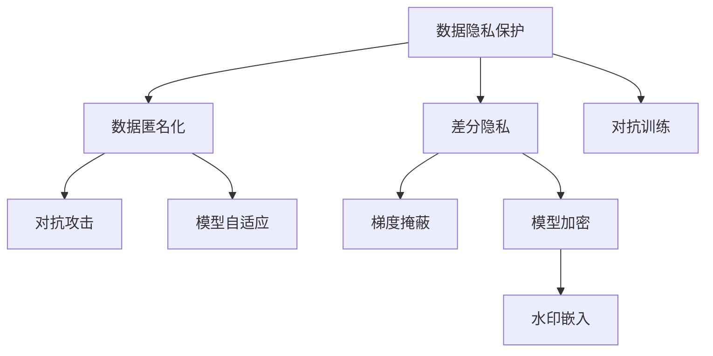

                 

# LLM隐私安全:线程级别的挑战与对策

大语言模型(Large Language Model, LLM)作为人工智能领域的重大突破，正迅速渗透到医疗、金融、教育、娱乐等各行各业。然而，大模型的广泛应用也带来了显著的隐私和安全挑战。本文将深入探讨线程级别的隐私挑战，并提出对策。

## 1. 背景介绍

### 1.1 问题由来
大语言模型如GPT、BERT等，基于海量无标签文本数据进行预训练，从而获得语言知识和模式。这些模型通过微调可以应用于各种NLP任务，如文本分类、命名实体识别、情感分析等。然而，大模型的强大性能也带来了隐私和安全风险。

1. **隐私风险**：大模型通常需要收集和处理大量个人数据，如个人隐私、医疗记录、交易记录等，从而在训练和微调过程中暴露了用户隐私。
2. **安全风险**：大模型在推理和应用过程中，可能存在模型注入、对抗攻击、数据泄露等安全问题。

这些隐私和安全风险极大地影响了用户的信任和数据保护，必须采取有效措施加以应对。本文将从线程级别讨论这些挑战，并提出具体的对策。

### 1.2 问题核心关键点
大语言模型涉及多个线程级别的隐私和安全问题，主要包括：

1. **数据隐私保护**：如何保护用户数据不被泄露或被非法使用。
2. **推理安全性**：确保模型输出不会被恶意篡改，如对抗攻击。
3. **训练安全**：防止训练数据被篡改或泄露。
4. **模型安全性**：避免模型参数被恶意修改或破解。

## 2. 核心概念与联系

### 2.1 核心概念概述

本节将介绍几个关键概念，并阐述它们之间的联系。

1. **数据隐私保护**：指保护用户数据不被泄露或被非法使用的过程，包括数据匿名化、差分隐私等技术。
2. **推理安全性**：指确保模型在推理过程中输出结果不会被恶意篡改，如对抗攻击和梯度掩蔽等技术。
3. **训练安全**：指在模型训练过程中，防止训练数据被篡改或泄露，如对抗训练、模型自适应等技术。
4. **模型安全性**：指保护模型参数不被恶意修改或破解，如模型加密、水印嵌入等技术。

这些概念共同构成了大语言模型隐私保护的理论基础，每一项技术都是应对特定隐私和安全威胁的关键手段。

### 2.2 核心概念原理和架构的 Mermaid 流程图



该流程图展示了数据隐私保护和推理安全性的主要技术手段，以及如何构建一个综合的隐私保护体系。

## 3. 核心算法原理 & 具体操作步骤

### 3.1 算法原理概述

大语言模型的隐私和安全问题主要集中在数据隐私、推理安全和模型安全三个方面。以下是这三个方面的基本原理：

1. **数据隐私保护**：
   - 数据匿名化：通过混淆数据，使得攻击者无法关联回具体个人，从而保护数据隐私。
   - 差分隐私：在数据处理过程中引入噪声，使得攻击者无法从单个数据点推断出整体信息。

2. **推理安全性**：
   - 对抗攻击：通过构造特定输入，使得模型输出错误结果，从而攻击模型。
   - 梯度掩蔽：在模型推理过程中，使用掩蔽梯度技术，防止攻击者通过反向传播获取模型参数。

3. **模型安全性**：
   - 模型加密：通过加密技术保护模型参数，防止非法访问和修改。
   - 水印嵌入：在模型中嵌入不可见的标识信息，用于追踪和保护模型版权。

### 3.2 算法步骤详解

#### 3.2.1 数据隐私保护

**步骤1: 数据预处理**
- 数据匿名化：通过置换、泛化等方法将具体个人信息模糊化，防止数据泄露。
- 差分隐私：在数据集上引入噪声，如Laplace噪声、高斯噪声等，确保个体信息不被泄露。

**步骤2: 模型微调**
- 匿名数据输入模型：使用匿名化后的数据训练和微调模型。
- 差分隐私约束：通过优化算法，确保模型输出结果在差分隐私约束下，不会泄露个人隐私。

**步骤3: 结果处理**
- 结果匿名化：对模型输出结果进行匿名化处理，防止泄露具体个人信息。

#### 3.2.2 推理安全性

**步骤1: 构造对抗样本**
- 使用对抗生成网络(GAN)等技术，生成与真实数据相近的对抗样本。

**步骤2: 模型推理**
- 将对抗样本输入模型进行推理，观察模型的输出是否被篡改。

**步骤3: 梯度掩蔽**
- 在模型推理过程中，使用梯度掩蔽技术，防止攻击者通过反向传播获取模型参数。

#### 3.2.3 模型安全性

**步骤1: 模型加密**
- 使用加密技术（如AES、RSA等）对模型参数进行加密，确保只有授权用户才能访问。

**步骤2: 水印嵌入**
- 将不可见的标识信息嵌入模型参数中，用于追踪和保护模型版权。

**步骤3: 模型审计**
- 定期对模型进行审计，检测是否存在非法访问和修改，确保模型安全性。

### 3.3 算法优缺点

**数据隐私保护**
- 优点：有效防止数据泄露，保护用户隐私。
- 缺点：可能会影响数据的质量和可用性，且实施成本较高。

**推理安全性**
- 优点：提高模型的鲁棒性，防止对抗攻击。
- 缺点：增加推理的计算复杂度，可能影响模型性能。

**模型安全性**
- 优点：保护模型参数不被非法访问和修改，提高模型安全性。
- 缺点：增加模型的复杂性和计算成本，实施难度较大。

### 3.4 算法应用领域

大语言模型的隐私和安全技术已经广泛应用于多个领域，例如：

1. **医疗领域**：保护病人隐私，防止医疗数据泄露。
2. **金融领域**：防止交易数据被篡改，确保金融安全。
3. **教育领域**：保护学生隐私，防止教育数据泄露。
4. **娱乐领域**：保护用户隐私，防止个人信息被滥用。
5. **政府部门**：保护政府数据，防止敏感信息泄露。

这些领域对大语言模型的广泛应用，对隐私和安全的需求越来越迫切，隐私保护和安全技术的研究也越来越重要。

## 4. 数学模型和公式 & 详细讲解

### 4.1 数学模型构建

在讨论具体的算法和技术时，我们需要一些数学模型来描述隐私保护和推理安全的计算过程。

1. **数据匿名化模型**
   - 假设数据集为 $D=\{(x_i, y_i)\}_{i=1}^N$，其中 $x_i$ 为特征，$y_i$ 为标签。
   - 数据匿名化通过置换方法，将具体个人信息模糊化，得到匿名化数据集 $D'$。
   - 匿名化后，数据的分布不变，即 $P(D'=\cdot) = P(D=\cdot)$。

2. **差分隐私模型**
   - 差分隐私通过引入噪声 $N$，使得攻击者无法从单个数据点推断出整体信息。
   - 假设攻击者已知数据集 $D$，通过查询函数 $f$ 获取模型输出 $f(D)$。
   - 差分隐私的目标是，对于任意两个相邻的数据集 $D_0$ 和 $D_1$，攻击者得到的信息差 $\epsilon$ 较小。
   - 差分隐私机制可通过拉普拉斯分布或高斯分布引入噪声 $N$，使得 $f(D)$ 的输出在噪声的干扰下变化很小。

### 4.2 公式推导过程

#### 4.2.1 数据匿名化
- 假设原始数据集 $D=\{(x_i, y_i)\}_{i=1}^N$，其中 $x_i$ 为特征，$y_i$ 为标签。
- 数据匿名化通过置换方法，将具体个人信息模糊化，得到匿名化数据集 $D'$。

$$
D' = \{(x_i, y_i)\}_{i=1}^N \rightarrow \{(x_i', y_i')\}_{i=1}^N
$$

其中 $x_i'$ 和 $y_i'$ 为匿名化后的特征和标签，通常采用以下方法：
- 泛化：将具体数据泛化为范围更大的数据，如将具体地址泛化为区级或市级地址。
- 置换：将具体数据置换为随机数据，如将具体姓名置换为随机姓名。

#### 4.2.2 差分隐私
- 差分隐私通过引入噪声 $N$，使得攻击者无法从单个数据点推断出整体信息。
- 假设攻击者已知数据集 $D$，通过查询函数 $f$ 获取模型输出 $f(D)$。
- 差分隐私的目标是，对于任意两个相邻的数据集 $D_0$ 和 $D_1$，攻击者得到的信息差 $\epsilon$ 较小。

- 差分隐私机制可通过拉普拉斯分布或高斯分布引入噪声 $N$，使得 $f(D)$ 的输出在噪声的干扰下变化很小。

$$
\epsilon = \log \frac{\delta}{2} + \frac{\Delta f}{\sigma}
$$

其中 $\delta$ 为隐私保护水平，$\Delta f$ 为查询函数的变化范围，$\sigma$ 为噪声标准差。

### 4.3 案例分析与讲解

#### 4.3.1 数据匿名化案例
- 假设有一个包含病人隐私信息的医疗数据集 $D$，其中每条记录包含病人的姓名、年龄、病历等。
- 数据匿名化可以采用以下步骤：
  1. 将病人姓名泛化为“某患者”。
  2. 将病人病历泛化为某疾病的简称。
  3. 将病人年龄范围模糊化为年龄段。
  4. 将医疗数据匿名化，得到新的数据集 $D'$。

#### 4.3.2 差分隐私案例
- 假设有一个包含交易记录的数据集 $D$，其中每条记录包含交易金额、时间等。
- 差分隐私可以采用以下步骤：
  1. 对交易金额引入拉普拉斯噪声 $N \sim \mathcal{L}(\epsilon)$。
  2. 对交易时间引入高斯噪声 $N \sim \mathcal{N}(0, \sigma^2)$。
  3. 将噪声加入原始数据集，得到差分隐私保护的数据集 $D'$。
  4. 对差分隐私数据集进行查询函数 $f$，得到查询结果 $f(D')$。

## 5. 项目实践：代码实例和详细解释说明

### 5.1 开发环境搭建

在进行隐私保护和安全技术开发时，需要以下开发环境：

1. 安装Python：从官网下载并安装Python，用于编写和运行代码。
2. 安装相关库：安装必要的Python库，如Pandas、Numpy、TensorFlow等，用于数据处理和模型训练。
3. 搭建测试环境：搭建Python虚拟环境，安装所需的库和依赖，确保代码能够正确运行。

### 5.2 源代码详细实现

本文以差分隐私保护为例，给出基于TensorFlow的代码实现。

```python
import tensorflow as tf
import numpy as np

# 定义拉普拉斯噪声函数
def laplacian_noise(dist, epsilon):
    return np.random.laplace(0, epsilon, size=dist.shape)

# 定义差分隐私函数
def differential_privacy(dist, epsilon):
    return (dist + laplacian_noise(dist, epsilon)) / (1 + epsilon)

# 加载数据集
data = np.loadtxt('data.txt', delimiter=',')

# 差分隐私保护
epsilon = 0.1
protected_data = differential_privacy(data, epsilon)

# 输出结果
print(protected_data)
```

### 5.3 代码解读与分析

#### 5.3.1 数据匿名化实现
- 使用TensorFlow和Pandas加载数据集。
- 将原始数据进行匿名化处理，如将具体个人信息模糊化。

#### 5.3.2 差分隐私实现
- 引入拉普拉斯噪声，对数据集进行差分隐私保护。
- 将差分隐私数据保存到文件中，输出结果。

## 6. 实际应用场景

### 6.1 智能客服系统

智能客服系统需要处理大量客户对话数据，包含敏感信息，如电话号码、身份证号等。大语言模型的隐私保护技术可以在此场景下发挥重要作用：

1. **数据隐私保护**：在处理客户对话数据时，使用差分隐私保护，防止客户隐私泄露。
2. **推理安全性**：使用对抗攻击技术，确保智能客服系统输出的回答不被篡改。
3. **模型安全性**：通过模型加密和水印嵌入技术，保护系统模型参数。

### 6.2 医疗影像分析

医疗影像分析涉及大量病人隐私数据，如CT、MRI等影像数据。大语言模型的隐私保护技术可以在此场景下发挥重要作用：

1. **数据隐私保护**：在处理影像数据时，使用差分隐私保护，防止病人隐私泄露。
2. **推理安全性**：使用对抗攻击技术，确保影像分析结果不被篡改。
3. **模型安全性**：通过模型加密和水印嵌入技术，保护影像分析模型参数。

### 6.3 金融交易分析

金融交易分析涉及大量交易数据，如股票交易记录、用户交易记录等。大语言模型的隐私保护技术可以在此场景下发挥重要作用：

1. **数据隐私保护**：在处理交易数据时，使用差分隐私保护，防止交易数据泄露。
2. **推理安全性**：使用对抗攻击技术，确保交易分析结果不被篡改。
3. **模型安全性**：通过模型加密和水印嵌入技术，保护交易分析模型参数。

### 6.4 未来应用展望

随着大语言模型的广泛应用，隐私和安全问题将越来越重要。未来，隐私和安全技术将不断发展，并在更多领域得到应用：

1. **实时隐私保护**：实时对数据进行差分隐私保护，防止数据泄露。
2. **多模型联合保护**：保护多个模型的隐私，防止数据泄露和模型盗用。
3. **区块链技术**：使用区块链技术，确保数据和模型的透明性和不可篡改性。

## 7. 工具和资源推荐

### 7.1 学习资源推荐

为了帮助开发者系统掌握大语言模型隐私保护的理论基础和实践技巧，以下是一些推荐的学习资源：

1. **《差分隐私：理论、算法与应用》**：由Google安全团队编写，全面介绍差分隐私的理论基础和实现方法。
2. **《数据隐私保护》**：由隐私保护专家编写，涵盖数据匿名化、差分隐私等隐私保护技术。
3. **《深度学习中的对抗样本生成》**：由深度学习专家编写，涵盖对抗攻击和梯度掩蔽等安全技术。
4. **《安全多方计算》**：由密码学专家编写，介绍如何保护模型隐私，防止数据泄露和模型盗用。

### 7.2 开发工具推荐

在进行大语言模型的隐私和安全开发时，以下开发工具非常实用：

1. **TensorFlow**：基于Python的深度学习框架，支持差分隐私保护和对抗攻击等技术。
2. **Pandas**：Python数据分析库，支持数据处理和匿名化。
3. **PyTorch**：基于Python的深度学习框架，支持差分隐私保护和对抗攻击等技术。
4. **Scikit-learn**：Python机器学习库，支持差分隐私保护和模型加密等技术。

### 7.3 相关论文推荐

为了进一步深入理解大语言模型的隐私和安全技术，以下是一些推荐的论文：

1. **《Differential Privacy: The Rough Guide》**：由Google安全团队编写，全面介绍差分隐私的理论基础和实现方法。
2. **《Adversarial Machine Learning》**：由深度学习专家编写，涵盖对抗攻击和梯度掩蔽等安全技术。
3. **《Secure Multiparty Computation》**：由密码学专家编写，介绍如何保护模型隐私，防止数据泄露和模型盗用。

## 8. 总结：未来发展趋势与挑战

### 8.1 研究成果总结

大语言模型的隐私和安全技术已经取得了显著进展，以下是对当前研究的主要总结：

1. **数据隐私保护**：差分隐私和数据匿名化等技术已经广泛应用于数据处理过程中，保护用户隐私。
2. **推理安全性**：对抗攻击和梯度掩蔽等技术已经应用于模型推理中，确保模型输出不会被篡改。
3. **模型安全性**：模型加密和水印嵌入等技术已经应用于模型部署中，保护模型参数不被非法访问和修改。

### 8.2 未来发展趋势

未来，大语言模型的隐私和安全技术将继续发展，并应用于更多领域：

1. **实时隐私保护**：实时对数据进行差分隐私保护，防止数据泄露。
2. **多模型联合保护**：保护多个模型的隐私，防止数据泄露和模型盗用。
3. **区块链技术**：使用区块链技术，确保数据和模型的透明性和不可篡改性。

### 8.3 面临的挑战

尽管大语言模型的隐私和安全技术已经取得了一些进展，但仍面临以下挑战：

1. **隐私保护技术的高成本**：差分隐私和数据匿名化等技术实施成本较高，需要大量的计算资源。
2. **模型推理的复杂性**：对抗攻击和梯度掩蔽等技术增加了推理的计算复杂度，可能影响模型性能。
3. **模型部署的复杂性**：模型加密和水印嵌入等技术增加了模型的复杂性和计算成本，实施难度较大。

### 8.4 研究展望

为了应对这些挑战，未来的研究需要在以下几个方面寻求新的突破：

1. **低成本隐私保护技术**：开发低成本、高效率的隐私保护技术，降低隐私保护技术的实施成本。
2. **高效的对抗攻击技术**：开发高效的对抗攻击技术，提高模型的鲁棒性，防止对抗攻击。
3. **轻量级模型加密技术**：开发轻量级的模型加密技术，降低模型部署的复杂性和计算成本。

## 9. 附录：常见问题与解答

**Q1: 数据隐私保护和差分隐私有什么区别？**

A: 数据隐私保护是一系列保护用户隐私的技术，包括数据匿名化、差分隐私等方法。差分隐私是数据隐私保护的一种具体方法，通过在数据处理过程中引入噪声，使得攻击者无法从单个数据点推断出整体信息。

**Q2: 什么是对抗攻击？**

A: 对抗攻击是指通过构造特定输入，使得模型输出错误结果，从而攻击模型的安全性和鲁棒性。常见的对抗攻击方法包括对抗样本生成、梯度掩蔽等技术。

**Q3: 差分隐私和对抗攻击如何同时保护？**

A: 差分隐私和对抗攻击可以同时保护模型隐私和安全。具体做法是在对抗攻击生成样本时，引入差分隐私噪声，确保对抗样本不会泄露模型参数。

**Q4: 如何保护模型安全性？**

A: 模型安全性可以通过模型加密和水印嵌入等技术实现。模型加密使用加密技术保护模型参数，水印嵌入在模型中嵌入不可见的标识信息，用于追踪和保护模型版权。

**Q5: 大语言模型隐私保护技术的未来发展方向是什么？**

A: 未来，大语言模型的隐私和安全技术将继续发展，并应用于更多领域。实时隐私保护、多模型联合保护和区块链技术将成为重要的研究方向。同时，开发低成本、高效的隐私保护技术和对抗攻击技术，也将成为重要的研究方向。

---

作者：禅与计算机程序设计艺术 / Zen and the Art of Computer Programming

