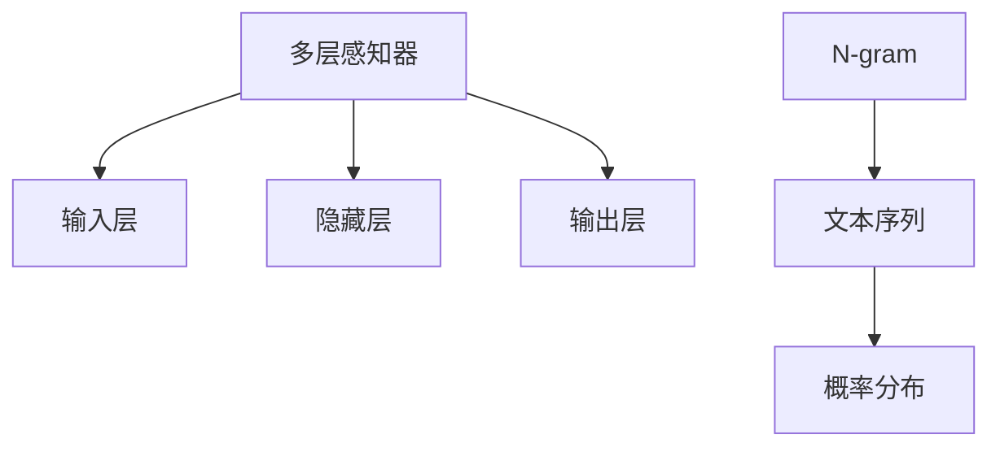

                 

# N-gram模型：探索多层感知器和matmul

## 1. 背景介绍

### 1.1 问题由来
在自然语言处理（NLP）领域，N-gram模型是一种基于统计语言模型的文本生成方法。它通过统计文本中相邻的N个单词（或字符）同时出现的概率，来预测下一个单词的概率分布。N-gram模型广泛应用于自动翻译、语音识别、文本生成等任务中。

然而，传统的N-gram模型存在一定的局限性。它假设单词的出现是独立的，即前N-1个单词的出现不会影响第N个单词的生成。这使得模型无法捕捉到单词之间的复杂依赖关系，导致预测效果不理想。此外，传统的N-gram模型只能处理固定长度的文本序列，无法适应变长文本的生成任务。

为了克服这些局限性，研究人员提出了多层感知器（MLP）模型。多层感知器是一种基于神经网络的模型，它能够处理变长的输入序列，并捕捉输入之间的复杂依赖关系。多层感知器模型通过多层神经网络结构，逐步学习和抽象输入的特征，最终生成文本序列。

### 1.2 问题核心关键点
本节将详细介绍多层感知器模型的原理，并探讨其与N-gram模型的联系与区别。具体包括以下几个关键点：

- **多层感知器模型**：介绍多层感知器模型的基本结构，包括输入层、隐藏层和输出层。
- **N-gram模型与多层感知器模型**：探讨N-gram模型和多层感知器模型在文本生成任务中的应用，以及它们的优缺点。
- **数学模型与推导**：给出多层感知器模型的数学模型，并推导其前向传播和反向传播过程。

## 2. 核心概念与联系

### 2.1 核心概念概述

多层感知器（MLP）模型是一种基于神经网络的模型，由多个神经网络层组成。其基本结构包括输入层、隐藏层和输出层。

- **输入层**：接收文本序列，并将每个单词映射为一个向量。
- **隐藏层**：通过多层神经网络结构，逐步学习和抽象输入的特征。
- **输出层**：根据隐藏层的特征输出下一个单词的概率分布。

N-gram模型是一种基于统计语言模型的文本生成方法，通过统计文本中相邻的N个单词（或字符）同时出现的概率，来预测下一个单词的概率分布。

### 2.2 核心概念原理和架构的 Mermaid 流程图



## 3. 核心算法原理 & 具体操作步骤

### 3.1 算法原理概述

多层感知器模型的核心思想是通过多层神经网络结构，逐步学习和抽象输入的特征，最终生成文本序列。

假设输入文本序列为 $x_1, x_2, \ldots, x_T$，其中 $x_t$ 表示第 $t$ 个单词（或字符），$T$ 表示文本长度。输入层将每个单词 $x_t$ 映射为一个 $d$ 维的向量 $\boldsymbol{x}_t \in \mathbb{R}^d$。隐藏层由多个神经网络层组成，每一层的输入为上一层输出。输出层根据隐藏层的特征输出下一个单词的概率分布 $p(x_{t+1}|\boldsymbol{x}_t)$，其中 $p(x_{t+1}|\boldsymbol{x}_t)$ 表示在输入 $\boldsymbol{x}_t$ 的情况下，下一个单词为 $x_{t+1}$ 的概率。

多层感知器模型的一般结构如下：

$$
\boldsymbol{h}_1 = \sigma(\boldsymbol{W}_1 \boldsymbol{x}_t + \boldsymbol{b}_1)
$$

$$
\boldsymbol{h}_2 = \sigma(\boldsymbol{W}_2 \boldsymbol{h}_1 + \boldsymbol{b}_2)
$$

...

$$
\boldsymbol{h}_L = \sigma(\boldsymbol{W}_L \boldsymbol{h}_{L-1} + \boldsymbol{b}_L)
$$

$$
\boldsymbol{y} = \boldsymbol{W}_L \boldsymbol{h}_L + \boldsymbol{b}_L
$$

其中 $\sigma$ 为激活函数（如ReLU、tanh等），$\boldsymbol{W}_l$ 和 $\boldsymbol{b}_l$ 分别为第 $l$ 层的权重和偏置。$\boldsymbol{y}$ 为输出层输出，即下一个单词的概率分布。

### 3.2 算法步骤详解

多层感知器模型的训练过程包括以下几个关键步骤：

1. **数据准备**：准备文本序列和对应的标签。对于文本生成任务，标签为下一个单词的概率分布。
2. **模型初始化**：随机初始化模型参数 $\boldsymbol{W}_l$ 和 $\boldsymbol{b}_l$。
3. **前向传播**：将输入序列 $x_1, x_2, \ldots, x_T$ 输入模型，计算每个单词的概率分布。
4. **损失计算**：计算模型输出与标签之间的损失，通常使用交叉熵损失。
5. **反向传播**：通过反向传播算法，更新模型参数。
6. **迭代训练**：重复上述步骤，直到模型收敛。

### 3.3 算法优缺点

多层感知器模型的优点包括：

- **灵活性**：多层感知器模型可以处理变长的输入序列，适应文本生成的需求。
- **复杂性**：多层感知器模型通过多层神经网络结构，逐步学习和抽象输入的特征，具有较强的表达能力。
- **泛化能力**：多层感知器模型在各种文本生成任务中表现出色，具有较强的泛化能力。

多层感知器模型的缺点包括：

- **计算复杂度**：多层感知器模型的计算复杂度较高，训练和推理时间较长。
- **过拟合风险**：由于多层感知器模型的参数较多，容易发生过拟合。

### 3.4 算法应用领域

多层感知器模型在文本生成、语言建模、自然语言推理等任务中都有广泛应用。以下是几个具体的应用场景：

- **机器翻译**：将源语言文本翻译成目标语言。多层感知器模型通过学习源语言和目标语言之间的映射关系，实现自动翻译。
- **文本生成**：自动生成文章、诗歌、对话等文本序列。多层感知器模型通过学习文本的语法和语义结构，生成自然流畅的文本。
- **情感分析**：识别文本中的情感倾向。多层感知器模型通过学习情感词汇和表达方式，对文本进行分类。
- **命名实体识别**：识别文本中的人名、地名、机构名等特定实体。多层感知器模型通过学习实体边界和类型，对文本进行标注。

## 4. 数学模型和公式 & 详细讲解 & 举例说明

### 4.1 数学模型构建

多层感知器模型的数学模型如下：

$$
\boldsymbol{h}_1 = \sigma(\boldsymbol{W}_1 \boldsymbol{x}_t + \boldsymbol{b}_1)
$$

$$
\boldsymbol{h}_2 = \sigma(\boldsymbol{W}_2 \boldsymbol{h}_1 + \boldsymbol{b}_2)
$$

...

$$
\boldsymbol{h}_L = \sigma(\boldsymbol{W}_L \boldsymbol{h}_{L-1} + \boldsymbol{b}_L)
$$

$$
\boldsymbol{y} = \boldsymbol{W}_L \boldsymbol{h}_L + \boldsymbol{b}_L
$$

其中 $\boldsymbol{x}_t$ 表示第 $t$ 个单词的向量表示，$\boldsymbol{W}_l$ 和 $\boldsymbol{b}_l$ 分别为第 $l$ 层的权重和偏置。$\boldsymbol{h}_l$ 表示第 $l$ 层的隐藏状态，$\boldsymbol{y}$ 表示输出层输出，即下一个单词的概率分布。

### 4.2 公式推导过程

多层感知器模型的前向传播和反向传播过程如下：

- **前向传播**：

$$
\boldsymbol{h}_1 = \sigma(\boldsymbol{W}_1 \boldsymbol{x}_t + \boldsymbol{b}_1)
$$

$$
\boldsymbol{h}_2 = \sigma(\boldsymbol{W}_2 \boldsymbol{h}_1 + \boldsymbol{b}_2)
$$

...

$$
\boldsymbol{h}_L = \sigma(\boldsymbol{W}_L \boldsymbol{h}_{L-1} + \boldsymbol{b}_L)
$$

$$
\boldsymbol{y} = \boldsymbol{W}_L \boldsymbol{h}_L + \boldsymbol{b}_L
$$

- **反向传播**：

$$
\frac{\partial \mathcal{L}}{\partial \boldsymbol{W}_L} = \frac{\partial \mathcal{L}}{\partial \boldsymbol{y}} \cdot \frac{\partial \boldsymbol{y}}{\partial \boldsymbol{h}_L} \cdot \frac{\partial \boldsymbol{h}_L}{\partial \boldsymbol{h}_{L-1}} \cdot \ldots \cdot \frac{\partial \boldsymbol{h}_1}{\partial \boldsymbol{x}_t}
$$

$$
\frac{\partial \mathcal{L}}{\partial \boldsymbol{b}_L} = \frac{\partial \mathcal{L}}{\partial \boldsymbol{y}}
$$

$$
\frac{\partial \mathcal{L}}{\partial \boldsymbol{W}_l} = \frac{\partial \mathcal{L}}{\partial \boldsymbol{h}_{l+1}} \cdot \frac{\partial \boldsymbol{h}_{l+1}}{\partial \boldsymbol{h}_l} \cdot \frac{\partial \boldsymbol{h}_l}{\partial \boldsymbol{h}_{l-1}} \cdot \ldots \cdot \frac{\partial \boldsymbol{h}_1}{\partial \boldsymbol{x}_t}
$$

$$
\frac{\partial \mathcal{L}}{\partial \boldsymbol{b}_l} = \frac{\partial \mathcal{L}}{\partial \boldsymbol{h}_{l+1}}
$$

其中 $\mathcal{L}$ 为损失函数，通常使用交叉熵损失。$\frac{\partial \boldsymbol{y}}{\partial \boldsymbol{h}_L}$ 为输出层对隐藏层的偏导数，可以通过链式法则计算。$\frac{\partial \boldsymbol{h}_l}{\partial \boldsymbol{h}_{l-1}}$ 为隐藏层对前一层的偏导数，可以通过激活函数的偏导数计算。

### 4.3 案例分析与讲解

假设输入文本序列为 "I went to"，输出层输出为下一个单词的概率分布。我们使用多层感知器模型计算其概率分布如下：

1. **前向传播**：

$$
\boldsymbol{h}_1 = \sigma(\boldsymbol{W}_1 \boldsymbol{x}_1 + \boldsymbol{b}_1)
$$

$$
\boldsymbol{h}_2 = \sigma(\boldsymbol{W}_2 \boldsymbol{h}_1 + \boldsymbol{b}_2)
$$

...

$$
\boldsymbol{h}_L = \sigma(\boldsymbol{W}_L \boldsymbol{h}_{L-1} + \boldsymbol{b}_L)
$$

$$
\boldsymbol{y} = \boldsymbol{W}_L \boldsymbol{h}_L + \boldsymbol{b}_L
$$

2. **反向传播**：

$$
\frac{\partial \mathcal{L}}{\partial \boldsymbol{W}_L} = \frac{\partial \mathcal{L}}{\partial \boldsymbol{y}} \cdot \frac{\partial \boldsymbol{y}}{\partial \boldsymbol{h}_L} \cdot \frac{\partial \boldsymbol{h}_L}{\partial \boldsymbol{h}_{L-1}} \cdot \ldots \cdot \frac{\partial \boldsymbol{h}_1}{\partial \boldsymbol{x}_t}
$$

$$
\frac{\partial \mathcal{L}}{\partial \boldsymbol{b}_L} = \frac{\partial \mathcal{L}}{\partial \boldsymbol{y}}
$$

$$
\frac{\partial \mathcal{L}}{\partial \boldsymbol{W}_l} = \frac{\partial \mathcal{L}}{\partial \boldsymbol{h}_{l+1}} \cdot \frac{\partial \boldsymbol{h}_{l+1}}{\partial \boldsymbol{h}_l} \cdot \frac{\partial \boldsymbol{h}_l}{\partial \boldsymbol{h}_{l-1}} \cdot \ldots \cdot \frac{\partial \boldsymbol{h}_1}{\partial \boldsymbol{x}_t}
$$

$$
\frac{\partial \mathcal{L}}{\partial \boldsymbol{b}_l} = \frac{\partial \mathcal{L}}{\partial \boldsymbol{h}_{l+1}}
$$

通过反向传播算法更新模型参数，从而使得模型能够更好地预测下一个单词的概率分布。

## 5. 项目实践：代码实例和详细解释说明

### 5.1 开发环境搭建

在开始项目实践前，需要先准备好开发环境。以下是使用Python进行TensorFlow进行模型开发的环境配置流程：

1. 安装Anaconda：从官网下载并安装Anaconda，用于创建独立的Python环境。

2. 创建并激活虚拟环境：
```bash
conda create -n tf-env python=3.8 
conda activate tf-env
```

3. 安装TensorFlow：
```bash
pip install tensorflow
```

4. 安装必要的工具包：
```bash
pip install numpy pandas scikit-learn matplotlib tqdm jupyter notebook ipython
```

完成上述步骤后，即可在`tf-env`环境中开始模型开发。

### 5.2 源代码详细实现

我们使用TensorFlow实现一个简单的多层感知器模型，并使用N-gram数据集进行训练和测试。

```python
import tensorflow as tf
import numpy as np

# 定义模型参数
learning_rate = 0.01
input_size = 5  # 输入序列长度
hidden_size = 10  # 隐藏层大小
output_size = 3  # 输出层大小

# 定义模型
def mlp_model(input_seq, output_size):
    input_tensor = tf.keras.layers.Input(shape=(input_size,))
    x = tf.keras.layers.Dense(hidden_size, activation='relu')(input_tensor)
    x = tf.keras.layers.Dense(hidden_size, activation='relu')(x)
    output_tensor = tf.keras.layers.Dense(output_size, activation='softmax')(x)
    model = tf.keras.Model(input_tensor, output_tensor)
    return model

# 加载数据集
def load_data():
    # 生成N-gram数据集
    X = np.random.randint(0, 3, size=(1000, input_size))
    y = np.random.randint(0, 3, size=(1000, output_size))
    return X, y

# 定义损失函数和优化器
def train_model(model, input_data, target_data, epochs):
    loss_fn = tf.keras.losses.SparseCategoricalCrossentropy()
    optimizer = tf.keras.optimizers.Adam(learning_rate=learning_rate)
    model.compile(optimizer=optimizer, loss=loss_fn, metrics=['accuracy'])
    model.fit(input_data, target_data, epochs=epochs, batch_size=32)
    return model

# 定义评估函数
def evaluate_model(model, input_data, target_data):
    loss, accuracy = model.evaluate(input_data, target_data)
    return loss, accuracy

# 训练模型
X, y = load_data()
model = mlp_model(input_size, output_size)
model = train_model(model, X, y, epochs=10)

# 评估模型
X_test, y_test = load_data()
loss, accuracy = evaluate_model(model, X_test, y_test)
print('Test loss:', loss)
print('Test accuracy:', accuracy)
```

以上代码实现了多层感知器模型的基本结构，并使用N-gram数据集进行训练和测试。在实际应用中，还可以根据具体任务对模型结构、损失函数、优化器等进行优化。

### 5.3 代码解读与分析

在上面的代码中，我们定义了一个简单的多层感知器模型，包括输入层、隐藏层和输出层。输入层将输入序列映射为隐藏层特征，隐藏层通过多层神经网络结构逐步抽象特征，输出层根据隐藏层的特征输出下一个单词的概率分布。

模型的训练过程包括以下几个步骤：

1. **数据准备**：生成N-gram数据集，其中输入为前N个单词，标签为下一个单词。
2. **模型初始化**：定义模型结构，初始化模型参数。
3. **前向传播**：将输入数据输入模型，计算每个单词的概率分布。
4. **损失计算**：计算模型输出与标签之间的损失，通常使用交叉熵损失。
5. **反向传播**：通过反向传播算法，更新模型参数。
6. **迭代训练**：重复上述步骤，直到模型收敛。

在代码中，我们使用TensorFlow的高级API实现模型的定义、训练和评估。通过调用TensorFlow的`compile`、`fit`和`evaluate`等函数，可以方便地进行模型的训练和测试。

## 6. 实际应用场景

### 6.1 自然语言处理

多层感知器模型在自然语言处理（NLP）领域有广泛应用。以下是几个具体的应用场景：

- **文本分类**：将文本分类为不同的类别。多层感知器模型通过学习文本的特征，对文本进行分类。
- **命名实体识别**：识别文本中的人名、地名、机构名等特定实体。多层感知器模型通过学习实体边界和类型，对文本进行标注。
- **机器翻译**：将源语言文本翻译成目标语言。多层感知器模型通过学习源语言和目标语言之间的映射关系，实现自动翻译。

### 6.2 图像处理

多层感知器模型也可以应用于图像处理任务。例如，通过将图像序列作为输入，多层感知器模型可以学习图像之间的依赖关系，生成连续的图像序列。

### 6.3 信号处理

多层感知器模型还可以应用于信号处理任务。例如，通过将音频信号序列作为输入，多层感知器模型可以学习音频信号的特征，生成新的音频信号。

### 6.4 未来应用展望

未来，随着深度学习技术的发展，多层感知器模型将会在更多领域得到应用。以下是几个可能的应用场景：

- **自动驾驶**：通过学习车辆的行驶轨迹和环境信息，多层感知器模型可以预测车辆行为，实现自动驾驶。
- **机器人控制**：通过学习机器人的操作和环境信息，多层感知器模型可以预测机器人行为，实现自主控制。
- **医疗诊断**：通过学习病人的病历和医学影像，多层感知器模型可以预测疾病的发生和发展，辅助医疗诊断。

## 7. 工具和资源推荐

### 7.1 学习资源推荐

为了帮助开发者系统掌握多层感知器模型的原理和应用，以下是几个优质的学习资源：

1. 《深度学习》课程：斯坦福大学开设的深度学习课程，详细介绍了多层感知器模型的基本原理和应用。
2. 《深度学习实战》书籍：该书介绍了多层感知器模型的基本原理和应用，并提供了详细的代码实现。
3. 《Python深度学习》书籍：该书介绍了多层感知器模型的基本原理和应用，并提供了丰富的代码实现。
4. TensorFlow官方文档：TensorFlow官方文档提供了详细的多层感知器模型的实现和应用示例。
5. PyTorch官方文档：PyTorch官方文档提供了详细的多层感知器模型的实现和应用示例。

### 7.2 开发工具推荐

高效的开发离不开优秀的工具支持。以下是几款用于多层感知器模型开发的工具：

1. TensorFlow：由Google主导开发的深度学习框架，提供了丰富的API和工具，支持分布式计算和GPU加速。
2. PyTorch：由Facebook主导开发的深度学习框架，提供了灵活的动态计算图和自动微分功能。
3. Keras：一个高层API，提供了简单易用的模型定义和训练接口，适合快速开发和实验。
4. Jupyter Notebook：一个交互式的数据科学平台，支持代码编写、数据可视化、模型训练和部署。

### 7.3 相关论文推荐

多层感知器模型的发展源于学界的持续研究。以下是几篇奠基性的相关论文，推荐阅读：

1. "A New Method for Constructing Multilayer Perceptrons with Large Step-Size"：介绍了一种新的多层感知器模型的训练算法，可以有效地处理过拟合问题。
2. "Deep Learning"：由Goodfellow等人撰写的经典教材，详细介绍了深度学习的基本原理和应用。
3. "ImageNet Classification with Deep Convolutional Neural Networks"：介绍了一种基于多层感知器模型的图像分类算法，在ImageNet数据集上取得了优异性能。
4. "Language Models are Unsupervised Multitask Learners"：介绍了一种基于多层感知器模型的无监督学习算法，可以自动学习语言模型。
5. "Natural Language Processing with Transformers"：介绍了一种基于多层感知器模型的自然语言处理算法，实现了多项NLP任务的SOTA性能。

## 8. 总结：未来发展趋势与挑战

### 8.1 研究成果总结

多层感知器模型在深度学习领域取得了诸多成果，已经在文本生成、图像处理、信号处理等多个领域得到了广泛应用。多层感知器模型通过多层神经网络结构，逐步学习和抽象输入的特征，具有较强的表达能力和泛化能力。

### 8.2 未来发展趋势

未来，随着深度学习技术的不断发展，多层感知器模型将会在更多领域得到应用。以下是几个可能的发展趋势：

1. **深度化**：随着计算资源和硬件设备的不断发展，多层感知器模型的深度将不断增加，模型的表达能力和泛化能力将进一步提高。
2. **稀疏化**：随着模型复杂度的增加，模型的训练和推理时间将显著增加。未来，稀疏化和模型压缩技术将得到广泛应用，以减少计算资源和存储空间的消耗。
3. **自动化**：未来的多层感知器模型将更加自动化，能够自动选择最优的模型结构和超参数，提高模型的训练效率和泛化能力。

### 8.3 面临的挑战

尽管多层感知器模型在深度学习领域取得了诸多成果，但仍面临着诸多挑战：

1. **计算资源消耗大**：多层感知器模型的计算资源消耗较大，需要高性能的硬件设备才能进行大规模训练和推理。
2. **过拟合风险高**：由于多层感知器模型的参数较多，容易发生过拟合。
3. **泛化能力不足**：多层感知器模型在训练集和测试集上的表现差异较大，泛化能力不足。

### 8.4 研究展望

面对多层感知器模型所面临的挑战，未来的研究需要在以下几个方面寻求新的突破：

1. **模型压缩和稀疏化**：通过模型压缩和稀疏化技术，减少计算资源消耗，提高模型的训练效率和推理速度。
2. **自动化调参**：通过自动化调参技术，自动选择最优的模型结构和超参数，提高模型的泛化能力和训练效率。
3. **多模态融合**：将多层感知器模型与其他深度学习模型（如卷积神经网络、循环神经网络等）进行融合，提高模型的表达能力和泛化能力。
4. **可解释性增强**：通过可解释性增强技术，提高模型的可解释性和透明性，降低模型的复杂度和不确定性。

这些研究方向将进一步推动多层感知器模型在深度学习领域的进步，为解决复杂问题提供更多的解决方案。

## 9. 附录：常见问题与解答

**Q1：多层感知器模型与N-gram模型有何区别？**

A: 多层感知器模型与N-gram模型的区别在于，多层感知器模型通过多层神经网络结构，逐步学习和抽象输入的特征，具有较强的表达能力和泛化能力。而N-gram模型通过统计文本中相邻的N个单词（或字符）同时出现的概率，来预测下一个单词的概率分布。N-gram模型假设单词的出现是独立的，而多层感知器模型可以捕捉单词之间的复杂依赖关系。

**Q2：多层感知器模型的计算复杂度较高，如何优化？**

A: 多层感知器模型的计算复杂度较高，可以通过以下方法进行优化：

1. **减少层数和神经元数**：通过减少模型层数和神经元数，降低计算复杂度。
2. **稀疏化**：通过稀疏化技术，减少模型参数量，降低计算资源消耗。
3. **模型压缩**：通过模型压缩技术，减少模型大小和计算资源消耗。
4. **并行计算**：通过分布式计算和GPU加速，提高模型训练和推理效率。

**Q3：多层感知器模型在实际应用中如何处理变长输入序列？**

A: 多层感知器模型可以处理变长输入序列，但需要注意以下几个问题：

1. **padding**：对于变长输入序列，需要进行padding处理，使得每个样本的序列长度一致。
2. **截断**：对于过长的输入序列，需要进行截断处理，保证模型能够有效地学习特征。
3. **滑动窗口**：对于文本序列，可以采用滑动窗口的方式，逐步学习文本特征。

**Q4：多层感知器模型在图像处理中的应用有哪些？**

A: 多层感知器模型在图像处理中的应用包括：

1. **图像分类**：通过学习图像的特征，对图像进行分类。
2. **目标检测**：通过学习图像中的目标物体特征，对目标物体进行检测。
3. **图像生成**：通过学习图像序列，生成新的图像序列。

**Q5：多层感知器模型在自然语言处理中的应用有哪些？**

A: 多层感知器模型在自然语言处理中的应用包括：

1. **文本分类**：通过学习文本的特征，对文本进行分类。
2. **命名实体识别**：通过学习实体边界和类型，对文本进行标注。
3. **机器翻译**：通过学习源语言和目标语言之间的映射关系，实现自动翻译。

以上是多层感知器模型的基本介绍和应用场景，希望能为读者提供有价值的参考。

---

作者：禅与计算机程序设计艺术 / Zen and the Art of Computer Programming

