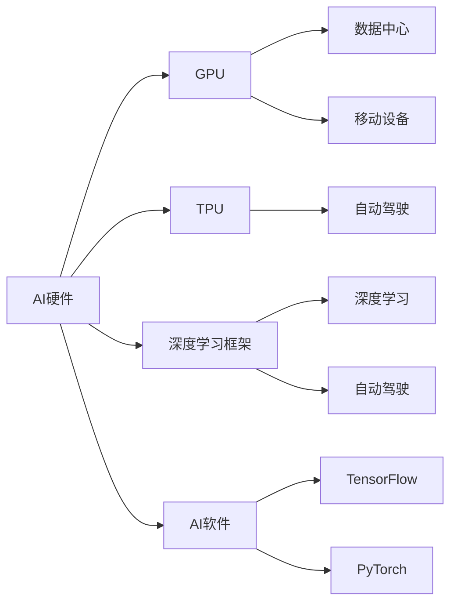

                 

# Nvidia在AI领域的主导地位

## 1. 背景介绍

近年来，人工智能(AI)技术飞速发展，深刻改变了各行各业的运作方式。AI技术以其强大的计算能力、灵活的算法应用和广阔的市场前景，成为全球竞争的焦点。作为全球领先的AI硬件和软件提供商，Nvidia在AI领域的主导地位日益突出，其产品和服务在全球范围内广泛应用，推动了AI技术的普及和创新。本文将从Nvidia的技术优势、应用领域、发展战略等方面，深入探讨其在全球AI领域的主导地位。

## 2. 核心概念与联系

### 2.1 核心概念概述

- **Nvidia**：全球领先的AI硬件和软件提供商，以高性能计算平台、图形处理器(GPU)、人工智能训练系统等为核心产品，广泛应用于数据中心、移动设备、自动驾驶、游戏等多个领域。
- **AI硬件**：主要包括GPU、TPU等高性能计算平台，提供强大的计算能力，加速AI模型的训练和推理。
- **AI软件**：包括深度学习框架如TensorFlow、PyTorch等，提供灵活的开发工具和算法支持，推动AI应用落地。
- **深度学习**：基于神经网络的机器学习技术，通过大规模数据训练模型，实现复杂模式的识别与预测。
- **自动驾驶**：结合传感器、定位系统、AI算法等技术，实现汽车在复杂环境下的自主导航。

这些核心概念构成了Nvidia在AI领域的主导地位，其产品和解决方案在全球范围内得到了广泛应用和认可。

### 2.2 核心概念原理和架构的 Mermaid 流程图



## 3. 核心算法原理 & 具体操作步骤

### 3.1 算法原理概述

Nvidia在AI领域的主导地位，得益于其在AI硬件和软件方面的持续创新。其核心算法原理主要包括以下几个方面：

- **高性能计算**：Nvidia的GPU和TPU提供了强大的计算能力，能够快速处理大规模数据集，加速AI模型的训练和推理。
- **灵活的深度学习框架**：通过TensorFlow、PyTorch等深度学习框架，支持多种AI算法和模型架构，满足不同应用场景的需求。
- **丰富的AI应用场景**：Nvidia的产品和服务广泛应用于数据中心、移动设备、自动驾驶、游戏等多个领域，推动了AI技术的普及和创新。

### 3.2 算法步骤详解

Nvidia在AI领域的算法步骤主要包括：

1. **硬件设计**：设计高性能计算平台，包括GPU和TPU等，提供强大的计算能力。
2. **软件研发**：研发深度学习框架，提供灵活的开发工具和算法支持。
3. **产品发布**：发布GPU、TPU等硬件设备以及TensorFlow、PyTorch等深度学习框架。
4. **市场推广**：通过全球销售渠道和合作伙伴，将产品推向市场，提供广泛的技术支持和应用案例。
5. **持续创新**：持续研发新技术和新产品，推动AI技术的不断进步。

### 3.3 算法优缺点

Nvidia在AI领域的算法具有以下优点：

- **高性能计算**：GPU和TPU提供了强大的计算能力，能够快速处理大规模数据集，加速AI模型的训练和推理。
- **灵活的深度学习框架**：TensorFlow、PyTorch等框架支持多种AI算法和模型架构，满足不同应用场景的需求。
- **广泛的应用场景**：应用于数据中心、移动设备、自动驾驶、游戏等多个领域，推动了AI技术的普及和创新。

同时，Nvidia的算法也存在以下缺点：

- **高成本**：高性能计算平台和深度学习框架的开发和维护成本较高，不适合所有企业。
- **依赖硬件**：AI应用依赖于高性能计算平台，硬件的局限性可能会限制AI算法的应用范围。
- **生态系统复杂**：深度学习框架和AI应用场景的多样性，使得Nvidia的生态系统较为复杂，用户学习和使用门槛较高。

### 3.4 算法应用领域

Nvidia在AI领域的应用领域主要包括以下几个方面：

- **数据中心**：提供高性能计算平台，加速大数据和深度学习的处理。
- **移动设备**：通过GPU加速，提升移动设备的计算能力和应用体验。
- **自动驾驶**：提供高性能计算和深度学习技术，实现汽车在复杂环境下的自主导航。
- **游戏**：提供高性能GPU和深度学习技术，提升游戏的图形处理和渲染效果。
- **科学研究**：支持生物信息学、天文学等领域的高性能计算需求。

## 4. 数学模型和公式 & 详细讲解 & 举例说明

### 4.1 数学模型构建

在深度学习中，常用的数学模型包括神经网络、卷积神经网络(CNN)、循环神经网络(RNN)等。这里以神经网络为例，构建数学模型。

设神经网络包含n个隐层，每个隐层包含m个神经元。输入向量为 $x$，输出向量为 $y$。神经网络的数学模型可以表示为：

$$
y = f(\sum_{i=1}^{m}w_i x_i + b)
$$

其中，$w$ 为权重矩阵，$b$ 为偏置向量，$f$ 为激活函数，如sigmoid、ReLU等。

### 4.2 公式推导过程

以神经网络为例，推导其梯度下降优化过程。设损失函数为 $L(y, \hat{y})$，其中 $y$ 为真实标签，$\hat{y}$ 为模型预测结果。则梯度下降的优化目标为：

$$
\theta = \mathop{\arg\min}_{\theta} L(y, \hat{y})
$$

根据链式法则，求出损失函数对权重矩阵 $w$ 和偏置向量 $b$ 的梯度：

$$
\frac{\partial L}{\partial w_i} = \frac{\partial L}{\partial y} \frac{\partial y}{\partial w_i}
$$

$$
\frac{\partial L}{\partial b} = \frac{\partial L}{\partial y}
$$

将 $y$ 和 $\hat{y}$ 的表达式代入上述公式，即可求出梯度下降优化算法中的参数更新规则。

### 4.3 案例分析与讲解

以图像识别任务为例，说明深度学习模型的构建和优化过程。假设输入为图像像素向量，输出为分类标签。首先，通过卷积神经网络提取图像特征，然后通过全连接层进行分类预测。将模型在标注数据集上进行训练，使用交叉熵损失函数进行优化。

```python
import tensorflow as tf
from tensorflow.keras import layers

model = tf.keras.Sequential([
    layers.Conv2D(32, (3,3), activation='relu', input_shape=(28,28,1)),
    layers.MaxPooling2D((2,2)),
    layers.Flatten(),
    layers.Dense(10, activation='softmax')
])

model.compile(optimizer='adam', loss='categorical_crossentropy', metrics=['accuracy'])

model.fit(train_images, train_labels, epochs=10, validation_data=(test_images, test_labels))
```

在训练过程中，通过交叉熵损失函数和Adam优化器，模型逐渐优化参数，提升分类准确率。

## 5. 项目实践：代码实例和详细解释说明

### 5.1 开发环境搭建

Nvidia在AI领域的项目实践需要高性能计算平台和深度学习框架的支持。以下是开发环境的搭建步骤：

1. **安装Nvidia GPU驱动程序**：根据Nvidia官网提供的安装指南，下载并安装最新的GPU驱动程序。
2. **安装Nvidia CUDA SDK**：从Nvidia官网下载CUDA SDK，安装并配置环境变量。
3. **安装TensorFlow、PyTorch等框架**：通过pip安装TensorFlow、PyTorch等深度学习框架，配置依赖库。

### 5.2 源代码详细实现

以下是使用TensorFlow框架进行图像分类任务的代码实现：

```python
import tensorflow as tf
from tensorflow.keras import layers

model = tf.keras.Sequential([
    layers.Conv2D(32, (3,3), activation='relu', input_shape=(28,28,1)),
    layers.MaxPooling2D((2,2)),
    layers.Flatten(),
    layers.Dense(10, activation='softmax')
])

model.compile(optimizer='adam', loss='categorical_crossentropy', metrics=['accuracy'])

model.fit(train_images, train_labels, epochs=10, validation_data=(test_images, test_labels))
```

### 5.3 代码解读与分析

上述代码实现了卷积神经网络对图像进行分类的过程。具体步骤如下：

1. **模型定义**：定义包含卷积层、池化层、全连接层的神经网络模型。
2. **编译模型**：指定优化器、损失函数和评估指标，编译模型。
3. **训练模型**：通过训练数据集进行模型训练，验证集用于评估模型性能。

## 6. 实际应用场景

Nvidia在AI领域的应用场景非常广泛，以下是几个典型案例：

### 6.1 数据中心

Nvidia的GPU和TPU在数据中心中广泛应用于深度学习模型的训练和推理。大型科技公司如Google、Facebook、Amazon等都在其数据中心中使用了Nvidia的硬件设备，推动了AI技术的快速发展。

### 6.2 自动驾驶

Nvidia的自动驾驶技术通过高性能计算和深度学习算法，实现了汽车在复杂环境下的自主导航。其最新的Autopilot系统已经广泛应用于特斯拉等自动驾驶汽车中，推动了自动驾驶技术的发展。

### 6.3 游戏

Nvidia的高性能GPU和深度学习技术在游戏领域中得到了广泛应用。其GeForce系列显卡已经广泛应用于PC和移动设备中，提升了游戏的图形处理和渲染效果。

### 6.4 未来应用展望

Nvidia在AI领域的应用展望非常广阔，以下是几个未来方向：

- **边缘计算**：通过边缘计算平台，将高性能计算能力部署到移动设备中，实现实时数据处理和分析。
- **AI芯片**：研发更高效、更节能的AI芯片，进一步提升计算能力。
- **多模态AI**：结合视觉、语音、文本等多种模态数据，构建更全面、更智能的AI应用。
- **AI伦理**：通过技术手段和伦理监管，保障AI应用的安全性和公平性。

## 7. 工具和资源推荐

### 7.1 学习资源推荐

为了帮助开发者掌握Nvidia的AI技术和应用，以下是一些推荐的资源：

- **Nvidia官方文档**：提供详细的硬件和软件使用指南，包括NVIDIA CUDA、NVIDIA cuDNN、NVIDIA NCCL等。
- **TensorFlow官方文档**：提供深度学习框架的详细文档和使用示例。
- **PyTorch官方文档**：提供深度学习框架的详细文档和使用示例。
- **Coursera课程**：提供Nvidia深度学习和自动驾驶相关的在线课程。

### 7.2 开发工具推荐

Nvidia在AI领域的应用需要高性能计算平台和深度学习框架的支持。以下是一些推荐的开发工具：

- **NVIDIA CUDA**：提供高性能计算平台的支持，加速深度学习的训练和推理。
- **NVIDIA cuDNN**：提供深度学习算法的优化支持，提升模型计算效率。
- **TensorFlow**：提供深度学习框架的灵活性和可扩展性。
- **PyTorch**：提供深度学习框架的易用性和高效性。

### 7.3 相关论文推荐

以下是几篇Nvidia在AI领域的重要论文，推荐阅读：

- **Deep Learning with NVIDIA GPUs**：介绍NVIDIA GPU在深度学习中的优势和应用。
- **The Four Pillars of AI**：阐述NVIDIA在AI领域的四项核心能力。
- **NVIDIA Autopilot**：介绍NVIDIA自动驾驶技术的发展和应用。

## 8. 总结：未来发展趋势与挑战

### 8.1 研究成果总结

Nvidia在AI领域的研究成果主要包括以下几个方面：

- **高性能计算平台**：通过GPU和TPU等高性能计算平台，提供强大的计算能力，加速深度学习的训练和推理。
- **深度学习框架**：研发TensorFlow、PyTorch等深度学习框架，提供灵活的开发工具和算法支持。
- **广泛的应用场景**：应用于数据中心、自动驾驶、游戏等多个领域，推动了AI技术的普及和创新。

### 8.2 未来发展趋势

Nvidia在AI领域的发展趋势主要包括以下几个方面：

- **边缘计算**：将高性能计算能力部署到移动设备中，实现实时数据处理和分析。
- **AI芯片**：研发更高效、更节能的AI芯片，进一步提升计算能力。
- **多模态AI**：结合视觉、语音、文本等多种模态数据，构建更全面、更智能的AI应用。
- **AI伦理**：通过技术手段和伦理监管，保障AI应用的安全性和公平性。

### 8.3 面临的挑战

Nvidia在AI领域面临的挑战主要包括以下几个方面：

- **高成本**：高性能计算平台和深度学习框架的开发和维护成本较高，不适合所有企业。
- **生态系统复杂**：深度学习框架和AI应用场景的多样性，使得Nvidia的生态系统较为复杂，用户学习和使用门槛较高。
- **技术竞争**：Nvidia在AI领域面临着来自Google、AMD等竞争对手的激烈竞争。

### 8.4 研究展望

Nvidia在AI领域的研究展望主要包括以下几个方面：

- **AI芯片创新**：研发更高效、更节能的AI芯片，提升计算能力。
- **边缘计算优化**：优化边缘计算平台，提升实时数据处理和分析能力。
- **多模态AI融合**：结合视觉、语音、文本等多种模态数据，构建更智能的AI应用。
- **AI伦理监管**：通过技术手段和伦理监管，保障AI应用的安全性和公平性。

## 9. 附录：常见问题与解答

**Q1：Nvidia的GPU和TPU在数据中心中如何应用？**

A: Nvidia的GPU和TPU在数据中心中广泛应用于深度学习模型的训练和推理。通过高性能计算平台，加速大规模数据集的计算，提升深度学习的训练和推理效率。

**Q2：Nvidia的自动驾驶技术如何实现？**

A: Nvidia的自动驾驶技术通过高性能计算和深度学习算法，实现了汽车在复杂环境下的自主导航。通过摄像头、激光雷达等传感器获取环境信息，结合深度学习算法进行路径规划和决策。

**Q3：Nvidia的图像识别任务如何进行训练？**

A: Nvidia的图像识别任务通过卷积神经网络进行训练。使用TensorFlow或PyTorch等深度学习框架，在标注数据集上进行模型训练，使用交叉熵损失函数进行优化。

**Q4：Nvidia在AI领域的研究成果有哪些？**

A: Nvidia在AI领域的研究成果主要包括以下几个方面：高性能计算平台、深度学习框架、广泛的应用场景等。研发了TensorFlow、PyTorch等深度学习框架，应用于数据中心、自动驾驶、游戏等多个领域。

---

作者：禅与计算机程序设计艺术 / Zen and the Art of Computer Programming

