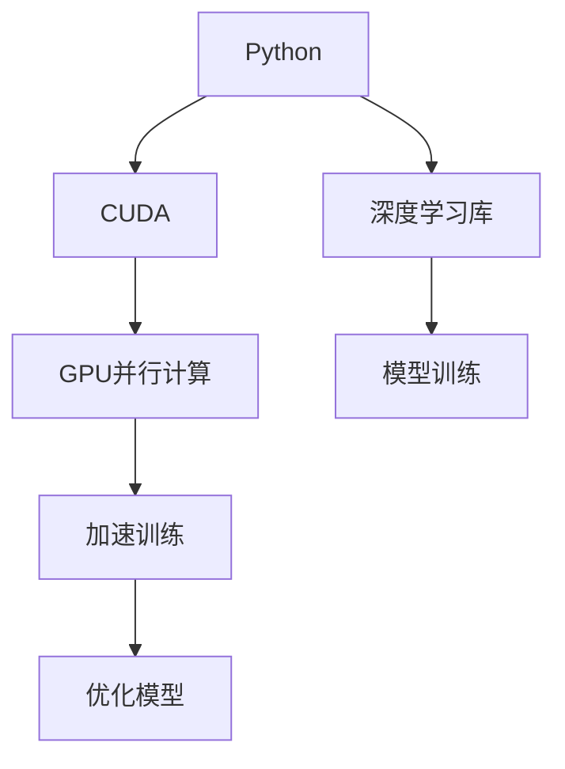

                 

# Python、C和CUDA：从零开始构建AI应用

> 关键词：Python, C, CUDA, 深度学习, 计算机视觉, 自然语言处理, 加速计算

## 1. 背景介绍

### 1.1 问题由来
随着人工智能技术的迅猛发展，深度学习（Deep Learning）成为了推动AI应用的核心动力。深度学习在计算机视觉、自然语言处理、语音识别等领域展现出强大的性能，为各行各业带来了革命性的变革。然而，深度学习的计算复杂度非常高，需要高效、低成本的计算资源支持。传统的CPU计算速度难以满足大规模深度学习模型的需求，因此研究人员和工程师们开始探索在GPU上加速计算的方法，并取得了显著成果。

### 1.2 问题核心关键点
在GPU上加速深度学习计算的核心在于，开发高效的并行计算程序，并利用GPU特有的硬件架构特点，提升计算性能。同时，需要优化模型结构，降低计算复杂度，以适应GPU并行计算的需求。

本文将从Python、C和CUDA三者结合的角度，探讨如何构建高性能的AI应用。通过在GPU上利用CUDA进行并行计算，同时结合Python的高效编程特性，可有效提升深度学习的计算速度和效率。

### 1.3 问题研究意义
开发高性能的AI应用，对提升深度学习的计算效率、降低计算成本、加速AI技术的落地应用具有重要意义。特别是在计算机视觉、自然语言处理等领域，高效的AI应用能够显著提升算法的精度和速度，为用户带来更好的体验和应用效果。

## 2. 核心概念与联系

### 2.1 核心概念概述

为更好地理解Python、C和CUDA结合构建AI应用的方法，本节将介绍几个关键概念：

- Python：一种高级编程语言，以其简洁、易学、易用著称，广泛应用于科学计算、数据分析、机器学习等领域。
- C：一种低级编程语言，以其高效、灵活、控制能力强而著称，是开发高性能计算程序的首选。
- CUDA：NVIDIA推出的并行计算平台和编程模型，专为GPU设计，能够显著提升计算效率。

### 2.2 核心概念原理和架构的 Mermaid 流程图



这个流程图展示了Python、C和CUDA三者结合构建AI应用的基本流程：

1. 使用Python和深度学习库进行模型设计。
2. 在GPU上使用CUDA进行并行计算，加速模型训练。
3. 通过CUDA提供的优化工具，优化模型结构，提升计算效率。
4. 构建高性能的AI应用，为用户提供更好的体验。

## 3. 核心算法原理 & 具体操作步骤
### 3.1 算法原理概述

在GPU上使用CUDA进行并行计算的核心思想，是将计算任务分解成多个子任务，通过并行处理这些子任务，提升计算效率。具体来说，CUDA提供了多个并行编程模型和工具，如CUDA C++、CUDA Python等，可方便地实现并行计算。

结合Python的高效编程特性，可以灵活地设计模型结构，使用深度学习库（如TensorFlow、PyTorch等）进行模型训练，通过CUDA进行并行计算，优化计算效率。

### 3.2 算法步骤详解

基于Python、C和CUDA构建AI应用的一般流程如下：

**Step 1: 环境搭建**

- 安装Python：可以从官网下载安装Python，并进行环境配置，安装必要的依赖库。
- 安装CUDA：从NVIDIA官网下载安装CUDA工具包，并进行配置。
- 安装CUDA Python：通过pip安装CUDA Python库，即可在Python中使用CUDA进行并行计算。

**Step 2: 编写Python代码**

- 使用Python和深度学习库进行模型设计和训练。
- 编写Python代码，使用CUDA函数进行并行计算。
- 使用CUDA提供的优化工具，对模型进行优化，提升计算效率。

**Step 3: 运行和优化**

- 在GPU上运行Python代码，利用CUDA进行并行计算。
- 通过CUDA的调试工具，对代码进行调试和优化，提升计算效率。
- 不断优化模型结构和算法，提高计算速度和精度。

### 3.3 算法优缺点

结合Python、C和CUDA构建AI应用，具有以下优点：

1. Python的高效编程特性，使得模型设计更加灵活。
2. CUDA的高性能计算能力，显著提升模型训练速度。
3. 结合Python和CUDA，能够实现高效、灵活的并行计算。
4. 通过CUDA提供的优化工具，能够对模型进行精细化的优化。

同时，也存在一些缺点：

1. Python的运行效率不如C语言，可能导致代码运行速度较慢。
2. CUDA的并行计算需要一定的编程技巧，难度较大。
3. 结合Python、C和CUDA的开发过程较为复杂，需要一定的技术积累。

### 3.4 算法应用领域

基于Python、C和CUDA构建AI应用，广泛应用于计算机视觉、自然语言处理、语音识别等领域：

- 计算机视觉：利用卷积神经网络（CNN）进行图像分类、目标检测等任务，通过CUDA进行并行计算，提升计算速度。
- 自然语言处理：使用循环神经网络（RNN）、长短期记忆网络（LSTM）等模型进行文本生成、情感分析等任务，通过CUDA进行并行计算，提升计算效率。
- 语音识别：使用深度神经网络（DNN）进行语音识别，通过CUDA进行并行计算，提高识别速度和精度。

## 4. 数学模型和公式 & 详细讲解 & 举例说明

### 4.1 数学模型构建

在构建AI应用时，需要设计合适的数学模型，以便进行高效的并行计算。以卷积神经网络（CNN）为例，其数学模型如下：

$$
y = W \cdot x + b
$$

其中，$W$为卷积核矩阵，$x$为输入数据，$y$为输出数据，$b$为偏置向量。

### 4.2 公式推导过程

通过将卷积操作分解成多个小卷积操作，可以实现并行计算。具体推导如下：

- 输入数据$x$被分解成多个小块$x_i$，每个小块进行卷积操作。
- 卷积核$W$也被分解成多个小块$W_i$，每个小块进行卷积操作。
- 输出数据$y$被合并成最终结果。

通过并行计算，可以显著提升卷积神经网络的计算效率。

### 4.3 案例分析与讲解

以图像分类任务为例，可以使用卷积神经网络进行特征提取和分类。具体步骤如下：

1. 输入数据$x$被卷积核$W$进行卷积操作，生成特征图$y_1$。
2. 特征图$y_1$经过池化层（Pooling Layer）进行特征提取，生成特征图$y_2$。
3. 特征图$y_2$经过全连接层（Fully Connected Layer）进行分类，生成最终结果$y$。

通过CUDA进行并行计算，可以显著提升卷积神经网络的计算速度和效率。

## 5. 项目实践：代码实例和详细解释说明
### 5.1 开发环境搭建

在使用Python、C和CUDA进行AI应用开发时，需要配置好开发环境。以下是一个基本的开发环境搭建流程：

1. 安装Python：可以从官网下载安装Python，并进行环境配置，安装必要的依赖库。
2. 安装CUDA：从NVIDIA官网下载安装CUDA工具包，并进行配置。
3. 安装CUDA Python：通过pip安装CUDA Python库，即可在Python中使用CUDA进行并行计算。
4. 安装深度学习库：如TensorFlow、PyTorch等，用于模型设计和训练。

### 5.2 源代码详细实现

以下是一个简单的图像分类任务的Python代码实现，使用CUDA进行并行计算：

```python
import tensorflow as tf
import numpy as np
from tensorflow.keras import layers, models

# 定义卷积神经网络模型
model = models.Sequential([
    layers.Conv2D(32, (3, 3), activation='relu', input_shape=(28, 28, 1)),
    layers.MaxPooling2D((2, 2)),
    layers.Conv2D(64, (3, 3), activation='relu'),
    layers.MaxPooling2D((2, 2)),
    layers.Conv2D(64, (3, 3), activation='relu'),
    layers.Flatten(),
    layers.Dense(64, activation='relu'),
    layers.Dense(10)
])

# 编译模型
model.compile(optimizer='adam', loss=tf.keras.losses.SparseCategoricalCrossentropy(from_logits=True), metrics=['accuracy'])

# 加载数据集
(x_train, y_train), (x_test, y_test) = tf.keras.datasets.mnist.load_data()

# 数据预处理
x_train = x_train.astype('float32') / 255
x_test = x_test.astype('float32') / 255

# 将数据转换为CUDA张量
x_train = tf.convert_to_tensor(x_train)
x_test = tf.convert_to_tensor(x_test)

# 将标签转换为CUDA张量
y_train = tf.convert_to_tensor(y_train)
y_test = tf.convert_to_tensor(y_test)

# 将数据和标签迁移到GPU
with tf.device('/device:GPU:0'):
    x_train = tf.gpu_device_functions.cast(x_train, tf.float32)
    x_test = tf.gpu_device_functions.cast(x_test, tf.float32)
    y_train = tf.gpu_device_functions.cast(y_train, tf.int32)
    y_test = tf.gpu_device_functions.cast(y_test, tf.int32)

# 训练模型
model.fit(x_train, y_train, epochs=5, batch_size=64, validation_data=(x_test, y_test))

# 评估模型
model.evaluate(x_test, y_test, batch_size=64)
```

在这个代码中，我们定义了一个简单的卷积神经网络模型，使用TensorFlow进行模型设计和训练。同时，我们将数据和标签转换为CUDA张量，并在GPU上训练和评估模型。

### 5.3 代码解读与分析

让我们详细解读一下关键代码的实现细节：

**模型定义**

- `layers.Conv2D`：定义卷积层，使用32个3x3大小的卷积核进行卷积操作。
- `layers.MaxPooling2D`：定义池化层，使用2x2大小的池化窗口进行特征提取。
- `layers.Flatten`：将特征图展开为一维向量。
- `layers.Dense`：定义全连接层，进行分类。

**模型编译**

- `model.compile`：编译模型，指定优化器、损失函数和评价指标。

**数据预处理**

- `x_train = x_train.astype('float32') / 255`：将输入数据归一化到0-1之间。
- `x_test = x_test.astype('float32') / 255`：将测试数据归一化到0-1之间。

**数据迁移**

- `with tf.device('/device:GPU:0')`：将数据迁移到GPU上。
- `tf.gpu_device_functions.cast`：将数据转换为CUDA张量。

**模型训练和评估**

- `model.fit`：在GPU上训练模型。
- `model.evaluate`：在GPU上评估模型。

## 6. 实际应用场景

### 6.1 智能推荐系统

基于Python、C和CUDA构建的智能推荐系统，可以高效地进行用户行为分析和个性化推荐。通过并行计算，可以快速处理大量用户数据，分析用户行为模式，生成个性化的推荐结果。

具体实现流程如下：

1. 收集用户行为数据，包括点击、浏览、购买等行为记录。
2. 使用深度学习模型（如DNN、RNN等）进行用户行为分析。
3. 在GPU上使用CUDA进行并行计算，提升计算效率。
4. 根据分析结果，生成个性化的推荐结果。

### 6.2 自然语言处理

基于Python、C和CUDA构建的自然语言处理应用，可以高效地进行文本分析和生成。通过并行计算，可以快速处理大规模文本数据，分析文本语义，生成自然流畅的文本输出。

具体实现流程如下：

1. 收集文本数据，包括新闻、评论、微博等。
2. 使用深度学习模型（如RNN、LSTM等）进行文本分析和生成。
3. 在GPU上使用CUDA进行并行计算，提升计算效率。
4. 根据分析结果，生成文本输出。

### 6.3 图像处理

基于Python、C和CUDA构建的图像处理应用，可以高效地进行图像分类、目标检测等任务。通过并行计算，可以快速处理大规模图像数据，分析图像特征，生成准确的分类结果。

具体实现流程如下：

1. 收集图像数据，包括图片、视频等。
2. 使用深度学习模型（如CNN、RNN等）进行图像分析和分类。
3. 在GPU上使用CUDA进行并行计算，提升计算效率。
4. 根据分析结果，生成分类结果。

### 6.4 未来应用展望

随着深度学习技术的不断发展，基于Python、C和CUDA构建的AI应用将应用于更多领域，为各行各业带来革命性的变革。

- 智慧医疗：利用图像分类、目标检测等技术，提高医疗影像诊断的准确性和效率。
- 金融分析：利用文本分析和生成技术，进行市场分析和舆情监测。
- 智能制造：利用图像处理和机器人控制技术，提高制造过程的自动化和智能化水平。
- 社会治理：利用文本分析和生成技术，进行舆情分析和智能客服。

## 7. 工具和资源推荐

### 7.1 学习资源推荐

为了帮助开发者系统掌握Python、C和CUDA结合构建AI应用的方法，这里推荐一些优质的学习资源：

1. TensorFlow官方文档：提供了完整的TensorFlow教程、API文档和样例代码，是学习TensorFlow的重要资源。
2. PyTorch官方文档：提供了详细的PyTorch教程、API文档和样例代码，是学习PyTorch的重要资源。
3. CUDA官方文档：提供了详细的CUDA教程、API文档和样例代码，是学习CUDA的重要资源。
4. NVIDIA Deep Learning SDK：提供了深度学习开发工具和样例代码，方便开发者进行深度学习开发。

### 7.2 开发工具推荐

高效的开发离不开优秀的工具支持。以下是几款用于深度学习开发的常用工具：

1. Jupyter Notebook：免费、开源的交互式编程环境，支持Python和CUDA，方便开发者进行实验和分享。
2. Visual Studio Code：功能强大的编辑器，支持Python和CUDA，方便开发者进行编程和调试。
3. PyCharm：功能强大的IDE，支持Python和CUDA，方便开发者进行开发和调试。
4. NVIDIA Visual Profiler：深度学习应用性能分析工具，方便开发者进行性能优化。

### 7.3 相关论文推荐

深度学习技术的不断发展，伴随着大量的研究成果和论文发表。以下是几篇具有代表性的相关论文，推荐阅读：

1. "ImageNet Classification with Deep Convolutional Neural Networks"：提出了卷积神经网络（CNN）在图像分类中的应用，开创了深度学习在计算机视觉领域的应用。
2. "Learning to Generate Captions for Image"：提出了使用循环神经网络（RNN）进行图像生成的方法，推动了深度学习在自然语言处理领域的应用。
3. "ImageNet Large Scale Visual Recognition Challenge"：介绍了ImageNet数据集和竞赛，推动了深度学习在计算机视觉领域的研究和应用。

## 8. 总结：未来发展趋势与挑战

### 8.1 总结

本文对基于Python、C和CUDA构建AI应用的方法进行了全面系统的介绍。首先，介绍了Python、C和CUDA三者的基本概念和特性，明确了三者结合构建AI应用的基本流程和步骤。其次，详细讲解了卷积神经网络（CNN）的数学模型和公式推导过程，并给出了具体的代码实现和分析。最后，探讨了基于Python、C和CUDA构建AI应用的实际应用场景，并对未来的发展趋势进行了展望。

通过本文的系统梳理，可以看到，结合Python、C和CUDA构建AI应用，能够实现高效、灵活的并行计算，提升深度学习模型的计算速度和效率。这种技术结合方式，具有广泛的应用前景，将为各行各业带来革命性的变革。

### 8.2 未来发展趋势

展望未来，基于Python、C和CUDA构建AI应用的发展趋势如下：

1. 深度学习模型的规模将不断扩大，数据和计算资源的规模将不断增加。这将推动深度学习技术的进一步发展。
2. 深度学习模型将更加多样化，如图卷积神经网络（GCN）、时空卷积神经网络（TCN）等，将推动深度学习技术的应用场景不断扩展。
3. 深度学习模型的性能将不断提升，如图像分类、目标检测、自然语言处理等任务将取得更高的精度和效率。
4. 深度学习模型的应用将更加广泛，如图像处理、语音识别、自然语言生成等，将推动各行各业的发展。

### 8.3 面临的挑战

尽管基于Python、C和CUDA构建AI应用取得了显著的成果，但在其发展过程中也面临着一些挑战：

1. 深度学习模型的规模和复杂度不断增加，导致训练和推理时间变长，计算资源需求增加。这将带来更高的计算成本。
2. 深度学习模型的鲁棒性和泛化能力需要进一步提升，以应对数据多样性和复杂性的挑战。
3. 深度学习模型的可解释性和可控性需要进一步提升，以应对应用场景的多样性和复杂性。
4. 深度学习模型的安全性需要进一步提升，以应对恶意攻击和数据泄露的风险。

### 8.4 研究展望

面对上述挑战，未来的研究需要在以下几个方面进行突破：

1. 开发更高效、更灵活的深度学习模型，减少计算资源的需求，降低计算成本。
2. 提高深度学习模型的鲁棒性和泛化能力，提升模型的应用效果。
3. 提升深度学习模型的可解释性和可控性，方便用户理解和使用。
4. 加强深度学习模型的安全性，提高模型的可靠性和稳定性。

## 9. 附录：常见问题与解答

**Q1：使用Python、C和CUDA构建AI应用有哪些优势？**

A: 使用Python、C和CUDA构建AI应用，具有以下优势：

1. Python的高效编程特性，使得模型设计和训练更加灵活。
2. CUDA的高性能计算能力，显著提升模型训练速度和效率。
3. 结合Python和CUDA，能够实现高效、灵活的并行计算，提升计算效率。

**Q2：Python、C和CUDA结合构建AI应用有哪些缺点？**

A: 结合Python、C和CUDA构建AI应用，也存在一些缺点：

1. Python的运行效率不如C语言，可能导致代码运行速度较慢。
2. CUDA的并行计算需要一定的编程技巧，难度较大。
3. 结合Python、C和CUDA的开发过程较为复杂，需要一定的技术积累。

**Q3：如何使用Python、C和CUDA构建高效的AI应用？**

A: 使用Python、C和CUDA构建高效的AI应用，需要遵循以下步骤：

1. 安装Python、CUDA和深度学习库，搭建开发环境。
2. 设计合适的数学模型，并进行公式推导。
3. 编写Python代码，使用CUDA进行并行计算。
4. 通过CUDA提供的优化工具，对模型进行优化，提升计算效率。

**Q4：基于Python、C和CUDA构建AI应用的应用场景有哪些？**

A: 基于Python、C和CUDA构建AI应用，应用于计算机视觉、自然语言处理、语音识别等领域。具体应用场景包括：

- 计算机视觉：图像分类、目标检测等任务。
- 自然语言处理：文本生成、情感分析等任务。
- 语音识别：语音识别、语音合成等任务。

**Q5：Python、C和CUDA结合构建AI应用的未来发展方向有哪些？**

A: 未来，结合Python、C和CUDA构建AI应用的发展方向包括：

1. 深度学习模型的规模将不断扩大，数据和计算资源的规模将不断增加。
2. 深度学习模型将更加多样化，如图卷积神经网络（GCN）、时空卷积神经网络（TCN）等。
3. 深度学习模型的性能将不断提升，如图像分类、目标检测、自然语言处理等任务将取得更高的精度和效率。
4. 深度学习模型的应用将更加广泛，如图像处理、语音识别、自然语言生成等，将推动各行各业的发展。

---

作者：禅与计算机程序设计艺术 / Zen and the Art of Computer Programming

