                 

# Python深度学习实践：手把手教你利用YOLO进行对象检测

> 关键词：YOLO, 深度学习, 对象检测, 卷积神经网络(CNN), 目标回归, 非极大值抑制(NMS), 多尺度预测, 实时应用

## 1. 背景介绍

### 1.1 问题由来
近年来，深度学习在计算机视觉领域取得了重大突破，尤其是在目标检测任务上。传统的基于滑动窗口的方法，如R-CNN、Fast R-CNN、Faster R-CNN等，虽然取得了不错的效果，但计算复杂度高、速度慢，难以满足实际应用对实时性和效率的需求。

与此同时，基于区域的深度学习检测方法（如SSD、YOLO等）逐步崭露头角，将卷积神经网络（CNN）与目标回归、非极大值抑制（NMS）等技术相结合，能够快速高效地检测出图像中的目标对象。

其中，YOLO（You Only Look Once）方法因其结构简单、速度极快、准确性高而成为目标检测领域的重要里程碑。本文将深入探讨YOLO的原理与实现，并结合Python深度学习框架TensorFlow，手把手教你利用YOLO进行对象检测。

### 1.2 问题核心关键点
YOLO的核心思想是将整个图像视为一个网格，每个网格预测一定数量的目标框及其类别和位置。具体步骤如下：
1. 将输入图像划分为若干个固定大小的网格。
2. 每个网格预测固定数量的目标框，每个框包含类别概率、目标中心点坐标和目标宽高。
3. 将所有网格的预测结果组合成整体预测，并通过NMS过滤掉重复框，保留得分最高的框。

YOLO通过单次前向传播完成预测，减少了滑动窗口等耗时操作，提高了检测速度。同时，YOLO在检测精度上也取得了较高的成绩。

### 1.3 问题研究意义
研究YOLO的深度学习实践，对于提升目标检测技术，推动计算机视觉在工业界的应用，具有重要意义：

1. 提升检测速度：YOLO的单次前向传播结构使其能够实时处理大规模图像数据，适用于视频流等实时应用场景。
2. 提高检测精度：YOLO的多尺度预测、目标回归等技术，使其能够精确地定位和分类目标对象。
3. 降低开发成本：YOLO结构简单，易于实现和优化，开发周期短，节约人力物力成本。
4. 加速技术落地：YOLO模型适用于多个行业领域，如自动驾驶、安防监控、工业检测等，推动了深度学习技术在实际应用中的广泛部署。

本文将系统介绍YOLO的原理与实现，并结合TensorFlow框架，手把手带你进行YOLO模型的搭建、训练和测试，力求将深度学习技术应用于实际目标检测场景。

## 2. 核心概念与联系

### 2.1 核心概念概述

为了更好地理解YOLO的目标检测方法，本节将介绍几个关键概念：

- 卷积神经网络（CNN）：一种前馈神经网络，通过卷积层和池化层等组件，提取图像中的局部特征。
- 目标回归（Object Regression）：通过回归算法，预测目标框的精确位置和大小。
- 非极大值抑制（NMS）：用于去除冗余的检测框，保留得分最高的框。
- 多尺度预测（Multi-Scale Prediction）：对不同尺度的图像进行预测，提高检测鲁棒性。

这些核心概念之间的逻辑关系可以通过以下Mermaid流程图来展示：

```mermaid
graph TB
    A[输入图像] --> B[CNN]
    B --> C[目标回归]
    C --> D[多尺度预测]
    D --> E[NMS]
    E --> F[最终检测结果]
```



这个流程图展示了YOLO检测的核心流程：

1. CNN用于提取图像特征。
2. 目标回归用于预测目标框的位置和大小。
3. 多尺度预测用于提高检测鲁棒性。
4. NMS用于去除冗余框，保留最优检测结果。

## 3. 核心算法原理 & 具体操作步骤
### 3.1 算法原理概述

YOLO的目标检测方法基于卷积神经网络，通过单次前向传播完成目标检测。其核心思想是将整个图像划分为若干个网格，每个网格预测一定数量的目标框及其类别和位置。具体步骤如下：

1. 将输入图像划分为若干个固定大小的网格。
2. 每个网格预测固定数量的目标框，每个框包含类别概率、目标中心点坐标和目标宽高。
3. 将所有网格的预测结果组合成整体预测，并通过NMS过滤掉重复框，保留得分最高的框。

### 3.2 算法步骤详解

以下将详细介绍YOLO的算法步骤：

**Step 1: 准备数据集**
- 收集标注数据集，每个样本包含图像和对应的目标框坐标、类别等标签。
- 将图像和标签分为训练集、验证集和测试集。

**Step 2: 设计模型架构**
- 搭建YOLO模型，包括CNN层、目标回归层、softmax层等。
- 设计网格大小、每个网格预测的目标框数和预测框的维度。

**Step 3: 设置超参数**
- 选择合适的优化器及其参数，如Adam、SGD等，设置学习率、批大小、迭代轮数等。
- 设置正则化技术及强度，包括权重衰减、Dropout、Early Stopping等。
- 确定冻结预训练参数的策略，如仅微调顶层，或全部参数都参与微调。

**Step 4: 执行训练**
- 将训练集数据分批次输入模型，前向传播计算损失函数。
- 反向传播计算参数梯度，根据设定的优化算法和学习率更新模型参数。
- 周期性在验证集上评估模型性能，根据性能指标决定是否触发Early Stopping。
- 重复上述步骤直到满足预设的迭代轮数或Early Stopping条件。

**Step 5: 测试和部署**
- 在测试集上评估YOLO模型的性能，对比微调前后的精度提升。
- 使用YOLO模型对新图像进行推理预测，集成到实际的应用系统中。

以上是YOLO目标检测的一般流程。在实际应用中，还需要根据具体任务对YOLO模型进行优化设计，如改进训练目标函数，引入更多的正则化技术，搜索最优的超参数组合等，以进一步提升模型性能。

### 3.3 算法优缺点

YOLO目标检测方法具有以下优点：
1. 检测速度快：单次前向传播完成预测，速度快于传统方法。
2. 精度高：多尺度预测、目标回归等技术，使检测精度较高。
3. 鲁棒性强：多尺度预测提高了检测鲁棒性。
4. 实现简单：YOLO结构简单，易于实现和优化。

同时，该方法也存在一定的局限性：
1. 对标注数据依赖大：检测精度依赖于标注数据的质量和数量。
2. 目标框固定：每个网格预测固定数量的目标框，难以处理复杂场景。
3. 部分区域检测性能较差：特定区域的目标检测可能效果不佳。
4. 硬件要求高：YOLO的计算量较大，需要高性能GPU进行训练和推理。

尽管存在这些局限性，但YOLO因其高效性和准确性，仍然是目前目标检测领域的重要方法之一。

### 3.4 算法应用领域

YOLO目标检测方法已经在图像识别、自动驾驶、安防监控等多个领域得到了广泛应用，具体包括：

- 自动驾驶：通过检测道路上的车辆、行人等对象，辅助驾驶决策。
- 安防监控：检测图像中的异常行为，如入侵、火灾等，保障公共安全。
- 工业检测：检测生产线上的缺陷、质量问题等，提升产品质量。
- 视频分析：对视频流中的目标进行实时检测，如动态场景检测、行为分析等。

除了这些经典应用外，YOLO还被创新性地应用于无人机导航、智能家居、医疗影像等领域，为计算机视觉技术带来了新的突破。

## 4. 数学模型和公式 & 详细讲解 & 举例说明

### 4.1 数学模型构建

在YOLO中，目标检测的数学模型可以表示为：

$$
y = M(x)
$$

其中，$x$ 表示输入图像，$y$ 表示输出检测结果。YOLO模型主要由CNN、目标回归层、softmax层组成，其数学模型可以进一步展开为：

1. 卷积神经网络（CNN）层：
$$
x^{(1)} = CNN(x)
$$

2. 目标回归层：
$$
x^{(2)} = \text{Regression}(x^{(1)})
$$

3. 目标分类层：
$$
y = \text{Softmax}(x^{(2)})
$$

### 4.2 公式推导过程

以下对YOLO的每个组成部分进行详细推导：

**卷积神经网络（CNN）层**：
- 假设输入图像大小为 $H \times W \times C$，卷积核大小为 $k \times k$，步幅为 $s$，则输出特征图大小为 $\frac{H}{s} \times \frac{W}{s} \times k^2$。
- 假设特征图大小为 $H' \times W' \times C'$，则卷积层输出的特征表示为：
$$
x^{(1)} = \mathcal{F}(x, W^{(1)})
$$
其中 $W^{(1)}$ 为卷积核权重，$\mathcal{F}$ 为卷积运算。

**目标回归层**：
- 假设每个网格预测 $n$ 个目标框，每个框包含 $x$、$y$、$w$、$h$ 四个参数，表示目标框的中心点和宽高。
- 设每个目标框的回归损失为 $L^{(2)}$，则整体回归损失为：
$$
L^{(2)} = \frac{1}{N} \sum_{i=1}^N \sum_{j=1}^n \text{MSE}(x^{(2)}_i, y_j)
$$
其中 $\text{MSE}$ 为均方误差，$N$ 为样本数量，$n$ 为每个网格预测的目标框数。

**目标分类层**：
- 假设每个目标框有 $c$ 个类别，输出为 $c$ 个二分类概率。
- 设每个目标框的分类损失为 $L^{(3)}$，则整体分类损失为：
$$
L^{(3)} = \frac{1}{N} \sum_{i=1}^N \sum_{j=1}^n \sum_{k=1}^c \text{CrossEntropy}(x^{(3)}_{i,j,k}, y_k)
$$
其中 $\text{CrossEntropy}$ 为交叉熵损失函数。

### 4.3 案例分析与讲解

以YOLOv3模型为例，其结构如图1所示：


图1: YOLOv3模型结构

**网络结构**：
- 整个YOLOv3模型包含三个尺度 $X_{0}$、$X_{1}$、$X_{2}$，分别对应不同尺度的特征图。
- 每个尺度的特征图通过卷积、最大池化等操作生成。

**预测过程**：
- 每个尺度特征图预测多个目标框，每个框包含类别概率、目标中心点坐标和目标宽高。
- 所有尺度的预测结果通过NMS组合成最终检测结果。

## 5. 项目实践：代码实例和详细解释说明
### 5.1 开发环境搭建

在进行YOLO项目实践前，我们需要准备好开发环境。以下是使用Python进行TensorFlow开发的环境配置流程：

1. 安装Anaconda：从官网下载并安装Anaconda，用于创建独立的Python环境。

2. 创建并激活虚拟环境：
```bash
conda create -n yolo-env python=3.8 
conda activate yolo-env
```

3. 安装TensorFlow：根据CUDA版本，从官网获取对应的安装命令。例如：
```bash
conda install tensorflow=2.6 tensorflow-gpu
```

4. 安装YOLO工具库：
```bash
pip install yolov3-tensorflow
```

5. 安装各类工具包：
```bash
pip install numpy pandas scikit-learn matplotlib tqdm jupyter notebook ipython
```

完成上述步骤后，即可在`yolo-env`环境中开始YOLO项目实践。

### 5.2 源代码详细实现

下面我们以YOLOv3模型为例，给出使用TensorFlow进行目标检测的PyTorch代码实现。

首先，定义YOLOv3模型：

```python
import tensorflow as tf
from yolov3_torchscript import YOLOv3

model = YOLOv3(
    num_classes=20,
    confidence_threshold=0.5,
    iou_threshold=0.45,
    agnostic_nms=False,
    max_det=1000,
    input_size=(416, 416)
)
```

然后，定义损失函数：

```python
import tensorflow as tf
import numpy as np

def iou(box1, box2):
    """计算两个框的交并比"""
    intersection = np.minimum(np.maximum(box1[0], box2[0]), box1[1]) - np.maximum(box1[0], box2[0])
    intersection = np.maximum(np.minimum(box1[1], box2[1]), box1[0]) - np.maximum(box1[0], box2[0])
    intersection = np.maximum(intersection, 0)
    union = box1[1] - box1[0] + box2[1] - box2[0] - intersection
    return intersection / union

def iou_loss(pred_boxes, gt_boxes):
    """计算预测框和真实框的交并比损失"""
    ious = iou(pred_boxes[:, :4], gt_boxes[:, :4])
    iou_losses = 1 - ious
    return tf.reduce_mean(iou_losses)

def mse_loss(pred_boxes, gt_boxes):
    """计算预测框和真实框的位置损失"""
    pred_boxes = tf.expand_dims(pred_boxes, 1)
    gt_boxes = tf.expand_dims(gt_boxes, 0)
    mse_losses = tf.square(pred_boxes - gt_boxes)
    return tf.reduce_mean(tf.reduce_sum(mse_losses, axis=2))

def overall_loss(y_true, y_pred):
    """计算整体损失"""
    confidence_loss = tf.losses.sigmoid_cross_entropy(tf.convert_to_tensor(y_true[:, 5:]), tf.convert_to_tensor(y_pred[:, 5:]))
    classification_loss = tf.losses.softmax_cross_entropy(tf.convert_to_tensor(y_true[:, :5]), tf.convert_to_tensor(y_pred[:, :5]))
    regression_loss = mse_loss(y_pred[:, :4], y_true[:, :4])
    iou_loss = iou_loss(y_pred[:, :4], y_true[:, :4])
    return tf.reduce_mean(tf.reduce_sum(tf.stack([confidence_loss, classification_loss, regression_loss, iou_loss]), axis=1))
```

接着，定义训练和评估函数：

```python
import tensorflow as tf
import cv2
import os
import numpy as np
import time
import tqdm

def train_model(model, train_dataset, batch_size, epochs, learning_rate, log_interval):
    """训练YOLO模型"""
    with tf.Graph().as_default():
        optimizer = tf.train.AdamOptimizer(learning_rate)
        train_losses = []
        for epoch in range(epochs):
            for batch in tqdm.tqdm(enumerate(train_dataset), desc='Epoch {}/{}'.format(epoch+1, epochs)):
                images, labels = batch[0], batch[1]
                with tf.Session() as sess:
                    sess.run(tf.global_variables_initializer())
                    sess.run(tf.local_variables_initializer())
                    loss, _ = sess.run([overall_loss, optimizer], feed_dict={model.input_images: images, model.input_labels: labels})
                    train_losses.append(loss)
                if epoch % log_interval == 0:
                    print('Epoch {}/{}, Loss: {:.6f}'.format(epoch+1, epochs, loss))

def evaluate_model(model, test_dataset):
    """评估YOLO模型"""
    with tf.Graph().as_default():
        test_losses = []
        for batch in tqdm.tqdm(enumerate(test_dataset), desc='Evaluating'):
            images, labels = batch[0], batch[1]
            with tf.Session() as sess:
                sess.run(tf.global_variables_initializer())
                sess.run(tf.local_variables_initializer())
                loss = sess.run(overall_loss, feed_dict={model.input_images: images, model.input_labels: labels})
                test_losses.append(loss)
        print('Test Loss: {:.6f}'.format(np.mean(test_losses)))
```

最后，启动训练流程并在测试集上评估：

```python
epochs = 100
batch_size = 16
learning_rate = 0.001
log_interval = 10

train_dataset = ...
test_dataset = ...

train_model(model, train_dataset, batch_size, epochs, learning_rate, log_interval)
evaluate_model(model, test_dataset)
```

以上就是使用TensorFlow进行YOLOv3模型训练和评估的完整代码实现。可以看到，利用YOLOv3工具库，开发者可以轻松搭建和微调YOLO模型，实现高效的图像检测任务。

### 5.3 代码解读与分析

让我们再详细解读一下关键代码的实现细节：

**YOLOv3模型定义**：
- 通过YOLOv3类定义模型，设置类别数量、置信度阈值、IOU阈值等超参数。
- 输入图像大小设置为416x416。

**损失函数定义**：
- 通过自定义损失函数计算预测框与真实框的交并比损失、位置损失、分类损失等。

**训练和评估函数**：
- 训练函数遍历训练集数据，每批次输入图像和标签，通过反向传播更新模型参数。
- 评估函数遍历测试集数据，计算模型在测试集上的整体损失。

**训练流程**：
- 定义总训练轮数、批次大小、学习率等超参数。
- 使用训练函数进行模型训练，并在每轮训练后输出损失值。
- 在测试集上评估模型性能，输出整体损失。

可以看到，YOLO模型的实现和训练过程相对简单，TensorFlow框架和YOLO工具库的结合使得开发者可以轻松上手，快速迭代优化模型。

## 6. 实际应用场景
### 6.1 智能安防监控

基于YOLO的目标检测技术，智能安防监控系统能够实时监测视频流，自动检测异常行为和异常目标。例如，监控画面中出现的人脸、车辆等目标对象，系统能够即时告警，提升安防监控的自动化和智能化水平。

在技术实现上，可以将监控视频流输入YOLO模型，检测并标记出异常目标。通过与行为分析、人脸识别等技术结合，可以实现更高级的安全监控功能。

### 6.2 自动驾驶

在自动驾驶领域，YOLO的目标检测技术被广泛应用于车辆感知和障碍物检测。通过对道路上的车辆、行人、交通标志等进行实时检测，辅助驾驶决策，提高行车安全。

例如，在自动驾驶车辆的前置摄像头中集成YOLO模型，实时检测前方道路上的目标对象，及时调整驾驶策略，避开潜在危险。通过与高精地图、GPS等技术结合，可以实现更智能、可靠的自动驾驶系统。

### 6.3 工业检测

YOLO目标检测技术在工业检测领域也有广泛应用。例如，通过检测生产线上的缺陷、质量问题等，提升产品质量和生产效率。

在具体应用中，将生产线上的图像输入YOLO模型，检测并标记出存在问题的部位。通过与图像处理、机器视觉等技术结合，可以实现自动化质量检测系统。

### 6.4 未来应用展望

未来，YOLO目标检测技术将在更多领域得到应用，为计算机视觉技术带来新的突破。

在智慧医疗领域，YOLO可应用于医学影像分析，检测和标记出病理切片中的异常细胞、器官等，辅助医生诊断。

在智能家居领域，YOLO可以用于人体动作识别、姿态估计等，提升家庭智能设备的用户体验。

在智慧城市治理中，YOLO可以应用于动态场景检测、行为分析等，提高城市管理的智能化水平，构建更安全、高效的未来城市。

此外，在无人驾驶、智慧农业、智慧能源等多个领域，YOLO目标检测技术也将得到广泛应用，为计算机视觉技术的发展注入新的动力。

## 7. 工具和资源推荐
### 7.1 学习资源推荐

为了帮助开发者系统掌握YOLO的目标检测理论基础和实践技巧，这里推荐一些优质的学习资源：

1. YOLO官方文档：YOLOv3论文及其配套代码，提供了详细的算法实现和使用方法。
2. TensorFlow官方文档：TensorFlow深度学习框架的详细文档，提供了丰富的学习资源和示例代码。
3. PyTorch官方文档：PyTorch深度学习框架的详细文档，提供了丰富的学习资源和示例代码。
4. 《深度学习入门》书籍：中文版，讲解了深度学习的基础理论和常用技术，适合初学者。
5. 《目标检测：YOLO、SSD、Faster R-CNN实战》书籍：详细介绍了YOLO等目标检测算法，并提供了多种实战项目。

通过学习这些资源，相信你一定能够快速掌握YOLO的目标检测方法，并用于解决实际的图像识别问题。

### 7.2 开发工具推荐

高效的开发离不开优秀的工具支持。以下是几款用于YOLO目标检测开发的常用工具：

1. TensorFlow：由Google主导开发的深度学习框架，生产部署方便，适合大规模工程应用。
2. PyTorch：基于Python的开源深度学习框架，灵活动态的计算图，适合快速迭代研究。
3. YOLOv3-Tensorflow：YOLOv3模型的TensorFlow实现，提供了详细的API和示例代码。
4. Jupyter Notebook：交互式编程环境，支持代码运行、数据可视化等。
5. Google Colab：谷歌推出的在线Jupyter Notebook环境，免费提供GPU算力，方便开发者快速上手实验。

合理利用这些工具，可以显著提升YOLO目标检测任务的开发效率，加快创新迭代的步伐。

### 7.3 相关论文推荐

YOLO目标检测技术的发展离不开学界的持续研究。以下是几篇奠基性的相关论文，推荐阅读：

1. You Only Look Once: Unified, Real-Time Object Detection（YOLOv3论文）：提出了YOLOv3模型，展示了其在目标检测领域的卓越性能。
2. Single Shot MultiBox Detector（SSD）：一种单次前向传播的目标检测算法，奠定了单阶段检测方法的基础。
3. Faster R-CNN: Towards Real-Time Object Detection with Region Proposal Networks（Faster R-CNN论文）：提出Faster R-CNN模型，加速了目标检测的计算速度。
4. SSD: Single Shot MultiBox Detector（SSD论文）：一种基于单阶段检测的目标检测算法，适用于实时性要求较高的场景。
5. ImageNet Classification with Deep Convolutional Neural Networks（AlexNet论文）：提出了深度卷积神经网络（CNN），为后续目标检测算法提供了基础。

这些论文代表了大目标检测方法的发展脉络。通过学习这些前沿成果，可以帮助研究者把握学科前进方向，激发更多的创新灵感。

## 8. 总结：未来发展趋势与挑战
### 8.1 总结

本文系统介绍了YOLO的目标检测方法，并结合TensorFlow框架，手把手教你利用YOLOv3进行图像检测。通过详细阐述YOLO的算法原理和具体操作步骤，希望读者能够掌握YOLO的核心技术，并应用于实际场景中。

通过本文的系统梳理，可以看到，YOLO目标检测方法在计算机视觉领域具有重要地位，其高效性和准确性使得其在实际应用中具有广泛前景。未来，随着深度学习技术的不断进步，YOLO将不断优化，具备更高的检测精度和更强的鲁棒性，服务于更广泛的领域。

### 8.2 未来发展趋势

YOLO目标检测技术未来发展趋势主要集中在以下几个方面：

1. 提高检测精度：YOLO模型的检测精度还有进一步提升的空间，未来可以通过引入更先进的网络结构、目标回归技术等手段，提高检测精度。
2. 提升实时性：YOLO的目标是单次前向传播完成检测，但部分区域检测性能较差，未来可以通过改进模型结构，提高实时性。
3. 降低计算量：YOLO模型计算量较大，未来可以通过模型压缩、量化等手段，降低计算量，提高模型在资源受限设备上的性能。
4. 增强鲁棒性：YOLO模型对标注数据依赖大，未来可以通过引入无监督学习和多模态数据融合，提高模型的鲁棒性。
5. 强化应用场景：YOLO模型已经在多个领域得到应用，未来可以通过与更多领域知识的融合，提高模型的应用场景和性能。

这些趋势将推动YOLO技术在实际应用中不断提升和优化，为计算机视觉技术的进步贡献力量。

### 8.3 面临的挑战

尽管YOLO目标检测技术已经取得了不俗的成绩，但在迈向更加智能化、普适化应用的过程中，它仍面临诸多挑战：

1. 数据标注成本高：高质量标注数据获取成本高，尤其是在小规模数据集上，效果可能不理想。
2. 对标注数据依赖大：YOLO模型的检测效果依赖于标注数据的质量和数量。
3. 部分区域检测性能差：部分区域的目标检测性能可能较差，需要进一步优化。
4. 模型规模大：YOLO模型参数量较大，对硬件资源要求较高。
5. 鲁棒性不足：YOLO模型对噪声、遮挡等异常情况可能表现不佳。

尽管存在这些挑战，YOLO目标检测技术仍然具有广泛的应用前景。未来需要不断优化模型结构，提高检测精度和鲁棒性，降低对标注数据的依赖，才能进一步拓展其应用边界。

### 8.4 研究展望

面对YOLO目标检测技术面临的挑战，未来的研究需要在以下几个方面寻求新的突破：

1. 引入无监督学习和半监督学习：摆脱对标注数据的依赖，通过无监督学习和半监督学习，提高模型的鲁棒性和泛化能力。
2. 融合多模态数据：将视觉、音频、文本等数据融合，提高模型的泛化能力和鲁棒性。
3. 改进目标回归技术：通过引入更先进的目标回归技术，提高检测精度和鲁棒性。
4. 优化模型结构：通过模型压缩、量化等手段，提高模型的实时性和资源利用效率。
5. 增强模型的可解释性：通过可视化、分析工具，提高模型的可解释性和透明度，增强用户信任。

这些研究方向将推动YOLO技术不断进步，为计算机视觉技术的产业化应用提供更多可能性。未来，随着技术的不断演进，YOLO将更加智能化、普适化，更好地服务于各个领域。

## 9. 附录：常见问题与解答

**Q1：YOLO目标检测算法的核心思想是什么？**

A: YOLO目标检测算法的核心思想是将整个图像划分为若干个固定大小的网格，每个网格预测一定数量的目标框及其类别和位置。通过单次前向传播完成预测，提高了检测速度和效率。

**Q2：YOLO模型在训练和测试时的输入和输出是什么？**

A: 训练时，YOLO模型输入为图像和对应的目标框坐标、类别等标签。输出为预测框的类别概率、目标中心点坐标和目标宽高。

测试时，YOLO模型输入为图像，输出为预测框的类别概率、目标中心点坐标和目标宽高。

**Q3：YOLO模型的训练和测试中需要注意哪些问题？**

A: YOLO模型的训练和测试中需要注意以下问题：
1. 标注数据的质量和数量：高质量标注数据对模型性能至关重要，需要仔细处理标注数据。
2. 训练和测试数据集的分布一致性：训练数据和测试数据集的分布应尽量一致，避免模型过拟合或泛化性能差。
3. 模型超参数的设定：学习率、批大小、迭代轮数等超参数的设定直接影响模型性能，需要进行细致调参。
4. 数据增强和正则化技术：数据增强和正则化技术可以有效提升模型鲁棒性和泛化能力。
5. 模型部署和优化：模型部署和优化需要考虑计算效率和资源利用率，需要进行细致的优化和调试。

通过合理处理这些问题，可以确保YOLO模型在训练和测试中表现良好。

**Q4：YOLO模型在不同领域的应用场景有哪些？**

A: YOLO模型在不同领域的应用场景包括：
1. 智能安防监控：实时检测异常行为和异常目标，提升安防监控的自动化和智能化水平。
2. 自动驾驶：检测道路上的车辆、行人等对象，辅助驾驶决策，提高行车安全。
3. 工业检测：检测生产线上的缺陷、质量问题等，提升产品质量和生产效率。
4. 视频分析：检测视频流中的目标对象，进行行为分析、动态场景检测等。
5. 医疗影像分析：检测和标记病理切片中的异常细胞、器官等，辅助医生诊断。

这些应用场景展示了YOLO模型在不同领域的强大潜力，未来随着技术的不断进步，YOLO模型将在更多领域得到广泛应用。

---

作者：禅与计算机程序设计艺术 / Zen and the Art of Computer Programming

