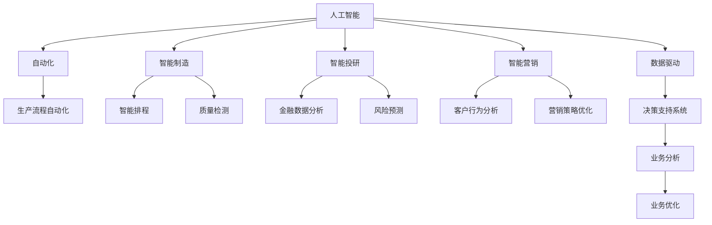

                 

# Reshape your workflow with AI?

> 关键词：人工智能,自动化,生产效率,流程优化,智能制造

## 1. 背景介绍

在现代商业环境中，数据驱动决策和自动化流程已逐渐成为主流。人工智能（AI）技术的发展，尤其是机器学习和深度学习的突破，为各行各业带来了前所未有的变革机会。从制造业的智能制造到金融行业的智能投研，再到零售业的智能营销，AI正日益深入到各行各业的业务流程中，重塑着传统的工作模式和运营策略。然而，如何将AI技术融入企业的日常运营中，从而真正提升生产效率和决策质量，却是一个复杂而棘手的问题。本文将探讨如何通过AI技术重新塑造工作流程，提升企业运营效率，推动企业转型升级。

## 2. 核心概念与联系

### 2.1 核心概念概述

为更好地理解AI如何重塑工作流程，本节将介绍几个关键概念：

- 人工智能（Artificial Intelligence, AI）：一种通过模拟人类智能过程，使机器能够执行复杂任务的技术。AI的核心在于通过算法和数据训练模型，从而实现自动决策和自动化处理。

- 自动化（Automation）：指通过技术手段，使某些任务无需人工干预即可自动完成。AI技术在自动化流程中的应用，可以大幅提升效率和准确性。

- 智能制造（Intelligent Manufacturing）：结合AI、物联网、大数据等技术，实现生产过程的智能化、柔性化管理，提升制造效率和产品质量。

- 智能投研（Intelligent Investment Research）：利用AI技术对海量金融数据进行分析，提升投资决策的准确性和效率。

- 智能营销（Intelligent Marketing）：通过AI技术对消费者行为进行分析和预测，实现个性化营销和精准广告投放。

- 数据驱动（Data-Driven）：强调决策过程需基于数据和模型分析，而非经验和直觉。AI技术在数据驱动决策中的应用，提升了决策的科学性和准确性。

这些概念之间的逻辑关系可以通过以下Mermaid流程图来展示：



这个流程图展示了AI技术的各个应用领域及其对业务流程的影响：

1. 人工智能技术通过自动化流程，实现了生产制造、金融分析、营销策略等领域的智能化管理。
2. 智能制造中的智能排程和质量检测，显著提升了生产效率和产品质量。
3. 智能投研中的金融数据分析和风险预测，提高了投资决策的准确性和效率。
4. 智能营销中的客户行为分析和策略优化，实现了更精准的营销效果。
5. 数据驱动的决策支持系统，通过业务分析优化业务流程，提升企业整体运营效率。

## 3. 核心算法原理 & 具体操作步骤
### 3.1 算法原理概述

AI技术在重塑工作流程中的应用，主要基于以下几个算法原理：

- 机器学习（Machine Learning, ML）：通过训练数据集，使机器能够从数据中学习模式，从而进行预测和分类。ML算法广泛应用于数据驱动决策中。

- 深度学习（Deep Learning, DL）：通过多层神经网络结构，对复杂非线性关系进行建模，适用于大规模数据分析和图像识别等任务。

- 自然语言处理（Natural Language Processing, NLP）：使机器能够理解和生成人类语言，广泛应用于智能客服、情感分析、文本分类等任务。

- 计算机视觉（Computer Vision, CV）：使机器能够理解和分析视觉信息，应用于图像识别、物体检测、人脸识别等任务。

- 强化学习（Reinforcement Learning, RL）：通过与环境的交互，使机器能够优化决策策略，适用于自动驾驶、机器人控制等任务。

### 3.2 算法步骤详解

AI技术在重塑工作流程中的应用，通常包括以下几个关键步骤：

**Step 1: 数据收集与预处理**
- 收集与业务流程相关的数据，包括生产数据、财务数据、客户行为数据等。
- 对数据进行清洗、去重、归一化等预处理，确保数据质量和一致性。

**Step 2: 模型选择与训练**
- 根据业务需求选择合适的AI模型，如线性回归、决策树、卷积神经网络等。
- 使用预处理后的数据集对模型进行训练，优化模型参数，使其能够准确预测业务结果。

**Step 3: 模型集成与部署**
- 将训练好的模型集成到现有系统或构建新的应用，如生产自动化系统、投资分析平台等。
- 对模型进行部署和优化，确保其能够高效运行和稳定输出。

**Step 4: 持续监测与优化**
- 实时监测模型性能和业务流程，及时发现问题并进行调整。
- 定期更新模型和算法，确保其能够适应业务变化和数据更新。

### 3.3 算法优缺点

AI技术在重塑工作流程中具有以下优点：

- 提高效率：通过自动化流程，大幅提升生产效率和决策速度。
- 减少错误：减少人为操作带来的错误和偏差，提高决策准确性。
- 提供洞见：通过数据分析和模型预测，揭示业务中的潜在问题和改进空间。
- 灵活应对变化：AI模型能够快速适应新数据和新场景，提升业务灵活性。

同时，AI技术也存在以下缺点：

- 数据依赖：AI模型的效果依赖于高质量的数据，数据获取和处理成本较高。
- 技术门槛：需要具备一定的AI技术知识，才能进行模型开发和优化。
- 模型解释：部分AI模型（如深度学习）缺乏可解释性，难以理解模型决策逻辑。
- 风险管理：AI模型可能产生误判或偏见，带来新的风险和挑战。

尽管存在这些局限，但AI技术在重塑工作流程中的作用日益显著，正在成为企业提升竞争力的重要手段。

### 3.4 算法应用领域

AI技术在重塑工作流程中，已经广泛应用于以下领域：

- 生产制造：通过智能排程和质量检测，提高生产效率和产品质量。
- 金融投研：利用金融数据分析和风险预测，提升投资决策的准确性和效率。
- 营销策略：通过客户行为分析，实现个性化营销和精准广告投放。
- 客户服务：通过智能客服系统，提高客户满意度和服务效率。
- 供应链管理：通过数据分析和预测，优化供应链运营和库存管理。
- 安全监控：利用计算机视觉和深度学习技术，提升安全监控和异常检测能力。

## 4. 数学模型和公式 & 详细讲解 & 举例说明

### 4.1 数学模型构建

本节将使用数学语言对AI重塑工作流程的过程进行更加严格的刻画。

假设企业生产流程的业务量为 $X$，成本为 $C$，销售额为 $S$。根据历史数据，可以建立一个线性回归模型来预测业务量对销售额的影响：

$$
S = \beta_0 + \beta_1 X + \epsilon
$$

其中 $\beta_0, \beta_1$ 为模型参数，$\epsilon$ 为误差项。通过训练数据集，可以最小化损失函数：

$$
L(\beta) = \frac{1}{2N}\sum_{i=1}^N (S_i - \hat{S}_i)^2
$$

其中 $\hat{S}_i$ 为模型预测值，$S_i$ 为实际值。

### 4.2 公式推导过程

线性回归模型的最小二乘法求解公式为：

$$
\hat{\beta} = (X^TX)^{-1}X^TS
$$

其中 $X^TX$ 为样本协方差矩阵，$X^TS$ 为样本和目标向量。

通过求解上述公式，可以得到最优的模型参数 $\hat{\beta}$，进而预测未来的业务量。

### 4.3 案例分析与讲解

以智能投研为例，假设有一家投资公司，需要预测股票价格的变化趋势。首先，收集历史股票价格数据和相关经济指标（如GDP增长率、失业率等）。然后，使用线性回归模型对这些数据进行建模，得到价格预测模型：

$$
P = \beta_0 + \beta_1 G + \beta_2 U + \epsilon
$$

其中 $P$ 为股票价格，$G$ 为GDP增长率，$U$ 为失业率，$\epsilon$ 为误差项。通过历史数据训练模型，并使用测试数据集评估模型性能，最后应用到实际投资决策中。

## 5. 项目实践：代码实例和详细解释说明
### 5.1 开发环境搭建

在进行AI项目实践前，我们需要准备好开发环境。以下是使用Python进行TensorFlow开发的环境配置流程：

1. 安装Anaconda：从官网下载并安装Anaconda，用于创建独立的Python环境。

2. 创建并激活虚拟环境：
```bash
conda create -n tf-env python=3.8 
conda activate tf-env
```

3. 安装TensorFlow：根据CUDA版本，从官网获取对应的安装命令。例如：
```bash
conda install tensorflow -c pytorch -c conda-forge
```

4. 安装必要的库：
```bash
pip install numpy pandas matplotlib sklearn
```

完成上述步骤后，即可在`tf-env`环境中开始AI项目的开发。

### 5.2 源代码详细实现

下面以线性回归模型为例，给出使用TensorFlow进行数据驱动决策的Python代码实现。

首先，定义线性回归模型的类：

```python
import tensorflow as tf
import numpy as np

class LinearRegression(tf.keras.Model):
    def __init__(self):
        super(LinearRegression, self).__init__()
        self.w = tf.Variable(tf.zeros([1, 1]), dtype=tf.float32)
        self.b = tf.Variable(tf.zeros([1]), dtype=tf.float32)

    def call(self, x):
        return tf.matmul(x, self.w) + self.b
```

然后，定义模型的训练函数：

```python
@tf.function
def train_step(x, y):
    with tf.GradientTape() as tape:
        y_pred = model(x)
        loss = tf.reduce_mean(tf.square(y_pred - y))
    gradients = tape.gradient(loss, [model.w, model.b])
    optimizer.apply_gradients(zip(gradients, [model.w, model.b]))
```

接着，定义模型的评估函数：

```python
@tf.function
def evaluate(x, y):
    y_pred = model(x)
    mse = tf.reduce_mean(tf.square(y_pred - y))
    return mse
```

最后，启动训练流程：

```python
epochs = 1000
batch_size = 32
learning_rate = 0.01

# 定义模型和优化器
model = LinearRegression()
optimizer = tf.keras.optimizers.SGD(learning_rate)

# 训练模型
for epoch in range(epochs):
    for batch in data:
        x_batch, y_batch = batch
        train_step(x_batch, y_batch)

    # 评估模型
    mse = evaluate(x, y)
    if epoch % 100 == 0:
        print(f"Epoch {epoch+1}, MSE: {mse.numpy():.4f}")
```

以上代码实现了基于TensorFlow的线性回归模型训练和评估，可以用于解决类似股票价格预测等数据驱动决策问题。

### 5.3 代码解读与分析

让我们再详细解读一下关键代码的实现细节：

**LinearRegression类**：
- 定义了一个简单的线性回归模型，包含权重 $w$ 和偏置 $b$ 两个参数。
- 使用 `tf.keras.Model` 继承，实现模型的前向传播。

**train_step函数**：
- 定义了单批次训练的过程。
- 使用梯度下降算法计算损失函数对参数的梯度，并更新模型参数。
- 通过 `tf.GradientTape` 记录梯度信息，方便反向传播。

**evaluate函数**：
- 定义了模型在测试集上的评估过程。
- 计算模型预测值与真实值之间的均方误差。
- 通过 `tf.function` 装饰器，将函数编译为TensorFlow图，提升计算效率。

**训练流程**：
- 定义总的训练轮数和批大小。
- 创建模型和优化器。
- 循环迭代训练模型，并在每个epoch后输出均方误差。
- 使用 `evaluate` 函数评估模型性能。

可以看到，TensorFlow提供了丰富的API和工具，使得AI模型的开发和部署变得简洁高效。开发者可以将更多精力放在模型改进、数据预处理等高层逻辑上，而不必过多关注底层的实现细节。

当然，工业级的系统实现还需考虑更多因素，如模型的保存和部署、超参数的自动搜索、更灵活的任务适配层等。但核心的AI重塑流程基本与此类似。

## 6. 实际应用场景
### 6.1 智能制造

AI技术在智能制造中的应用，可以通过自动化生产流程、优化生产排程、提升质量检测等方式，显著提升制造效率和产品质量。

在技术实现上，可以收集生产设备的历史数据和实时数据，对设备运行状态、生产效率、生产成本等进行建模和预测。通过自动化生产流程，使生产过程更加高效、稳定和可控。例如，使用机器视觉检测产品质量，使用机器人臂进行自动化装配，使用预测性维护系统对设备进行状态监测和预测性维护，减少设备停机时间。

### 6.2 智能投研

AI技术在智能投研中的应用，可以通过金融数据分析、风险预测、投资策略优化等方式，提升投资决策的科学性和效率。

在技术实现上，可以收集历史交易数据、新闻资讯、市场情绪等数据，使用深度学习模型对这些数据进行分析和预测。通过分析市场趋势和预测风险，制定更加精准的投资策略。例如，使用深度学习模型预测股票价格，使用自然语言处理技术分析新闻和市场情绪，使用强化学习模型优化交易策略，提高投资收益和风险控制能力。

### 6.3 智能营销

AI技术在智能营销中的应用，可以通过客户行为分析、个性化推荐、广告投放优化等方式，实现更精准的营销效果。

在技术实现上，可以收集客户的浏览、购买、互动等行为数据，使用机器学习模型对这些数据进行分析和预测。通过客户行为分析，制定个性化的营销策略和广告投放方案。例如，使用协同过滤算法推荐相关产品，使用关联规则挖掘发现潜在的消费趋势，使用多臂老虎机模型优化广告投放，提高广告点击率和转化率。

## 7. 工具和资源推荐
### 7.1 学习资源推荐

为了帮助开发者系统掌握AI技术在重塑工作流程中的应用，这里推荐一些优质的学习资源：

1. 《Python深度学习》书籍：深度学习领域的入门级教材，介绍了深度学习的基础理论和实践技巧。

2. 《机器学习实战》书籍：通过实例演示机器学习模型的开发和应用，适合初学者学习。

3. Coursera《机器学习》课程：斯坦福大学开设的机器学习课程，由Andrew Ng教授讲授，系统介绍了机器学习的理论基础和实践技巧。

4. TensorFlow官方文档：TensorFlow的官方文档，提供了完整的API参考和实践示例。

5. Kaggle平台：提供大量数据集和竞赛，适合实践机器学习和深度学习模型。

通过对这些资源的学习实践，相信你一定能够快速掌握AI技术在重塑工作流程中的应用，并用于解决实际的AI问题。

### 7.2 开发工具推荐

高效的开发离不开优秀的工具支持。以下是几款用于AI模型开发的常用工具：

1. TensorFlow：由Google主导开发的开源深度学习框架，生产部署方便，适合大规模工程应用。

2. PyTorch：基于Python的开源深度学习框架，灵活动态的计算图，适合快速迭代研究。

3. Jupyter Notebook：交互式的编程环境，支持Python、R等多种语言，适合数据驱动决策的研究和实践。

4. Kaggle：提供数据集、竞赛和社区，适合数据科学和机器学习的研究和实践。

5. Weights & Biases：模型训练的实验跟踪工具，可以记录和可视化模型训练过程中的各项指标，方便对比和调优。

6. Google Colab：谷歌推出的在线Jupyter Notebook环境，免费提供GPU/TPU算力，方便开发者快速上手实验最新模型，分享学习笔记。

合理利用这些工具，可以显著提升AI模型开发和部署的效率，加快创新迭代的步伐。

### 7.3 相关论文推荐

AI技术在重塑工作流程中，得到了学界的持续研究。以下是几篇奠基性的相关论文，推荐阅读：

1. "Deep Learning" 论文：深度学习领域的奠基性论文，提出了深度神经网络的架构和训练方法。

2. "Gradient Descent" 论文：介绍了梯度下降算法，是机器学习领域的基础算法之一。

3. "Convolutional Neural Networks" 论文：提出了卷积神经网络架构，广泛应用于图像识别等领域。

4. "Attention Is All You Need" 论文：提出了Transformer架构，开创了预训练大模型的先河。

5. "Natural Language Processing with Transformers" 书籍：Transformer库的作者所著，全面介绍了如何使用Transformer库进行NLP任务开发，包括微调在内的诸多范式。

6. "AdaLoRA: Adaptive Low-Rank Adaptation for Parameter-Efficient Fine-Tuning" 论文：提出了AdaLoRA方法，使用自适应低秩适应的微调方法，在参数效率和精度之间取得了新的平衡。

这些论文代表了大语言模型微调技术的发展脉络。通过学习这些前沿成果，可以帮助研究者把握学科前进方向，激发更多的创新灵感。

## 8. 总结：未来发展趋势与挑战
### 8.1 总结

本文对AI技术在重塑工作流程中的应用进行了全面系统的介绍。首先阐述了AI技术在自动化流程、数据驱动决策中的应用价值，明确了AI技术在提升生产效率和决策质量方面的独特作用。其次，从原理到实践，详细讲解了AI技术在重塑工作流程中的数学原理和关键步骤，给出了AI项目开发的完整代码实例。同时，本文还广泛探讨了AI技术在智能制造、智能投研、智能营销等各个行业领域的应用前景，展示了AI技术在各行各业中的巨大潜力。此外，本文精选了AI技术的相关学习资源，力求为读者提供全方位的技术指引。

通过本文的系统梳理，可以看到，AI技术在重塑工作流程中的作用日益显著，正在成为企业提升竞争力的重要手段。未来，伴随AI技术的持续演进，工作流程自动化和智能化水平将进一步提升，为企业带来更大的效益。

### 8.2 未来发展趋势

展望未来，AI技术在重塑工作流程中呈现以下几个发展趋势：

1. 自动化流程的普及：随着AI技术的发展，越来越多的业务流程将实现自动化，减少人为操作，提高效率和准确性。

2. 数据驱动决策的深化：数据驱动决策的应用将更加广泛和深入，从传统业务领域扩展到创新型业务，提升决策的科学性和准确性。

3. 模型集成和协同：AI模型将越来越多地集成到现有系统和工具中，与人类协作，实现更复杂的业务逻辑。

4. 跨领域知识融合：AI技术将突破单一领域的限制，与其他技术如物联网、区块链等融合，实现更广泛的业务应用。

5. 实时化和智能化：AI技术将实现实时化，快速响应用户需求和市场变化，提升业务灵活性和响应速度。

6. 安全性和隐私保护：AI技术的应用将越来越注重数据安全和隐私保护，确保用户信息的安全和隐私。

以上趋势凸显了AI技术在重塑工作流程中的广阔前景。这些方向的探索发展，必将进一步提升企业运营效率和决策质量，为经济社会发展带来深远影响。

### 8.3 面临的挑战

尽管AI技术在重塑工作流程中取得了显著成果，但仍面临诸多挑战：

1. 数据依赖：AI模型的效果依赖于高质量的数据，数据获取和处理成本较高。

2. 技术门槛：需要具备一定的AI技术知识，才能进行模型开发和优化。

3. 模型解释：部分AI模型（如深度学习）缺乏可解释性，难以理解模型决策逻辑。

4. 风险管理：AI模型可能产生误判或偏见，带来新的风险和挑战。

5. 系统集成：AI模型需要与其他系统和工具进行集成，才能发挥其最大价值。

6. 安全和隐私：AI技术的应用将越来越注重数据安全和隐私保护，确保用户信息的安全和隐私。

尽管存在这些挑战，但随着AI技术的不断进步，这些挑战终将逐步克服，AI技术必将在重塑工作流程中发挥更大的作用。

### 8.4 研究展望

面向未来，AI技术在重塑工作流程中还需要在以下几个方面进行深入研究：

1. 无监督学习和强化学习：通过无监督学习和强化学习，提升模型的泛化能力和自主决策能力，降低对标注数据的依赖。

2. 模型可解释性和透明性：通过可解释性模型和透明性评估，提升AI模型的可信度和可解释性。

3. 跨领域知识融合：通过跨领域知识融合，提升AI模型的多模态融合能力和跨领域迁移能力。

4. 模型集成和协同：通过模型集成和协同，实现更复杂的业务逻辑和更灵活的业务应用。

5. 实时化和智能化：通过实时化处理和智能化优化，提升AI系统的响应速度和决策质量。

6. 安全性和隐私保护：通过安全性和隐私保护技术，确保AI系统在数据处理和决策过程中遵守法规和标准。

这些研究方向将推动AI技术在重塑工作流程中不断进步，为未来AI系统的应用和优化提供坚实的基础。相信随着AI技术的不断发展，AI技术必将在各行各业中发挥更大的作用，推动经济社会的发展。

## 9. 附录：常见问题与解答

**Q1：AI技术在重塑工作流程中是否适用于所有行业？**

A: AI技术在重塑工作流程中的应用具有广泛适用性，几乎可以覆盖所有行业。然而，不同行业的业务特点和应用需求各异，AI技术的应用方式和效果也各不相同。企业需要根据自身业务特点，选择适合的AI技术方案。

**Q2：AI技术在重塑工作流程中是否需要大量的数据和计算资源？**

A: 是的，AI技术在重塑工作流程中需要大量的数据和计算资源。高质量的数据是AI模型性能的基础，而计算资源则决定了模型的训练速度和效果。企业需要根据自身资源条件，选择合适的AI技术和数据策略，才能充分发挥AI技术的潜力。

**Q3：AI技术在重塑工作流程中是否容易被理解和解释？**

A: 部分AI技术，如深度学习模型，由于其黑盒特性，难以被解释和理解。但随着可解释性AI技术的发展，越来越多的AI模型具备了更好的可解释性。企业在应用AI技术时，需要根据实际情况，选择合适的模型和工具，确保其可解释性和透明性。

**Q4：AI技术在重塑工作流程中是否存在安全性和隐私问题？**

A: 是的，AI技术在重塑工作流程中需要特别关注安全性和隐私问题。AI模型可能面临数据泄露、算法偏见、误判等风险，需要采取相应的安全措施和技术手段，确保数据和模型的安全。

**Q5：AI技术在重塑工作流程中是否需要人类干预和监控？**

A: 是的，AI技术在重塑工作流程中需要人类的干预和监控。AI系统需要结合人类的经验和技术，才能更好地发挥其作用。人类需要定期对AI系统进行监控和评估，确保其性能和决策的可靠性。

---

作者：禅与计算机程序设计艺术 / Zen and the Art of Computer Programming

