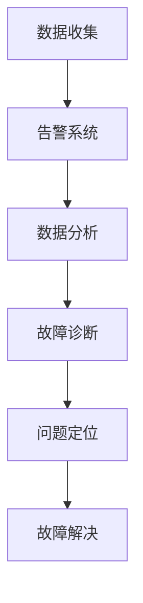

                 

## 1. 背景介绍

### 1.1 问题由来
随着数字化转型的不断深入，企业在IT架构的复杂度、云资源的规模以及应用系统的多样性等方面都经历了迅猛增长。然而，与之相伴的，是IT运维复杂度的日益增加。以宕机、延迟、服务中断、系统资源耗尽等故障问题为例，如果无法及时诊断与定位，将对企业的正常运营带来严重的影响。因此，如何构建高效的运维体系，快速、准确地诊断和定位故障，成为现代企业IT管理中的一个重要课题。

### 1.2 问题核心关键点
故障诊断与问题定位的核心在于通过监控数据和告警信息，运用系统化的分析方法，快速识别故障的根本原因，并采取有效的措施加以解决。这通常包括以下几个关键点：
1. **数据收集**：收集系统的日志、性能指标、异常告警等数据。
2. **数据分析**：通过统计分析、时序分析、异常检测等方法对数据进行分析，找出异常数据点。
3. **故障定位**：通过定性或定量的分析手段，将异常数据点映射到系统组件或操作路径上，找到故障点。
4. **故障解决**：根据定位结果，采取相应的故障解决措施，并验证效果。

本文将重点介绍系统运维(SRE)领域的故障诊断与问题定位技术，特别是如何构建高效、可靠的故障诊断系统，以提升运维效率和用户体验。

## 2. 核心概念与联系

### 2.1 核心概念概述

故障诊断与问题定位是系统运维(SRE)领域的核心技术之一，其涉及的概念和技术具有较强的关联性。以下是几个关键概念的介绍：

1. **系统监控**：对系统运行状态进行持续的监视和数据收集。
2. **告警系统**：基于监控数据，通过设定阈值，及时发出异常告警。
3. **数据分析**：对收集到的数据进行分析和挖掘，找出潜在的故障征兆。
4. **故障诊断**：结合经验知识和自动化算法，定位故障点。
5. **问题定位**：通过故障诊断结果，找到故障的具体原因和解决方法。
6. **故障解决**：对已识别的故障点进行修复和优化，恢复正常服务。

这些概念之间通过一系列的流程和操作进行紧密联系，形成了一个完整的故障诊断与问题定位的闭环系统。以下是一个Mermaid流程图，展示了各概念之间的联系：



### 2.2 核心概念原理和架构

故障诊断与问题定位的核心原理是利用系统的异常数据进行分析和判断，从而找到故障点并进行修复。其架构一般包括数据收集、告警触发、数据分析、故障诊断、问题定位和故障解决等几个关键模块，具体如下：

1. **数据收集模块**：通过各种监控手段（如日志、性能指标、网络流量等）获取系统的运行数据。
2. **告警系统模块**：根据设定的阈值和规则，自动发出告警，及时通知运维人员。
3. **数据分析模块**：对收集到的数据进行统计分析、时序分析、异常检测等处理，找出异常数据点和潜在故障。
4. **故障诊断模块**：结合历史数据、专家知识、规则引擎等手段，对异常数据进行定性或定量的分析，识别故障点。
5. **问题定位模块**：进一步分析故障原因，确定问题所在的具体组件或操作路径。
6. **故障解决模块**：采取措施修复故障，并验证解决效果。

## 3. 核心算法原理 & 具体操作步骤

### 3.1 算法原理概述

故障诊断与问题定位的核心算法包括统计分析、时序分析、异常检测、故障诊断和问题定位等。下面将分别介绍这些算法的基本原理。

1. **统计分析**：通过对历史数据进行统计分析，找出异常的数据分布和规律。
2. **时序分析**：分析数据的时序变化，识别出周期性的异常和突变点。
3. **异常检测**：利用统计学方法或机器学习算法，识别出异常数据点。
4. **故障诊断**：结合专家知识、规则引擎等，对异常数据进行解释和判断，找出故障点。
5. **问题定位**：对故障点进行更深入的分析和排查，确定具体的故障原因和影响范围。

### 3.2 算法步骤详解

以下是故障诊断与问题定位的具体操作步骤：

1. **数据收集**：通过日志、性能指标、网络流量等手段，持续收集系统的运行数据。
2. **告警系统**：根据设定的阈值和规则，自动发出告警，及时通知运维人员。
3. **数据分析**：对收集到的数据进行统计分析、时序分析、异常检测等处理，找出异常数据点和潜在故障。
4. **故障诊断**：结合历史数据、专家知识、规则引擎等手段，对异常数据进行定性或定量的分析，识别故障点。
5. **问题定位**：进一步分析故障原因，确定问题所在的具体组件或操作路径。
6. **故障解决**：采取措施修复故障，并验证解决效果。

### 3.3 算法优缺点

故障诊断与问题定位的算法具有以下优点：
1. **高效性**：通过自动化处理和分析，显著提升了故障诊断的速度。
2. **准确性**：结合多种分析手段，提升了故障诊断的准确性和可靠性。
3. **可扩展性**：可以轻松集成新的分析方法和数据源，适应不同复杂度的系统。

但同时也存在一些缺点：
1. **误报率高**：由于规则和阈值设定等问题，告警系统可能会发出大量的误报。
2. **依赖历史数据**：故障诊断依赖于历史数据的完整性和准确性，对于新系统或故障类型较少的系统，效果可能不佳。
3. **复杂度较高**：故障诊断和问题定位涉及多个环节，需要系统化的设计和实施。

### 3.4 算法应用领域

故障诊断与问题定位技术在各个领域都有广泛的应用，例如：

1. **云计算平台**：如AWS、Azure、阿里云等，对云资源、云应用等进行监控、告警和故障诊断。
2. **金融系统**：如银行、证券、保险等，对交易系统、风控系统、支付系统等进行监控、告警和故障诊断。
3. **电商平台**：如淘宝、京东、美团等，对商品交易、订单处理、库存管理等进行监控、告警和故障诊断。
4. **企业内部系统**：如ERP、CRM、OA等，对业务系统、数据库系统等进行监控、告警和故障诊断。

## 4. 数学模型和公式 & 详细讲解 & 举例说明

### 4.1 数学模型构建

故障诊断与问题定位的数学模型主要包括时序分析模型、异常检测模型、故障诊断模型等。以下以时序分析模型为例进行介绍。

假设我们有一组时间序列数据 $x_t$，其中 $t$ 表示时间。设 $x_t$ 的均值为 $\mu_t$，方差为 $\sigma_t^2$。利用指数加权平均法(EWM)对均值和方差进行估计，得到：

$$
\mu_t = (1-\alpha)\mu_{t-1}+\alpha x_t
$$
$$
\sigma_t^2 = (1-\alpha)\sigma_{t-1}^2+\alpha (x_t-\mu_t)^2
$$

其中 $\alpha$ 是衰减因子，一般取 $0.95$。

### 4.2 公式推导过程

指数加权平均法的推导过程如下：

1. **均值估计**：
$$
\mu_t = \frac{1}{1-\alpha^t}\sum_{k=1}^t \alpha^k x_k
$$
设 $s_t = \sum_{k=1}^t \alpha^k x_k$，则：
$$
\mu_t = \frac{s_t}{1-\alpha^t}
$$
令 $s_0=0$，则：
$$
\mu_t = \frac{s_t-s_{t-1}}{1-\alpha^t}
$$
代入 $s_t = s_{t-1}+\alpha^t x_t$，得：
$$
\mu_t = \frac{\alpha^t x_t}{1-\alpha^t}+\frac{s_{t-1}}{1-\alpha^t}
$$
$$
\mu_t = (1-\alpha)\mu_{t-1}+\alpha x_t
$$

2. **方差估计**：
$$
\sigma_t^2 = \frac{1}{1-\alpha^t}\sum_{k=1}^t \alpha^k (x_k-\mu_t)^2
$$
令 $v_t = \sum_{k=1}^t \alpha^k (x_k-\mu_t)^2$，则：
$$
\sigma_t^2 = \frac{v_t}{1-\alpha^t}
$$
令 $v_0=0$，则：
$$
v_t = v_{t-1}+\alpha^t (x_t-\mu_t)^2
$$
代入 $\mu_t = (1-\alpha)\mu_{t-1}+\alpha x_t$，得：
$$
v_t = v_{t-1}+(1-\alpha)\alpha^t (x_t-\mu_{t-1})^2+\alpha^t (x_t-x_t)^2
$$
$$
v_t = v_{t-1}+(1-\alpha)\alpha^t (x_t-\mu_{t-1})^2
$$
令 $\delta_t = x_t-\mu_t$，则：
$$
v_t = v_{t-1}+(1-\alpha)\alpha^t \delta_t^2
$$
设 $w_t = \sum_{k=1}^t \alpha^k \delta_k^2$，则：
$$
v_t = w_t
$$
令 $w_0=0$，则：
$$
w_t = w_{t-1}+\alpha^t \delta_t^2
$$
代入 $\delta_t = (1-\alpha)\delta_{t-1}+\alpha (x_t-\mu_t)$，得：
$$
w_t = w_{t-1}+(1-\alpha)\alpha^t \delta_{t-1}^2+\alpha^t (x_t-\mu_t)^2
$$
$$
w_t = w_{t-1}+(1-\alpha)\alpha^t \delta_{t-1}^2
$$
令 $\sigma_t^2 = (1-\alpha)\sigma_{t-1}^2+\alpha \delta_t^2$，则：
$$
\sigma_t^2 = (1-\alpha)\sigma_{t-1}^2+\alpha (x_t-\mu_t)^2
$$

### 4.3 案例分析与讲解

以一个电商平台的订单处理系统为例，分析其故障诊断与问题定位的过程。

假设订单处理系统有一个关键组件 $C$，每天会产生一定数量的日志记录，记录中包含请求ID、处理时间、异常状态等信息。通过对日志数据的统计分析，可以发现以下异常情况：

1. **异常处理时间**：订单处理时间远超预期。
2. **高并发**：某个时间段内请求量激增，导致系统负载过高。
3. **异常状态**：某些订单出现了异常状态，如超时、失败等。

通过指数加权平均法，可以对处理时间、负载、异常状态等数据进行建模，找出异常点。例如，设 $x_t$ 表示订单处理时间，$\mu_t$ 和 $\sigma_t^2$ 分别表示均值和方差。

通过对 $x_t$ 的均值和方差进行估计，可以识别出异常处理时间和高并发情况。例如，如果均值和方差在短时间内发生显著变化，则可能存在异常处理时间或高并发情况。

对于异常状态，可以结合业务规则进行判断，识别出异常状态的原因。例如，如果多个订单同时出现超时状态，可能是系统负载过高导致的。

## 5. 项目实践：代码实例和详细解释说明

### 5.1 开发环境搭建

进行故障诊断与问题定位的项目实践，需要搭建相应的开发环境。以下是使用Python进行实践的环境配置流程：

1. 安装Anaconda：从官网下载并安装Anaconda，用于创建独立的Python环境。

2. 创建并激活虚拟环境：
```bash
conda create -n sre-env python=3.8 
conda activate sre-env
```

3. 安装必要的库：
```bash
pip install numpy pandas matplotlib sklearn
```

4. 准备数据集：
```bash
mkdir data
cd data
mkdir logs perf anomalies
cd logs
# 准备日志数据
# 准备性能指标数据
# 准备异常告警数据
```

### 5.2 源代码详细实现

以下是使用Python进行故障诊断与问题定位的代码实现：

```python
import numpy as np
import pandas as pd
from sklearn.metrics import mean_squared_error

# 读取日志数据
log_data = pd.read_csv('data/logs/log.csv')

# 定义指数加权平均法
def ewma(data, alpha=0.95):
    return (1-alpha)*data[:-1] + alpha*data[1:]

# 计算均值和方差
def mean_variance(data, alpha=0.95):
    mean = ewma(data, alpha)
    variance = ewma((data-mean)**2, alpha)
    return mean, variance

# 计算异常检测结果
def detect_anomalies(data, threshold=3):
    mean, variance = mean_variance(data)
    anomalies = np.abs(data-mean) > threshold*np.sqrt(variance)
    return anomalies

# 读取性能指标数据
perf_data = pd.read_csv('data/perf/perf.csv')

# 计算异常检测结果
perf_anomalies = detect_anomalies(perf_data['response_time'], threshold=3)

# 读取异常告警数据
anomaly_data = pd.read_csv('data/anomalies/anomaly.csv')

# 计算异常检测结果
anomaly_anomalies = detect_anomalies(anomaly_data['status_code'], threshold=3)

# 打印结果
print(f'Performance anomalies: {perf_anomalies}')
print(f'Anomaly anomalies: {anomaly_anomalies}')
```

### 5.3 代码解读与分析

上述代码实现了基本的故障诊断与问题定位功能。具体分析如下：

1. **日志数据处理**：通过读取日志文件，提取其中的关键信息，如请求ID、处理时间、异常状态等。
2. **均值和方差计算**：利用指数加权平均法，对处理时间和负载等数据进行建模，计算均值和方差。
3. **异常检测**：根据设定的阈值，识别出异常点。例如，处理时间超过预期时间阈值，则可能存在异常情况。
4. **告警数据处理**：读取异常告警数据，根据异常检测结果，识别出异常告警类型。

## 6. 实际应用场景

### 6.1 智能客服系统

智能客服系统需要实时处理大量用户咨询请求，及时响应并解决用户问题。通过故障诊断与问题定位技术，可以实时监控系统运行状态，快速定位问题并进行解决。

例如，通过监控系统响应时间、负载等指标，可以及时发现系统负载过高、请求处理缓慢等问题。利用异常检测算法，可以识别出系统异常状态，结合历史数据和专家知识，进一步定位问题原因。如果问题出在某个服务组件上，可以及时通知运维人员进行修复，保障系统稳定运行。

### 6.2 金融交易系统

金融交易系统对实时性和可靠性要求极高。通过故障诊断与问题定位技术，可以实时监控交易系统的运行状态，及时发现并解决异常情况，保障交易系统的稳定性和安全性。

例如，通过监控交易系统的延迟、错误率等指标，可以及时发现系统异常情况。利用异常检测算法，可以识别出系统延迟过高、异常交易等异常情况。结合历史数据和专家知识，进一步定位问题原因，如网络延迟、服务器故障等。如果问题出在某个交易组件上，可以及时通知运维人员进行修复，保障交易系统的稳定运行。

### 6.3 电商平台

电商平台需要实时处理大量用户订单和支付请求，保障交易流畅和数据安全。通过故障诊断与问题定位技术，可以实时监控系统的运行状态，及时发现并解决异常情况。

例如，通过监控订单处理时间、错误率等指标，可以及时发现系统异常情况。利用异常检测算法，可以识别出系统处理时间过长、交易失败等异常情况。结合历史数据和专家知识，进一步定位问题原因，如数据库故障、网络延迟等。如果问题出在某个订单处理组件上，可以及时通知运维人员进行修复，保障交易系统的稳定运行。

### 6.4 未来应用展望

随着数字化转型的不断深入，故障诊断与问题定位技术将在更多领域得到应用，为企业的IT运维提供更高效、可靠的服务。未来，其发展趋势如下：

1. **自动化与智能化**：结合机器学习、深度学习等技术，提升故障诊断与问题定位的自动化和智能化水平。
2. **跨系统整合**：通过API接口等方式，实现不同系统间的故障诊断与问题定位数据整合，提升整体运维效率。
3. **实时监控**：结合大数据、云计算等技术，实现对系统运行状态的实时监控和告警，提升运维的及时性和准确性。
4. **用户体验优化**：结合故障诊断结果，优化用户体验，提升系统的稳定性和可靠性。

总之，故障诊断与问题定位技术将在IT运维领域发挥越来越重要的作用，提升企业的IT运维效率和用户体验。

## 7. 工具和资源推荐

### 7.1 学习资源推荐

为了帮助开发者系统掌握故障诊断与问题定位的理论基础和实践技巧，这里推荐一些优质的学习资源：

1. **《SRE：提高可靠性实践指南》**：介绍系统运维的基本概念和最佳实践，涵盖监控、告警、故障诊断等方面。
2. **《Prometheus和Grafana入门》**：介绍开源监控系统的使用方法和最佳实践，涵盖数据收集、告警规则、可视化等方面。
3. **《Kubernetes系统运维实战》**：介绍容器化技术在运维中的应用，涵盖集群管理、资源监控、故障恢复等方面。
4. **《日志处理与分析实战》**：介绍日志数据处理和分析的方法和工具，涵盖日志收集、异常检测、告警处理等方面。
5. **《微服务架构设计与运维》**：介绍微服务架构的运维挑战和解决方案，涵盖服务治理、日志监控、故障诊断等方面。

通过对这些资源的学习实践，相信你一定能够快速掌握故障诊断与问题定位的精髓，并用于解决实际的运维问题。

### 7.2 开发工具推荐

高效的开发离不开优秀的工具支持。以下是几款用于故障诊断与问题定位开发的常用工具：

1. **Prometheus**：开源的监控系统，支持分布式数据收集和告警，广泛用于IT运维领域。
2. **Grafana**：开源的数据可视化工具，支持与Prometheus等监控系统的集成，方便监控数据的可视化展示。
3. **ELK Stack**：包含Elasticsearch、Logstash和Kibana等组件，支持日志数据的收集、存储和分析，广泛用于日志处理和告警。
4. **Kubernetes**：开源的容器编排系统，支持大规模分布式系统的管理和运维。
5. **Zabbix**：开源的监控系统，支持网络监控、主机监控等多种数据采集和告警功能，广泛用于IT运维领域。

合理利用这些工具，可以显著提升故障诊断与问题定位任务的开发效率，加快创新迭代的步伐。

### 7.3 相关论文推荐

故障诊断与问题定位技术的研究始于学界的不断探索。以下是几篇奠基性的相关论文，推荐阅读：

1. **《Anomaly Detection in Network Traffic》**：提出基于统计方法的网络异常检测算法，广泛应用于网络监控和异常告警。
2. **《Fine-Grained Anomaly Detection Using Deep Neural Networks》**：提出基于深度学习的方法进行异常检测，显著提升了异常检测的准确性和鲁棒性。
3. **《Automatic Anomaly Detection with Statistical Multivariate Models》**：提出基于多变量统计模型的异常检测方法，广泛应用于工业控制和智能制造领域。
4. **《Real-Time Fault Detection and Diagnosis》**：提出基于实时数据流处理的故障诊断方法，应用于工业控制和机器人领域。
5. **《Fault Diagnosis and Prognosis Using Machine Learning》**：提出基于机器学习的故障诊断方法，应用于预测性维护和设备故障诊断领域。

这些论文代表了大规模故障诊断与问题定位技术的发展脉络。通过学习这些前沿成果，可以帮助研究者把握学科前进方向，激发更多的创新灵感。

## 8. 总结：未来发展趋势与挑战

### 8.1 总结

本文对故障诊断与问题定位技术进行了全面系统的介绍。首先阐述了故障诊断与问题定位在IT运维中的重要性和基本流程，明确了技术构建的关键环节。其次，从原理到实践，详细讲解了故障诊断与问题定位的数学模型和操作步骤，给出了代码实例和详细解释。最后，探讨了故障诊断与问题定位技术在实际应用中的多种场景和未来发展方向，提出了一些潜在的挑战和应对策略。

通过本文的系统梳理，可以看到，故障诊断与问题定位技术在IT运维中具有广泛的应用前景，可以显著提升运维效率和用户体验。未来，伴随技术的不断演进和应用的不断扩展，故障诊断与问题定位技术必将在智能化、自动化和高效性方面取得更大的突破，为企业的数字化转型提供坚实的保障。

### 8.2 未来发展趋势

展望未来，故障诊断与问题定位技术将呈现以下几个发展趋势：

1. **自动化与智能化**：结合机器学习、深度学习等技术，提升故障诊断与问题定位的自动化和智能化水平。
2. **实时监控**：结合大数据、云计算等技术，实现对系统运行状态的实时监控和告警，提升运维的及时性和准确性。
3. **跨系统整合**：通过API接口等方式，实现不同系统间的故障诊断与问题定位数据整合，提升整体运维效率。
4. **用户体验优化**：结合故障诊断结果，优化用户体验，提升系统的稳定性和可靠性。
5. **跨领域应用**：将故障诊断与问题定位技术应用于更多领域，如智能制造、智慧城市、智能交通等，实现跨领域的故障诊断与问题定位。

这些趋势凸显了故障诊断与问题定位技术的广阔前景。这些方向的探索发展，必将进一步提升运维效率和用户体验，为企业的数字化转型提供坚实的保障。

### 8.3 面临的挑战

尽管故障诊断与问题定位技术已经取得了一定的进展，但在迈向更加智能化、普适化应用的过程中，仍面临诸多挑战：

1. **数据质量问题**：系统监控和告警数据的质量直接影响故障诊断的准确性，数据缺失、噪声等问题需要进一步优化。
2. **算法复杂度**：现有的故障诊断与问题定位算法往往较为复杂，难以在实际系统中高效部署和维护。
3. **系统安全性**：监控数据和告警信息的传输和存储需要考虑安全性和隐私保护问题，防止数据泄露和攻击。
4. **算法鲁棒性**：算法在不同场景下的鲁棒性和泛化能力需要进一步提升，避免对特定场景的过度依赖。
5. **自动化运维**：自动化运维水平需进一步提升，实现故障诊断与问题定位的自动化和智能化。

这些挑战需要跨学科的合作和长期的技术积累，方能逐步克服。只有不断地探索和创新，才能实现故障诊断与问题定位技术的更大突破，推动企业数字化转型的持续发展。

### 8.4 研究展望

面对故障诊断与问题定位技术所面临的挑战，未来的研究需要在以下几个方面寻求新的突破：

1. **多源数据融合**：结合多种数据源，实现更全面、准确的故障诊断。
2. **实时异常检测**：利用流式计算和大数据技术，实现实时异常检测和告警。
3. **异常数据建模**：结合机器学习和深度学习技术，提升异常数据建模的准确性和鲁棒性。
4. **跨领域应用**：将故障诊断与问题定位技术应用于更多领域，如智能制造、智慧城市、智能交通等。
5. **自动化运维**：实现故障诊断与问题定位的自动化和智能化，提升运维效率。

这些研究方向将推动故障诊断与问题定位技术的进一步发展，为企业的数字化转型提供坚实的保障。

## 9. 附录：常见问题与解答

**Q1：如何选择合适的故障诊断与问题定位方法？**

A: 选择合适的故障诊断与问题定位方法需要考虑以下几个因素：

1. **数据特点**：根据监控数据的类型和分布特点，选择合适的统计方法或机器学习方法。
2. **业务需求**：结合业务需求，选择合适的故障诊断与问题定位方法。例如，对于实时系统，需要选用适合流式处理的异常检测方法。
3. **系统复杂度**：根据系统的复杂度和数据规模，选择合适的算法和工具。例如，对于大规模系统，需要选用可扩展性强的算法和工具。

**Q2：如何提高故障诊断与问题定位的准确性和鲁棒性？**

A: 提高故障诊断与问题定位的准确性和鲁棒性，可以从以下几个方面入手：

1. **数据质量**：提升数据的质量和完整性，减少噪声和缺失数据。
2. **多源数据融合**：结合多种数据源，提升异常检测的准确性和鲁棒性。
3. **特征工程**：进行有效的特征工程，提取有意义的特征，提高模型的表现力。
4. **模型优化**：结合机器学习和深度学习技术，优化模型结构和参数，提升模型的泛化能力和鲁棒性。
5. **异常数据建模**：结合业务规则和专家知识，进行有效的异常数据建模，提升异常检测的准确性和鲁棒性。

**Q3：如何降低故障诊断与问题定位的误报率？**

A: 降低故障诊断与问题定位的误报率，可以从以下几个方面入手：

1. **阈值调整**：根据业务需求和数据特点，合理设定告警阈值，减少误报。
2. **告警过滤**：结合业务规则和专家知识，进行告警过滤，避免误报。
3. **告警分组**：根据告警类型和严重程度，进行告警分组，避免泛泛告警。
4. **告警集成**：结合多个告警信息，进行告警集成，提升告警的准确性和鲁棒性。
5. **告警可视化和告警智能**：利用可视化工具和智能告警系统，提高告警处理的效率和准确性。

**Q4：如何在跨系统运维中实现故障诊断与问题定位？**

A: 在跨系统运维中实现故障诊断与问题定位，可以从以下几个方面入手：

1. **数据收集和整合**：通过API接口等方式，实现不同系统间的数据收集和整合，构建统一的数据源。
2. **告警集成和协同**：结合多个系统的告警信息，进行告警集成和协同，避免重复告警。
3. **数据可视化**：利用可视化工具，实现跨系统的监控数据和告警信息的统一展示，提升运维效率。
4. **告警规则配置**：根据不同系统的特点和需求，配置告警规则，提升告警处理的准确性和鲁棒性。
5. **自动化运维**：实现跨系统的自动化运维，提升运维效率和用户体验。

**Q5：如何在云环境下实现故障诊断与问题定位？**

A: 在云环境下实现故障诊断与问题定位，可以从以下几个方面入手：

1. **云平台监控**：利用云平台提供的监控工具和API，实现云环境的监控和告警。
2. **跨云数据同步**：通过云平台的数据同步功能，实现跨云环境的数据整合和统一。
3. **云平台告警集成**：结合云平台和其他系统的告警信息，进行告警集成和协同，提升告警处理的准确性和鲁棒性。
4. **云平台可视化**：利用云平台提供的可视化工具，实现云环境的监控数据和告警信息的统一展示，提升运维效率。
5. **云平台自动化运维**：实现云环境的自动化运维，提升运维效率和用户体验。

通过本文的系统梳理，可以看到，故障诊断与问题定位技术在IT运维中具有广泛的应用前景，可以显著提升运维效率和用户体验。未来，伴随技术的不断演进和应用的不断扩展，故障诊断与问题定位技术必将在智能化、自动化和高效性方面取得更大的突破，为企业的数字化转型提供坚实的保障。

---

作者：禅与计算机程序设计艺术 / Zen and the Art of Computer Programming

