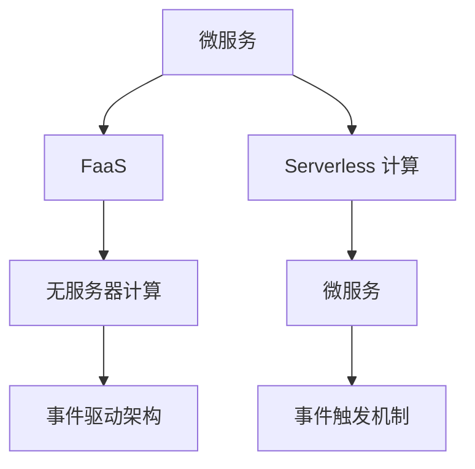

                 

## 1. 背景介绍

在云计算和分布式计算技术不断发展的今天，事件驱动架构（Event-Driven Architecture）成为推动传统单体应用向微服务化演进的重要驱动力。特别是 Serverless 计算模型的出现，为事件驱动架构带来了革命性的变革。本文将对 Serverless 架构及其在事件驱动计算模型中的应用进行深入探讨。

### 1.1 问题由来

随着互联网应用的复杂度不断提高，传统单体应用架构难以适应新兴业务的需求。以单体应用为中心的架构导致系统设计、开发、维护的复杂度急剧上升，且易发生性能瓶颈和扩展困难。微服务架构（Microservices Architecture）是应对这一问题的有效方法，它将单体应用拆分为若干个独立的服务单元，每个服务单元运行在独立的进程中，通过API接口进行通信。

然而，微服务架构也带来了新的挑战。随着微服务数量的增加，系统运维和调优难度增大。如何有效管理服务的生命周期，降低运维成本，提升应用的灵活性和可伸缩性，成为微服务架构面临的重要课题。Serverless 计算模型为此提供了一种全新的解决方案。

### 1.2 问题核心关键点

Serverless 计算模型通过提供基于事件驱动的计算服务，使得开发者无需关注服务器的底层配置和管理，只需专注于应用逻辑开发。Serverless 计算平台自动处理服务的冷启动、负载均衡、自动扩展等功能，降低了运维成本和开发难度，提高了应用的可伸缩性和可靠性。

Serverless 架构的核心在于事件触发机制，即服务单元的执行基于某个事件的发生。这种事件驱动的设计思路，能够显著提升系统的响应速度和资源利用效率，同时简化了服务的编排和管理。

## 2. 核心概念与联系

### 2.1 核心概念概述

为更好地理解 Serverless 架构及其在事件驱动计算模型中的应用，本节将介绍几个密切相关的核心概念：

- Serverless 计算（Serverless Computing）：一种云计算模型，其中计算资源由云服务提供商管理，用户只需为实际使用的资源付费。Serverless 计算可以显著降低基础设施的管理和运维成本。

- 微服务（Microservices）：将单体应用拆分为多个独立的服务单元，每个服务单元负责特定的业务逻辑，并通过 API 接口进行通信。微服务架构有助于提高系统的可维护性和可扩展性。

- 事件驱动架构（Event-Driven Architecture）：一种基于事件触发机制的设计思路，其中服务单元的执行基于某个事件的发生。事件驱动架构能够提升系统的响应速度和资源利用效率，同时简化了服务的编排和管理。

- 函数即服务（Function as a Service, FaaS）：一种 Serverless 计算服务，提供将代码作为单个函数进行部署和执行的能力。开发者无需关心底层的服务器管理和运维，只需关注函数的编写和测试。

- 无服务器计算（Serverless Computing）：在 FaaS 基础上进一步演进，结合事件驱动机制，实现按需调用服务单元。无服务器计算进一步简化了服务的编排和管理，提升应用的灵活性和可伸缩性。

这些核心概念之间的逻辑关系可以通过以下 Mermaid 流程图来展示：



这个流程图展示了他的核心概念及其之间的关系：

1. 微服务通过函数拆分，引入 Serverless 计算。
2. Serverless 计算提供 FaaS 服务，支持将代码作为函数进行部署。
3. 无服务器计算结合事件驱动机制，进一步提升服务的灵活性和可伸缩性。
4. 事件驱动架构通过事件触发机制，简化服务的编排和管理。
5. Serverless 计算模型通过资源池化和按需调用，降低运维成本。

这些概念共同构成了 Serverless 架构的基石，使其能够在各种场景下发挥强大的计算能力。通过理解这些核心概念，我们可以更好地把握 Serverless 架构的工作原理和优化方向。

## 3. 核心算法原理 & 具体操作步骤
### 3.1 算法原理概述

Serverless 架构基于事件驱动的计算模型，通过将计算资源从开发者转移到云服务提供商，显著降低了基础设施的运维成本，提升了应用的灵活性和可伸缩性。其主要原理如下：

- 事件触发机制：Serverless 架构中，服务单元的执行基于某个事件的发生。当事件发生时，云服务提供商自动将函数代码部署到计算资源中，并执行相应的业务逻辑。
- 按需调用机制：Serverless 架构中，计算资源的分配和释放基于实际需求，即按需调用。当事件发生时，云服务提供商自动分配计算资源，执行相应的函数代码，完成后自动释放资源。
- 资源池化机制：Serverless 架构中，计算资源以池化的方式存在，而非独立分配。通过资源池化，云服务提供商能够更有效地利用计算资源，提升资源利用效率。

### 3.2 算法步骤详解

Serverless 架构的实现通常包括以下几个关键步骤：

**Step 1: 设计微服务架构**

- 将单体应用拆分为多个独立的服务单元，每个服务单元负责特定的业务逻辑，并通过 API 接口进行通信。
- 设计服务单元之间的交互协议，如 REST、gRPC 等，以便高效进行数据交换。

**Step 2: 选择合适的 Serverless 平台**

- 根据应用场景和需求，选择合适的 Serverless 计算平台，如 AWS Lambda、Google Cloud Functions、Azure Functions 等。
- 考虑平台的兼容性、稳定性、可扩展性、成本等因素，选择合适的云服务提供商。

**Step 3: 编写函数代码**

- 根据微服务设计，编写函数代码，实现具体的业务逻辑。
- 将代码打包为函数包，包含必要的依赖和配置信息。

**Step 4: 部署函数代码**

- 将函数代码部署到云服务提供商的 Serverless 计算服务中。
- 设置函数的安全策略、内存限制、环境变量等参数。

**Step 5: 配置事件触发器**

- 配置事件触发器，将事件源（如 API Gateway、S3、MQ、Kafka 等）与函数绑定。
- 定义触发事件的类型、属性等信息，如 HTTP请求、文件上传、消息接收等。

**Step 6: 测试和优化**

- 对部署的函数进行全面的测试，确保其功能和性能满足预期。
- 根据测试结果，优化函数的代码和参数，提升其执行效率。

**Step 7: 监控和调优**

- 实时监控函数的执行状态，记录和分析异常和错误信息。
- 根据监控数据，进行参数调整和性能优化，提升系统的可靠性和响应速度。

以上是 Serverless 架构的基本实现步骤。在实际应用中，还需要根据具体需求和场景，进一步优化和定制。

### 3.3 算法优缺点

Serverless 架构基于事件驱动的计算模型，具有以下优点：

1. 降低运维成本：Serverless 架构将计算资源的运维和管理交给云服务提供商，显著降低了基础设施的运维成本。
2. 提升应用灵活性：按需调用的机制使得计算资源的分配和释放更加灵活，能够根据实际需求动态调整。
3. 提高资源利用效率：资源池化的机制能够更有效地利用计算资源，提升资源利用效率。
4. 快速部署和扩展：函数代码的部署和更新简单快捷，便于快速部署和扩展。

同时，Serverless 架构也存在一些局限性：

1. 冷启动延迟：由于函数在首次执行时需要从资源池中分配资源，导致首次执行时存在冷启动延迟。
2. 超时限制：云服务提供商通常对函数执行设置超时限制，需要合理设置函数执行时间。
3. 资源限制：由于函数运行在虚拟容器中，资源限制较为严格，需要合理设计函数代码。
4. 依赖管理：函数依赖的库和工具需要通过打包和部署的方式引入，可能存在依赖冲突的问题。

尽管存在这些局限性，但 Serverless 架构以其强大的优势，成为了云计算和微服务架构的重要趋势。未来相关研究将集中在优化冷启动延迟、提升资源利用效率、减少超时限制等方面，进一步提升 Serverless 架构的实用性和可靠性。

### 3.4 算法应用领域

Serverless 架构在多个领域都有广泛的应用，例如：

- 金融服务：Serverless 架构能够快速部署金融服务应用，处理大规模交易和支付业务，提升系统稳定性和响应速度。
- 电子商务：Serverless 架构能够实时处理订单和交易数据，提供高效的商品推荐和服务。
- 物联网（IoT）：Serverless 架构能够处理海量物联网设备的实时数据，实现高效的数据分析和处理。
- 游戏和娱乐：Serverless 架构能够实时处理游戏逻辑和渲染，提升游戏的流畅度和体验。
- 数据处理：Serverless 架构能够快速部署和扩展数据处理任务，处理大规模的数据分析和处理。

除了这些经典应用外，Serverless 架构还在越来越多的领域中得到应用，为云计算和微服务架构带来了新的发展机遇。

## 4. 数学模型和公式 & 详细讲解  
### 4.1 数学模型构建

Serverless 架构的实现过程可以抽象为一个数学模型，其中函数代码的部署和执行是模型的核心组件。假设 Serverless 平台提供 $n$ 个计算资源，每个资源的执行时间为 $t$，函数执行需要的时间为 $T$，函数执行的并发度为 $p$，函数执行的输入量为 $I$，函数执行的输出量为 $O$。则函数执行的数学模型可以表示为：

$$
T(n, p, I, O) = \frac{n}{p} \cdot T + I
$$

其中 $n$ 为计算资源数量，$p$ 为函数执行的并发度，$I$ 为函数执行的输入量，$O$ 为函数执行的输出量。当 $n$ 和 $p$ 固定时，函数执行时间主要由 $T$ 和 $I$ 决定。当 $n$ 和 $I$ 固定时，函数执行时间主要由 $T$ 和 $p$ 决定。

### 4.2 公式推导过程

以 Serverless 架构中的函数执行为例，推导函数执行时间的计算公式。

假设 Serverless 平台提供 $n$ 个计算资源，每个资源的执行时间为 $t$，函数执行需要的时间为 $T$，函数执行的并发度为 $p$。当函数执行时，首先从资源池中分配 $k$ 个资源，分配时间为 $\frac{t}{n}$，然后执行函数代码，执行时间为 $T$，执行完成后释放 $k$ 个资源，释放时间为 $\frac{t}{n}$。则函数执行的总时间为：

$$
T_{\text{total}} = \frac{t}{n} + T + \frac{t}{n} = 2 \cdot \frac{t}{n} + T
$$

当函数执行的并发度 $p$ 为 $k$ 时，函数执行的总时间为：

$$
T_{\text{total}} = \frac{t}{n} \cdot \frac{k}{p} + T = \frac{t}{n} \cdot \frac{k}{p} + T
$$

其中 $\frac{k}{p}$ 表示函数执行的并发度占计算资源的比例。当函数执行的并发度 $p$ 为 $1$ 时，即函数独占一个计算资源时，函数执行的时间为 $T$。当函数执行的并发度 $p$ 为 $n$ 时，即所有计算资源同时执行函数代码时，函数执行的时间为 $T \cdot \frac{k}{n}$。

通过公式推导，我们可以看到函数执行的时间主要取决于计算资源的执行时间 $t$ 和函数执行的时间 $T$，同时受到并发度和资源数量的影响。合理的资源分配和并发度设置，能够显著提升函数执行的效率。

### 4.3 案例分析与讲解

下面以一个简单的电商订单处理为例，分析 Serverless 架构在实际应用中的表现。

假设一个电商平台需要处理每秒 $1000$ 个订单，每个订单需要 $5$ 秒的时间进行处理。为了确保系统的稳定性和响应速度，需要部署 $10$ 个计算资源，每个资源的执行时间为 $1$ 秒。函数执行的并发度为 $1$，即每个订单独占一个计算资源。

根据数学模型计算，函数执行的时间为：

$$
T_{\text{total}} = 2 \cdot \frac{t}{n} + T = 2 \cdot \frac{1}{10} + 5 = 2.2 \text{ 秒}
$$

每个订单的平均响应时间为 $2.2$ 秒。当订单数量增加到每秒 $2000$ 个时，需要增加 $10$ 个计算资源，使得计算资源数量变为 $20$，函数执行的并发度为 $2$。函数执行的时间为：

$$
T_{\text{total}} = 2 \cdot \frac{t}{n} \cdot \frac{k}{p} + T = 2 \cdot \frac{1}{20} \cdot 2 + 5 = 2.1 \text{ 秒}
$$

每个订单的平均响应时间为 $2.1$ 秒。通过增加计算资源和优化并发度，系统能够处理更多的订单，且响应速度保持稳定。

## 5. 项目实践：代码实例和详细解释说明
### 5.1 开发环境搭建

在进行 Serverless 架构的实践前，我们需要准备好开发环境。以下是使用 Python 进行 AWS Lambda 开发的环境配置流程：

1. 安装 AWS CLI：从官网下载并安装 AWS CLI，用于与 AWS 服务进行交互。

2. 配置 AWS 访问密钥：通过 AWS 控制台，获取相应的访问密钥（Access Key ID 和 Secret Access Key），并设置在本地环境中。

3. 安装 AWS SDK for Python：通过 pip 安装 AWS SDK for Python，用于实现 Python 与 AWS 服务的交互。

4. 安装 AWS Lambda 开发工具：安装 AWS Lambda 开发工具，如 AWS Lambda Python SDK、Serverless Framework 等，方便进行函数部署和监控。

5. 安装函数开发框架：安装函数开发框架，如 Flask、FastAPI 等，方便编写函数代码和实现 API 接口。

完成上述步骤后，即可在本地环境中开始 Serverless 架构的开发和实践。

### 5.2 源代码详细实现

这里我们以一个简单的电商订单处理为例，使用 AWS Lambda 实现函数的部署和执行。

首先，定义函数的输入和输出：

```python
from flask import Flask, request

app = Flask(__name__)

@app.route('/orders', methods=['POST'])
def process_order():
    data = request.get_json()
    order_id = data['order_id']
    order_amount = data['order_amount']
    
    # 处理订单逻辑
    order_handled = handle_order(order_id, order_amount)
    
    # 返回处理结果
    return {'order_id': order_id, 'order_handled': order_handled}
```

然后，定义订单处理的逻辑：

```python
def handle_order(order_id, order_amount):
    # 处理订单逻辑，如查询库存、更新订单状态等
    # 模拟处理时间 5 秒
    time.sleep(5)
    
    # 返回处理结果
    return True
```

接着，使用 AWS SDK for Python 部署函数到 AWS Lambda：

```python
import boto3

lambda_client = boto3.client('lambda')

response = lambda_client.create_function(
    FunctionName='process_order',
    Runtime='python3.8',
    Role='arn:aws:iam::123456789012:role/service-role/ProcessOrderRole',
    Handler='process_order.process_order',
    Code={
        'ZipFile': b'fileb://process_order.zip'
    },
    Description='Process order',
    Timeout=15,
    MemorySize=512,
    Publish=True
)

print(response)
```

最后，使用 Serverless Framework 进行函数的打包和部署：

```bash
serverless framework --version
serverless config credentials --provider aws --key YOUR_ACCESS_KEY --secret YOUR_SECRET_KEY --profile YOUR_PROFILE
serverless framework create --template aws --directory process_order
cd process_order
serverless invoke --function process_order --payload '{"order_id":"123","order_amount":100}'
```

以上就是使用 AWS Lambda 实现订单处理的完整代码实现。可以看到，通过 AWS SDK for Python 和 Serverless Framework，Serverless 架构的函数部署和执行变得简单快捷。

### 5.3 代码解读与分析

让我们再详细解读一下关键代码的实现细节：

**Flask 框架**：
- 定义 Flask 应用程序，实现 HTTP 请求的路由处理。
- 使用 `@app.route` 装饰器定义路由，指定请求的方法和路径。
- 在路由处理函数中，通过 `request.get_json()` 获取请求参数，实现 JSON 数据的解析。

**订单处理逻辑**：
- 定义 `handle_order` 函数，实现订单处理的核心逻辑。
- 在函数中，通过 `time.sleep(5)` 模拟处理时间，实现函数执行的延迟。
- 返回处理结果，以 JSON 格式输出。

**AWS SDK for Python**：
- 通过 `boto3.client('lambda')` 创建 AWS Lambda 客户端，用于与 AWS 服务进行交互。
- 调用 `create_function` 方法创建函数，指定函数名称、运行时、角色、代码、描述、超时时间、内存大小等参数。

**Serverless Framework**：
- 通过 `serverless create` 命令创建 Serverless 项目，指定模板和项目目录。
- 在项目目录下，使用 `serverless invoke` 命令触发函数执行，指定函数名称和请求参数。

这些代码实现了 Serverless 架构的基本流程，包括函数的编写、部署和调用。通过 Serverless Framework 和 AWS SDK for Python，Serverless 架构的开发和部署变得简单高效。

当然，工业级的系统实现还需考虑更多因素，如函数的弹性伸缩、监控告警、安全防护等。但核心的函数部署和执行过程基本与此类似。

## 6. 实际应用场景
### 6.1 智能客服系统

基于 Serverless 架构的智能客服系统，能够显著提升客户咨询体验和问题解决效率。传统客服系统依赖人工客服，存在响应慢、效率低、人力成本高等问题。而使用 Serverless 架构，可以构建 7x24 小时不间断的智能客服，实时响应客户咨询，用自然流畅的语言解答各类常见问题。

在技术实现上，可以收集企业内部的历史客服对话记录，将问题和最佳答复构建成监督数据，在此基础上对 Serverless 计算服务进行微调。微调后的计算服务能够自动理解用户意图，匹配最合适的答案模板进行回复。对于客户提出的新问题，还可以接入检索系统实时搜索相关内容，动态组织生成回答。如此构建的智能客服系统，能够大幅提升客户咨询体验和问题解决效率。

### 6.2 金融舆情监测

金融机构需要实时监测市场舆论动向，以便及时应对负面信息传播，规避金融风险。传统的人工监测方式成本高、效率低，难以应对网络时代海量信息爆发的挑战。基于 Serverless 架构的文本分类和情感分析技术，为金融舆情监测提供了新的解决方案。

具体而言，可以收集金融领域相关的新闻、报道、评论等文本数据，并对其进行主题标注和情感标注。在此基础上对 Serverless 计算服务进行微调，使其能够自动判断文本属于何种主题，情感倾向是正面、中性还是负面。将微调后的计算服务应用到实时抓取的网络文本数据，就能够自动监测不同主题下的情感变化趋势，一旦发现负面信息激增等异常情况，系统便会自动预警，帮助金融机构快速应对潜在风险。

### 6.3 个性化推荐系统

当前的推荐系统往往只依赖用户的历史行为数据进行物品推荐，无法深入理解用户的真实兴趣偏好。基于 Serverless 架构的个性化推荐系统，可以更好地挖掘用户行为背后的语义信息，从而提供更精准、多样的推荐内容。

在实践中，可以收集用户浏览、点击、评论、分享等行为数据，提取和用户交互的物品标题、描述、标签等文本内容。将文本内容作为计算服务的输入，用户的后续行为（如是否点击、购买等）作为监督信号，在此基础上对 Serverless 计算服务进行微调。微调后的计算服务能够从文本内容中准确把握用户的兴趣点。在生成推荐列表时，先用候选物品的文本描述作为输入，由计算服务预测用户的兴趣匹配度，再结合其他特征综合排序，便可以得到个性化程度更高的推荐结果。

### 6.4 未来应用展望

随着 Serverless 架构和微调方法的不断发展，基于 Serverless 架构的应用将拓展到更多领域，为云计算和微服务架构带来新的发展机遇。

在智慧医疗领域，基于 Serverless 架构的医疗问答、病历分析、药物研发等应用将提升医疗服务的智能化水平，辅助医生诊疗，加速新药开发进程。

在智能教育领域，Serverless 架构可应用于作业批改、学情分析、知识推荐等方面，因材施教，促进教育公平，提高教学质量。

在智慧城市治理中，Serverless 架构可以用于城市事件监测、舆情分析、应急指挥等环节，提高城市管理的自动化和智能化水平，构建更安全、高效的未来城市。

此外，在企业生产、社会治理、文娱传媒等众多领域，基于 Serverless 架构的人工智能应用也将不断涌现，为经济社会发展注入新的动力。相信随着技术的日益成熟，Serverless 架构必将在更广阔的应用领域大放异彩，深刻影响人类的生产生活方式。

## 7. 工具和资源推荐
### 7.1 学习资源推荐

为了帮助开发者系统掌握 Serverless 架构的理论基础和实践技巧，这里推荐一些优质的学习资源：

1. 《Serverless Architecture with AWS Lambda》书籍：AWS Lambda 的官方指南，详细介绍了 Serverless 架构的核心概念、实现原理、最佳实践等。

2. AWS Lambda 官方文档：AWS Lambda 的官方文档，提供了全面的函数开发、部署和调用指南，是 Serverless 架构实践的必备资料。

3. Serverless Framework 官方文档：Serverless Framework 的官方文档，提供了完整的 Serverless 项目开发、部署和监控指南。

4. Cloud Native Computing Foundation（CNCF）文档：CNCF 的 Serverless 白皮书，深入探讨了 Serverless 架构的核心原理和挑战。

5. 《Serverless and Cloud Native Architectures》课程：Coursera 上的课程，涵盖了 Serverless 架构的核心概念和实践技巧，适合初学者入门。

通过对这些资源的学习实践，相信你一定能够快速掌握 Serverless 架构的理论基础和实践技巧，并用于解决实际的业务问题。

### 7.2 开发工具推荐

高效的开发离不开优秀的工具支持。以下是几款用于 Serverless 架构开发的常用工具：

1. AWS CLI：用于与 AWS 服务进行交互，实现函数的部署、调用和管理。

2. AWS SDK for Python：用于实现 Python 与 AWS 服务的交互，支持函数代码的编写和部署。

3. Serverless Framework：用于实现 Serverless 项目的开发、部署和监控，支持函数的打包、部署和调用。

4. Flask：用于实现函数代码的编写和 API 接口的实现，支持函数的开发和部署。

5. AWS Lambda Python SDK：用于实现 Python 与 AWS Lambda 服务的交互，支持函数的编写和调用。

6. Terraform：用于实现 Serverless 架构的自动化部署和配置，支持云资源的编排和管理。

合理利用这些工具，可以显著提升 Serverless 架构的开发效率，加快创新迭代的步伐。

### 7.3 相关论文推荐

Serverless 架构和微调技术的发展源于学界的持续研究。以下是几篇奠基性的相关论文，推荐阅读：

1. "Designing Serverless Architectures with AWS Lambda and API Gateway"：AWS 官方论文，详细介绍了 Serverless 架构的核心概念和实现原理。

2. "Building Serverless Applications on AWS Lambda"：AWS Lambda 官方博客文章，提供了 Serverless 架构的实现案例和最佳实践。

3. "Event-Driven Computing with AWS Lambda"：AWS Lambda 官方文档，详细介绍了 Serverless 架构的事件驱动机制和部署方法。

4. "Function-as-a-Service: A Cloud-native Compute Model"：CNCF 的 Serverless 白皮书，深入探讨了 Serverless 架构的核心原理和挑战。

5. "Parameter-Efficient Transfer Learning for NLP"：谷歌的研究论文，介绍了参数高效微调的方法，减少了微调对标注样本的依赖。

这些论文代表了大语言模型微调技术的发展脉络。通过学习这些前沿成果，可以帮助研究者把握学科前进方向，激发更多的创新灵感。

## 8. 总结：未来发展趋势与挑战

### 8.1 总结

本文对 Serverless 架构及其在事件驱动计算模型中的应用进行了深入探讨。首先阐述了 Serverless 架构在微服务架构演进中的重要地位，详细讲解了 Serverless 架构的核心概念和实现原理。其次，从原理到实践，详细讲解了 Serverless 架构的数学模型和计算过程，给出了 Serverless 架构的代码实现和应用示例。同时，本文还广泛探讨了 Serverless 架构在智能客服、金融舆情、个性化推荐等多个行业领域的应用前景，展示了 Serverless 架构的巨大潜力。

通过本文的系统梳理，可以看到，Serverless 架构以其强大的优势，成为了云计算和微服务架构的重要趋势。未来相关研究将集中在优化冷启动延迟、提升资源利用效率、减少超时限制等方面，进一步提升 Serverless 架构的实用性和可靠性。

### 8.2 未来发展趋势

展望未来，Serverless 架构将呈现以下几个发展趋势：

1. 多云集成：Serverless 架构将支持多云环境，实现跨云的资源管理和数据迁移。
2. 函数即服务（FaaS）：Serverless 架构将进一步演进，成为真正的函数即服务（FaaS），提供更灵活、更细粒度的服务单元。
3. 智能编排：Serverless 架构将引入人工智能技术，实现自动化的资源编排和任务调度。
4. 自动化运维：Serverless 架构将引入自动化运维工具，实现自动化的监控、调度和升级。
5. 生态系统：Serverless 架构将构建完善的生态系统，提供更多的开发工具、应用组件和第三方服务。

这些趋势将进一步提升 Serverless 架构的灵活性、可伸缩性和可靠性，使其在更多的应用场景中发挥重要作用。

### 8.3 面临的挑战

尽管 Serverless 架构以其强大的优势，但在迈向更加智能化、普适化应用的过程中，它仍面临着诸多挑战：

1. 冷启动延迟：函数在首次执行时需要从资源池中分配资源，导致首次执行时存在冷启动延迟。如何优化冷启动机制，提高函数的执行效率，是一个重要挑战。
2. 超时限制：云服务提供商通常对函数执行设置超时限制，需要合理设置函数执行时间。如何优化函数执行时间，提升系统的响应速度，是一个重要问题。
3. 资源限制：由于函数运行在虚拟容器中，资源限制较为严格，需要合理设计函数代码。如何优化函数代码，提高资源利用效率，是一个重要挑战。
4. 依赖管理：函数依赖的库和工具需要通过打包和部署的方式引入，可能存在依赖冲突的问题。如何优化依赖管理，提高函数的可移植性和稳定性，是一个重要问题。
5. 安全防护：函数执行时需要访问云资源和外部数据，需要合理的安全策略和防护措施。如何优化安全防护，保障数据和系统的安全，是一个重要问题。

尽管存在这些挑战，但随着技术的不断进步和完善，Serverless 架构必将在更多的应用场景中发挥重要作用。未来相关研究将集中在优化冷启动延迟、提升资源利用效率、减少超时限制等方面，进一步提升 Serverless 架构的实用性和可靠性。

### 8.4 研究展望

Serverless 架构的发展需要学界和工业界的共同努力，未来的研究需要在以下几个方面寻求新的突破：

1. 优化冷启动机制：通过预热机制、缓存技术、异步执行等方式，优化函数的冷启动延迟。
2. 提升资源利用效率：通过资源池化、异构计算、动态扩缩容等方式，提升函数的资源利用效率。
3. 减少超时限制：通过代码优化、并发度调整、资源预分配等方式，减少函数的超时限制。
4. 优化依赖管理：通过依赖隔离、容器化部署、版本管理等方式，优化函数的依赖管理。
5. 强化安全防护：通过访问控制、加密技术、异常检测等方式，强化函数的安全防护。

这些研究方向将进一步提升 Serverless 架构的实用性和可靠性，为云计算和微服务架构带来新的发展机遇。Serverless 架构的发展离不开技术的不断创新和完善，需要学界和工业界的共同努力，相信未来将有更多的突破和进展。

## 9. 附录：常见问题与解答

**Q1：Serverless 架构和微服务架构有什么区别？**

A: Serverless 架构和微服务架构都是云计算架构的重要形式，但它们的实现方式和设计思路有所不同。微服务架构通过将单体应用拆分为多个独立的服务单元，每个服务单元负责特定的业务逻辑，并通过 API 接口进行通信。而 Serverless 架构则进一步将服务的底层基础设施管理交给云服务提供商，开发者无需关心服务器的配置和管理，只需专注于应用逻辑开发。

**Q2：Serverless 架构的冷启动延迟如何优化？**

A: Serverless 架构的冷启动延迟主要由函数执行时需要从资源池中分配资源引起。优化冷启动延迟的方法包括：
1. 预热机制：在函数首次执行前，预先将函数代码部署到资源池中，减少冷启动延迟。
2. 缓存技术：利用缓存机制，将函数代码和依赖库缓存到本地，减少资源池的分配和加载时间。
3. 异步执行：通过异步执行机制，将函数执行任务分解为多个子任务，并行执行，减少冷启动延迟。

**Q3：Serverless 架构的资源限制如何优化？**

A: Serverless 架构的资源限制主要由函数运行在虚拟容器中引起。优化资源限制的方法包括：
1. 资源预分配：在函数执行前，预分配足够的计算资源，避免资源不足的情况。
2. 异构计算：通过异构计算方式，利用不同类型和规格的资源，优化函数执行的资源利用效率。
3. 动态扩缩容：通过动态扩缩容机制，根据函数执行的负载动态调整计算资源的分配和释放，提升资源利用效率。

**Q4：Serverless 架构的安全防护如何优化？**

A: Serverless 架构的安全防护需要综合考虑访问控制、数据加密、异常检测等方面。优化安全防护的方法包括：
1. 访问控制：通过身份认证和授权机制，限制函数对云资源的访问权限。
2. 数据加密：通过数据加密技术，保障函数执行时的数据传输和存储安全。
3. 异常检测：通过异常检测和告警机制，及时发现和处理函数的异常行为。

**Q5：Serverless 架构的未来发展方向是什么？**

A: Serverless 架构的未来发展方向包括：
1. 多云集成：支持跨云环境，实现资源和数据的无缝迁移。
2. 函数即服务（FaaS）：提供更细粒度的服务单元，满足更多应用场景的需求。
3. 智能编排：引入人工智能技术，实现自动化的资源编排和任务调度。
4. 自动化运维：引入自动化运维工具，实现自动化的监控、调度和升级。
5. 生态系统：构建完善的生态系统，提供更多的开发工具、应用组件和第三方服务。

通过这些方向的研究和实践，Serverless 架构将进一步提升其灵活性、可伸缩性和可靠性，满足更多应用场景的需求。

---

作者：禅与计算机程序设计艺术 / Zen and the Art of Computer Programming

