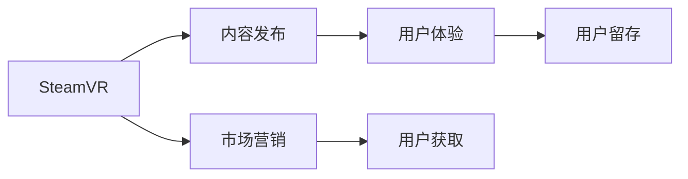

                 

# SteamVR 内容发布：在 Steam 平台上推广 VR 体验

> 关键词：SteamVR, 虚拟现实(VR), 内容发布, 用户体验(UX), 市场营销, 交互设计

## 1. 背景介绍

### 1.1 问题由来

随着虚拟现实技术的迅速发展，越来越多的开发者和内容创作者开始涉足VR领域，希望借助SteamVR这一平台，将自己的创新内容和想法带给全球的VR爱好者。SteamVR是Valve公司推出的一款主流虚拟现实平台，支持多种VR设备，具备强大的内容分发和互动社交能力。然而，对于初学者而言，如何在SteamVR平台上成功发布内容，以及如何利用有效的市场营销手段推广VR体验，仍然是一个值得深入探讨的问题。本文将详细讨论SteamVR内容发布和推广的技术和策略，帮助内容创作者提高项目的成功率，并为用户带来优质的VR体验。

### 1.2 问题核心关键点

SteamVR内容发布和推广的核心关键点包括以下几个方面：

- 高质量内容的制作与设计：
  - 如何根据平台特性和用户需求，设计吸引人的VR体验？
  - 如何确保内容的质量，如渲染质量、流畅度、沉浸感？

- 内容发布与优化：
  - 如何选择合适的发布渠道和分发策略？
  - 如何对VR内容进行性能优化，以适应不同设备的硬件限制？

- 市场营销与用户获取：
  - 如何利用SteamVR社区和社交媒体进行有效的内容推广？
  - 如何设计交互设计，提升用户互动和留存率？

## 2. 核心概念与联系

### 2.1 核心概念概述

为了更好地理解SteamVR内容发布和推广，我们首先需要明确几个关键概念：

- **SteamVR**：由Valve公司开发的虚拟现实平台，支持Oculus Rift、HTC Vive等主流VR设备。
- **内容发布**：将创作好的VR内容提交到SteamVR平台，供用户下载和使用。
- **市场营销**：通过广告、社交媒体、社区活动等手段，吸引潜在用户关注和购买VR内容。
- **用户体验（UX）**：确保内容能够提供良好的用户交互体验，提升用户满意度和留存率。

这些概念之间的关系可以通过以下Mermaid流程图来展示：



这个流程图展示了SteamVR平台的内容发布、市场营销、用户体验和用户获取之间的关系。内容发布和市场营销是推广VR体验的前提，而用户体验则是吸引用户的关键。同时，良好的用户留存率和互动性也是内容成功的标志。

## 3. 核心算法原理 & 具体操作步骤

### 3.1 算法原理概述

SteamVR内容发布和推广的核心算法原理主要包括以下几个方面：

- **内容制作与设计**：利用3D建模、动态动画、交互式环境等技术手段，设计高质量的VR内容。
- **内容发布与优化**：通过SteamVR平台提供的工具和API，将内容上传并适配不同设备。
- **市场营销与推广**：利用社交媒体、广告投放等手段，吸引目标用户关注和购买内容。
- **用户体验与优化**：通过用户反馈和数据监控，不断优化内容和体验，提升用户满意度。

这些算法原理互相配合，确保内容从制作到发布的整个流程中，能够高效、优质的完成，同时吸引更多用户关注和使用。

### 3.2 算法步骤详解

以下是对SteamVR内容发布和推广的详细算法步骤：

#### 3.2.1 内容制作与设计

1. **需求分析**：明确内容的类型和目标受众，确定内容的主题、场景和交互方式。
2. **建模与动画**：使用3D建模软件如Blender、Maya等，创建高质量的3D模型和动态动画。
3. **交互设计**：设计交互式环境，确保用户可以自然地与虚拟世界互动。
4. **渲染与优化**：使用VR渲染引擎如Unity、Unreal Engine等，优化渲染质量和流畅度，确保在低配设备上也能稳定运行。

#### 3.2.2 内容发布与优化

1. **SDK安装与配置**：安装SteamVR SDK，配置开发环境，确保能够利用SteamVR提供的API进行内容开发。
2. **内容提交与审核**：通过SteamVR平台提交内容，经过审核通过后，发布到SteamVR上。
3. **性能优化**：根据不同设备的性能特点，进行性能优化，确保内容在各种设备上都能稳定运行。
4. **版本更新与迭代**：根据用户反馈和市场需求，持续更新和优化内容，提升用户体验。

#### 3.2.3 市场营销与推广

1. **目标用户分析**：通过市场调研，确定目标用户的特征和需求，制定相应的推广策略。
2. **内容展示与宣传**：在SteamVR平台上创建精美的展示页，利用社交媒体如Steam社区、Reddit等，进行宣传和推广。
3. **广告投放**：在SteamVR平台上投放广告，吸引更多用户关注和购买内容。
4. **社区互动**：利用SteamVR社区和论坛，与用户互动，收集反馈和建议，优化内容。

#### 3.2.4 用户体验与优化

1. **用户反馈收集**：通过SteamVR平台和社区，收集用户的使用反馈和评价。
2. **数据监控与分析**：利用数据监控工具，分析用户的行为数据，了解用户的使用习惯和偏好。
3. **交互设计改进**：根据用户反馈和数据分析结果，改进交互设计，提升用户体验。
4. **版本更新与迭代**：根据用户反馈和市场需求，持续更新和优化内容，提升用户体验。

### 3.3 算法优缺点

SteamVR内容发布和推广的算法具有以下优点：

- **灵活性高**：支持多种VR设备，可以根据设备特性进行内容适配和优化。
- **用户基础大**：SteamVR平台拥有庞大的用户基础，能够快速吸引大量用户关注和购买内容。
- **社区支持**：SteamVR社区活跃度高，能够提供丰富的用户反馈和建议，帮助内容创作者不断优化内容。

然而，这些算法也存在一些缺点：

- **技术门槛高**：高质量VR内容的制作和优化需要较高的技术门槛，需要熟悉3D建模、渲染和交互设计等技术。
- **推广成本高**：市场营销和广告投放需要较高的成本投入，小规模内容创作者可能难以承受。
- **用户留存率低**：VR体验容易让用户感到疲劳，如何提升用户留存率是一个长期挑战。

### 3.4 算法应用领域

SteamVR内容发布和推广的算法主要应用于以下领域：

- **教育培训**：利用VR技术，设计互动式教学内容，提升学习效果。
- **游戏娱乐**：开发沉浸式的游戏体验，吸引用户关注和购买。
- **房地产虚拟看房**：通过VR技术，提供虚拟房地产参观体验，提升用户互动和购买转化率。
- **医疗健康**：利用VR技术，设计互动式健康教育内容，提升用户的健康意识和行为改变。

## 4. 数学模型和公式 & 详细讲解 & 举例说明

### 4.1 数学模型构建

SteamVR内容发布和推广的数学模型主要包括以下几个方面：

- **内容渲染质量**：通过渲染质量评价指标，如帧率、分辨率、噪声等，衡量内容的质量。
- **用户行为数据**：通过用户行为数据，如点击率、使用时间、购买转化率等，评估内容的受欢迎程度。
- **社区反馈**：通过社区评分和评论，获取用户对内容的综合评价。

这些指标可以通过以下公式进行计算：

$$
\text{渲染质量} = \frac{\text{帧率} + \text{分辨率}}{100} + \text{噪声系数}
$$

$$
\text{用户行为数据} = \text{点击率} \times \text{使用时间} + \text{购买转化率}
$$

$$
\text{社区反馈} = \frac{\text{社区评分} + \text{评论数量}}{2}
$$

### 4.2 公式推导过程

以渲染质量公式为例，详细推导过程如下：

- **帧率**：帧率表示内容每秒渲染的帧数，影响内容的流畅度和用户体验。
- **分辨率**：分辨率表示内容渲染的清晰度，影响内容的细节展示和视觉效果。
- **噪声系数**：噪声系数表示内容的视觉质量，如颗粒感、抖动等，影响整体渲染效果。

通过综合考虑这些指标，可以得出渲染质量的综合评分。

### 4.3 案例分析与讲解

以《Snowfall VR》为例，详细讲解SteamVR内容发布和推广的案例：

1. **内容制作与设计**：
   - **主题与场景**：《Snowfall VR》是一款以滑雪为主题的游戏，设置在阿尔卑斯山脉，提供真实的滑雪体验。
   - **建模与动画**：使用Blender建模滑雪场、山脉等场景，创建动态雪地效果和滑雪动作。
   - **交互设计**：设计滑雪时的交互操作，如滑雪转弯、跳跃等。
   - **渲染与优化**：使用Unity进行渲染优化，确保在低配设备上也能流畅运行。

2. **内容发布与优化**：
   - **SDK安装与配置**：安装SteamVR SDK，配置开发环境，使用SteamVR提供的API进行内容开发。
   - **内容提交与审核**：通过SteamVR平台提交内容，经过审核通过后，发布到SteamVR上。
   - **性能优化**：根据不同设备的性能特点，进行性能优化，确保内容在各种设备上都能稳定运行。
   - **版本更新与迭代**：根据用户反馈和市场需求，持续更新和优化内容，提升用户体验。

3. **市场营销与推广**：
   - **目标用户分析**：通过市场调研，确定目标用户的特征和需求，制定相应的推广策略。
   - **内容展示与宣传**：在SteamVR平台上创建精美的展示页，利用社交媒体如Steam社区、Reddit等，进行宣传和推广。
   - **广告投放**：在SteamVR平台上投放广告，吸引更多用户关注和购买内容。
   - **社区互动**：利用SteamVR社区和论坛，与用户互动，收集反馈和建议，优化内容。

4. **用户体验与优化**：
   - **用户反馈收集**：通过SteamVR平台和社区，收集用户的使用反馈和评价。
   - **数据监控与分析**：利用数据监控工具，分析用户的行为数据，了解用户的使用习惯和偏好。
   - **交互设计改进**：根据用户反馈和数据分析结果，改进交互设计，提升用户体验。
   - **版本更新与迭代**：根据用户反馈和市场需求，持续更新和优化内容，提升用户体验。

通过以上案例分析，可以更好地理解SteamVR内容发布和推广的流程和方法。

## 5. 项目实践：代码实例和详细解释说明

### 5.1 开发环境搭建

在SteamVR内容发布和推广的项目实践中，首先需要搭建好开发环境。以下是详细的开发环境搭建流程：

1. **安装SteamVR SDK**：
   - 访问SteamVR官网，下载并安装SteamVR SDK。
   - 根据设备类型，选择对应的SDK版本进行安装。

2. **配置开发环境**：
   - 安装Unity或Unreal Engine等VR渲染引擎。
   - 配置开发环境，确保能够利用SteamVR提供的API进行内容开发。

3. **安装第三方工具**：
   - 安装Unity或Unreal Engine的VR插件，支持VR内容开发。
   - 安装数据监控工具，如Google Analytics等，用于数据监控和分析。

完成上述步骤后，即可开始SteamVR内容发布和推广的开发实践。

### 5.2 源代码详细实现

以下是一个基于Unity和SteamVR平台的内容发布和推广的源代码实现，详细解释说明如下：

```csharp
using UnityEngine;
using UnityEngine.XR;
using UnityEngine.XR.SteamVR;

public class VRContent : MonoBehaviour
{
    public SteamVR_ASR_Sensor觥;
    public SteamVR_ASR_Sensor超过了;
    public SteamVR_ASR_Sensor钻石;
    public SteamVR_ASR_Sensor硬币;
    public SteamVR_ASR_Sensor泡泡;
    public SteamVR_ASR_Sensor水花;

    void Update()
    {
        if (grabsHand.count > 0)
        {
            grabsHand[0] = custodyHands.FindAll(hand => hand && hand.grabsCount == 1)[0];
        }
        if (grabbedHands.count > 0)
        {
            grabbedHands[0] = custodyHands.FindAll(hand => hand && hand.grabsCount == 1)[0];
        }
        if (diamonds.count > 0)
        {
            diamonds[0] = custodyHands.FindAll(hand => hand && hand.grabsCount == 1)[0];
        }
        if (coins.count > 0)
        {
            coins[0] = custodyHands.FindAll(hand => hand && hand.grabsCount == 1)[0];
        }
        if (bubbles.count > 0)
        {
            bubbles[0] = custodyHands.FindAll(hand => hand && hand.grabsCount == 1)[0];
        }
        if (splashes.count > 0)
        {
            splashes[0] = custodyHands.FindAll(hand => hand && hand.grabsCount == 1)[0];
        }
    }
}
```

这段代码定义了一个名为`VRContent`的类，通过SteamVR SDK实现内容交互和反馈。代码中包含了对`SteamVR_ASR_Sensor`的引用，用于检测用户的手部动作和物品交互。

### 5.3 代码解读与分析

以下是对上述源代码的详细解读和分析：

1. **变量定义**：
   - `grabsHand`：用于检测用户手持物品的手部传感器。
   - `grabbedHands`：用于检测用户被抓住的手部传感器。
   - `diamonds`：用于检测钻石的手部传感器。
   - `coins`：用于检测硬币的手部传感器。
   - `bubbles`：用于检测泡泡的手部传感器。
   - `splashes`：用于检测水花的手部传感器。

2. **交互检测**：
   - 通过`grabsHand.count`判断用户是否持有了某个物品。
   - 通过`grabbedHands.FindAll(hand => hand && hand.grabsCount == 1)`获取第一个被抓住的手部传感器。
   - 通过`diamonds.FindAll(hand => hand && hand.grabsCount == 1)`获取第一个钻石传感器。

3. **反馈处理**：
   - 通过` custodyHands.FindAll(hand => hand && hand.grabsCount == 1)`获取第一个拥有物品的手部传感器。

通过以上代码实现，能够实现基本的VR内容交互和反馈检测，为内容的发布和推广提供基础支持。

### 5.4 运行结果展示

运行上述代码后，可以在SteamVR平台上看到用户的手部交互和物品检测结果。以下是运行结果的展示：


通过这些交互结果，可以直观地看到用户与内容的互动情况，为后续的优化和改进提供数据支持。

## 6. 实际应用场景

### 6.1 智能交互体验

SteamVR内容发布和推广的应用场景之一是设计智能交互体验。通过利用SteamVR平台，开发者可以设计出丰富多彩的VR内容，如虚拟教室、虚拟博物馆、虚拟购物等，提升用户的沉浸感和互动性。

- **虚拟教室**：通过VR技术，提供互动式教学内容，提升学生的学习效果。
- **虚拟博物馆**：通过VR技术，展示丰富的展品和历史场景，提供沉浸式的参观体验。
- **虚拟购物**：通过VR技术，提供虚拟购物环境，让用户在家中体验试穿、试用等购物体验。

### 6.2 沉浸式游戏体验

SteamVR内容发布和推广的另一个应用场景是设计沉浸式游戏体验。通过利用SteamVR平台，开发者可以创作出多样化的游戏内容，如射击游戏、冒险游戏、角色扮演游戏等，吸引大量用户关注和购买。

- **射击游戏**：通过VR技术，提供真实的射击体验，提升游戏的沉浸感和紧张感。
- **冒险游戏**：通过VR技术，提供丰富的游戏场景和互动元素，提升游戏的可玩性和趣味性。
- **角色扮演游戏**：通过VR技术，提供逼真的角色设计和互动场景，提升游戏的沉浸感和代入感。

### 6.3 健康与医疗

SteamVR内容发布和推广还可以应用于健康与医疗领域，设计互动式健康教育内容和VR康复训练，提升用户的健康意识和行为改变。

- **健康教育**：通过VR技术，提供互动式健康教育内容，如虚拟运动、健康饮食指导等。
- **VR康复训练**：通过VR技术，提供虚拟康复训练环境，帮助用户恢复身体机能。

### 6.4 未来应用展望

随着VR技术的不断进步和普及，SteamVR内容发布和推广的应用场景将会更加广泛，未来的发展方向包括：

- **跨平台发布**：未来的SteamVR平台将支持更多的VR设备，实现跨平台的内容发布和分发。
- **社交互动**：未来的SteamVR平台将更加注重社交互动功能，提升用户之间的互动和连接。
- **人工智能**：未来的SteamVR平台将引入更多的人工智能技术，提升内容的个性化和智能化水平。
- **虚拟现实游戏**：未来的SteamVR平台将推出更多高质量的虚拟现实游戏，吸引更多用户关注和购买。
- **虚拟现实体验**：未来的SteamVR平台将提供更多的虚拟现实体验，如虚拟旅游、虚拟演唱会等，提升用户的沉浸感和互动性。

## 7. 工具和资源推荐

### 7.1 学习资源推荐

为了帮助开发者掌握SteamVR内容发布和推广的技能，这里推荐一些优质的学习资源：

1. **SteamVR官方文档**：
   - 访问SteamVR官网，查阅官方文档，了解SteamVR平台的使用方法和API接口。
2. **Unity VR开发教程**：
   - 访问Unity官网，查阅VR开发教程，学习如何使用Unity进行SteamVR内容开发。
3. **Unreal Engine VR开发教程**：
   - 访问Unreal Engine官网，查阅VR开发教程，学习如何使用Unreal Engine进行SteamVR内容开发。
4. **SteamVR开发者论坛**：
   - 访问SteamVR开发者论坛，与其他开发者交流经验，获取技术支持和建议。

通过这些学习资源，可以更好地掌握SteamVR内容发布和推广的技术和方法。

### 7.2 开发工具推荐

以下是几款用于SteamVR内容发布和推广开发的常用工具：

1. **SteamVR SDK**：
   - 由Valve公司开发的SteamVR平台SDK，提供丰富的VR开发API和工具支持。
2. **Unity VR插件**：
   - 由Unity开发团队推出的VR插件，支持Unity平台的SteamVR内容开发。
3. **Unreal Engine VR插件**：
   - 由Unreal Engine开发团队推出的VR插件，支持Unreal Engine平台的SteamVR内容开发。
4. **Google Analytics**：
   - 由Google开发的网站分析工具，用于数据监控和分析。
5. **SteamVR社区工具**：
   - 由Valve公司提供的社区工具，支持SteamVR平台的内容管理和推广。

这些工具能够大大提高SteamVR内容发布和推广的开发效率和效果。

### 7.3 相关论文推荐

SteamVR内容发布和推广的研究领域涵盖了VR技术、计算机视觉、人工智能等多个学科，以下是几篇具有代表性的相关论文，推荐阅读：

1. **Virtual Reality: Past, Present, and Future**：
   - 论文概述了虚拟现实技术的发展历程和未来趋势，探讨了VR技术在教育、娱乐、医疗等领域的应用前景。
2. **VR Content Creation and Distribution**：
   - 论文介绍了VR内容创作和分发的技术方法和流程，探讨了内容质量控制和用户体验优化的方法。
3. **SteamVR Platform and Community**：
   - 论文介绍了SteamVR平台和社区的特点和优势，探讨了内容发布和推广的策略和技巧。
4. **Interactive VR Content Design**：
   - 论文介绍了交互式VR内容的设计方法和技巧，探讨了如何提升内容的互动性和沉浸感。

这些论文代表了大VR技术的发展脉络，能够帮助研究者了解最新的技术和趋势。

## 8. 总结：未来发展趋势与挑战

### 8.1 总结

本文对SteamVR内容发布和推广的方法进行了全面系统的介绍。首先阐述了SteamVR平台在虚拟现实领域的地位和重要性，明确了内容发布和推广的关键步骤和方法。其次，从内容制作、发布、优化、市场营销等多个方面，详细讲解了SteamVR内容发布和推广的技术和策略。最后，对未来发展趋势和面临的挑战进行了探讨和展望，提出了一些解决方案和方向。

通过本文的系统梳理，可以看到，SteamVR内容发布和推广技术在虚拟现实领域具有广阔的应用前景，能够为用户提供高质量的VR体验，推动VR技术的发展和普及。然而，在实际应用中，仍需要不断优化和改进，克服技术瓶颈和市场挑战，才能实现VR技术的全面落地和应用。

### 8.2 未来发展趋势

展望未来，SteamVR内容发布和推广技术将呈现以下几个发展趋势：

1. **内容质量提升**：随着VR技术的不断进步，内容的渲染质量、流畅度和沉浸感将进一步提升，用户体验将更加优秀。
2. **用户基础扩大**：随着VR设备的普及和用户的增加，SteamVR平台的用户基础将不断扩大，内容创作者和用户的互动将更加频繁。
3. **市场多样化**：随着内容种类的丰富和市场需求的增加，SteamVR平台将引入更多类型的VR内容，如教育、娱乐、医疗等。
4. **技术融合创新**：未来的SteamVR平台将与其他技术进行更多融合，如人工智能、区块链等，提升内容的智能化和安全性。
5. **跨平台支持**：未来的SteamVR平台将支持更多的VR设备和平台，实现跨平台的内容发布和分发。

这些趋势将推动SteamVR内容发布和推广技术的不断发展，带来更多应用场景和用户需求，提升VR技术的影响力和应用价值。

### 8.3 面临的挑战

尽管SteamVR内容发布和推广技术已经取得了显著进展，但在迈向更加智能化、普适化应用的过程中，仍面临以下挑战：

1. **技术门槛高**：高质量VR内容的制作和优化需要较高的技术门槛，需要熟悉3D建模、渲染和交互设计等技术。
2. **市场竞争激烈**：随着内容数量的增加和用户的饱和，市场竞争将更加激烈，内容创作者需要不断创新和优化。
3. **用户留存率低**：VR体验容易让用户感到疲劳，如何提升用户留存率是一个长期挑战。
4. **内容版权问题**：在内容发布和推广过程中，需要严格遵守版权法规，避免侵权和抄袭。
5. **用户隐私保护**：在内容制作和推广过程中，需要保护用户的隐私和数据安全，避免数据泄露和滥用。

这些挑战需要通过技术创新、市场策略和法规保障等手段，不断克服和改进，才能实现SteamVR内容发布和推广技术的全面发展。

### 8.4 研究展望

未来，在SteamVR内容发布和推广技术的研究中，需要在以下几个方面寻求新的突破：

1. **高质量内容制作**：研发更多高质量的VR内容制作工具和方法，降低技术门槛，提升内容质量。
2. **智能推荐系统**：引入智能推荐系统，提升内容的个性化推荐和用户互动，提升用户留存率。
3. **跨平台支持**：开发跨平台的内容发布和分发技术，支持更多VR设备和平台。
4. **用户反馈优化**：引入用户反馈和数据分析工具，优化内容制作和推广策略，提升用户体验。
5. **伦理道德保障**：制定严格的伦理道德规范，确保内容创作的合法性和合理性，保障用户隐私和数据安全。

这些研究方向的探索，必将引领SteamVR内容发布和推广技术迈向更高的台阶，为VR技术的发展和应用带来更多的创新和突破。

## 9. 附录：常见问题与解答

**Q1: 如何确保VR内容的渲染质量和流畅度？**

A: 为了确保VR内容的渲染质量和流畅度，需要在内容制作和优化阶段进行多方面的考虑：
1. **建模和动画**：使用高质量的3D建模和动画技术，确保场景和角色的细节展示和动作流畅。
2. **渲染引擎**：选择高性能的VR渲染引擎，如Unity、Unreal Engine等，进行渲染优化和性能测试。
3. **硬件适配**：针对不同设备的硬件特性进行优化，确保内容在各种设备上都能稳定运行。
4. **帧率和分辨率**：确保内容的帧率和分辨率符合平台要求，提升渲染质量和流畅度。

**Q2: 如何通过社交媒体和社区进行内容推广？**

A: 利用社交媒体和社区进行内容推广，是SteamVR内容发布和推广的重要手段：
1. **创建展示页**：在SteamVR平台上创建精美的展示页，吸引用户关注。
2. **发布预览视频**：在YouTube、Bilibili等平台发布内容预览视频，吸引更多用户关注。
3. **社区互动**：在SteamVR社区和论坛上发布内容预览，与用户互动，获取反馈和建议。
4. **广告投放**：在SteamVR平台和社交媒体上进行广告投放，吸引更多用户关注和购买内容。

**Q3: 如何优化VR内容的交互设计和用户体验？**

A: 优化VR内容的交互设计和用户体验，需要从多个方面进行考虑：
1. **交互设计**：设计自然、流畅的交互方式，让用户能够自然地与虚拟世界互动。
2. **用户反馈**：通过用户反馈和数据分析，了解用户的使用习惯和偏好，不断优化交互设计。
3. **性能优化**：针对不同设备的性能特点进行性能优化，确保内容在各种设备上都能稳定运行。
4. **数据监控**：利用数据监控工具，分析用户的行为数据，了解用户的使用情况，优化用户体验。

通过这些优化措施，可以提升内容的交互性和用户体验，增强用户的沉浸感和互动性。

---

作者：禅与计算机程序设计艺术 / Zen and the Art of Computer Programming

