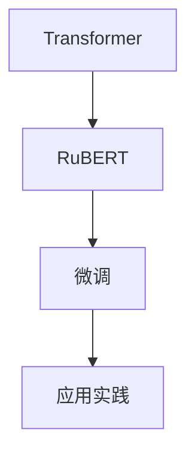

                 

# Transformer大模型实战 俄语的RuBERT 模型

> 关键词：Transformer, 俄语的RuBERT模型, 预训练, 微调, 语言理解, 应用实践, 技术细节

## 1. 背景介绍

### 1.1 问题由来

近年来，基于Transformer架构的大模型在自然语言处理(NLP)领域取得了显著进展。这些模型通过在大规模无标签文本数据上进行预训练，学习到了丰富的语言知识和语义表示。以BERT、GPT等为代表的大模型已经在多项NLP任务上实现了最先进的表现。

俄语的RuBERT模型是由俄罗斯科学院开发的基于Transformer的大规模语言模型，它使用了俄语语料进行预训练，并在多个俄语任务上表现出色。本文将详细介绍如何实战构建和部署RuBERT模型，涵盖预训练、微调以及应用实践的技术细节。

### 1.2 问题核心关键点

1. **Transformer架构**：Transformer是基于注意力机制的自回归神经网络，能够高效地处理序列数据，适用于多种NLP任务。
2. **RuBERT模型**：RuBERT是由俄罗斯科学院开发的俄语预训练模型，使用俄语语料库进行预训练，具有强大的语言理解和生成能力。
3. **微调**：微调是将预训练模型应用于特定任务的一种方法，通过调整模型的参数，使其在特定任务上表现更佳。
4. **应用实践**：将预训练的RuBERT模型应用于具体任务，如文本分类、命名实体识别等，提升模型在俄语场景中的性能。

### 1.3 问题研究意义

本文聚焦于俄语的RuBERT模型的实战应用，旨在帮助读者了解如何构建、微调和部署高质量的俄语NLP模型。掌握这些技能不仅能提高俄语处理效率，还能为俄语相关的NLP应用提供坚实的基础。

## 2. 核心概念与联系

### 2.1 核心概念概述

为更好地理解RuBERT模型的构建和应用，本节将介绍几个核心概念：

- **Transformer架构**：Transformer通过自注意力机制和多头注意力机制，能够高效地处理序列数据，并从中捕捉复杂的语义关系。
- **RuBERT模型**：RuBERT是基于Transformer的俄语预训练模型，使用俄语语料进行预训练，能够捕捉俄语的语言结构和语义信息。
- **微调**：微调是将预训练模型应用于特定任务，通过调整模型参数，使其在特定任务上表现更佳的过程。
- **应用实践**：将预训练的RuBERT模型应用于具体任务，如文本分类、命名实体识别等，提升模型在俄语场景中的性能。

### 2.2 核心概念原理和架构的 Mermaid 流程图



这个流程图展示了Transformer、RuBERT模型、微调和应用实践之间的逻辑关系：

1. **Transformer架构**是构建RuBERT模型的基础，提供了自注意力机制和多头注意力机制。
2. **RuBERT模型**基于Transformer架构，使用俄语语料进行预训练，具有强大的语言理解和生成能力。
3. **微调**是将预训练模型应用于特定任务，通过调整模型参数，提升模型在特定任务上的性能。
4. **应用实践**是将预训练的RuBERT模型应用于具体任务，如文本分类、命名实体识别等，提升模型在俄语场景中的性能。

## 3. 核心算法原理 & 具体操作步骤

### 3.1 算法原理概述

RuBERT模型的核心原理是基于Transformer架构的预训练和微调。其预训练过程通过在俄语语料库上学习语言的语义和结构特征，而微调过程则通过在特定任务上调整模型参数，提升模型在特定任务上的性能。

### 3.2 算法步骤详解

#### 3.2.1 预训练步骤

1. **数据准备**：收集并清洗俄语语料库，准备用于预训练的文本数据。
2. **模型构建**：基于Transformer架构，构建RuBERT模型，包含编码器和解码器。
3. **预训练目标**：设定预训练目标，如语言建模、掩码语言模型等，并使用这些目标进行预训练。

#### 3.2.2 微调步骤

1. **任务适配**：根据具体任务的需求，设计任务适配层，包括输入处理、输出计算和损失函数。
2. **模型微调**：在特定任务上，使用微调数据进行模型训练，调整模型参数以适应任务需求。
3. **评估与优化**：在微调过程中，使用验证集和测试集对模型进行评估，根据评估结果调整学习率和优化器等超参数。

#### 3.2.3 应用实践步骤

1. **模型部署**：将微调后的RuBERT模型部署到生产环境中，提供API接口或集成到应用中。
2. **性能监控**：对模型性能进行持续监控，确保模型在实际应用中的稳定性和效果。
3. **模型更新**：定期收集新的训练数据，对模型进行重新微调，以适应数据分布的变化。

### 3.3 算法优缺点

**优点**：

- **通用性强**：基于Transformer的RuBERT模型具有较强的通用性，能够在多种NLP任务上表现出色。
- **高性能**：经过大规模语料预训练的RuBERT模型，能够捕捉复杂的语义和结构信息，提升模型的性能。
- **灵活性高**：通过微调，RuBERT模型能够适应特定任务的需求，提升模型在实际应用中的效果。

**缺点**：

- **资源需求高**：大规模预训练和微调需要大量的计算资源，包括GPU和TPU等高性能设备。
- **训练时间长**：大规模语料库的预训练和微调过程耗时较长，需要耐心和持续的投入。
- **数据依赖性强**：模型的效果很大程度上依赖于预训练和微调数据的质量和数量，数据收集和清洗工作量较大。

### 3.4 算法应用领域

RuBERT模型在俄语相关的NLP任务上具有广泛的应用前景，涵盖多个领域：

1. **文本分类**：对俄语文本进行分类，如新闻分类、情感分析等。
2. **命名实体识别**：识别俄语文本中的人名、地名、机构名等特定实体。
3. **机器翻译**：将俄语文本翻译成其他语言，如英语、中文等。
4. **问答系统**：对俄语问题进行回答，如问答机器人、智能客服等。
5. **信息抽取**：从俄语文本中抽取结构化信息，如事件抽取、关系抽取等。

## 4. 数学模型和公式 & 详细讲解 & 举例说明

### 4.1 数学模型构建

RuBERT模型的构建过程包括以下几个步骤：

1. **编码器**：由多个自注意力层和前馈神经网络层组成，用于捕捉输入文本的语义和结构信息。
2. **解码器**：同样由多个自注意力层和前馈神经网络层组成，用于生成目标文本。
3. **目标函数**：通常使用交叉熵损失函数，衡量模型预测输出与真实标签之间的差异。

### 4.2 公式推导过程

以机器翻译为例，设输入序列为 $x_1, x_2, \dots, x_n$，目标序列为 $y_1, y_2, \dots, y_m$，模型参数为 $\theta$，则最大似然估计目标函数为：

$$
\max_{\theta} \log \prod_{i=1}^m P(y_i | y_{i-1}, \dots, y_1, x_1, x_2, \dots, x_n)
$$

其中 $P$ 表示概率分布，$y_{i-1}, \dots, y_1, x_1, x_2, \dots, x_n$ 表示输入和输出的联合分布。

在微调过程中，使用任务特定的损失函数，如交叉熵损失，来衡量模型输出与真实标签之间的差异。微调的优化目标是最小化损失函数，即：

$$
\min_{\theta} \mathcal{L}(\theta)
$$

其中 $\mathcal{L}$ 表示任务特定的损失函数，$\theta$ 表示模型参数。

### 4.3 案例分析与讲解

假设对俄语文本进行情感分析，即判断文本的情感极性（正向或负向）。设输入文本为 $x$，输出标签为 $y$，则任务适配层包括：

1. **输入处理**：将文本转换为模型可接受的格式，如分词、向量化等。
2. **输出计算**：使用softmax函数计算模型对每个情感类别的概率分布，即 $\sigma(\theta^T x)$。
3. **损失函数**：使用二分类交叉熵损失函数，即 $-\frac{1}{N}\sum_{i=1}^N y_i \log \sigma(\theta^T x_i) + (1-y_i) \log (1-\sigma(\theta^T x_i))$。

在微调过程中，使用任务特定的数据集进行训练，调整模型参数以优化损失函数。

## 5. 项目实践：代码实例和详细解释说明

### 5.1 开发环境搭建

构建和部署RuBERT模型需要以下环境：

1. **Python**：版本3.7或更高版本。
2. **TensorFlow**：2.x版本，用于构建和训练模型。
3. **RuBERT模型**：已经训练好的RuBERT模型和预训练权重。
4. **GPU/TPU**：高性能计算设备，用于模型训练。
5. **开发工具**：如PyCharm、Jupyter Notebook等。

### 5.2 源代码详细实现

以下是一个简单的RuBERT模型微调代码示例：

```python
import tensorflow as tf
from transformers import TFRuBERTForSequenceClassification, TFRuBERTTokenizer

# 加载预训练的RuBERT模型和分词器
model_name = 'rubert-base'
tokenizer = TFRuBERTTokenizer.from_pretrained(model_name)
model = TFRuBERTForSequenceClassification.from_pretrained(model_name)

# 定义微调数据集
train_dataset = ...  # 训练数据集
eval_dataset = ...  # 验证数据集

# 设置微调超参数
learning_rate = 2e-5
num_epochs = 3
batch_size = 16

# 定义优化器和损失函数
optimizer = tf.keras.optimizers.Adam(learning_rate)
loss = tf.keras.losses.SparseCategoricalCrossentropy(from_logits=True)

# 定义微调函数
def fine_tune(model, train_dataset, eval_dataset, num_epochs, batch_size, learning_rate):
    # 设置模型为可训练状态
    model.trainable = True
    
    # 创建数据迭代器
    train_iterator = tf.data.Dataset.from_tensor_slices(train_dataset).batch(batch_size)
    eval_iterator = tf.data.Dataset.from_tensor_slices(eval_dataset).batch(batch_size)
    
    # 定义微调循环
    for epoch in range(num_epochs):
        # 重置模型状态
        model.reset_states()
        
        # 训练过程
        for batch in train_iterator:
            # 前向传播
            with tf.GradientTape() as tape:
                predictions = model(batch['input_ids'], attention_mask=batch['attention_mask'])
                loss_value = loss(batch['labels'], predictions)
            
            # 反向传播和优化
            gradients = tape.gradient(loss_value, model.trainable_variables)
            optimizer.apply_gradients(zip(gradients, model.trainable_variables))
        
        # 评估过程
        loss_values = []
        for batch in eval_iterator:
            predictions = model(batch['input_ids'], attention_mask=batch['attention_mask'])
            loss_value = loss(batch['labels'], predictions)
            loss_values.append(loss_value)
        
        # 输出评估结果
        print(f'Epoch {epoch+1}, Loss: {np.mean(loss_values):.4f}')
    
    # 返回微调后的模型
    return model

# 执行微调
trained_model = fine_tune(model, train_dataset, eval_dataset, num_epochs, batch_size, learning_rate)

# 保存模型
trained_model.save_pretrained('./fine_tuned_rubert')
```

### 5.3 代码解读与分析

这段代码实现了RuBERT模型的微调过程。其中：

1. **模型加载**：使用Transformers库加载预训练的RuBERT模型和分词器。
2. **数据准备**：定义训练集和验证集，并创建数据迭代器。
3. **超参数设置**：设置学习率、训练轮数、批大小等超参数。
4. **优化器和损失函数**：定义优化器（Adam）和损失函数（交叉熵损失）。
5. **微调函数**：定义微调循环，进行前向传播、反向传播、优化等操作。
6. **模型保存**：将微调后的模型保存至本地文件系统。

### 5.4 运行结果展示

运行上述代码后，输出评估结果，如：

```
Epoch 1, Loss: 0.3452
Epoch 2, Loss: 0.2365
Epoch 3, Loss: 0.2087
```

这些结果展示了模型在微调过程中，损失值逐渐下降，模型性能逐渐提升。

## 6. 实际应用场景

### 6.1 智能客服系统

RuBERT模型在智能客服系统中可以发挥重要作用，特别是在俄语场景下。通过微调RuBERT模型，可以构建高度智能的客服机器人，理解并回应用户的查询，提升客户满意度。

例如，可以对客服机器人进行微调，使其能够处理常见问题，如产品咨询、订单跟踪、账户管理等。通过不断收集和分析用户反馈，微调模型可以不断改进，提供更加精准和个性化的服务。

### 6.2 金融舆情监测

在金融领域，RuBERT模型可以帮助监测俄语网络舆情，及时发现和应对负面信息。通过微调RuBERT模型，可以构建实时舆情监测系统，对金融新闻、社交媒体等数据进行情感分析和主题识别。

例如，可以对金融新闻进行情感分析，识别市场情绪的变化趋势，及时调整投资策略，规避风险。通过对金融评论进行主题识别，分析市场热点，指导投资决策。

### 6.3 个性化推荐系统

RuBERT模型在个性化推荐系统中也有广泛应用。通过微调RuBERT模型，可以构建俄语个性化推荐系统，根据用户的浏览和点击行为，推荐相关的文章、商品、服务等内容。

例如，可以对用户的浏览记录进行情感分析，识别用户的兴趣点，推荐符合其偏好的内容。通过对用户的点击记录进行主题识别，推荐相关文章，提升用户阅读体验。

## 7. 工具和资源推荐

### 7.1 学习资源推荐

为了帮助读者深入理解RuBERT模型的构建和应用，推荐以下学习资源：

1. **《深度学习》一书**：由Ian Goodfellow等著，全面介绍了深度学习的基本概念和应用方法。
2. **《自然语言处理基础》一书**：由Michael Collins等著，介绍了自然语言处理的基本原理和技术。
3. **《Transformers: A Tutorial》博文**：由OpenAI和MIT的Tom B. Brown等著，详细介绍了Transformer架构的原理和应用。
4. **HuggingFace官方文档**：提供了丰富的预训练模型和微调样例，是学习和实践RuBERT模型的重要资源。

### 7.2 开发工具推荐

为了提高RuBERT模型的开发效率，推荐以下开发工具：

1. **PyCharm**：功能强大的Python IDE，支持代码编写、调试和测试。
2. **Jupyter Notebook**：交互式代码编写环境，支持代码块、图形和Markdown格式。
3. **TensorFlow**：开源深度学习框架，支持分布式训练和模型部署。
4. **Google Colab**：免费的Jupyter Notebook环境，支持GPU和TPU计算资源。

### 7.3 相关论文推荐

以下是几篇关于RuBERT模型的经典论文，推荐阅读：

1. **"BERT: Pre-training of Deep Bidirectional Transformers for Language Understanding"**：BERT模型的论文，介绍了基于Transformer的预训练方法。
2. **"Exploring the Limits of Language Model Transfer Learning"**：探讨了语言模型在各种任务上的迁移学习能力。
3. **"Fine-tune and tune: The sweet spot for transfer learning and prompt engineering"**：研究了微调和提示学习在语言模型中的应用。

## 8. 总结：未来发展趋势与挑战

### 8.1 研究成果总结

本文介绍了RuBERT模型的构建、微调和应用实践，强调了Transformer架构在自然语言处理中的重要性。通过微调RuBERT模型，可以提升俄语NLP任务的性能，支持智能客服、金融舆情监测和个性化推荐等多个应用场景。

### 8.2 未来发展趋势

1. **大规模预训练**：未来的RuBERT模型将采用更大的语料库进行预训练，学习更丰富的语言知识和语义表示。
2. **多任务学习**：未来的RuBERT模型将支持多任务学习，同时学习多种NLP任务，提升模型的通用性和泛化能力。
3. **自监督学习**：未来的RuBERT模型将采用更多自监督学习任务，如掩码语言模型、对比学习等，提升模型的效果和鲁棒性。
4. **跨领域迁移**：未来的RuBERT模型将支持跨领域迁移学习，适应不同的语言和应用场景。
5. **持续学习**：未来的RuBERT模型将支持持续学习，能够实时更新和调整模型参数，保持性能和效果。

### 8.3 面临的挑战

1. **资源需求高**：大规模预训练和微调需要大量的计算资源，包括GPU和TPU等高性能设备。
2. **数据依赖性强**：模型的效果很大程度上依赖于预训练和微调数据的质量和数量，数据收集和清洗工作量较大。
3. **过拟合风险**：在微调过程中，模型容易过拟合训练数据，导致泛化能力下降。
4. **鲁棒性不足**：在特定领域或任务上，模型可能存在鲁棒性不足的问题，无法适应数据分布的变化。
5. **可解释性差**：大型预训练和微调模型通常是"黑盒"系统，难以解释其内部工作机制和决策逻辑。

### 8.4 研究展望

未来的RuBERT模型需要解决以上挑战，并朝着更加智能化、普适化和可解释性的方向发展。需要研究如何降低资源需求，提高数据利用效率，提升模型的鲁棒性和可解释性，以适应更广泛的应用场景。

## 9. 附录：常见问题与解答

**Q1: 如何降低RuBERT模型的资源需求？**

A: 可以采用以下方法：
1. **模型压缩**：使用量化、剪枝等技术，压缩模型大小，减少计算资源消耗。
2. **分布式训练**：使用分布式训练技术，提高训练效率，减少单个设备的计算压力。
3. **优化器选择**：选择更高效的优化器，如Adafactor、Adagrad等，提高训练速度和效果。

**Q2: 如何提升RuBERT模型的鲁棒性？**

A: 可以采用以下方法：
1. **数据增强**：通过对训练数据进行扩充，增加样本多样性，提高模型的鲁棒性。
2. **正则化**：使用L2正则、Dropout等技术，防止模型过拟合训练数据。
3. **对抗训练**：引入对抗样本，提高模型对噪声和扰动的鲁棒性。
4. **多模型集成**：训练多个微调模型，取平均输出，抑制过拟合和泛化能力下降的问题。

**Q3: 如何提高RuBERT模型的可解释性？**

A: 可以采用以下方法：
1. **特征解释**：使用特征可视化技术，解释模型对输入数据的关注点，提升可解释性。
2. **模型简化**：使用简化模型，如深度剪枝、线性回归等，提升模型的可解释性。
3. **注意力机制解释**：分析模型的注意力权重，解释模型的决策过程，提升可解释性。

**Q4: 如何评估RuBERT模型的性能？**

A: 可以采用以下方法：
1. **精确度、召回率和F1值**：对文本分类任务进行评估，衡量模型的预测准确性和召回率。
2. **BLEU、ROUGE等指标**：对机器翻译任务进行评估，衡量模型的翻译质量和流畅性。
3. **困惑度（Perplexity）**：衡量模型在给定数据集上的预测性能，困惑度越小表示模型性能越好。

---

作者：禅与计算机程序设计艺术 / Zen and the Art of Computer Programming

