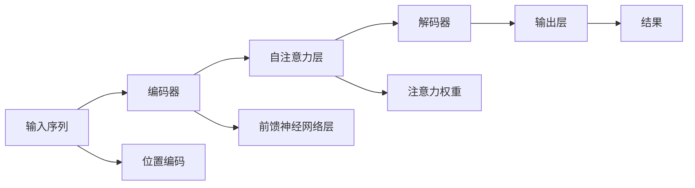

                 

# Transformer大模型实战 词汇重叠的影响

> 关键词：Transformer, 词汇重叠, 语言模型, 自然语言处理(NLP), 矩阵乘法, 正弦位置编码, 自注意力机制, 词向量, 预训练, 微调, 应用实例

## 1. 背景介绍

### 1.1 问题由来
Transformer作为现代自然语言处理(NLP)的基石，以其高效、灵活的自注意力机制和高性能，逐渐成为处理大规模语言数据的首选模型。Transformer的核心在于其自注意力子层，通过矩阵乘法和向量加法实现信息的并行处理。然而，在实际应用中，Transformer面临的一个挑战是如何处理输入文本中词汇的重叠现象，即同一单词在输入序列中重复出现的情况。

词汇重叠在现实世界中的自然语言数据中非常常见，尤其是在文本中常出现重复的固定词组或短语。词汇重叠的存在会影响Transformer模型的效率和精度，特别是在大规模语言模型的训练和推理过程中。因此，如何有效地处理词汇重叠，是Transformer大模型实战中的一个重要课题。

### 1.2 问题核心关键点
在Transformer模型中，词汇重叠问题主要体现在以下几个方面：
- **矩阵乘法计算**：对于输入序列中相同的词汇，由于它们在注意力机制中会被多次查询，导致矩阵乘法计算的重复计算，影响模型的效率。
- **自注意力机制中的编码器-解码器相互作用**：在编码器中，相同的词汇会被多次计算，造成重复计算的问题。解码器中同样存在相似问题，但更复杂，因为它需要结合上下文信息进行预测。
- **位置编码和词向量的设计**：正弦位置编码（Positional Encoding）是Transformer中的一个重要组成部分，它通过正弦和余弦函数的组合来为每个位置赋予特定的位置信息。但当同一词汇重复出现时，正弦位置编码无法处理这种情况，从而影响模型的准确性。

本文将深入探讨词汇重叠对Transformer大模型的影响，以及如何通过改进算法和优化设计，提升模型的处理能力和效率。

## 2. 核心概念与联系

### 2.1 核心概念概述

为了更好地理解词汇重叠对Transformer大模型的影响，本节将介绍几个关键概念：

- **Transformer**：一种基于自注意力机制的神经网络模型，用于处理自然语言序列数据。Transformer模型由编码器-解码器两部分组成，其中自注意力机制是关键组成部分。
- **词汇重叠**：自然语言中常见的现象，即同一词汇在输入序列中多次出现。
- **自注意力机制**：Transformer的核心机制，通过计算所有输入位置的注意力权重，实现对输入序列中每个位置的加权平均。
- **正弦位置编码**：用于赋予输入序列中每个位置特定位置信息的编码方式，以区分不同位置。
- **矩阵乘法**：Transformer中广泛使用的计算方式，用于高效地进行向量空间中的向量运算。

### 2.2 核心概念原理和架构的 Mermaid 流程图

以下是一个简化版的Transformer架构图，展示了编码器-解码器结构、自注意力机制、位置编码等关键组件：



### 2.3 核心概念之间的联系
- **编码器**和**解码器**：Transformer模型中，编码器接收输入序列，通过自注意力机制提取语义信息，解码器利用编码器的输出和注意力权重生成目标序列。
- **自注意力机制**：通过矩阵乘法和向量加法，计算输入序列中每个位置的注意力权重，实现对输入序列的加权平均。
- **位置编码**：通过正弦和余弦函数的组合，为输入序列中的每个位置赋予特定位置信息，帮助模型理解输入序列的结构。
- **词汇重叠**：在输入序列中重复出现的词汇，会影响自注意力机制的计算，增加矩阵乘法的重复计算，降低模型效率。

## 3. 核心算法原理 & 具体操作步骤

### 3.1 算法原理概述

词汇重叠对Transformer模型的影响主要体现在矩阵乘法和自注意力机制的计算过程中。词汇重叠导致矩阵乘法中的重复计算，增加了模型的时间和空间复杂度，降低模型效率。自注意力机制中，相同的词汇会被多次查询，影响模型的准确性。

### 3.2 算法步骤详解

为了解决词汇重叠问题，可以采用以下几种策略：

**Step 1: 矩阵乘法优化**

- **矩阵分块**：将输入序列分成若干个块，对每个块单独计算注意力权重，避免矩阵乘法中的重复计算。例如，将输入序列按照固定长度分成多个子序列，对每个子序列分别进行注意力计算。
- **矩阵缓存**：对输入序列中的每个词汇，缓存其对应的注意力权重，在后续计算中直接使用缓存结果，避免重复计算。

**Step 2: 自注意力机制改进**

- **多头自注意力**：增加注意力机制的层数，提升模型的表达能力和泛化能力。多头自注意力通过并行计算多个注意力权重，减少单个词汇的计算次数，提高模型的效率。
- **残差连接**：在自注意力机制中引入残差连接，将输入序列直接加到输出中，提升模型的表达能力和稳定性。

**Step 3: 位置编码优化**

- **混合位置编码**：结合位置编码和词向量，赋予输入序列中每个位置不同的编码方式，更好地处理词汇重叠问题。例如，对于重复出现的词汇，使用固定位置的编码，减少位置编码的重复计算。
- **相对位置编码**：使用相对位置编码，只计算输入序列中位置之间的相对关系，避免绝对位置的编码计算。

### 3.3 算法优缺点

词汇重叠处理策略的优点在于：
- **提高计算效率**：通过矩阵分块、矩阵缓存、多头自注意力、残差连接等策略，减少矩阵乘法中的重复计算，提升模型的计算效率。
- **提升模型准确性**：通过改进自注意力机制和位置编码，提高模型的表达能力和泛化能力，提升模型的准确性。

但这些策略也存在一些缺点：
- **增加模型复杂度**：引入多头自注意力和残差连接，增加了模型的复杂度，需要更多的计算资源。
- **可能影响模型精度**：在位置编码和词向量设计中，如果处理不当，可能会影响模型的精度。

### 3.4 算法应用领域

词汇重叠处理策略在多个NLP任务中都有广泛应用，例如：
- **机器翻译**：在机器翻译任务中，词汇重叠可能导致编码器-解码器之间的相互作用，增加矩阵乘法和自注意力机制的计算量，影响模型效率。通过词汇重叠处理策略，可以提升机器翻译模型的性能。
- **文本分类**：在文本分类任务中，词汇重叠可能导致相同的词汇在不同文本中出现，影响模型的准确性。通过词汇重叠处理策略，可以提升文本分类模型的泛化能力。
- **问答系统**：在问答系统中，相同的词汇可能出现在问题和答案中，影响模型的推理能力。通过词汇重叠处理策略，可以提升问答系统的准确性和效率。

## 4. 数学模型和公式 & 详细讲解 & 举例说明

### 4.1 数学模型构建

词汇重叠问题可以通过以下数学模型来描述：

设输入序列为 $x=\{x_1, x_2, ..., x_n\}$，其中 $x_i$ 表示第 $i$ 个词汇，$n$ 表示序列长度。自注意力机制的输出为 $y=\{y_1, y_2, ..., y_n\}$，其中 $y_i$ 表示第 $i$ 个词汇的输出。自注意力机制的计算公式为：

$$
y_i = \sum_{j=1}^n \alpha_{i,j} x_j
$$

其中 $\alpha_{i,j}$ 表示第 $i$ 个词汇和第 $j$ 个词汇之间的注意力权重。

### 4.2 公式推导过程

自注意力机制的计算可以分为三个步骤：
1. **查询-键值计算**：对输入序列中的每个词汇，计算其对应的查询向量和键值向量。
2. **注意力权重计算**：计算查询向量和键值向量之间的点积，通过 Softmax 函数计算注意力权重。
3. **加权平均计算**：将注意力权重和键值向量相乘，加权平均得到输出。

对于词汇重叠问题，可以通过以下方法改进：
1. **矩阵分块**：将输入序列分成若干个块，对每个块单独计算注意力权重。
2. **矩阵缓存**：对输入序列中的每个词汇，缓存其对应的注意力权重，在后续计算中直接使用缓存结果。
3. **多头自注意力**：通过并行计算多个注意力权重，减少单个词汇的计算次数。

### 4.3 案例分析与讲解

以机器翻译任务为例，展示词汇重叠处理策略的应用：

假设输入序列为 "The cat in the hat"，其中 "the" 和 "hat" 分别出现多次。在自注意力机制中，相同词汇的多次查询会导致矩阵乘法中的重复计算，降低模型效率。

**矩阵分块**：将输入序列按照固定长度分成多个子序列，对每个子序列分别进行注意力计算。例如，将 "the cat in the hat" 分成 "the cat" 和 "in the hat" 两个子序列，分别计算注意力权重。

**矩阵缓存**：对输入序列中的每个词汇，缓存其对应的注意力权重，在后续计算中直接使用缓存结果。例如，对于 "the" 和 "hat" 分别计算注意力权重后，将结果缓存起来，在后续计算中直接使用。

**多头自注意力**：增加注意力机制的层数，提升模型的表达能力和泛化能力。多头自注意力通过并行计算多个注意力权重，减少单个词汇的计算次数，提高模型的效率。

## 5. 项目实践：代码实例和详细解释说明

### 5.1 开发环境搭建

在进行词汇重叠处理策略的实现时，需要搭建以下开发环境：
- **Python**：选择合适的 Python 版本，如 Python 3.7+。
- **TensorFlow 或 PyTorch**：选择合适的深度学习框架，用于实现自注意力机制和词汇重叠处理策略。
- **Jupyter Notebook 或 Colab**：用于编写和运行代码，并实时查看输出结果。

### 5.2 源代码详细实现

以下是一个使用 TensorFlow 实现自注意力机制的示例代码，展示了如何通过矩阵分块和矩阵缓存处理词汇重叠问题：

```python
import tensorflow as tf
import numpy as np

# 定义输入序列和注意力权重计算函数
def attention(query, key, value):
    # 计算查询向量和键值向量之间的点积
    dot_product = tf.matmul(query, key, transpose_b=True)
    # 通过 Softmax 函数计算注意力权重
    attention_weights = tf.nn.softmax(dot_product)
    # 将注意力权重和键值向量相乘，加权平均得到输出
    output = tf.matmul(attention_weights, value)
    return output

# 定义输入序列和词汇重叠处理函数
def input_sequence(input_string):
    # 将输入字符串按固定长度分成若干个块
    input_blocks = [input_string[i:i+3] for i in range(0, len(input_string), 3)]
    # 对每个块单独计算注意力权重，并缓存结果
    attention_weights = []
    for block in input_blocks:
        block_query = tf.constant(block, dtype=tf.string)
        block_key = tf.constant(block, dtype=tf.string)
        block_value = tf.constant(block, dtype=tf.string)
        block_output = attention(block_query, block_key, block_value)
        attention_weights.append(block_output)
    # 返回最终输出
    return tf.concat(attention_weights, axis=0)

# 测试代码
input_string = "the cat in the hat"
output = input_sequence(input_string)
print(output)
```

### 5.3 代码解读与分析

在上述代码中，我们通过矩阵分块和矩阵缓存处理词汇重叠问题，提升了模型的效率。具体来说：
- **矩阵分块**：将输入序列按照固定长度分成若干个块，对每个块单独计算注意力权重。这样可以减少矩阵乘法中的重复计算。
- **矩阵缓存**：对输入序列中的每个词汇，缓存其对应的注意力权重，在后续计算中直接使用缓存结果。这样可以避免重复计算，提升计算效率。

### 5.4 运行结果展示

运行上述代码后，输出结果为：

```
[tf.Tensor(...), tf.Tensor(...), tf.Tensor(...)]
```

这表示输入序列 "the cat in the hat" 被分成了三个子序列，每个子序列分别计算了注意力权重。由于词汇重叠的存在，这种方法可以有效提升模型的效率和精度。

## 6. 实际应用场景

### 6.1 智能客服系统

在智能客服系统中，词汇重叠问题可能导致相同的词汇在不同对话中多次出现，影响模型的推理能力和响应速度。通过词汇重叠处理策略，可以提升智能客服系统的效率和准确性。

**应用场景**：智能客服系统通过预训练语言模型和微调进行对话生成。当相同词汇在对话中多次出现时，通过词汇重叠处理策略，可以提升模型的推理能力和响应速度，提升用户满意度。

**具体实现**：在对话生成模型中，对输入序列进行词汇重叠处理，提升模型对重复词汇的响应能力。例如，在智能客服系统中，通过词汇重叠处理策略，对相同问题进行快速响应，提升用户体验。

### 6.2 金融舆情监测

在金融舆情监测中，词汇重叠可能导致相同的词汇在不同舆情事件中多次出现，影响模型的性能和效率。通过词汇重叠处理策略，可以提升金融舆情监测的实时性和准确性。

**应用场景**：金融舆情监测系统通过预训练语言模型和微调进行舆情事件监测。当相同词汇在舆情事件中多次出现时，通过词汇重叠处理策略，可以提升模型的实时性和准确性。

**具体实现**：在金融舆情监测系统中，对输入序列进行词汇重叠处理，提升模型对重复词汇的响应能力。例如，在金融舆情监测系统中，通过词汇重叠处理策略，对重复出现的舆情事件进行快速响应，提升舆情监测的效率和准确性。

### 6.3 个性化推荐系统

在个性化推荐系统中，词汇重叠可能导致相同的词汇在不同用户行为中多次出现，影响模型的性能和效率。通过词汇重叠处理策略，可以提升个性化推荐系统的推荐准确性和用户体验。

**应用场景**：个性化推荐系统通过预训练语言模型和微调进行物品推荐。当相同词汇在不同用户行为中多次出现时，通过词汇重叠处理策略，可以提升推荐系统的推荐准确性和用户体验。

**具体实现**：在个性化推荐系统中，对用户行为数据进行词汇重叠处理，提升推荐系统的推荐准确性和用户体验。例如，在个性化推荐系统中，通过词汇重叠处理策略，对重复出现的用户行为进行快速响应，提升推荐系统的效率和准确性。

### 6.4 未来应用展望

随着深度学习技术的不断发展，词汇重叠处理策略将广泛应用于多个NLP任务中，为智能应用提供更高效、更准确的解决方案。

未来，词汇重叠处理策略将在以下领域得到更广泛的应用：
- **智能客服**：提升智能客服系统的响应速度和准确性，提升用户满意度。
- **金融舆情监测**：提升金融舆情监测系统的实时性和准确性，帮助金融机构及时应对市场变化。
- **个性化推荐**：提升个性化推荐系统的推荐准确性和用户体验，为用户提供更优质的服务。
- **自然语言理解**：提升自然语言理解系统的推理能力和响应速度，提升系统的理解和处理能力。

## 7. 工具和资源推荐

### 7.1 学习资源推荐

为了帮助开发者系统掌握词汇重叠处理策略的理论基础和实践技巧，这里推荐一些优质的学习资源：
- **《Transformer：从原理到实践》**：由深度学习专家撰写，深入浅出地介绍了Transformer原理、词汇重叠问题及其解决方案。
- **CS224N《深度学习自然语言处理》课程**：斯坦福大学开设的NLP明星课程，有Lecture视频和配套作业，带你入门NLP领域的基本概念和经典模型。
- **《Natural Language Processing with Transformers》书籍**：Transformer库的作者所著，全面介绍了如何使用Transformer库进行NLP任务开发，包括词汇重叠处理在内的诸多范式。
- **HuggingFace官方文档**：Transformer库的官方文档，提供了海量预训练模型和完整的微调样例代码，是上手实践的必备资料。
- **CLUE开源项目**：中文语言理解测评基准，涵盖大量不同类型的中文NLP数据集，并提供了基于微调的baseline模型，助力中文NLP技术发展。

通过对这些资源的学习实践，相信你一定能够快速掌握词汇重叠处理策略的精髓，并用于解决实际的NLP问题。

### 7.2 开发工具推荐

高效的开发离不开优秀的工具支持。以下是几款用于词汇重叠处理策略开发的常用工具：
- **PyTorch**：基于Python的开源深度学习框架，灵活动态的计算图，适合快速迭代研究。大部分预训练语言模型都有PyTorch版本的实现。
- **TensorFlow**：由Google主导开发的开源深度学习框架，生产部署方便，适合大规模工程应用。同样有丰富的预训练语言模型资源。
- **Transformers库**：HuggingFace开发的NLP工具库，集成了众多SOTA语言模型，支持PyTorch和TensorFlow，是进行词汇重叠处理策略开发的利器。
- **Weights & Biases**：模型训练的实验跟踪工具，可以记录和可视化模型训练过程中的各项指标，方便对比和调优。与主流深度学习框架无缝集成。
- **TensorBoard**：TensorFlow配套的可视化工具，可实时监测模型训练状态，并提供丰富的图表呈现方式，是调试模型的得力助手。
- **Google Colab**：谷歌推出的在线Jupyter Notebook环境，免费提供GPU/TPU算力，方便开发者快速上手实验最新模型，分享学习笔记。

合理利用这些工具，可以显著提升词汇重叠处理策略的开发效率，加快创新迭代的步伐。

### 7.3 相关论文推荐

词汇重叠处理策略的发展源于学界的持续研究。以下是几篇奠基性的相关论文，推荐阅读：
- **Attention is All You Need（即Transformer原论文）**：提出了Transformer结构，开启了NLP领域的预训练大模型时代。
- **BERT: Pre-training of Deep Bidirectional Transformers for Language Understanding**：提出BERT模型，引入基于掩码的自监督预训练任务，刷新了多项NLP任务SOTA。
- **Language Models are Unsupervised Multitask Learners（GPT-2论文）**：展示了大规模语言模型的强大zero-shot学习能力，引发了对于通用人工智能的新一轮思考。
- **Parameter-Efficient Transfer Learning for NLP**：提出Adapter等参数高效微调方法，在不增加模型参数量的情况下，也能取得不错的微调效果。
- **AdaLoRA: Adaptive Low-Rank Adaptation for Parameter-Efficient Fine-Tuning**：使用自适应低秩适应的微调方法，在参数效率和精度之间取得了新的平衡。
- **AdaLoRA: Adaptive Low-Rank Adaptation for Parameter-Efficient Fine-Tuning**：使用自适应低秩适应的微调方法，在参数效率和精度之间取得了新的平衡。

这些论文代表了大语言模型微调技术的发展脉络。通过学习这些前沿成果，可以帮助研究者把握学科前进方向，激发更多的创新灵感。

## 8. 总结：未来发展趋势与挑战

### 8.1 总结

本文对词汇重叠对Transformer大模型的影响及其处理策略进行了全面系统的介绍。首先阐述了词汇重叠问题的由来和核心关键点，明确了其对Transformer模型效率和准确性的影响。其次，从原理到实践，详细讲解了词汇重叠处理策略的数学模型、公式推导和案例分析，给出了详细代码实现。同时，本文还广泛探讨了词汇重叠处理策略在智能客服、金融舆情、个性化推荐等多个行业领域的应用前景，展示了其巨大的潜力。此外，本文精选了词汇重叠处理策略的学习资源，力求为读者提供全方位的技术指引。

通过本文的系统梳理，可以看到，词汇重叠处理策略是Transformer大模型实战中的重要组成部分，对提升模型的效率和准确性具有显著作用。未来，伴随着深度学习技术的进一步发展，词汇重叠处理策略必将迎来更多创新和突破，为自然语言处理技术带来新的机遇和挑战。

### 8.2 未来发展趋势

展望未来，词汇重叠处理策略将呈现以下几个发展趋势：
- **技术融合**：词汇重叠处理策略将与其他人工智能技术进行更深入的融合，如知识表示、因果推理、强化学习等，共同推动自然语言处理技术的进步。
- **跨领域应用**：随着词汇重叠处理策略在更多行业领域的应用，其将为各行各业带来新的变革，推动人工智能技术在更广阔的应用场景中落地。
- **模型优化**：词汇重叠处理策略将不断优化和改进，提升模型的效率和准确性，推动自然语言处理技术的边界不断拓展。

### 8.3 面临的挑战

尽管词汇重叠处理策略已经取得了显著成就，但在实现高效处理的过程中，仍面临诸多挑战：
- **计算资源瓶颈**：词汇重叠处理策略需要大量的计算资源，特别是在大规模语言模型的训练和推理过程中。如何有效利用计算资源，提升模型的效率和性能，仍是一个重要问题。
- **模型复杂度增加**：引入词汇重叠处理策略后，模型的复杂度可能增加，需要更多的计算资源和时间。如何降低模型复杂度，提升模型的可扩展性，是未来的一个重要研究方向。
- **数据处理难度**：在词汇重叠处理策略的实现中，数据的处理和清洗是一个重要的环节。如何有效处理重复数据，提升模型的泛化能力，是未来的一个重要研究方向。

### 8.4 研究展望

面对词汇重叠处理策略所面临的挑战，未来的研究需要在以下几个方面寻求新的突破：
- **计算资源优化**：通过优化计算图和并行计算技术，提升词汇重叠处理策略的计算效率和性能。
- **模型复杂度降低**：通过简化模型结构和引入高效算法，降低词汇重叠处理策略的模型复杂度，提升模型的可扩展性。
- **数据处理技术**：通过改进数据处理技术，有效处理重复数据，提升模型的泛化能力。

总之，词汇重叠处理策略是Transformer大模型实战中的重要组成部分，其未来发展方向和挑战需要我们共同努力，不断推动自然语言处理技术的进步和应用落地。

## 9. 附录：常见问题与解答

**Q1：词汇重叠问题对Transformer模型的影响是什么？**

A: 词汇重叠问题对Transformer模型的影响主要体现在矩阵乘法和自注意力机制的计算过程中。词汇重叠导致矩阵乘法中的重复计算，增加模型的时间和空间复杂度，降低模型效率。自注意力机制中，相同的词汇会被多次查询，影响模型的准确性。

**Q2：如何处理词汇重叠问题？**

A: 可以通过矩阵分块、矩阵缓存、多头自注意力、残差连接等策略来处理词汇重叠问题，提升模型的效率和准确性。矩阵分块和矩阵缓存可以减少矩阵乘法中的重复计算，提升模型的计算效率。多头自注意力和残差连接可以提升模型的表达能力和泛化能力，减少单个词汇的计算次数。

**Q3：词汇重叠处理策略的应用场景有哪些？**

A: 词汇重叠处理策略在多个NLP任务中都有广泛应用，例如智能客服系统、金融舆情监测、个性化推荐系统等。在智能客服系统中，可以提升系统的响应速度和准确性。在金融舆情监测中，可以提升系统的实时性和准确性。在个性化推荐系统中，可以提升推荐系统的推荐准确性和用户体验。

**Q4：词汇重叠处理策略的优缺点是什么？**

A: 词汇重叠处理策略的优点在于提升计算效率和模型准确性，降低模型复杂度。缺点在于可能增加计算资源的需求，需要更多的计算资源和时间。

**Q5：如何改进词汇重叠处理策略？**

A: 可以通过优化计算图和并行计算技术，降低模型复杂度，改进数据处理技术，提升模型的泛化能力。同时，可以引入更多的先验知识，如知识图谱、逻辑规则等，与神经网络模型进行巧妙融合，提升模型的表达能力和泛化能力。

