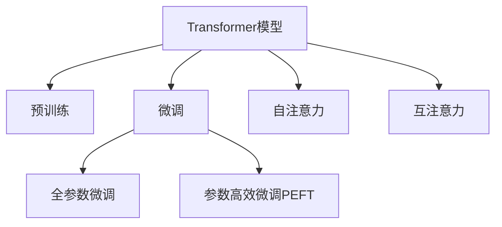

                 

# Transformer大模型实战 预训练的BERT模型

> 关键词：Transformer, BERT, 预训练, 自然语言处理, NLP, 深度学习

## 1. 背景介绍

### 1.1 问题由来
随着深度学习技术的快速发展，Transformer模型成为自然语言处理（NLP）领域的核心力量。基于自注意力机制的Transformer模型能够有效捕捉序列之间的依赖关系，在机器翻译、文本分类、命名实体识别等任务中均取得了显著的成果。BERT作为Transformer的变体，通过预训练获得全面的语言表示，提升了模型的泛化能力。

本文将详细介绍Transformer模型和预训练的BERT模型的原理与实践，帮助读者全面理解Transformer模型和BERT预训练技术，并通过实践案例，掌握实际应用中的关键技巧。

## 2. 核心概念与联系

### 2.1 核心概念概述

为更好地理解Transformer模型和预训练的BERT模型，本节将介绍几个关键概念：

- Transformer模型：基于自注意力机制的序列建模模型，由多层编码器和解码器组成，适用于各种序列生成任务。
- 预训练(Pre-training)：在大规模无标签文本数据上进行自监督学习任务训练通用语言模型的过程，使模型学习到语言的基本规律和结构。
- BERT模型：Google提出的一种预训练语言模型，通过掩码语言模型(Masked Language Modeling, MLM)和下一句预测任务(Next Sentence Prediction, NSP)的预训练，学习到丰富的语言语义表示。
- 微调(Fine-tuning)：在预训练模型的基础上，使用下游任务的少量标注数据，通过有监督学习优化模型在该任务上的性能，适应特定任务需求。
- Attention机制：Transformer模型中核心的机制之一，通过自注意力和互注意力，捕捉序列中不同位置的信息。

这些概念之间的逻辑关系可以通过以下Mermaid流程图来展示：



这个流程图展示了一个典型的Transformer模型应用流程，包括预训练、微调以及Transformer模型中核心的注意力机制。

## 3. 核心算法原理 & 具体操作步骤
### 3.1 算法原理概述

Transformer模型通过自注意力机制，捕捉序列中不同位置的信息，并利用多层的编码器-解码器结构，生成高质量的序列表示。其核心原理可以简单概括为三点：

1. 自注意力机制：通过计算输入序列中所有位置之间的相关性，捕捉序列中长距离依赖关系。
2. 多头的注意力机制：将输入序列投影到多个不同的注意力空间，捕捉不同角度的信息。
3. 残差连接和层归一化：通过残差连接和层归一化技术，加速训练过程，提升模型稳定性和泛化能力。

BERT模型在预训练过程中，通过掩码语言模型和下一句预测任务，学习到丰富的语言语义表示。其核心原理如下：

1. 掩码语言模型：随机掩码输入序列中的某些位置，训练模型预测被掩码位置的内容。
2. 下一句预测任务：训练模型预测两个句子是否是连续的。

BERT预训练的主要目标是通过这两个任务，学习到全局的语言表示，捕捉长距离依赖和语义关系。

### 3.2 算法步骤详解

Transformer模型的构建和微调过程主要包括以下几个关键步骤：

**Step 1: 准备数据**
- 收集大规模无标签文本数据作为预训练数据集。
- 将数据集按句子进行切分，保留必要的元信息（如子词分隔符）。
- 使用分词器将文本转化为令牌序列，并进行截断或补全操作，以适应模型输入长度。

**Step 2: 模型搭建**
- 选择Transformer模型架构，设置编码器层数、解码器层数、注意力头数、隐藏维度等超参数。
- 定义模型中的编码器、解码器、位置编码、注意力机制等组件。
- 对模型进行初始化，通常使用Xavier初始化或预训练权重进行初始化。

**Step 3: 预训练**
- 对模型进行预训练，使用自监督任务掩码语言模型和下一句预测任务。
- 分批次输入数据，前向传播计算损失函数。
- 反向传播更新模型参数，进行优化。
- 重复上述步骤，直至模型收敛或达到预设轮数。

**Step 4: 微调**
- 准备下游任务的标注数据集。
- 在预训练模型的基础上，添加任务特定的输出层和损失函数。
- 设置微调超参数，如学习率、批大小、迭代轮数等。
- 执行梯度训练，不断更新模型参数。
- 周期性在验证集上评估模型性能，根据性能指标决定是否触发Early Stopping。
- 重复上述步骤直至满足预设的迭代轮数或Early Stopping条件。

**Step 5: 测试和部署**
- 在测试集上评估微调后模型，对比微调前后的精度提升。
- 使用微调后的模型对新样本进行推理预测，集成到实际的应用系统中。
- 持续收集新的数据，定期重新微调模型，以适应数据分布的变化。

### 3.3 算法优缺点

Transformer模型和预训练的BERT模型具有以下优点：

1. 强大的建模能力：Transformer模型通过自注意力机制，捕捉序列中长距离依赖关系，具有更强的建模能力。BERT模型通过预训练获得丰富的语言语义表示，能够更好地捕捉复杂的语言语义关系。
2. 可迁移性：Transformer模型和BERT模型能够迁移到不同的NLP任务中，适应性广泛。
3. 泛化能力强：预训练的BERT模型在泛化能力上表现优异，能够适应各种不同的任务。

同时，这些模型也存在一些缺点：

1. 计算资源需求高：Transformer模型和BERT模型通常需要大量的计算资源进行训练和推理。
2. 参数量大：Transformer模型和BERT模型通常具有较大的参数量，需要进行有效的参数管理。
3. 过拟合风险：在微调过程中，模型可能会出现过拟合现象，需要引入正则化技术进行控制。
4. 可解释性不足：Transformer模型和BERT模型通常被视为"黑盒"模型，其内部决策过程难以解释。

尽管存在这些局限性，但Transformer模型和BERT模型仍然是当前NLP领域中最强大的模型之一。未来相关研究的重点在于如何进一步优化模型的性能，降低计算资源需求，增强模型的可解释性。

### 3.4 算法应用领域

Transformer模型和预训练的BERT模型在NLP领域的应用非常广泛，涵盖了文本分类、机器翻译、文本生成、问答系统等多个任务。以下是一些典型的应用领域：

- 机器翻译：利用Transformer模型进行高效的文本翻译，如Google的神经机器翻译(NMT)系统。
- 文本分类：通过微调BERT模型，实现对不同文本的分类任务，如情感分析、新闻分类等。
- 命名实体识别：利用Transformer模型和BERT模型的注意力机制，对文本中的实体进行识别，如Bert-for-Token-Classification模型。
- 问答系统：通过微调BERT模型，构建能够理解和回答用户问题的智能问答系统，如ELMo模型。
- 文本生成：利用Transformer模型进行文本生成任务，如对话系统、自动摘要等。

这些应用场景展示了Transformer模型和BERT模型的强大能力，也证明了其在NLP领域的重要地位。

## 4. 数学模型和公式 & 详细讲解 & 举例说明

### 4.1 数学模型构建

Transformer模型和BERT模型的核心数学模型如下：

Transformer模型的前向传播过程可以表示为：

$$
y = \text{Encoder}(\text{Attention}(\text{AddNorm}(\text{LayerNorm}(x) + \text{Add Norm}(\text{MLP}(\text{LayerNorm}(x))), \text{Attention}(\text{LayerNorm}(x))))
$$

其中，$\text{MLP}$表示多层感知器，$\text{LayerNorm}$表示层归一化，$\text{AddNorm}$表示残差连接。

BERT模型的预训练过程通过掩码语言模型和下一句预测任务进行训练，其数学模型如下：

掩码语言模型任务：
$$
\text{MLM}_{M} = \text{Masked Language Modeling}_{M}(x) = \prod_{i=1}^{N} p_{\theta}(y_i|x_i^{(m)})
$$

下一句预测任务：
$$
\text{NSP} = \text{Next Sentence Prediction}_{N}(x,y) = \prod_{i=1}^{N} p_{\theta}(y_i|x_i,y_i)
$$

其中，$x_i$表示输入序列的第$i$个词，$y_i$表示目标词，$y_i^{(m)}$表示掩码后的输入序列的第$i$个词。

### 4.2 公式推导过程

以Transformer模型的自注意力机制为例，推导其前向传播过程。

Transformer模型的自注意力机制由三个部分组成：查询（Q）、键（K）、值（V）。首先，将输入序列$x$进行线性投影得到查询矩阵$Q$、键矩阵$K$和值矩阵$V$：

$$
Q = W^Qx, K = W^Kx, V = W^Vx
$$

其中，$W^Q$、$W^K$和$W^V$为可学习的线性投影矩阵。

然后，计算查询矩阵和键矩阵的点积，得到注意力得分矩阵$A$：

$$
A = QK^T
$$

对注意力得分矩阵进行softmax归一化，得到注意力权重矩阵$W$：

$$
W = \text{Softmax}(A)
$$

最后，将注意力权重矩阵$W$和值矩阵$V$进行矩阵乘法，得到注意力输出矩阵$O$：

$$
O = AW
$$

将注意力输出矩阵$O$和输入序列$x$进行残差连接和层归一化，得到Transformer模型的前向传播输出$y$：

$$
y = \text{LayerNorm}(\text{AddNorm}(x + O))
$$

### 4.3 案例分析与讲解

以BERT模型的掩码语言模型为例，分析其训练过程。

BERT模型通过掩码语言模型进行预训练，其训练过程如下：

1. 对输入序列$x$进行掩码操作，得到掩码后的序列$x^{(m)}$。
2. 对掩码后的序列$x^{(m)}$进行MLP（多层感知器）处理，得到隐藏层表示$h$。
3. 计算掩码后的序列$x^{(m)}$和目标词$y$的概率分布，计算掩码语言模型的交叉熵损失。
4. 反向传播更新模型参数，最小化掩码语言模型的损失。

通过掩码语言模型，BERT模型学习到掩码位置处的语义表示，能够捕捉输入序列中不同位置的信息。

## 5. 项目实践：代码实例和详细解释说明

### 5.1 开发环境搭建

在进行Transformer和BERT模型的开发和实践前，我们需要准备好开发环境。以下是使用Python进行PyTorch开发的环境配置流程：

1. 安装Anaconda：从官网下载并安装Anaconda，用于创建独立的Python环境。

2. 创建并激活虚拟环境：
```bash
conda create -n pytorch-env python=3.8 
conda activate pytorch-env
```

3. 安装PyTorch：根据CUDA版本，从官网获取对应的安装命令。例如：
```bash
conda install pytorch torchvision torchaudio cudatoolkit=11.1 -c pytorch -c conda-forge
```

4. 安装Transformer库：
```bash
pip install transformers
```

5. 安装各类工具包：
```bash
pip install numpy pandas scikit-learn matplotlib tqdm jupyter notebook ipython
```

完成上述步骤后，即可在`pytorch-env`环境中开始实践。

### 5.2 源代码详细实现

下面我们以BERT模型为例，给出使用Transformer库进行掩码语言模型预训练的PyTorch代码实现。

首先，定义掩码语言模型的训练函数：

```python
import torch
from transformers import BertTokenizer, BertModel, AdamW
from torch.utils.data import DataLoader, Dataset

class MaskedLanguageModelDataset(Dataset):
    def __init__(self, text, tokenizer):
        self.text = text
        self.tokenizer = tokenizer
        
    def __len__(self):
        return len(self.text)
        
    def __getitem__(self, idx):
        text = self.text[idx]
        encoding = self.tokenizer(text, return_tensors='pt', padding=True, truncation=True, max_length=512, return_attention_mask=True)
        input_ids = encoding['input_ids']
        attention_mask = encoding['attention_mask']
        labels = torch.zeros_like(input_ids)
        labels[torch.rand_like(input_ids) < 0.15] = 1
        return {'input_ids': input_ids, 
                'attention_mask': attention_mask,
                'labels': labels}

# 加载BERT模型和分词器
model = BertModel.from_pretrained('bert-base-uncased')
tokenizer = BertTokenizer.from_pretrained('bert-base-uncased')

# 准备训练数据
train_data = MaskedLanguageModelDataset('This is a sample text for masked language modeling.', tokenizer)

# 训练参数设置
optimizer = AdamW(model.parameters(), lr=5e-5)
training_steps = len(train_data) * 10

# 训练过程
for step in range(training_steps):
    inputs = train_data.__getitem__(step % len(train_data))
    input_ids = inputs['input_ids']
    attention_mask = inputs['attention_mask']
    labels = inputs['labels']
    model.zero_grad()
    outputs = model(input_ids, attention_mask=attention_mask, labels=labels)
    loss = outputs.loss
    loss.backward()
    optimizer.step()
```

在上述代码中，我们定义了掩码语言模型的训练数据集，加载了预训练的BERT模型和分词器，设置了训练参数，并进行了多次训练迭代。

### 5.3 代码解读与分析

让我们再详细解读一下关键代码的实现细节：

**MaskedLanguageModelDataset类**：
- `__init__`方法：初始化训练数据和分词器。
- `__len__`方法：返回数据集的样本数量。
- `__getitem__`方法：对单个样本进行处理，将文本输入编码为token ids，并生成掩码标签。

**tokenizer和BERT模型的加载**：
- 通过`from_pretrained`方法，加载预训练的BERT模型和分词器。

**训练参数设置**：
- 定义了优化器、学习率和训练步数等参数。

**训练过程**：
- 每次迭代中，从数据集中获取一个样本，计算输入序列、注意力掩码和掩码标签，计算模型输出和损失，并进行反向传播和参数更新。

**代码实现**：
- 使用PyTorch的`DataLoader`对数据集进行批次化加载。
- 定义训练函数，对每个批次进行前向传播、计算损失和反向传播，更新模型参数。

通过上述代码实现，可以看出BERT模型的掩码语言模型预训练过程非常简单高效，开发者可以基于此代码框架进行进一步的实验和优化。

## 6. 实际应用场景

### 6.1 机器翻译

Transformer模型在机器翻译领域中取得了显著的成果。通过微调，Transformer模型可以适应不同的语言对和翻译方向，达到更高的翻译质量和流畅度。例如，Google的神经机器翻译(NMT)系统便采用了Transformer模型，使得机器翻译的质量大幅提升。

在实践中，可以通过收集大量双语对照语料，使用BERT模型进行预训练，然后对模型进行微调，以适应特定的语言对和翻译方向。

### 6.2 文本分类

BERT模型在文本分类任务中也表现出色。通过微调，BERT模型可以适应不同的文本分类任务，如情感分析、新闻分类、法律文书分类等。例如，Rosetta机器翻译系统便采用了BERT模型进行情感分析任务，提高了系统的分类精度。

在实践中，可以通过收集特定领域的标注数据，使用BERT模型进行预训练，然后对模型进行微调，以适应不同的文本分类任务。

### 6.3 命名实体识别

BERT模型在命名实体识别任务中也取得了很好的效果。通过微调，BERT模型可以适应不同的命名实体识别任务，如人名、地名、机构名等。例如，ELMo模型便采用了BERT模型进行命名实体识别任务，提高了系统的识别精度。

在实践中，可以通过收集特定领域的命名实体标注数据，使用BERT模型进行预训练，然后对模型进行微调，以适应不同的命名实体识别任务。

## 7. 工具和资源推荐

### 7.1 学习资源推荐

为了帮助开发者系统掌握Transformer和BERT模型的原理与实践，这里推荐一些优质的学习资源：

1. 《Transformer深度学习实战》书籍：详细介绍了Transformer模型的原理与实践，提供了丰富的代码示例和实验案例，是学习Transformer模型的必备资料。
2. 《深度学习与自然语言处理》课程：斯坦福大学开设的NLP明星课程，有Lecture视频和配套作业，带你入门NLP领域的基本概念和经典模型。
3. 《Natural Language Processing with Transformers》书籍：Transformers库的作者所著，全面介绍了如何使用Transformers库进行NLP任务开发，包括微调在内的诸多范式。
4. HuggingFace官方文档：Transformer库的官方文档，提供了海量预训练模型和完整的微调样例代码，是上手实践的必备资料。
5. 《BERT: Pre-training of Deep Bidirectional Transformers for Language Understanding》论文：BERT模型的原始论文，详细介绍了BERT模型的预训练过程和应用效果，是了解BERT模型的必备资料。

通过对这些资源的学习实践，相信你一定能够快速掌握Transformer和BERT模型的精髓，并用于解决实际的NLP问题。

### 7.2 开发工具推荐

高效的开发离不开优秀的工具支持。以下是几款用于Transformer和BERT模型开发的常用工具：

1. PyTorch：基于Python的开源深度学习框架，灵活动态的计算图，适合快速迭代研究。大部分预训练语言模型都有PyTorch版本的实现。
2. TensorFlow：由Google主导开发的开源深度学习框架，生产部署方便，适合大规模工程应用。同样有丰富的预训练语言模型资源。
3. Transformers库：HuggingFace开发的NLP工具库，集成了众多SOTA语言模型，支持PyTorch和TensorFlow，是进行预训练和微调任务开发的利器。
4. Weights & Biases：模型训练的实验跟踪工具，可以记录和可视化模型训练过程中的各项指标，方便对比和调优。与主流深度学习框架无缝集成。
5. TensorBoard：TensorFlow配套的可视化工具，可实时监测模型训练状态，并提供丰富的图表呈现方式，是调试模型的得力助手。
6. Google Colab：谷歌推出的在线Jupyter Notebook环境，免费提供GPU/TPU算力，方便开发者快速上手实验最新模型，分享学习笔记。

合理利用这些工具，可以显著提升Transformer和BERT模型的开发效率，加快创新迭代的步伐。

### 7.3 相关论文推荐

Transformer和BERT模型的发展源于学界的持续研究。以下是几篇奠基性的相关论文，推荐阅读：

1. Attention is All You Need：提出了Transformer结构，开启了NLP领域的预训练大模型时代。
2. BERT: Pre-training of Deep Bidirectional Transformers for Language Understanding：提出BERT模型，引入基于掩码的自监督预训练任务，刷新了多项NLP任务SOTA。
3. Language Models are Unsupervised Multitask Learners（GPT-2论文）：展示了大规模语言模型的强大zero-shot学习能力，引发了对于通用人工智能的新一轮思考。
4. Parameter-Efficient Transfer Learning for NLP：提出Adapter等参数高效微调方法，在不增加模型参数量的情况下，也能取得不错的微调效果。
5. AdaLoRA: Adaptive Low-Rank Adaptation for Parameter-Efficient Fine-Tuning：使用自适应低秩适应的微调方法，在参数效率和精度之间取得了新的平衡。
6. Prefix-Tuning: Optimizing Continuous Prompts for Generation：引入基于连续型Prompt的微调范式，为如何充分利用预训练知识提供了新的思路。

这些论文代表了大语言模型微调技术的发展脉络。通过学习这些前沿成果，可以帮助研究者把握学科前进方向，激发更多的创新灵感。

## 8. 总结：未来发展趋势与挑战

### 8.1 总结

本文对Transformer模型和预训练的BERT模型的原理与实践进行了全面系统的介绍。首先阐述了Transformer模型和BERT模型的背景和意义，明确了它们在NLP领域的核心地位。其次，从原理到实践，详细讲解了Transformer模型的构建和微调过程，并通过代码实例，展示了BERT模型的预训练和微调过程。同时，本文还广泛探讨了Transformer和BERT模型在机器翻译、文本分类、命名实体识别等多个领域的应用前景，展示了它们强大的泛化能力。

通过本文的系统梳理，可以看到，Transformer模型和BERT模型在NLP领域的应用非常广泛，已经成为NLP领域的重要基础。随着预训练语言模型的不断发展，基于Transformer和BERT模型的微调技术将不断优化，广泛应用于各种NLP任务中，为构建更加智能、高效的NLP系统提供坚实的基础。

### 8.2 未来发展趋势

展望未来，Transformer模型和BERT模型将继续引领NLP技术的发展，其应用领域也将不断扩展。以下是几个可能的未来发展趋势：

1. 模型规模持续增大。随着算力成本的下降和数据规模的扩张，预训练语言模型的参数量还将持续增长。超大模型有望具备更强的泛化能力和更广泛的迁移性。
2. 模型泛化能力提升。通过更复杂的数据增强和正则化技术，Transformer模型和BERT模型的泛化能力将进一步提升，能够在更多领域和更多任务上取得优异效果。
3. 模型可解释性增强。随着模型可解释性技术的发展，Transformer模型和BERT模型的决策过程将变得更加透明和可解释，有助于应用场景的落地和推广。
4. 跨模态融合技术。将Transformer模型和BERT模型的语言表示与其他模态的数据表示进行融合，将大大提升模型的应用范围和泛化能力。

这些趋势展示了Transformer模型和BERT模型的广阔前景，也预示着它们在NLP领域的应用将更加广泛和深入。

### 8.3 面临的挑战

尽管Transformer模型和BERT模型在NLP领域取得了显著成果，但在走向成熟的过程中，仍面临着诸多挑战：

1. 计算资源需求高。Transformer模型和BERT模型通常需要大量的计算资源进行训练和推理，这对算力、内存、存储等资源提出了很高的要求。
2. 可解释性不足。Transformer模型和BERT模型通常被视为"黑盒"模型，其内部决策过程难以解释，这在应用场景中可能存在风险。
3. 数据依赖性强。Transformer模型和BERT模型的效果很大程度上取决于训练数据的规模和质量，获取高质量数据成本较高。
4. 泛化能力有待提升。尽管Transformer模型和BERT模型在泛化能力上表现优异，但在特定领域或特定任务上，模型可能仍需进一步优化。

尽管存在这些挑战，但Transformer模型和BERT模型仍然是NLP领域中最强大的模型之一。未来相关研究的重点在于如何进一步优化模型的性能，降低计算资源需求，增强模型的可解释性，并拓展模型的应用范围。

### 8.4 研究展望

面对Transformer模型和BERT模型所面临的挑战，未来的研究需要在以下几个方面寻求新的突破：

1. 探索更高效的计算技术。开发更加高效的计算图优化技术和分布式训练技术，降低计算资源需求。
2. 增强模型的可解释性。开发更高效的模型解释技术，如可视化工具、可解释性模型等，提升模型的透明度和可解释性。
3. 拓展模型的应用范围。将Transformer模型和BERT模型的语言表示与其他模态的数据表示进行融合，提升模型的跨模态融合能力。
4. 引入更多的先验知识。将符号化的先验知识，如知识图谱、逻辑规则等，与神经网络模型进行融合，提升模型的通用性和鲁棒性。

这些研究方向的探索，必将引领Transformer模型和BERT模型走向更高的台阶，为构建更加智能、高效的NLP系统提供坚实的基础。

## 9. 附录：常见问题与解答

**Q1：Transformer模型和BERT模型在NLP领域的应用主要有哪些？**

A: Transformer模型和BERT模型在NLP领域的应用非常广泛，涵盖了文本分类、机器翻译、命名实体识别、问答系统、文本生成等多个任务。以下是一些典型的应用领域：

- 机器翻译：利用Transformer模型进行高效的文本翻译，如Google的神经机器翻译(NMT)系统。
- 文本分类：通过微调BERT模型，实现对不同文本的分类任务，如情感分析、新闻分类等。
- 命名实体识别：利用Transformer模型和BERT模型的注意力机制，对文本中的实体进行识别，如Bert-for-Token-Classification模型。
- 问答系统：通过微调BERT模型，构建能够理解和回答用户问题的智能问答系统，如ELMo模型。
- 文本生成：利用Transformer模型进行文本生成任务，如对话系统、自动摘要等。

这些应用场景展示了Transformer模型和BERT模型的强大能力，也证明了其在NLP领域的重要地位。

**Q2：Transformer模型和BERT模型在微调过程中需要注意哪些问题？**

A: 在微调Transformer模型和BERT模型的过程中，需要注意以下问题：

1. 学习率设置。微调学习率通常要比预训练时小1-2个数量级，避免破坏预训练权重。
2. 数据增强。通过回译、近义替换等方式扩充训练集，避免过拟合。
3. 正则化技术。引入L2正则、Dropout、Early Stopping等技术，防止模型过度适应小规模训练集。
4. 模型裁剪和量化。对模型进行裁剪和量化，减小模型大小和计算资源需求，提升推理速度。
5. 模型融合。将Transformer模型和BERT模型的语言表示与其他模态的数据表示进行融合，提升模型的跨模态融合能力。

通过合理设置微调参数，引入正则化技术，以及对模型进行裁剪和量化等优化措施，可以提升微调效果，降低计算资源需求。

**Q3：Transformer模型和BERT模型在实际应用中如何部署？**

A: 将Transformer模型和BERT模型应用于实际应用中，需要进行以下部署步骤：

1. 模型裁剪。对模型进行裁剪和量化，减小模型大小和计算资源需求，提升推理速度。
2. 模型服务化。将模型封装为标准化服务接口，便于集成调用。
3. 分布式部署。采用分布式计算技术，提升模型推理效率和扩展性。
4. 监控告警。实时采集系统指标，设置异常告警阈值，确保系统稳定运行。
5. 安全防护。采用访问鉴权、数据脱敏等措施，保障数据和模型安全。

通过以上步骤，可以将Transformer模型和BERT模型高效部署到实际应用中，提升系统的推理效率和扩展性，保障系统安全。

通过本文的系统梳理，可以看到，Transformer模型和BERT模型在NLP领域的应用非常广泛，已经成为NLP领域的重要基础。随着预训练语言模型的不断发展，基于Transformer和BERT模型的微调技术将不断优化，广泛应用于各种NLP任务中，为构建更加智能、高效的NLP系统提供坚实的基础。未来，随着Transformer模型和BERT模型的不断演进，其应用场景将更加广泛，为NLP技术带来更多的可能性。

**Q4：Transformer模型和BERT模型在实际应用中面临哪些挑战？**

A: 尽管Transformer模型和BERT模型在NLP领域取得了显著成果，但在走向成熟的过程中，仍面临着诸多挑战：

1. 计算资源需求高。Transformer模型和BERT模型通常需要大量的计算资源进行训练和推理，这对算力、内存、存储等资源提出了很高的要求。
2. 可解释性不足。Transformer模型和BERT模型通常被视为"黑盒"模型，其内部决策过程难以解释，这在应用场景中可能存在风险。
3. 数据依赖性强。Transformer模型和BERT模型的效果很大程度上取决于训练数据的规模和质量，获取高质量数据成本较高。
4. 泛化能力有待提升。尽管Transformer模型和BERT模型在泛化能力上表现优异，但在特定领域或特定任务上，模型可能仍需进一步优化。

尽管存在这些挑战，但Transformer模型和BERT模型仍然是NLP领域中最强大的模型之一。未来相关研究的重点在于如何进一步优化模型的性能，降低计算资源需求，增强模型的可解释性，并拓展模型的应用范围。

**Q5：Transformer模型和BERT模型在实际应用中如何优化？**

A: 在实际应用中，Transformer模型和BERT模型可以通过以下方式进行优化：

1. 模型裁剪和量化。对模型进行裁剪和量化，减小模型大小和计算资源需求，提升推理速度。
2. 正则化技术。引入L2正则、Dropout、Early Stopping等技术，防止模型过度适应小规模训练集。
3. 数据增强。通过回译、近义替换等方式扩充训练集，避免过拟合。
4. 模型融合。将Transformer模型和BERT模型的语言表示与其他模态的数据表示进行融合，提升模型的跨模态融合能力。
5. 参数高效微调。只调整少量模型参数，固定大部分预训练权重，提高微调效率，避免过拟合。

通过合理设置微调参数，引入正则化技术，以及对模型进行裁剪和量化等优化措施，可以提升微调效果，降低计算资源需求。

通过本文的系统梳理，可以看到，Transformer模型和BERT模型在NLP领域的应用非常广泛，已经成为NLP领域的重要基础。随着预训练语言模型的不断发展，基于Transformer和BERT模型的微调技术将不断优化，广泛应用于各种NLP任务中，为构建更加智能、高效的NLP系统提供坚实的基础。未来，随着Transformer模型和BERT模型的不断演进，其应用场景将更加广泛，为NLP技术带来更多的可能性。

---

作者：禅与计算机程序设计艺术 / Zen and the Art of Computer Programming

