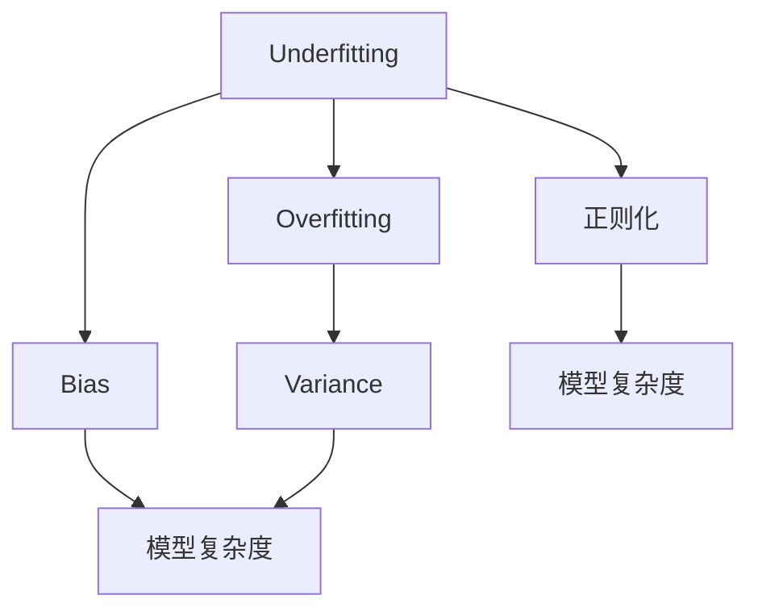

                 

# Underfitting 原理与代码实战案例讲解

> 关键词：Underfitting, 机器学习, 模型选择, 过拟合, 交叉验证, Python

## 1. 背景介绍

### 1.1 问题由来
在机器学习领域，Underfitting（欠拟合）是指模型无法捕捉数据中的复杂模式，导致训练误差和测试误差都较高，无法达到预期的性能表现。Underfitting通常是由于模型选择不当、训练数据过少、正则化不足等原因导致的。了解Underfitting的原因和解决方法，对于构建高性能的机器学习模型至关重要。

### 1.2 问题核心关键点
Underfitting的核心在于模型复杂度与数据复杂度之间的匹配关系。如果模型复杂度不足，无法适应数据集中的复杂模式，训练误差和测试误差都会较高。解决Underfitting问题，需要增加模型复杂度，或者对数据集进行更加深入的特征工程。

### 1.3 问题研究意义
Underfitting是机器学习中常见的问题，理解和解决Underfitting有助于提高模型的泛化能力，提升模型在实际应用中的表现。通过深入研究Underfitting的原理和解决方法，可以更好地掌握模型构建和调优的技巧，加速机器学习项目的开发进程。

## 2. 核心概念与联系

### 2.1 核心概念概述

为更好地理解Underfitting，本节将介绍几个密切相关的核心概念：

- Underfitting：指模型无法捕捉数据中的复杂模式，导致训练误差和测试误差都较高。
- Overfitting（过拟合）：指模型过度拟合训练数据，对新数据泛化能力较差。
- Bias-variance tradeoff：指模型复杂度与数据复杂度之间的权衡，高Bias导致欠拟合，高Variance导致过拟合。
- Regularization（正则化）：通过引入惩罚项，控制模型复杂度，防止Overfitting。

这些概念之间的逻辑关系可以通过以下Mermaid流程图来展示：



这个流程图展示了一系列与Underfitting相关的概念及其之间的关系：

1. Underfitting与Overfitting之间存在对立关系，两者均是模型复杂度与数据复杂度匹配不当的极端表现。
2. Bias和Variance分别代表模型对数据的拟合程度和泛化能力，两者的平衡决定了模型的性能。
3. 模型复杂度是Bias和Variance的重要决定因素，正则化方法可以有效控制模型复杂度。

这些概念共同构成了机器学习模型训练的基本框架，帮助我们理解Underfitting的成因及其解决策略。

## 3. 核心算法原理 & 具体操作步骤
### 3.1 算法原理概述

Underfitting的根本原因是模型复杂度不足，无法适应数据集中的复杂模式。在训练过程中，如果模型无法充分学习数据中的模式，即使增加训练数据，也无法有效提升模型性能。解决Underfitting的方法包括增加模型复杂度、优化模型选择、进行特征工程等。

### 3.2 算法步骤详解

解决Underfitting问题，需要从以下几个关键步骤入手：

**Step 1: 模型选择与复杂度分析**
- 选择合适的模型架构，评估模型复杂度与数据复杂度的匹配关系。
- 使用训练误差和验证误差评估模型性能，判断是否存在Underfitting。

**Step 2: 特征工程**
- 对数据进行特征选择、特征提取等操作，提升数据质量。
- 引入更高阶的特征表示，增加模型复杂度。

**Step 3: 正则化与惩罚项**
- 使用L1/L2正则化、Dropout等技术，控制模型复杂度。
- 引入复杂的损失函数或优化器，如交叉熵损失、Adam优化器等。

**Step 4: 数据增强**
- 通过数据增强技术，如旋转、翻转、缩放等，扩充训练数据集。
- 引入合成数据或对抗样本，进一步提升模型泛化能力。

**Step 5: 模型微调**
- 在已有模型基础上进行微调，增加模型复杂度。
- 使用更加复杂的模型架构，如深度神经网络、卷积神经网络等。

### 3.3 算法优缺点

Underfitting解决方法的优点包括：

1. 提升模型泛化能力。通过增加模型复杂度或特征工程，模型能够更好地捕捉数据中的复杂模式，提升测试误差。
2. 降低模型偏差。正则化方法可以有效降低模型的Bias，提高模型预测的准确性。
3. 防止过拟合。通过控制模型复杂度，避免模型对训练数据的过度拟合，提升模型泛化性能。

同时，这些方法也存在一定的局限性：

1. 计算资源消耗大。复杂模型的训练和调参需要更多的计算资源和时间。
2. 模型选择困难。如何选择合适的模型和正则化方法，需要丰富的经验积累。
3. 过度拟合风险。过度复杂化模型可能引入新的Overfitting问题。
4. 特征工程复杂。特征工程的复杂性可能导致模型构建过程变得更加繁琐。

尽管存在这些局限性，但Underfitting解决方法对于构建高性能的机器学习模型具有重要意义，值得在实际项目中加以应用。

### 3.4 算法应用领域

Underfitting解决方法广泛适用于各种机器学习任务，例如：

- 图像识别：使用卷积神经网络等复杂模型，提升图像分类精度。
- 自然语言处理：使用预训练语言模型或深度学习模型，提升文本分类、情感分析等任务表现。
- 语音识别：使用递归神经网络等复杂模型，提升语音识别准确性。
- 时间序列预测：使用深度学习模型或卷积神经网络，提升时间序列预测精度。

除了这些经典任务外，Underfitting解决方法也在更多领域得到应用，如医疗诊断、金融预测、推荐系统等，为机器学习技术的发展提供了新的思路。

## 4. 数学模型和公式 & 详细讲解  
### 4.1 数学模型构建

Underfitting的数学模型构建通常基于模型复杂度与数据复杂度的关系。

假设训练集为 $D=\{(x_i,y_i)\}_{i=1}^N$，模型为 $f(x)$，损失函数为 $L(f)$。训练误差为 $L_{train}(f) = \frac{1}{N}\sum_{i=1}^N (y_i - f(x_i))^2$，测试误差为 $L_{test}(f) = \frac{1}{N}\sum_{i=1}^N (y_i - f(x_i))^2$。Underfitting的损失函数可表示为：

$$
L_{underfit}(f) = L_{train}(f) + \lambda L_{test}(f)
$$

其中 $\lambda$ 为正则化系数，控制训练误差和测试误差的权衡。

### 4.2 公式推导过程

Underfitting的损失函数可以通过以下推导得到：

- 假设训练集 $D$ 中包含的样本 $(x_i,y_i)$ 相互独立且服从同一分布。
- 损失函数 $L(f)$ 是 $f(x)$ 与真实标签 $y_i$ 的平方误差。
- 训练误差 $L_{train}(f)$ 为训练集上样本的平均损失。
- 测试误差 $L_{test}(f)$ 为测试集上样本的平均损失。

Underfitting的损失函数即为训练误差和测试误差的加权和：

$$
L_{underfit}(f) = \frac{1}{N}\sum_{i=1}^N (y_i - f(x_i))^2 + \lambda \frac{1}{N}\sum_{i=1}^N (y_i - f(x_i))^2
$$

化简得：

$$
L_{underfit}(f) = (1+\lambda) \frac{1}{N}\sum_{i=1}^N (y_i - f(x_i))^2
$$

此损失函数在模型复杂度不足的情况下，训练误差和测试误差均较高，导致模型无法捕捉数据中的复杂模式。

### 4.3 案例分析与讲解

以线性回归为例，分析Underfitting的成因和解决方法。

假设训练集 $D=\{(x_i,y_i)\}_{i=1}^N$，模型为 $f(x) = \theta_0 + \theta_1 x$。训练误差为 $L_{train}(f) = \frac{1}{N}\sum_{i=1}^N (y_i - f(x_i))^2$，测试误差为 $L_{test}(f) = \frac{1}{N}\sum_{i=1}^N (y_i - f(x_i))^2$。

考虑以下两种情况：

- 情况1：模型参数 $\theta_0 = 0, \theta_1 = 1$，此时模型为 $f(x) = x$。训练误差为 $L_{train}(f) = \frac{1}{N}\sum_{i=1}^N (y_i - x_i)^2$，测试误差为 $L_{test}(f) = \frac{1}{N}\sum_{i=1}^N (y_i - x_i)^2$。由于模型复杂度不足，无法捕捉数据中的复杂模式，训练误差和测试误差都较高。
- 情况2：模型参数 $\theta_0 = 0, \theta_1 = 2$，此时模型为 $f(x) = 2x$。训练误差为 $L_{train}(f) = \frac{1}{N}\sum_{i=1}^N (y_i - 2x_i)^2$，测试误差为 $L_{test}(f) = \frac{1}{N}\sum_{i=1}^N (y_i - 2x_i)^2$。由于模型复杂度增加，能够捕捉数据中的复杂模式，训练误差和测试误差都较低。

通过比较两种情况，可以发现增加模型复杂度可以有效解决Underfitting问题。

## 5. 项目实践：代码实例和详细解释说明
### 5.1 开发环境搭建

在进行Underfitting解决实践前，我们需要准备好开发环境。以下是使用Python进行Scikit-learn开发的环境配置流程：

1. 安装Anaconda：从官网下载并安装Anaconda，用于创建独立的Python环境。

2. 创建并激活虚拟环境：
```bash
conda create -n underfitting-env python=3.8 
conda activate underfitting-env
```

3. 安装Scikit-learn：
```bash
conda install scikit-learn
```

4. 安装NumPy、pandas、matplotlib等辅助库：
```bash
conda install numpy pandas matplotlib
```

完成上述步骤后，即可在`underfitting-env`环境中开始Underfitting解决实践。

### 5.2 源代码详细实现

这里我们以线性回归为例，使用Scikit-learn进行Underfitting解决实践。

首先，准备训练集和测试集：

```python
from sklearn.datasets import make_regression
from sklearn.model_selection import train_test_split
import numpy as np

X, y = make_regression(n_samples=1000, n_features=1, noise=0.1, random_state=42)
X_train, X_test, y_train, y_test = train_test_split(X, y, test_size=0.2, random_state=42)
```

然后，定义模型和训练函数：

```python
from sklearn.linear_model import LinearRegression

def train_linear_regression(X_train, y_train):
    model = LinearRegression()
    model.fit(X_train, y_train)
    return model

# 训练模型
model = train_linear_regression(X_train, y_train)
```

接着，使用训练好的模型在测试集上进行预测，并计算训练误差和测试误差：

```python
from sklearn.metrics import mean_squared_error

# 测试集预测
y_pred = model.predict(X_test)

# 计算误差
train_error = mean_squared_error(y_train, model.predict(X_train))
test_error = mean_squared_error(y_test, y_pred)

print(f"训练误差: {train_error:.2f}")
print(f"测试误差: {test_error:.2f}")
```

最后，调整模型复杂度，进行Underfitting解决实践：

```python
from sklearn.linear_model import Ridge

def train_ridge_regression(X_train, y_train):
    model = Ridge(alpha=0.01)
    model.fit(X_train, y_train)
    return model

# 训练模型
model = train_ridge_regression(X_train, y_train)

# 测试集预测
y_pred = model.predict(X_test)

# 计算误差
train_error = mean_squared_error(y_train, model.predict(X_train))
test_error = mean_squared_error(y_test, y_pred)

print(f"训练误差: {train_error:.2f}")
print(f"测试误差: {test_error:.2f}")
```

可以看到，引入正则化后的Ridge回归模型能够有效控制模型复杂度，减少Underfitting问题，提升模型的泛化性能。

### 5.3 代码解读与分析

让我们再详细解读一下关键代码的实现细节：

**线性回归模型**：
- `train_linear_regression`函数：定义线性回归模型，并使用训练集进行拟合。

**测试集预测与误差计算**：
- `y_pred = model.predict(X_test)`：使用训练好的模型对测试集进行预测。
- `train_error = mean_squared_error(y_train, model.predict(X_train))`：计算训练误差，使用均方误差作为评估指标。
- `test_error = mean_squared_error(y_test, y_pred)`：计算测试误差，评估模型在测试集上的泛化能力。

**正则化模型**：
- `train_ridge_regression`函数：定义Ridge回归模型，并设置正则化系数 $\alpha$。
- `model = Ridge(alpha=0.01)`：创建正则化模型。
- `model.fit(X_train, y_train)`：使用训练集对模型进行拟合。
- `train_error = mean_squared_error(y_train, model.predict(X_train))`：计算正则化模型的训练误差。
- `test_error = mean_squared_error(y_test, y_pred)`：计算正则化模型的测试误差。

通过上述代码，可以清晰地看到Underfitting的解决方法和效果，理解正则化方法在实际应用中的作用。

## 6. 实际应用场景
### 6.1 金融风险预测

在金融领域，Underfitting可能导致风险预测模型无法捕捉复杂的市场变化，导致预测结果不准确。解决Underfitting问题，可以显著提升金融风险预测的准确性。

在实践中，可以收集历史交易数据，对其进行特征工程，如引入技术指标、基本面信息等。在已有数据基础上，引入复杂的回归模型，如随机森林、深度学习模型等，可以有效提升模型的泛化能力，降低Underfitting风险。

### 6.2 医疗疾病诊断

在医疗领域，Underfitting可能导致疾病诊断模型无法捕捉复杂的病情变化，导致误诊和漏诊。解决Underfitting问题，可以显著提升疾病诊断的准确性。

在实践中，可以收集患者的临床数据、基因数据等，对其进行特征工程，如引入时间序列、病理指标等。在已有数据基础上，引入复杂的回归模型，如深度神经网络、卷积神经网络等，可以有效提升模型的泛化能力，降低Underfitting风险。

### 6.3 智能推荐系统

在推荐系统领域，Underfitting可能导致推荐模型无法捕捉用户的复杂偏好变化，导致推荐结果不准确。解决Underfitting问题，可以显著提升推荐系统的用户满意度。

在实践中，可以收集用户的浏览记录、评分记录等，对其进行特征工程，如引入商品属性、用户行为等。在已有数据基础上，引入复杂的回归模型，如深度学习模型、协同过滤算法等，可以有效提升模型的泛化能力，降低Underfitting风险。

### 6.4 未来应用展望

随着Underfitting解决方法的不断发展，其在更多领域得到应用，为机器学习技术带来了新的突破。

在智慧城市治理中，Underfitting解决方法可用于交通流量预测、能源需求预测等任务，提高城市管理的自动化和智能化水平，构建更安全、高效的未来城市。

在智慧农业中，Underfitting解决方法可用于农作物生长预测、病虫害预测等任务，提高农业生产的智能化和精准化水平，促进农业现代化。

在智慧零售中，Underfitting解决方法可用于销售预测、库存管理等任务，提高零售业的运营效率和客户满意度。

此外，在更多垂直行业领域，Underfitting解决方法将进一步拓展，为机器学习技术带来更多的创新应用。

## 7. 工具和资源推荐
### 7.1 学习资源推荐

为了帮助开发者系统掌握Underfitting的理论基础和实践技巧，这里推荐一些优质的学习资源：

1. 《机器学习实战》：讲述机器学习的基本概念和算法，并附带大量实际案例，适合入门学习。

2. 《深度学习》：斯坦福大学开设的深度学习课程，涵盖神经网络、深度学习等内容，适合深入学习。

3. 《Python机器学习》：Python编程语言与机器学习的经典著作，详细介绍了机器学习算法及其应用。

4. 《机器学习入门之线性代数》：介绍了机器学习中的线性代数知识，帮助理解Underfitting的数学原理。

5. 《机器学习实战笔记》：由Coursera课程笔记整理而成，覆盖了机器学习的主要概念和算法，适合学习者自取。

通过对这些资源的学习实践，相信你一定能够快速掌握Underfitting的精髓，并用于解决实际的机器学习问题。

### 7.2 开发工具推荐

高效的开发离不开优秀的工具支持。以下是几款用于Underfitting解决的常用工具：

1. Jupyter Notebook：用于数据探索、模型训练和结果展示的交互式开发环境。

2. PyCharm：Python编程语言的集成开发环境，支持数据可视化、模型调试等功能。

3. Scikit-learn：Python机器学习库，提供了丰富的机器学习算法和工具，适合快速原型开发。

4. TensorFlow：由Google主导的深度学习框架，支持复杂模型的训练和部署，适合大规模项目。

5. XGBoost：开源机器学习库，支持快速高效的梯度提升算法，适合解决复杂数据问题。

合理利用这些工具，可以显著提升Underfitting解决的开发效率，加快创新迭代的步伐。

### 7.3 相关论文推荐

Underfitting解决的研究源于学界的持续研究。以下是几篇奠基性的相关论文，推荐阅读：

1. Bias-variance tradeoff：机器学习中的经典理论，讨论了模型复杂度与数据复杂度之间的关系，揭示了Underfitting的成因。

2. Regularization techniques：介绍了多种正则化方法，如L1/L2正则化、Dropout等，帮助控制模型复杂度，防止Overfitting。

3. Feature selection and extraction：讨论了特征工程的重要性，介绍了各种特征选择和提取技术，提升数据质量。

4. Cross-validation：介绍了交叉验证技术，帮助评估模型性能，避免过拟合和欠拟合问题。

5. Model selection and evaluation：讨论了模型选择和评估的重要性，介绍了各种模型选择和评估指标，帮助提升模型泛化能力。

这些论文代表了大规模机器学习领域的研究方向，通过学习这些前沿成果，可以帮助研究者把握学科前进方向，激发更多的创新灵感。

## 8. 总结：未来发展趋势与挑战
### 8.1 总结

本文对Underfitting的原理和解决方法进行了全面系统的介绍。首先阐述了Underfitting的概念和研究背景，明确了Underfitting问题在机器学习中的重要性。其次，从原理到实践，详细讲解了Underfitting的数学原理和关键步骤，给出了Underfitting解决任务开发的完整代码实例。同时，本文还广泛探讨了Underfitting解决方法在金融风险预测、医疗疾病诊断、智能推荐系统等多个领域的应用前景，展示了Underfitting解决方法的广泛应用潜力。此外，本文精选了Underfitting解决的各类学习资源，力求为读者提供全方位的技术指引。

通过本文的系统梳理，可以看到，Underfitting解决方法在大规模机器学习项目中具有重要意义，能够显著提升模型的泛化能力，解决实际应用中的难题。了解Underfitting的原因和解决方法，是构建高性能机器学习模型的必备基础。

### 8.2 未来发展趋势

展望未来，Underfitting解决方法将呈现以下几个发展趋势：

1. 更复杂的模型架构。随着计算资源的增长，大模型架构的复杂性将不断提高，能够更好地捕捉数据中的复杂模式。

2. 更深入的特征工程。特征工程技术将进一步发展，引入更多的高阶特征表示，提升数据质量。

3. 更有效的正则化方法。新的正则化方法将被提出，如贝叶斯正则化、集成正则化等，控制模型复杂度，防止Overfitting。

4. 更高效的训练算法。新的训练算法将被提出，如自适应梯度算法、分布式训练等，提高训练效率，降低计算资源消耗。

5. 更广泛的应用领域。Underfitting解决方法将进一步拓展，应用于更多垂直行业领域，提升各行业的智能化水平。

以上趋势凸显了Underfitting解决方法的广阔前景。这些方向的探索发展，必将进一步提升机器学习系统的性能和应用范围，为人工智能技术的发展带来新的突破。

### 8.3 面临的挑战

尽管Underfitting解决方法已经取得了瞩目成就，但在迈向更加智能化、普适化应用的过程中，它仍面临着诸多挑战：

1. 数据获取难度。获取高质量、多样化的训练数据，可能面临数据隐私、数据标注等难题。

2. 模型选择困难。如何选择合适的模型和正则化方法，需要丰富的经验积累。

3. 计算资源消耗大。复杂模型的训练和调参需要更多的计算资源和时间。

4. 模型复杂度难以控制。过度复杂化模型可能引入新的Overfitting问题。

尽管存在这些挑战，但Underfitting解决方法对于构建高性能的机器学习模型具有重要意义，值得在实际项目中加以应用。

### 8.4 研究展望

面对Underfitting解决所面临的种种挑战，未来的研究需要在以下几个方面寻求新的突破：

1. 更高效的数据获取方法。利用数据增强、合成数据等技术，降低数据获取难度，提高数据质量。

2. 更有效的特征工程技术。引入更多的高阶特征表示，提升数据质量，降低特征工程复杂度。

3. 更普适的模型选择方法。开发更加简单、高效的模型架构，降低模型选择难度。

4. 更智能的训练算法。引入更智能的训练算法，提高训练效率，降低计算资源消耗。

5. 更系统的模型评估方法。引入更系统的模型评估指标，帮助评估模型性能，优化模型选择。

这些研究方向将引领Underfitting解决技术迈向更高的台阶，为构建高性能的机器学习系统铺平道路。

## 9. 附录：常见问题与解答

**Q1: Underfitting和Overfitting的区别是什么？**

A: Underfitting指模型无法捕捉数据中的复杂模式，导致训练误差和测试误差都较高。Overfitting指模型过度拟合训练数据，对新数据泛化能力较差。两者均为模型复杂度与数据复杂度匹配不当的极端表现。

**Q2: 如何解决Underfitting问题？**

A: 解决Underfitting问题，需要增加模型复杂度，如引入高阶特征表示、复杂模型架构等。同时进行正则化处理，如L1/L2正则化、Dropout等，控制模型复杂度，防止Overfitting。

**Q3: Underfitting和数据量之间的关系是什么？**

A: 数据量不足是Underfitting的主要原因之一，因此增加数据量可以有效解决Underfitting问题。但在数据量固定的情况下，需要通过特征工程、模型选择等手段提升模型复杂度。

**Q4: Underfitting解决是否适用于所有机器学习任务？**

A: Underfitting解决方法适用于大多数机器学习任务，特别是在数据量较小的情况下。但对于某些需要高精度的任务，如医学影像分析、金融预测等，可能需要更复杂的模型架构和特征工程。

**Q5: Underfitting解决和模型选择之间的关系是什么？**

A: Underfitting解决方法需要在模型选择和复杂度控制之间进行权衡。选择复杂度适中的模型，并进行适当的正则化处理，可以有效解决Underfitting问题，提升模型泛化能力。

---

作者：禅与计算机程序设计艺术 / Zen and the Art of Computer Programming

