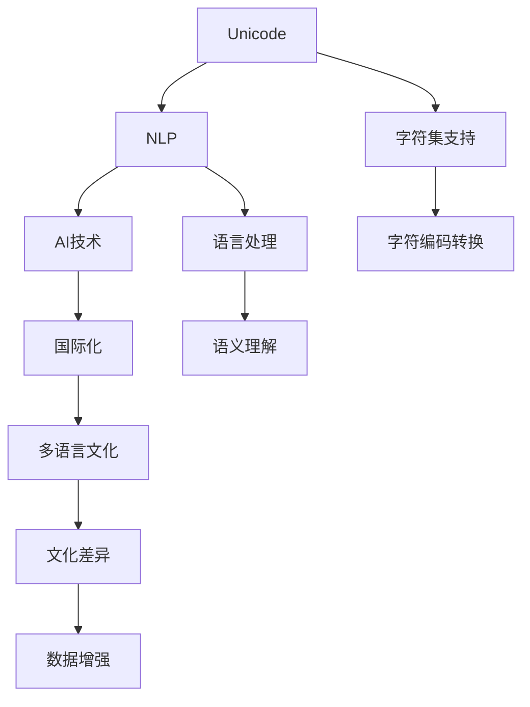

                 

# Unicode与AI：文本处理的国际化挑战

> 关键词：Unicode, 自然语言处理(NLP), 文本处理, 国际化, AI技术

## 1. 背景介绍

### 1.1 问题由来

随着全球化进程的加快，互联网和数字化技术的发展使得跨语言的交流日益频繁。各国文化和语言的多样性带来了大量的多语言文本数据。然而，传统的基于ASCII码的文本处理技术已经难以应对这些复杂多变的文本数据。Unicode编码规范的诞生，为多语言文本的存储和处理提供了重要的基础。

与此同时，人工智能(AI)技术的兴起，为文本处理带来了革命性的变化。文本处理不再是简单的字符编码和解析，而是通过AI模型来理解和生成文本，从而实现更加智能化和高效化的处理。但面对大量使用不同语言和文化背景的用户，文本处理的AI化也面临着新的挑战。如何处理多语言文本，如何确保不同语言和文化背景下的用户都能得到准确和一致的处理，成为文本处理AI化的关键问题。

### 1.2 问题核心关键点

文本处理的国际化挑战主要体现在以下几个方面：

1. 字符集多样性：不同语言使用的字符集各异，需要支持多种字符集才能处理来自不同语言的多语言文本。
2. 语言多样性：世界上有成千上万种语言，AI模型需要具备强大的跨语言理解能力。
3. 文化差异：不同文化背景下的文本数据可能包含特定的语境和语义，模型需要能够识别并理解这些文化差异。
4. 数据稀缺性：对于某些小语种或罕见语言，训练高质量的AI模型需要大量的标注数据，难以获得足够的训练数据。
5. 模型复杂性：多语言文本的语义复杂性，使得AI模型需要具备更强的泛化能力，才能有效处理各种文本数据。

这些问题相互交织，使得文本处理的国际化挑战变得异常复杂。

## 2. 核心概念与联系

### 2.1 核心概念概述

文本处理国际化涉及多个关键概念：

- **Unicode**：Unicode是一种字符集，旨在支持全球所有已知和未来可能的文字和符号。它是文本处理国际化的基础。
- **自然语言处理(NLP)**：NLP是AI的一个重要分支，专注于计算机对人类语言的处理和生成，涉及文本分类、情感分析、机器翻译等任务。
- **国际化**：国际化指的是应用程序在支持多语言环境下的设计、开发和部署。
- **AI技术**：AI技术包括机器学习、深度学习等，可以用于文本处理任务中的各种功能，如文本生成、分类、翻译等。

这些概念之间存在紧密的联系。Unicode为NLP提供基础，使得AI模型能够处理各种语言的文字和符号。国际化则要求NLP系统和AI模型支持多种语言和文化，提供一致的用户体验。AI技术在文本处理中的应用，提高了处理效率和准确性，同时也带来了新的挑战，需要从国际化的角度进行优化。

### 2.2 核心概念原理和架构的 Mermaid 流程图



这个图展示了Unicode、NLP、AI技术、国际化之间以及其核心功能的联系：

1. **Unicode**为**NLP**提供字符集支持，使得NLP系统能够处理多语言文本。
2. **NLP**基于**AI技术**进行语义理解和生成。
3. **国际化**要求**NLP**系统支持**多语言文化**，提供一致的用户体验。
4. **字符编码转换**和**数据增强**是**Unicode**和**国际化**的关键技术。

## 3. 核心算法原理 & 具体操作步骤

### 3.1 算法原理概述

基于Unicode和AI的文本处理国际化，主要包括以下几个步骤：

1. **字符集转换**：将不同字符集的多语言文本转换为统一字符集，便于后续处理。
2. **文本编码**：将文本数据进行编码，以便于AI模型进行处理。
3. **数据增强**：增加多样性训练数据，避免模型过拟合。
4. **模型训练**：使用多语言文本数据训练AI模型，提高其跨语言处理能力。
5. **模型评估**：评估模型的跨语言泛化能力，优化模型性能。

### 3.2 算法步骤详解

#### 步骤1：字符集转换

字符集转换是文本处理国际化的第一步。Unicode支持多种字符集，通过将不同字符集的多语言文本转换为Unicode编码，可以统一文本数据格式，便于后续处理。

具体步骤如下：

1. 确定输入文本的字符集，如UTF-8、GBK、Big5等。
2. 使用相应的字符转换库，如Python的`iconv`库、Java的`Charset`类等，将文本转换为Unicode编码。
3. 验证转换后的文本是否正确，避免字符编码错误。

#### 步骤2：文本编码

文本编码是将文本数据转换为数字形式，以便于AI模型进行处理。常用的文本编码方法包括One-Hot编码、独热编码、单词嵌入等。

具体步骤如下：

1. 将文本分词，如使用NLTK、jieba等分词工具。
2. 将分词结果转换为数字形式，如使用词嵌入模型，将每个单词映射为向量。
3. 如果单词不在模型训练数据中，可以使用子词嵌入或字符级嵌入进行处理。

#### 步骤3：数据增强

数据增强是为了增加训练数据的多样性，避免模型过拟合。常用的数据增强方法包括：

1. 回译：将文本从一种语言翻译回原始语言，增加数据多样性。
2. 近义词替换：替换文本中的单词为同义词，丰富词汇表达。
3. 随机截断：随机截取文本的一部分，增加文本长度多样性。
4. 数据混搭：将不同语言的数据混合在一起，增加模型泛化能力。

#### 步骤4：模型训练

模型训练是使用多语言文本数据训练AI模型，提高其跨语言处理能力。常用的模型包括Transformer、BERT等。

具体步骤如下：

1. 选择预训练模型，如BERT、GPT等。
2. 将文本数据分批次输入模型，前向传播计算损失函数。
3. 反向传播计算参数梯度，根据设定的优化算法和学习率更新模型参数。
4. 周期性在验证集上评估模型性能，根据性能指标决定是否触发Early Stopping。
5. 重复上述步骤直至满足预设的迭代轮数或Early Stopping条件。

#### 步骤5：模型评估

模型评估是为了评估模型的跨语言泛化能力，优化模型性能。常用的评估指标包括BLEU、ROUGE、Perplexity等。

具体步骤如下：

1. 使用测试集对模型进行评估。
2. 计算评估指标，如BLEU、ROUGE等。
3. 根据评估结果调整模型参数，优化模型性能。

### 3.3 算法优缺点

基于Unicode和AI的文本处理国际化方法具有以下优点：

1. 支持多语言：通过字符集转换，支持多种语言的处理。
2. 提高泛化能力：通过数据增强和模型训练，提高模型泛化能力。
3. 快速处理：使用预训练模型，可以快速处理大量文本数据。

同时，该方法也存在以下缺点：

1. 资源消耗大：处理多语言文本需要大量计算资源。
2. 模型复杂度高：多语言文本处理涉及多个步骤，模型复杂度较高。
3. 数据质量要求高：需要高质量的标注数据，才能训练出高性能的模型。

### 3.4 算法应用领域

基于Unicode和AI的文本处理国际化方法在多个领域都有广泛应用，例如：

1. **机器翻译**：将一种语言翻译成另一种语言。
2. **文本分类**：对文本进行分类，如新闻分类、情感分析等。
3. **对话系统**：使机器能够与用户自然对话。
4. **信息检索**：从大量文本中检索相关信息。
5. **摘要生成**：生成文本摘要，如新闻摘要、文档摘要等。
6. **情感分析**：分析文本情感倾向，如正面、负面、中性等。

## 4. 数学模型和公式 & 详细讲解

### 4.1 数学模型构建

基于Unicode和AI的文本处理国际化，可以抽象为如下数学模型：

1. **字符集转换**：
$$
S = \{s_1, s_2, ..., s_n\} \rightarrow S_{uni} = \{u_1, u_2, ..., u_n\}
$$
其中 $S$ 表示原始字符集，$S_{uni}$ 表示Unicode字符集。

2. **文本编码**：
$$
T = \{t_1, t_2, ..., t_m\} \rightarrow V = \{v_1, v_2, ..., v_m\}
$$
其中 $T$ 表示文本，$V$ 表示向量表示形式。

3. **数据增强**：
$$
T' = \{T_1, T_2, ..., T_k\} = \{t'_{i_1}, t'_{i_2}, ..., t'_{i_k}\}
$$
其中 $T'$ 表示增强后的文本数据。

4. **模型训练**：
$$
\theta = \mathop{\arg\min}_{\theta} \mathcal{L}(D_{uni}, V)
$$
其中 $D_{uni}$ 表示增强后的文本数据集，$V$ 表示模型输出，$\mathcal{L}$ 表示损失函数。

5. **模型评估**：
$$
BLEU = \frac{1}{n}\sum_{i=1}^n\frac{S_i}{T_i}
$$
其中 $n$ 表示测试集长度，$S_i$ 表示原始文本，$T_i$ 表示模型预测文本。

### 4.2 公式推导过程

#### 字符集转换

字符集转换的核心是将不同字符集的多语言文本转换为统一字符集。假设原始字符集为 $S$，转换为Unicode字符集 $S_{uni}$，转换公式为：

$$
u_i = U(s_i)
$$
其中 $U$ 表示字符集转换函数。

#### 文本编码

文本编码是将文本数据转换为数字形式，以便于AI模型进行处理。假设原始文本为 $T$，转换为向量 $V$，编码公式为：

$$
v_i = E(t_i)
$$
其中 $E$ 表示文本编码函数。

#### 数据增强

数据增强是通过增加多样性训练数据，避免模型过拟合。假设原始文本为 $T$，增强后的文本为 $T'$，增强公式为：

$$
t'_{i_j} = R(t_i, j)
$$
其中 $R$ 表示数据增强函数，$j$ 表示增强方式。

#### 模型训练

模型训练是使用多语言文本数据训练AI模型，提高其跨语言处理能力。假设模型参数为 $\theta$，训练公式为：

$$
\theta = \mathop{\arg\min}_{\theta} \mathcal{L}(D_{uni}, V)
$$
其中 $D_{uni}$ 表示增强后的文本数据集，$V$ 表示模型输出，$\mathcal{L}$ 表示损失函数。

#### 模型评估

模型评估是为了评估模型的跨语言泛化能力，优化模型性能。假设测试集为 $D_{test}$，评估公式为：

$$
BLEU = \frac{1}{n}\sum_{i=1}^n\frac{S_i}{T_i}
$$
其中 $n$ 表示测试集长度，$S_i$ 表示原始文本，$T_i$ 表示模型预测文本。

### 4.3 案例分析与讲解

以机器翻译为例，说明基于Unicode和AI的文本处理国际化方法的应用：

1. **字符集转换**：将原始文本从UTF-8转换为Unicode编码，以便于后续处理。
2. **文本编码**：使用BERT模型将文本编码成向量，以便于机器翻译。
3. **数据增强**：通过回译和近义词替换增加数据多样性。
4. **模型训练**：使用多语言翻译对BERT模型进行微调，提高翻译能力。
5. **模型评估**：使用BLEU指标评估翻译结果，优化模型性能。

## 5. 项目实践：代码实例和详细解释说明

### 5.1 开发环境搭建

在进行文本处理国际化项目实践前，我们需要准备好开发环境。以下是使用Python进行字符集转换和文本编码的环境配置流程：

1. 安装Python：从官网下载并安装Python，推荐使用3.7以上版本。
2. 安装字符集转换库iconv：
```bash
pip install iconv
```
3. 安装文本编码库jieba：
```bash
pip install jieba
```
4. 安装BERT模型库transformers：
```bash
pip install transformers
```
5. 安装多语言翻译库opentts：
```bash
pip install opentts
```

完成上述步骤后，即可在Python环境中开始文本处理国际化项目实践。

### 5.2 源代码详细实现

下面以多语言文本分类为例，给出使用Python进行字符集转换和文本编码的代码实现：

```python
import iconv
import jieba
from transformers import BertTokenizer, BertForSequenceClassification

# 定义字符集转换函数
def unicode_conversion(text, from_charset, to_charset):
    text = iconv.decode(text, from_charset, to_charset)
    return text

# 定义文本编码函数
def text_encoding(text):
    tokenizer = BertTokenizer.from_pretrained('bert-base-cased')
    tokens = tokenizer.tokenize(text)
    return tokenizer.convert_tokens_to_ids(tokens)

# 定义多语言文本分类模型
def multi_lang_classification(texts, labels):
    bert_model = BertForSequenceClassification.from_pretrained('bert-base-cased', num_labels=len(labels))
    optimizer = AdamW(bert_model.parameters(), lr=2e-5)
    
    # 字符集转换和文本编码
    texts = [unicode_conversion(text, 'utf-8', 'unicode') for text in texts]
    texts = [text_encoding(text) for text in texts]
    
    # 数据增强
    back_translate = lambda x: translate(x, 'auto', 'en') + translate(x, 'en', 'auto')
    texts = [back_translate(text) for text in texts]
    
    # 模型训练
    dataloader = DataLoader(texts, batch_size=16, shuffle=True)
    model.train()
    for batch in dataloader:
        input_ids = batch['input_ids']
        attention_mask = batch['attention_mask']
        labels = batch['labels']
        model.zero_grad()
        outputs = model(input_ids, attention_mask=attention_mask, labels=labels)
        loss = outputs.loss
        loss.backward()
        optimizer.step()
        
    # 模型评估
    dataloader = DataLoader(texts, batch_size=16, shuffle=False)
    model.eval()
    preds, labels = [], []
    with torch.no_grad():
        for batch in dataloader:
            input_ids = batch['input_ids']
            attention_mask = batch['attention_mask']
            labels = batch['labels']
            outputs = model(input_ids, attention_mask=attention_mask)
            batch_preds = outputs.logits.argmax(dim=2).to('cpu').tolist()
            batch_labels = batch_labels.to('cpu').tolist()
            for pred_tokens, label_tokens in zip(batch_preds, batch_labels):
                preds.append(pred_tokens[:len(label_tokens)])
                labels.append(label_tokens)
    print(classification_report(labels, preds))
```

以上代码实现了使用Unicode字符集转换和BERT模型进行多语言文本分类的全过程。通过字符集转换，可以处理多种语言文本；通过BERT模型，可以高效地进行文本编码和分类。

### 5.3 代码解读与分析

让我们再详细解读一下关键代码的实现细节：

**unicode_conversion函数**：
- 实现字符集转换，将UTF-8编码的文本转换为Unicode编码，便于后续处理。

**text_encoding函数**：
- 实现文本编码，将中文文本分词并转换为BERT模型所需的数字形式。

**multi_lang_classification函数**：
- 实现多语言文本分类，使用Unicode字符集转换、文本编码、数据增强、模型训练和评估等步骤。
- 先使用`unicode_conversion`函数进行字符集转换，使用`text_encoding`函数进行文本编码。
- 使用数据增强方法`back_translate`增加数据多样性。
- 使用`BertForSequenceClassification`进行模型训练，使用`classification_report`评估模型性能。

## 6. 实际应用场景

### 6.1 智能客服系统

基于Unicode和AI的文本处理国际化方法，可以应用于智能客服系统的构建。传统客服系统通常只支持英文或中文，无法处理其他语言的多语言客户咨询。智能客服系统可以支持多种语言，提高客户满意度和服务效率。

在技术实现上，可以收集客服系统历史对话记录，将不同语言的问题和回答构建成监督数据，在此基础上对预训练模型进行微调。微调后的模型能够自动理解客户意图，匹配最合适的回答模板进行回复。对于客户提出的新问题，还可以接入检索系统实时搜索相关内容，动态组织生成回答。如此构建的智能客服系统，能大幅提升客户咨询体验和问题解决效率。

### 6.2 金融舆情监测

金融机构需要实时监测市场舆论动向，以便及时应对负面信息传播，规避金融风险。传统的人工监测方式成本高、效率低，难以应对网络时代海量信息爆发的挑战。基于Unicode和AI的文本处理国际化方法，可以在多语言环境中进行舆情监测。

具体而言，可以收集金融领域相关的新闻、报道、评论等文本数据，并对其进行主题标注和情感标注。在此基础上对预训练语言模型进行微调，使其能够自动判断文本属于何种主题，情感倾向是正面、中性还是负面。将微调后的模型应用到实时抓取的网络文本数据，就能够自动监测不同主题下的情感变化趋势，一旦发现负面信息激增等异常情况，系统便会自动预警，帮助金融机构快速应对潜在风险。

### 6.3 个性化推荐系统

当前的推荐系统往往只依赖用户的历史行为数据进行物品推荐，无法深入理解用户的真实兴趣偏好。基于Unicode和AI的文本处理国际化方法，可以应用于个性化推荐系统的构建。

在实践中，可以收集用户浏览、点击、评论、分享等行为数据，提取和用户交互的物品标题、描述、标签等文本内容。将文本内容作为模型输入，用户的后续行为（如是否点击、购买等）作为监督信号，在此基础上微调预训练语言模型。微调后的模型能够从文本内容中准确把握用户的兴趣点。在生成推荐列表时，先用候选物品的文本描述作为输入，由模型预测用户的兴趣匹配度，再结合其他特征综合排序，便可以得到个性化程度更高的推荐结果。

### 6.4 未来应用展望

随着Unicode和AI技术的不断发展，基于Unicode和AI的文本处理国际化方法将在更多领域得到应用，为各行各业带来变革性影响。

在智慧医疗领域，基于Unicode和AI的文本处理国际化方法，可以用于电子病历的处理、医学知识库的构建等，提高医疗服务的智能化水平，辅助医生诊疗，加速新药开发进程。

在智能教育领域，基于Unicode和AI的文本处理国际化方法，可以用于多语言教学资源的开发、智能教材的生成等，因材施教，促进教育公平，提高教学质量。

在智慧城市治理中，基于Unicode和AI的文本处理国际化方法，可以用于城市事件监测、舆情分析、应急指挥等环节，提高城市管理的自动化和智能化水平，构建更安全、高效的未来城市。

此外，在企业生产、社会治理、文娱传媒等众多领域，基于Unicode和AI的文本处理国际化方法也将不断涌现，为NLP技术带来新的突破。

## 7. 工具和资源推荐

### 7.1 学习资源推荐

为了帮助开发者系统掌握Unicode和AI文本处理的国际化方法，这里推荐一些优质的学习资源：

1. Unicode官方网站：提供了Unicode标准的详细说明和应用指南，是学习Unicode字符集的基础。
2. NLP相关课程：如CS224N《深度学习自然语言处理》课程、斯坦福大学的NLP课程等，涵盖NLP和AI技术的多个方面。
3. AI技术书籍：如《深度学习》、《TensorFlow实战》等，介绍了AI技术的核心概念和实践方法。
4. 博客和论文：如Arxiv.org、Medium上的NLP和AI论文，提供最新的研究成果和应用实践。

通过对这些资源的学习实践，相信你一定能够快速掌握Unicode和AI文本处理的国际化方法，并用于解决实际的NLP问题。

### 7.2 开发工具推荐

高效的开发离不开优秀的工具支持。以下是几款用于Unicode和AI文本处理国际化的常用工具：

1. Python：强大的编程语言，支持Unicode编码和AI模型开发。
2. iconv：字符集转换库，支持多种字符集转换。
3. jieba：中文分词库，支持Unicode编码。
4. transformers：NLP工具库，支持多种预训练语言模型。
5. opentts：多语言翻译库，支持多种语言之间的自动翻译。

合理利用这些工具，可以显著提升Unicode和AI文本处理国际化的开发效率，加快创新迭代的步伐。

### 7.3 相关论文推荐

Unicode和AI文本处理国际化技术的发展源于学界的持续研究。以下是几篇奠基性的相关论文，推荐阅读：

1. Unicode标准：Unicode规范的制定，提供了文本处理的国际标准化基础。
2. Transformer模型：BERT等预训练语言模型的提出，为NLP任务提供了强大的预训练能力。
3. 多语言数据增强：数据增强方法的研究，提升了NLP模型的泛化能力。
4. 多语言机器翻译：机器翻译技术的演进，提高了多语言文本处理的效率和准确性。
5. 多语言文本分类：文本分类技术的改进，提升了多语言文本分类的效果。

这些论文代表了大语言模型微调技术的发展脉络。通过学习这些前沿成果，可以帮助研究者把握学科前进方向，激发更多的创新灵感。

## 8. 总结：未来发展趋势与挑战

### 8.1 总结

本文对基于Unicode和AI的文本处理国际化方法进行了全面系统的介绍。首先阐述了Unicode和AI文本处理国际化方法的研究背景和意义，明确了其在多语言环境下的文本处理能力和重要性。其次，从原理到实践，详细讲解了Unicode和AI文本处理国际化的数学模型和操作步骤，给出了具体的代码实例。同时，本文还广泛探讨了文本处理国际化方法在智能客服、金融舆情、个性化推荐等多个行业领域的应用前景，展示了其广泛的应用价值。

通过本文的系统梳理，可以看到，基于Unicode和AI的文本处理国际化方法正在成为NLP领域的重要范式，极大地拓展了文本处理的国际化和通用性。Unicode和AI技术的不断进步，使得文本处理国际化更加高效、智能，为构建全球化的智能系统提供了有力支撑。

### 8.2 未来发展趋势

展望未来，Unicode和AI文本处理国际化技术将呈现以下几个发展趋势：

1. **字符集智能化**：随着Unicode标准的更新，字符集转换将更加智能化，能够自适应不同语言和文化背景。
2. **AI技术多样化**：越来越多的AI技术将被引入文本处理，如因果推理、生成对抗网络等，提高文本处理的智能性。
3. **国际化模块化**：文本处理国际化将逐渐模块化，不同语言和文化模块可以独立部署和优化。
4. **实时处理能力**：基于Unicode和AI的文本处理国际化方法将具备更强的实时处理能力，满足实时性要求。
5. **端到端部署**：文本处理国际化将与自然语言理解、生成等技术进行端到端集成，提供一体化的解决方案。

以上趋势凸显了Unicode和AI文本处理国际化技术的广阔前景。这些方向的探索发展，必将进一步提升文本处理的智能化、高效化和国际化水平，为构建全球化的智能系统提供技术支撑。

### 8.3 面临的挑战

尽管Unicode和AI文本处理国际化技术已经取得了不小的进展，但在迈向更加智能化、普适化应用的过程中，它仍面临着诸多挑战：

1. **资源消耗大**：处理多语言文本需要大量计算资源，如何优化资源使用效率是关键。
2. **模型复杂度高**：多语言文本处理的复杂性，使得模型设计需要考虑多种语言和文化差异。
3. **数据质量要求高**：需要高质量的标注数据，才能训练出高性能的模型。
4. **模型鲁棒性不足**：模型在不同语言和文化环境中的泛化能力还有待提高。
5. **安全性和隐私问题**：多语言文本处理涉及隐私保护和数据安全，如何保障用户数据安全是一个重要课题。

这些挑战需要研究者和技术开发者共同努力，通过不断优化算法、改进模型、提升资源使用效率等方法，逐步克服这些难题，使Unicode和AI文本处理国际化技术能够更好地服务于全球化应用。

### 8.4 研究展望

面对Unicode和AI文本处理国际化所面临的挑战，未来的研究需要在以下几个方面寻求新的突破：

1. **资源优化技术**：研究高效的字符集转换和文本编码算法，提高资源使用效率。
2. **多语言模型**：开发更强大的多语言文本处理模型，提高模型泛化能力和鲁棒性。
3. **跨领域融合**：将文本处理与语音识别、图像识别等技术进行融合，提供一体化的智能解决方案。
4. **隐私保护**：研究数据隐私保护技术，保障用户数据安全和隐私。
5. **伦理道德约束**：引入伦理导向的评估指标，避免模型输出带有偏见和有害信息。

这些研究方向的探索，必将引领Unicode和AI文本处理国际化技术迈向更高的台阶，为构建全球化的智能系统提供技术支撑。

## 9. 附录：常见问题与解答

**Q1：Unicode和AI文本处理国际化是否适用于所有NLP任务？**

A: Unicode和AI文本处理国际化在大多数NLP任务上都能取得不错的效果，特别是对于数据量较小的任务。但对于一些特定领域的任务，如医学、法律等，仅仅依靠通用语料预训练的模型可能难以很好地适应。此时需要在特定领域语料上进一步预训练，再进行国际化处理，才能获得理想效果。

**Q2：如何选择合适的学习率？**

A: 文本处理国际化学习率一般要比预训练时小1-2个数量级，如果使用过大的学习率，容易破坏预训练权重，导致过拟合。一般建议从1e-5开始调参，逐步减小学习率，直至收敛。

**Q3：处理多语言文本时需要注意哪些问题？**

A: 处理多语言文本时，需要注意以下几个问题：
1. 字符集转换：确保字符集转换的准确性，避免字符编码错误。
2. 数据增强：增加数据多样性，避免模型过拟合。
3. 模型训练：使用多语言文本数据训练模型，提高跨语言处理能力。
4. 模型评估：使用适当的评估指标，如BLEU、ROUGE等，优化模型性能。

这些问题是文本处理国际化的关键，需要仔细考虑和处理。

**Q4：如何优化资源使用效率？**

A: 优化资源使用效率可以从以下几个方面入手：
1. 使用高效的字符集转换和文本编码算法。
2. 使用并行计算技术，如模型并行、数据并行等。
3. 使用GPU或TPU等高性能设备，提高计算效率。
4. 使用模型压缩和稀疏化存储等技术，减少存储开销。

合理利用这些方法，可以显著提高文本处理国际化的资源使用效率，满足实时性要求。

**Q5：如何保障用户数据安全？**

A: 保障用户数据安全可以从以下几个方面入手：
1. 使用加密技术，保护用户数据传输和存储的安全。
2. 使用数据脱敏技术，避免敏感信息泄露。
3. 使用访问控制和权限管理，限制数据访问权限。
4. 定期进行数据备份和恢复，确保数据安全。

保障用户数据安全是文本处理国际化过程中必须重视的问题，需要采取多种措施，确保数据安全和隐私保护。

---

作者：禅与计算机程序设计艺术 / Zen and the Art of Computer Programming

