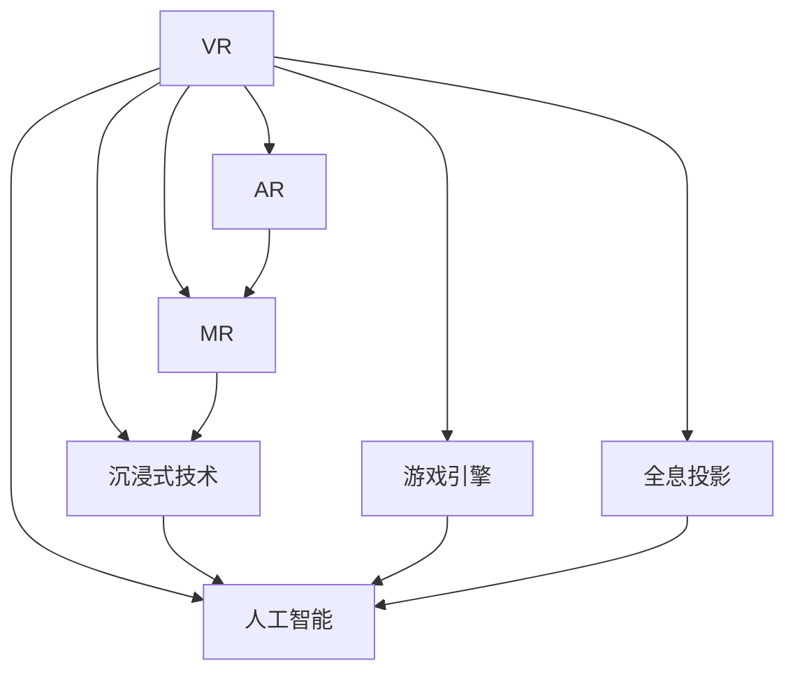

                 

# VR创业：虚拟现实技术的商业化

## 1. 背景介绍

### 1.1 问题由来
虚拟现实（Virtual Reality, VR）作为一种高度沉浸式的数字体验，正在成为新一代技术潮流。它在教育、娱乐、医疗、工业等多个领域展现出广阔的应用前景，吸引了众多创业者和投资者关注。然而，VR技术的商业化过程中面临诸多挑战，如何克服这些问题，探索出可行的商业模式，是创业者和投资者共同关注的焦点。

### 1.2 问题核心关键点
VR技术商业化的核心问题在于如何平衡技术研发与商业应用的关联，将先进的VR技术转化成实际的市场产品。这一过程涉及多个环节，包括技术选型、市场定位、用户需求分析、商业模式设计等。

## 2. 核心概念与联系

### 2.1 核心概念概述
- **虚拟现实（VR）**：一种通过计算机生成并模拟真实世界的三维环境，使用户能够沉浸式体验的技术。
- **增强现实（AR）**：一种将数字信息叠加到真实世界之上的技术。
- **混合现实（MR）**：结合VR与AR的混合技术，提供更加沉浸与互动的数字体验。
- **沉浸式技术（Immersive Technology）**：包括VR、AR、MR等多种技术，为用户提供高度沉浸的体验。
- **人工智能（AI）**：结合VR的智能交互技术，使虚拟环境更加智能与互动。
- **游戏引擎（Game Engine）**：用于创建和模拟VR/AR/MR应用的核心软件工具。
- **全息投影（Holography）**：一种基于三维图像生成技术的沉浸式数字体验。

这些核心概念之间相互联系，共同构成了虚拟现实技术商业化的基础。通过VR与AI、游戏引擎的结合，可以实现更加沉浸、智能的互动体验；通过AR与MR技术的融合，提供更加广泛的现实世界应用场景；通过全息投影技术，创造更加立体、真实的虚拟环境。

### 2.2 核心概念原理和架构的 Mermaid 流程图



这个流程图展示了虚拟现实技术的核心组件及其相互关系：

1. VR技术是基础，提供沉浸式体验的核心手段。
2. AR与MR技术扩展了VR的应用场景，提供与真实世界结合的可能性。
3. 沉浸式技术与人工智能结合，使虚拟环境更加智能互动。
4. 游戏引擎提供技术支持，简化开发流程。
5. 全息投影技术增强了虚拟环境的真实感。

通过这些核心技术的融合，能够创造出更为丰富、多样化的沉浸式数字体验。

## 3. 核心算法原理 & 具体操作步骤
### 3.1 算法原理概述
VR技术的商业化涉及多个算法和技术的综合应用，包括但不限于计算机图形学、三维建模、视觉感知、运动控制、自然语言处理等。其中，关键的算法原理包括：

1. **几何建模**：利用三维建模技术生成虚拟空间中的物体和场景，为用户体验提供真实感。
2. **渲染技术**：通过渲染引擎将三维模型转换为可交互的虚拟场景，实现光影效果、动态效果等。
3. **人体运动追踪**：使用传感器追踪用户的头部和手部运动，实现交互式控制。
4. **视觉感知算法**：利用深度学习算法，提升虚拟环境的真实感和沉浸感。
5. **自然语言处理（NLP）**：通过NLP技术，实现语音识别、文本输入、自然对话等功能。

### 3.2 算法步骤详解
VR技术的商业化过程大致分为以下步骤：

**Step 1: 市场调研与需求分析**
- 收集目标市场的用户需求和痛点，确定产品定位和差异化策略。
- 分析竞争对手的产品优势和市场表现，找准市场切入点。

**Step 2: 技术选型与设计**
- 根据市场需求和用户期望，选择合适的VR/AR/MR技术方案。
- 设计产品原型，进行技术验证和用户测试。

**Step 3: 用户体验优化**
- 优化用户体验，提升虚拟环境的互动性和真实感。
- 利用人工智能技术，增强虚拟环境的智能交互能力。

**Step 4: 商业模式设计**
- 设计适合市场的商业模式，考虑订阅制、购买制、广告支持等多种形式。
- 制定营销策略，选择线上与线下相结合的推广方式。

**Step 5: 原型开发与测试**
- 进行原型开发，开发过程中进行功能测试和性能测试。
- 收集用户反馈，不断迭代优化产品。

**Step 6: 产品上线与市场推广**
- 上线产品并进行市场推广，利用多渠道营销提高品牌知名度。
- 监控用户反馈，不断优化用户体验。

### 3.3 算法优缺点
VR技术商业化存在以下优点：

1. **沉浸感强**：通过VR技术，用户可以完全沉浸在虚拟世界中，体验感强烈。
2. **互动性强**：利用虚拟环境的交互特性，提升用户体验和参与感。
3. **应用场景广泛**：VR技术可以应用于教育、娱乐、医疗等多个领域，市场潜力大。

同时，也存在以下缺点：

1. **技术复杂**：需要多学科的交叉技术支持，开发成本高。
2. **设备限制**：需要专业设备支持，普及率低。
3. **视觉疲劳**：长时间使用可能引起视觉疲劳和晕动症等不适。
4. **内容缺乏**：优质内容开发难度大，用户内容消费单一。

### 3.4 算法应用领域
VR技术广泛应用于以下领域：

1. **教育培训**：用于虚拟教室、模拟实验、历史重现等场景，提升学习效果。
2. **医疗健康**：用于手术模拟、康复训练、心理治疗等场景，辅助医疗应用。
3. **娱乐体验**：用于游戏、电影、虚拟旅游等场景，提供沉浸式娱乐体验。
4. **工业制造**：用于虚拟装配、虚拟培训、虚拟样机等场景，提升生产效率。
5. **建筑设计**：用于虚拟漫游、虚拟展示、虚拟设计等场景，优化设计流程。

## 4. 数学模型和公式 & 详细讲解 & 举例说明
### 4.1 数学模型构建
VR技术的数学模型通常包括以下几个部分：

1. **三维空间建模**：利用向量表示虚拟空间的几何信息，例如：
   - 三维坐标系：$(x,y,z)$
   - 旋转矩阵：$R$

2. **视线向量计算**：计算用户视角与虚拟场景的视线向量，例如：
   - 视线方向：$\vec{d}$
   - 视线角度：$\theta, \phi$

3. **渲染方程**：描述场景渲染的基本数学模型，例如：
   - 光通量：$L$
   - 材质反射率：$\sigma$
   - 辐射传输：$\sigma$

4. **运动控制算法**：描述用户动作与虚拟环境互动的数学模型，例如：
   - 头部追踪算法：$\vec{H}$
   - 手部追踪算法：$\vec{H}$

### 4.2 公式推导过程
以下以视线向量计算为例，展示其数学推导过程：

用户视角与虚拟场景的视线向量计算，可以采用以下公式：
$$
\vec{d} = R(\theta, \phi) \vec{n}
$$
其中，$\vec{n}$为虚拟场景中视点方向向量，$R(\theta, \phi)$为旋转矩阵，$\theta$为俯仰角，$\phi$为方位角。

### 4.3 案例分析与讲解
以虚拟教室为例，展示VR技术的商业化应用：

1. **需求分析**：确定虚拟教室需要具备的交互功能，如互动白板、远程协作、虚拟实验等。
2. **技术选型**：选择适合的VR头显设备，如HTC Vive、Oculus Rift等。
3. **场景设计**：设计虚拟教室的空间布局，如讲台、课桌、黑板等。
4. **内容开发**：开发虚拟实验、互动课件、模拟实验等教学内容。
5. **用户体验优化**：通过用户测试，不断优化虚拟教室的交互体验和性能。
6. **商业模式设计**：考虑订阅制、B2B、B2C等多种商业模式，制定合理的定价策略。

## 5. 项目实践：代码实例和详细解释说明
### 5.1 开发环境搭建
VR技术开发需要配置相应的开发环境，以下是一个基于Unity3D的VR开发环境搭建流程：

1. **安装Unity3D**：下载并安装Unity3D，选择适合的版本。
2. **安装VR插件**：在Unity3D中安装VR插件，如UnityVR、TPose等。
3. **配置开发环境**：搭建开发环境，配置VR设备，如安装VR头显、控制器等。
4. **创建新项目**：在Unity3D中创建一个新项目，设置项目环境。

### 5.2 源代码详细实现
以下是一个简单的Unity3D项目，实现VR教室的基本功能：

```csharp
using UnityEngine;
using UnityEngine.XR;

public class VRRoomController : MonoBehaviour
{
    public XRNode cameraNode;
    public GameObject[] walls;
    public GameObject[] desks;

    void Start()
    {
        // 初始化VR设备
        XRSessionManagementSystem.instance.onSessionOpened += OnSessionOpened;
        XRSessionManagementSystem.instance.onSessionClosed += OnSessionClosed;

        // 加载虚拟场景
        LoadScene();
    }

    void Update()
    {
        // 更新VR相机
        XRInterposer.UpdateCamera(cameraNode);

        // 控制VR教室互动
        InteractWithDesks();
    }

    void OnSessionOpened()
    {
        LoadScene();
    }

    void OnSessionClosed()
    {
        Application.Quit();
    }

    void LoadScene()
    {
        SceneManager.LoadScene("VRRoom");
    }

    void InteractWithDesks()
    {
        var ray = Camera.main.ScreenPointToRay(Input.mousePosition);
        var hit = RaycastHit();

        if (hit.collider != null)
        {
            if (hit.collider.CompareTag("Desk"))
            {
                // 处理桌子交互
            }
        }
    }

    RaycastHit RaycastHit()
    {
        Ray ray = Camera.main.ScreenPointToRay(Input.mousePosition);
        ray.origin = Camera.main.transform.position;
        ray.direction = ray.direction.normalized;

        var hit = new RaycastHit();
        if (Physics.Raycast(ray, out hit, ray.distance))
        {
            return hit;
        }
        return default(RaycastHit);
    }
}
```

### 5.3 代码解读与分析
**代码解读**：
- `XRSessionManagementSystem`：用于管理VR会话的生命周期。
- `SceneManager`：用于加载和管理虚拟场景。
- `XRInterposer`：用于更新VR相机。
- `RaycastHit`：用于检测射线击中的物体。
- `InteractWithDesks`：用于处理桌子交互。

**分析**：
- 代码实现了虚拟教室的基本功能，包括场景加载、VR相机更新、桌子交互等。
- `XRSessionManagementSystem`用于管理VR会话，保证VR场景的稳定运行。
- `SceneManager`用于加载和管理虚拟场景，通过`LoadScene`方法加载虚拟教室场景。
- `XRInterposer`用于更新VR相机，保证用户视角与虚拟场景的同步。
- `InteractWithDesks`用于处理桌子交互，通过射线检测检测用户是否与桌子产生交互。

## 6. 实际应用场景
### 6.1 教育培训
VR技术在教育培训领域具有广泛的应用前景。虚拟教室可以提供沉浸式学习环境，提升学生学习兴趣和效果。例如，虚拟实验室可以模拟真实的实验场景，增强学生的动手能力和理解深度。

### 6.2 医疗健康
VR技术在医疗健康领域也有着巨大的应用潜力。虚拟手术室可以提供模拟手术环境，帮助医生提升手术技能。虚拟康复训练可以提供个性化的康复方案，加速患者的康复进程。

### 6.3 娱乐体验
VR技术在娱乐领域的应用也日益普及。虚拟电影、虚拟旅游等场景，为观众提供沉浸式体验，增强娱乐效果。例如，虚拟现实电影《L.A. Noire》、《Inception》等，已经取得了巨大的商业成功。

### 6.4 工业制造
VR技术在工业制造领域的应用正在逐步扩展。虚拟装配、虚拟培训等场景，可以提升生产效率，减少生产成本。例如，宝马汽车公司已经在生产线上应用VR技术，提升生产流程的自动化水平。

## 7. 工具和资源推荐
### 7.1 学习资源推荐
1. **《Unity3D官方文档》**：Unity3D的官方文档，详细介绍了Unity3D的各个模块和功能。
2. **《VR开发实战》书籍**：介绍VR开发的基本流程和实用技术。
3. **《虚拟现实基础》课程**：由Coursera提供，涵盖VR技术的基础知识和发展趋势。
4. **《VR与AR开发》课程**：由Udacity提供，介绍VR与AR技术的开发技巧和实践经验。
5. **《VR与AR应用》书籍**：介绍VR与AR技术在各个领域的应用案例。

### 7.2 开发工具推荐
1. **Unity3D**：用于创建VR/AR/MR应用的流行游戏引擎，提供强大的开发工具和性能优化功能。
2. **Unreal Engine**：另一款流行的游戏引擎，支持VR/AR/MR开发，提供更强大的图形渲染和物理模拟功能。
3. **Vuforia**：一个用于AR开发的SDK，提供丰富的AR功能，支持Unity3D和Unreal Engine。
4. **OpenXR**：一个跨平台AR标准，提供统一的AR开发接口，支持多种VR/AR平台。
5. **Google ARCore**：一个用于AR开发的SDK，支持Android平台，提供丰富的AR功能。

### 7.3 相关论文推荐
1. **《Virtual Reality Technologies and Applications》论文**：介绍VR技术的发展历史和应用场景。
2. **《Real-time Rendering in Virtual Reality Systems》论文**：介绍VR渲染技术的最新进展。
3. **《Human-Computer Interaction with Virtual Reality》论文**：介绍VR技术在交互设计中的应用。
4. **《Virtual Reality in Medicine》论文**：介绍VR技术在医疗健康领域的应用。
5. **《Virtual Reality in Education》论文**：介绍VR技术在教育领域的应用。

## 8. 总结：未来发展趋势与挑战
### 8.1 研究成果总结
VR技术在商业化过程中取得了显著进展，但仍面临诸多挑战。当前的技术水平和市场环境为VR技术的进一步发展提供了有利条件，但也需注意以下几点：

1. **技术进步**：VR技术的硬件和软件都在不断进步，例如头显设备的分辨率、带宽等性能提升，VR内容的多样化，VR技术的普及等。
2. **市场推广**：VR市场的推广力度不断加大，各大厂商推出更多的VR设备，不断拓展VR应用场景，提升用户体验。
3. **生态建设**：VR技术的生态系统逐步完善，VR内容库不断壮大，VR开发者社区日益活跃。

### 8.2 未来发展趋势
VR技术的未来发展趋势包括：

1. **技术融合**：VR技术与其他技术如AR、MR、全息投影等进一步融合，提供更丰富的应用场景。
2. **AI技术应用**：利用人工智能技术提升VR应用的智能性和互动性。
3. **低成本普及**：通过技术进步和成本降低，提升VR设备的普及率。
4. **虚拟与现实融合**：实现虚拟世界与现实世界的无缝融合，提供更加沉浸的体验。

### 8.3 面临的挑战
VR技术的商业化仍面临以下挑战：

1. **技术瓶颈**：如设备性能、网络延迟、渲染速度等技术瓶颈尚未完全解决。
2. **用户体验**：如视觉疲劳、晕动症等问题仍需进一步优化。
3. **内容不足**：优质VR内容的开发难度大，用户内容消费单一。
4. **市场教育**：用户对VR技术的认知度较低，市场教育工作任重道远。

### 8.4 研究展望
未来VR技术的商业化需要在以下几个方面继续探索：

1. **技术优化**：继续优化VR设备的性能和用户体验，提升内容质量，降低成本。
2. **市场教育**：通过多渠道推广，提升用户对VR技术的认知度和接受度。
3. **应用拓展**：拓展VR技术在更多领域的市场应用，探索更多商业模式。
4. **技术融合**：进一步探索VR技术与其他技术的融合应用，提升整体性能。

总之，VR技术的商业化是一个不断探索和创新的过程，需要各方的共同努力。未来，随着技术的不断进步和市场的不断成熟，VR技术将更加深入地融入各个领域，为人类社会带来新的变革和进步。

## 9. 附录：常见问题与解答

### Q1: VR设备选型有哪些考虑因素？

A: VR设备选型需要考虑以下因素：

1. **分辨率**：设备分辨率越高，用户体验越好。
2. **刷新率**：设备刷新率越高，用户体验越流畅。
3. **延迟**：设备延迟越低，用户体验越自然。
4. **舒适性**：设备舒适度越高，用户体验越舒适。
5. **价格**：设备价格越低，用户普及率越高。

### Q2: 如何保证VR内容的真实感？

A: 保证VR内容的真实感需要从以下几个方面入手：

1. **高精度建模**：使用高精度三维建模技术，提高虚拟场景的逼真度。
2. **光照效果**：优化光照效果，提升虚拟场景的真实感。
3. **纹理贴图**：使用高分辨率纹理贴图，提升虚拟场景的细节表现。
4. **物理引擎**：使用高性能物理引擎，模拟真实的物理效果。

### Q3: VR技术的商业化过程中需要注意哪些风险？

A: VR技术的商业化过程中需要注意以下风险：

1. **市场风险**：市场需求和用户接受度存在不确定性。
2. **技术风险**：技术成熟度和用户体验存在不确定性。
3. **市场竞争**：市场竞争激烈，需要持续创新和优化。
4. **法规风险**：不同国家和地区的法规政策可能存在差异，需要合规经营。

总之，VR技术的商业化需要在技术、市场、法律等方面进行全面考量，制定合理的策略，才能实现可持续发展。

---

作者：禅与计算机程序设计艺术 / Zen and the Art of Computer Programming

