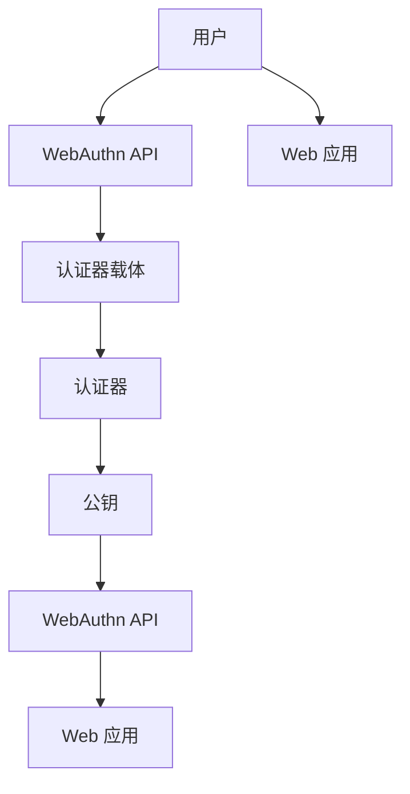

                 

# WebAuthn 的实现细节

WebAuthn是一种基于开放标准的认证技术，用于简化用户的登录过程，确保用户身份验证的安全性和易用性。本文将详细介绍WebAuthn的核心概念、实现原理以及具体应用场景。

## 1. 背景介绍

### 1.1 问题由来

在Web应用的广泛普及背景下，用户频繁需要在不同网站和服务之间进行登录和认证。传统的用户名和密码认证方式存在诸多问题，如易受钓鱼攻击、密码遗忘等。WebAuthn旨在解决这些问题，提供一种更安全、便捷的认证方式。

WebAuthn由W3C和FIDO Alliance共同开发，基于公钥密码学原理，结合了硬件安全密钥和生物特征等技术，实现了更加强大的身份认证能力。

### 1.2 问题核心关键点

WebAuthn的关键点包括：

- **公钥密码学**：使用公钥对用户身份进行加密和验证，确保通信安全。
- **硬件安全密钥**：通过硬件设备生成和管理密钥，增加安全性。
- **生物特征认证**：结合指纹、面部识别等生物特征，进一步提升身份验证的准确性和安全性。
- **开放标准**：遵循WebAuthn开放标准，保证不同平台和设备间的互操作性。

## 2. 核心概念与联系

### 2.1 核心概念概述

为了更好地理解WebAuthn技术，本节将介绍几个关键概念：

- **WebAuthn API**：Web浏览器提供的API接口，用于实现WebAuthn认证过程。
- **公钥**：在WebAuthn中，用户的公钥被存储在安全密钥中，用于加密和验证。
- **安全密钥**：WebAuthn支持多种类型的安全密钥，包括USB密钥、硬件安全模块（HSM）、生物特征等。
- **认证器**：负责生成和管理安全密钥的设备或服务。
- **认证器载体**：用于连接认证器和Web浏览器的设备或应用，如USB密钥、手机等。

### 2.2 核心概念原理和架构的 Mermaid 流程图



**解释**：
- 用户通过WebAuthn API向认证器载体发起认证请求。
- 认证器载体将请求转发给认证器，生成和存储用户的公钥。
- WebAuthn API接收认证器返回的公钥。
- 公钥被用于加密和验证用户身份，完成身份认证过程。

## 3. 核心算法原理 & 具体操作步骤

### 3.1 算法原理概述

WebAuthn认证过程基于公钥密码学，分为注册和认证两个阶段。注册阶段用于初始化安全密钥和公钥，认证阶段用于验证用户身份。

### 3.2 算法步骤详解

#### 注册阶段

1. **获取公钥**：用户通过WebAuthn API向认证器发起注册请求，认证器生成一个随机数$r$，并计算公钥$P$和私钥$S$。
2. **存储公钥**：认证器将公钥$P$和随机数$r$存储在安全密钥中。
3. **响应请求**：认证器将公钥$P$和随机数$r$返回给Web浏览器。
4. **生成挑战**：Web浏览器生成一个随机数$c$，并计算挑战值$C=cP$，以及签名$S$。
5. **验证签名**：Web浏览器将挑战值$C$和签名$S$发送给Web应用，Web应用验证签名是否合法。

#### 认证阶段

1. **获取公钥**：用户通过WebAuthn API向认证器发起认证请求，认证器返回存储在安全密钥中的公钥$P$和随机数$r$。
2. **生成挑战**：Web浏览器生成一个随机数$c$，并计算挑战值$C=cP$，以及签名$S$。
3. **验证签名**：Web浏览器将挑战值$C$和签名$S$发送给Web应用，Web应用验证签名是否合法。
4. **获取私钥**：Web应用通过WebAuthn API向认证器请求私钥，认证器生成一个随机数$s$，并计算私钥$S=s+sr$。
5. **验证身份**：Web应用验证用户是否持有合法的安全密钥，从而完成身份认证。

### 3.3 算法优缺点

#### 优点

- **安全性高**：基于公钥密码学和硬件密钥，提供了高强度的安全保障。
- **易用性好**：用户只需要一个硬件密钥或生物特征，即可轻松完成身份认证。
- **互操作性强**：遵循开放标准，不同平台和设备间可以实现互操作。

#### 缺点

- **成本高**：需要购买和配置硬件密钥，增加了用户和企业的成本。
- **依赖硬件**：对于没有安全密钥的用户，无法使用WebAuthn进行身份认证。
- **用户体验差**：部分用户可能对新认证方式不熟悉，导致用户体验不佳。

### 3.4 算法应用领域

WebAuthn已在多个领域得到广泛应用，包括：

- **Web应用**：如Google、Facebook等大型Web应用，采用WebAuthn进行用户身份认证。
- **移动应用**：如WhatsApp、Twitter等移动应用，通过移动设备的安全密钥进行身份认证。
- **企业应用**：如银行、政府服务等企业级应用，利用WebAuthn提供安全的访问控制。

## 4. 数学模型和公式 & 详细讲解

### 4.1 数学模型构建

WebAuthn的数学模型基于椭圆曲线密码学（Elliptic Curve Cryptography, ECC），其核心是椭圆曲线上的点加密和签名验证。椭圆曲线$E$由一个方程和一组基点定义，公钥$P$为椭圆曲线上的一个点，私钥$s$为整数。椭圆曲线的基点$G$为生成点，满足椭圆曲线方程。

### 4.2 公式推导过程

设椭圆曲线$E$的方程为$y^2 = x^3 + ax + b$，基点为$G=(x_G,y_G)$，公钥为$P=(x_P,y_P)$，私钥为$s$。

**公钥生成**：
1. 随机生成整数$k$，计算$K=kG$。
2. 计算$x_P=kx_G$，$y_P=k^3ax_G+b+k^2y_G$。
3. 公钥为$P=(x_P,y_P)$。

**签名生成**：
1. 将消息$m$转换为整数$h$。
2. 计算$r=kG_x$，$s=k^{-1}(h+srx_G)$。
3. 签名对为$(r,s)$。

**签名验证**：
1. 将消息$m$转换为整数$h$。
2. 计算$u_1=hs$，$u_2=r$。
3. $R=u_1G+u_2P$。
4. 计算$e=s(R_x)$，$s^{-1}=(u_1x_G-u_2x_P)$。
5. 验证$e^{s^{-1}}=h \mod n$。

### 4.3 案例分析与讲解

以USB硬件密钥为例，分析WebAuthn的实现过程。

**注册阶段**：
1. 用户通过Web浏览器连接USB密钥。
2. 浏览器生成随机数$r$，计算公钥$P$和私钥$S$，并将公钥$P$和$r$存储在USB密钥中。
3. 浏览器计算挑战值$C=cP$和签名$S$，将$C$和$S$发送给Web应用。
4. Web应用验证签名$S$是否合法。

**认证阶段**：
1. 用户通过Web浏览器连接USB密钥。
2. 浏览器生成随机数$c$，计算挑战值$C=cP$和签名$S$，将$C$和$S$发送给Web应用。
3. Web应用通过WebAuthn API向认证器请求私钥，认证器生成随机数$s$，计算私钥$S=s+sr$，将$S$返回给Web应用。
4. Web应用验证用户是否持有合法的USB密钥，从而完成身份认证。

## 5. 项目实践：代码实例和详细解释说明

### 5.1 开发环境搭建

为了实现WebAuthn认证过程，需要搭建以下开发环境：

1. **Web服务器**：如Apache、Nginx等，用于处理Web请求。
2. **Web浏览器**：如Chrome、Firefox等，支持WebAuthn API。
3. **认证器载体**：如USB密钥、移动设备等，用于连接认证器和Web浏览器。
4. **认证器**：如FIDO认证器，用于生成和管理安全密钥。

### 5.2 源代码详细实现

以FIDO认证器为例，展示WebAuthn的实现代码。

**注册过程**：

```python
def register(user, credential):
    # 生成随机数r和公钥P
    r = generate_random_number()
    P = generate_public_key(r)
    # 存储公钥P和随机数r在安全密钥中
    store_credential(credential, r, P)
    # 计算挑战值C和签名S
    C = generate_challenge()
    S = generate_signature(P, r, C)
    # 返回公钥P和挑战值C
    return P, C
```

**认证过程**：

```python
def authenticate(credential, challenge):
    # 获取安全密钥中存储的公钥P和随机数r
    r, P = get_credential(credential)
    # 计算挑战值C和签名S
    C = challenge
    S = generate_signature(P, r, C)
    # 向认证器请求私钥
    s = get_private_key_from_authenticator()
    # 验证用户是否持有合法的安全密钥
    if verify_signature(P, r, C, S, s):
        return True
    else:
        return False
```

### 5.3 代码解读与分析

**`register`函数**：
- **生成随机数r和公钥P**：使用`generate_random_number`和`generate_public_key`函数生成随机数和公钥。
- **存储公钥P和随机数r**：使用`store_credential`函数将公钥和随机数存储在安全密钥中。
- **计算挑战值C和签名S**：使用`generate_challenge`和`generate_signature`函数计算挑战值和签名。
- **返回公钥P和挑战值C**：将公钥和挑战值返回给Web应用。

**`authenticate`函数**：
- **获取公钥P和随机数r**：使用`get_credential`函数获取存储在安全密钥中的公钥和随机数。
- **计算挑战值C和签名S**：使用`generate_signature`函数计算挑战值和签名。
- **请求私钥s**：使用`get_private_key_from_authenticator`函数向认证器请求私钥。
- **验证用户身份**：使用`verify_signature`函数验证签名是否合法，返回验证结果。

## 6. 实际应用场景

### 6.1 智能设备解锁

WebAuthn可应用于智能设备解锁，用户只需通过指纹或面部识别进行认证，无需输入密码。这种方式提高了设备的隐私和安全保障。

### 6.2 企业内部访问控制

企业内部系统通过WebAuthn认证，可以实现单点登录和统一认证。员工只需一个安全密钥，即可访问多个应用和系统，提高了工作效率和安全性。

### 6.3 在线金融交易

WebAuthn可以用于金融交易，确保用户身份的真实性和交易的安全性。用户通过USB密钥或生物特征进行身份验证，防止交易风险和欺诈行为。

### 6.4 未来应用展望

随着WebAuthn技术的不断成熟，未来将在更多领域得到应用。例如：

- **物联网设备认证**：通过WebAuthn认证，物联网设备可以实现安全访问和管理。
- **智能家居控制**：用户通过WebAuthn认证，可以控制和管理智能家居设备。
- **跨平台身份认证**：不同平台和设备间实现互操作，提升用户体验。

## 7. 工具和资源推荐

### 7.1 学习资源推荐

为了深入学习WebAuthn技术，推荐以下学习资源：

1. **WebAuthn标准文档**：W3C和FIDO Alliance发布的WebAuthn规范文档，详细介绍了WebAuthn的实现原理和应用场景。
2. **FIDO Alliance官网**：FIDO Alliance提供WebAuthn相关的技术文档、工具和案例。
3. **《WebAuthn》书籍**：详细介绍了WebAuthn的实现细节和应用场景，适合初学者和开发者阅读。
4. **《WebAuthn: Real World Use Cases》文章**：介绍了WebAuthn在不同领域的应用案例，帮助开发者更好地理解WebAuthn。

### 7.2 开发工具推荐

为了实现WebAuthn认证过程，推荐以下开发工具：

1. **WebAuthn库**：如Google WebAuthn库，提供了WebAuthn的API接口和实现代码。
2. **FIDO认证器**：如Yubico、Nokvia等，支持多种类型的安全密钥和生物特征认证。
3. **USB密钥**：如YubiKey、Gemalto等，用于连接Web浏览器和认证器。

### 7.3 相关论文推荐

WebAuthn技术的发展离不开学界的持续研究。以下是几篇奠基性的相关论文，推荐阅读：

1. **FIDO Alliance标准文档**：详细介绍了WebAuthn的安全特性和实现细节。
2. **《WebAuthn: A User Authentication Protocol》论文**：介绍了WebAuthn的实现原理和安全性。
3. **《WebAuthn: A New User Authentication Protocol for the Web》论文**：探讨了WebAuthn在不同Web平台上的互操作性。

## 8. 总结：未来发展趋势与挑战

### 8.1 总结

本文对WebAuthn的核心概念、实现原理和具体操作步骤进行了详细讲解，并通过代码实例展示了WebAuthn的实现过程。WebAuthn作为一种高强度的身份认证技术，已被广泛应用于各种场景。

通过本文的系统梳理，可以看到WebAuthn技术的安全性和易用性，使得其在未来的应用前景广阔。未来，随着WebAuthn技术的不断发展和完善，其在各个领域的应用将更加广泛和深入。

### 8.2 未来发展趋势

WebAuthn的未来发展趋势包括：

1. **更多硬件设备支持**：WebAuthn支持的硬件设备将更加多样化，如智能手表、智能家居等。
2. **跨平台互操作性**：不同平台和设备间实现更好的互操作性，提升用户体验。
3. **隐私保护**：引入隐私保护技术，如匿名标识符、匿名身份验证等，确保用户隐私安全。
4. **区块链技术**：结合区块链技术，实现更加安全的认证过程。
5. **自动化配置**：引入自动化配置工具，简化WebAuthn的部署和使用。

### 8.3 面临的挑战

WebAuthn虽然已取得显著进展，但仍面临以下挑战：

1. **硬件设备成本高**：硬件设备的高成本增加了用户和企业的负担。
2. **用户接受度低**：部分用户对新认证方式不熟悉，导致用户体验不佳。
3. **互操作性问题**：不同厂商和平台间的互操作性仍需进一步提升。
4. **安全性问题**：如何确保认证过程的安全性，防止攻击和欺诈行为。
5. **隐私保护**：如何在保证安全性的同时，保护用户隐私。

### 8.4 研究展望

未来，需要在以下几个方面进行更多研究：

1. **硬件设备优化**：研发低成本、高性能的硬件设备，降低用户和企业的使用成本。
2. **自动化配置**：开发自动化配置工具，简化WebAuthn的部署和使用。
3. **跨平台互操作性**：推动不同平台和设备间的互操作性，提升用户体验。
4. **安全性提升**：引入更多的安全性技术，如隐私保护、区块链等，提高WebAuthn的可靠性。
5. **用户体验优化**：通过设计优秀的用户界面和交互体验，提升WebAuthn的接受度和使用率。

总之，WebAuthn技术具有广阔的发展前景和重要的应用价值。只有通过不断技术创新和应用优化，才能实现WebAuthn技术的长足发展和广泛应用。

## 9. 附录：常见问题与解答

**Q1: WebAuthn认证过程是否需要用户参与？**

A: WebAuthn认证过程需要用户参与，用户需要点击浏览器提示的“认证”按钮，完成认证过程。

**Q2: WebAuthn认证过程是否可以离线进行？**

A: WebAuthn认证过程需要在线进行，因为认证过程中需要与Web服务器进行交互。

**Q3: WebAuthn是否支持多因素认证？**

A: WebAuthn支持多因素认证，用户可以选择多种认证方式进行身份验证，如PIN码、生物特征等。

**Q4: WebAuthn认证过程是否容易被暴力破解？**

A: WebAuthn认证过程基于公钥密码学，难以被暴力破解。用户的安全密钥和公钥由硬件设备生成和管理，进一步增强了安全性。

**Q5: WebAuthn认证过程是否依赖浏览器实现？**

A: WebAuthn认证过程依赖Web浏览器的实现，不同浏览器的支持程度可能不同。但FIDO Alliance提供了跨浏览器的WebAuthn实现，增强了互操作性。

---

作者：禅与计算机程序设计艺术 / Zen and the Art of Computer Programming

