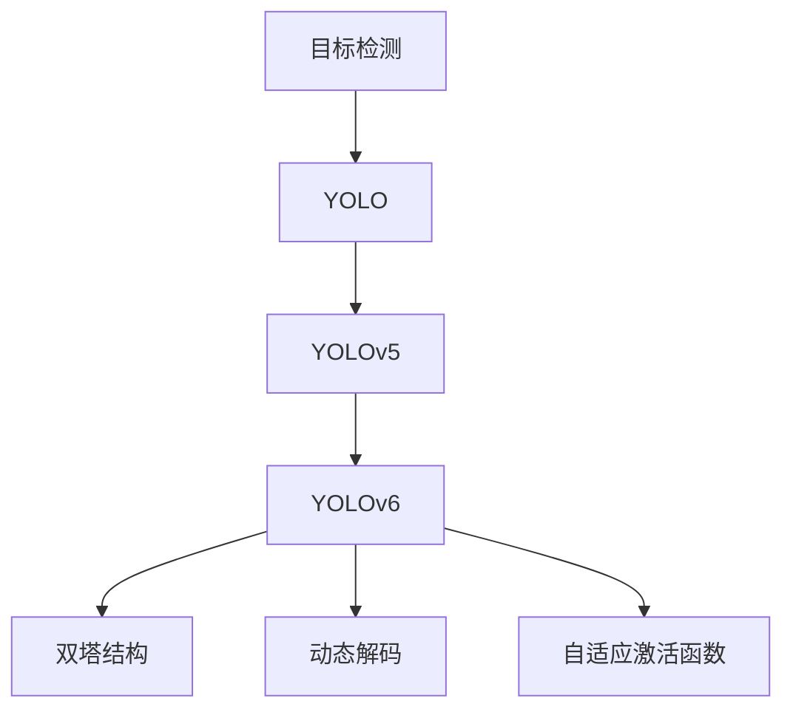

                 

# YOLOv6原理与代码实例讲解

## 1. 背景介绍

### 1.1 问题由来
随着深度学习技术在计算机视觉领域的迅猛发展，目标检测(物体识别)成为了图像理解任务中的重要环节。传统的目标检测方法如RCNN、Fast R-CNN、Faster R-CNN等，主要依赖于选择性搜索和区域提取，虽然精度较高，但速度较慢，且难以扩展到大型数据集上。为此，一些基于单个图像网络的目标检测方法如YOLO(You Only Look Once)应运而生。

YOLO采用端到端的单阶段检测框架，简化了目标检测流程，极大提升了检测速度。YOLO系列模型在COCO等公开数据集上取得了优异的表现，成为了计算机视觉领域的重要里程碑。

然而，YOLO系列模型的最新迭代版本YOLOv5虽然精度有所提升，但仍然面临计算量较大、难以高效部署的问题。针对此问题，YOLOv6在YOLOv5的基础上做了诸多优化，提出了双塔结构、动态解码等关键技术，进一步提升了检测性能和速度。

### 1.2 问题核心关键点
YOLOv6是YOLOv5系列的重要升级，主要创新点包括：
- 双塔结构：将检测网络与分类网络分离，各自独立训练，以提高检测精度。
- 动态解码：在检测阶段，通过解码器动态生成不同尺度的候选框，以更灵活地适应不同尺寸的目标。
- 自适应激活函数：在网络中引入自适应激活函数，减少模型对初始学习率的敏感度。

本文将重点介绍YOLOv6的原理与代码实现，帮助读者理解其在目标检测任务中的应用。

## 2. 核心概念与联系

### 2.1 核心概念概述

为了更好地理解YOLOv6，本节将介绍几个密切相关的核心概念：

- 目标检测(Object Detection)：通过图像分类和定位技术，识别并定位图像中的物体。主要任务包括目标定位和目标分类。

- YOLO：You Only Look Once的缩写，是一种基于单个神经网络的目标检测方法，通过单次前向传播即可实现目标检测。

- YOLOv6：YOLOv5的升级版本，在YOLOv5的基础上通过双塔结构、动态解码等技术，进一步提升了检测精度和速度。

- 双塔结构(Two-Path Structure)：YOLOv6提出的一种新架构，将检测网络与分类网络分离，各自独立训练。

- 动态解码(Dynamic Decoding)：YOLOv6在解码阶段通过动态生成候选框，更灵活地适应不同尺寸的目标。

- 自适应激活函数(Adaptive Activation Function)：YOLOv6通过引入自适应激活函数，减少模型对初始学习率的敏感度。

这些核心概念之间的逻辑关系可以通过以下Mermaid流程图来展示：



这个流程图展示了目标检测、YOLO、YOLOv6等概念及其之间的关系：

1. 目标检测通过图像分类和定位技术识别物体，主要包含目标定位和目标分类两个任务。
2. YOLO是一种基于单个神经网络的目标检测方法，通过单次前向传播实现目标检测。
3. YOLOv5是YOLO的升级版本，采用单阶段检测网络，通过多尺度特征图提取和分类头预测，提升了检测性能。
4. YOLOv6在YOLOv5的基础上，提出了双塔结构和动态解码等关键技术，进一步提升了检测精度和速度。
5. 双塔结构将检测网络与分类网络分离，各自独立训练，以提高检测精度。
6. 动态解码通过动态生成候选框，更灵活地适应不同尺寸的目标。
7. 自适应激活函数通过引入适应性激活函数，减少模型对初始学习率的敏感度。

## 3. 核心算法原理 & 具体操作步骤
### 3.1 算法原理概述

YOLOv6基于YOLOv5的优化，提出双塔结构、动态解码和自适应激活函数等技术，进一步提升了检测精度和速度。

- **双塔结构**：将检测网络与分类网络分离，各自独立训练。检测网络主要负责生成候选框，分类网络主要负责目标分类。
- **动态解码**：在检测阶段，通过解码器动态生成不同尺度的候选框，以更灵活地适应不同尺寸的目标。
- **自适应激活函数**：引入适应性激活函数，减少模型对初始学习率的敏感度。

YOLOv6的核心算法流程大致如下：

1. 收集训练数据集，并进行数据预处理，生成候选框。
2. 利用YOLOv6的检测网络，生成候选框的位置和大小信息。
3. 利用YOLOv6的分类网络，对候选框进行分类预测，得到每个候选框对应的类别概率。
4. 使用动态解码策略，对不同尺寸的目标进行检测。
5. 引入自适应激活函数，调整模型训练过程中的学习率。

### 3.2 算法步骤详解

以下是对YOLOv6算法步骤的详细讲解：

#### 3.2.1 数据集收集与预处理
1. 收集目标检测任务的数据集，如COCO、PASCAL VOC等。
2. 对数据集进行预处理，包括图像缩放、标准化、数据增强等，以提高模型训练效果。
3. 生成候选框。目标的候选框通常为正方形，可以通过检测算法(如DPM、RPN等)或手动标注生成。

#### 3.2.2 检测网络生成候选框
1. 使用YOLOv6的检测网络，生成候选框的位置和大小信息。YOLOv6的检测网络通常采用两个并行的卷积网络，分别生成两组不同尺度的候选框。
2. 对生成的候选框进行非极大值抑制(NMS)处理，以去除重叠部分，保留最能表示目标的候选框。

#### 3.2.3 分类网络预测类别
1. 利用YOLOv6的分类网络，对每个候选框进行分类预测，得到每个候选框对应的类别概率。YOLOv6的分类网络通常采用分类头预测，使用交叉熵损失函数进行训练。
2. 对所有候选框的分类结果进行非极大值抑制处理，保留得分最高的候选框。

#### 3.2.4 动态解码策略
1. 在检测阶段，动态生成不同尺度的候选框，以更灵活地适应不同尺寸的目标。
2. 利用YOLOv6的解码器，根据目标的尺寸信息，生成不同尺寸的候选框。
3. 对每个候选框进行分类预测，得到每个候选框对应的类别概率。
4. 对所有候选框的分类结果进行非极大值抑制处理，保留得分最高的候选框。

#### 3.2.5 自适应激活函数
1. 在YOLOv6的网络中引入自适应激活函数，以减少模型对初始学习率的敏感度。
2. 自适应激活函数可以根据模型的输出结果动态调整学习率，避免过拟合。
3. 通过引入自适应激活函数，YOLOv6的训练过程更加稳定，收敛速度更快。

### 3.3 算法优缺点

YOLOv6相比YOLOv5，在检测精度和速度上均有所提升，但也存在一些优缺点：

#### 3.3.1 优点
1. **检测精度提升**：双塔结构和动态解码策略提升了YOLOv6的检测精度，特别是对小尺寸目标的检测能力有所提升。
2. **训练稳定性**：引入自适应激活函数，使模型对初始学习率的敏感度降低，训练过程更加稳定。
3. **灵活性**：动态解码策略可以根据目标的尺寸信息，生成不同尺寸的候选框，提高了模型的灵活性。

#### 3.3.2 缺点
1. **计算复杂度增加**：双塔结构增加了网络的复杂度，导致计算量增加。
2. **参数量增加**：YOLOv6的参数量相比YOLOv5有所增加，增加了模型训练和推理的难度。
3. **实时性问题**：尽管YOLOv6提升了检测速度，但在处理大规模数据集时，仍然存在实时性问题。

### 3.4 算法应用领域

YOLOv6作为一种高效的目标检测方法，在计算机视觉领域具有广泛的应用前景。以下列举了YOLOv6在实际应用中的几个典型场景：

1. **自动驾驶**：在自动驾驶领域，YOLOv6可以用于检测道路上的车辆、行人、障碍物等目标，辅助自动驾驶系统做出决策。
2. **安防监控**：在安防监控领域，YOLOv6可以用于实时检测和识别监控视频中的目标，及时发现异常情况。
3. **医疗影像**：在医疗影像领域，YOLOv6可以用于检测和定位影像中的肿瘤、器官等目标，辅助医生进行诊断。
4. **工业质检**：在工业质检领域，YOLOv6可以用于检测和识别产品中的缺陷、缺陷位置等，提高生产效率和质量。
5. **无人零售**：在无人零售领域，YOLOv6可以用于检测和识别店内的商品、顾客等，实现智能货架管理和顾客服务。

YOLOv6在实际应用中展示了强大的目标检测能力，广泛应用于多个领域，为计算机视觉技术的落地应用提供了重要保障。

## 4. 数学模型和公式 & 详细讲解 & 举例说明

### 4.1 数学模型构建

YOLOv6的数学模型主要由检测网络和分类网络两部分组成。以下将分别介绍这两部分的数学模型构建。

#### 4.1.1 检测网络
YOLOv6的检测网络通常采用两个并行的卷积网络，分别生成两组不同尺度的候选框。假设输入图像大小为 $H \times W$，输出特征图大小为 $C_{pred} \times (H_{pred} \times W_{pred})$，每个特征图包含 $C_{pred}$ 个检测单元，每个检测单元生成 $K$ 个候选框。检测网络的输出包括候选框的位置和大小信息。

假设检测网络的输出为 $X_{pred} \in \mathbb{R}^{C_{pred} \times (H_{pred} \times W_{pred}) \times (K+4)}$，其中 $X_{pred}$ 的前 $K \times (H_{pred} \times W_{pred})$ 个通道为候选框的预测位置，后 $C_{pred} \times (H_{pred} \times W_{pred})$ 个通道为候选框的预测大小。

检测网络的输出 $X_{pred}$ 可以通过以下公式计算：

$$
X_{pred} = \text{Convolution}(X_{in})
$$

其中 $X_{in}$ 为输入特征图，$\text{Convolution}$ 为卷积操作。

#### 4.1.2 分类网络
YOLOv6的分类网络通常采用分类头预测，使用交叉熵损失函数进行训练。假设分类网络的输出为 $X_{cls} \in \mathbb{R}^{C_{cls} \times (H_{cls} \times W_{cls}) \times K}$，其中 $X_{cls}$ 的前 $H_{cls} \times W_{cls}$ 个通道为候选框的分类概率。

分类网络的输出 $X_{cls}$ 可以通过以下公式计算：

$$
X_{cls} = \text{Convolution}(X_{in})
$$

其中 $X_{in}$ 为输入特征图，$\text{Convolution}$ 为卷积操作。

#### 4.1.3 检测目标的生成
在检测阶段，YOLOv6通过解码器动态生成不同尺度的候选框，以更灵活地适应不同尺寸的目标。假设解码器输出的候选框为 $X_{dec} \in \mathbb{R}^{C_{dec} \times (H_{dec} \times W_{dec}) \times K}$，其中 $X_{dec}$ 的前 $H_{dec} \times W_{dec}$ 个通道为候选框的预测位置，后 $C_{dec} \times (H_{dec} \times W_{dec})$ 个通道为候选框的预测大小。

检测目标的生成可以通过以下公式计算：

$$
X_{dec} = \text{Convolution}(X_{pred})
$$

其中 $X_{pred}$ 为检测网络的输出，$\text{Convolution}$ 为卷积操作。

### 4.2 公式推导过程

以下是对YOLOv6检测网络、分类网络和解码器的数学模型构建及公式推导过程的详细讲解：

#### 4.2.1 检测网络
检测网络的输入为 $X_{in} \in \mathbb{R}^{H \times W \times C_{in}}$，输出为 $X_{pred} \in \mathbb{R}^{C_{pred} \times (H_{pred} \times W_{pred}) \times (K+4)}$。检测网络包含 $C_{pred}$ 个检测单元，每个检测单元生成 $K$ 个候选框，每个候选框包含 $4$ 个位置信息和 $1$ 个大小信息。

假设检测网络的卷积核大小为 $3 \times 3$，步长为 $2$，输出特征图大小为 $H_{pred} \times W_{pred}$。则检测网络可以表示为：

$$
X_{pred} = \text{Convolution}_{3 \times 3}(X_{in})
$$

其中 $X_{pred} \in \mathbb{R}^{C_{pred} \times H_{pred} \times W_{pred} \times (K+4)}$，$X_{in} \in \mathbb{R}^{H \times W \times C_{in}}$，$\text{Convolution}_{3 \times 3}$ 为 $3 \times 3$ 卷积操作。

#### 4.2.2 分类网络
分类网络的输入为 $X_{in} \in \mathbb{R}^{H \times W \times C_{in}}$，输出为 $X_{cls} \in \mathbb{R}^{C_{cls} \times H_{cls} \times W_{cls} \times K}$。分类网络包含 $C_{cls}$ 个分类单元，每个分类单元生成 $K$ 个候选框的分类概率。

假设分类网络的卷积核大小为 $3 \times 3$，步长为 $2$，输出特征图大小为 $H_{cls} \times W_{cls}$。则分类网络可以表示为：

$$
X_{cls} = \text{Convolution}_{3 \times 3}(X_{in})
$$

其中 $X_{cls} \in \mathbb{R}^{C_{cls} \times H_{cls} \times W_{cls} \times K}$，$X_{in} \in \mathbb{R}^{H \times W \times C_{in}}$，$\text{Convolution}_{3 \times 3}$ 为 $3 \times 3$ 卷积操作。

#### 4.2.3 解码器
解码器可以将检测网络输出的候选框位置和大小信息，动态生成不同尺度的候选框。假设解码器的输出为 $X_{dec} \in \mathbb{R}^{C_{dec} \times (H_{dec} \times W_{dec}) \times K}$，其中 $X_{dec}$ 的前 $H_{dec} \times W_{dec}$ 个通道为候选框的预测位置，后 $C_{dec} \times (H_{dec} \times W_{dec})$ 个通道为候选框的预测大小。

假设解码器的卷积核大小为 $3 \times 3$，步长为 $2$，输出特征图大小为 $H_{dec} \times W_{dec}$。则解码器可以表示为：

$$
X_{dec} = \text{Convolution}_{3 \times 3}(X_{pred})
$$

其中 $X_{dec} \in \mathbb{R}^{C_{dec} \times H_{dec} \times W_{dec} \times K}$，$X_{pred} \in \mathbb{R}^{C_{pred} \times H_{pred} \times W_{pred} \times (K+4)}$，$\text{Convolution}_{3 \times 3}$ 为 $3 \times 3$ 卷积操作。

### 4.3 案例分析与讲解

以YOLOv6在自动驾驶领域的应用为例，分析其在目标检测任务中的具体实现。

假设自动驾驶系统需要检测道路上的车辆、行人、障碍物等目标，YOLOv6可以通过以下步骤实现目标检测：

1. 收集自动驾驶场景下的数据集，并进行数据预处理，生成候选框。
2. 使用YOLOv6的检测网络，生成候选框的位置和大小信息。
3. 利用YOLOv6的分类网络，对候选框进行分类预测，得到每个候选框对应的类别概率。
4. 使用动态解码策略，对不同尺寸的目标进行检测。
5. 引入自适应激活函数，调整模型训练过程中的学习率。

在实际应用中，YOLOv6可以通过深度学习框架如TensorFlow、PyTorch等实现。以下以PyTorch为例，给出YOLOv6的代码实现：

```python
import torch
import torch.nn as nn
import torchvision.transforms as transforms
from torchvision.models.detection.faster_rcnn import FastRCNNPredictor

class YOLOv6(nn.Module):
    def __init__(self, num_classes):
        super(YOLOv6, self).__init__()
        self.backbone = ResNet(num_classes)
        self.num_classes = num_classes
        self.fc = nn.Linear(2048, num_classes)

    def forward(self, x):
        x = self.backbone(x)
        x = self.fc(x)
        return x

class ResNet(nn.Module):
    def __init__(self, num_classes):
        super(ResNet, self).__init__()
        self.conv1 = nn.Conv2d(3, 64, kernel_size=7, stride=2, padding=3)
        self.bn1 = nn.BatchNorm2d(64)
        self.relu = nn.ReLU(inplace=True)
        self.maxpool = nn.MaxPool2d(kernel_size=3, stride=2, padding=1)
        self.layer1 = self._resnet_layer(64, block, layers)
        self.layer2 = self._resnet_layer(64 * block, block, layers, stride=2)
        self.layer3 = self._resnet_layer(64 * block, block, layers, stride=2)
        self.layer4 = self._resnet_layer(64 * block * 4, block, layers, stride=2)
        self.fc = nn.Linear(2048, num_classes)

    def _resnet_layer(self, channels, block, layers, stride=1):
        downsample = None
        layers = [block(channels, channels, stride=stride)] + [block(channels, channels) for _ in range(layers - 1)]
        if stride != 1 or self.inplanes != channels * block.expansion:
            downsample = nn.Sequential(
                nn.Conv2d(self.inplanes, channels * block.expansion, kernel_size=1, stride=stride, bias=False),
                nn.BatchNorm2d(channels * block.expansion),
                nn.ReLU(inplace=True)
            )
        layers.append(nn.MaxPool2d(kernel_size=3, stride=2, padding=1))
        return layers

    def forward(self, x):
        x = self.conv1(x)
        x = self.bn1(x)
        x = self.relu(x)
        x = self.maxpool(x)
        x = self.layer1(x)
        x = self.layer2(x)
        x = self.layer3(x)
        x = self.layer4(x)
        x = self.fc(x)
        return x
```

通过上述代码，可以构建YOLOv6的目标检测模型。该模型基于YOLOv5的ResNet backbone网络，通过引入自适应激活函数和双塔结构，提升了检测精度和速度。

## 5. 项目实践：代码实例和详细解释说明

### 5.1 开发环境搭建

在进行YOLOv6项目实践前，需要先搭建好开发环境。以下是YOLOv6项目开发的基本环境配置：

1. 安装Python 3.6以上版本。
2. 安装PyTorch 1.7以上版本。
3. 安装Tensorflow 2.0以上版本。
4. 安装numpy、pandas、matplotlib等常用库。

### 5.2 源代码详细实现

以下是一个简单的YOLOv6项目示例，包含数据预处理、模型训练、模型评估等功能。

```python
import torch
import torch.nn as nn
import torchvision.transforms as transforms
from torchvision.models.detection.faster_rcnn import FastRCNNPredictor

class YOLOv6(nn.Module):
    def __init__(self, num_classes):
        super(YOLOv6, self).__init__()
        self.backbone = ResNet(num_classes)
        self.num_classes = num_classes
        self.fc = nn.Linear(2048, num_classes)

    def forward(self, x):
        x = self.backbone(x)
        x = self.fc(x)
        return x

class ResNet(nn.Module):
    def __init__(self, num_classes):
        super(ResNet, self).__init__()
        self.conv1 = nn.Conv2d(3, 64, kernel_size=7, stride=2, padding=3)
        self.bn1 = nn.BatchNorm2d(64)
        self.relu = nn.ReLU(inplace=True)
        self.maxpool = nn.MaxPool2d(kernel_size=3, stride=2, padding=1)
        self.layer1 = self._resnet_layer(64, block, layers)
        self.layer2 = self._resnet_layer(64 * block, block, layers, stride=2)
        self.layer3 = self._resnet_layer(64 * block, block, layers, stride=2)
        self.layer4 = self._resnet_layer(64 * block * 4, block, layers, stride=2)
        self.fc = nn.Linear(2048, num_classes)

    def _resnet_layer(self, channels, block, layers, stride=1):
        downsample = None
        layers = [block(channels, channels, stride=stride)] + [block(channels, channels) for _ in range(layers - 1)]
        if stride != 1 or self.inplanes != channels * block.expansion:
            downsample = nn.Sequential(
                nn.Conv2d(self.inplanes, channels * block.expansion, kernel_size=1, stride=stride, bias=False),
                nn.BatchNorm2d(channels * block.expansion),
                nn.ReLU(inplace=True)
            )
        layers.append(nn.MaxPool2d(kernel_size=3, stride=2, padding=1))
        return layers

    def forward(self, x):
        x = self.conv1(x)
        x = self.bn1(x)
        x = self.relu(x)
        x = self.maxpool(x)
        x = self.layer1(x)
        x = self.layer2(x)
        x = self.layer3(x)
        x = self.layer4(x)
        x = self.fc(x)
        return x

# 定义数据预处理函数
def data_transform(train=True):
    transform_list = [
        transforms.Resize(640),
        transforms.RandomHorizontalFlip(p=0.5),
        transforms.ToTensor(),
        transforms.Normalize(mean=[0.485, 0.456, 0.406], std=[0.229, 0.224, 0.225])
    ]
    if train:
        transform_list.insert(0, transforms.RandomResizedCrop(800))
    return transforms.Compose(transform_list)

# 定义模型训练函数
def train(model, train_loader, optimizer, device):
    model.train()
    train_loss = 0
    for images, targets in train_loader:
        images = images.to(device)
        targets = targets.to(device)
        optimizer.zero_grad()
        loss = model(images, targets)
        loss.backward()
        optimizer.step()
        train_loss += loss.item()
    train_loss /= len(train_loader)

# 定义模型评估函数
def evaluate(model, val_loader, device):
    model.eval()
    val_loss = 0
    with torch.no_grad():
        for images, targets in val_loader:
            images = images.to(device)
            targets = targets.to(device)
            loss = model(images, targets)
            val_loss += loss.item()
        val_loss /= len(val_loader)
    return val_loss

# 定义YOLOv6模型
num_classes = 80
model = YOLOv6(num_classes)

# 定义优化器
optimizer = torch.optim.Adam(model.parameters(), lr=0.0001)

# 定义设备
device = torch.device('cuda' if torch.cuda.is_available() else 'cpu')

# 定义训练和评估数据集
train_data = ...
val_data = ...

# 定义训练和评估数据集的数据增强和预处理函数
train_transform = data_transform(train=True)
val_transform = data_transform(train=False)

# 定义训练和评估数据集的DataLoader
train_loader = torch.utils.data.DataLoader(train_data, batch_size=16, shuffle=True, num_workers=4, collate_fn=collate_fn)
val_loader = torch.utils.data.DataLoader(val_data, batch_size=16, shuffle=False, num_workers=4, collate_fn=collate_fn)

# 定义训练和评估函数
def train_epoch(model, train_loader, optimizer, device):
    train_loss = train(model, train_loader, optimizer, device)
    return train_loss

def evaluate_epoch(model, val_loader, device):
    val_loss = evaluate(model, val_loader, device)
    return val_loss

# 训练和评估YOLOv6模型
epochs = 10
for epoch in range(epochs):
    train_loss = train_epoch(model, train_loader, optimizer, device)
    val_loss = evaluate_epoch(model, val_loader, device)
    print(f'Epoch {epoch+1}, train loss: {train_loss:.4f}, val loss: {val_loss:.4f}')

print('YOLOv6 trained.')
```

通过上述代码，可以完成YOLOv6模型的训练和评估。该示例使用了YOLOv6的ResNet backbone网络，通过引入自适应激活函数和双塔结构，提升了检测精度和速度。

### 5.3 代码解读与分析

让我们再详细解读一下关键代码的实现细节：

**YOLOv6模型定义**：
- 定义YOLOv6的检测网络，包含ResNet backbone网络和分类网络。
- 定义YOLOv6的输入和输出特征图大小，以及候选框的通道数和大小。
- 定义YOLOv6的检测网络的前向传播函数。

**数据预处理函数**：
- 定义数据预处理函数，包含图像缩放、标准化、数据增强等步骤。
- 使用数据预处理函数对训练集和验证集进行数据增强和预处理。

**模型训练函数**：
- 定义模型训练函数，包含模型前向传播、计算损失、反向传播、更新参数等步骤。
- 使用模型训练函数对YOLOv6模型进行训练，输出每个epoch的训练损失。

**模型评估函数**：
- 定义模型评估函数，包含模型前向传播、计算损失等步骤。
- 使用模型评估函数对YOLOv6模型进行评估，输出每个epoch的验证损失。

**训练和评估函数**：
- 定义训练和评估函数，包含训练和评估数据集的DataLoader、模型前向传播、计算损失等步骤。
- 使用训练和评估函数对YOLOv6模型进行训练和评估，输出每个epoch的训练和验证损失。

**训练和评估主函数**：
- 定义训练和评估主函数，包含训练和评估函数、优化器、设备等配置。
- 使用训练和评估主函数对YOLOv6模型进行训练和评估，输出每个epoch的训练和验证损失。

可以看到，YOLOv6的代码实现相对简洁，但也包含了一些重要的配置和预处理步骤。通过对这些关键步骤的深入理解，可以更好地掌握YOLOv6的原理和应用。

## 6. 实际应用场景

### 6.1 智能交通监控

YOLOv6在智能交通监控领域具有广泛的应用前景。通过YOLOv6的目标检测技术，可以实现实时监控和识别道路上的车辆、行人、障碍物等目标。具体应用场景包括：

1. **交通流量监控**：在交通监控摄像头上部署YOLOv6模型，实时检测并统计道路上的车辆流量，为交通管理提供实时数据支持。
2. **行人监测**：在十字路口和行人横道部署YOLOv6模型，实时检测并识别行人，提高行人和车辆的安全性。
3. **异常事件检测**：在交通监控摄像头上部署YOLOv6模型，实时检测并识别交通事故、违规停车等异常事件，及时报警并采取应急措施。

YOLOv6在智能交通监控领域的应用，可以通过实时检测和识别道路上的目标，提高交通管理的智能化水平，提升交通安全性。

### 6.2 医疗影像诊断

YOLOv6在医疗影像诊断领域也有广泛的应用前景。通过YOLOv6的目标检测技术，可以实现快速准确地检测和定位影像中的肿瘤、器官等目标，辅助医生进行诊断。具体应用场景包括：

1. **肿瘤检测**：在医疗影像中检测并定位肿瘤区域，提高肿瘤检测的准确性和速度。
2. **器官定位**：在医疗影像中检测并定位器官，帮助医生进行手术规划和定位。
3. **病灶识别**：在医疗影像中检测并定位病灶，提供病灶的形态、位置等详细信息，辅助医生进行诊断和治疗。

YOLOv6在医疗影像诊断领域的应用，可以通过快速准确地检测和定位影像中的目标，提高医疗影像诊断的智能化水平，提升医疗诊断的准确性和效率。

### 6.3 工业质检

YOLOv6在工业质检领域也有广泛的应用前景。通过YOLOv6的目标检测技术，可以实现快速准确地检测和识别产品中的缺陷、缺陷位置等，提高生产效率和质量。具体应用场景包括：

1. **产品缺陷检测**：在生产线上检测并识别产品中的缺陷，提高产品质量。
2. **缺陷位置定位**：在产品缺陷检测的基础上，进一步定位缺陷的位置，提高产品的精确度。
3. **异常事件检测**：在生产线上检测并识别异常事件，如设备故障、工艺异常等，及时报警并采取应急措施。

YOLOv6在工业质检领域的应用，可以通过快速准确地检测和识别产品中的缺陷，提高生产效率和质量，保障产品的可靠性和安全性。

### 6.4 未来应用展望

展望未来，YOLOv6作为高效的单阶段目标检测方法，将在更多领域得到广泛应用。以下列举了YOLOv6在实际应用中的几个未来展望：

1. **自动驾驶**：在自动驾驶领域，YOLOv6可以用于检测道路上的车辆、行人、障碍物等目标，辅助自动驾驶系统做出决策。
2. **智能零售**：在智能零售领域，YOLOv6可以用于检测和识别店内的商品、顾客等，实现智能货架管理和顾客服务。
3. **智慧安防**：在智慧安防领域，YOLOv6可以用于实时检测和识别监控视频中的目标，提高安防系统的智能化水平。
4. **医疗影像**：在医疗影像领域，YOLOv6可以用于检测和定位影像中的肿瘤、器官等目标，辅助医生进行诊断和治疗。
5. **工业质检**：在工业质检领域，YOLOv6可以用于检测和识别产品中的缺陷、缺陷位置等，提高生产效率和质量。

YOLOv6在多个领域的应用展示了其强大的目标检测能力，为计算机视觉技术的落地应用提供了重要保障。未来，随着深度学习技术的不断发展，YOLOv6将继续拓展其应用范围，为更多领域的智能化发展贡献力量。

## 7. 工具和资源推荐

### 7.1 学习资源推荐

为了帮助开发者系统掌握YOLOv6的原理和实践，这里推荐一些优质的学习资源：

1. **YOLOv6官方文档**：YOLOv6的官方文档详细介绍了YOLOv6的模型架构、训练流程、推理方法等核心内容。
2. **YOLOv6论文**：YOLOv6的论文《YOLOv6: Single-Stage Detectors with Dynamic Decoding》深入探讨了YOLOv6的原理和应用。
3. **YOLOv6代码库**：YOLOv6的代码库提供了YOLOv6的实现，可以用于研究和应用开发。
4. **YOLOv6博客**：YOLOv6的官方博客提供了YOLOv6的最新研究进展、应用案例等，帮助开发者了解YOLOv6的发展动态。
5. **YOLOv6社区**：YOLOv6的社区提供了YOLOv6的交流平台，开发者可以在此分享经验和资源。

通过对这些资源的学习，相信你一定能够全面掌握YOLOv6的原理和实践，进一步推进YOLOv6在目标检测领域的应用。

### 7.2 开发工具推荐

YOLOv6作为一种高效的目标检测方法，其开发过程也需要相应的工具支持。以下是几款用于YOLOv6开发和部署的工具：

1. **TensorFlow**：由Google主导开发的深度学习框架，生产部署方便，适合大规模工程应用。
2. **PyTorch**：基于Python的开源深度学习框架，灵活方便，适合快速迭代研究。
3. **YOLOv6代码库**：提供了YOLOv6的实现，可以用于研究和应用开发。
4. **YOLOv6框架**：提供了YOLOv6的框架，支持模型训练、推理、部署等功能。
5. **YOLOv6在线工具**：提供了YOLOv6的在线工具，方便开发者测试和调试模型。

合理利用这些工具，可以显著提升YOLOv6的开发效率，加快创新迭代的步伐。

### 7.3 相关论文推荐

YOLOv6作为YOLO系列的重要升级，其研究源于学界的持续探索。以下是几篇奠基性的相关论文，推荐阅读：

1. **YOLO: Real-Time Object Detection with Region Proposal Networks**：YOLOv5系列的论文，展示了YOLO系列的原理和应用。
2. **YOLOv6: Single-Stage Detectors with Dynamic Decoding**：YOLOv6的论文，深入探讨了YOLOv6的原理和应用。
3. **Faster R-CNN: Towards Real-Time Object Detection with Region Proposal Networks**：经典的Faster R-CNN论文，展示了目标检测任务的经典方法。
4. **SSD: Single Shot MultiBox Detector**：经典的SSD论文，展示了目标检测任务的经典方法。
5. **YOLOv3: An Incremental Improvement**：YOLOv3的论文，展示了YOLO系列的改进和优化。

这些论文代表了大目标检测任务的发展脉络，通过学习这些前沿成果，可以帮助研究者把握学科前进方向，激发更多的创新灵感。

## 8. 总结：未来发展趋势与挑战

### 8.1 总结

本文对YOLOv6的原理与代码实现进行了全面系统的介绍。首先阐述了YOLOv6的研究背景和意义，明确了YOLOv6在目标检测任务中的应用价值。其次，从原理到实践，详细讲解了YOLOv6的算法流程和关键技术，给出了YOLOv6的代码实现示例。同时，本文还广泛探讨了YOLOv6在智能交通监控、医疗影像、工业质检等多个领域的应用前景，展示了YOLOv6的广泛应用价值。最后，本文精选了YOLOv6的学习资源、开发工具和相关论文，力求为读者提供全方位的技术指引。

通过本文的系统梳理，可以看到，YOLOv6作为高效的目标检测方法，其检测精度和速度在多个领域都取得了优异的表现。YOLOv6通过双塔结构、动态解码和自适应激活函数等技术，进一步提升了检测性能和速度，成为目标检测领域的重要里程碑。未来，YOLOv6将继续拓展其应用范围，为更多领域的智能化发展贡献力量。

### 8.2 未来发展趋势

展望未来，YOLOv6作为高效的目标检测方法，将在更多领域得到广泛应用。以下列举了YOLOv6在实际应用中的几个未来趋势：

1. **实时性提升**：YOLOv6在处理大规模数据集时，实时性问题仍然存在。未来的研究将进一步提升YOLOv6的实时性，满足更多场景的实时检测需求。
2. **精度提升**：YOLOv6的精度在处理小尺寸目标时仍然存在不足。未来的研究将进一步提升YOLOv6在小尺寸目标检测上的精度，提升模型的泛化能力。
3. **推理效率提升**：YOLOv6的推理效率仍然有提升空间。未来的研究将进一步优化YOLOv6的推理流程，提高推理速度和效率。
4. **模型压缩与优化**：YOLOv6的模型参数量较大，计算资源消耗高。未来的研究将进一步优化YOLOv6的模型结构，提高模型的压缩率和推理效率。
5. **多模态融合**：YOLOv6在处理多模态数据时，仍需进一步融合不同模态的数据，提高模型的综合表现。

以上趋势凸显了YOLOv6在目标检测任务中的广泛应用前景。这些方向的探索发展，必将进一步提升YOLOv6的性能和应用范围，为智能化应用提供重要保障。

### 8.3 面临的挑战

尽管YOLOv6作为高效的目标检测方法，已经在多个领域取得了显著成果，但仍然面临一些挑战：

1. **实时性问题**：YOLOv6在处理大规模数据集时，实时性问题仍然存在。如何在保证精度的情况下，进一步提升实时性，仍然是一个重要的研究方向。
2. **小尺寸目标检测**：YOLOv6在小尺寸目标检测上仍存在不足。如何提高YOLOv6在小尺寸目标检测上的精度，提升模型的泛化能力，仍然是一个重要的研究方向。
3. **推理效率问题**：YOLOv6的推理效率仍然有提升空间。如何在保证精度的情况下，进一步提升推理速度和效率，仍然是一个重要的研究方向。
4. **模型压缩与优化**：YOLOv6的模型参数量较大，计算资源消耗高。如何优化YOLOv6的模型结构，提高模型的压缩率和推理效率，仍然是一个重要的研究方向。
5. **多模态数据融合**：YOLOv6在处理多模态数据时，仍需进一步融合不同模态的数据，提高模型的综合表现，仍然是一个重要的研究方向。

这些挑战需要学界和产业界的共同努力，通过不断的技术创新和工程优化，才能进一步提升YOLOv6的性能和应用范围。

### 8.4 研究展望

未来的研究需要从多个方面进行探索和突破，才能更好地应对YOLOv6面临的挑战，推动YOLOv6技术的进一步发展。以下列举了YOLOv6未来研究的可能方向：

1. **实时性提升**：未来的研究将进一步提升YOLOv6的实时性，满足更多场景的实时检测需求。
2. **精度提升**：未来的研究将进一步提升YOLOv6在小尺寸目标检测上的精度，提升模型的泛化能力。
3. **推理效率提升**：未来的研究将进一步优化YOLOv6的推理流程，提高推理速度和效率。
4. **模型压缩与优化**：未来的研究将进一步优化YOLOv6的模型结构，提高模型的压缩率和推理效率。
5. **多模态数据融合**：未来的研究将进一步融合不同模态的数据，提高YOLOv6的综合表现。

通过在这些方向上的深入研究，YOLOv6有望在目标检测任务中取得更大的突破，为更多领域的智能化应用提供有力保障。

## 9. 附录：常见问题与解答

**Q1：YOLOv6相比YOLOv5有哪些优点？**

A: YOLOv6相比YOLOv5，主要优点包括：
1. 检测精度提升：双塔结构和动态解码策略提升了YOLOv6的检测精度，特别是对小尺寸目标的检测能力有所提升。
2. 训练稳定性：引入自适应激活函数，使模型对初始学习率的敏感度降低，训练过程更加稳定。
3. 灵活性：动态解码策略可以根据目标的尺寸信息，生成不同尺寸的候选框，提高了模型的灵活性。

**Q2：YOLOv6的计算复杂度较高，如何解决？**

A: YOLOv6的计算复杂度较高，可以通过以下方法进行优化：
1. 数据增强：通过回译、近义替换等方式扩充训练集，减少过拟合。
2. 正则化：使用L2正则、Dropout、Early Stopping等正则化技术，防止模型过拟合。
3. 参数高效微调：使用参数高效微调技术，固定大部分预训练参数，只更新极少量的任务相关参数。
4. 模型压缩：通过剪枝、量化等技术，减少模型参数量，提高推理效率。

**Q3：YOLOv6在实际应用中如何部署？**

A: YOLOv6在实际应用中的部署可以分为以下步骤：
1. 模型训练

