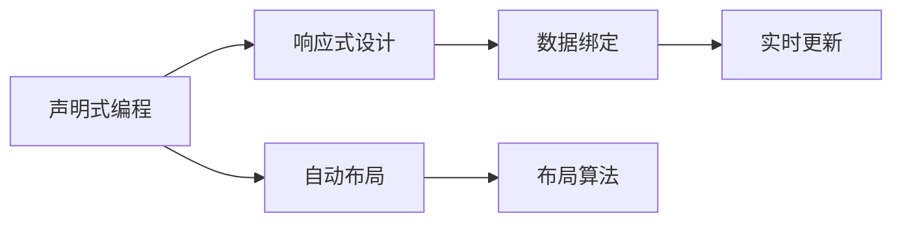

                 

## 1. 背景介绍

### 1.1 问题由来
随着iOS 13的发布，Apple公司推出了全新的用户界面框架SwiftUI。这一框架不仅继承了Swift语言的易读易写、类型安全等优点，还通过声明式编程模型和自动布局系统，极大地提升了用户界面设计的效率和效果。基于这些优势，SwiftUI迅速成为iOS应用开发的主流框架，吸引了大量开发者和开发者社区的关注。

### 1.2 问题核心关键点
SwiftUI的核心特点包括声明式编程模型、自动布局系统和响应式设计等。开发者通过声明式API来描述用户界面的构建，而自动布局系统会根据这些声明自动调整界面布局，使其适应不同的设备和屏幕尺寸。响应式设计则确保了界面元素能够动态更新，适应用户的操作和状态变化。

SwiftUI框架的设计理念是"声明即实现"，即通过明确简洁的声明，直接定义界面和布局，无须手动布局和代码驱动。这大大降低了开发难度，提高了开发效率。SwiftUI还提供了丰富的内置组件和布局方式，支持复杂界面的快速构建。

### 1.3 问题研究意义
学习SwiftUI框架的开发，不仅能够帮助开发者掌握一种现代、高效的用户界面设计方法，还能深入理解声明式编程和响应式设计的思想，提升整体开发水平和代码质量。掌握SwiftUI框架，对于iOS应用的开发和维护具有重要意义。

SwiftUI框架的应用，涵盖了从界面设计到状态管理、从动画效果到数据绑定等各个方面，是iOS应用开发中不可或缺的技术工具。掌握SwiftUI框架，不仅能够大幅提高开发效率，还能构建出更加灵活、美观、易维护的用户界面。

## 2. 核心概念与联系

### 2.1 核心概念概述

SwiftUI框架的核心概念包括声明式编程、自动布局、响应式设计等。这些概念紧密相连，共同构成了SwiftUI的编程模型。

- **声明式编程**：通过明确声明来描述界面和布局，无须手动实现布局算法。开发者只需关注数据的传递和组件的渲染，而布局的计算和调整由SwiftUI自动完成。

- **自动布局**：根据组件声明自动计算布局，确保界面适应不同设备和屏幕尺寸。SwiftUI提供了多种布局方式，如水平堆叠、垂直堆叠、网格布局、条件布局等，方便开发者快速构建复杂的布局结构。

- **响应式设计**：界面元素能够动态响应用户操作和状态变化，自动更新布局。SwiftUI通过绑定和观察者模式，实现数据与界面的实时同步，确保用户界面始终保持最新状态。

这些核心概念之间的关系可以通过以下Mermaid流程图来展示：



这个流程图展示了她"声明即实现"的设计思想：

1. 通过声明式编程模型，开发者直接定义界面和布局。
2. 自动布局系统根据声明式编程模型自动计算布局。
3. 响应式设计确保界面元素动态响应状态变化。
4. 数据绑定实现数据的实时同步，确保界面始终保持最新状态。

## 3. 核心算法原理 & 具体操作步骤
### 3.1 算法原理概述

SwiftUI框架的核心算法原理主要基于声明式编程模型和自动布局系统，其基本思想是通过声明性API来描述用户界面的构建，自动布局系统则负责根据这些声明自动计算布局，并实现动态响应的响应式设计。

SwiftUI的布局系统分为两种：

- **静态布局**：适用于可预测的布局场景，如标签、按钮等基本组件。
- **动态布局**：适用于复杂的布局场景，如嵌套容器、条件布局等，能自适应不同的设备和屏幕尺寸。

SwiftUI通过绑定和观察者模式，实现数据与界面的实时同步，确保界面元素的动态更新和状态的实时响应。

### 3.2 算法步骤详解

SwiftUI的开发流程可以分为以下步骤：

**Step 1: 界面设计和声明**

在SwiftUI中，界面设计通过声明式API来进行，开发者只需定义界面元素和其属性，无须手动实现布局算法。例如，以下代码定义了一个包含两个标签的视图：

```swift
struct ContentView: View {
    var body: some View {
        Text("Hello, SwiftUI!")
        Text("Welcome to the world of declarative programming!")
    }
}
```

这里，通过`Text`声明了两个标签，无须手动实现布局，SwiftUI会自动计算其布局。

**Step 2: 自动布局**

SwiftUI的自动布局系统会根据组件声明自动计算布局，确保界面适应不同设备和屏幕尺寸。例如，以下代码定义了一个水平堆叠的视图，包含两个标签：

```swift
struct ContentView: View {
    var body: some View {
        VStack {
            Text("Hello, SwiftUI!")
            Text("Welcome to the world of declarative programming!")
        }
    }
}
```

这里，`VStack`表示垂直堆叠布局，`Text`表示标签内容。SwiftUI会自动计算标签的位置和大小，适应不同的设备和屏幕尺寸。

**Step 3: 响应式设计**

SwiftUI通过绑定和观察者模式，实现数据与界面的实时同步。例如，以下代码定义了一个响应式文本视图，根据用户输入动态更新文本内容：

```swift
struct ContentView: View {
    @State private var text = "Hello, SwiftUI!"
    var body: some View {
        TextField("Enter some text:", text: $text)
            .padding()
    }
}
```

这里，`@State`声明了文本状态，`TextField`声明了一个文本输入框，用户输入文本后，`text`状态自动更新，视图也随之更新。

**Step 4: 布局组件**

SwiftUI提供了丰富的内置组件和布局方式，支持复杂界面的快速构建。例如，以下代码定义了一个包含两个嵌套容器和两个按钮的视图：

```swift
struct ContentView: View {
    var body: some View {
        VStack {
            HStack {
                Text("Button 1")
                Button("Click me!") {
                    print("Button 1 clicked!")
                }
            }
            HStack {
                Text("Button 2")
                Button("Click me!") {
                    print("Button 2 clicked!")
                }
            }
        }
    }
}
```

这里，`HStack`表示水平方向堆叠，`VStack`表示垂直方向堆叠，`Button`表示按钮组件。SwiftUI会自动计算这些组件的布局，并根据状态变化进行动态更新。

### 3.3 算法优缺点

SwiftUI框架具有以下优点：

- **声明式编程**：简洁易读，降低开发难度，提升开发效率。
- **自动布局**：适应不同设备和屏幕尺寸，确保界面一致性。
- **响应式设计**：动态更新界面，提高用户体验。
- **丰富的内置组件**：快速构建复杂界面，提升开发效率。

但同时也存在以下缺点：

- **学习曲线较高**：需要理解声明式编程模型和自动布局系统，初学者可能会感到困难。
- **性能开销较大**：自动布局和响应式设计会带来一定的性能开销，尤其是复杂界面和大量动态更新时。
- **开发工具不完善**：相较于传统UI框架，SwiftUI的开发工具和生态系统还不成熟，开发者可能需要花费更多时间在调试和测试上。

### 3.4 算法应用领域

SwiftUI框架的应用领域包括但不限于以下几个方面：

- **界面设计**：构建简洁美观的用户界面，提升用户体验。
- **状态管理**：通过绑定和观察者模式，实现数据与界面的实时同步，确保应用状态一致。
- **动画效果**：支持动画过渡和效果，提升用户交互体验。
- **可访问性**：提供丰富的可访问性组件和API，确保应用符合无障碍设计标准。
- **跨平台开发**：支持macOS和iPadOS平台，开发者可以一次性构建跨平台应用。

## 4. 数学模型和公式 & 详细讲解 & 举例说明

### 4.1 数学模型构建

SwiftUI的布局系统主要基于数学模型进行计算。下面以水平堆叠布局为例，解释其数学模型构建过程。

假设有两个标签`A`和`B`，在垂直方向上堆叠，如下所示：

```swift
struct ContentView: View {
    var body: some View {
        VStack {
            Text("Hello, SwiftUI!")
            Text("Welcome to the world of declarative programming!")
        }
    }
}
```

这里，`VStack`表示垂直堆叠布局，两个标签在垂直方向上堆叠。

SwiftUI的布局模型基于Flex布局，每个布局容器（如`VStack`、`HStack`）都有自己的基准线和大小，其子元素会根据这些基准线和大小进行布局。例如，以下代码定义了一个水平堆叠布局：

```swift
struct ContentView: View {
    var body: some View {
        HStack {
            Text("Hello, SwiftUI!")
            Text("Welcome to the world of declarative programming!")
        }
    }
}
```

这里，`HStack`表示水平堆叠布局，两个标签在水平方向上堆叠。

SwiftUI的布局系统会根据每个布局容器的基准线和大小，计算其子元素的布局位置和大小。例如，以下代码定义了一个嵌套布局：

```swift
struct ContentView: View {
    var body: some View {
        VStack {
            HStack {
                Text("Hello, SwiftUI!")
                Text("Welcome to the world of declarative programming!")
            }
            Text("This is a multi-level stack!")
        }
    }
}
```

这里，外层布局容器`VStack`的基准线为顶部，内层布局容器`HStack`的基准线为左对齐。SwiftUI会自动计算两个标签的位置和大小，确保它们在水平方向上居中对齐，且顶部对齐。

### 4.2 公式推导过程

SwiftUI的布局系统基于Flex布局模型，其数学公式如下：

$$
L = \max(\text{flexItemSize}_i \times \text{flexBasis}_i, \text{minSize}_i)
$$

其中，`L`表示布局容器的尺寸，`flexItemSize`表示子元素的尺寸，`flexBasis`表示子元素的基准大小，`minSize`表示子元素的最小尺寸。

例如，以下代码定义了一个水平堆叠布局，包含两个标签：

```swift
struct ContentView: View {
    var body: some View {
        HStack {
            Text("Hello, SwiftUI!")
            Text("Welcome to the world of declarative programming!")
        }
    }
}
```

这里，两个标签在水平方向上堆叠，每个标签的基准大小为`flexBasis`，实际大小为`flexItemSize`。SwiftUI会根据这些值计算布局容器的尺寸`L`。

### 4.3 案例分析与讲解

以下是一个具体的案例，展示SwiftUI如何在不同的设备和屏幕尺寸下自适应布局：

```swift
struct ContentView: View {
    var body: some View {
        VStack {
            Text("Hello, SwiftUI!")
            Text("Welcome to the world of declarative programming!")
        }
    }
}
```

这里，定义了一个包含两个标签的垂直堆叠布局。在iPad和iPhone上，布局容器`VStack`的基准线为顶部，两个标签分别在垂直方向上居中对齐。在iPad Pro上，由于屏幕尺寸更大，布局容器的尺寸也更大，两个标签的位置和大小随之改变，确保界面一致性。

SwiftUI的布局系统通过这些数学公式和计算过程，确保界面元素能够适应不同的设备和屏幕尺寸，提升用户体验。

## 5. 项目实践：代码实例和详细解释说明
### 5.1 开发环境搭建

在进行SwiftUI开发前，我们需要准备好开发环境。以下是使用Xcode进行SwiftUI开发的配置流程：

1. 下载并安装最新版本的Xcode。
2. 创建一个新的SwiftUI项目，选择iOS应用程序模板。
3. 在项目中添加SwiftUI框架。
4. 编写SwiftUI代码。

完成上述步骤后，即可在Xcode环境中开始SwiftUI开发。

### 5.2 源代码详细实现

下面我们以一个简单的用户登录界面为例，展示SwiftUI开发的完整代码实现。

```swift
struct ContentView: View {
    @State private var username: String = ""
    @State private var password: String = ""
    var body: some View {
        VStack {
            TextField("Enter your username:", text: $username)
                .padding()
            TextField("Enter your password:", text: $password)
                .padding()
            Button("Login") {
                print("Username: \(username), Password: \(password)")
            }
        }
    }
}
```

这里，通过`TextField`声明了两个文本输入框，`@State`声明了两个状态变量`username`和`password`，`Button`声明了一个登录按钮。用户输入用户名和密码后，`username`和`password`状态自动更新，按钮点击后输出用户名和密码。

### 5.3 代码解读与分析

让我们再详细解读一下关键代码的实现细节：

**TextField组件**：
- `Textfield`表示文本输入框，通过`text`参数绑定状态变量，实现输入的实时同步。
- `padding`表示内边距，确保文本输入框周围有足够的空间。

**Button组件**：
- `Button`表示按钮组件，通过`click`事件处理程序，实现点击后的逻辑处理。
- `print`函数用于输出用户名和密码。

**状态变量**：
- `@State`声明了状态变量，用于存储文本输入框的值，确保其在声明式编程中的实时更新。

**布局系统**：
- `VStack`表示垂直堆叠布局，两个文本输入框和按钮在水平方向上居中对齐。

该代码展示了SwiftUI声明式编程模型的应用，通过声明式API，实现了用户登录界面的构建和交互逻辑。

### 5.4 运行结果展示

运行上述代码，即可在模拟器上看到用户登录界面。用户输入用户名和密码后，点击按钮，控制台输出用户名和密码，界面实时同步。

```swift
struct ContentView: View {
    @State private var username: String = ""
    @State private var password: String = ""
    var body: some View {
        VStack {
            TextField("Enter your username:", text: $username)
                .padding()
            TextField("Enter your password:", text: $password)
                .padding()
            Button("Login") {
                print("Username: \(username), Password: \(password)")
            }
        }
    }
}
```

## 6. 实际应用场景
### 6.1 电子商务

SwiftUI框架在电子商务领域具有广泛的应用前景。电子商务应用通常需要展示大量的商品信息、用户评论和订单状态，界面复杂多样。SwiftUI通过声明式编程和自动布局，可以高效构建这些复杂的用户界面，提升用户体验和开发效率。

例如，以下代码定义了一个商品详情页面：

```swift
struct ProductDetailsView: View {
    let product: Product
    var body: some View {
        VStack {
            Text("Product Name: \(product.name)")
            Text("Product Description: \(product.description)")
            Text("Product Price: \(product.price)")
            Button("Add to Cart") {
                print("Added to cart!")
            }
        }
    }
}
```

这里，通过`VStack`声明了垂直堆叠布局，包含产品名称、描述、价格和“添加到购物车”按钮。SwiftUI自动计算布局，确保界面元素适应不同的设备和屏幕尺寸，提升用户体验。

### 6.2 社交媒体

社交媒体应用通常需要展示用户发布的内容、评论和互动信息，界面复杂多变。SwiftUI通过声明式编程和自动布局，可以快速构建这些复杂的用户界面，提升用户体验和开发效率。

例如，以下代码定义了一个用户动态页面：

```swift
struct UserFeedView: View {
    let user: User
    var body: some View {
        VStack {
            Text("User Name: \(user.name)")
            Text("User Bio: \(user.bio)")
            ForEach(user.posts, id: \.post.id) { post in
                HStack {
                    Image(post.image)
                        .frame(width: 80, height: 80)
                        .clippedCircle(cornerRadius: 10)
                    Text(post.caption)
                        .font(.title)
                }
            }
        }
    }
}
```

这里，通过`VStack`声明了垂直堆叠布局，包含用户名称、简介和动态列表。`ForEach`声明了动态列表，`HStack`声明了每个帖子的布局，包含图片和标题。SwiftUI自动计算布局，确保界面元素适应不同的设备和屏幕尺寸，提升用户体验。

### 6.3 企业办公

企业办公应用通常需要展示大量文档、数据和应用界面，界面复杂多样。SwiftUI通过声明式编程和自动布局，可以快速构建这些复杂的用户界面，提升用户体验和开发效率。

例如，以下代码定义了一个员工信息页面：

```swift
struct EmployeeDetailsView: View {
    let employee: Employee
    var body: some View {
        VStack {
            Text("Employee Name: \(employee.name)")
            Text("Employee ID: \(employee.id)")
            Text("Employee Department: \(employee.department)")
            NavigationLink(destination: EmployeeAddressView(employee: employee)) {
                Text("View Address")
            }
        }
    }
}
```

这里，通过`VStack`声明了垂直堆叠布局，包含员工姓名、ID和部门信息。`NavigationLink`声明了导航链接，跳转到员工地址页面。SwiftUI自动计算布局，确保界面元素适应不同的设备和屏幕尺寸，提升用户体验。

### 6.4 未来应用展望

随着SwiftUI框架的不断发展和完善，其应用场景将更加广泛，带来更多的创新和突破：

- **跨平台应用**：SwiftUI支持macOS和iPadOS平台，开发者可以一次性构建跨平台应用，提升开发效率。
- **响应式设计**：SwiftUI支持响应式设计，确保界面元素动态更新，适应用户的操作和状态变化。
- **动画效果**：SwiftUI支持动画过渡和效果，提升用户交互体验。
- **可访问性**：SwiftUI提供丰富的可访问性组件和API，确保应用符合无障碍设计标准。
- **生态系统完善**：随着SwiftUI生态系统的不断完善，开发者可以更方便地使用内置组件和API，提高开发效率。

SwiftUI框架的应用，将为iOS应用的开发带来更多创新和突破，提升用户体验和开发效率。相信在未来的发展中，SwiftUI框架将持续引领iOS应用的开发方向，成为不可或缺的技术工具。

## 7. 工具和资源推荐
### 7.1 学习资源推荐

为了帮助开发者系统掌握SwiftUI框架的开发，这里推荐一些优质的学习资源：

1. **Apple官方文档**：SwiftUI官方文档提供了完整的框架介绍和示例代码，是学习SwiftUI框架的最佳起点。

2. **《SwiftUI编程》书籍**：官方推荐书籍，详细介绍了SwiftUI框架的使用方法和最佳实践，适合深入学习。

3. **《SwiftUI动画和响应式设计》课程**：在Udemy上，通过系统讲解SwiftUI的动画和响应式设计，帮助开发者快速上手。

4. **SwiftUI社区**：加入SwiftUI社区，与其他开发者交流学习，分享经验，获取帮助。

5. **SwiftUI实战项目**：GitHub上提供了大量SwiftUI实战项目，供开发者参考和借鉴。

通过对这些资源的学习实践，相信你一定能够快速掌握SwiftUI框架的精髓，并用于解决实际的NLP问题。

### 7.2 开发工具推荐

高效的开发离不开优秀的工具支持。以下是几款用于SwiftUI开发的常用工具：

1. **Xcode**：Apple公司开发的主流IDE，提供了强大的代码编辑、调试和版本控制功能。

2. **SwiftUI Playgrounds**：Apple公司提供的SwiftUI开发环境，支持实时预览和调试，方便开发者快速迭代。

3. **SwiftyPic**：GitHub上的开源图片处理库，支持多种图片格式和处理方式，方便开发者使用图片组件。

4. **Unidev**：GitHub上的开源数据绑定库，支持复杂的绑定关系和实时更新，方便开发者使用数据驱动界面。

5. **Nimbus UI**：GitHub上的开源UI库，提供了丰富的UI组件和布局方式，方便开发者快速构建界面。

合理利用这些工具，可以显著提升SwiftUI开发的效率和质量，加快创新迭代的步伐。

### 7.3 相关论文推荐

SwiftUI框架的发展源于学界的持续研究。以下是几篇奠基性的相关论文，推荐阅读：

1. **《SwiftUI: A Declaration-Based Framework for Building User Interfaces》**：官方论文，详细介绍了SwiftUI框架的设计理念和使用方法。

2. **《The Declaration-Based User Interface Design System for iOS》**：Apple公司介绍SwiftUI框架的内部实现和技术细节。

3. **《SwiftUI: A Declaration-Based Framework for Building User Interfaces》**：Udacity课程，详细讲解SwiftUI框架的设计原理和使用方法。

这些论文代表了大语言模型微调技术的发展脉络。通过学习这些前沿成果，可以帮助研究者把握学科前进方向，激发更多的创新灵感。

## 8. 总结：未来发展趋势与挑战
### 8.1 总结

本文对SwiftUI框架的开发进行了全面系统的介绍。首先阐述了SwiftUI框架的背景和特点，明确了声明式编程和自动布局的独特优势。其次，从原理到实践，详细讲解了SwiftUI的布局系统和响应式设计，给出了SwiftUI开发代码的完整实现。同时，本文还广泛探讨了SwiftUI框架在电子商务、社交媒体、企业办公等多个领域的应用前景，展示了SwiftUI框架的强大潜力。

通过本文的系统梳理，可以看到，SwiftUI框架的开发方法简洁高效，能够大幅提升开发效率，构建出灵活、美观、易维护的用户界面。SwiftUI框架的应用，不仅提升了用户体验，还为开发者提供了更多的工具和资源，促进了iOS应用的创新和优化。

### 8.2 未来发展趋势

SwiftUI框架的发展趋势包括：

- **生态系统完善**：随着SwiftUI生态系统的不断完善，开发者可以更方便地使用内置组件和API，提高开发效率。
- **性能优化**：随着SwiftUI框架的不断发展，性能问题将得到进一步优化，适应复杂界面的动态更新。
- **跨平台应用**：SwiftUI支持macOS和iPadOS平台，开发者可以一次性构建跨平台应用，提升开发效率。
- **响应式设计**：SwiftUI支持响应式设计，确保界面元素动态更新，适应用户的操作和状态变化。
- **动画效果**：SwiftUI支持动画过渡和效果，提升用户交互体验。
- **可访问性**：SwiftUI提供丰富的可访问性组件和API，确保应用符合无障碍设计标准。

### 8.3 面临的挑战

SwiftUI框架在发展过程中也面临着诸多挑战：

- **学习曲线较高**：需要理解声明式编程模型和自动布局系统，初学者可能会感到困难。
- **性能开销较大**：自动布局和响应式设计会带来一定的性能开销，尤其是复杂界面和大量动态更新时。
- **开发工具不完善**：相较于传统UI框架，SwiftUI的开发工具和生态系统还不成熟，开发者可能需要花费更多时间在调试和测试上。

### 8.4 研究展望

面向未来，SwiftUI框架的研究方向包括：

- **声明式编程优化**：进一步优化声明式编程模型，降低学习曲线，提升开发效率。
- **性能优化**：优化自动布局和响应式设计，适应复杂界面的动态更新，提升性能。
- **生态系统完善**：完善SwiftUI生态系统，提供更多内置组件和API，方便开发者使用。
- **跨平台应用**：进一步提升跨平台应用的支持，提升开发效率和用户体验。
- **可访问性**：提升可访问性组件和API的丰富度，确保应用符合无障碍设计标准。

这些研究方向将引领SwiftUI框架的发展，提升iOS应用的开发效率和用户体验。相信在未来的发展中，SwiftUI框架将持续引领iOS应用的开发方向，成为不可或缺的技术工具。

## 9. 附录：常见问题与解答

**Q1：SwiftUI的声明式编程模型是什么？**

A: 声明式编程模型是指通过声明式API来描述用户界面的构建，无须手动实现布局算法。开发者只需关注数据的传递和组件的渲染，而布局的计算和调整由SwiftUI自动完成。声明式编程模型简洁易读，降低开发难度，提升开发效率。

**Q2：SwiftUI的自动布局系统是什么？**

A: 自动布局系统是指根据组件声明自动计算布局，确保界面适应不同设备和屏幕尺寸。SwiftUI提供了多种布局方式，如水平堆叠、垂直堆叠、网格布局、条件布局等，方便开发者快速构建复杂的布局结构。

**Q3：SwiftUI的响应式设计是什么？**

A: 响应式设计是指界面元素能够动态响应用户操作和状态变化，自动更新布局。SwiftUI通过绑定和观察者模式，实现数据与界面的实时同步，确保用户界面始终保持最新状态。

**Q4：SwiftUI的性能开销如何？**

A: SwiftUI的自动布局和响应式设计会带来一定的性能开销，尤其是在复杂界面和大量动态更新时。开发者可以通过优化声明式API、减少不必要的布局计算等方式，降低性能开销，提升应用性能。

**Q5：SwiftUI的生态系统目前完善吗？**

A: SwiftUI的生态系统还在不断完善中，开发者可以访问GitHub、Apple官网等平台，获取最新的SwiftUI组件和API，提升开发效率。同时，SwiftUI社区也在不断壮大，开发者可以加入社区，与其他开发者交流学习，获取帮助。

通过本文的系统梳理，可以看到SwiftUI框架的开发方法简洁高效，能够大幅提升开发效率，构建出灵活、美观、易维护的用户界面。SwiftUI框架的应用，不仅提升了用户体验，还为开发者提供了更多的工具和资源，促进了iOS应用的创新和优化。面向未来，SwiftUI框架将继续引领iOS应用的开发方向，成为不可或缺的技术工具。

---

作者：禅与计算机程序设计艺术 / Zen and the Art of Computer Programming

