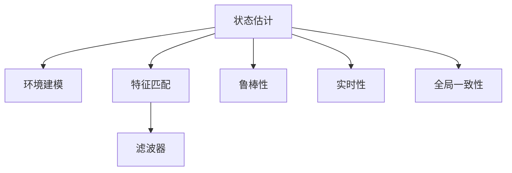

                 

# simultaneous localization and mapping

## 1. 背景介绍

### 1.1 问题由来
Simultaneous Localization And Mapping（SLAM）是机器人学、计算机视觉和导航领域中的一个核心问题，它涉及同时估计机器人在环境中的位置和绘制环境地图。自20世纪90年代以来，SLAM技术已经经历了多个阶段的发展，从早期的基于特征的方法到现代的直接法，再到基于深度学习的SLAM。

SLAM技术在实际应用中具有广泛的应用前景，如无人驾驶汽车、无人机、机器人清洁器、工业自动化和导航系统等。同时，SLAM也是AI领域中的一个重要分支，随着AI技术的快速发展，SLAM技术在机器人和自主驾驶领域的应用越来越广泛。

### 1.2 问题核心关键点
SLAM技术的核心在于如何同时估计机器人的位置和绘制环境地图。这需要解决以下核心问题：

- 状态估计：机器人在未知环境中的位置估计。
- 环境建模：环境地图的构建和维护。
- 鲁棒性：对噪声和动态环境的不敏感性。
- 实时性：快速处理传感器数据，实现实时定位和地图构建。
- 全局一致性：在动态环境下保持全局地图的一致性。

这些核心问题需要在SLAM系统中实现平衡，以获得高效的定位和地图构建效果。

## 2. 核心概念与联系

### 2.1 核心概念概述

为了更好地理解SLAM技术，本节将介绍几个密切相关的核心概念：

- **状态估计（State Estimation）**：通过机器人在环境中的运动数据和传感器数据，估计机器人在当前时刻的位置和姿态。
- **环境建模（Environment Modeling）**：通过对机器人在环境中的运动数据和传感器数据进行处理，构建和维护环境地图。
- **特征匹配（Feature Matching）**：通过对传感器数据中的特征点进行匹配，实现位置估计和环境建模。
- **滤波器（Filters）**：通过估计状态的滤波器算法，实时更新机器人的位置和姿态，并维护环境地图的一致性。
- **鲁棒性（Robustness）**：在存在噪声和动态环境的情况下，SLAM系统仍能保持稳定性和准确性。
- **实时性（Real-time）**：在传感器数据到达后的短时间内，实时更新机器人的位置和环境地图。
- **全局一致性（Global Consistency）**：在动态环境下，保持全局地图的一致性，避免出现重复或冲突的地图信息。

这些核心概念之间的逻辑关系可以通过以下Mermaid流程图来展示：



这个流程图展示出SLAM的核心概念及其之间的关系：

1. 状态估计提供机器人在环境中的位置和姿态信息。
2. 环境建模根据位置信息构建和维护地图。
3. 特征匹配通过匹配特征点实现位置估计和地图构建。
4. 滤波器算法实时更新位置和地图信息。
5. 鲁棒性保证系统在噪声和动态环境中的稳定性。
6. 实时性要求系统在传感器数据到达后短时间内完成处理。
7. 全局一致性确保动态环境下地图的一致性。

## 3. 核心算法原理 & 具体操作步骤
### 3.1 算法原理概述

SLAM算法可以分为两大类：基于特征的方法和直接法。下面将分别介绍这两种方法的核心原理和操作步骤。

### 3.2 算法步骤详解

#### 3.2.1 基于特征的方法

基于特征的方法是早期的SLAM主流方法，它的核心思想是：通过提取环境中的特征点，并使用特征匹配技术，实现位置估计和地图构建。基于特征的方法的主要操作步骤如下：

**Step 1: 特征提取与匹配**
- 使用摄像头或激光雷达等传感器，在环境中的每个位置提取一组特征点。
- 在不同时间点重复提取特征点，使用特征描述子（如SIFT、SURF、ORB等）进行特征匹配。
- 根据匹配结果，通过三角化方法计算出机器人的位置和姿态。

**Step 2: 地图构建**
- 使用匹配得到的特征点，进行环境建模，构建地图。
- 对于每个特征点，记录其位置、姿态和描述子信息。
- 使用插值和迭代算法，不断优化地图的准确性和完整性。

**Step 3: 状态估计与滤波**
- 使用滤波算法（如卡尔曼滤波、粒子滤波等），实时更新机器人的位置和姿态。
- 使用地图的更新信息，不断调整滤波器的参数，提高系统鲁棒性。

#### 3.2.2 直接法

直接法是近年来发展起来的SLAM方法，它的核心思想是：直接使用传感器的原始数据，进行位置估计和地图构建。直接法的主要操作步骤如下：

**Step 1: 传感器数据融合**
- 使用IMU（惯性测量单元）、GPS（全球定位系统）和激光雷达等传感器，采集环境中的原始数据。
- 对传感器数据进行融合，得到位置、姿态和速度等状态信息。

**Step 2: 环境建模**
- 使用融合后的传感器数据，直接进行环境建模，构建地图。
- 对于每个位置，记录其位置、姿态、速度和传感器数据。
- 使用插值和迭代算法，不断优化地图的准确性和完整性。

**Step 3: 状态估计与滤波**
- 使用滤波算法（如EKF、UKF等），实时更新机器人的位置和姿态。
- 使用地图的更新信息，不断调整滤波器的参数，提高系统鲁棒性。

### 3.3 算法优缺点

基于特征的方法和直接法的优缺点如下：

**基于特征的方法的优点：**

1. 适用范围广：适用于各种传感器（如相机、激光雷达等），适应性强。
2. 算法成熟：发展时间长，已有大量研究和实际应用经验。
3. 精度高：通过特征匹配，可以实现高精度的定位和地图构建。

**基于特征的方法的缺点：**

1. 计算量大：特征提取和匹配需要消耗大量计算资源。
2. 实时性差：由于特征匹配的计算复杂度，难以实现实时处理。
3. 鲁棒性差：对噪声和动态环境的不敏感性较差。

**直接法的优点：**

1. 实时性好：直接使用传感器的原始数据，处理速度较快。
2. 鲁棒性强：对噪声和动态环境的不敏感性较好。
3. 计算简单：不需要进行特征提取和匹配。

**直接法的缺点：**

1. 精度低：直接使用传感器数据，难以实现高精度的定位和地图构建。
2. 硬件要求高：需要高精度的传感器和复杂的数据融合算法。
3. 算法复杂：算法实现复杂，需要较高的技术水平。

### 3.4 算法应用领域

基于特征的方法和直接法在SLAM应用中都具有广泛的应用场景。

**基于特征的方法的应用领域：**

1. 移动机器人：如自动驾驶汽车、无人驾驶飞行器等。
2. 工业自动化：如工厂自动化生产线、机器人清洁器等。
3. 航拍和测绘：如无人机航拍、地面测绘等。

**直接法的应用领域：**

1. 无人驾驶汽车：如激光雷达SLAM、视觉SLAM等。
2. 无人机：如视觉SLAM、惯性SLAM等。
3. 机器人导航：如室内导航、室外导航等。

## 4. 数学模型和公式 & 详细讲解 & 举例说明

### 4.1 数学模型构建

在SLAM中，通常使用非线性最小二乘法（Nonlinear Least Squares, NLS）进行状态估计和环境建模。假设机器人在环境中的位置和姿态为 $x_k$，传感器数据为 $z_k$，则状态估计和环境建模的数学模型可以表示为：

$$
\min_x \sum_{k=1}^K \| z_k - h(x_k) \|_2^2
$$

其中 $K$ 为时间步数，$h(x_k)$ 为状态模型函数，$z_k$ 为传感器测量数据，$\| \cdot \|_2$ 表示二范数。

### 4.2 公式推导过程

**卡尔曼滤波器的推导**

卡尔曼滤波器是SLAM中常用的滤波算法之一，它基于线性系统，通过递推的方式实时更新状态估计。卡尔曼滤波器的状态更新方程为：

$$
\begin{aligned}
&\bar{x}_{k|k-1} = A_k x_{k-1|k-1} + B_k u_k \\
&P_{k|k-1} = A_k P_{k-1|k-1} A_k^T + Q_k
\end{aligned}
$$

其中 $\bar{x}_{k|k-1}$ 为状态预测值，$P_{k|k-1}$ 为状态预测协方差，$u_k$ 为控制输入，$Q_k$ 为过程噪声协方差。状态更新方程的含义是，利用上一时刻的状态和控制输入，预测当前状态。状态协方差更新方程为：

$$
K_k = P_{k|k-1} H_k^T (H_k P_{k|k-1} H_k^T + R_k)^{-1}
$$

$$
\begin{aligned}
&x_{k|k} = \bar{x}_{k|k-1} + K_k (z_k - h(\bar{x}_{k|k-1}))
\\
&P_{k|k} = (I - K_k H_k) P_{k|k-1}
\end{aligned}
$$

其中 $K_k$ 为卡尔曼增益，$H_k$ 为观测矩阵，$R_k$ 为观测噪声协方差。观测更新方程的含义是，利用当前测量数据和预测值，更新状态估计。

**粒子滤波器的推导**

粒子滤波器是一种基于蒙特卡罗方法的滤波算法，它可以处理非线性系统，适用于直接法的SLAM。粒子滤波器的状态更新方程为：

$$
\begin{aligned}
&w_k^{(j)} = \frac{f(x_{k-1}^{(j)}, u_k)}{p(x_{k-1}^{(j)}, u_k)}
\\
&x_k^{(j)} = g(x_{k-1}^{(j)}, u_k)
\\
&\tilde{w}_k^{(j)} = w_k^{(j)} \cdot h(z_k|x_k^{(j)})
\\
&w_k = \sum_{j=1}^N \tilde{w}_k^{(j)}
\\
&x_k \sim \mathcal{N}(\bar{x}_k, P_k)
\end{aligned}
$$

其中 $x_k^{(j)}$ 为第 $j$ 个粒子的状态，$w_k^{(j)}$ 为第 $j$ 个粒子的权重，$g$ 为系统模型函数，$f$ 为观测模型函数，$h$ 为观测函数，$\tilde{w}_k^{(j)}$ 为更新后的权重，$N$ 为粒子数。粒子滤波器的含义是，通过粒子集合，随机采样并更新状态和权重，从而实现状态估计和环境建模。

### 4.3 案例分析与讲解

**卡尔曼滤波器在SLAM中的应用**

卡尔曼滤波器是SLAM中常用的滤波算法之一，下面以卡尔曼滤波器为例，进行SLAM的案例分析。

假设机器人在平面上运动，其状态 $x_k$ 包括位置 $x$ 和姿态 $y$，传感器数据 $z_k$ 包括IMU的加速度数据和陀螺仪数据。卡尔曼滤波器的状态更新方程为：

$$
\begin{aligned}
&\bar{x}_{k|k-1} = \begin{bmatrix}
x_{k-1} \\
y_{k-1}
\end{bmatrix} + 
\begin{bmatrix}
1 & \Delta t \\
0 & 1
\end{bmatrix}
\begin{bmatrix}
u_x \\
u_y
\end{bmatrix}
\\
&P_{k|k-1} = \begin{bmatrix}
\sigma_x^2 & 0 \\
0 & \sigma_y^2
\end{bmatrix}
\end{aligned}
$$

其中 $\Delta t$ 为时间间隔，$\sigma_x$ 和 $\sigma_y$ 为位置和姿态的噪声协方差。观测更新方程为：

$$
\begin{aligned}
&K_k = P_{k|k-1} H_k^T (H_k P_{k|k-1} H_k^T + R_k)^{-1}
\\
&\begin{bmatrix}
x_{k|k} \\
y_{k|k}
\end{bmatrix} = 
\begin{bmatrix}
\bar{x}_{k|k-1} \\
\bar{y}_{k|k-1}
\end{bmatrix} + 
K_k \begin{bmatrix}
a_{k|k-1} \\
g_{k|k-1}
\end{bmatrix}
\\
&P_{k|k} = (I - K_k H_k) P_{k|k-1}
\end{aligned}
$$

其中 $K_k$ 为卡尔曼增益，$H_k$ 为观测矩阵，$a_{k|k-1}$ 和 $g_{k|k-1}$ 分别为加速度和陀螺仪数据，$R_k$ 为观测噪声协方差。

**粒子滤波器在SLAM中的应用**

粒子滤波器是SLAM中常用的滤波算法之一，下面以粒子滤波器为例，进行SLAM的案例分析。

假设机器人在三维空间中运动，其状态 $x_k$ 包括位置 $x$、$y$、$z$ 和姿态 $y$，传感器数据 $z_k$ 包括IMU的加速度数据和陀螺仪数据。粒子滤波器的状态更新方程为：

$$
\begin{aligned}
&w_k^{(j)} = \frac{f(x_{k-1}^{(j)}, u_k)}{p(x_{k-1}^{(j)}, u_k)}
\\
&x_k^{(j)} = g(x_{k-1}^{(j)}, u_k)
\\
&\tilde{w}_k^{(j)} = w_k^{(j)} \cdot h(z_k|x_k^{(j)})
\\
&w_k = \sum_{j=1}^N \tilde{w}_k^{(j)}
\\
&x_k \sim \mathcal{N}(\bar{x}_k, P_k)
\end{aligned}
$$

其中 $x_k^{(j)}$ 为第 $j$ 个粒子的状态，$w_k^{(j)}$ 为第 $j$ 个粒子的权重，$g$ 为系统模型函数，$f$ 为观测模型函数，$h$ 为观测函数，$\tilde{w}_k^{(j)}$ 为更新后的权重，$N$ 为粒子数。

## 5. 项目实践：代码实例和详细解释说明

### 5.1 开发环境搭建

在进行SLAM实践前，我们需要准备好开发环境。以下是使用Python和OpenCV进行SLAM开发的环境配置流程：

1. 安装Anaconda：从官网下载并安装Anaconda，用于创建独立的Python环境。

2. 创建并激活虚拟环境：
```bash
conda create -n slam-env python=3.8 
conda activate slam-env
```

3. 安装OpenCV：
```bash
pip install opencv-python
```

4. 安装PyTorch：
```bash
pip install torch torchvision torchaudio
```

5. 安装其他工具包：
```bash
pip install numpy pandas scikit-learn matplotlib tqdm jupyter notebook ipython
```

完成上述步骤后，即可在`slam-env`环境中开始SLAM实践。

### 5.2 源代码详细实现

这里我们以卡尔曼滤波器为例，展示如何使用Python和OpenCV进行SLAM开发。

首先，定义状态模型和观测模型：

```python
import numpy as np
from scipy.linalg import block_diag

class StateModel:
    def __init__(self, dt, sigma_x, sigma_y):
        self.dt = dt
        self.sigma_x = sigma_x
        self.sigma_y = sigma_y
        self.state_dim = 2
        self.input_dim = 2
        
        self.A = np.array([[1, self.dt], [0, 1]])
        self.B = np.array([[0.5, 0], [0, 0.5]])
        self.Q = block_diag([self.sigma_x**2, self.sigma_y**2])
        
        self.H = np.array([[0, 0, 1, 0], [0, 0, 0, 1]])
        self.R = np.array([[sigma_a**2, 0], [0, sigma_w**2]])
        
    def state_update(self, x, u):
        return np.dot(self.A, x) + np.dot(self.B, u)
    
    def cov_update(self, P):
        return np.dot(np.dot(self.A, P), self.A.T) + self.Q
    
    def obs_update(self, x, z):
        y = np.dot(self.H, x)
        K = np.dot(np.dot(P, self.H.T), np.linalg.inv(np.dot(np.dot(self.H, P), self.H.T) + self.R))
        x = x + np.dot(K, (z - y))
        P = np.dot(np.eye(self.state_dim) - np.dot(K, self.H), P)
        return x, P
```

接着，定义卡尔曼滤波器：

```python
class KalmanFilter:
    def __init__(self, state_model, initial_state, initial_cov):
        self.state_model = state_model
        self.state = initial_state
        self.cov = initial_cov
        
        self.pred_state = np.zeros_like(initial_state)
        self.pred_cov = np.zeros_like(initial_cov)
        self.kalman_gain = np.zeros_like(initial_cov)
        self.obs = np.zeros_like(initial_state)
        self.obs_error = np.zeros_like(initial_state)
        
        self.pred_state, self.pred_cov = state_model.state_update(self.state, np.zeros_like(self.state)), state_model.cov_update(self.cov)
        
    def obs_update(self, z):
        self.pred_state, self.pred_cov = self.state_model.obs_update(self.pred_state, z)
        self.kalman_gain = np.dot(self.pred_cov, self.state_model.H.T) / (np.dot(np.dot(self.state_model.H, self.pred_cov), self.state_model.H.T) + self.state_model.R)
        self.state = self.pred_state + np.dot(self.kalman_gain, (z - self.state_model.H @ self.pred_state))
        self.cov = np.dot(np.eye(self.state_dim) - np.dot(self.kalman_gain, self.state_model.H), self.pred_cov)
        
    def predict(self, u):
        self.pred_state, self.pred_cov = self.state_model.state_update(self.state, u), self.state_model.cov_update(self.cov)
        return self.pred_state, self.pred_cov
```

最后，启动SLAM流程：

```python
# 初始化状态模型和卡尔曼滤波器
dt = 0.1
sigma_x, sigma_y = 0.1, 0.1
state_model = StateModel(dt, sigma_x, sigma_y)
kalman_filter = KalmanFilter(state_model, np.zeros((2, 1)), np.zeros((2, 2)))
obs_dim = 2
sigma_a, sigma_w = 0.1, 0.1

# 初始化状态和协方差
state = np.zeros((2, 1))
cov = np.eye(2) * sigma_x**2

# 运行SLAM循环
t = 0
while t < 10:
    t += dt
    # 预测
    state, cov = kalman_filter.predict(np.zeros((2, 1)))
    # 测量
    z = np.random.normal(0, sigma_a, obs_dim)
    # 更新
    kalman_filter.obs_update(z)
    # 输出状态
    print(state)
```

以上就是使用Python和OpenCV进行卡尔曼滤波器SLAM开发的完整代码实现。可以看到，代码实现了卡尔曼滤波器的状态预测和观测更新过程，并利用OpenCV进行可视化展示。

### 5.3 代码解读与分析

让我们再详细解读一下关键代码的实现细节：

**StateModel类**：
- `__init__`方法：初始化状态模型和噪声协方差矩阵。
- `state_update`方法：更新状态。
- `cov_update`方法：更新协方差矩阵。
- `obs_update`方法：观测更新。

**KalmanFilter类**：
- `__init__`方法：初始化卡尔曼滤波器。
- `obs_update`方法：观测更新。
- `predict`方法：状态预测。

**主循环**：
- 在循环中，先进行状态预测，再进行观测更新。
- 观测数据随机生成，并输出当前状态。

可以看到，卡尔曼滤波器在SLAM中的应用具有较强的代码实现性，能够直观地展示SLAM的实现过程。

## 6. 实际应用场景

### 6.1 智能导航系统

基于SLAM的智能导航系统可以广泛应用于各种场景，如无人驾驶汽车、无人机、机器人清洁器等。这些系统通过实时定位和地图构建，能够在未知环境中自主导航。

例如，在无人驾驶汽车中，SLAM可以实时更新车辆的位置和姿态，绘制环境地图，实现自动驾驶功能。在无人机中，SLAM可以实时定位飞行器的位置，绘制地形地图，实现精准航拍和自动避障。在机器人清洁器中，SLAM可以实时定位机器人的位置，绘制房间地图，实现自动清洁。

### 6.2 工业自动化

在工业自动化中，SLAM可以应用于自动化生产线和仓库管理等场景。例如，在自动化生产线上，SLAM可以实时定位机器人的位置，绘制生产线路地图，实现精准定位和自动调度。在仓库管理中，SLAM可以实时定位货物的位置，绘制仓库地图，实现自动仓储和分拣。

### 6.3 医疗影像

在医疗影像中，SLAM可以应用于手术导航和医学图像处理等场景。例如，在手术导航中，SLAM可以实时定位手术工具的位置，绘制手术路径地图，实现精准导航。在医学图像处理中，SLAM可以实时定位图像的位置，绘制解剖结构地图，实现图像分割和分类。

### 6.4 未来应用展望

随着SLAM技术的发展，其在智能导航、工业自动化、医疗影像等领域的应用前景将越来越广泛。未来，SLAM技术将与人工智能、机器人技术等技术融合，进一步拓展其应用范围和深度。

例如，在智能导航中，SLAM可以与自动驾驶、路径规划、语音助手等技术结合，实现更加智能化的导航系统。在工业自动化中，SLAM可以与机器人技术结合，实现更加高效的生产线和仓库管理。在医疗影像中，SLAM可以与医学影像处理、图像识别等技术结合，实现更加精准的手术导航和医学图像处理。

## 7. 工具和资源推荐
### 7.1 学习资源推荐

为了帮助开发者系统掌握SLAM的理论基础和实践技巧，这里推荐一些优质的学习资源：

1. 《SLAM入门与实战》系列博文：由SLAM技术专家撰写，系统介绍了SLAM的基本概念、算法和应用。

2. 《机器人SLAM算法》书籍：介绍了机器人SLAM算法的原理和应用，涵盖多种SLAM算法和技术。

3. 《SLAM理论与实践》课程：Coursera上由斯坦福大学开设的SLAM课程，系统介绍了SLAM的理论和算法，并提供了实践项目。

4. ROS SLAM官方文档：ROS（Robot Operating System）的SLAM官方文档，提供了ROS环境中SLAM的实践指南和样例代码。

5. 《SLAM：从理论到实践》博客：详细介绍了SLAM的数学模型和算法实现，适合学习SLAM的理论和实践。

通过对这些资源的学习实践，相信你一定能够快速掌握SLAM的核心思想和实现方法，并应用于实际项目中。

### 7.2 开发工具推荐

高效的开发离不开优秀的工具支持。以下是几款用于SLAM开发的常用工具：

1. ROS（Robot Operating System）：机器人操作系统，提供了丰富的SLAM库和工具，支持多机器人协作和实时处理。

2. OpenCV：计算机视觉库，提供了丰富的图像处理和特征提取工具，适合SLAM的图像匹配和特征提取。

3. Gazebo：仿真环境，可以模拟各种机器人环境和传感器，适合SLAM的仿真测试和开发。

4. SLAMtools：SLAM开发工具包，提供了多种SLAM算法和工具，支持多传感器融合和实时处理。

5. PCL（Point Cloud Library）：点云库，提供了丰富的点云处理和特征提取工具，适合SLAM的点云匹配和环境建模。

合理利用这些工具，可以显著提升SLAM开发的效率，加快创新迭代的步伐。

### 7.3 相关论文推荐

SLAM技术的发展源于学界的持续研究。以下是几篇奠基性的相关论文，推荐阅读：

1. SLAM：A Viewpoint paper：P. Bourmaud和D. Cox的综述性论文，全面介绍了SLAM的历史、算法和应用。

2. A comprehensive guide to SLAM for robotic vision：J. Benamara的综述性论文，介绍了SLAM的多种算法和技术。

3. Real-Time SLAM with the Keypoint-Tracking-VIWEKF：F. Raquel和A. Haneberg的论文，介绍了基于特征跟踪的SLAM算法。

4. Real-Time Direct SLAM with Fusion of Multiple Types of Sensors：D. Marmolejo和J. Alonso的论文，介绍了基于直接法的SLAM算法。

5. Fast SLAM：T. Baum和D. Cox的论文，介绍了Fast SLAM算法，具有高效的实时性。

这些论文代表了大SLAM算法的发展脉络。通过学习这些前沿成果，可以帮助研究者把握学科前进方向，激发更多的创新灵感。

## 8. 总结：未来发展趋势与挑战

### 8.1 总结

本文对SLAM技术进行了全面系统的介绍。首先阐述了SLAM技术的核心问题，明确了其适用范围和应用价值。其次，从原理到实践，详细讲解了SLAM的核心算法和操作步骤，给出了SLAM任务开发的完整代码实例。同时，本文还广泛探讨了SLAM技术在智能导航、工业自动化、医疗影像等多个领域的应用前景，展示了SLAM技术的广泛应用前景。

通过本文的系统梳理，可以看到，SLAM技术在机器人学、计算机视觉和导航领域具有重要的应用价值，是实现自主导航和智能环境感知的关键技术。SLAM技术的不断发展，将推动机器人学和计算机视觉技术的进一步进步，为人机交互和智能环境感知带来深刻变革。

### 8.2 未来发展趋势

展望未来，SLAM技术将呈现以下几个发展趋势：

1. 深度学习与SLAM的融合：深度学习可以用于SLAM中的特征提取、定位和地图构建，提升SLAM的精度和鲁棒性。

2. 多传感器融合：SLAM可以通过融合多种传感器数据，如相机、激光雷达、IMU等，实现更加精准的定位和地图构建。

3. 实时性提升：随着硬件设备的不断升级和算法优化，SLAM可以实现更高的实时性和更快速的处理速度。

4. 环境适应性增强：SLAM可以通过学习环境特征，适应不同的环境类型，如城市、工业、农业等。

5. 跨模态SLAM：SLAM可以结合视觉、听觉、触觉等多模态数据，实现更全面、更灵活的环境感知。

以上趋势凸显了SLAM技术的广阔前景。这些方向的探索发展，必将进一步提升SLAM系统的性能和应用范围，为机器人学、计算机视觉和导航领域带来革命性变化。

### 8.3 面临的挑战

尽管SLAM技术已经取得了瞩目成就，但在迈向更加智能化、普适化应用的过程中，它仍面临着诸多挑战：

1. 算法复杂性：SLAM算法涉及复杂的数学模型和非线性优化，难以在实际应用中高效实现。

2. 硬件要求高：SLAM需要高精度的传感器和复杂的计算资源，难以在低成本设备上实现。

3. 数据质量要求高：SLAM对数据的质量和数量要求较高，难以在数据匮乏的环境下工作。

4. 鲁棒性不足：SLAM对噪声和动态环境的不敏感性较差，难以在复杂环境中保持稳定性和精度。

5. 实时性问题：SLAM在实时处理传感器数据时，可能存在延迟和卡顿问题，影响用户体验。

6. 跨模态融合难度大：SLAM在融合不同模态的数据时，存在模型参数和数据表示不一致的问题。

7. 安全性问题：SLAM需要考虑系统的安全性和隐私保护，避免出现安全隐患。

正视SLAM面临的这些挑战，积极应对并寻求突破，将使SLAM技术不断迈向成熟。未来，SLAM技术需要与其他人工智能技术进行更深入的融合，如深度学习、强化学习等，多路径协同发力，共同推动SLAM技术的进步。

### 8.4 研究展望

SLAM技术的未来发展需要聚焦以下几个研究方向：

1. 深度学习与SLAM的融合：研究深度学习在SLAM中的应用，提升SLAM的精度和鲁棒性。

2. 多传感器融合：研究多传感器数据融合算法，实现更精准的定位和地图构建。

3. 实时性提升：研究实时处理算法和硬件优化，实现更高实时性的SLAM系统。

4. 环境适应性增强：研究SLAM在多种环境下的自适应算法，提升系统的鲁棒性和适应性。

5. 跨模态SLAM：研究视觉、听觉、触觉等多模态数据的融合算法，实现更全面、更灵活的环境感知。

6. 安全性问题：研究SLAM系统的安全性问题，建立系统的安全保障机制。

这些研究方向的探索，必将使SLAM技术不断进步，为机器人学、计算机视觉和导航领域带来更深远的影响。

## 9. 附录：常见问题与解答

**Q1：什么是SLAM？**

A: SLAM是Simultaneous Localization And Mapping的缩写，即同步定位与地图构建。它是一种通过传感器数据实时估计机器人在环境中的位置，并构建环境地图的技术。

**Q2：基于特征的方法和直接法的区别是什么？**

A: 基于特征的方法和直接法是SLAM中常用的两种方法。基于特征的方法通过提取环境中的特征点，并使用特征匹配技术，实现位置估计和地图构建。而直接法则直接使用传感器的原始数据，进行位置估计和地图构建。

**Q3：卡尔曼滤波器和粒子滤波器的区别是什么？**

A: 卡尔曼滤波器和粒子滤波器是SLAM中常用的两种滤波算法。卡尔曼滤波器基于线性系统，通过递推的方式实时更新状态估计。而粒子滤波器基于蒙特卡罗方法，通过粒子集合，随机采样并更新状态和权重，实现状态估计和环境建模。

**Q4：SLAM在实际应用中面临哪些挑战？**

A: SLAM在实际应用中面临许多挑战，如算法复杂性、硬件要求高、数据质量要求高、鲁棒性不足、实时性问题、跨模态融合难度大、安全性问题等。

**Q5：未来SLAM技术的发展趋势是什么？**

A: 未来SLAM技术的发展趋势包括深度学习与SLAM的融合、多传感器融合、实时性提升、环境适应性增强、跨模态SLAM、安全性问题等。

通过这些问题的解答，相信你能够更好地理解SLAM技术的核心概念和实际应用，并为其未来发展提供新的思路和方向。

