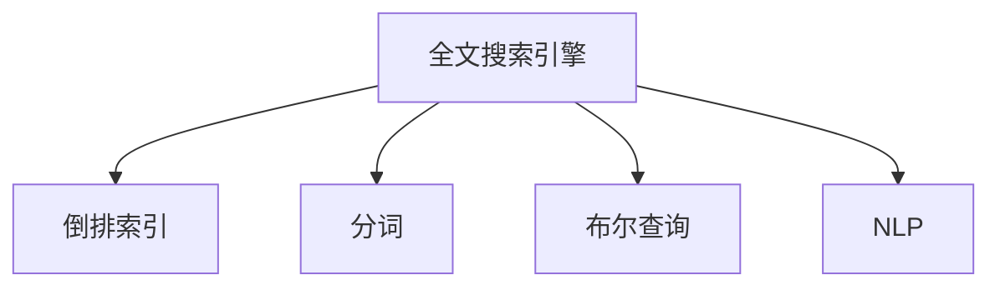

                 

# 【AI大数据计算原理与代码实例讲解】全文搜索

## 1. 背景介绍

### 1.1 问题由来
在计算机科学的早期阶段，数据存储和检索主要依靠传统的数据库系统，如关系型数据库（RDBMS）。随着互联网和移动互联网的迅猛发展，数据量激增，对数据存储和检索的需求也随之变得更加复杂和多样化。全文搜索引擎（Full-Text Search, FTS）作为检索技术的一种，能够在大规模无结构文本数据中快速定位信息，在现代信息时代扮演着重要角色。

### 1.2 问题核心关键点
全文搜索的核心在于如何高效地索引和查询文本数据。其核心思想是将文本数据转化为一个高效的数据结构，如倒排索引（Inverted Index），使其支持快速查找包含特定关键词的文档。这个过程包括对文本的分词、索引构建、查询处理和结果排序等环节。

### 1.3 问题研究意义
掌握全文搜索的原理和实现方法，对于理解现代互联网信息检索系统的工作机制，提升搜索引擎的性能，以及开发高效的文本信息处理应用具有重要意义。

## 2. 核心概念与联系

### 2.1 核心概念概述

为更好地理解全文搜索的技术原理和实现，本节将介绍几个关键概念：

- 全文搜索引擎：一种能够快速检索包含特定关键词的文档的搜索引擎。常见的全文搜索引擎包括Google、Bing、Elasticsearch等。
- 倒排索引（Inverted Index）：一种用于支持全文搜索的数据结构，将文本中的关键词映射到包含该关键词的文档列表。通过倒排索引，可以快速定位包含特定关键词的文档。
- 分词（Tokenization）：将文本分解为单个词汇的过程。分词的准确性和效率直接影响全文搜索的效果。
- 布尔查询（Boolean Query）：一种基于逻辑运算符（AND、OR、NOT）的查询方式，可以组合多个关键词进行复杂的检索需求。
- 自然语言处理（Natural Language Processing, NLP）：一种涉及计算机科学、人工智能和语言学的交叉学科，旨在使计算机理解和生成人类语言。

这些核心概念之间的逻辑关系可以通过以下Mermaid流程图来展示：



这个流程图展示了一系列关键概念及其之间的关系：

1. 全文搜索引擎：是整个系统的核心，依赖于倒排索引、分词、布尔查询和NLP技术实现高效的文本检索。
2. 倒排索引：用于存储关键词与文档的映射关系，是全文搜索的基础数据结构。
3. 分词：将文本转化为单个词汇，是构建倒排索引的前提。
4. 布尔查询：用于构建复杂查询逻辑，支持用户的多样化查询需求。
5. NLP：用于理解文本中的语义信息，提升检索的准确性和相关性。

这些概念共同构成了全文搜索的技术框架，使得搜索引擎能够高效、准确地检索文本信息。通过理解这些核心概念，我们可以更好地把握全文搜索的工作原理和优化方向。

## 3. 核心算法原理 & 具体操作步骤
### 3.1 算法原理概述

全文搜索的核心算法原理主要基于倒排索引的构建和查询。其核心思想是将文本数据转化为一个高效的数据结构，如倒排索引，使其支持快速查找包含特定关键词的文档。具体步骤如下：

1. **分词**：将文本分解为单个词汇，通常使用基于规则、统计或机器学习的分词方法。
2. **构建倒排索引**：对分词结果进行统计和处理，构建倒排索引。倒排索引将每个词汇映射到包含该词汇的文档列表。
3. **建立文档与词汇的关系**：根据倒排索引，可以快速定位包含特定关键词的文档。

### 3.2 算法步骤详解

下面详细解释全文搜索的核心算法步骤：

#### 步骤1：分词
分词是将文本分解为单个词汇的过程。常见的分词方法包括：
- 基于规则的分词：使用正则表达式或词典规则进行分词。
- 基于统计的分词：统计文本中每个字符序列出现的频率，选择出现次数较高的作为词汇。
- 基于机器学习的分词：使用机器学习算法（如CRF、LSTM等）对文本进行分词。

#### 步骤2：构建倒排索引
倒排索引是一个键值对映射表，键为词汇，值为包含该词汇的文档列表。构建倒排索引的流程如下：
- 遍历文本，将每个词汇插入倒排索引中。
- 对于每个文档，遍历其中的词汇，将其对应的文档id添加到倒排索引中。

#### 步骤3：查询处理
查询处理是将用户输入的关键词与倒排索引进行匹配，返回包含关键词的文档。查询处理流程如下：
- 对用户输入的查询进行分词。
- 在倒排索引中查找包含查询词汇的文档列表。
- 使用布尔查询逻辑（如AND、OR、NOT）对文档列表进行筛选和排序。

### 3.3 算法优缺点

全文搜索技术具有以下优点：
1. **高效性**：倒排索引的构建和查询过程具有高效的算法复杂度，能够在大规模数据集上快速检索信息。
2. **灵活性**：支持复杂的查询逻辑，如布尔查询、通配符查询等，满足用户的多样化需求。
3. **可扩展性**：支持分布式部署，通过分片技术（Sharding）和分布式计算，能够处理大规模数据集。

同时，该技术也存在一定的局限性：
1. **分词准确性**：分词的准确性直接影响倒排索引的构建，分词不准确可能导致搜索结果不准确。
2. **索引构建成本**：构建倒排索引需要大量的预处理时间和存储空间，对硬件资源要求较高。
3. **查询复杂度**：复杂的查询逻辑虽然灵活，但可能会影响查询效率，需要合理设计查询逻辑。

### 3.4 算法应用领域

全文搜索技术在信息检索、文本挖掘、数据管理等多个领域得到了广泛应用，例如：

- **搜索引擎**：如Google、Bing、百度等，支持基于关键词的快速检索。
- **图书馆检索系统**：如Elasticsearch，提供高效的书目检索功能。
- **内容推荐系统**：如Netflix、Amazon，通过全文搜索推荐用户感兴趣的内容。
- **法律文档检索**：如RapidMiner，用于快速检索法律文件和法规条款。
- **市场分析**：如Google Trends，通过分析搜索趋势了解市场动向。

除了上述这些经典应用外，全文搜索还被创新性地应用到更多场景中，如情感分析、主题建模、数据清洗等，为信息检索技术带来了新的突破。

## 4. 数学模型和公式 & 详细讲解  
### 4.1 数学模型构建

全文搜索的数学模型主要基于倒排索引的构建和查询。假设文本集合为 $T=\{t_1, t_2, ..., t_n\}$，词汇集合为 $W=\{w_1, w_2, ..., w_m\}$，文档集合为 $D=\{d_1, d_2, ..., d_n\}$。倒排索引 $I$ 可以表示为：

$$
I = \{(w_i, \{d_{j_1}, d_{j_2}, ..., d_{j_k}\}) | w_i \in W, d_{j_1}, d_{j_2}, ..., d_{j_k} \in D\}
$$

其中 $w_i$ 表示词汇，$d_{j_1}, d_{j_2}, ..., d_{j_k}$ 表示包含该词汇的文档列表。

### 4.2 公式推导过程

假设倒排索引 $I$ 已经构建完毕，查询词汇 $q$ 对应的文档列表为 $R$。查询处理的过程可以通过以下公式推导：

1. 对查询词汇 $q$ 进行分词，得到词汇列表 $Q=\{q_1, q_2, ..., q_l\}$。
2. 在倒排索引 $I$ 中查找包含每个词汇 $q_i$ 的文档列表 $R_i$。
3. 将 $R_1, R_2, ..., R_l$ 进行交集操作，得到最终结果集 $S$。

具体推导如下：

设 $I$ 为倒排索引，$Q$ 为查询词汇列表，$R$ 为查询结果文档列表。查询处理的过程如下：

$$
R = \bigcap_{i=1}^l R_i
$$

其中 $R_i$ 表示包含词汇 $q_i$ 的文档列表。最终查询结果 $S$ 可以表示为：

$$
S = \{d_j | d_j \in \bigcap_{i=1}^l R_i, j=1,2,...,n\}
$$

### 4.3 案例分析与讲解

以Google搜索引擎为例，分析其全文搜索的实现机制。Google搜索引擎的核心组件包括倒排索引、分词器、查询解析器和结果排序器。

1. **分词器**：将用户输入的查询进行分词，构建词汇列表。
2. **倒排索引**：存储文本中每个词汇对应的文档列表。
3. **查询解析器**：将查询词汇与倒排索引进行匹配，筛选出包含关键词的文档。
4. **结果排序器**：根据搜索结果的相关性和排序算法，对结果进行排序，返回最终结果。

在Google搜索引擎中，分词器使用基于统计的分词方法，倒排索引使用分布式存储和查询技术，查询解析器支持复杂的布尔查询逻辑，结果排序器使用基于TF-IDF和PageRank的排序算法。

## 5. 项目实践：代码实例和详细解释说明
### 5.1 开发环境搭建

在进行全文搜索实践前，我们需要准备好开发环境。以下是使用Python进行Elasticsearch全文搜索引擎开发的配置流程：

1. 安装Anaconda：从官网下载并安装Anaconda，用于创建独立的Python环境。

2. 创建并激活虚拟环境：
```bash
conda create -n elasticsearch-env python=3.8 
conda activate elasticsearch-env
```

3. 安装Elasticsearch：从官网下载并安装Elasticsearch，建议选择稳定的稳定版本，如Elasticsearch 7.10.1。

4. 安装Python Elasticsearch库：
```bash
pip install elasticsearch
```

5. 安装Flask：用于构建API接口，方便用户进行全文搜索操作。
```bash
pip install flask
```

6. 安装NLTK：用于文本分词和预处理。
```bash
pip install nltk
```

完成上述步骤后，即可在`elasticsearch-env`环境中开始全文搜索实践。

### 5.2 源代码详细实现

接下来，我们以构建一个简单的全文搜索引擎为例，演示如何使用Python和Elasticsearch进行全文搜索的实现。

首先，创建一个Elasticsearch索引，存储文本数据：

```python
from elasticsearch import Elasticsearch

# 创建Elasticsearch客户端
es = Elasticsearch([{'host': 'localhost', 'port': 9200}])

# 创建索引
es.indices.create(index='myindex', body={'settings': {'mapping': {'properties': {'text': {'type': 'text'}}}}})
```

然后，定义分词器，用于对文本进行分词：

```python
import nltk
from nltk.tokenize import word_tokenize

def tokenize(text):
    tokens = word_tokenize(text.lower())
    return tokens
```

接着，实现全文搜索的API接口：

```python
from flask import Flask, request

app = Flask(__name__)

@app.route('/search', methods=['GET'])
def search():
    query = request.args.get('q')
    tokens = tokenize(query)
    results = []
    
    # 在索引中查找包含关键词的文档
    for doc in es.search(index='myindex', body={'query': {'match': {'text': {'query': tokens}}}]):
        results.append(doc['_source'])
    
    # 返回搜索结果
    return {'docs': results}

if __name__ == '__main__':
    app.run(debug=True)
```

以上代码实现了一个简单的全文搜索引擎API接口，用户可以通过向`/search?q=关键词`路径发送HTTP GET请求，获得包含该关键词的文档列表。

### 5.3 代码解读与分析

让我们再详细解读一下关键代码的实现细节：

**Elasticsearch客户端**：
- 使用Python的Elasticsearch库创建Elasticsearch客户端，连接到本地9200端口的Elasticsearch节点。

**创建索引**：
- 使用`es.indices.create`方法创建一个名为`myindex`的索引，并定义文本字段的映射为文本类型，方便全文搜索。

**分词器**：
- 使用NLTK库的`word_tokenize`函数进行分词，将文本转化为小写字母的词汇列表。

**全文搜索API**：
- 使用Flask框架构建API接口，接受查询参数`q`，并对查询进行分词。
- 在索引中执行`match`查询，查找包含查询词汇的文档。
- 将搜索结果封装为JSON格式，返回给用户。

可以看到，Elasticsearch的强大分片和分布式存储能力，使得全文搜索的实现变得简洁高效。开发者可以将更多精力放在分词、索引构建等高层次逻辑上，而不必过多关注底层实现细节。

当然，工业级的系统实现还需考虑更多因素，如索引的分布式部署、查询的负载均衡、查询的缓存机制等。但核心的全文搜索范式基本与此类似。

## 6. 实际应用场景
### 6.1 智慧图书馆

全文搜索技术可以广泛应用于智慧图书馆的建设。传统图书馆需要大量人力进行书籍管理、借阅记录、检索服务等工作，且图书馆开放时间有限，无法满足用户的即时需求。

使用全文搜索技术，可以在图书馆的数字化书目中快速检索信息，提升借阅效率。具体而言，可以收集图书馆的书籍数据，建立倒排索引，使用API接口支持用户输入关键词进行检索。通过智能化书目推荐系统，可以根据用户的阅读历史和兴趣，推荐相关书籍，提升阅读体验。

### 6.2 电商推荐系统

当前的推荐系统往往只依赖用户的历史行为数据进行物品推荐，无法深入理解用户的真实兴趣偏好。全文搜索技术可以用于提取和理解文本中的语义信息，从而提供更精准、多样的推荐内容。

在实践中，可以收集用户浏览、点击、评论、分享等行为数据，提取和用户交互的物品标题、描述、标签等文本内容。将文本内容作为模型输入，用户的后续行为（如是否点击、购买等）作为监督信号，在此基础上微调预训练语言模型。微调后的模型能够从文本内容中准确把握用户的兴趣点。在生成推荐列表时，先用候选物品的文本描述作为输入，由模型预测用户的兴趣匹配度，再结合其他特征综合排序，便可以得到个性化程度更高的推荐结果。

### 6.3 智能客服系统

基于全文搜索技术，可以构建智能客服系统，提高客户咨询体验和问题解决效率。传统客服往往需要配备大量人力，高峰期响应缓慢，且一致性和专业性难以保证。

使用全文搜索技术，可以将历史客服对话记录构建成监督数据，对预训练模型进行微调。微调后的模型能够自动理解用户意图，匹配最合适的答案模板进行回复。对于客户提出的新问题，还可以接入检索系统实时搜索相关内容，动态组织生成回答。如此构建的智能客服系统，能大幅提升客户咨询体验和问题解决效率。

### 6.4 未来应用展望

随着全文搜索技术的不断发展，其在更多领域得到应用，为各行各业带来变革性影响。

在智慧医疗领域，基于全文搜索的医疗问答、病历分析、药物研发等应用将提升医疗服务的智能化水平，辅助医生诊疗，加速新药开发进程。

在智能教育领域，全文搜索技术可应用于作业批改、学情分析、知识推荐等方面，因材施教，促进教育公平，提高教学质量。

在智慧城市治理中，全文搜索技术可应用于城市事件监测、舆情分析、应急指挥等环节，提高城市管理的自动化和智能化水平，构建更安全、高效的未来城市。

此外，在企业生产、社会治理、文娱传媒等众多领域，全文搜索技术也将不断涌现，为传统行业数字化转型升级提供新的技术路径。

## 7. 工具和资源推荐
### 7.1 学习资源推荐

为了帮助开发者系统掌握全文搜索的理论基础和实践技巧，这里推荐一些优质的学习资源：

1. **《Elasticsearch权威指南》**：由官方开发者撰写的Elasticsearch权威指南，深入浅出地介绍了Elasticsearch的基本概念、核心功能和应用场景。

2. **《信息检索与统计语言模型》**：由信息检索领域的知名学者编写的经典教材，详细介绍了全文搜索的数学模型和实现技术。

3. **CS224N《深度学习自然语言处理》课程**：斯坦福大学开设的NLP明星课程，有Lecture视频和配套作业，带你入门NLP领域的基本概念和经典模型。

4. **NLP在深度学习框架中的实现**：由DeepLearning.ai提供的NLP实践指南，介绍了在TensorFlow和PyTorch中实现NLP任务的方法和技巧。

5. **NLTK教程**：由NLTK社区提供的NLTK教程，涵盖文本处理、分词、NLP等基础知识，适合初学者入门。

通过对这些资源的学习实践，相信你一定能够快速掌握全文搜索的精髓，并用于解决实际的文本信息处理问题。

### 7.2 开发工具推荐

高效的开发离不开优秀的工具支持。以下是几款用于全文搜索开发的常用工具：

1. **Elasticsearch**：由Elastic公司开发的分布式全文搜索引擎，支持复杂的查询逻辑和数据存储。
2. **Solr**：Apache基金会开源的全文搜索引擎，支持多语言、多字段查询和分布式部署。
3. **Whoosh**：Python实现的轻量级全文搜索引擎，适合小型项目或嵌入式系统。
4. **Lucene**：Apache基金会开发的Java全文搜索引擎，支持复杂的索引和查询功能。
5. **Flask**：Python实现的Web框架，用于构建API接口，方便用户进行全文搜索操作。

合理利用这些工具，可以显著提升全文搜索任务的开发效率，加快创新迭代的步伐。

### 7.3 相关论文推荐

全文搜索技术的发展源于学界的持续研究。以下是几篇奠基性的相关论文，推荐阅读：

1. **A Theoretical Framework for Approaches to Full-Text Search**：提出了一种理论框架，用于指导全文搜索算法的开发。
2. **An Introduction to Information Retrieval**：信息检索领域的经典教材，详细介绍了全文搜索的数学模型和实现技术。
3. **Elasticsearch: A Distributed Real-Time Search and Analytics Engine**：介绍Elasticsearch的架构和实现原理，适用于理解分布式全文搜索技术。
4. **Semantic Search for the Web**：提出了一种基于语义的全文搜索方法，能够理解查询的语义意图，提高搜索结果的相关性。
5. **Crowdsourcing Search Engines**：提出了一种基于众包的全文搜索方法，能够充分利用用户提供的反馈信息，提升搜索结果的准确性。

这些论文代表了大规模搜索技术的最新进展。通过学习这些前沿成果，可以帮助研究者把握学科前进方向，激发更多的创新灵感。

## 8. 总结：未来发展趋势与挑战

### 8.1 总结

本文对全文搜索的原理和实现方法进行了全面系统的介绍。首先阐述了全文搜索的技术背景和应用意义，明确了全文搜索在现代信息检索系统中的核心地位。其次，从原理到实践，详细讲解了全文搜索的数学模型和关键步骤，给出了全文搜索任务开发的完整代码实例。同时，本文还广泛探讨了全文搜索技术在智慧图书馆、电商推荐系统、智能客服等多个行业领域的应用前景，展示了全文搜索技术的巨大潜力。最后，本文精选了全文搜索技术的各类学习资源，力求为读者提供全方位的技术指引。

通过本文的系统梳理，可以看到，全文搜索技术在现代信息检索系统中扮演着重要角色，能够高效、准确地检索文本信息。掌握全文搜索的原理和实现方法，对于理解现代搜索引擎的工作机制，提升搜索引擎的性能，以及开发高效的文本信息处理应用具有重要意义。

### 8.2 未来发展趋势

展望未来，全文搜索技术将呈现以下几个发展趋势：

1. **分布式技术**：随着数据量的增加，分布式存储和处理技术将成为全文搜索技术的主流。分布式搜索引擎如Elasticsearch和Solr将进一步优化性能，支持更大规模的数据集。
2. **自然语言处理**：通过引入自然语言处理技术，全文搜索能够更好地理解查询的语义意图，提升搜索结果的相关性。
3. **智能推荐**：全文搜索技术与推荐系统结合，能够实现更精准的内容推荐，提升用户体验。
4. **实时搜索**：通过流处理技术，实现实时数据流的全文搜索，支持实时分析和监控。
5. **多模态搜索**：将全文搜索扩展到多模态数据，支持文本、图像、语音等多种数据类型的检索。

这些趋势凸显了全文搜索技术的广阔前景。这些方向的探索发展，必将进一步提升全文搜索系统的性能和应用范围，为信息检索技术带来新的突破。

### 8.3 面临的挑战

尽管全文搜索技术已经取得了显著进展，但在迈向更加智能化、普适化应用的过程中，它仍面临着诸多挑战：

1. **查询复杂度**：复杂的查询逻辑虽然灵活，但可能会影响查询效率，需要合理设计查询逻辑。
2. **分词准确性**：分词的准确性直接影响搜索结果的准确性，分词不准确可能导致搜索结果不准确。
3. **索引构建成本**：构建倒排索引需要大量的预处理时间和存储空间，对硬件资源要求较高。
4. **多语言支持**：不同语言的分词和索引构建方式不同，如何支持多种语言的全文搜索，是一个重要挑战。
5. **实时搜索性能**：实时搜索需要处理大量流数据，对性能和延迟要求极高，需要优化数据处理和存储机制。

### 8.4 研究展望

面对全文搜索面临的这些挑战，未来的研究需要在以下几个方面寻求新的突破：

1. **改进分词算法**：开发更加高效、准确的分词算法，提高全文搜索的精度和速度。
2. **优化索引构建**：利用分布式计算和压缩技术，降低索引构建的成本，支持更大规模的数据集。
3. **引入自然语言处理**：通过引入NLP技术，提高查询的语义理解和相关性匹配，提升搜索结果的质量。
4. **支持多语言搜索**：开发支持多种语言的分词和索引构建技术，实现多语言的全文搜索。
5. **实现实时搜索**：通过流处理技术和存储优化，支持实时数据流的全文搜索，满足实时分析和监控的需求。

这些研究方向将引领全文搜索技术迈向更高的台阶，为构建更加智能、高效、普适化的全文搜索引擎提供新的解决方案。

## 9. 附录：常见问题与解答

**Q1：全文搜索是否适用于所有文本数据？**

A: 全文搜索适用于无结构文本数据，如HTML、PDF、图像文字等。但对于结构化数据，如数据库表，需要进行预处理和转换，才能使用全文搜索技术。

**Q2：如何优化查询性能？**

A: 优化查询性能的方法包括：
1. 使用索引过滤：在查询中包含索引过滤条件，减少需要检索的文档数量。
2. 分页处理：通过分页技术，将搜索结果限制在一定范围内，减少不必要的数据传输。
3. 缓存查询结果：对经常查询的数据进行缓存，提升查询效率。

**Q3：如何提高分词准确性？**

A: 提高分词准确性的方法包括：
1. 使用更好的分词算法，如基于统计的分词、机器学习分词。
2. 对分词器进行调参，优化分词器的性能。
3. 引入多分词器技术，将多种分词器组合使用，提高分词的准确性。

**Q4：如何处理多语言文本？**

A: 处理多语言文本的方法包括：
1. 使用多语言分词器，对每种语言进行独立分词。
2. 使用通用分词算法，统一对不同语言进行分词。
3. 引入多语言索引技术，将不同语言的数据存储在同一个索引中。

这些问题的解答为开发人员提供了实用的建议，帮助他们更好地应对实际开发中的挑战，确保全文搜索系统的稳定运行和高效性能。

---

作者：禅与计算机程序设计艺术 / Zen and the Art of Computer Programming

