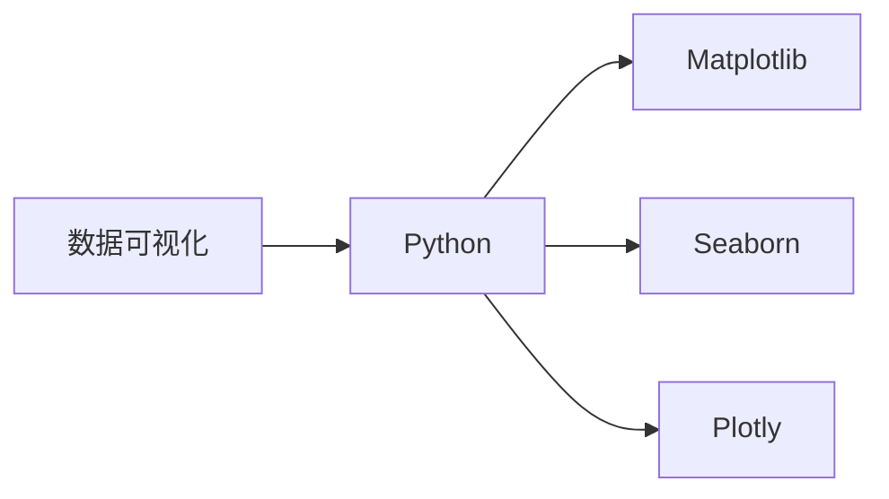

                 

# 【AI大数据计算原理与代码实例讲解】数据可视化

> 关键词：数据可视化, Python, Matplotlib, Seaborn, Plotly, 大数据计算, 科学计算, 高性能计算, 交互式可视化, 机器学习

## 1. 背景介绍

数据可视化是现代数据科学中的一个核心技术，它通过图形、图表等形式，将复杂的数据信息转化为直观、易于理解的视觉表现，帮助用户快速发现数据中的规律和模式。在大数据计算和机器学习领域，数据可视化不仅是数据分析的重要工具，也是模型评估和调试的重要手段。

本文将介绍数据可视化的基本原理、常用工具和方法，并通过实际项目实践，展示如何使用Python中的Matplotlib、Seaborn和Plotly等库进行高效、交互式的数据可视化开发。

## 2. 核心概念与联系

### 2.1 核心概念概述

- **数据可视化**：通过图形、图表等形式，将数据转化为视觉表现，便于理解分析。
- **Python**：目前最流行的编程语言之一，支持科学计算、数据分析、机器学习等应用。
- **Matplotlib**：Python中最为流行的绘图库，支持多种图表类型和自定义风格。
- **Seaborn**：基于Matplotlib的高级接口，提供更加美观的统计图形。
- **Plotly**：支持交互式图形，适用于网页和移动端展示，支持复杂动画效果。

这些核心概念通过以下Mermaid流程图来展示它们之间的联系：



## 3. 核心算法原理 & 具体操作步骤

### 3.1 算法原理概述

数据可视化的核心算法原理是通过算法将数据映射为图形和图表，从而实现对数据信息的直观理解。常见的数据可视化算法包括：

- **散点图**：用于展示变量之间的关系。
- **直方图**：用于展示数据的分布情况。
- **折线图**：用于展示数据随时间的变化趋势。
- **条形图**：用于比较不同类别或变量的大小。
- **饼图**：用于展示数据占总体的比例。
- **热图**：用于展示变量间的相关性。

这些算法通常基于统计学和几何学的原理，将数据转换为点、线、面等图形元素，并通过颜色、大小等属性来表示数据的特征。

### 3.2 算法步骤详解

数据可视化的主要步骤包括：

1. **数据准备**：将原始数据进行清洗和预处理，转化为可供绘制的数据格式。
2. **选择图表类型**：根据数据特点和分析需求，选择适合的图表类型。
3. **绘制图形**：使用绘图库进行图形绘制。
4. **自定义风格**：对图表进行样式和布局的调整，使其更具美观性和易读性。
5. **保存和分享**：将图表保存为图片或PDF文件，或通过Web应用进行在线展示。

### 3.3 算法优缺点

数据可视化的优点包括：

- 直观展示数据信息，易于理解和分析。
- 辅助发现数据中的规律和异常，支持科学决策。
- 支持交互式展示，便于动态调整和探索。

缺点包括：

- 可能过度简化数据信息，导致误导性解读。
- 需要专业技能进行设计和实现，门槛较高。
- 对大规模数据的可视化可能存在性能瓶颈。

### 3.4 算法应用领域

数据可视化在众多领域都有广泛应用，包括但不限于：

- **科学研究**：用于数据分析和结果展示，支持科学论文和报告撰写。
- **商业智能**：用于市场分析和业务决策，帮助企业优化运营策略。
- **医疗健康**：用于患者数据分析和医学研究，支持临床诊断和治疗决策。
- **金融投资**：用于市场分析和投资决策，支持风险管理和策略优化。
- **教育培训**：用于学习数据分析和统计学知识，支持教学和培训。

## 4. 数学模型和公式 & 详细讲解 & 举例说明

### 4.1 数学模型构建

数据可视化的数学模型通常基于统计学和几何学的原理，将数据映射为图形和图表。例如，散点图通过计算两个变量间的相关系数，展示它们之间的关系。

### 4.2 公式推导过程

以散点图为例，假设我们有两组数据 $x_i$ 和 $y_i$，其中 $x_i$ 表示 $i$ 个样本的特征值，$y_i$ 表示 $i$ 个样本的标签值。散点图的公式推导过程如下：

1. **计算相关系数**：
$$
\rho = \frac{\sum_{i=1}^n (x_i - \bar{x})(y_i - \bar{y})}{\sqrt{\sum_{i=1}^n (x_i - \bar{x})^2} \sqrt{\sum_{i=1}^n (y_i - \bar{y})^2}}
$$

其中，$\bar{x}$ 和 $\bar{y}$ 分别表示 $x$ 和 $y$ 的均值。

2. **计算散点图的斜率**：
$$
\text{slope} = \frac{\sum_{i=1}^n (x_i - \bar{x})(y_i - \bar{y})}{\sum_{i=1}^n (x_i - \bar{x})^2}
$$

3. **绘制散点图**：
$$
\begin{aligned}
&\text{for } i = 1 \text{ to } n \\
&\quad \text{draw point } (x_i, y_i)
\end{aligned}
$$

### 4.3 案例分析与讲解

以Python中的Matplotlib库为例，展示如何使用散点图展示两个变量之间的关系：

```python
import matplotlib.pyplot as plt
import numpy as np

# 生成随机数据
x = np.random.rand(100)
y = x * 2 + np.random.rand(100) - 0.5

# 绘制散点图
plt.scatter(x, y)

# 添加坐标轴标签和标题
plt.xlabel('X')
plt.ylabel('Y')
plt.title('Scatter Plot')

# 显示图表
plt.show()
```

## 5. 项目实践：代码实例和详细解释说明

### 5.1 开发环境搭建

在开始项目实践前，需要确保开发环境已经搭建好。以下是Python项目的基本环境搭建步骤：

1. **安装Python**：从官网下载并安装Python。
2. **安装虚拟环境**：使用`virtualenv`或`conda`创建虚拟环境，确保项目依赖与系统隔离。
3. **安装依赖库**：使用`pip`安装所需依赖库，如Matplotlib、Seaborn、Plotly等。
4. **编写代码**：在虚拟环境中打开Python交互环境，开始编写代码。

### 5.2 源代码详细实现

下面以一个实际项目为例，展示如何使用Matplotlib绘制散点图：

```python
import matplotlib.pyplot as plt
import numpy as np

# 生成随机数据
x = np.random.rand(100)
y = x * 2 + np.random.rand(100) - 0.5

# 绘制散点图
plt.scatter(x, y)

# 添加坐标轴标签和标题
plt.xlabel('X')
plt.ylabel('Y')
plt.title('Scatter Plot')

# 显示图表
plt.show()
```

### 5.3 代码解读与分析

在上述代码中，首先使用NumPy生成两组随机数据 `x` 和 `y`，然后调用 `plt.scatter` 函数绘制散点图。最后使用 `plt.xlabel`、`plt.ylabel` 和 `plt.title` 分别添加坐标轴标签和图表标题，并通过 `plt.show` 显示图表。

### 5.4 运行结果展示

运行上述代码后，会显示一个包含100个点的散点图，每个点的横纵坐标来自生成的随机数据，图表中添加了坐标轴标签和标题，可以直观地展示变量之间的关系。

## 6. 实际应用场景

### 6.1 数据分析与可视化

数据可视化在数据分析中扮演着重要角色，通过可视化可以直观地展示数据分布、趋势和关联性。例如，在金融领域，分析师可以使用散点图展示股票价格和市场指数之间的关系，通过观察散点图的分布趋势，判断市场的走势和风险。

### 6.2 业务决策支持

数据可视化帮助企业决策者快速理解业务数据，支持科学决策。例如，在电商领域，业务决策者可以通过条形图展示不同产品的销售情况，根据销售数据进行市场定位和产品优化。

### 6.3 科学研究与发表

科学研究中，数据可视化是论文和报告中的重要组成部分，用于展示实验结果和数据分析。例如，生物医学领域的研究者可以使用热图展示基因表达数据，通过热图的颜色深浅直观地展示基因表达的差异。

## 7. 工具和资源推荐

### 7.1 学习资源推荐

- **官方文档**：Matplotlib、Seaborn和Plotly的官方文档，提供了详细的API参考和使用指南。
- **在线教程**：Kaggle、Coursera等平台的Python和数据可视化课程，提供了丰富的实践项目和案例。
- **开源项目**：GitHub上的数据可视化项目，可以学习其他开发者如何使用这些库进行可视化开发。

### 7.2 开发工具推荐

- **IDE**：PyCharm、Jupyter Notebook等集成开发环境，支持Python开发和数据可视化。
- **版本控制**：Git、GitHub等版本控制系统，方便协作和版本管理。
- **可视化工具**：Plotly、Bokeh等交互式可视化工具，支持动态数据展示。

### 7.3 相关论文推荐

- "Visualization in Scientific Computing" by Tony F. Chan and Paul D. Preissman，介绍了科学计算中数据可视化的基本原理和实现方法。
- "Data Visualization and Visual Exploration" by Yoav Ram and Amir Sapir，探讨了数据可视化的应用和实践。
- "Interactive Data Visualization for the Web" by Philip J. McAuley and Richard S. Sutton，介绍了交互式数据可视化在Web开发中的应用。

## 8. 总结：未来发展趋势与挑战

### 8.1 未来发展趋势

未来，数据可视化将向更加智能和交互式方向发展：

1. **智能化**：通过机器学习和自然语言处理技术，智能生成可视化图表，支持用户进行自定义调整。
2. **交互性**：通过Web前端技术和交互式可视化库，支持用户在Web应用中进行动态数据展示和探索。
3. **移动端**：通过移动端应用和轻量级库，支持用户在移动设备上进行数据可视化。
4. **大数据计算**：通过分布式计算和并行处理，支持大规模数据的可视化。
5. **多模态可视化**：结合文本、图像、声音等多种数据类型，进行综合可视化展示。

### 8.2 面临的挑战

尽管数据可视化技术已经取得显著进展，但仍然面临以下挑战：

1. **数据复杂性**：复杂数据集的多维度特征可能导致可视化展示混乱，难以直观理解。
2. **用户交互性**：复杂交互界面和交互式可视化库的使用门槛较高，需要专业技能支持。
3. **性能瓶颈**：大规模数据的可视化可能存在性能瓶颈，需要优化计算效率和内存使用。
4. **数据安全**：数据可视化应用需要确保数据安全和隐私保护，防止数据泄露和滥用。
5. **标准化**：不同工具和库之间的数据格式和图表风格不统一，增加了用户学习的难度。

### 8.3 研究展望

未来，数据可视化研究可以从以下几个方向进行探索：

1. **自适应可视化**：通过机器学习技术，自动生成适应数据特征的可视化图表。
2. **交互式探索**：通过交互式可视化技术，支持用户进行动态探索和调整。
3. **可视化工具集成**：开发统一的可视化工具和标准，方便用户选择和使用。
4. **大数据计算优化**：优化可视化计算图，支持大规模数据集的高效展示。
5. **多模态可视化融合**：结合文本、图像、声音等多种数据类型，进行综合可视化展示。

## 9. 附录：常见问题与解答

### 9.1 常见问题

1. **Q: 数据可视化有哪些常见工具？**
   A: 常用的数据可视化工具包括Matplotlib、Seaborn、Plotly等。

2. **Q: 数据可视化有哪些应用场景？**
   A: 数据可视化在科学研究、商业智能、医疗健康、金融投资等领域都有广泛应用。

3. **Q: 如何进行数据可视化？**
   A: 数据可视化通常包括数据准备、选择图表类型、绘制图形和自定义风格等步骤。

### 9.2 解答

通过回答常见问题，帮助读者快速掌握数据可视化的基本概念和使用方法，进一步加深对数据可视化技术的应用。

---

作者：禅与计算机程序设计艺术 / Zen and the Art of Computer Programming

