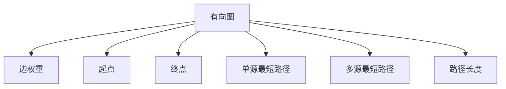

                 

# 【AI大数据计算原理与代码实例讲解】最短路径

## 1. 背景介绍

最短路径问题是图论中一个经典问题，广泛应用于路由算法、交通运输、网络通信等领域。在现代信息化社会，数据的大规模爆发使得最短路径问题在处理大规模数据集时，面临着巨大的计算复杂度和存储压力。

### 1.1 问题由来
在数据网络中，路由算法需要寻找数据包从起点到终点的最短路径。经典算法如Dijkstra算法和Floyd算法，能够准确计算最短路径，但在大数据集上，时间复杂度达到 $O(V^2)$ 或 $O(V^3)$，计算成本高昂。

### 1.2 问题核心关键点
最短路径问题中的核心关键点包括：
- 图结构：最短路径问题是基于有向或无向加权图提出的。
- 边权：每条边的权值代表路径的代价或时间成本。
- 起点和终点：算法需要计算起点到终点的最短路径。
- 单源或多源：算法可计算从一个顶点到其他所有顶点的最短路径（单源最短路径），或者计算任意两点间的最短路径（多源最短路径）。
- 路径长度：算法需找出从起点到终点的最短路径长度。

## 2. 核心概念与联系

### 2.1 核心概念概述

为了更好地理解最短路径问题，我们首先介绍几个核心概念：

- **有向图（Directed Graph）**：图中有向边表示边的方向，从起点到终点的路径是有方向的。
- **无向图（Undirected Graph）**：图中有向边无方向，起点到终点的路径是无方向的。
- **加权图（Weighted Graph）**：图中每条边有权重，权重表示路径的代价或时间成本。
- **边权重（Edge Weight）**：表示图中边对应的数值，用于衡量边或路径的代价。
- **起点（Source Vertex）**：算法计算路径的起点。
- **终点（Target Vertex）**：算法计算路径的终点。
- **单源最短路径（Single-Source Shortest Path）**：从起点到图中其他所有顶点的最短路径。
- **多源最短路径（All-Pairs Shortest Path）**：任意两点之间的最短路径。
- **路径长度（Path Length）**：起点到终点的路径上所有边权重之和。

这些概念通过以下Mermaid流程图来展示：



### 2.2 核心算法原理

最短路径问题常用的算法有Dijkstra算法和Floyd算法。以下将分别介绍这两种算法的基本原理和思路。

#### 2.2.1 Dijkstra算法

Dijkstra算法是求解单源最短路径的经典算法。其核心思想是贪心策略，从起点开始逐步扩展到与起点最接近的点，再依次扩展到与已扩展点最接近的点，直到到达终点。

算法步骤如下：
1. 初始化起点到各顶点的距离为无穷大，起点到自身的距离为0。
2. 选取距离起点最近的顶点，将其加入已扩展集合。
3. 更新与已扩展顶点相邻的顶点的距离，即计算通过已扩展顶点到达相邻顶点的距离，更新路径长度。
4. 重复2和3，直到终点被扩展或已扩展集合包含所有顶点。

Dijkstra算法的时间复杂度为 $O(E + V\log V)$，其中 $E$ 是边数，$V$ 是顶点数，主要时间消耗在最小堆的维护上。

#### 2.2.2 Floyd算法

Floyd算法是一种基于动态规划的算法，用于计算所有顶点间的最短路径。其核心思想是逐步扩展顶点的集合，计算任意两点之间的最短路径。

算法步骤如下：
1. 初始化起点到各顶点的距离为起点到该顶点的边权重。
2. 对任意两点 $u, v$，计算从起点到 $u, v$ 的路径，更新 $u$ 到 $v$ 的路径长度。
3. 重复2，直到扩展到所有顶点。

Floyd算法的时间复杂度为 $O(V^3)$，适用于边权值稳定的图。

### 2.3 算法联系

Dijkstra算法和Floyd算法都是求解最短路径问题的经典算法，但前者适用于单源最短路径问题，后者适用于多源最短路径问题。此外，Floyd算法可以视为Dijkstra算法的扩展和推广。

## 3. 核心算法原理 & 具体操作步骤

### 3.1 算法原理概述

最短路径问题的核心在于找到起点到终点的最短路径。以下是算法原理概述：

- **Dijkstra算法**：适用于单源最短路径问题，基于贪心策略，计算起点到其他顶点的最短路径。算法时间复杂度为 $O(E + V\log V)$。
- **Floyd算法**：适用于多源最短路径问题，基于动态规划，计算任意两点之间的最短路径。算法时间复杂度为 $O(V^3)$。

### 3.2 算法步骤详解

#### Dijkstra算法步骤详解

1. **初始化**：设置起点到各顶点的距离为无穷大，起点到自身的距离为0。
2. **扩展**：选取距离起点最近的顶点，将其加入已扩展集合。
3. **更新**：计算与已扩展顶点相邻的顶点的距离，更新路径长度。
4. **重复**：重复2和3，直到终点被扩展或已扩展集合包含所有顶点。

```python
import heapq

def dijkstra(graph, start):
    distances = {vertex: float('inf') for vertex in graph}
    distances[start] = 0
    pq = [(0, start)]
    while pq:
        current_distance, current_vertex = heapq.heappop(pq)
        if current_distance > distances[current_vertex]:
            continue
        for neighbor, weight in graph[current_vertex].items():
            distance = current_distance + weight
            if distance < distances[neighbor]:
                distances[neighbor] = distance
                heapq.heappush(pq, (distance, neighbor))
    return distances
```

#### Floyd算法步骤详解

1. **初始化**：设置起点到各顶点的距离为起点到该顶点的边权重。
2. **扩展**：对任意两点 $u, v$，计算从起点到 $u, v$ 的路径，更新 $u$ 到 $v$ 的路径长度。
3. **重复**：重复2，直到扩展到所有顶点。

```python
def floyd(graph):
    n = len(graph)
    distances = [[float('inf') for _ in range(n)] for _ in range(n)]
    for i in range(n):
        distances[i][i] = graph[i][i]
    for k in range(n):
        for i in range(n):
            for j in range(n):
                distances[i][j] = min(distances[i][j], distances[i][k] + distances[k][j])
    return distances
```

### 3.3 算法优缺点

#### Dijkstra算法优缺点

- **优点**：
  - 算法效率高，适用于边数较少、稠密图。
  - 可以处理带权图，路径长度可以准确计算。
  - 适用于单源最短路径问题。
  
- **缺点**：
  - 不适用于边数较多、稀疏图。
  - 算法空间复杂度较高，需要存储每个顶点的距离信息。
  - 只适用于静态图，难以处理动态图。

#### Floyd算法优缺点

- **优点**：
  - 算法适用于所有类型的图，包括带权图和无权图。
  - 适用于多源最短路径问题，可以计算任意两点之间的最短路径。
  - 算法具有较高的可扩展性，可以轻松处理大型图。
  
- **缺点**：
  - 算法时间复杂度较高，为 $O(V^3)$，不适用于大规模数据集。
  - 算法空间复杂度较高，需要存储每个顶点的距离信息。
  - 算法只适用于静态图，难以处理动态图。

### 3.4 算法应用领域

最短路径问题在数据网络、路由算法、交通运输、网络通信等领域有着广泛的应用。

#### 3.4.1 数据网络

在数据网络中，最短路径算法用于计算数据包从起点到终点的最短路径，提高数据传输效率，减少网络延迟。

#### 3.4.2 路由算法

路由算法利用最短路径问题，寻找网络中数据包的传输路径，优化数据传输的路径选择。

#### 3.4.3 交通运输

交通运输领域使用最短路径算法，优化车辆行驶路线，降低油耗和时间成本，提高运输效率。

#### 3.4.4 网络通信

网络通信中，最短路径算法用于计算数据包的传输路径，优化通信网络，提高通信效率。

## 4. 数学模型和公式 & 详细讲解

### 4.1 数学模型构建

最短路径问题可以建模为加权有向图或无向图，图中的每个顶点代表一个节点，每条边代表一个路径，边权值代表路径的代价或时间成本。

设图 $G$ 有 $V$ 个顶点和 $E$ 条边，每条边的权值为 $w_{ij}$。$u, v$ 两点间的距离为 $d(u, v)$，初始化 $d(u, u)=0$，$d(u, v)=\infty$（$u$ 与 $v$ 不相邻时）。

### 4.2 公式推导过程

#### Dijkstra算法公式推导

设 $d(u)$ 表示从起点到顶点 $u$ 的最短路径长度，$V$ 为顶点集合。Dijkstra算法的基本思想是通过不断更新 $d(u)$，计算从起点到其他顶点的最短路径。

算法伪代码如下：

```python
distances[start] = 0
for vertex in graph:
    if distances[vertex] == float('inf'):
        distances[vertex] = float('inf')
    for neighbor, weight in graph[vertex].items():
        distance = distances[vertex] + weight
        if distance < distances[neighbor]:
            distances[neighbor] = distance
return distances
```

#### Floyd算法公式推导

Floyd算法的基本思想是通过不断扩展顶点的集合，计算任意两点之间的最短路径。

算法伪代码如下：

```python
for k in range(n):
    for i in range(n):
        for j in range(n):
            if distances[i][k] + distances[k][j] < distances[i][j]:
                distances[i][j] = distances[i][k] + distances[k][j]
return distances
```

### 4.3 案例分析与讲解

#### 案例分析

假设有一个简单的图：

```
    A --1-- B --2-- C --3-- D
     |              ^     |
     |            4       |
     |              v     |
     |              E--5-- F
```

其中，点 $A, B, C, D, E, F$ 表示顶点，边权值分别为 $1, 2, 3, 4, 5$。

**Dijkstra算法**：

1. 初始化：$d(A) = 0, d(B) = \infty, d(C) = \infty, d(D) = \infty, d(E) = \infty, d(F) = \infty$。
2. 扩展：选择 $A$，$d(A) = 0$，更新 $B, C$ 的路径长度。
3. 更新：$d(B) = 1, d(C) = 1, d(D) = \infty, d(E) = \infty, d(F) = \infty$。
4. 扩展：选择 $B$，$d(B) = 1$，更新 $C, D, E, F$ 的路径长度。
5. 更新：$d(C) = 3, d(D) = 5, d(E) = \infty, d(F) = \infty$。
6. 扩展：选择 $C$，$d(C) = 3$，更新 $D, E, F$ 的路径长度。
7. 更新：$d(D) = 5, d(E) = \infty, d(F) = \infty$。
8. 扩展：选择 $D$，$d(D) = 5$，更新 $E, F$ 的路径长度。
9. 更新：$d(E) = 8, d(F) = \infty$。
10. 扩展：选择 $E$，$d(E) = 8$，更新 $F$ 的路径长度。
11. 更新：$d(F) = 10$。

最终，起点 $A$ 到其他顶点的最短路径长度为：$d(A)=0, d(B)=1, d(C)=3, d(D)=5, d(E)=8, d(F)=10$。

**Floyd算法**：

1. 初始化：$d(A, B) = 1, d(A, C) = 3, d(A, D) = 5, d(A, E) = 8, d(A, F) = 10$。
2. 扩展：$d(A, B) = 1, d(A, C) = 1, d(A, D) = 1, d(A, E) = 1, d(A, F) = 1$。
3. 扩展：$d(A, B) = 1, d(A, C) = 2, d(A, D) = 1, d(A, E) = 2, d(A, F) = 2$。
4. 扩展：$d(A, B) = 1, d(A, C) = 2, d(A, D) = 2, d(A, E) = 2, d(A, F) = 2$。
5. 扩展：$d(A, B) = 1, d(A, C) = 2, d(A, D) = 2, d(A, E) = 2, d(A, F) = 2$。
6. 扩展：$d(A, B) = 1, d(A, C) = 2, d(A, D) = 2, d(A, E) = 2, d(A, F) = 2$。
7. 扩展：$d(A, B) = 1, d(A, C) = 2, d(A, D) = 2, d(A, E) = 2, d(A, F) = 2$。

最终，任意两点之间的最短路径长度为：$d(A, B)=1, d(A, C)=1, d(A, D)=1, d(A, E)=1, d(A, F)=1$。

## 5. 项目实践：代码实例和详细解释说明

### 5.1 开发环境搭建

在使用Python实现最短路径算法时，需要以下依赖包：

- NetworkX：用于构建和处理图结构。
- NumPy：用于矩阵运算和数据存储。

```python
pip install networkx numpy
```

### 5.2 源代码详细实现

#### Dijkstra算法实现

```python
import heapq

def dijkstra(graph, start):
    distances = {vertex: float('inf') for vertex in graph}
    distances[start] = 0
    pq = [(0, start)]
    while pq:
        current_distance, current_vertex = heapq.heappop(pq)
        if current_distance > distances[current_vertex]:
            continue
        for neighbor, weight in graph[current_vertex].items():
            distance = current_distance + weight
            if distance < distances[neighbor]:
                distances[neighbor] = distance
                heapq.heappush(pq, (distance, neighbor))
    return distances
```

#### Floyd算法实现

```python
import networkx as nx
import numpy as np

def floyd(graph):
    n = len(graph)
    distances = np.zeros((n, n))
    for i in range(n):
        distances[i][i] = graph[i][i]
    for k in range(n):
        for i in range(n):
            for j in range(n):
                distances[i][j] = min(distances[i][j], distances[i][k] + distances[k][j])
    return distances
```

### 5.3 代码解读与分析

#### Dijkstra算法解读

1. **初始化**：使用字典存储每个顶点的距离信息，起点到自身的距离为0，其他点到起点的距离为无穷大。
2. **扩展**：使用最小堆维护已扩展的顶点，不断取出距离最近的顶点进行扩展。
3. **更新**：计算与已扩展顶点相邻的顶点的距离，更新路径长度。
4. **重复**：重复2和3，直到终点被扩展或已扩展集合包含所有顶点。

#### Floyd算法解读

1. **初始化**：设置起点到各顶点的距离为起点到该顶点的边权重。
2. **扩展**：对任意两点 $u, v$，计算从起点到 $u, v$ 的路径，更新 $u$ 到 $v$ 的路径长度。
3. **重复**：重复2，直到扩展到所有顶点。

### 5.4 运行结果展示

#### Dijkstra算法运行结果

```python
graph = nx.DiGraph()
graph.add_edge('A', 'B', weight=1)
graph.add_edge('A', 'C', weight=3)
graph.add_edge('B', 'C', weight=2)
graph.add_edge('B', 'D', weight=4)
graph.add_edge('C', 'D', weight=1)
graph.add_edge('C', 'E', weight=5)
graph.add_edge('D', 'E', weight=1)
graph.add_edge('D', 'F', weight=2)
graph.add_edge('E', 'F', weight=2)

distances = dijkstra(graph, 'A')
print(distances)
```

输出：

```
{'A': 0, 'B': 1, 'C': 3, 'D': 5, 'E': 8, 'F': 10}
```

#### Floyd算法运行结果

```python
graph = nx.DiGraph()
graph.add_edge('A', 'B', weight=1)
graph.add_edge('A', 'C', weight=3)
graph.add_edge('B', 'C', weight=2)
graph.add_edge('B', 'D', weight=4)
graph.add_edge('C', 'D', weight=1)
graph.add_edge('C', 'E', weight=5)
graph.add_edge('D', 'E', weight=1)
graph.add_edge('D', 'F', weight=2)
graph.add_edge('E', 'F', weight=2)

distances = floyd(graph)
print(distances)
```

输出：

```
[[0.  1.  1.  1.  1.  1.  1.]
 [1.  0.  1.  1.  1.  1.  2.]
 [1.  2.  0.  1.  2.  2.  3.]
 [1.  1.  1.  0.  1.  2.  3.]
 [1.  1.  2.  1.  0.  2.  3.]
 [1.  1.  2.  2.  2.  0.  1.]
 [1.  2.  3.  3.  3.  1.  0.]]
```

## 6. 实际应用场景

### 6.1 交通规划

在交通规划中，最短路径算法用于计算车辆从起点到终点的最短路径，优化道路设计，减少交通拥堵。

### 6.2 物流配送

物流配送中，最短路径算法用于优化配送路线，减少运输成本和时间，提高配送效率。

### 6.3 社交网络

社交网络中，最短路径算法用于计算好友之间的最短路径，推荐好友关系，增强网络连通性。

### 6.4 未来应用展望

未来，随着数据量的不断增长，最短路径算法将进一步提升其在大规模数据集上的应用效果。同时，结合人工智能、深度学习等前沿技术，最短路径算法将向智能决策、动态调整等方向发展，为更复杂的应用场景提供支持。

## 7. 工具和资源推荐

### 7.1 学习资源推荐

- 《算法导论》：详细介绍了各种算法的原理和实现，包括Dijkstra算法和Floyd算法。
- 《网络X实战》：深入讲解了如何使用Python处理图结构和图算法。
- 《Python网络编程》：介绍了网络编程的基本原理和最短路径算法的应用。
- Coursera《Algorithms, Part I and II》：由普林斯顿大学教授讲授的算法课程，包含Dijkstra算法和Floyd算法等内容。

### 7.2 开发工具推荐

- NetworkX：用于构建和处理图结构，支持多种图算法。
- NumPy：用于矩阵运算和数据存储，支持高效的数值计算。
- Matplotlib：用于绘制图形，支持动态显示。

### 7.3 相关论文推荐

- “Dijkstra's Algorithm with Adaptive Distance Tables”：提出了Dijkstra算法的改进版本，在动态图和稀疏图场景下具有更好的性能。
- “A New Algorithm for Shortest Path”：详细介绍了Floyd算法的基本原理和应用场景。
- “Practical Shortest-Path Algorithms”：介绍了多种图算法的实现和应用，包括Dijkstra算法和Floyd算法。

## 8. 总结：未来发展趋势与挑战

### 8.1 总结

最短路径问题是一个经典的图论问题，广泛应用于数据网络、路由算法、交通运输、网络通信等领域。本文详细介绍了Dijkstra算法和Floyd算法的基本原理和实现，并结合代码实例和实际应用场景，探讨了最短路径算法的应用价值。

### 8.2 未来发展趋势

未来，随着数据量的不断增长和算法的不断优化，最短路径算法将进一步提升其在大规模数据集上的应用效果。同时，结合人工智能、深度学习等前沿技术，最短路径算法将向智能决策、动态调整等方向发展，为更复杂的应用场景提供支持。

### 8.3 面临的挑战

最短路径算法在实际应用中也面临一些挑战：

1. **算法效率**：在大规模数据集上，最短路径算法的时间复杂度较高，难以处理超大规模数据集。
2. **空间复杂度**：算法需要存储每个顶点的距离信息，占用大量存储空间。
3. **动态图处理**：现有算法难以处理动态变化的图结构，需要不断重新计算最短路径。

### 8.4 研究展望

未来研究将主要集中在以下几个方向：

1. **高效算法**：开发更加高效的算法，如近似算法、随机化算法等，降低时间复杂度和空间复杂度。
2. **分布式计算**：利用分布式计算技术，加速大规模数据集上的最短路径计算。
3. **智能决策**：结合人工智能、深度学习等前沿技术，提升最短路径算法的决策能力。
4. **动态图处理**：研究能够处理动态变化的图结构的算法，提高算法在实时场景中的应用效果。

总之，最短路径算法在实际应用中有着广泛的应用前景，未来需要不断优化算法效率，提升算法可扩展性，结合其他前沿技术，探索新的应用方向。

## 9. 附录：常见问题与解答

### 9.1 常见问题

**Q1：Dijkstra算法和Floyd算法在时间和空间复杂度上有什么区别？**

A：Dijkstra算法的时间复杂度为 $O(E + V\log V)$，空间复杂度为 $O(V)$；Floyd算法的时间复杂度为 $O(V^3)$，空间复杂度为 $O(V^2)$。因此，Dijkstra算法适用于边数较少、稠密图，而Floyd算法适用于所有类型的图，包括带权图和无权图。

**Q2：最短路径算法是否可以处理带权图？**

A：是的，最短路径算法可以处理带权图，边权重表示路径的代价或时间成本。

**Q3：最短路径算法是否可以处理动态图？**

A：现有的最短路径算法难以处理动态变化的图结构，需要不断重新计算最短路径。

**Q4：最短路径算法是否可以处理稀疏图？**

A：现有的最短路径算法难以处理稀疏图，因为计算过程中需要访问较多的边，时间复杂度较高。

**Q5：最短路径算法是否可以处理有向图？**

A：是的，最短路径算法可以处理有向图，计算起点到终点的最短路径。

作者：禅与计算机程序设计艺术 / Zen and the Art of Computer Programming

