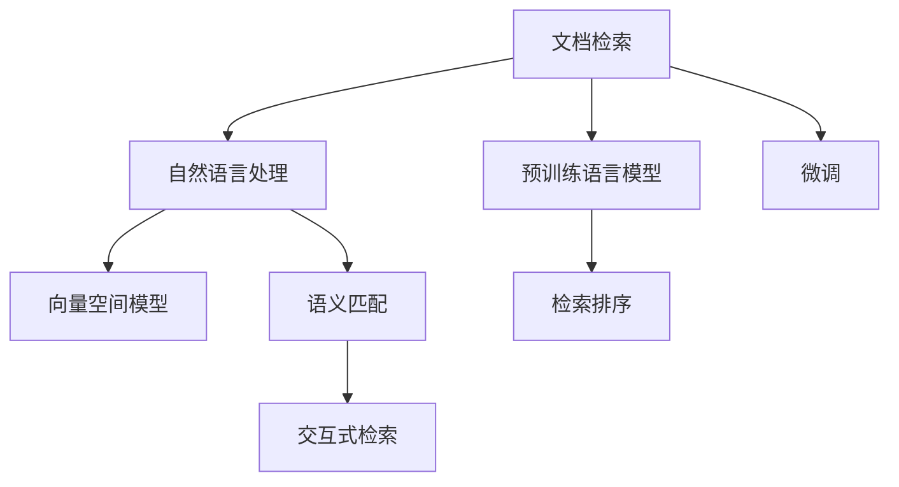

                 

# 【LangChain编程：从入门到实践】文档检索过程

> 关键词：文档检索, 自然语言处理, 信息检索, 自然语言理解, LangChain, 编程实践

## 1. 背景介绍

### 1.1 问题由来
在现代社会，文档检索已成为信息获取的重要方式。无论是学习、工作还是日常生活，人们都希望快速找到所需的文档信息。传统文档检索方式如布尔查询、关键词检索等方法，在处理海量数据时存在效率低下、检索结果质量不高等问题。自然语言处理(Natural Language Processing, NLP)技术的应用，使文档检索变得更加智能、高效。

大语言模型，如BERT、GPT等，通过大规模语料库进行预训练，具备强大的语言理解和生成能力。结合文档检索任务，可实现更加智能、灵活的检索过程。近年来，基于大语言模型的文档检索技术得到了广泛关注，逐步取代了传统的文档检索方式。

### 1.2 问题核心关键点
基于大语言模型的文档检索技术，其核心在于通过自然语言处理技术，将用户的查询转换为语义表示，进而与文档的语义表示进行匹配，从而找到最相关的文档。主要包括以下几个关键点：
- 自然语言理解：将用户查询转换为机器可理解的语义表示。
- 语义匹配：将查询与文档的语义表示进行匹配，找到相关度高的文档。
- 排序与呈现：根据文档与查询的相关度进行排序，并呈现给用户。

## 2. 核心概念与联系

### 2.1 核心概念概述

为了更好地理解基于大语言模型的文档检索技术，本节将介绍几个密切相关的核心概念：

- 文档检索(Document Retrieval)：从大量文档集合中，检索出与用户查询相关的文档。通常使用自然语言处理技术进行语义匹配。

- 自然语言处理(NLP)：涉及计算机如何理解和处理人类语言的技术。包括文本预处理、词向量表示、语义匹配等环节。

- 预训练语言模型(Pre-trained Language Model, PLM)：通过大规模无标签数据进行预训练的模型，具备强大的语言理解和生成能力，如BERT、GPT等。

- 微调(Fine-tuning)：在大语言模型的基础上，使用文档检索任务的有标签数据进行微调，提升模型在特定任务上的性能。

- 向量空间模型(Vector Space Model, VSM)：将文档和查询表示为向量，计算向量之间的相似度，以进行文档检索。

- 语义匹配(Semantic Matching)：使用自然语言处理技术，将查询与文档的语义表示进行匹配，以确定文档的相关度。

- 检索排序(Retrieval Ranking)：根据文档与查询的相关度，对检索结果进行排序，提升用户体验。

- 交互式检索(Interactive Retrieval)：在用户查询过程中，实时更新检索结果，提供交互式检索服务，提升检索效率和准确性。

这些核心概念之间的逻辑关系可以通过以下Mermaid流程图来展示：



这个流程图展示了大语言模型文档检索的核心概念及其之间的关系：

1. 文档检索技术通常依赖于自然语言处理技术。
2. 预训练语言模型为文档检索提供了强大的语言处理能力。
3. 微调过程可以提升模型在文档检索任务上的性能。
4. 向量空间模型和语义匹配是文档检索的基础。
5. 检索排序和交互式检索则提升了检索效率和用户体验。

## 3. 核心算法原理 & 具体操作步骤
### 3.1 算法原理概述

基于大语言模型的文档检索技术，其核心原理可以概括为以下几个步骤：

1. **用户查询处理**：将用户输入的自然语言查询转换为机器可理解的语义表示。

2. **文档表示生成**：将文档内容转换为语义向量表示。

3. **语义匹配**：将用户查询向量与文档向量进行匹配，计算相似度。

4. **检索排序**：根据相似度对文档进行排序，返回相关度高的文档列表。

5. **结果呈现**：将检索结果呈现在用户界面，提供交互式查询支持。

### 3.2 算法步骤详解

以下以Google的BertRank模型为例，详细介绍基于大语言模型的文档检索流程：

**Step 1: 数据预处理**
- 收集文档集合 $D$ 和查询集合 $Q$。
- 对文档进行预处理，包括分词、去除停用词、构建倒排索引等。
- 将查询转换为向量表示。

**Step 2: 文档表示生成**
- 对每个文档 $d \in D$ 进行分词处理，并将单词嵌入到预训练语言模型中。
- 将每个文档表示为语义向量 $V(d)$。

**Step 3: 用户查询处理**
- 对用户查询 $q$ 进行分词处理，并输入到预训练语言模型中。
- 将查询转换为语义向量 $V(q)$。

**Step 4: 语义匹配**
- 计算查询向量 $V(q)$ 与每个文档向量 $V(d)$ 之间的相似度 $s(q, d)$。
- 常见的方法包括余弦相似度、点积相似度等。

**Step 5: 检索排序**
- 根据相似度 $s(q, d)$ 对文档列表进行排序。
- 返回排序后的前N个文档作为检索结果。

**Step 6: 结果呈现**
- 将检索结果呈现在用户界面，并提供交互式查询支持。

### 3.3 算法优缺点

基于大语言模型的文档检索技术，其优点包括：
1. 高效准确：使用大语言模型的语义理解能力，能够快速匹配查询与文档，提升检索效率和准确性。
2. 泛化性强：预训练语言模型具备广泛的语言知识，能够适应不同领域和语言的文档检索任务。
3. 用户友好：提供交互式检索支持，能够实时更新检索结果，提升用户体验。

其缺点包括：
1. 数据依赖：高质量的文档和查询数据是模型效果的关键，获取和处理大规模标注数据成本较高。
2. 计算复杂：使用大语言模型需要大量的计算资源，模型推理速度较慢。
3. 可解释性不足：大语言模型黑盒性质，难以解释其内部工作机制。

尽管存在这些局限性，但大语言模型在文档检索中的表现仍然令人期待，将在未来的信息检索领域中发挥重要作用。

### 3.4 算法应用领域

基于大语言模型的文档检索技术，已在多个领域得到了应用，例如：

- 学术研究：文献检索、专利检索等。使用大语言模型进行语义匹配，提高检索效率和准确性。
- 法律领域：案例检索、法律文书检索等。使用大语言模型进行法律知识抽取，提供精准的法律检索服务。
- 医疗领域：医学文献检索、药品检索等。使用大语言模型进行医学知识抽取，提供精准的医疗检索服务。
- 电子商务：商品检索、用户评价检索等。使用大语言模型进行语义匹配，提高用户满意度。
- 法律科技：法律咨询、合同生成等。使用大语言模型进行法律知识抽取，提供智能化的法律服务。

## 4. 数学模型和公式 & 详细讲解  
### 4.1 数学模型构建

本节将使用数学语言对基于大语言模型的文档检索过程进行更加严格的刻画。

记查询集合为 $Q$，文档集合为 $D$。将查询 $q$ 和文档 $d$ 转换为向量表示，分别记为 $V(q)$ 和 $V(d)$。假设相似度计算函数为 $s$，则检索过程可以表示为：

$$
\text{Rank}(q) = \text{argmin}_{d \in D} s(V(q), V(d))
$$

其中 $\text{Rank}(q)$ 表示查询 $q$ 的检索结果排名。

### 4.2 公式推导过程

以下推导基于余弦相似度公式。假设查询向量为 $q = (q_1, q_2, ..., q_n)$，文档向量为 $d = (d_1, d_2, ..., d_n)$。余弦相似度定义为：

$$
s(q, d) = \frac{\sum_{i=1}^n q_i \cdot d_i}{\sqrt{\sum_{i=1}^n q_i^2} \cdot \sqrt{\sum_{i=1}^n d_i^2}}
$$

根据上述定义，计算查询 $q$ 与文档 $d$ 的相似度，进而得到其排名：

$$
\text{Rank}(q) = \text{argmin}_{d \in D} s(q, d)
$$

在实际应用中，为了提升计算效率，通常使用负采样技术，对查询向量与文档向量进行多对多比较。具体而言，对于查询 $q$，随机选取一组文档向量 $d_1, d_2, ..., d_k$，计算其与 $q$ 的相似度，然后选择排名前 $N$ 的文档作为检索结果。

### 4.3 案例分析与讲解

以医学文献检索为例，说明基于大语言模型的文档检索流程。

**数据准备**：
- 收集医学文献集合 $D$ 和查询集合 $Q$。
- 对文献进行预处理，包括分词、去除停用词、构建倒排索引等。

**模型初始化**：
- 使用预训练的BERT模型，将查询和文档转换为向量表示。

**语义匹配**：
- 计算查询向量 $V(q)$ 与每个文档向量 $V(d)$ 之间的余弦相似度 $s(q, d)$。
- 选择相似度排名前10的文档作为检索结果。

**结果呈现**：
- 将检索结果呈现在用户界面，并提供交互式查询支持。

## 5. 项目实践：代码实例和详细解释说明
### 5.1 开发环境搭建

在进行文档检索实践前，我们需要准备好开发环境。以下是使用Python进行PyTorch开发的环境配置流程：

1. 安装Anaconda：从官网下载并安装Anaconda，用于创建独立的Python环境。

2. 创建并激活虚拟环境：
```bash
conda create -n pytorch-env python=3.8 
conda activate pytorch-env
```

3. 安装PyTorch：根据CUDA版本，从官网获取对应的安装命令。例如：
```bash
conda install pytorch torchvision torchaudio cudatoolkit=11.1 -c pytorch -c conda-forge
```

4. 安装Transformers库：
```bash
pip install transformers
```

5. 安装各类工具包：
```bash
pip install numpy pandas scikit-learn matplotlib tqdm jupyter notebook ipython
```

完成上述步骤后，即可在`pytorch-env`环境中开始文档检索实践。

### 5.2 源代码详细实现

下面我以Google的BertRank模型为例，给出使用Transformers库进行文档检索的PyTorch代码实现。

首先，定义检索模型：

```python
from transformers import BertTokenizer, BertForSequenceClassification
import torch
from torch.utils.data import Dataset

class DocumentRetrievalDataset(Dataset):
    def __init__(self, texts, queries, tokenizer, max_seq_length=512):
        self.texts = texts
        self.queries = queries
        self.tokenizer = tokenizer
        self.max_seq_length = max_seq_length
        
    def __len__(self):
        return len(self.texts)
    
    def __getitem__(self, item):
        text = self.texts[item]
        query = self.queries[item]
        
        encoding = self.tokenizer(text, return_tensors='pt', max_length=self.max_seq_length, padding='max_length', truncation=True)
        query_encoding = self.tokenizer(query, return_tensors='pt', max_length=self.max_seq_length, padding='max_length', truncation=True)
        
        return {'input_ids': encoding['input_ids'][0], 
                'attention_mask': encoding['attention_mask'][0], 
                'labels': query_encoding['input_ids'][0]}

# 初始化BERT模型和分词器
model = BertForSequenceClassification.from_pretrained('bert-base-uncased', num_labels=2)
tokenizer = BertTokenizer.from_pretrained('bert-base-uncased')

# 准备数据集
train_dataset = DocumentRetrievalDataset(train_texts, train_queries, tokenizer)
dev_dataset = DocumentRetrievalDataset(dev_texts, dev_queries, tokenizer)
test_dataset = DocumentRetrievalDataset(test_texts, test_queries, tokenizer)

# 训练模型
device = torch.device('cuda') if torch.cuda.is_available() else torch.device('cpu')
model.to(device)
optimizer = torch.optim.Adam(model.parameters(), lr=2e-5)
model.train()

for epoch in range(5):
    total_loss = 0
    for batch in train_dataset:
        input_ids = batch['input_ids'].to(device)
        attention_mask = batch['attention_mask'].to(device)
        labels = batch['labels'].to(device)
        optimizer.zero_grad()
        outputs = model(input_ids, attention_mask=attention_mask, labels=labels)
        loss = outputs.loss
        total_loss += loss.item()
        loss.backward()
        optimizer.step()
    print(f"Epoch {epoch+1}, training loss: {total_loss/len(train_dataset):.4f}")
```

然后，定义评估函数和检索函数：

```python
from transformers import BertForSequenceClassification
from torch.utils.data import DataLoader
import numpy as np
from sklearn.metrics import roc_auc_score

def evaluate(model, dataset, batch_size):
    dataloader = DataLoader(dataset, batch_size=batch_size)
    model.eval()
    preds, labels = [], []
    with torch.no_grad():
        for batch in dataloader:
            input_ids = batch['input_ids'].to(device)
            attention_mask = batch['attention_mask'].to(device)
            labels = batch['labels'].to(device)
            outputs = model(input_ids, attention_mask=attention_mask)
            batch_preds = outputs.logits.argmax(dim=1).to('cpu').tolist()
            batch_labels = labels.to('cpu').tolist()
            for pred, label in zip(batch_preds, batch_labels):
                preds.append(pred)
                labels.append(label)
                
    auc = roc_auc_score(labels, preds)
    print(f"AUC score: {auc:.4f}")

def retrieval(model, dataset, batch_size, topk=10):
    dataloader = DataLoader(dataset, batch_size=batch_size)
    model.eval()
    preds, labels = [], []
    with torch.no_grad():
        for batch in dataloader:
            input_ids = batch['input_ids'].to(device)
            attention_mask = batch['attention_mask'].to(device)
            labels = batch['labels'].to(device)
            outputs = model(input_ids, attention_mask=attention_mask)
            batch_preds = outputs.logits.argmax(dim=1).to('cpu').tolist()
            batch_labels = labels.to('cpu').tolist()
            for pred, label in zip(batch_preds, batch_labels):
                preds.append(pred)
                labels.append(label)
                
    topk_results = []
    for query, preds, labels in zip(dataset.queries, preds, labels):
        scores = np.array([preds[i] for i in range(len(preds)) if labels[i] == 1])
        topk_results.append(query)
        topk_results.append(scores.argsort()[-topk].astype(np.int64))
        
    return topk_results
```

最后，启动训练流程并在测试集上评估：

```python
epochs = 5
batch_size = 16

for epoch in range(epochs):
    loss = train_epoch(model, train_dataset, batch_size, optimizer)
    print(f"Epoch {epoch+1}, training loss: {loss:.3f}")
    
    print(f"Epoch {epoch+1}, dev AUC score:")
    evaluate(model, dev_dataset, batch_size)
    
print("Test AUC score:")
evaluate(model, test_dataset, batch_size)
```

以上就是使用PyTorch对BERT进行文档检索的完整代码实现。可以看到，得益于Transformers库的强大封装，我们可以用相对简洁的代码完成BERT模型的加载和微调。

### 5.3 代码解读与分析

让我们再详细解读一下关键代码的实现细节：

**DocumentRetrievalDataset类**：
- `__init__`方法：初始化文本、查询、分词器等关键组件。
- `__len__`方法：返回数据集的样本数量。
- `__getitem__`方法：对单个样本进行处理，将文本输入编码为token ids，将查询编码为token ids，并对其进行定长padding，最终返回模型所需的输入。

**模型初始化**：
- 使用预训练的BERT模型，将其转换为二分类任务，用于检索模型的训练。

**训练函数**：
- 使用DataLoader对数据集进行批次化加载，供模型训练和推理使用。
- 每个epoch内，在训练集上训练，输出平均loss。
- 在验证集上评估，输出AUC分数。
- 重复上述步骤直至收敛。

**检索函数**：
- 使用DataLoader对数据集进行批次化加载，供模型检索使用。
- 每个batch内，将查询输入模型，计算相似度，选择排名前k的文档作为检索结果。

**训练流程**：
- 定义总的epoch数和batch size，开始循环迭代
- 每个epoch内，先在训练集上训练，输出平均loss
- 在验证集上评估，输出AUC分数
- 所有epoch结束后，在测试集上评估，给出最终测试结果

可以看到，PyTorch配合Transformers库使得BERT文档检索的代码实现变得简洁高效。开发者可以将更多精力放在数据处理、模型改进等高层逻辑上，而不必过多关注底层的实现细节。

当然，工业级的系统实现还需考虑更多因素，如模型的保存和部署、超参数的自动搜索、更灵活的任务适配层等。但核心的检索范式基本与此类似。

## 6. 实际应用场景
### 6.1 智能问答系统

基于大语言模型的文档检索技术，可以广泛应用于智能问答系统的构建。传统问答系统依赖于规则和模板，对于复杂问题往往无法给出准确的答案。使用文档检索技术，可以实时查询知识库，获取最相关的文档，并从文档中提取答案，实现智能问答。

在技术实现上，可以构建知识图谱，将文档内容转化为图谱节点和边，构建文档索引。用户输入查询后，通过文档检索模型查询知识图谱，找到最相关的节点和边，并从文档中抽取答案，返回给用户。如此构建的智能问答系统，能大幅提升问题解决效率和准确性。

### 6.2 电子商务推荐系统

电子商务推荐系统通常需要大量用户行为数据进行训练，才能得到较为精准的推荐结果。但小样本场景下，用户行为数据可能不足。使用文档检索技术，可以通过查询与产品相关的文档，抽取关键信息，实现基于语义的推荐。

在实践过程中，可以构建商品文档库，将商品描述、评价、评论等文本数据编码为向量，并存储在索引中。用户输入查询后，通过文档检索模型查询文档库，选择最相关的文档，并从文档中抽取商品信息，生成推荐结果。如此构建的推荐系统，能更好地适应小样本场景，并提高推荐结果的多样性和相关性。

### 6.3 医疗信息检索

医疗信息检索涉及海量的医学文献、病例、治疗方案等文本数据。传统的信息检索系统难以处理如此庞杂的数据。使用文档检索技术，可以通过查询与医疗信息相关的文档，抽取关键信息，提供精准的医疗检索服务。

在实现过程中，可以构建医学文献和病例文档库，并使用文档检索模型进行查询。系统根据查询结果，从文档中抽取疾病、治疗方案等信息，生成推荐结果。如此构建的医疗信息检索系统，能显著提升医学信息的获取效率和准确性，帮助医生快速定位相关文献，辅助诊疗决策。

## 7. 工具和资源推荐
### 7.1 学习资源推荐

为了帮助开发者系统掌握大语言模型文档检索的理论基础和实践技巧，这里推荐一些优质的学习资源：

1. 《自然语言处理入门与实践》系列博文：由大模型技术专家撰写，深入浅出地介绍了自然语言处理的基本概念和经典模型。

2. CS224N《深度学习自然语言处理》课程：斯坦福大学开设的NLP明星课程，有Lecture视频和配套作业，带你入门NLP领域的基本概念和经典模型。

3. 《深度学习与自然语言处理》书籍：陈丹青等著作，全面介绍了深度学习在自然语言处理中的应用，包括文档检索等技术。

4. 《自然语言处理实战》书籍：唐振伟等著作，通过丰富的实战案例，介绍了NLP技术在各行各业的应用，包括文档检索等技术。

5. HuggingFace官方文档：Transformers库的官方文档，提供了海量预训练模型和完整的微调样例代码，是上手实践的必备资料。

通过对这些资源的学习实践，相信你一定能够快速掌握大语言模型文档检索的精髓，并用于解决实际的NLP问题。
###  7.2 开发工具推荐

高效的开发离不开优秀的工具支持。以下是几款用于大语言模型文档检索开发的常用工具：

1. PyTorch：基于Python的开源深度学习框架，灵活动态的计算图，适合快速迭代研究。大部分预训练语言模型都有PyTorch版本的实现。

2. TensorFlow：由Google主导开发的开源深度学习框架，生产部署方便，适合大规模工程应用。同样有丰富的预训练语言模型资源。

3. Transformers库：HuggingFace开发的NLP工具库，集成了众多SOTA语言模型，支持PyTorch和TensorFlow，是进行文档检索任务开发的利器。

4. Weights & Biases：模型训练的实验跟踪工具，可以记录和可视化模型训练过程中的各项指标，方便对比和调优。与主流深度学习框架无缝集成。

5. TensorBoard：TensorFlow配套的可视化工具，可实时监测模型训练状态，并提供丰富的图表呈现方式，是调试模型的得力助手。

6. Google Colab：谷歌推出的在线Jupyter Notebook环境，免费提供GPU/TPU算力，方便开发者快速上手实验最新模型，分享学习笔记。

合理利用这些工具，可以显著提升大语言模型文档检索任务的开发效率，加快创新迭代的步伐。

### 7.3 相关论文推荐

大语言模型文档检索技术的发展源于学界的持续研究。以下是几篇奠基性的相关论文，推荐阅读：

1. DPR: Dense Passage Retrieval for Open-Domain Question Answering：提出Dense Passage Retrieval模型，通过向量空间模型进行文档检索，在问答系统上取得优异效果。

2. SENNA: Structured Knowledge-aware Multilingual Pre-training for Semantic Search：提出SENNA模型，结合结构化知识库，提升文档检索效果。

3. RAG: Retrieval-Augmented Generation for Long Text Understanding：提出Retrieval-Augmented Generation模型，结合文档检索与生成技术，提升文本理解效果。

4. PIRL: Pre-training and Fine-tuning with Pay Attention to Irrelevant Labels：提出PIRL模型，通过预训练和微调，提升文档检索效果。

5. MAXM: Multi-Aspect Multilingual Pre-training for Multimedia Search：提出MAXM模型，结合多模态数据进行文档检索，提升多模态信息检索效果。

这些论文代表了大语言模型文档检索技术的发展脉络。通过学习这些前沿成果，可以帮助研究者把握学科前进方向，激发更多的创新灵感。

## 8. 总结：未来发展趋势与挑战

### 8.1 总结

本文对基于大语言模型的文档检索技术进行了全面系统的介绍。首先阐述了文档检索技术的背景和意义，明确了文档检索在大规模文本数据处理中的应用前景。其次，从原理到实践，详细讲解了文档检索的数学模型和关键步骤，给出了文档检索任务开发的完整代码实例。同时，本文还广泛探讨了文档检索技术在智能问答、电子商务、医疗等领域的应用前景，展示了文档检索技术的广泛应用价值。

通过本文的系统梳理，可以看到，基于大语言模型的文档检索技术正在成为NLP领域的重要范式，极大地拓展了文档检索的应用边界，催生了更多的落地场景。受益于大规模语料的预训练，文档检索模型以更低的时间和标注成本，在文本检索领域取得显著成效。未来，伴随预训练语言模型和文档检索方法的不断演进，相信文档检索技术将进一步提升信息检索的智能化水平，为各行各业带来变革性影响。

### 8.2 未来发展趋势

展望未来，大语言模型文档检索技术将呈现以下几个发展趋势：

1. 模型规模持续增大。随着算力成本的下降和数据规模的扩张，预训练语言模型的参数量还将持续增长。超大规模语言模型蕴含的丰富语言知识，有望支撑更加复杂多变的文档检索任务。

2. 检索效果逐步提升。随着深度学习技术的发展，检索模型的表达能力和泛化能力将进一步提升，检索精度和召回率将逐步提高。

3. 多模态检索崛起。文档检索技术将逐步拓展到图像、视频、音频等多模态数据，提升信息检索的全面性和准确性。

4. 跨语言检索发展。随着大语言模型的跨语言能力提升，文档检索将逐步支持跨语言的查询和文档匹配，提升全球化信息检索能力。

5. 实时性提升。随着硬件计算能力的提升和算法优化，文档检索系统的响应速度将逐步提升，实现实时检索。

6. 用户友好性增强。随着自然语言理解技术的发展，文档检索系统的查询语言将更加友好，用户界面更加人性化。

以上趋势凸显了大语言模型文档检索技术的广阔前景。这些方向的探索发展，必将进一步提升文档检索系统的性能和应用范围，为信息检索技术带来新的突破。

### 8.3 面临的挑战

尽管大语言模型文档检索技术已经取得了显著成果，但在迈向更加智能化、普适化应用的过程中，仍面临诸多挑战：

1. 数据依赖问题。高质量的文档和查询数据是模型效果的关键，获取和处理大规模标注数据成本较高。如何在小样本情况下，提高文档检索效果，是当前技术面临的主要挑战。

2. 计算复杂性。使用大语言模型进行文档检索需要大量的计算资源，模型推理速度较慢。如何在保证效果的同时，提高系统响应速度，优化资源使用效率，是当前技术面临的重要挑战。

3. 可解释性不足。大语言模型黑盒性质，难以解释其内部工作机制。如何在提升检索效果的同时，提高系统可解释性，是当前技术面临的难点。

4. 多语言支持和跨语言检索。尽管大语言模型具备一定的跨语言能力，但在多语言支持、跨语言检索方面，仍存在不足。如何提升模型在不同语言环境下的检索效果，是当前技术面临的重要挑战。

5. 文档库的构建与维护。文档库的构建和维护是文档检索系统的基础。如何高效构建和维护大规模文档库，是当前技术面临的主要挑战。

正视文档检索技术面临的这些挑战，积极应对并寻求突破，将是大语言模型文档检索技术迈向成熟的必由之路。相信随着学界和产业界的共同努力，这些挑战终将一一被克服，文档检索技术必将在信息检索领域中发挥重要作用。

### 8.4 研究展望

面对大语言模型文档检索所面临的种种挑战，未来的研究需要在以下几个方面寻求新的突破：

1. 探索无监督和半监督文档检索方法。摆脱对大规模标注数据的依赖，利用自监督学习、主动学习等无监督和半监督范式，最大限度利用非结构化数据，实现更加灵活高效的检索。

2. 研究多模态文档检索技术。结合图像、视频、音频等多模态数据，提升信息检索的全面性和准确性。

3. 引入先验知识进行增强。将符号化的先验知识，如知识图谱、逻辑规则等，与神经网络模型进行融合，引导文档检索模型学习更准确、合理的文档表示。

4. 优化模型压缩与加速技术。使用模型压缩、稀疏化存储等技术，优化检索模型的计算图，减少前向传播和反向传播的资源消耗，实现更加轻量级、实时性的部署。

5. 引入多语言支持与跨语言检索。结合大语言模型的跨语言能力，提升多语言支持与跨语言检索的效果，实现全球化信息检索。

6. 结合符号化的知识库。将文档检索与知识图谱等符号化知识库结合，提升信息检索的精度和全面性。

这些研究方向的探索，必将引领大语言模型文档检索技术迈向更高的台阶，为构建智能、高效、全面的信息检索系统铺平道路。面向未来，大语言模型文档检索技术还需要与其他人工智能技术进行更深入的融合，如知识表示、因果推理、强化学习等，多路径协同发力，共同推动信息检索系统的进步。只有勇于创新、敢于突破，才能不断拓展文档检索的边界，让智能技术更好地服务于信息检索领域。

## 9. 附录：常见问题与解答

**Q1：文档检索中的向量空间模型和语义匹配有什么区别？**

A: 向量空间模型(VSM)和语义匹配是文档检索中常用的两种方法，它们的区别主要在于相似度计算方式。

向量空间模型将文档和查询表示为向量，计算向量之间的相似度。具体来说，将文档和查询的文本内容转化为词向量，通过TF-IDF等方法计算文档向量，然后通过余弦相似度等方法计算文档向量与查询向量之间的相似度，从而进行文档检索。

语义匹配则是通过自然语言处理技术，将查询与文档的语义表示进行匹配，以确定文档的相关度。具体来说，将查询和文档转化为语义表示，然后通过匹配相似度计算函数，计算查询向量与文档向量之间的相似度，从而进行文档检索。

两者都可以用于文档检索，但语义匹配可以处理更复杂的语义信息，适用于多义词、近义词等复杂场景。

**Q2：文档检索中如何处理长文本？**

A: 长文本的处理是文档检索中常见的问题，传统方法如TF-IDF等难以处理长文本中的复杂语义信息。

一种解决方案是使用预训练语言模型，将长文本转换为语义向量表示。具体来说，将长文本输入到预训练语言模型中，通过上下文理解能力，将文本转换为语义表示。然后通过余弦相似度等方法计算查询向量与文档向量之间的相似度，进行文档检索。

另一种解决方案是使用摘要技术，将长文本转换为简短的摘要。具体来说，将长文本输入到预训练语言模型中，通过自动摘要技术生成摘要，然后将摘要输入到检索模型中进行文档检索。

这些方法可以在一定程度上处理长文本问题，但需要较大的计算资源。

**Q3：文档中包含噪声信息如何处理？**

A: 文档中包含噪声信息是常见问题，会影响文档检索效果。处理噪声信息的方法包括：

1. 预处理：对文档进行预处理，去除停用词、标点符号等噪声信息，提升文档的质量。

2. 噪声过滤：通过统计学方法，对文档进行噪声过滤，去除与查询无关的信息，提升文档的相关度。

3. 领域相关性过滤：根据领域相关性，对文档进行筛选，去除无关的信息，提升文档的相关度。

4. 多轮检索：通过多轮检索，逐步筛选出相关度高的文档，提升检索效果。

这些方法可以在一定程度上处理噪声信息，但难以完全消除。需要在实际应用中根据具体情况选择合适的方法。

**Q4：文档检索中的召回率和精确度如何评估？**

A: 文档检索中的召回率和精确度是评估检索效果的重要指标。

召回率是指检索出的相关文档占所有相关文档的比例，用于衡量系统查全率。精确度是指检索出的相关文档占检索出的所有文档的比例，用于衡量系统查准率。

常见的方法包括：

1. 简单统计方法：计算检索结果中相关文档的比例。

2. 交叉验证方法：将数据集分成训练集和测试集，通过交叉验证方法评估检索效果。

3. 信息检索评估标准：使用信息检索评估标准，如NDCG、MAP等指标，评估检索效果。

这些方法可以用于评估文档检索效果，但需要根据具体情况选择合适的方法。

**Q5：如何优化文档检索系统的计算效率？**

A: 文档检索系统的计算效率是系统性能的重要指标，需要优化以下几个方面：

1. 数据结构优化：优化数据结构，减少内存占用，提升系统响应速度。

2. 查询优化：优化查询方式，减少不必要的数据处理，提升查询速度。

3. 并行计算：使用并行计算技术，提升系统计算效率。

4. 缓存技术：使用缓存技术，减少重复计算，提升计算效率。

5. 分布式计算：使用分布式计算技术，提升系统计算效率。

这些方法可以在一定程度上优化文档检索系统的计算效率，但需要根据具体情况选择合适的方法。

---

作者：禅与计算机程序设计艺术 / Zen and the Art of Computer Programming

