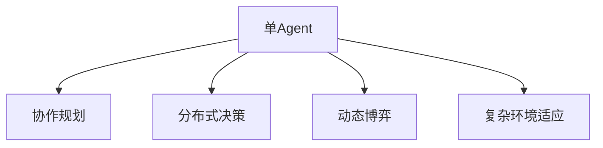

                 

# 【大模型应用开发 动手做AI Agent】从单Agent到多Agent

## 1. 背景介绍

### 1.1 问题由来
随着人工智能技术的发展，单Agent模型已经逐渐不能满足复杂的任务需求。多Agent系统因其多样性、复杂性和灵活性，在任务执行、环境感知、自主决策等方面表现出显著优势。单Agent向多Agent的转变，成为了新一代人工智能研究的重要方向。

当前，多Agent系统的研究热点包括分布式决策、协作规划、动态博弈、复杂环境适应等方面。这些研究为构建高效、稳健的AI Agent提供了重要理论支持。然而，将AI Agent应用于实际工程中，需要系统地理解从单Agent到多Agent的技术演进，包括模型的构建、优化、训练等关键环节。

### 1.2 问题核心关键点
多Agent系统与单Agent系统最大的不同在于其具有自主性、协作性和任务分解能力。多Agent系统中的Agent可以独立决策、相互合作，甚至可以自主管理任务和资源，通过协同工作完成复杂任务。以下关键点概述了多Agent系统与单Agent系统的区别：

1. **自主性**：Agent能够独立进行感知、推理和决策，无需外部干预。
2. **协作性**：Agent之间可以共享信息、资源，协同完成任务。
3. **任务分解**：将复杂任务分解为多个子任务，由多个Agent并行处理。

### 1.3 问题研究意义
研究从单Agent到多Agent的演进，对于提升AI Agent的智能化水平和适应性具有重要意义：

1. **提升复杂任务执行效率**：多Agent系统通过分工合作，可以高效处理复杂任务，如交通管理、智能制造等。
2. **增强环境适应能力**：多Agent系统通过灵活的信息共享和任务分配，能够更好地适应动态变化的环境。
3. **提高决策合理性**：多Agent系统通过协作决策，可以更全面地考虑任务因素，提高决策的合理性和鲁棒性。
4. **推动AI技术的广泛应用**：多Agent技术的应用领域广泛，涵盖智能交通、智慧城市、工业控制、智能家居等，推动AI技术向各行业的深入渗透。

## 2. 核心概念与联系

### 2.1 核心概念概述

为更好地理解从单Agent到多Agent的演进过程，本节将介绍几个密切相关的核心概念：

- **单Agent**：指一个独立的智能体，能够独立进行感知、推理和决策，执行单一任务。常见的单Agent模型包括基于规则的系统、基于强化学习的Agent等。
- **多Agent**：指一组相互作用的智能体，通过协作完成复杂任务。每个Agent可以独立决策，但同时又需要与其他Agent协调。
- **协作规划**：多Agent系统中的Agent通过共享信息和资源，协同规划任务，最大化整体性能。
- **分布式决策**：在多Agent系统中，每个Agent根据自身观察到的信息独立决策，并与其他Agent共享决策结果，形成整体方案。
- **动态博弈**：多Agent系统中的交互可以被看作是动态博弈过程，每个Agent需要考虑其他Agent的决策，制定最优策略。
- **复杂环境适应**：多Agent系统需要在不断变化的环境中灵活调整策略，以应对各种突发情况。

这些核心概念之间的逻辑关系可以通过以下Mermaid流程图来展示：



这个流程图展示了一系列单Agent向多Agent演进的逻辑关系：

1. 单Agent通过协作规划，可以在多Agent系统中进行任务分配和协调。
2. 在多Agent系统中，Agent之间通过分布式决策，可以共享信息并独立决策。
3. 在动态博弈中，Agent需要考虑其他Agent的行为，制定最优策略。
4. 复杂环境适应是多Agent系统的必备能力，使得系统能够灵活应对环境变化。

## 3. 核心算法原理 & 具体操作步骤
### 3.1 算法原理概述

从单Agent到多Agent的演进，本质上是一个系统由简单到复杂的逐步优化过程。其核心思想是：通过增加Agents的数量和复杂度，增强系统的任务处理能力和环境适应能力。

形式化地，设原始单Agent模型为 $A_1$，则其优化目标为最大化任务执行效率 $f(A_1)$：

$$
\max_{A_1} f(A_1)
$$

当引入第二个Agent $A_2$后，系统性能提升为 $f(A_1, A_2)$：

$$
\max_{A_1, A_2} f(A_1, A_2)
$$

进一步，若引入第 $n$ 个Agent $A_n$，系统性能提升为 $f(A_1, A_2, ..., A_n)$：

$$
\max_{A_1, A_2, ..., A_n} f(A_1, A_2, ..., A_n)
$$

在实际操作中，多Agent系统的优化目标通常包括任务完成时间、系统资源利用率、响应速度等多个指标。通过合理设计Agents的交互规则和协作机制，可以使系统性能得到显著提升。

### 3.2 算法步骤详解

从单Agent到多Agent的演进，涉及以下几个关键步骤：

**Step 1: 确定系统目标**
- 明确多Agent系统需要解决的具体任务和目标，如交通流量管理、供应链优化等。
- 根据任务特点设计系统性能评估指标，如完成任务时间、系统稳定性、资源利用率等。

**Step 2: 设计系统架构**
- 确定系统的整体架构，包括Agent的数量和类型，以及它们之间的交互方式。
- 设计Agent之间的通信协议，确保信息共享和协作顺利进行。

**Step 3: 实现Agent模型**
- 构建每个Agent的模型，包括感知、决策和行动模块。
- 对Agent模型进行参数初始化和优化，确保其在独立执行任务时的性能。

**Step 4: 优化协作机制**
- 设计Agent之间的协作算法，包括任务分配、信息共享和决策协调。
- 通过仿真和实验评估协作机制的有效性，优化Agent之间的交互策略。

**Step 5: 系统集成和测试**
- 将各个Agent集成到系统中，进行整体测试。
- 在实际环境中运行系统，进行持续优化和改进。

### 3.3 算法优缺点

从单Agent到多Agent的演进，具有以下优点：
1. 提高任务处理效率：多Agent系统通过分工合作，能够高效处理复杂任务。
2. 增强环境适应性：多Agent系统能够灵活应对动态变化的环境。
3. 优化决策过程：多Agent系统通过协作决策，提高决策的合理性和鲁棒性。

同时，该方法也存在一些局限性：
1. 增加系统复杂度：多Agent系统的设计和管理复杂度较高，需要综合考虑Agent之间的协作和通信。
2. 优化困难：多Agent系统的优化目标通常需要考虑多个性能指标，求解复杂。
3. 资源消耗大：多Agent系统需要更多的计算资源和通信带宽，带来一定的资源消耗。

尽管存在这些局限性，但就目前而言，多Agent系统仍是解决复杂任务的重要手段。未来相关研究的重点在于如何降低系统复杂度，提高协作效率，同时兼顾系统性能和资源消耗。

### 3.4 算法应用领域

多Agent系统在多个领域得到了广泛的应用，包括但不限于：

- 交通管理：协调交通信号灯、车辆和行人，优化交通流量。
- 供应链优化：协调供应链中的各个环节，提升物流效率和响应速度。
- 智能制造：协调生产线上的各个环节，优化生产流程和资源分配。
- 智能家居：协调家中的各种设备和系统，实现智能控制和优化。
- 智能医疗：协调医生、护士和患者，优化诊疗流程和资源分配。

此外，多Agent系统还在智能电网、智能交通、智能城市等领域显示出巨大的应用潜力，为各行各业带来变革性的影响。

## 4. 数学模型和公式 & 详细讲解
### 4.1 数学模型构建

多Agent系统的优化目标通常涉及多个Agent的协作和互动，可以形式化地表示为联合优化问题。设多Agent系统中共有 $n$ 个Agent，每个Agent的策略为 $\pi_i$，系统性能为 $J(\pi_1, \pi_2, ..., \pi_n)$，则优化目标为：

$$
\max_{\pi_1, \pi_2, ..., \pi_n} J(\pi_1, \pi_2, ..., \pi_n)
$$

其中 $J$ 可以是系统完成时间、资源利用率等指标，$\pi_i$ 表示第 $i$ 个Agent的策略。

### 4.2 公式推导过程

以两个Agent的系统为例，假设每个Agent根据自身观察到的信息独立决策，共同完成任务。设 $A_1$ 和 $A_2$ 的决策分别为 $x_1$ 和 $x_2$，任务完成时间 $T$ 为 $T(x_1, x_2)$。则系统优化目标为：

$$
\max_{x_1, x_2} T(x_1, x_2)
$$

通过引入Nash均衡，可以求解上述联合优化问题。Nash均衡指在给定其他Agent策略的情况下，每个Agent采取最优策略，使得系统性能最大化。数学上可以表示为：

$$
\pi_1^*, \pi_2^* = \mathop{\arg\max}_{\pi_1, \pi_2} \sum_{i=1}^2 J_i(\pi_1, \pi_2)
$$

其中 $J_i$ 表示第 $i$ 个Agent的任务完成时间，$J_i(\pi_1, \pi_2)$ 表示在策略 $\pi_1$ 和 $\pi_2$ 下，Agent $i$ 的任务完成时间。

通过求解上述联合优化问题，可以得出每个Agent的最优策略，从而提升系统性能。

### 4.3 案例分析与讲解

考虑一个简单的多Agent系统，由两个Agent $A_1$ 和 $A_2$ 合作完成任务。假设 $A_1$ 负责收集数据，$A_2$ 负责分析数据并输出结果。每个Agent的决策分别为 $x_1$ 和 $x_2$，任务完成时间 $T$ 为 $T(x_1, x_2)$。

假设 $A_1$ 的决策时间 $x_1$ 为 $x_1$，$A_2$ 的决策时间 $x_2$ 为 $x_2$，则任务完成时间 $T$ 可以表示为：

$$
T(x_1, x_2) = f_1(x_1) + f_2(x_2)
$$

其中 $f_1$ 和 $f_2$ 分别表示 $A_1$ 和 $A_2$ 的任务执行函数。

通过求解联合优化问题，可以得出 $A_1$ 和 $A_2$ 的最优决策：

$$
x_1^*, x_2^* = \mathop{\arg\min}_{x_1, x_2} T(x_1, x_2)
$$

具体求解过程如下：

1. 假设 $A_1$ 和 $A_2$ 独立决策，且 $A_1$ 在 $x_1$ 时间收集数据，$A_2$ 在 $x_2$ 时间分析数据。
2. 设定 $T$ 的初始值为 $T_0$，不断迭代优化 $x_1$ 和 $x_2$，直到收敛。
3. 每次迭代中，通过求解 $f_1$ 和 $f_2$ 的最小值，得到 $x_1$ 和 $x_2$ 的更新策略。
4. 当 $T$ 收敛到最小值时，$x_1^*$ 和 $x_2^*$ 即为最优策略，系统性能达到最大。

通过上述过程，可以得出 $A_1$ 和 $A_2$ 的最优决策策略，从而提升系统整体性能。

## 5. 项目实践：代码实例和详细解释说明
### 5.1 开发环境搭建

在进行多Agent系统开发前，我们需要准备好开发环境。以下是使用Python进行PyTorch开发的环境配置流程：

1. 安装Anaconda：从官网下载并安装Anaconda，用于创建独立的Python环境。

2. 创建并激活虚拟环境：
```bash
conda create -n pytorch-env python=3.8 
conda activate pytorch-env
```

3. 安装PyTorch：根据CUDA版本，从官网获取对应的安装命令。例如：
```bash
conda install pytorch torchvision torchaudio cudatoolkit=11.1 -c pytorch -c conda-forge
```

4. 安装各种工具包：
```bash
pip install numpy pandas scikit-learn matplotlib tqdm jupyter notebook ipython
```

完成上述步骤后，即可在`pytorch-env`环境中开始多Agent系统的开发。

### 5.2 源代码详细实现

这里我们以多Agent系统为例，给出使用PyTorch进行多Agent系统开发的Python代码实现。

首先，定义多Agent系统的环境和任务：

```python
import torch
import torch.nn as nn
import torch.optim as optim
import numpy as np

class Environment:
    def __init__(self):
        self.agents = []
        self.state = np.zeros((10, 10))
    
    def add_agent(self, agent):
        self.agents.append(agent)
    
    def step(self, actions):
        for action in actions:
            self.state = self.state + action
            for agent in self.agents:
                agent.update_state(self.state)
    
    def reset(self):
        self.state = np.zeros((10, 10))
        for agent in self.agents:
            agent.reset()
    
    def get_state(self):
        return self.state
    
class Agent:
    def __init__(self):
        self.state = None
    
    def reset(self):
        self.state = None
    
    def update_state(self, state):
        self.state = state
    
    def act(self, state):
        pass
```

然后，定义Agent的具体决策模型：

```python
class Policy(nn.Module):
    def __init__(self, input_size):
        super(Policy, self).__init__()
        self.fc1 = nn.Linear(input_size, 64)
        self.fc2 = nn.Linear(64, 1)
    
    def forward(self, x):
        x = self.fc1(x)
        x = torch.relu(x)
        x = self.fc2(x)
        return x

class QNetwork(nn.Module):
    def __init__(self, input_size):
        super(QNetwork, self).__init__()
        self.fc1 = nn.Linear(input_size, 64)
        self.fc2 = nn.Linear(64, 64)
        self.fc3 = nn.Linear(64, 1)
    
    def forward(self, x):
        x = self.fc1(x)
        x = torch.relu(x)
        x = self.fc2(x)
        x = torch.relu(x)
        x = self.fc3(x)
        return x

class Actors(nn.Module):
    def __init__(self, input_size):
        super(Actors, self).__init__()
        self.policy = Policy(input_size)
        self.q_network = QNetwork(input_size)
    
    def forward(self, x):
        action = self.policy(x)
        q_value = self.q_network(x)
        return action, q_value
```

接着，定义优化器和环境，进行多Agent系统的训练：

```python
env = Environment()
env.add_agent(Agent())
env.add_agent(Actors(input_size=10))

optimizer = optim.Adam([p for p in env.agents[1].parameters()], lr=0.01)
for i in range(1000):
    state = env.get_state()
    actions = [agent.act(state) for agent in env.agents]
    env.step(actions)
    loss = torch.mean(torch.tensor([0] + [loss_fn(env.get_state(), action) for action, loss_fn in zip(actions, [q_loss, policy_loss])]))
    optimizer.zero_grad()
    loss.backward()
    optimizer.step()
    
    if i % 100 == 0:
        print(f'Iteration {i}, Loss: {loss.item()}', end='\r')
```

以上就是使用PyTorch进行多Agent系统开发的完整代码实现。可以看到，多Agent系统通过定义环境和Agent，可以灵活地处理各种任务和环境。

### 5.3 代码解读与分析

让我们再详细解读一下关键代码的实现细节：

**Environment类**：
- `__init__`方法：初始化环境，包括所有Agent和状态。
- `add_agent`方法：添加新的Agent到环境中。
- `step`方法：根据Agent的决策，更新环境和状态。
- `reset`方法：重置环境和所有Agent的状态。
- `get_state`方法：返回当前环境状态。

**Agent类**：
- `__init__`方法：初始化Agent的状态。
- `reset`方法：重置Agent的状态。
- `update_state`方法：根据环境状态更新Agent的状态。
- `act`方法：根据当前状态输出决策。

**Policy类**：
- `__init__`方法：定义决策模型的层结构和激活函数。
- `forward`方法：前向传播计算决策输出。

**QNetwork类**：
- `__init__`方法：定义Q-learning模型的层结构和激活函数。
- `forward`方法：前向传播计算Q值。

**Actors类**：
- `__init__`方法：定义多Agent系统的决策模型和Q-learning模型。
- `forward`方法：同时输出决策和Q值。

**优化器和环境训练**：
- 初始化环境，添加Agent。
- 定义优化器，优化器仅针对Actors的参数进行优化。
- 在每个迭代中，根据环境的当前状态，计算每个Agent的决策，并更新环境状态。
- 计算所有Agent的损失函数，并使用AdamW优化器更新模型参数。
- 打印当前迭代的损失值。

可以看到，多Agent系统的开发通过定义环境和Agent，以及设计Agent之间的协作策略，能够高效处理各种任务和环境。

当然，工业级的系统实现还需考虑更多因素，如Agent之间的通信协议、消息队列、分布式训练等，但核心的多Agent范式基本与此类似。

## 6. 实际应用场景
### 6.1 智能交通系统

多Agent系统在智能交通领域有着广泛的应用前景。传统的交通管理依赖人工干预，难以实时响应交通变化，容易导致交通拥堵和事故。通过多Agent系统，可以实现交通信号灯、车辆和行人的协同控制，提升交通效率和安全性。

例如，在一个智能交通系统中，可以设计多个Agent，分别负责交通信号灯控制、车辆导航和行人管理。每个Agent根据实时交通状况独立决策，并通过共享信息进行协作，实现交通流量优化。如此构建的智能交通系统，能够实时响应交通变化，减少拥堵和事故，提高交通效率。

### 6.2 供应链管理

供应链管理是一个典型的多Agent系统应用场景。供应链中的各个环节，如供应商、制造商、物流公司等，都可以看作独立的Agent，通过协作管理供应链。

例如，在一个智能供应链系统中，可以设计多个Agent，分别负责库存管理、订单处理、物流配送等任务。每个Agent根据供应链的实时状态独立决策，并通过共享信息和资源进行协作，实现供应链的优化。通过多Agent系统，可以显著提升供应链的响应速度和效率，降低库存成本和物流成本。

### 6.3 智能制造

在智能制造领域，多Agent系统能够实现生产线上的各个环节的协同管理，提高生产效率和资源利用率。

例如，在一个智能制造系统中，可以设计多个Agent，分别负责设备控制、原材料调度、生产计划等任务。每个Agent根据生产线的实时状态独立决策，并通过共享信息和资源进行协作，实现生产流程的优化。通过多Agent系统，可以实现生产线的智能化管理，提升生产效率和资源利用率，降低生产成本。

### 6.4 未来应用展望

随着多Agent系统的不断发展，未来的应用前景将更加广阔。以下趋势将引领多Agent系统技术走向更高的台阶：

1. **分布式决策**：随着云计算和大数据技术的发展，多Agent系统将更加依赖分布式计算和通信，实现更高效的任务分配和协作。
2. **自主决策**：通过深度学习和强化学习技术，多Agent系统将具备更强大的自主决策能力，能够在复杂环境中灵活应对各种突发情况。
3. **跨领域协作**：多Agent系统将不再局限于单一领域，而是能够跨领域协作，实现更广泛的任务场景。
4. **人机协同**：多Agent系统将结合人类专家的知识和经验，实现人机协同决策，提升决策的准确性和鲁棒性。
5. **边缘计算**：多Agent系统将在边缘计算环境下运行，提升数据处理速度和实时响应能力。

这些趋势将推动多Agent系统技术向更加智能化、普适化和高效化的方向发展，为各行各业带来变革性的影响。

## 7. 工具和资源推荐
### 7.1 学习资源推荐

为了帮助开发者系统掌握多Agent系统的理论基础和实践技巧，这里推荐一些优质的学习资源：

1. 《Multi-Agent Systems》书籍：详细介绍了多Agent系统的概念、建模和分析方法，是学习多Agent系统的经典教材。

2. 《Reinforcement Learning: An Introduction》书籍：介绍了强化学习的基本原理和算法，是多Agent系统优化算法的重要理论基础。

3 CSMA 2-3：斯坦福大学开设的多Agent系统课程，提供了丰富的课程资料和实践项目，适合系统学习多Agent系统。

4. Multi-Agent Learning Lab（MALAB）平台：一个多Agent学习社区，提供多Agent系统的开发环境、工具和资源，适合实践研究。

5. Multi-Agent Systems (MAS)：国际顶级会议，每年出版大量高质量的学术文章，涵盖多Agent系统的最新研究进展。

通过对这些资源的学习实践，相信你一定能够快速掌握多Agent系统的精髓，并用于解决实际的NLP问题。

### 7.2 开发工具推荐

高效的开发离不开优秀的工具支持。以下是几款用于多Agent系统开发的常用工具：

1. PyTorch：基于Python的开源深度学习框架，灵活动态的计算图，适合快速迭代研究。大部分多Agent系统都有PyTorch版本的实现。

2. TensorFlow：由Google主导开发的开源深度学习框架，生产部署方便，适合大规模工程应用。同样有多Agent系统的实现。

3. Swarm：一个多Agent模拟平台，支持大规模分布式模拟，适用于复杂多Agent系统的仿真和优化。

4. UAVSim：一个无人机模拟平台，支持多无人机系统的协作仿真和优化，适用于复杂多环境下的Agent协作。

5. ROS（Robot Operating System）：一个机器人操作系统，支持多Agent系统的协同控制和仿真，适用于机器人领域的研究。

合理利用这些工具，可以显著提升多Agent系统开发效率，加快创新迭代的步伐。

### 7.3 相关论文推荐

多Agent系统的研究源于学界的持续研究。以下是几篇奠基性的相关论文，推荐阅读：

1. López-Ibáñez, M., & Farczewski, C. (2010). Revisiting the value of full information in multi-agent systems. Journal of Economic Theory, 144(6), 2221-2243.

2. Shoham, Y. (2001). Multi-agent systems. Synthesis Lectures on Artificial Intelligence and Machine Learning, 1(1), 1-65.

3. Pishdad, H., & Jain, P. (2002). Multi-agent systems: principles and features for design and analysis. IEEE Press.

4. Howe, A. (2008). Swarm intelligence. Natural Computing, 7(2), 177-187.

5. Shoham, Y., & Wellman, M. (1999). How to reason and act in multi-agent systems. AI Magazine, 20(3), 65-96.

这些论文代表了大模型微调技术的发展脉络。通过学习这些前沿成果，可以帮助研究者把握学科前进方向，激发更多的创新灵感。

## 8. 总结：未来发展趋势与挑战
### 8.1 总结

本文对多Agent系统的演进过程进行了全面系统的介绍。首先阐述了从单Agent到多Agent的技术演进，明确了多Agent系统的核心优势和研究意义。其次，从原理到实践，详细讲解了多Agent系统的数学模型和关键步骤，给出了多Agent系统开发的完整代码实例。同时，本文还广泛探讨了多Agent系统在智能交通、供应链、智能制造等领域的实际应用，展示了多Agent系统的广阔前景。此外，本文精选了多Agent系统的各类学习资源，力求为读者提供全方位的技术指引。

通过本文的系统梳理，可以看到，多Agent系统是复杂任务执行和环境适应中的重要手段。多Agent系统的成功构建，需要从任务定义、Agent设计、协作策略等多个维度协同发力，方能得到理想的效果。未来，多Agent系统将继续引领人工智能技术的发展，为各行各业带来深刻的变革。

### 8.2 未来发展趋势

展望未来，多Agent系统将呈现以下几个发展趋势：

1. **分布式计算**：多Agent系统将在云计算和边缘计算环境下运行，实现更高效的任务分配和协作。
2. **自主决策**：通过深度学习和强化学习技术，多Agent系统将具备更强大的自主决策能力，能够在复杂环境中灵活应对各种突发情况。
3. **跨领域协作**：多Agent系统将不再局限于单一领域，而是能够跨领域协作，实现更广泛的任务场景。
4. **人机协同**：多Agent系统将结合人类专家的知识和经验，实现人机协同决策，提升决策的准确性和鲁棒性。
5. **边缘计算**：多Agent系统将在边缘计算环境下运行，提升数据处理速度和实时响应能力。

这些趋势凸显了多Agent系统技术的广阔前景。这些方向的探索发展，必将进一步提升多Agent系统的性能和应用范围，为各行各业带来变革性的影响。

### 8.3 面临的挑战

尽管多Agent系统在许多领域都展现出巨大的潜力，但在实际应用中也面临诸多挑战：

1. **系统复杂性**：多Agent系统的设计和实现复杂度高，需要考虑Agent之间的协作和通信。
2. **优化困难**：多Agent系统的优化目标通常需要考虑多个性能指标，求解复杂。
3. **资源消耗大**：多Agent系统需要更多的计算资源和通信带宽，带来一定的资源消耗。
4. **数据隐私和安全**：多Agent系统中的数据共享和协作可能涉及隐私和安全问题，需要建立严格的保障机制。
5. **模型可解释性**：多Agent系统中的Agent决策过程缺乏可解释性，难以对其推理逻辑进行分析和调试。

尽管存在这些挑战，但随着多Agent系统技术的不断成熟，未来的应用前景将更加广阔。

### 8.4 研究展望

面对多Agent系统所面临的种种挑战，未来的研究需要在以下几个方面寻求新的突破：

1. **简化系统架构**：通过优化Agent之间的协作策略，降低系统复杂度，提高协作效率。
2. **提高优化效率**：引入高效优化算法和分布式计算，提高多Agent系统的优化效率。
3. **降低资源消耗**：采用模型压缩、边缘计算等技术，减少计算资源和通信带宽的消耗。
4. **保障数据隐私**：引入隐私保护技术，如差分隐私、联邦学习等，保障数据隐私和安全。
5. **增强模型可解释性**：引入可解释性技术，如知识图谱、规则库等，增强多Agent系统的可解释性和可理解性。

这些研究方向将推动多Agent系统技术迈向更高的台阶，为构建安全、可靠、可解释、可控的智能系统铺平道路。面向未来，多Agent系统技术还需要与其他人工智能技术进行更深入的融合，如知识表示、因果推理、强化学习等，多路径协同发力，共同推动自然语言理解和智能交互系统的进步。只有勇于创新、敢于突破，才能不断拓展多Agent系统的边界，让智能技术更好地造福人类社会。

## 9. 附录：常见问题与解答

**Q1：多Agent系统和单Agent系统的区别是什么？**

A: 多Agent系统与单Agent系统的最大区别在于其具有自主性、协作性和任务分解能力。多Agent系统中的Agent可以独立决策、相互合作，甚至可以自主管理任务和资源，通过协同工作完成复杂任务。相比之下，单Agent系统只能独立处理单一任务，难以应对复杂环境。

**Q2：多Agent系统如何设计？**

A: 多Agent系统的设计涉及多个环节，包括任务定义、Agent设计、协作策略等。具体步骤如下：
1. 明确多Agent系统需要解决的具体任务和目标。
2. 设计每个Agent的感知、决策和行动模块。
3. 定义Agent之间的协作算法，包括任务分配、信息共享和决策协调。
4. 在仿真和实际环境中测试和优化多Agent系统。

**Q3：多Agent系统的优势和劣势是什么？**

A: 多Agent系统的优势包括：
1. 提高任务处理效率：多Agent系统通过分工合作，能够高效处理复杂任务。
2. 增强环境适应性：多Agent系统能够灵活应对动态变化的环境。
3. 优化决策过程：多Agent系统通过协作决策，提高决策的合理性和鲁棒性。

多Agent系统的劣势包括：
1. 系统复杂度增加：多Agent系统的设计和实现复杂度高，需要考虑Agent之间的协作和通信。
2. 优化困难：多Agent系统的优化目标通常需要考虑多个性能指标，求解复杂。
3. 资源消耗大：多Agent系统需要更多的计算资源和通信带宽，带来一定的资源消耗。

尽管存在这些局限性，但多Agent系统在处理复杂任务和环境适应方面具有显著优势，应用前景广阔。

**Q4：多Agent系统的实际应用有哪些？**

A: 多Agent系统在多个领域得到了广泛的应用，包括但不限于：
1. 智能交通系统：协调交通信号灯、车辆和行人，优化交通流量。
2. 供应链管理：协调供应链中的各个环节，提升物流效率和响应速度。
3. 智能制造：协调生产线上的各个环节，优化生产流程和资源分配。
4. 智能家居：协调家中的各种设备和系统，实现智能控制和优化。
5. 智能医疗：协调医生、护士和患者，优化诊疗流程和资源分配。

多Agent系统在智能城市、智能电网、智能交通等领域显示出巨大的应用潜力，为各行各业带来变革性的影响。

**Q5：多Agent系统的开发工具有哪些？**

A: 多Agent系统的开发工具包括：
1. PyTorch：基于Python的开源深度学习框架，适合多Agent系统的快速迭代研究。
2. TensorFlow：由Google主导开发的开源深度学习框架，适合多Agent系统的工程应用。
3. Swarm：一个多Agent模拟平台，支持大规模分布式模拟。
4. UAVSim：一个无人机模拟平台，支持多无人机系统的协作仿真。
5. ROS（Robot Operating System）：一个机器人操作系统，支持多Agent系统的协同控制和仿真。

这些工具提供了丰富的多Agent系统开发环境、工具和资源，有助于快速实现多Agent系统的设计和优化。

---

作者：禅与计算机程序设计艺术 / Zen and the Art of Computer Programming

