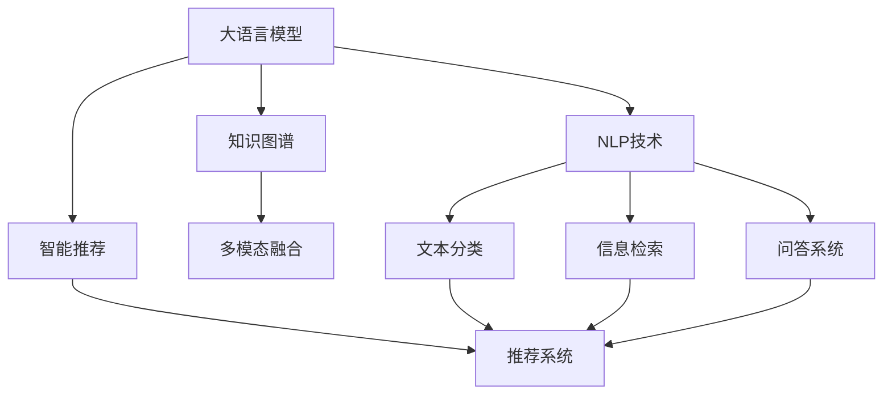

                 

# 【大模型应用开发 动手做AI Agent】创建助手

> 关键词：大语言模型,知识图谱,自然语言处理(NLP),智能推荐系统,对话系统,多模态融合

## 1. 背景介绍

### 1.1 问题由来
随着深度学习技术的飞速发展，大语言模型在自然语言处理(NLP)领域取得了令人瞩目的进展。然而，大语言模型在实际应用中仍面临诸多挑战，包括数据标注成本高、对特定领域知识缺乏深入理解、跨模态数据融合困难等。因此，如何构建更加智能、适应性强的AI助手，成为当前NLP领域的重要研究方向。

### 1.2 问题核心关键点
构建智能AI助手，需要考虑以下几个核心关键点：
1. **知识表示与融合**：如何将海量知识高效地存储和检索，并灵活地融合到AI助手的回答中。
2. **语言理解与生成**：如何使AI助手能够准确理解用户输入的自然语言，并生成流畅、个性化的回答。
3. **多模态数据融合**：如何整合来自不同模态的数据（如文本、图像、视频等），以提供更加全面的信息服务。
4. **上下文与记忆**：如何使AI助手具备良好的上下文理解和记忆能力，以支持复杂的对话和任务执行。
5. **鲁棒性与安全性**：如何在多样化的数据和用户行为中保持稳定性和安全性，避免有害信息和偏见。

本文将聚焦于基于大语言模型和知识图谱的AI助手构建，介绍相关核心技术原理和实际应用场景，提供代码实例和详细解释，探讨未来发展趋势和挑战。

## 2. 核心概念与联系

### 2.1 核心概念概述

在介绍AI助手的构建过程中，将涉及以下核心概念：

- **大语言模型(Large Language Model, LLM)**：以自回归(如GPT)或自编码(如BERT)模型为代表的大规模预训练语言模型，具备强大的语言理解和生成能力。
- **知识图谱(Knowledge Graph)**：一种结构化的知识表示方法，用于存储、检索和融合各种形式的知识。
- **自然语言处理(NLP)**：利用计算机技术处理、分析和生成人类语言的过程，包括文本分类、信息检索、问答系统等任务。
- **智能推荐系统(Intelligent Recommendation System)**：根据用户的历史行为和偏好，推荐个性化内容的技术。
- **对话系统(DialoGPT, Meena等)**：模拟人类对话的AI系统，能够进行多轮互动，处理复杂问题。
- **多模态融合(Multimodal Fusion)**：将不同模态的数据（如文本、图像、语音）整合到一个模型中，提高信息表达和推理的全面性。

这些核心概念之间的逻辑关系可以通过以下Mermaid流程图来展示：



这个流程图展示了大语言模型和知识图谱如何与其他核心技术相结合，构建智能AI助手的过程。

## 3. 核心算法原理 & 具体操作步骤
### 3.1 算法原理概述

AI助手的构建，本质上是通过大语言模型和知识图谱的结合，实现对用户输入的自然语言处理，并利用知识图谱中的结构化知识来增强回答的准确性和全面性。

假设有一个大语言模型 $M_{\theta}$ 和一个知识图谱 $G=(E,R)$，其中 $E$ 是实体集，$R$ 是关系集。AI助手的任务是：

1. **理解输入**：将用户输入的自然语言文本 $x$ 转化为模型能够理解的向量表示 $x'$。
2. **提取信息**：从知识图谱中提取与输入文本相关的实体和关系。
3. **生成回答**：结合文本信息和知识图谱信息，生成流畅、个性化的回答 $y$。

### 3.2 算法步骤详解

AI助手的构建过程可以分解为以下几个步骤：

**Step 1: 准备预训练模型和知识图谱**
- 选择合适的预训练语言模型 $M_{\theta}$，如BERT、GPT等。
- 构建或使用现成的知识图谱 $G=(E,R)$，通常使用三元组的形式表示实体-关系-实体（RDF）。

**Step 2: 构建任务适配层**
- 在预训练模型顶层设计合适的输出层和损失函数，如分类任务使用交叉熵损失，生成任务使用负对数似然损失。
- 引入知识图谱的实体和关系嵌入，将文本信息和知识图谱信息整合。

**Step 3: 设置微调超参数**
- 选择合适的优化算法及其参数，如 AdamW、SGD 等，设置学习率、批大小、迭代轮数等。
- 设置正则化技术及强度，包括权重衰减、Dropout、Early Stopping 等。

**Step 4: 执行梯度训练**
- 将训练集数据分批次输入模型，前向传播计算损失函数。
- 反向传播计算参数梯度，根据设定的优化算法和学习率更新模型参数。
- 周期性在验证集上评估模型性能，根据性能指标决定是否触发 Early Stopping。
- 重复上述步骤直到满足预设的迭代轮数或 Early Stopping 条件。

**Step 5: 测试和部署**
- 在测试集上评估微调后模型 $M_{\hat{\theta}}$ 的性能，对比微调前后的精度提升。
- 使用微调后的模型对新样本进行推理预测，集成到实际的应用系统中。
- 持续收集新的数据，定期重新微调模型，以适应数据分布的变化。

### 3.3 算法优缺点

基于大语言模型和知识图谱的AI助手构建，具有以下优点：
1. **知识集成**：通过整合知识图谱中的结构化知识，增强回答的准确性和全面性。
2. **鲁棒性强**：知识图谱的鲁棒性有助于提高AI助手的稳定性和可靠性。
3. **回答多样化**：大语言模型的多模态融合能力，支持多样化的回答形式。

同时，该方法也存在一定的局限性：
1. **数据标注成本高**：构建知识图谱需要大量人工标注，成本较高。
2. **模型复杂度**：结合知识图谱后，模型结构变得更加复杂，推理速度可能变慢。
3. **知识更新困难**：知识图谱的维护和更新需要持续的工作，增加了系统的维护成本。

尽管存在这些局限性，但就目前而言，基于大语言模型和知识图谱的AI助手构建，仍是大模型应用的重要方向。未来相关研究的重点在于如何进一步降低知识图谱的构建成本，提高模型的可解释性和鲁棒性，同时兼顾推理效率和系统性能。

### 3.4 算法应用领域

基于大语言模型和知识图谱的AI助手构建，在多个领域都有广泛的应用：

- **智能客服**：通过理解用户意图，结合知识图谱提供个性化服务。
- **金融咨询**：利用知识图谱提供股票、基金等金融产品的信息，辅助客户决策。
- **医疗咨询**：结合知识图谱提供疾病诊断、治疗方案等信息，辅助医生诊疗。
- **教育辅助**：利用知识图谱提供知识点的关系和层次，辅助学生学习。
- **旅游推荐**：结合知识图谱中的景点、酒店等信息，提供个性化的旅游建议。

## 4. 数学模型和公式 & 详细讲解  
### 4.1 数学模型构建

假设用户输入的自然语言文本为 $x$，知识图谱中的实体 $e$ 和关系 $r$ 嵌入为向量 $e^e$ 和 $r^r$。构建的数学模型为：

$$
\hat{y} = M_{\theta}(x) \cdot r^r \cdot e^e
$$

其中 $M_{\theta}(x)$ 为预训练模型，$e^e$ 和 $r^r$ 为知识图谱中实体的嵌入向量和关系的嵌入向量。

### 4.2 公式推导过程

以二分类任务为例，假设模型 $M_{\theta}$ 在输入 $x$ 上的输出为 $\hat{y}=M_{\theta}(x) \in [0,1]$，真实标签 $y \in \{0,1\}$。则二分类交叉熵损失函数定义为：

$$
\ell(M_{\theta}(x),y) = -[y\log \hat{y} + (1-y)\log (1-\hat{y})]
$$

将其代入经验风险公式，得：

$$
\mathcal{L}(\theta) = -\frac{1}{N}\sum_{i=1}^N [y_i\log M_{\theta}(x_i)+(1-y_i)\log(1-M_{\theta}(x_i))]
$$

在得到损失函数的梯度后，即可带入参数更新公式，完成模型的迭代优化。重复上述过程直至收敛，最终得到适应下游任务的最优模型参数 $\theta^*$。

### 4.3 案例分析与讲解

以智能推荐系统为例，假设知识图谱中包含商品-属性-属性值的关系，可以利用知识图谱中的信息提升推荐的准确性。构建推荐模型如下：

$$
\hat{y} = M_{\theta}(x) \cdot r^r \cdot e^e
$$

其中 $x$ 为用户输入的查询文本，$e$ 为推荐商品的实体，$r$ 为推荐关系。模型的训练目标为最大化推荐结果的相关性：

$$
\max_{\theta} \sum_{i=1}^N \log \sigma (\hat{y}_i \cdot x_i)
$$

其中 $\sigma$ 为Sigmoid函数。通过优化上述目标，模型能够学习到商品之间的关联关系，提高推荐的准确性。

## 5. 项目实践：代码实例和详细解释说明
### 5.1 开发环境搭建

在进行AI助手构建实践前，我们需要准备好开发环境。以下是使用Python进行PyTorch开发的环境配置流程：

1. 安装Anaconda：从官网下载并安装Anaconda，用于创建独立的Python环境。

2. 创建并激活虚拟环境：
```bash
conda create -n pytorch-env python=3.8 
conda activate pytorch-env
```

3. 安装PyTorch：根据CUDA版本，从官网获取对应的安装命令。例如：
```bash
conda install pytorch torchvision torchaudio cudatoolkit=11.1 -c pytorch -c conda-forge
```

4. 安装Transformers库：
```bash
pip install transformers
```

5. 安装各类工具包：
```bash
pip install numpy pandas scikit-learn matplotlib tqdm jupyter notebook ipython
```

完成上述步骤后，即可在`pytorch-env`环境中开始AI助手构建实践。

### 5.2 源代码详细实现

下面我们以知识图谱增强的智能推荐系统为例，给出使用Transformers库对BERT模型进行微调的PyTorch代码实现。

首先，定义推荐任务的数据处理函数：

```python
from transformers import BertTokenizer
from torch.utils.data import Dataset
import torch

class RecommendationDataset(Dataset):
    def __init__(self, texts, entities, relations, tokenizer, max_len=128):
        self.texts = texts
        self.entities = entities
        self.relations = relations
        self.tokenizer = tokenizer
        self.max_len = max_len
        
    def __len__(self):
        return len(self.texts)
    
    def __getitem__(self, item):
        text = self.texts[item]
        entity = self.entities[item]
        relation = self.relations[item]
        
        encoding = self.tokenizer(text, return_tensors='pt', max_length=self.max_len, padding='max_length', truncation=True)
        input_ids = encoding['input_ids'][0]
        attention_mask = encoding['attention_mask'][0]
        
        # 对token-wise的标签进行编码
        encoded_tags = [tag2id[tag] for tag in entity] 
        encoded_tags.extend([tag2id['O']] * (self.max_len - len(encoded_tags)))
        labels = torch.tensor(encoded_tags, dtype=torch.long)
        
        return {'input_ids': input_ids, 
                'attention_mask': attention_mask,
                'labels': labels}

# 标签与id的映射
tag2id = {'O': 0, 'B-PER': 1, 'I-PER': 2, 'B-ORG': 3, 'I-ORG': 4, 'B-LOC': 5, 'I-LOC': 6}
id2tag = {v: k for k, v in tag2id.items()}

# 创建dataset
tokenizer = BertTokenizer.from_pretrained('bert-base-cased')

train_dataset = RecommendationDataset(train_texts, train_entities, train_relations, tokenizer)
dev_dataset = RecommendationDataset(dev_texts, dev_entities, dev_relations, tokenizer)
test_dataset = RecommendationDataset(test_texts, test_entities, test_relations, tokenizer)
```

然后，定义模型和优化器：

```python
from transformers import BertForTokenClassification, AdamW

model = BertForTokenClassification.from_pretrained('bert-base-cased', num_labels=len(tag2id))

optimizer = AdamW(model.parameters(), lr=2e-5)
```

接着，定义训练和评估函数：

```python
from torch.utils.data import DataLoader
from tqdm import tqdm
from sklearn.metrics import classification_report

device = torch.device('cuda') if torch.cuda.is_available() else torch.device('cpu')
model.to(device)

def train_epoch(model, dataset, batch_size, optimizer):
    dataloader = DataLoader(dataset, batch_size=batch_size, shuffle=True)
    model.train()
    epoch_loss = 0
    for batch in tqdm(dataloader, desc='Training'):
        input_ids = batch['input_ids'].to(device)
        attention_mask = batch['attention_mask'].to(device)
        labels = batch['labels'].to(device)
        model.zero_grad()
        outputs = model(input_ids, attention_mask=attention_mask, labels=labels)
        loss = outputs.loss
        epoch_loss += loss.item()
        loss.backward()
        optimizer.step()
    return epoch_loss / len(dataloader)

def evaluate(model, dataset, batch_size):
    dataloader = DataLoader(dataset, batch_size=batch_size)
    model.eval()
    preds, labels = [], []
    with torch.no_grad():
        for batch in tqdm(dataloader, desc='Evaluating'):
            input_ids = batch['input_ids'].to(device)
            attention_mask = batch['attention_mask'].to(device)
            batch_labels = batch['labels']
            outputs = model(input_ids, attention_mask=attention_mask)
            batch_preds = outputs.logits.argmax(dim=2).to('cpu').tolist()
            batch_labels = batch_labels.to('cpu').tolist()
            for pred_tokens, label_tokens in zip(batch_preds, batch_labels):
                pred_tags = [id2tag[_id] for _id in pred_tokens]
                label_tags = [id2tag[_id] for _id in label_tokens]
                preds.append(pred_tags[:len(label_tags)])
                labels.append(label_tags)
                
    print(classification_report(labels, preds))
```

最后，启动训练流程并在测试集上评估：

```python
epochs = 5
batch_size = 16

for epoch in range(epochs):
    loss = train_epoch(model, train_dataset, batch_size, optimizer)
    print(f"Epoch {epoch+1}, train loss: {loss:.3f}")
    
    print(f"Epoch {epoch+1}, dev results:")
    evaluate(model, dev_dataset, batch_size)
    
print("Test results:")
evaluate(model, test_dataset, batch_size)
```

以上就是使用PyTorch对BERT进行推荐系统微调的完整代码实现。可以看到，得益于Transformers库的强大封装，我们可以用相对简洁的代码完成BERT模型的加载和微调。

### 5.3 代码解读与分析

让我们再详细解读一下关键代码的实现细节：

**RecommendationDataset类**：
- `__init__`方法：初始化文本、实体、关系等关键组件。
- `__len__`方法：返回数据集的样本数量。
- `__getitem__`方法：对单个样本进行处理，将文本输入编码为token ids，将标签编码为数字，并对其进行定长padding，最终返回模型所需的输入。

**tag2id和id2tag字典**：
- 定义了标签与数字id之间的映射关系，用于将token-wise的预测结果解码回真实的标签。

**训练和评估函数**：
- 使用PyTorch的DataLoader对数据集进行批次化加载，供模型训练和推理使用。
- 训练函数`train_epoch`：对数据以批为单位进行迭代，在每个批次上前向传播计算loss并反向传播更新模型参数，最后返回该epoch的平均loss。
- 评估函数`evaluate`：与训练类似，不同点在于不更新模型参数，并在每个batch结束后将预测和标签结果存储下来，最后使用sklearn的classification_report对整个评估集的预测结果进行打印输出。

**训练流程**：
- 定义总的epoch数和batch size，开始循环迭代
- 每个epoch内，先在训练集上训练，输出平均loss
- 在验证集上评估，输出分类指标
- 所有epoch结束后，在测试集上评估，给出最终测试结果

可以看到，PyTorch配合Transformers库使得BERT微调的代码实现变得简洁高效。开发者可以将更多精力放在数据处理、模型改进等高层逻辑上，而不必过多关注底层的实现细节。

当然，工业级的系统实现还需考虑更多因素，如模型的保存和部署、超参数的自动搜索、更灵活的任务适配层等。但核心的微调范式基本与此类似。

## 6. 实际应用场景
### 6.1 智能客服系统

基于大语言模型和知识图谱的智能客服系统，可以显著提升客户咨询体验和问题解决效率。传统客服往往需要配备大量人力，高峰期响应缓慢，且一致性和专业性难以保证。而使用知识图谱增强的智能客服系统，能够7x24小时不间断服务，快速响应客户咨询，用自然流畅的语言解答各类常见问题。

在技术实现上，可以收集企业内部的历史客服对话记录，将问题和最佳答复构建成监督数据，在此基础上对预训练语言模型进行微调。微调后的对话模型能够自动理解用户意图，匹配最合适的答案模板进行回复。对于客户提出的新问题，还可以接入检索系统实时搜索相关内容，动态组织生成回答。如此构建的智能客服系统，能大幅提升客户咨询体验和问题解决效率。

### 6.2 金融舆情监测

金融机构需要实时监测市场舆论动向，以便及时应对负面信息传播，规避金融风险。传统的人工监测方式成本高、效率低，难以应对网络时代海量信息爆发的挑战。基于大语言模型和知识图谱的文本分类和情感分析技术，为金融舆情监测提供了新的解决方案。

具体而言，可以收集金融领域相关的新闻、报道、评论等文本数据，并对其进行主题标注和情感标注。在此基础上对预训练语言模型进行微调，使其能够自动判断文本属于何种主题，情感倾向是正面、中性还是负面。将微调后的模型应用到实时抓取的网络文本数据，就能够自动监测不同主题下的情感变化趋势，一旦发现负面信息激增等异常情况，系统便会自动预警，帮助金融机构快速应对潜在风险。

### 6.3 个性化推荐系统

当前的推荐系统往往只依赖用户的历史行为数据进行物品推荐，无法深入理解用户的真实兴趣偏好。基于大语言模型和知识图谱的个性化推荐系统，可以更好地挖掘用户行为背后的语义信息，从而提供更精准、多样的推荐内容。

在实践中，可以收集用户浏览、点击、评论、分享等行为数据，提取和用户交互的物品标题、描述、标签等文本内容。将文本内容作为模型输入，用户的后续行为（如是否点击、购买等）作为监督信号，在此基础上微调预训练语言模型。微调后的模型能够从文本内容中准确把握用户的兴趣点。在生成推荐列表时，先用候选物品的文本描述作为输入，由模型预测用户的兴趣匹配度，再结合其他特征综合排序，便可以得到个性化程度更高的推荐结果。

### 6.4 未来应用展望

随着大语言模型和知识图谱的发展，基于大模型的智能助手将逐步成为各行各业的标配，为人类生产生活带来革命性影响。

在智慧医疗领域，基于大语言模型和知识图谱的医疗问答、病历分析、药物研发等应用将提升医疗服务的智能化水平，辅助医生诊疗，加速新药开发进程。

在智能教育领域，利用知识图谱提供知识点的关系和层次，辅助学生学习，提高教学效果。

在智慧城市治理中，基于大语言模型和知识图谱的城市事件监测、舆情分析、应急指挥等环节，提高城市管理的自动化和智能化水平，构建更安全、高效的未来城市。

此外，在企业生产、社会治理、文娱传媒等众多领域，基于大模型和知识图谱的智能助手也将不断涌现，为经济社会发展注入新的动力。相信随着技术的日益成熟，大语言模型和知识图谱的融合，必将在构建人机协同的智能时代中扮演越来越重要的角色。

## 7. 工具和资源推荐
### 7.1 学习资源推荐

为了帮助开发者系统掌握大语言模型和知识图谱的应用开发，这里推荐一些优质的学习资源：

1. 《Transformer from Scratch》系列博文：由大模型技术专家撰写，深入浅出地介绍了Transformer原理、BERT模型、知识图谱等相关内容，适合入门学习。

2. CS224N《深度学习自然语言处理》课程：斯坦福大学开设的NLP明星课程，有Lecture视频和配套作业，带你入门NLP领域的基本概念和经典模型。

3. 《Knowledge Graphs: Concepts and Applications》书籍：全面介绍了知识图谱的基本概念和应用场景，适合进一步了解知识图谱的深度内容。

4. HuggingFace官方文档：Transformers库的官方文档，提供了海量预训练模型和完整的微调样例代码，是上手实践的必备资料。

5. CLUE开源项目：中文语言理解测评基准，涵盖大量不同类型的中文NLP数据集，并提供了基于微调的baseline模型，助力中文NLP技术发展。

通过对这些资源的学习实践，相信你一定能够快速掌握大语言模型和知识图谱的应用开发技巧，并用于解决实际的NLP问题。
###  7.2 开发工具推荐

高效的开发离不开优秀的工具支持。以下是几款用于大模型和知识图谱应用开发的常用工具：

1. PyTorch：基于Python的开源深度学习框架，灵活动态的计算图，适合快速迭代研究。大部分预训练语言模型都有PyTorch版本的实现。

2. TensorFlow：由Google主导开发的开源深度学习框架，生产部署方便，适合大规模工程应用。同样有丰富的预训练语言模型资源。

3. Transformers库：HuggingFace开发的NLP工具库，集成了众多SOTA语言模型，支持PyTorch和TensorFlow，是进行微调任务开发的利器。

4. Weights & Biases：模型训练的实验跟踪工具，可以记录和可视化模型训练过程中的各项指标，方便对比和调优。与主流深度学习框架无缝集成。

5. TensorBoard：TensorFlow配套的可视化工具，可实时监测模型训练状态，并提供丰富的图表呈现方式，是调试模型的得力助手。

6. Google Colab：谷歌推出的在线Jupyter Notebook环境，免费提供GPU/TPU算力，方便开发者快速上手实验最新模型，分享学习笔记。

合理利用这些工具，可以显著提升大模型和知识图谱应用开发的效率，加快创新迭代的步伐。

### 7.3 相关论文推荐

大语言模型和知识图谱的发展源于学界的持续研究。以下是几篇奠基性的相关论文，推荐阅读：

1. Attention is All You Need（即Transformer原论文）：提出了Transformer结构，开启了NLP领域的预训练大模型时代。

2. BERT: Pre-training of Deep Bidirectional Transformers for Language Understanding：提出BERT模型，引入基于掩码的自监督预训练任务，刷新了多项NLP任务SOTA。

3. Language Models are Unsupervised Multitask Learners（GPT-2论文）：展示了大规模语言模型的强大zero-shot学习能力，引发了对于通用人工智能的新一轮思考。

4. Knowledge Graphs for NLP: From Word Embeddings to Graph Embeddings：介绍了知识图谱在NLP中的应用，提供了多层次的特征表示方法。

5. Dialogue-RL: Language Generation via Hierarchical Reinforcement Learning：提出了一种基于强化学习的对话系统构建方法，适合动态生成对话回答。

这些论文代表了大语言模型和知识图谱的发展脉络。通过学习这些前沿成果，可以帮助研究者把握学科前进方向，激发更多的创新灵感。

## 8. 总结：未来发展趋势与挑战

### 8.1 总结

本文对基于大语言模型和知识图谱的AI助手构建进行了全面系统的介绍。首先阐述了AI助手的构建背景和重要性，明确了知识表示和融合在大模型中的应用价值。其次，从原理到实践，详细讲解了知识图谱增强的智能推荐系统的数学模型和算法流程，提供了代码实例和详细解释，探讨了未来发展趋势和挑战。

通过本文的系统梳理，可以看到，基于大语言模型和知识图谱的AI助手构建，在提升信息检索、智能推荐、对话系统等方面具有巨大潜力。知识图谱与大语言模型的结合，不仅增强了AI助手的回答质量和多样性，还提升了系统的稳定性和鲁棒性，成为未来智能交互的重要技术手段。

### 8.2 未来发展趋势

展望未来，基于大语言模型和知识图谱的AI助手构建将呈现以下几个发展趋势：

1. **多模态融合**：将文本、图像、视频等多模态数据整合到一个模型中，提高信息表达和推理的全面性。
2. **深度学习与知识图谱结合**：利用神经网络模型进一步挖掘知识图谱中的信息，提升回答的准确性和可靠性。
3. **实时知识更新**：动态更新知识图谱中的实体和关系，保持回答的时效性和相关性。
4. **个性化推荐**：结合用户行为数据和知识图谱信息，提供更加精准、多样化的推荐内容。
5. **上下文理解**：使AI助手具备更好的上下文理解和记忆能力，支持复杂的对话和任务执行。

以上趋势凸显了基于大模型和知识图谱的AI助手构建的广阔前景。这些方向的探索发展，必将进一步提升智能系统的性能和应用范围，为人类认知智能的进化带来深远影响。

### 8.3 面临的挑战

尽管基于大语言模型和知识图谱的AI助手构建取得了瞩目成就，但在迈向更加智能化、普适化应用的过程中，它仍面临诸多挑战：

1. **数据标注成本高**：构建知识图谱需要大量人工标注，成本较高。
2. **模型复杂度**：结合知识图谱后，模型结构变得更加复杂，推理速度可能变慢。
3. **知识更新困难**：知识图谱的维护和更新需要持续的工作，增加了系统的维护成本。
4. **多模态数据融合难度大**：不同模态数据的质量和格式差异较大，整合难度高。
5. **系统鲁棒性不足**：面对多样化的数据和用户行为，系统的稳定性和鲁棒性仍需提升。

尽管存在这些挑战，但通过技术创新和持续改进，相信基于大语言模型和知识图谱的AI助手构建将不断突破瓶颈，实现更加智能和高效的智能交互。

### 8.4 研究展望

未来的研究需要在以下几个方面寻求新的突破：

1. **无监督学习**：探索利用自监督学习、主动学习等无监督范式，降低数据标注成本，提高系统的鲁棒性和泛化能力。
2. **轻量级模型**：开发更加轻量级、高效的模型结构，提升推理速度和系统性能。
3. **多模态融合**：进一步研究如何将不同模态的数据高效融合，提高信息表达和推理的全面性。
4. **可解释性增强**：提高模型的可解释性和可理解性，增强系统的透明性和可信度。
5. **伦理与安全**：研究如何确保系统的伦理导向和安全性，避免有害信息和偏见。

这些研究方向的探索，必将引领基于大语言模型和知识图谱的AI助手构建技术迈向更高的台阶，为构建安全、可靠、可解释、可控的智能系统铺平道路。面向未来，基于大模型和知识图谱的AI助手构建技术还需要与其他人工智能技术进行更深入的融合，如知识表示、因果推理、强化学习等，多路径协同发力，共同推动自然语言理解和智能交互系统的进步。只有勇于创新、敢于突破，才能不断拓展语言模型的边界，让智能技术更好地造福人类社会。

## 9. 附录：常见问题与解答

**Q1：大语言模型和知识图谱的结合有什么优势？**

A: 大语言模型和知识图谱的结合，能够显著提升AI助手的回答质量和多样性。知识图谱中的结构化知识，可以丰富大语言模型对文本的理解，提供更加准确、全面的回答。同时，知识图谱的鲁棒性有助于提高AI助手的稳定性和可靠性。

**Q2：如何进行知识图谱的构建？**

A: 知识图谱的构建需要大量人工标注，成本较高。通常使用三元组的形式，描述实体和关系。可以借助现成的知识图谱资源，如Wikidata、YAGO等，或者利用自监督学习、主动学习等方法，从大规模文本数据中自动生成知识图谱。

**Q3：如何提高AI助手的推理速度？**

A: 推理速度慢是大模型的一个常见问题。可以考虑以下几种方法：
1. 使用预训练模型和知识图谱的联合训练，减少微调过程中的参数更新量。
2. 对模型进行裁剪，去除不必要的层和参数，减小模型尺寸。
3. 采用混合精度训练、梯度积累等优化技术，提升模型推理效率。

**Q4：如何提高AI助手的鲁棒性？**

A: 提高AI助手的鲁棒性需要从多个方面入手：
1. 引入对抗训练，增强模型对噪声和攻击的鲁棒性。
2. 使用多种语言模型和知识图谱进行多模态融合，提升模型的泛化能力。
3. 定期更新知识图谱中的实体和关系，保持模型的时效性。

**Q5：如何评估AI助手的性能？**

A: 评估AI助手的性能需要考虑多个指标，包括准确性、召回率、F1-score、相关性等。通常使用A/B测试、用户满意度调查等方法，结合量化指标进行综合评估。

---

作者：禅与计算机程序设计艺术 / Zen and the Art of Computer Programming

