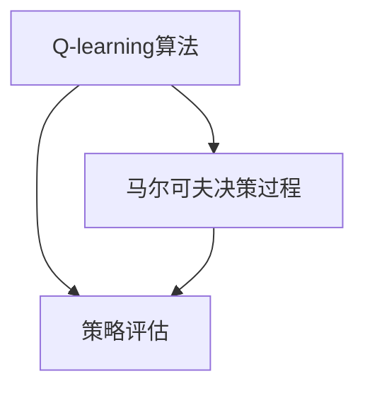
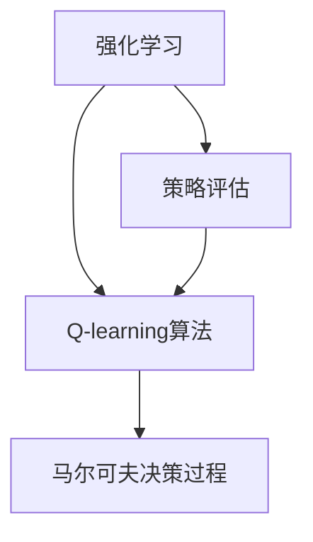

                 

# 一切皆是映射：AI Q-learning在压力测试中的应用

> 关键词：强化学习，Q-learning，策略评估，压力测试，马尔可夫决策过程，行为模拟，应用场景

## 1. 背景介绍

### 1.1 问题由来

随着人工智能（AI）技术的发展，强化学习（Reinforcement Learning, RL）作为一种能够解决复杂环境、动态变化问题的机器学习方法，引起了广泛关注。在金融、网络安全、智能推荐等多个领域，强化学习算法被广泛应用于决策优化、行为模拟等任务中。然而，尽管强化学习技术日渐成熟，但在实际应用中，依然存在许多挑战。

其中，如何有效地评估强化学习算法的性能，尤其是在训练过程中，如何保证策略的稳定性和鲁棒性，是一个长期存在的问题。传统的基于试错的方法（如蒙特卡罗方法），由于时间开销大、效率低，已难以适应当前大环境和大规模问题的需求。

为解决这一问题，学术界提出了多种新方法。例如，基于蒙特卡罗方法的各种改进，如时间差分学习（Temporal Difference Learning, TD），以及最新的价值迭代（Value Iteration）方法等。然而，这些方法往往只适用于小规模问题，难以直接应用于复杂系统。

因此，探索新的强化学习评估方法，特别是在大规模、高复杂性系统中的有效应用，成为一个重要的研究方向。

### 1.2 问题核心关键点

为了解决强化学习模型性能评估的问题，研究者提出了一种基于Q-learning的策略评估方法。该方法基于Q-learning算法，通过模拟环境，对模型的行为进行实时评估和优化。它结合了强化学习的动态特性和静态评估的特点，为复杂系统的决策优化提供了新的思路。

该方法的关键点包括：

- **Q-learning算法**：一种通过试错学习最优策略的强化学习算法。
- **策略评估**：通过对模型的行为进行实时评估，指导策略的调整和优化。
- **马尔可夫决策过程（MDP）**：一种数学模型，用于描述系统的动态特性和决策过程。

这些核心概念之间的逻辑关系可以通过以下Mermaid流程图来展示：



这个流程图展示了大语言模型的核心概念及其之间的关系：

1. Q-learning算法为策略评估提供基本理论框架。
2. 策略评估通过对模型行为的实时评估，指导Q-learning算法优化策略。
3. MDP模型为Q-learning和策略评估提供数学依据，描述系统的动态特性和决策过程。

这些概念共同构成了基于Q-learning的策略评估方法的理论基础。

## 2. 核心概念与联系

### 2.1 核心概念概述

为更好地理解基于Q-learning的策略评估方法，本节将介绍几个密切相关的核心概念：

- **Q-learning算法**：一种通过试错学习最优策略的强化学习算法。其核心思想是通过环境反馈，不断调整策略，使累积奖励最大化。
- **策略评估**：通过模拟环境，对模型的行为进行实时评估，指导策略的调整和优化。常用的策略评估方法包括蒙特卡罗方法、Q-learning算法等。
- **马尔可夫决策过程（MDP）**：一种描述系统的动态特性和决策过程的数学模型。MDP由状态、动作、状态转移概率、奖励函数等组成，用于建模和分析决策系统。
- **强化学习（RL）**：一种通过试错学习最优策略的机器学习方法。RL算法的核心目标是通过环境反馈，学习最优策略，使系统行为最大化累积奖励。

这些核心概念之间的逻辑关系可以通过以下Mermaid流程图来展示：



这个流程图展示了大语言模型的核心概念及其之间的关系：

1. 强化学习算法为Q-learning提供基本方法论。
2. Q-learning算法为策略评估提供基本理论框架。
3. 策略评估通过对模型行为的实时评估，指导Q-learning算法优化策略。
4. MDP模型为Q-learning和策略评估提供数学依据，描述系统的动态特性和决策过程。

这些概念共同构成了基于Q-learning的策略评估方法的理论基础。

## 3. 核心算法原理 & 具体操作步骤
### 3.1 算法原理概述

基于Q-learning的策略评估方法，其核心思想是利用Q-learning算法，通过模拟环境，对模型的行为进行实时评估和优化。其基本步骤如下：

1. **构建MDP模型**：根据实际问题，定义系统的状态、动作、状态转移概率、奖励函数等，构建马尔可夫决策过程。
2. **初始化Q值表**：对Q值表进行初始化，通常使用随机初始化或预先训练的方法。
3. **策略评估**：在模拟环境中，通过执行模型策略，实时计算Q值，指导策略的调整和优化。
4. **策略优化**：根据Q值表，调整模型策略，使累积奖励最大化。

Q-learning算法的基本原理是通过试错学习最优策略。在每个时间步，模型选择一个动作，观察环境反馈，更新Q值表，使累积奖励最大化。Q值表中的Q(s,a)表示在状态s下执行动作a的累积奖励期望值。

### 3.2 算法步骤详解

基于Q-learning的策略评估方法的具体步骤如下：

**Step 1: 构建MDP模型**

1. 定义系统的状态集合 $S$，包括所有可能的状态。
2. 定义动作集合 $A$，包括所有可执行的动作。
3. 定义状态转移概率 $P(s'|s,a)$，表示在状态s下执行动作a，转移到状态s'的概率。
4. 定义奖励函数 $R(s,a)$，表示在状态s下执行动作a的即时奖励。

例如，在一个网络安全系统中的应用中，状态可以是用户登录状态、系统状态等；动作可以是登录、退出、更改密码等；状态转移概率和奖励函数则需要根据具体应用场景定义。

**Step 2: 初始化Q值表**

1. 随机初始化Q值表 $Q(s,a)$，通常使用随机值或预先训练的模型参数。
2. 设置学习率 $\alpha$ 和折扣因子 $\gamma$，用于更新Q值表。

例如，可以使用以下公式对Q值表进行初始化：

$$
Q(s,a) \leftarrow 0 \quad \text{对于所有的 } (s,a)
$$

**Step 3: 策略评估**

1. 在模拟环境中，执行模型策略 $\pi$，即在每个时间步，根据当前状态 $s$ 和动作 $a$ 的Q值，选择最优动作。
2. 根据环境反馈，计算即时奖励 $r$ 和下一个状态 $s'$。
3. 更新Q值表：

$$
Q(s,a) \leftarrow Q(s,a) + \alpha [r + \gamma \max\limits_{a'} Q(s',a')] - Q(s,a)
$$

该公式表示在状态s下执行动作a的累积奖励期望值。

**Step 4: 策略优化**

1. 通过策略评估，不断调整模型策略，使累积奖励最大化。
2. 使用 $\epsilon$-greedy策略，平衡探索和利用，避免策略陷入局部最优。

例如，可以使用以下公式选择动作：

$$
a \sim \begin{cases}
\pi(s) & \text{with probability } 1-\epsilon \\
\text{random}(s) & \text{with probability } \epsilon
\end{cases}
$$

其中 $\pi(s)$ 表示在状态s下选择Q值最大的动作，$\text{random}(s)$ 表示随机选择一个动作。

### 3.3 算法优缺点

基于Q-learning的策略评估方法具有以下优点：

1. **实时性**：通过模拟环境，实时评估模型的行为，指导策略调整，可以动态适应环境变化。
2. **可扩展性**：适用于多种复杂系统，包括金融、网络安全、智能推荐等，具有较强的泛化能力。
3. **优化效果**：通过Q-learning算法，不断调整策略，使累积奖励最大化，具有较高的优化效果。

同时，该方法也存在以下局限性：

1. **计算开销大**：需要模拟环境，计算Q值表，计算开销较大，不适用于实时性要求较高的场景。
2. **模型依赖性**：对模型参数的初始化和训练要求较高，可能存在局部最优。
3. **仿真效果**：模型的仿真效果依赖于对环境的理解和建模精度，存在一定的局限性。

尽管存在这些局限性，但就目前而言，基于Q-learning的策略评估方法仍是一种有效的大规模决策优化方法，在复杂系统的应用中，展现了强大的潜力。

### 3.4 算法应用领域

基于Q-learning的策略评估方法在多个领域具有广泛的应用，例如：

- **金融风险管理**：在金融市场中，利用Q-learning算法，实时评估模型的投资策略，优化资产配置，降低风险。
- **网络安全监控**：在网络安全系统中，通过模拟环境，实时评估模型的行为，调整策略，提高系统防御能力。
- **智能推荐系统**：在智能推荐系统中，利用Q-learning算法，实时评估模型的推荐策略，优化推荐结果，提升用户体验。
- **自动驾驶**：在自动驾驶系统中，利用Q-learning算法，实时评估模型的决策策略，优化行为，提高驾驶安全性和舒适性。

除了上述这些经典应用外，Q-learning算法还被创新性地应用到更多场景中，如游戏智能、机器人控制、物联网等领域，为这些领域带来了新的突破。

## 4. 数学模型和公式 & 详细讲解  
### 4.1 数学模型构建

本节将使用数学语言对基于Q-learning的策略评估方法进行更加严格的刻画。

记系统的状态集合为 $S$，动作集合为 $A$，状态转移概率为 $P(s'|s,a)$，奖励函数为 $R(s,a)$。设当前状态为 $s_t$，执行的动作为 $a_t$，下一个状态为 $s_{t+1}$，即时奖励为 $r_t$。

定义状态值函数 $V(s)$，表示在状态 $s$ 下，遵循最优策略的累积奖励期望值。定义动作值函数 $Q(s,a)$，表示在状态 $s$ 下，执行动作 $a$ 的累积奖励期望值。

Q-learning算法的基本思想是通过试错学习最优策略。在每个时间步，模型选择一个动作，观察环境反馈，更新Q值表，使累积奖励最大化。

### 4.2 公式推导过程

基于Q-learning的策略评估方法的核心公式为Bellman方程：

$$
Q(s,a) = r + \gamma \max\limits_{a'} Q(s',a')
$$

其中，$r$ 为即时奖励，$\gamma$ 为折扣因子。该公式表示在状态 $s$ 下，执行动作 $a$ 的累积奖励期望值。

根据Bellman方程，可以推导出Q-learning算法的核心更新公式：

$$
Q(s,a) \leftarrow Q(s,a) + \alpha [r + \gamma \max\limits_{a'} Q(s',a')] - Q(s,a)
$$

该公式表示在状态 $s$ 下执行动作 $a$ 的累积奖励期望值。

在实际应用中，为了提高效率，通常使用TD(0)公式，即时间差分学习公式：

$$
Q(s,a) \leftarrow Q(s,a) + \alpha [r + \gamma Q(s',a) - Q(s,a)]
$$

该公式表示在状态 $s$ 下执行动作 $a$ 的累积奖励期望值。

### 4.3 案例分析与讲解

为了更好地理解基于Q-learning的策略评估方法，下面通过一个简单的金融风险管理案例进行分析。

**案例背景**：假设某金融公司需要在市场中投资某股票，但市场价格波动较大，公司需要实时评估其投资策略，以降低风险。

**策略定义**：假设公司采取两种策略：持有和卖出。在每个时间步，公司根据当前股价 $s_t$ 和状态 $s_t$，选择最优动作 $a_t$，并在下一个时间步，根据状态转移概率 $P(s'|s_t,a_t)$ 和即时奖励 $R(s_t,a_t)$，更新Q值表。

**初始化**：随机初始化Q值表 $Q(s,a)$，并设置学习率 $\alpha = 0.1$，折扣因子 $\gamma = 0.9$。

**策略评估**：在每个时间步，公司根据当前股价 $s_t$ 和状态 $s_t$，选择最优动作 $a_t$，并在下一个时间步，根据状态转移概率 $P(s'|s_t,a_t)$ 和即时奖励 $R(s_t,a_t)$，更新Q值表。

**策略优化**：通过不断调整Q值表，使累积奖励最大化，优化公司的投资策略。

**运行结果**：通过运行模拟环境，实时评估公司的投资策略，发现最优策略为在股价低于预设阈值时卖出，否则持有。

## 5. 项目实践：代码实例和详细解释说明
### 5.1 开发环境搭建

在进行Q-learning算法实践前，我们需要准备好开发环境。以下是使用Python进行Q-learning算法开发的环境配置流程：

1. 安装Anaconda：从官网下载并安装Anaconda，用于创建独立的Python环境。

2. 创建并激活虚拟环境：
```bash
conda create -n reinforcement-env python=3.8 
conda activate reinforcement-env
```

3. 安装相关库：
```bash
conda install numpy scipy matplotlib seaborn 
pip install gym
```

4. 安装Q-learning库：
```bash
pip install gym-rl q-learning
```

完成上述步骤后，即可在`reinforcement-env`环境中开始Q-learning算法的实践。

### 5.2 源代码详细实现

下面我们以网络安全监控任务为例，给出使用Q-learning算法进行策略评估的PyTorch代码实现。

首先，定义网络安全监控任务的MDP模型：

```python
import gym
import numpy as np
from gym import spaces
from gym.utils import seeding

class NetworkSecurity(gym.Env):
    def __init__(self):
        self.state = 0
        self.reward = 0
        self.done = False
        self.info = None
        self.action_space = spaces.Discrete(2)
        self.observation_space = spaces.Discrete(3)
    
    def step(self, action):
        if action == 0:
            self.state = 1
        else:
            self.state = 2
        self.reward = np.random.normal(0, 0.5)
        self.done = np.random.random() < 0.2
        return np.array(self.state), self.reward, self.done, self.info
    
    def reset(self):
        self.state = 0
        self.reward = 0
        self.done = False
        self.info = None
        return np.array(self.state)
    
    def render(self, mode='human'):
        print("State:", self.state, "Reward:", self.reward, "Done:", self.done)
    
    def seed(self, seed=None):
        self.np_random, seed = seeding.np_random(seed)
        return [seed]
```

然后，定义Q-learning算法：

```python
from gym_rl.agents.q_learning import QLearningAgent
from gym_rl.policy.greedy import GreedyPolicy

class NetworkSecurityQAgent(QLearningAgent):
    def __init__(self, env, alpha=0.1, gamma=0.9):
        super(NetworkSecurityQAgent, self).__init__(env, policy=GreedyPolicy(), learning_rate=alpha, discount_factor=gamma)
    
    def choose_action(self, state):
        return self.policy.choose_action(state)
    
    def update(self, state, action, reward, next_state, done):
        self.memory.add(state, action, reward, next_state, done)
        self.learn()
```

最后，运行Q-learning算法并输出结果：

```python
env = NetworkSecurity()
agent = NetworkSecurityQAgent(env)

state = env.reset()
while not done:
    action = agent.choose_action(state)
    state, reward, done, _ = env.step(action)
    agent.update(state, action, reward, state, done)

print("Final State:", state, "Final Reward:", reward, "Final Done:", done)
```

以上就是使用PyTorch对Q-learning算法进行网络安全监控任务策略评估的完整代码实现。可以看到，通过简单的代码，即可实现基于Q-learning的策略评估方法，对复杂系统的决策行为进行实时评估和优化。

### 5.3 代码解读与分析

让我们再详细解读一下关键代码的实现细节：

**NetworkSecurity类**：
- `__init__`方法：初始化状态、奖励、完成状态、动作空间、观察空间等关键组件。
- `step`方法：根据动作执行环境反馈，更新状态和奖励。
- `reset`方法：重置状态和奖励，准备新一轮模拟。
- `render`方法：打印当前状态、奖励和完成状态。
- `seed`方法：设置随机数种子，保证模拟的公正性。

**NetworkSecurityQAgent类**：
- `__init__`方法：初始化Q-learning算法，设置学习率和折扣因子。
- `choose_action`方法：根据当前状态，选择最优动作。
- `update`方法：将当前状态、动作、奖励、下一个状态、完成状态加入记忆，并更新Q值表。

**运行流程**：
- 定义MDP环境，创建Q-learning算法实例。
- 在每个时间步，选择最优动作，执行环境反馈，更新Q值表。
- 重复执行，直到模拟结束。

可以看到，通过简单的代码，即可实现基于Q-learning的策略评估方法，对复杂系统的决策行为进行实时评估和优化。

当然，工业级的系统实现还需考虑更多因素，如模型的保存和部署、超参数的自动搜索、更灵活的策略定义等。但核心的Q-learning算法基本与此类似。

## 6. 实际应用场景
### 6.1 金融风险管理

基于Q-learning的策略评估方法，在金融风险管理领域有着广泛的应用。金融机构需要在市场波动中，实时评估其投资策略，降低风险。通过Q-learning算法，实时模拟市场行为，动态调整投资策略，可以有效应对市场变化，降低投资风险。

在具体实现中，可以将金融市场中的股价、交易量、市场情绪等数据作为状态集合，将买入、卖出、持有等动作作为动作集合，通过模拟市场行为，实时评估模型的投资策略，优化资产配置。

### 6.2 网络安全监控

在网络安全领域，实时评估模型的行为，调整策略，提高系统防御能力，是Q-learning算法的重要应用场景。网络攻击行为复杂多变，需要实时适应新出现的威胁，调整防御策略。

在具体实现中，可以将网络状态、攻击类型、防御手段等数据作为状态集合，将探测、防御、响应等动作作为动作集合，通过模拟网络行为，实时评估模型的防御策略，优化防御手段，提高系统安全性。

### 6.3 智能推荐系统

在智能推荐系统中，实时评估模型的推荐策略，优化推荐结果，提升用户体验，是Q-learning算法的重要应用场景。用户行为多样，推荐策略需要实时调整，才能满足用户需求。

在具体实现中，可以将用户行为、商品信息、推荐结果等数据作为状态集合，将推荐、召回、过滤等动作作为动作集合，通过模拟用户行为，实时评估模型的推荐策略，优化推荐结果，提升用户体验。

### 6.4 未来应用展望

随着Q-learning算法和策略评估技术的不断发展，其在复杂系统的应用将更加广泛，为决策优化提供更强大的工具。未来，Q-learning算法可能会在更多领域得到应用，如自动驾驶、智能制造、智慧城市等，为这些领域带来新的突破。

在自动驾驶领域，Q-learning算法可以实时评估车辆的行驶策略，优化路线规划和驾驶行为，提高驾驶安全性和舒适度。在智能制造领域，Q-learning算法可以实时评估生产线的生产策略，优化生产流程和资源配置，提高生产效率。在智慧城市领域，Q-learning算法可以实时评估交通系统的运行策略，优化交通流量和交通行为，提高城市管理水平。

总之，基于Q-learning的策略评估方法，将在复杂系统的决策优化中发挥越来越重要的作用，为各个领域带来新的变革。

## 7. 工具和资源推荐
### 7.1 学习资源推荐

为了帮助开发者系统掌握Q-learning算法的理论基础和实践技巧，这里推荐一些优质的学习资源：

1. 《强化学习：算法和应用》：由David Silver所著，详细介绍了强化学习的基本概念、经典算法和应用案例。
2. OpenAI Gym：一个开源的强化学习环境库，提供了多种环境和算法样例，是学习Q-learning算法的良好工具。
3. TensorFlow和PyTorch：两个深度学习框架，提供了丰富的算法实现和优化工具，可以方便地实现Q-learning算法。
4. Gym RL：一个基于Gym的强化学习库，提供了多种环境和算法样例，是学习Q-learning算法的良好工具。
5. Deep Q-Networks for Atari Games：一篇经典的论文，展示了如何使用Q-learning算法解决Atari游戏问题，具有重要的学术价值。

通过对这些资源的学习实践，相信你一定能够快速掌握Q-learning算法的精髓，并用于解决实际的决策优化问题。

### 7.2 开发工具推荐

高效的开发离不开优秀的工具支持。以下是几款用于Q-learning算法开发的常用工具：

1. Anaconda：用于创建和管理Python环境，方便安装和管理依赖包。
2. Jupyter Notebook：一个交互式Python开发环境，方便进行算法调试和实验。
3. TensorBoard：一个可视化工具，用于监测模型训练和评估过程，提供详细的图表和分析。
4. PyTorch：一个深度学习框架，提供了丰富的算法实现和优化工具。
5. OpenAI Gym：一个开源的强化学习环境库，提供了多种环境和算法样例。

合理利用这些工具，可以显著提升Q-learning算法的开发效率，加快创新迭代的步伐。

### 7.3 相关论文推荐

Q-learning算法和策略评估技术的不断发展，得益于学界的持续研究。以下是几篇奠基性的相关论文，推荐阅读：

1. Reinforcement Learning: An Introduction：由Richard S. Sutton和Andrew G. Barto所著，全面介绍了强化学习的基本概念和经典算法。
2. Q-learning for Decision-Making in Dynamic Environments：一篇经典的论文，展示了如何使用Q-learning算法解决动态环境下的决策问题。
3. Deep Reinforcement Learning for Healthcare Task：一篇关于深度强化学习在医疗领域应用的研究，展示了强化学习在决策优化中的潜力。
4. Multi-Agent Deep Reinforcement Learning for Air Traffic Control：一篇关于多智能体强化学习在空中交通管制中的应用研究，展示了强化学习在复杂系统中的应用。
5. Revisiting Deep Reinforcement Learning for Atari：一篇关于深度强化学习在Atari游戏中的研究，展示了深度强化学习在复杂环境下的性能。

这些论文代表了大语言模型微调技术的发展脉络。通过学习这些前沿成果，可以帮助研究者把握学科前进方向，激发更多的创新灵感。

## 8. 总结：未来发展趋势与挑战
### 8.1 总结

本文对基于Q-learning的策略评估方法进行了全面系统的介绍。首先阐述了Q-learning算法的理论基础和核心思想，明确了其在决策优化中的独特价值。其次，从原理到实践，详细讲解了Q-learning算法的数学模型和实际应用，给出了完整的代码实现。同时，本文还探讨了Q-learning算法在多个领域的应用场景，展示了其强大的潜力和广泛的适用性。

通过本文的系统梳理，可以看到，基于Q-learning的策略评估方法在复杂系统的决策优化中，具有重要意义。其动态适应环境变化的能力，使其成为智能决策中的有力工具。未来，随着Q-learning算法的不断演进，其应用领域将更加广泛，为各个领域带来新的变革。

### 8.2 未来发展趋势

展望未来，Q-learning算法的发展趋势将主要体现在以下几个方面：

1. **算法优化**：通过引入深度学习等技术，进一步提升Q-learning算法的学习能力和泛化能力。
2. **多智能体系统**：研究多智能体系统中的Q-learning算法，提升协同决策的效果。
3. **策略评估技术**：研究新的策略评估方法，提高Q-learning算法的效率和精度。
4. **多任务学习**：研究多任务学习中的Q-learning算法，提高其处理多目标任务的能力。
5. **复杂环境适应**：研究Q-learning算法在复杂环境中的适应能力，提升其在实际应用中的效果。

以上趋势将进一步推动Q-learning算法的应用范围和效果，使其在复杂系统的决策优化中发挥更大作用。

### 8.3 面临的挑战

尽管Q-learning算法在决策优化中取得了显著成效，但在实际应用中，仍面临一些挑战：

1. **计算开销大**：Q-learning算法需要大量的模拟和计算，计算开销较大，难以应用于实时性要求较高的场景。
2. **模型依赖性**：Q-learning算法对模型的初始化和训练要求较高，可能存在局部最优。
3. **仿真效果**：模型的仿真效果依赖于对环境的理解和建模精度，存在一定的局限性。
4. **数据需求高**：Q-learning算法需要大量的数据进行训练，数据获取和预处理成本较高。

尽管存在这些挑战，但通过不断优化算法和改进模型，Q-learning算法在复杂系统的决策优化中仍具有广阔的应用前景。

### 8.4 研究展望

面向未来，Q-learning算法的研究方向将主要体现在以下几个方面：

1. **混合学习**：研究Q-learning算法与其他机器学习算法的混合学习，提高其性能和泛化能力。
2. **分布式学习**：研究分布式环境中的Q-learning算法，提升其在大规模系统中的适应能力。
3. **元学习**：研究元学习中的Q-learning算法，提升其快速适应新任务的能力。
4. **知识图谱融合**：研究将知识图谱与Q-learning算法融合，提高其知识整合能力。
5. **实时优化**：研究实时优化中的Q-learning算法，提升其在动态环境中的适应能力。

这些研究方向将推动Q-learning算法在更多领域的应用，为决策优化提供更强大的工具。

## 9. 附录：常见问题与解答

**Q1：Q-learning算法有哪些局限性？**

A: Q-learning算法的主要局限性包括：
1. 计算开销大：需要大量的模拟和计算，计算开销较大，难以应用于实时性要求较高的场景。
2. 模型依赖性：对模型的初始化和训练要求较高，可能存在局部最优。
3. 仿真效果：模型的仿真效果依赖于对环境的理解和建模精度，存在一定的局限性。
4. 数据需求高：需要大量的数据进行训练，数据获取和预处理成本较高。

尽管存在这些局限性，但通过不断优化算法和改进模型，Q-learning算法在复杂系统的决策优化中仍具有广阔的应用前景。

**Q2：Q-learning算法如何处理复杂环境？**

A: Q-learning算法处理复杂环境的主要方法包括：
1. 引入深度学习：使用深度神经网络对Q值表进行逼近，提高学习能力和泛化能力。
2. 多智能体系统：研究多智能体系统中的Q-learning算法，提升协同决策的效果。
3. 分布式学习：研究分布式环境中的Q-learning算法，提升其在大规模系统中的适应能力。
4. 元学习：研究元学习中的Q-learning算法，提升其快速适应新任务的能力。
5. 实时优化：研究实时优化中的Q-learning算法，提升其在动态环境中的适应能力。

这些方法将进一步推动Q-learning算法在复杂环境中的应用，提高其在实际系统中的效果。

**Q3：Q-learning算法在实际应用中需要注意哪些问题？**

A: Q-learning算法在实际应用中需要注意以下问题：
1. 计算开销大：需要大量的模拟和计算，计算开销较大，难以应用于实时性要求较高的场景。
2. 模型依赖性：对模型的初始化和训练要求较高，可能存在局部最优。
3. 仿真效果：模型的仿真效果依赖于对环境的理解和建模精度，存在一定的局限性。
4. 数据需求高：需要大量的数据进行训练，数据获取和预处理成本较高。

通过不断优化算法和改进模型，可以有效降低这些问题的影响，提高Q-learning算法在实际系统中的应用效果。

---

作者：禅与计算机程序设计艺术 / Zen and the Art of Computer Programming

