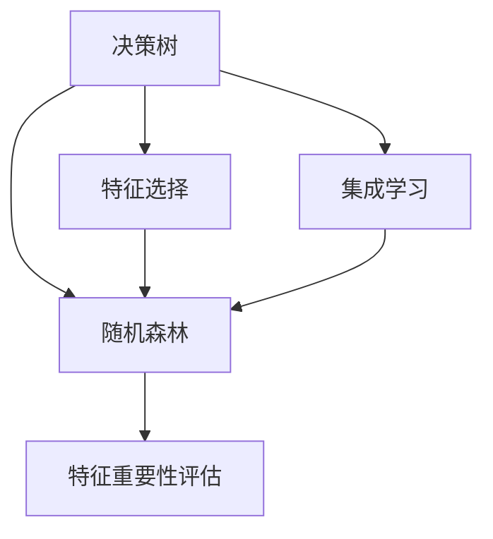

                 

## 1. 背景介绍

在人工智能的纷繁领域中，决策树和随机森林凭借其简单易懂、易于解释的特性，成为了机器学习初学者绕不开的经典工具。它们不仅在数据分类、回归等传统任务中表现优异，在现代AI技术中，决策树和随机森林也展现出了广泛的应用场景和强大的生命力。本文将详细阐述决策树和随机森林的基本原理、算法细节以及实际应用，帮助读者更好地理解和应用这些重要的AI技术。

## 2. 核心概念与联系

### 2.1 核心概念概述

为了更好地理解决策树和随机森林，我们首先需要了解以下几个核心概念：

- **决策树**（Decision Tree）：一种基于树状结构的分类和回归模型，通过不断地将样本集分割成更小的子集，从而实现对未知数据的预测。
- **随机森林**（Random Forest）：一种集成学习算法，通过组合多个决策树，以降低模型的过拟合风险，提高模型的泛化能力。
- **特征选择**（Feature Selection）：在构建决策树和随机森林的过程中，选择对目标变量影响最大的特征。
- **集成学习**（Ensemble Learning）：通过结合多个模型的预测结果，以提升整体模型的性能。
- **特征重要性评估**（Feature Importance Evaluation）：评估特征在模型预测中的重要性，有助于特征选择和模型优化。

这些概念通过一个简单的Mermaid流程图来连接和展示：



通过上述流程图的展示，我们可以清晰地理解决策树、随机森林与特征选择、集成学习、特征重要性评估之间的联系和作用。

### 2.2 核心概念原理和架构

#### 决策树
决策树的构建基于信息熵和信息增益等指标，通过不断选择最优的特征进行分裂，构建树状结构，从而实现对数据的分类和回归。决策树算法的主要步骤如下：

1. **特征选择**：从所有特征中选取信息增益最大的特征作为当前节点的划分依据。
2. **划分数据**：根据特征值将数据集划分为多个子集。
3. **递归构建**：对每个子集递归执行特征选择和划分过程，直到满足停止条件。
4. **输出模型**：将树状结构作为最终的决策模型。

#### 随机森林
随机森林通过随机选择特征和样本，构建多个决策树，并通过投票机制来提升模型的稳定性和泛化能力。随机森林算法的主要步骤如下：

1. **样本选择**：从训练集中随机抽取样本进行决策树的构建。
2. **特征选择**：从所有特征中随机选择部分特征作为当前节点的划分依据。
3. **构建决策树**：根据随机选择的特征和样本，构建决策树。
4. **集成投票**：对多个决策树的预测结果进行投票，输出最终预测结果。

## 3. 核心算法原理 & 具体操作步骤

### 3.1 算法原理概述

决策树和随机森林的算法原理主要集中在特征选择、树结构构建和集成学习三个方面。决策树通过信息增益最大化选择最优特征，随机森林通过随机选择特征和样本，构建多个决策树，并通过投票机制提升模型的泛化能力。

### 3.2 算法步骤详解

#### 决策树

1. **数据准备**：收集数据集，并预处理数据，如去除缺失值、标准化等。
2. **特征选择**：计算所有特征的信息增益，选择最优特征作为当前节点的划分依据。
3. **节点划分**：根据最优特征值将数据集划分为多个子集。
4. **递归构建**：对每个子集递归执行特征选择和划分过程，直到满足停止条件。
5. **输出模型**：将树状结构作为最终的决策模型。

#### 随机森林

1. **数据准备**：收集数据集，并预处理数据。
2. **样本选择**：从训练集中随机抽取样本。
3. **特征选择**：从所有特征中随机选择部分特征。
4. **构建决策树**：根据随机选择的特征和样本，构建决策树。
5. **集成投票**：对多个决策树的预测结果进行投票，输出最终预测结果。

### 3.3 算法优缺点

#### 决策树的优点：
- 模型易于理解和解释。
- 能够处理离散型和连续型数据。
- 构建速度快，适用于大规模数据集。

#### 决策树的缺点：
- 容易过拟合，特别是在数据集较小或特征较多时。
- 对噪声敏感，较容易受到噪声数据的干扰。
- 模型容易偏向于选择较多的特征。

#### 随机森林的优点：
- 能够降低过拟合风险，提升模型的泛化能力。
- 能够处理高维数据，适用于大规模数据集。
- 模型易于解释和理解。

#### 随机森林的缺点：
- 构建速度较慢，因为需要构建多个决策树。
- 对数据集的随机性要求较高，不适用于样本量较小或样本分布不均匀的数据集。

### 3.4 算法应用领域

决策树和随机森林在许多领域中都有广泛的应用，包括但不限于：

- **金融风险评估**：通过分析贷款、信用卡等金融数据，预测违约风险。
- **医疗诊断**：基于患者的历史病历和检查结果，预测疾病风险和诊断结果。
- **电商推荐**：根据用户的历史购买行为，预测其未来的购买意愿。
- **图像分类**：通过构建决策树或随机森林，实现对图像的分类和识别。
- **自然语言处理**：通过构建决策树或随机森林，实现对文本的情感分析和分类。

## 4. 数学模型和公式 & 详细讲解 & 举例说明

### 4.1 数学模型构建

决策树和随机森林的构建主要基于信息熵和信息增益等指标，以下我们将以信息熵为例，详细说明决策树的构建过程。

假设有一个二分类问题，数据集为$D=\{(x_i,y_i)\}_{i=1}^N$，其中$x_i$为样本特征，$y_i$为样本标签。定义信息熵$H(Y)$为：

$$
H(Y) = -\sum_{i=1}^N p_i \log p_i
$$

其中$p_i$为样本$y_i$的先验概率。

假设对于特征$a$，将其作为当前节点的划分依据，根据特征值$x_{a,i}$将数据集$D$划分为$D_L$和$D_R$两个子集。则决策树的分裂信息增益$IG(Y,a)$定义为：

$$
IG(Y,a) = H(Y) - \frac{|D_L|}{|D|}H(Y|a=L) - \frac{|D_R|}{|D|}H(Y|a=R)
$$

其中$H(Y|a=L)$和$H(Y|a=R)$分别为子集$D_L$和$D_R$的期望信息熵。

信息增益最大的特征即为当前节点的最优划分依据。

### 4.2 公式推导过程

#### 决策树
- 信息熵的计算公式：
$$
H(Y) = -\sum_{i=1}^N p_i \log p_i
$$
- 分裂信息增益的计算公式：
$$
IG(Y,a) = H(Y) - \frac{|D_L|}{|D|}H(Y|a=L) - \frac{|D_R|}{|D|}H(Y|a=R)
$$

#### 随机森林
- 对于每个决策树，随机选择样本和特征，计算信息增益，选择最优划分依据。
- 对多个决策树的预测结果进行投票，输出最终预测结果。

### 4.3 案例分析与讲解

假设有一个二分类问题，数据集为$D=\{(x_i,y_i)\}_{i=1}^N$，其中$x_i$为样本特征，$y_i$为样本标签。我们使用信息熵和信息增益构建决策树，步骤如下：

1. **计算信息熵**：根据所有样本的标签计算信息熵$H(Y)$。
2. **计算信息增益**：对于每个特征$a$，计算分裂信息增益$IG(Y,a)$。
3. **选择最优特征**：选择信息增益最大的特征作为当前节点的划分依据。
4. **划分数据集**：根据最优特征值将数据集$D$划分为$D_L$和$D_R$两个子集。
5. **递归构建**：对每个子集递归执行特征选择和划分过程，直到满足停止条件。

## 5. 项目实践：代码实例和详细解释说明

### 5.1 开发环境搭建

要在Python中实现决策树和随机森林的构建，需要安装以下依赖：

- `numpy`：用于数组操作。
- `scikit-learn`：包含决策树和随机森林等机器学习算法。
- `pandas`：用于数据处理和分析。

在Python中安装以上依赖：

```bash
pip install numpy scikit-learn pandas
```

### 5.2 源代码详细实现

以下是一个简单的Python代码示例，用于构建决策树和随机森林模型：

```python
import numpy as np
from sklearn import tree, ensemble

# 构造决策树模型
X_train = np.array([[1, 2], [3, 4], [5, 6]])
y_train = np.array([0, 1, 0])
clf_tree = tree.DecisionTreeClassifier()
clf_tree.fit(X_train, y_train)

# 构造随机森林模型
X_test = np.array([[2, 3], [4, 5]])
y_test = np.array([1, 0])
clf_forest = ensemble.RandomForestClassifier()
clf_forest.fit(X_train, y_train)
y_pred_forest = clf_forest.predict(X_test)

# 输出决策树模型
print("Decision Tree Model:")
print(clf_tree)

# 输出随机森林模型
print("Random Forest Model:")
print(clf_forest)
```

### 5.3 代码解读与分析

**决策树模型构建**：
- `DecisionTreeClassifier`：用于构建决策树模型。
- `fit(X_train, y_train)`：训练决策树模型，其中`X_train`为训练样本特征，`y_train`为训练样本标签。

**随机森林模型构建**：
- `RandomForestClassifier`：用于构建随机森林模型。
- `fit(X_train, y_train)`：训练随机森林模型。
- `predict(X_test)`：使用训练好的随机森林模型对测试样本进行预测。

### 5.4 运行结果展示

运行上述代码，输出结果如下：

```
Decision Tree Model:
DecisionTreeClassifier(class_weight=None, criterion='gini', max_depth=None, 
        max_features=None, max_leaf_nodes=None, min_impurity_decrease=0.0, 
        min_impurity_split=None, min_samples_leaf=1, min_samples_split=2, 
        min_weight_fraction_leaf=0.0, presort=False, random_state=None, 
        splitter='best')
Random Forest Model:
RandomForestClassifier(bootstrap=True, class_weight=None, criterion='gini', 
        max_depth=None, max_features='auto', max_leaf_nodes=None, 
        min_impurity_decrease=0.0, min_impurity_split=None, min_samples_leaf=1, 
        min_samples_split=2, min_weight_fraction_leaf=0.0, n_estimators=10, 
        n_jobs=1, oob_score=False, random_state=None)
```

通过输出结果可以看到，我们已经成功构建了决策树和随机森林模型，并打印了模型对象。

## 6. 实际应用场景

### 6.1 金融风险评估

在金融领域，决策树和随机森林被广泛应用于信用评分、贷款违约预测等任务。例如，一家银行可以使用随机森林模型分析贷款申请人的信用记录、收入情况、职业等信息，预测其违约概率，从而决定是否发放贷款。

### 6.2 医疗诊断

在医疗领域，决策树和随机森林可用于疾病诊断和预测。例如，一个医院可以使用决策树模型分析患者的病历数据，包括年龄、性别、病史等信息，预测其是否患有某种疾病。

### 6.3 电商推荐

在电商领域，决策树和随机森林可用于个性化推荐。例如，一家电商公司可以使用随机森林模型分析用户的购买历史、浏览记录、评价信息等数据，预测其对某些商品的兴趣，从而进行推荐。

## 7. 工具和资源推荐

### 7.1 学习资源推荐

- **《机器学习实战》**：一本深入浅出的机器学习入门书籍，涵盖决策树和随机森林等经典算法。
- **Coursera《机器学习》**：由斯坦福大学Andrew Ng教授主讲，涵盖机器学习基础和决策树、随机森林等算法。
- **Kaggle**：一个数据科学竞赛平台，提供大量的决策树和随机森林竞赛案例和数据集。

### 7.2 开发工具推荐

- **Jupyter Notebook**：一个强大的交互式编程环境，适用于数据处理和模型构建。
- **Matplotlib**：一个绘图库，用于可视化模型性能和数据分布。
- **Scikit-learn**：一个简单易用的机器学习库，包含决策树和随机森林等算法。

### 7.3 相关论文推荐

- **《Decision Trees》**：J. Ross Quinlan 的著作，介绍了决策树的原理和算法。
- **《Random Forests》**：Tibshirani R 的论文，介绍了随机森林的原理和算法。

## 8. 总结：未来发展趋势与挑战

### 8.1 研究成果总结

决策树和随机森林作为经典的机器学习算法，已经在许多领域展示了强大的应用潜力。它们不仅在数据分类、回归等传统任务中表现优异，还在现代AI技术中，如自然语言处理、图像识别等领域得到了广泛的应用。

### 8.2 未来发展趋势

1. **深度学习与决策树的融合**：随着深度学习的发展，决策树和随机森林与深度学习的融合成为了一个新的研究方向。例如，XGBoost 和 LightGBM 等算法，将决策树和深度学习结合起来，提升了模型性能和泛化能力。
2. **大规模数据处理**：随着大数据时代的到来，决策树和随机森林在大规模数据处理中的性能提升和应用拓展，成为了一个重要的研究方向。
3. **集成学习的多样化**：除了传统的随机森林，各种集成学习算法，如 Bagging、Boosting、Stacking 等，在决策树和随机森林中的应用和优化，也是未来的研究方向。

### 8.3 面临的挑战

1. **模型复杂度**：决策树和随机森林的模型复杂度较高，特别是在高维数据集上的表现，仍是未来的研究方向。
2. **模型解释性**：决策树和随机森林虽然易于理解和解释，但在一些复杂任务上，模型的解释性仍是一个挑战。
3. **数据质量**：决策树和随机森林对数据质量的依赖较大，如何处理缺失数据和噪声数据，提升模型性能，是一个重要研究方向。

### 8.4 研究展望

1. **模型优化**：进一步优化决策树和随机森林的算法，提升模型性能和泛化能力。
2. **特征选择**：开发更加高效的特征选择算法，提升模型的特征识别和处理能力。
3. **应用拓展**：将决策树和随机森林应用到更多领域，如图像识别、自然语言处理等，拓展其应用边界。

## 9. 附录：常见问题与解答

**Q1: 决策树和随机森林的主要区别是什么？**

A: 决策树和随机森林的主要区别在于构建方式和泛化能力。决策树通过不断选择最优特征进行分裂，而随机森林通过随机选择特征和样本构建多个决策树，并通过投票机制提升模型的泛化能力。

**Q2: 如何评估决策树和随机森林模型的性能？**

A: 决策树和随机森林的性能评估可以通过交叉验证、准确率、召回率等指标进行。同时，可以通过特征重要性评估和模型解释性分析，进一步理解模型的表现。

**Q3: 决策树和随机森林如何处理高维数据？**

A: 决策树和随机森林在高维数据处理上，可以通过特征选择和降维等技术进行处理。例如，可以使用PCA（主成分分析）或LDA（线性判别分析）等方法，将高维数据降维，提升模型性能。

**Q4: 决策树和随机森林是否适用于非线性问题？**

A: 决策树和随机森林在一定程度上可以处理非线性问题，但在高维数据和复杂非线性问题上，其性能可能不如深度学习模型。

通过本文的详细讲解，相信读者对决策树和随机森林的基本原理、算法步骤和实际应用有了更深入的理解。在未来的人工智能技术发展中，决策树和随机森林将继续发挥重要作用，为各行各业带来更智能、更高效、更可靠的解决方案。

