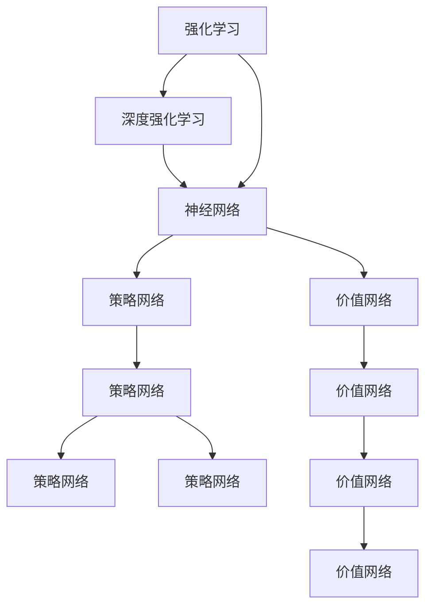

                 

# 一切皆是映射：强化学习基础及其与深度学习的结合

> 关键词：强化学习,深度学习,神经网络,强化学习框架,计算图,模型融合,应用场景,未来展望

## 1. 背景介绍

### 1.1 问题由来
强化学习（Reinforcement Learning, RL）和深度学习（Deep Learning, DL）是当今人工智能（AI）领域的两大基石。它们在解决复杂问题时各具优势，但各自的局限性也明显。强化学习擅长处理动态环境中的决策优化问题，而深度学习则在处理大量数据和提取复杂特征方面表现出色。然而，现实中许多问题往往需要二者的结合，如游戏AI、机器人控制、自动驾驶等。

传统上，强化学习通常使用手写的状态-动作映射，难以处理高维、非结构化数据。深度学习的出现，使得强化学习可以借助神经网络实现更灵活、更高效的策略学习。同时，深度强化学习（Deep Reinforcement Learning, DRL）进一步融合了两种方法，使得在复杂环境中进行智能决策成为可能。

### 1.2 问题核心关键点
本文聚焦于深度强化学习，探讨如何利用神经网络作为强化学习中的价值函数和策略网络，从而实现更加高效、灵活的智能决策。我们将从基础概念入手，逐步展开，涵盖算法原理、数学模型、代码实践、应用场景等关键点，并对未来发展趋势进行展望。

## 2. 核心概念与联系

### 2.1 核心概念概述

为更好地理解深度强化学习的原理，本节将介绍几个密切相关的核心概念：

- 强化学习（Reinforcement Learning）：通过与环境的交互，智能体（Agent）学习最大化累积奖励的过程。其核心是智能体在动态环境中通过试错逐步优化决策策略。
- 深度强化学习（Deep Reinforcement Learning）：利用深度神经网络作为价值函数和策略网络，以更好地处理高维、非结构化数据，并提升模型的表示能力和学习效率。
- 神经网络（Neural Network）：由多层神经元组成的计算模型，用于逼近复杂非线性映射关系。
- 深度学习（Deep Learning）：利用多层神经网络，从大量数据中自动提取特征，并实现高效的模型训练。
- 策略网络（Policy Network）：用于策略学习的神经网络，输出策略分布或策略参数。
- 价值网络（Value Network）：用于价值函数学习的神经网络，输出估计的状态价值或动作价值。
- 计算图（Computation Graph）：神经网络中的一种重要概念，用于表示模型前向传播和反向传播的计算流程。
- 模型融合（Model Fusion）：将强化学习和深度学习的算法进行有机结合，优势互补，提升模型性能。

这些核心概念之间的逻辑关系可以通过以下Mermaid流程图来展示：



这个流程图展示了一系列核心概念及其之间的联系：

1. 强化学习通过与环境交互进行智能决策。
2. 深度强化学习通过神经网络提升强化学习的处理能力。
3. 神经网络用于逼近复杂映射，是深度强化学习的基础。
4. 策略网络和价值网络分别用于策略和价值函数的计算。
5. 策略网络输出决策策略，价值网络估计状态或动作价值。
6. 策略网络和价值网络的结合，使得强化学习更加高效和灵活。

这些概念共同构成了深度强化学习的核心，为其提供了坚实的理论基础和数学工具。

## 3. 核心算法原理 & 具体操作步骤
### 3.1 算法原理概述

深度强化学习的基本思想是，将神经网络作为强化学习中的价值函数和策略网络，利用神经网络逼近复杂状态价值函数和策略函数，实现高效、灵活的智能决策。其核心算法包括Q-learning、SARSA、策略梯度（Policy Gradient）等。

以Q-learning算法为例，其主要思想是，通过神经网络逼近状态-动作价值函数Q(s, a)，即估计在状态s下采取动作a的累积奖励。通过最大化Q函数的值，优化策略$\pi$，以获得最优决策。具体步骤如下：

1. 初始化模型参数。
2. 在每个时间步t，从状态s中根据策略$\pi$选择动作a。
3. 观察环境反馈，获得奖励r和下一个状态s'。
4. 根据贝尔曼方程，更新状态-动作价值函数Q(s, a)。
5. 重复步骤2-4，直至达到终止状态或达到预设轮数。

### 3.2 算法步骤详解

接下来，我们将详细讲解Q-learning算法的基本步骤：

**Step 1: 初始化模型和参数**
- 初始化神经网络模型，包含策略网络$\pi$和价值网络$Q$。
- 设置模型参数，如网络结构、学习率等。

**Step 2: 设置环境**
- 定义环境，如游戏环境、机器人控制环境等，使智能体可以进行与环境的交互。
- 定义状态空间、动作空间、状态转移概率、奖励函数等关键参数。

**Step 3: 策略采样**
- 在每个时间步t，根据策略网络$\pi$输出概率分布，选择动作a。
- 使用随机策略进行探索，同时使用最大似然估计更新策略网络参数。

**Step 4: 环境交互**
- 在每个时间步t，智能体执行动作a，观察环境反馈，获得奖励r和下一个状态s'。
- 根据环境反馈更新状态-动作价值函数Q(s, a)。

**Step 5: 模型更新**
- 使用贝尔曼方程$\mathcal{Q}_{t+1} = r + \gamma \mathcal{Q}_{t+1}$，更新状态-动作价值函数$Q(s', a')$。
- 根据更新后的Q值，更新策略网络$\pi$，以最大化累积奖励。

**Step 6: 重复迭代**
- 重复步骤3-5，直至达到终止状态或达到预设轮数。

### 3.3 算法优缺点

深度强化学习相较于传统的强化学习方法，具有以下优点：

1. 处理高维数据能力更强。神经网络可以高效处理高维、非结构化数据，提升模型对复杂环境的适应能力。
2. 泛化能力更强。神经网络在处理不同任务时具有更强的泛化能力，可以更好地应用到新领域。
3. 训练效率更高。深度强化学习可以利用GPU等高性能设备进行加速训练，提升模型训练速度。
4. 学习策略更加灵活。神经网络可以自适应地学习复杂策略，适应动态环境中的决策问题。

同时，深度强化学习也存在以下局限性：

1. 需要大量数据。深度强化学习需要大量标注数据进行训练，难以适用于样本数量较少的问题。
2. 计算成本高。神经网络需要大量的计算资源进行训练，训练时间和成本较高。
3. 模型复杂度高。神经网络的参数量通常较大，导致模型复杂度较高，难以调试和理解。
4. 过拟合风险高。神经网络容易过拟合，尤其是在小样本情况下。
5. 难以理解。深度强化学习模型复杂，难以解释其内部决策过程。

### 3.4 算法应用领域

深度强化学习在多个领域中都有广泛应用，以下是几个典型的例子：

1. 游戏AI：如AlphaGo、AlphaZero等，利用深度强化学习在围棋、星际争霸等游戏中实现超人类水平的表现。
2. 机器人控制：如OpenAI的Dactyl机器人，利用深度强化学习实现物体抓取、放置等复杂动作。
3. 自动驾驶：如Tesla的Autopilot系统，利用深度强化学习实现车辆的自主驾驶。
4. 自然语言处理：如BERT，利用深度强化学习进行语义理解、自动摘要等任务。
5. 推荐系统：如DeepMind的推荐系统，利用深度强化学习进行用户行为预测和推荐。

以上只是深度强化学习在实际应用中的一小部分，其广泛的应用前景和潜在的突破性技术仍在不断拓展和深化。

## 4. 数学模型和公式 & 详细讲解  
### 4.1 数学模型构建

本节将使用数学语言对深度强化学习的核心算法进行更加严格的刻画。

记智能体的状态为$s \in \mathcal{S}$，动作为$a \in \mathcal{A}$，环境奖励为$r \in \mathcal{R}$，下一个状态为$s' \in \mathcal{S}$，策略网络为$\pi(a|s)$，价值网络为$Q(s, a)$。智能体的目标是在动态环境中最大化累积奖励。

定义状态-动作价值函数$Q(s, a)$为：

$$
Q(s, a) = \mathbb{E}[\sum_{t=0}^{\infty} \gamma^t r_t | s_0 = s, a_0 = a, S_t = s']
$$

其中$\gamma$为折扣因子，控制未来奖励的重要性。

在实际应用中，我们通常使用神经网络逼近$Q(s, a)$函数，即：

$$
Q(s, a) \approx \phi(s; \theta)^T W^Q \phi(a; \theta)
$$

其中$\theta$为模型参数，$\phi$为神经网络激活函数。

### 4.2 公式推导过程

以Q-learning算法为例，其核心公式为：

$$
Q(s, a) \leftarrow Q(s, a) + \alpha(r + \gamma \max_{a'} Q(s', a') - Q(s, a))
$$

其中$\alpha$为学习率。

该公式描述了Q函数的更新过程。在每个时间步t，智能体执行动作a，观察环境反馈，获得奖励r和下一个状态s'。根据贝尔曼方程，更新状态-动作价值函数$Q(s, a)$。

具体推导过程如下：

1. 初始化Q函数：$Q(s, a) = 0$。
2. 在每个时间步t，智能体执行动作a，观察环境反馈，获得奖励r和下一个状态s'。
3. 根据贝尔曼方程，更新状态-动作价值函数$Q(s, a)$：

$$
Q(s, a) \leftarrow Q(s, a) + \alpha(r + \gamma \max_{a'} Q(s', a') - Q(s, a))
$$

其中$\max_{a'} Q(s', a')$表示在状态s'下，选择动作$a'$的累积奖励的最大值。

4. 重复步骤2-3，直至达到终止状态或达到预设轮数。

### 4.3 案例分析与讲解

以AlphaGo为例，其核心算法为深度强化学习中的蒙特卡罗树搜索（Monte Carlo Tree Search, MCTS）。MCTS算法通过神经网络逼近Q值函数，实现高效的价值评估和策略搜索。

在AlphaGo中，神经网络包括策略网络和价值网络。策略网络用于计算当前状态下可能采取的动作，价值网络用于评估当前状态的价值。在每次搜索时，AlphaGo先根据策略网络选择一系列动作，并根据价值网络评估动作的价值，然后选择最优动作进行下一步搜索。

AlphaGo的深度强化学习算法在围棋等复杂博弈问题中表现出色，其核心在于：

1. 使用神经网络逼近复杂状态价值函数和策略函数，提升模型的表示能力。
2. 通过蒙特卡罗树搜索，实现高效的策略搜索和价值评估。
3. 利用深度强化学习的自适应能力，学习复杂决策策略。

AlphaGo的成功展示了深度强化学习的巨大潜力，为其他领域提供了新的思路和方向。

## 5. 项目实践：代码实例和详细解释说明
### 5.1 开发环境搭建

在进行深度强化学习实践前，我们需要准备好开发环境。以下是使用Python进行TensorFlow开发的环境配置流程：

1. 安装Anaconda：从官网下载并安装Anaconda，用于创建独立的Python环境。

2. 创建并激活虚拟环境：
```bash
conda create -n deep-rl-env python=3.8 
conda activate deep-rl-env
```

3. 安装TensorFlow：根据CUDA版本，从官网获取对应的安装命令。例如：
```bash
conda install tensorflow -c conda-forge
```

4. 安装相关的学习库：
```bash
pip install numpy pandas scikit-learn matplotlib tqdm jupyter notebook ipython
```

完成上述步骤后，即可在`deep-rl-env`环境中开始深度强化学习的实践。

### 5.2 源代码详细实现

下面我们以DQN算法为例，给出使用TensorFlow进行深度强化学习的PyTorch代码实现。

首先，定义环境：

```python
import gym
import tensorflow as tf

env = gym.make('CartPole-v0')
```

然后，定义策略网络和价值网络：

```python
from tensorflow.keras import layers, models

def build_policy_network(input_shape, num_actions):
    inputs = layers.Input(shape=input_shape)
    x = layers.Dense(64, activation='relu')(inputs)
    x = layers.Dense(64, activation='relu')(x)
    x = layers.Dense(num_actions, activation='linear', name='policy')(x)
    return models.Model(inputs, x)

def build_value_network(input_shape, num_actions):
    inputs = layers.Input(shape=input_shape)
    x = layers.Dense(64, activation='relu')(inputs)
    x = layers.Dense(64, activation='relu')(x)
    x = layers.Dense(1, activation='linear', name='value')(x)
    return models.Model(inputs, x)
```

接着，定义模型训练函数：

```python
from tensorflow.keras.optimizers import Adam

def train(env, policy_network, value_network, policy_optimizer, value_optimizer, batch_size, num_steps):
    state = env.reset()
    total_reward = 0
    for t in range(num_steps):
        action_probs = policy_network.predict(state[np.newaxis, :])
        action = np.random.choice(num_actions, p=action_probs[0])
        next_state, reward, done, _ = env.step(action)
        reward = reward + 0.001  # 对奖励进行折扣处理
        policy_loss = tf.keras.losses.mean_squared_error(y_true=action_probs, y_pred=policy_probs)
        value_loss = tf.keras.losses.mean_squared_error(y_true=value_network.predict(next_state[np.newaxis, :]), y_pred=value_network.predict(next_state[np.newaxis, :]))
        policy_optimizer.minimize(policy_loss, loss_value=policy_loss)
        value_optimizer.minimize(value_loss, loss_value=value_loss)
        state = next_state
        total_reward += reward
        if done:
            break
    return total_reward
```

最后，启动训练流程并在测试集上评估：

```python
from tensorflow.keras.optimizers import Adam

policy_network = build_policy_network(env.observation_space.shape, num_actions)
value_network = build_value_network(env.observation_space.shape, num_actions)

policy_optimizer = Adam(lr=0.001)
value_optimizer = Adam(lr=0.01)

total_reward = train(env, policy_network, value_network, policy_optimizer, value_optimizer, batch_size=32, num_steps=1000)
print(f"Total reward: {total_reward}")
```

以上就是使用TensorFlow进行DQN算法的深度强化学习的完整代码实现。可以看到，借助TensorFlow强大的计算图能力，我们能够方便地构建和训练深度强化学习模型。

### 5.3 代码解读与分析

让我们再详细解读一下关键代码的实现细节：

**环境定义**：
- 使用OpenAI Gym定义环境，如CartPole-v0。
- 根据环境获取状态空间和动作空间。

**策略网络定义**：
- 使用Keras构建策略网络，包含输入层、两个隐藏层和输出层。
- 输出层使用线性激活函数，输出概率分布。

**价值网络定义**：
- 使用Keras构建价值网络，包含输入层、两个隐藏层和输出层。
- 输出层使用线性激活函数，输出单个值。

**模型训练函数**：
- 在每个时间步t，选择动作，并观察环境反馈。
- 计算策略和价值网络的损失，并使用Adam优化器进行更新。
- 在每个时间步结束时，返回总奖励。

可以看到，TensorFlow使得深度强化学习的模型构建和训练变得简洁高效。开发者可以将更多精力放在问题建模和优化策略上，而不必过多关注底层实现细节。

当然，工业级的系统实现还需考虑更多因素，如模型的保存和部署、超参数的自动搜索、更灵活的训练策略等。但核心的强化学习范式基本与此类似。

## 6. 实际应用场景
### 6.1 智能客服系统

基于深度强化学习的智能客服系统，可以自动理解和回答客户的各类问题，提供更加精准、及时的服务。通过与环境交互，智能客服系统可以学习最优的策略，如如何响应客户的情感变化，如何处理复杂问题等。

在技术实现上，可以收集历史客服对话记录，构建强化学习环境。智能客服系统在每个时间步选择动作（回复内容），并根据客户的反馈（满意度、问题解决程度等）获得奖励。通过训练，智能客服系统可以逐步优化回复策略，提升客户满意度和服务质量。

### 6.2 自动驾驶

自动驾驶系统利用深度强化学习，可以在复杂交通环境中实现自主驾驶。通过与环境的交互，系统可以学习最优的决策策略，如如何避障、如何跟随前车等。

在实际应用中，自动驾驶系统可以利用车辆传感器获取环境信息，并根据当前状态选择动作（如加速、减速、转向等）。通过与环境的交互，系统可以获得奖励（如安全到达目的地），并根据奖励更新策略网络，以优化驾驶策略。

### 6.3 推荐系统

推荐系统利用深度强化学习，可以根据用户行为数据，自动推荐感兴趣的物品。通过与环境的交互，推荐系统可以学习最优的推荐策略，如如何根据用户的历史行为推荐相关物品。

在实际应用中，推荐系统可以利用用户的历史行为数据作为环境状态，并根据当前状态选择动作（如推荐物品）。通过与环境的交互，系统可以获得奖励（如用户点击、购买等），并根据奖励更新策略网络，以优化推荐策略。

### 6.4 未来应用展望

随着深度强化学习技术的不断进步，其在更多领域的应用前景将进一步拓展。未来，深度强化学习有望在以下方向取得新的突破：

1. 多智能体系统：利用深度强化学习，构建多智能体协同工作的系统，如团队合作、协同决策等。
2. 环境建模：利用深度强化学习，构建更加精细的环境模型，提升决策的准确性和稳定性。
3. 跨模态学习：利用深度强化学习，实现跨模态数据的融合，提升模型的综合能力。
4. 无监督学习：利用深度强化学习，实现无监督学习，减少对标注数据的依赖。
5. 混合学习：结合强化学习和深度学习的优势，实现混合学习，提升模型的表现和泛化能力。

以上趋势凸显了深度强化学习的广阔前景，为智能系统的发展提供了新的思路和方向。

## 7. 工具和资源推荐
### 7.1 学习资源推荐

为了帮助开发者系统掌握深度强化学习的理论基础和实践技巧，这里推荐一些优质的学习资源：

1. 《深度学习》（Ian Goodfellow等著）：深度学习领域的经典教材，涵盖深度强化学习的核心算法和应用。
2. CS294T《强化学习》课程：加州伯克利大学开设的强化学习课程，涵盖深度强化学习的算法和应用。
3. 《强化学习》（Richard S. Sutton等著）：强化学习领域的经典教材，涵盖深度强化学习的核心概念和算法。
4. DeepMind的强化学习论文集：DeepMind发布的强化学习论文集，涵盖深度强化学习的最新研究成果。
5. ArXiv的深度强化学习论文集：ArXiv发布的深度强化学习论文集，涵盖深度强化学习的最新研究成果。

通过对这些资源的学习实践，相信你一定能够快速掌握深度强化学习的精髓，并用于解决实际的智能决策问题。
###  7.2 开发工具推荐

高效的开发离不开优秀的工具支持。以下是几款用于深度强化学习开发的常用工具：

1. TensorFlow：由Google主导开发的开源深度学习框架，生产部署方便，适合大规模工程应用。同样有丰富的深度强化学习资源。
2. PyTorch：基于Python的开源深度学习框架，灵活动态的计算图，适合快速迭代研究。大部分深度强化学习模型都有PyTorch版本的实现。
3. OpenAI Gym：Python环境库，用于定义各种强化学习环境，方便测试和训练深度强化学习模型。
4. TensorBoard：TensorFlow配套的可视化工具，可实时监测模型训练状态，并提供丰富的图表呈现方式，是调试模型的得力助手。
5. Weights & Biases：模型训练的实验跟踪工具，可以记录和可视化模型训练过程中的各项指标，方便对比和调优。

合理利用这些工具，可以显著提升深度强化学习的开发效率，加快创新迭代的步伐。

### 7.3 相关论文推荐

深度强化学习在多个领域中都有广泛应用，以下是几篇奠基性的相关论文，推荐阅读：

1. Deep Q-Learning：Q-learning的深度学习扩展，利用神经网络逼近Q值函数，提升模型性能。
2. AlphaGo Zero：利用蒙特卡罗树搜索和深度强化学习，实现围棋的超人类水平表现。
3. MAML: Multi-task Learning with a Single Weights Vector，利用深度强化学习进行多任务学习。
4. DDPG: Deep Deterministic Policy Gradient，利用深度强化学习实现高维环境的稳定学习。
5. PPO: Proximal Policy Optimization，利用深度强化学习进行策略梯度优化。

这些论文代表了大深度强化学习的发展脉络。通过学习这些前沿成果，可以帮助研究者把握学科前进方向，激发更多的创新灵感。

## 8. 总结：未来发展趋势与挑战
### 8.1 总结

本文对深度强化学习进行了全面系统的介绍。首先，从强化学习的基础概念入手，逐步展开深度强化学习的算法原理和操作步骤，并结合实际应用场景进行深入讲解。其次，从数学模型和公式的角度，详细解释了深度强化学习的核心算法。最后，对未来发展趋势和面临的挑战进行了展望。

通过本文的系统梳理，可以看到，深度强化学习在复杂决策问题中表现出色，已经广泛应用于游戏AI、机器人控制、自动驾驶等领域。未来，随着深度强化学习技术的不断发展，其在更多领域的应用前景将进一步拓展。

### 8.2 未来发展趋势

展望未来，深度强化学习将呈现以下几个发展趋势：

1. 模型规模持续增大。随着算力成本的下降和数据规模的扩张，深度强化学习模型的参数量还将持续增长。超大规模模型蕴含的丰富知识，将进一步提升智能决策的准确性和稳定性。
2. 多智能体系统崛起。深度强化学习可以实现多智能体协同工作的系统，如团队合作、协同决策等，进一步提升智能系统的综合能力。
3. 环境建模提升。深度强化学习可以实现更加精细的环境建模，提升决策的准确性和稳定性。
4. 无监督学习普及。深度强化学习可以结合无监督学习，减少对标注数据的依赖，实现更加高效的学习。
5. 混合学习发展。深度强化学习和深度学习的混合学习，可以优势互补，提升模型的表现和泛化能力。

以上趋势凸显了深度强化学习的广阔前景，为智能系统的发展提供了新的思路和方向。

### 8.3 面临的挑战

尽管深度强化学习已经取得了瞩目成就，但在迈向更加智能化、普适化应用的过程中，它仍面临着诸多挑战：

1. 训练成本高。深度强化学习需要大量数据和计算资源进行训练，训练时间和成本较高。
2. 模型复杂度高。深度强化学习模型复杂，难以调试和理解。
3. 难以解释。深度强化学习模型复杂，难以解释其内部决策过程。
4. 安全风险高。深度强化学习模型容易学习有害的行为，带来安全风险。
5. 稳定性不足。深度强化学习模型在动态环境中表现不稳定，难以应对复杂场景。

### 8.4 研究展望

面对深度强化学习面临的挑战，未来的研究需要在以下几个方面寻求新的突破：

1. 简化模型结构。开发更加简洁的深度强化学习模型，降低计算成本，提升可解释性。
2. 提高稳定性。通过模型融合、正则化等方法，提高深度强化学习模型在动态环境中的稳定性。
3. 引入多模态信息。结合视觉、语音、文本等多模态信息，提升深度强化学习模型的综合能力。
4. 引入无监督学习。结合无监督学习方法，减少对标注数据的依赖，提升模型的泛化能力。
5. 引入因果推理。通过引入因果推理，提高深度强化学习模型在动态环境中的决策能力。

这些研究方向将引领深度强化学习技术的不断发展，推动智能系统的进步。相信随着学界和产业界的共同努力，深度强化学习必将实现更大的突破，为构建更加智能化的未来世界做出更大的贡献。

## 9. 附录：常见问题与解答

**Q1：深度强化学习与传统强化学习的主要区别是什么？**

A: 深度强化学习相较于传统强化学习，主要区别在于：
1. 处理高维数据能力更强。深度强化学习利用神经网络逼近复杂状态价值函数和策略函数，提升模型的表示能力。
2. 泛化能力更强。深度强化学习可以在不同任务中高效地进行知识迁移。
3. 训练效率更高。深度强化学习可以利用GPU等高性能设备进行加速训练，提升模型训练速度。
4. 模型复杂度高。深度强化学习模型通常参数量较大，难以调试和理解。

**Q2：深度强化学习在哪些场景下表现出色？**

A: 深度强化学习在以下场景中表现出色：
1. 高维数据处理。如围棋、星际争霸等复杂博弈问题。
2. 动态环境决策。如自动驾驶、机器人控制等需要实时决策的场景。
3. 多智能体协同。如团队合作、协同决策等需要多智能体协同工作的场景。
4. 非结构化数据处理。如自然语言处理、视频处理等非结构化数据的决策优化问题。

**Q3：深度强化学习的核心算法有哪些？**

A: 深度强化学习的核心算法包括：
1. Q-learning。利用神经网络逼近Q值函数，实现高效的价值评估和策略学习。
2. SARSA。通过状态-动作-奖励-状态-动作的顺序进行学习和更新，实现策略优化。
3. Policy Gradient。通过最大化策略梯度，实现高效策略优化。
4. Deep Q-Networks（DQN）。利用深度神经网络逼近Q值函数，提升模型性能。
5. Proximal Policy Optimization（PPO）。利用深度强化学习进行策略优化，提高模型训练效率。
6. Trust Region Policy Optimization（TRPO）。利用深度强化学习进行策略优化，提高模型稳定性。

这些算法代表了深度强化学习的主要研究方向，可以帮助开发者更好地理解和应用深度强化学习技术。

**Q4：深度强化学习的应用场景有哪些？**

A: 深度强化学习在以下场景中都有广泛应用：
1. 游戏AI。如AlphaGo、AlphaZero等，利用深度强化学习在围棋、星际争霸等游戏中实现超人类水平的表现。
2. 自动驾驶。利用深度强化学习，在复杂交通环境中实现自主驾驶。
3. 机器人控制。利用深度强化学习，实现机器人抓取、放置等复杂动作。
4. 自然语言处理。利用深度强化学习，进行语义理解、自动摘要等任务。
5. 推荐系统。利用深度强化学习，根据用户行为数据进行物品推荐。

**Q5：深度强化学习中的超参数有哪些？**

A: 深度强化学习中的超参数包括：
1. 学习率。用于控制模型的更新速度和步长。
2. 批大小。用于控制每次更新使用的样本数量。
3. 折扣因子$\gamma$。用于控制未来奖励的重要性。
4. 探索率。用于控制模型在探索和利用之间的平衡。
5. 策略网络的结构。包括层数、神经元数、激活函数等。
6. 价值网络的结构。包括层数、神经元数、激活函数等。

这些超参数的设置需要根据具体任务和数据进行调整，以获得最佳的模型性能。

---

作者：禅与计算机程序设计艺术 / Zen and the Art of Computer Programming

