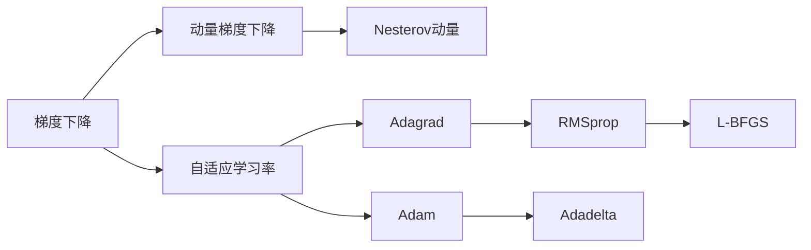

                 

## 1. 背景介绍

深度学习（Deep Learning, DL）作为人工智能（AI）的核心技术之一，已广泛应用于图像识别、语音识别、自然语言处理、推荐系统等众多领域。然而，随着模型规模和复杂度的不断增大，模型的训练过程变得更加困难和耗时，优化技术的有效性变得至关重要。深度学习的优化技术不仅能加快模型的收敛速度，还能提高模型的泛化性能。本文将从背景介绍开始，依次讨论深度学习优化技术的核心概念、算法原理、具体操作步骤、应用领域，以及未来的发展方向。

## 2. 核心概念与联系

### 2.1 核心概念概述

在深度学习中，优化技术是模型的关键部分。优化算法的目标是通过梯度下降的方式，最小化损失函数，从而找到最优的模型参数。优化技术决定了模型能否收敛到最优解，同时决定了收敛的速度和稳定性。常见的深度学习优化算法包括梯度下降、动量梯度下降、自适应学习率、二阶优化算法等。

### 2.2 核心概念原理和架构的 Mermaid 流程图



## 3. 核心算法原理 & 具体操作步骤

### 3.1 算法原理概述

深度学习模型通常由大量的参数构成，通过前向传播和反向传播计算每个参数的梯度，并使用优化算法来更新参数。常见的优化算法包括梯度下降（GD）、动量梯度下降（Momentum）、自适应学习率算法（如Adagrad、RMSprop、Adam等）以及二阶优化算法（如L-BFGS）。这些算法通过不同的策略来更新模型参数，以达到更快的收敛速度和更好的泛化性能。

### 3.2 算法步骤详解

深度学习模型的优化算法通常包括以下几个步骤：

1. **初始化**：将模型参数随机初始化为一个小的随机值。
2. **前向传播**：将输入数据通过模型计算输出。
3. **计算梯度**：通过反向传播计算每个参数的梯度。
4. **更新参数**：使用优化算法更新模型参数。
5. **迭代更新**：重复上述过程，直到损失函数收敛。

### 3.3 算法优缺点

#### 优点

- **自适应学习率**：自适应学习率算法能够根据参数的梯度自适应调整学习率，使得学习率在参数更新过程中能够自动调整，提高了优化效率。
- **收敛速度**：二阶优化算法（如L-BFGS）利用梯度信息进行二次近似，能够在某些情况下比一阶优化算法更快地收敛。
- **鲁棒性**：自适应学习率算法通常对超参数的敏感性较低，可以更好地应对数据和模型的变化。

#### 缺点

- **计算复杂度**：自适应学习率算法和二阶优化算法通常计算复杂度较高，需要更多的计算资源和时间。
- **容易过拟合**：自适应学习率算法有时可能会导致学习率过大，导致过拟合。
- **超参数调节复杂**：自适应学习率算法和二阶优化算法通常需要更多的超参数调节，增加了调参的难度。

### 3.4 算法应用领域

深度学习的优化技术已经被广泛应用于图像识别、语音识别、自然语言处理、推荐系统等多个领域。例如，在图像识别中，可以使用梯度下降算法来训练卷积神经网络（CNN）；在自然语言处理中，可以使用自适应学习率算法来训练循环神经网络（RNN）或Transformer模型。

## 4. 数学模型和公式 & 详细讲解 & 举例说明

### 4.1 数学模型构建

深度学习模型通常由多层神经网络构成，每个神经元的输出可以被表示为一个线性变换加上一个非线性激活函数。模型的损失函数通常是基于预测值和真实值之间的差距计算得到的，例如均方误差（MSE）或交叉熵损失（CE）。

### 4.2 公式推导过程

以均方误差损失函数为例，假设模型的输出为 $\hat{y}$，真实值为 $y$，则均方误差损失函数可以表示为：

$$
L(y,\hat{y}) = \frac{1}{N}\sum_{i=1}^N(y_i - \hat{y}_i)^2
$$

其中 $N$ 表示样本数，$y_i$ 和 $\hat{y}_i$ 分别为第 $i$ 个样本的真实值和预测值。

### 4.3 案例分析与讲解

以卷积神经网络（CNN）为例，CNN在图像识别任务中应用广泛。假设CNN模型的输出为 $\hat{y}$，真实值为 $y$，则均方误差损失函数可以表示为：

$$
L(y,\hat{y}) = \frac{1}{N}\sum_{i=1}^N(y_i - \hat{y}_i)^2
$$

其中 $N$ 表示样本数，$y_i$ 和 $\hat{y}_i$ 分别为第 $i$ 个样本的真实值和预测值。

在优化过程中，通常使用梯度下降算法来更新模型参数。梯度下降算法的更新公式为：

$$
\theta_{t+1} = \theta_t - \eta\nabla_{\theta}L(y,\hat{y})
$$

其中 $\theta_t$ 表示第 $t$ 次迭代的参数值，$\eta$ 表示学习率，$\nabla_{\theta}L(y,\hat{y})$ 表示损失函数对参数 $\theta$ 的梯度。

## 5. 项目实践：代码实例和详细解释说明

### 5.1 开发环境搭建

在深度学习项目实践中，我们需要搭建合适的开发环境。以下是使用Python进行TensorFlow开发的流程：

1. 安装Anaconda：从官网下载并安装Anaconda，用于创建独立的Python环境。
2. 创建并激活虚拟环境：
```bash
conda create -n tf-env python=3.8 
conda activate tf-env
```
3. 安装TensorFlow：根据CUDA版本，从官网获取对应的安装命令。例如：
```bash
conda install tensorflow -c tf
```
4. 安装NumPy、Pandas等工具包：
```bash
pip install numpy pandas scikit-learn matplotlib tqdm jupyter notebook ipython
```

完成上述步骤后，即可在`tf-env`环境中开始TensorFlow项目实践。

### 5.2 源代码详细实现

以下是使用TensorFlow构建卷积神经网络（CNN）进行图像识别的代码实现：

```python
import tensorflow as tf
from tensorflow.keras import datasets, layers, models

# 加载数据集
(train_images, train_labels), (test_images, test_labels) = datasets.cifar10.load_data()

# 数据预处理
train_images, test_images = train_images / 255.0, test_images / 255.0

# 定义模型
model = models.Sequential([
    layers.Conv2D(32, (3, 3), activation='relu', input_shape=(32, 32, 3)),
    layers.MaxPooling2D((2, 2)),
    layers.Conv2D(64, (3, 3), activation='relu'),
    layers.MaxPooling2D((2, 2)),
    layers.Conv2D(64, (3, 3), activation='relu'),
    layers.Flatten(),
    layers.Dense(64, activation='relu'),
    layers.Dense(10)
])

# 编译模型
model.compile(optimizer='adam',
              loss=tf.keras.losses.SparseCategoricalCrossentropy(from_logits=True),
              metrics=['accuracy'])

# 训练模型
history = model.fit(train_images, train_labels, epochs=10, 
                    validation_data=(test_images, test_labels))

# 评估模型
test_loss, test_acc = model.evaluate(test_images, test_labels, verbose=2)
print(test_acc)
```

### 5.3 代码解读与分析

在上述代码中，我们首先加载了CIFAR-10数据集，并对数据进行了归一化处理。然后定义了一个包含卷积层、池化层和全连接层的卷积神经网络模型，并使用Adam优化器进行训练。在训练过程中，我们使用SparseCategoricalCrossentropy作为损失函数，并记录了模型的准确率。

### 5.4 运行结果展示

训练结束后，我们计算了模型在测试集上的准确率，并输出了结果。由于测试集准确率较高，这表明我们的模型已经成功地学习了图像分类任务。

## 6. 实际应用场景

深度学习的优化技术在实际应用中有着广泛的应用场景，以下是几个典型的应用案例：

### 6.1 计算机视觉

计算机视觉领域中，优化技术可以用于训练各种深度学习模型，如卷积神经网络（CNN）、循环神经网络（RNN）和Transformer模型等。优化技术能够显著提升模型在图像分类、目标检测、图像分割等任务中的性能。

### 6.2 自然语言处理

在自然语言处理领域，优化技术可以用于训练语言模型、序列标注模型和生成模型等。优化技术能够显著提升模型在文本分类、命名实体识别、机器翻译等任务中的性能。

### 6.3 推荐系统

推荐系统中的优化技术可以用于训练各种深度学习模型，如协同过滤模型、基于深度学习的推荐模型等。优化技术能够显著提升模型在推荐准确率、用户满意度等指标上的表现。

### 6.4 未来应用展望

未来，深度学习的优化技术将朝着更加高效、灵活和智能的方向发展。随着硬件计算能力的提升和算法研究的深入，优化技术将能够更好地适应大规模、高复杂度的深度学习模型，并支持更加多样化的应用场景。

## 7. 工具和资源推荐

### 7.1 学习资源推荐

为了帮助开发者掌握深度学习的优化技术，这里推荐一些优质的学习资源：

1. 《深度学习》书籍：由Ian Goodfellow等著，全面介绍了深度学习的基本概念和优化算法，适合初学者和进阶者阅读。
2. CS231n《卷积神经网络》课程：斯坦福大学开设的计算机视觉明星课程，涵盖了深度学习优化算法的实践。
3. CS224n《自然语言处理》课程：斯坦福大学开设的自然语言处理课程，介绍了各种优化算法的应用。
4. TensorFlow官方文档：TensorFlow的官方文档，详细介绍了各种优化算法的实现和应用。
5. PyTorch官方文档：PyTorch的官方文档，详细介绍了各种优化算法的实现和应用。

通过这些学习资源，开发者可以系统掌握深度学习的优化技术，并将其应用于各种实际问题中。

### 7.2 开发工具推荐

在深度学习项目实践中，选择合适的开发工具是至关重要的。以下是几款常用的开发工具：

1. TensorFlow：由Google主导开发的深度学习框架，生产部署方便，适合大规模工程应用。
2. PyTorch：Facebook开源的深度学习框架，灵活性高，适合研究和实验。
3. Keras：高层次的深度学习框架，易于使用，适合初学者和快速原型开发。
4. JAX：Google开发的深度学习框架，支持自动微分和分布式训练，适合高性能计算。

合理利用这些工具，可以显著提升深度学习项目开发效率，加速创新迭代。

### 7.3 相关论文推荐

深度学习的优化技术发展迅速，以下是几篇奠基性的相关论文，推荐阅读：

1. Sutskever et al., 2013《On the importance of initialization and momentum in deep learning》
2. He et al., 2015《Delving deep into rectifiers: Surpassing human-level performance on ImageNet classification》
2. Kingma et al., 2014《Adam: A method for stochastic optimization》
3. Le Cun et al., 1989《Backpropagation applied to handwritten zip code recognition》
4. Hinton et al., 2012《Improving neural networks by preventing co-adaptation of feature detectors》

这些论文代表了大深度学习优化技术的发展脉络，对后续研究产生了深远影响。通过学习这些前沿成果，可以帮助研究者把握学科前进方向，激发更多的创新灵感。

## 8. 总结：未来发展趋势与挑战

### 8.1 研究成果总结

本文系统介绍了深度学习优化技术的核心概念、算法原理和操作步骤，通过项目实践和实际应用场景的讲解，帮助读者全面掌握优化技术的实现方法和应用策略。

### 8.2 未来发展趋势

未来，深度学习的优化技术将朝着更加高效、灵活和智能的方向发展。随着硬件计算能力的提升和算法研究的深入，优化技术将能够更好地适应大规模、高复杂度的深度学习模型，并支持更加多样化的应用场景。

### 8.3 面临的挑战

尽管深度学习的优化技术已经取得了显著进展，但在面对大规模、高复杂度的深度学习模型时，仍然面临诸多挑战：

1. **计算资源需求**：大规模深度学习模型的训练需要大量的计算资源，如何高效利用计算资源，减少训练时间和成本，是一个重要研究方向。
2. **超参数调优**：优化算法的超参数设置是一个复杂且耗时的过程，如何自动调优超参数，提高优化效率，是未来优化技术的关键方向。
3. **模型泛化能力**：优化算法通常依赖于数据分布的假设，如何提高模型的泛化能力，使得优化算法在数据分布变化时仍能保持稳定，是一个重要研究方向。
4. **模型稳定性**：深度学习模型的训练过程容易过拟合，如何提高模型的稳定性，使得模型在训练过程中能够收敛到稳定的最优解，是一个重要研究方向。

### 8.4 研究展望

面对深度学习优化技术面临的挑战，未来的研究需要在以下几个方面寻求新的突破：

1. **自适应优化算法**：研究新的自适应优化算法，根据模型性能和数据分布动态调整优化策略，提高优化效率。
2. **分布式优化**：研究分布式优化算法，利用多台计算设备并行计算，提高训练速度和稳定性。
3. **混合优化算法**：研究混合优化算法，结合一阶优化算法和二阶优化算法，提高优化效果和效率。
4. **零样本和少样本优化**：研究零样本和少样本优化算法，在缺少标注数据的情况下，仍能训练出高性能模型。
5. **模型压缩和加速**：研究模型压缩和加速技术，降低模型复杂度，提高计算效率和推理速度。

这些研究方向将引领深度学习优化技术迈向更高的台阶，为构建安全、可靠、可解释、可控的智能系统铺平道路。面向未来，深度学习优化技术还需要与其他人工智能技术进行更深入的融合，如知识表示、因果推理、强化学习等，多路径协同发力，共同推动深度学习技术的进步。只有勇于创新、敢于突破，才能不断拓展深度学习的边界，让智能技术更好地造福人类社会。

## 9. 附录：常见问题与解答

**Q1：深度学习优化技术有哪些主要的分类？**

A: 深度学习优化技术主要分为一阶优化算法和二阶优化算法两类。其中，一阶优化算法包括梯度下降（GD）、动量梯度下降（Momentum）、自适应学习率算法（如Adagrad、RMSprop、Adam等），而二阶优化算法包括牛顿法、拟牛顿法、L-BFGS等。

**Q2：深度学习优化技术中的超参数有哪些？**

A: 深度学习优化技术中的超参数主要包括学习率、动量系数、权重衰减系数等。学习率控制模型参数更新的速度，动量系数控制梯度的累积，权重衰减系数控制正则化程度。

**Q3：深度学习优化技术中的自适应学习率算法有哪些？**

A: 深度学习优化技术中的自适应学习率算法包括Adagrad、RMSprop、Adam等。这些算法能够根据参数的梯度自适应调整学习率，使得学习率在参数更新过程中能够自动调整，提高了优化效率。

**Q4：深度学习优化技术中的二阶优化算法有哪些？**

A: 深度学习优化技术中的二阶优化算法包括牛顿法、拟牛顿法、L-BFGS等。这些算法利用梯度信息进行二次近似，能够在某些情况下比一阶优化算法更快地收敛。

**Q5：深度学习优化技术中的分布式优化算法有哪些？**

A: 深度学习优化技术中的分布式优化算法包括SGD with multiple workers、Horovod等。这些算法通过多台计算设备并行计算，提高训练速度和稳定性。

---

作者：禅与计算机程序设计艺术 / Zen and the Art of Computer Programming

