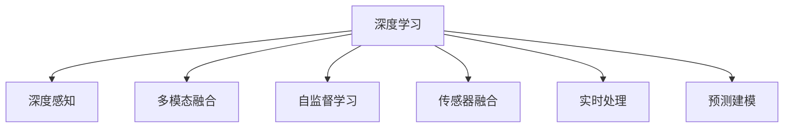

                 

# 一切皆是映射：深度学习在环境监测中的应用

> 关键词：环境监测,深度学习,深度感知,多模态融合,自监督学习,传感器融合,实时处理

## 1. 背景介绍

### 1.1 问题由来

在现代社会中，环境监测已成为公共健康、生态保护、城市管理等领域不可或缺的组成部分。传统的环境监测主要依赖人工巡检和传感器网络的静态监控，难以实时、全面地捕捉环境变化。深度学习技术的应用，为环境监测带来了新的革命性手段。通过构建深度感知模型，将各种传感器数据进行多模态融合，不仅能实时捕捉环境变化，还能预测未来趋势，为环境治理提供科学依据。

### 1.2 问题核心关键点

当前深度学习在环境监测中的应用，主要围绕以下几个核心关键点展开：

- 多模态融合：将来自不同来源、不同类型的环境数据进行统一建模，提升环境监测的全面性和准确性。
- 实时处理：利用深度学习模型在计算密集型任务中的优势，实现环境数据的高效实时处理。
- 自动特征学习：通过自监督学习方法，自动从大量未标记数据中提取环境特征，减少对人工标注的依赖。
- 低功耗传感器融合：结合物联网技术，利用低功耗传感器收集环境数据，减轻高成本传感器的负担。
- 预测建模：利用历史数据和模型预测能力，提前发现环境问题的征兆，避免环境问题的发生。

### 1.3 问题研究意义

深度学习在环境监测中的应用，对提升环境监测的智能化水平、降低监测成本、提高监测效率具有重要意义：

1. **提升监测智能化水平**：通过深度学习模型，可以自动从传感器数据中提取环境特征，实现对复杂环境变化的实时分析和预测。
2. **降低监测成本**：利用低功耗传感器融合技术，有效降低了环境监测的经济门槛，提高了监测系统的普及率。
3. **提高监测效率**：深度学习模型的并行计算能力，使得环境监测的数据处理和分析可以实时进行，及时响应环境变化。
4. **预测环境问题**：通过历史数据和模型预测能力，可以提前发现环境问题的征兆，制定科学的环境治理方案。
5. **支持政策制定**：环境监测数据的深入分析，可以为政策制定提供科学依据，推动环境治理的科学化和精细化。

## 2. 核心概念与联系

### 2.1 核心概念概述

为更好地理解深度学习在环境监测中的应用，本节将介绍几个密切相关的核心概念：

- **深度学习**：通过构建多层神经网络，利用大量数据进行训练，学习特征表示，并作出预测或决策的机器学习技术。
- **深度感知**：指利用深度学习模型，对传感器数据进行特征提取和模式识别的能力。
- **多模态融合**：将来自不同来源、不同类型的数据进行融合，提升环境监测的全面性和准确性。
- **自监督学习**：利用无标签数据训练模型，学习特征表示，减少对人工标注的依赖。
- **传感器融合**：将来自不同传感器的网络数据进行综合处理，提升环境监测的准确性。
- **实时处理**：利用深度学习模型的计算密集型任务优势，实现环境数据的实时处理和分析。
- **预测建模**：通过深度学习模型，利用历史数据进行预测，提前发现环境问题的征兆。

这些核心概念之间的逻辑关系可以通过以下Mermaid流程图来展示：



这个流程图展示了大语言模型的核心概念及其之间的关系：

1. 深度学习通过多层神经网络，学习环境数据的特征表示。
2. 深度感知利用深度学习模型，对传感器数据进行特征提取和模式识别。
3. 多模态融合将不同类型的数据进行融合，提升环境监测的全面性。
4. 自监督学习利用无标签数据，学习环境特征，减少人工标注成本。
5. 传感器融合将来自不同传感器的网络数据进行综合处理，提升监测准确性。
6. 实时处理利用深度学习模型的计算密集型任务优势，实现环境数据的实时处理。
7. 预测建模通过历史数据，利用模型进行预测，提前发现环境问题的征兆。

这些概念共同构成了深度学习在环境监测中的应用框架，使得深度学习能够全面、准确地捕捉和预测环境变化。

## 3. 核心算法原理 & 具体操作步骤
### 3.1 算法原理概述

深度学习在环境监测中的应用，主要通过构建深度感知模型，对传感器数据进行特征提取和模式识别。该模型的核心在于将多模态数据进行融合，自动学习环境特征，并利用这些特征进行预测和决策。

具体而言，深度感知模型的构建包括以下几个步骤：

1. **数据采集**：通过多种传感器（如气象站、水质监测仪、土壤湿度传感器等）采集环境数据。
2. **数据预处理**：对采集到的数据进行去噪、归一化等预处理操作。
3. **特征提取**：利用深度学习模型，自动从数据中提取环境特征。
4. **模式识别**：将提取到的特征输入到深度感知模型中，进行模式识别，识别环境变化类型。
5. **预测建模**：利用历史数据和模型预测能力，提前发现环境问题的征兆，制定治理方案。

### 3.2 算法步骤详解

深度感知模型的构建步骤详解如下：

**Step 1: 数据采集**
- 通过多种传感器采集环境数据，如气温、湿度、PM2.5、水质等。
- 传感器数据通常包含多个特征维度，需要经过拼接或标准化处理。

**Step 2: 数据预处理**
- 对采集到的数据进行去噪、归一化等预处理操作。
- 去除异常值和缺失值，保证数据的质量。

**Step 3: 特征提取**
- 利用卷积神经网络（CNN）或循环神经网络（RNN）等深度学习模型，自动从数据中提取环境特征。
- 对多模态数据进行融合，通过空间、时序等方法，提升特征的全面性和准确性。

**Step 4: 模式识别**
- 将提取到的特征输入到深度感知模型中，进行模式识别。
- 模型通常包含多个卷积层、池化层和全连接层，通过不断迭代优化，提升识别准确性。

**Step 5: 预测建模**
- 利用历史数据和模型预测能力，提前发现环境问题的征兆。
- 通过时间序列模型、回归模型等预测方法，构建环境变化的预测模型。

### 3.3 算法优缺点

深度学习在环境监测中的应用，具有以下优点：

1. **全面性**：通过多模态融合，能够全面捕捉环境变化，提升监测的全面性。
2. **实时性**：利用深度学习模型的计算密集型任务优势，实现环境数据的实时处理和分析。
3. **高准确性**：通过自动特征学习和模式识别，能够提高监测的准确性和可靠性。
4. **预测能力**：通过历史数据和模型预测能力，提前发现环境问题的征兆，制定科学治理方案。

同时，该方法也存在以下局限性：

1. **高成本传感器依赖**：传统的深度学习模型需要高成本、高精度的传感器，增加了环境监测的经济门槛。
2. **数据质量和预处理要求高**：环境数据通常包含噪声、缺失值等，需要严格的预处理和数据清洗。
3. **模型复杂度高**：深度学习模型通常结构复杂，训练和推理过程耗时较长。
4. **可解释性不足**：深度学习模型往往被视为"黑盒"系统，难以解释其内部工作机制和决策逻辑。
5. **环境适应性有限**：深度学习模型需要大量数据进行训练，对于新环境或突发事件，适应性有限。

尽管存在这些局限性，但就目前而言，深度学习在环境监测中的应用仍然是最为先进和有效的手段。未来相关研究的重点在于如何进一步降低传感器成本，提高数据质量和模型可解释性，同时兼顾实时性和预测能力等因素。

### 3.4 算法应用领域

深度学习在环境监测中的应用，已经广泛应用于以下领域：

- **气象预测**：利用深度学习模型，对气象数据进行特征提取和模式识别，预测未来天气变化。
- **水质监测**：通过深度学习模型，对水质监测数据进行分析和预测，及时发现水质异常。
- **土壤监测**：利用深度学习模型，对土壤数据进行特征提取和模式识别，监测土壤健康状况。
- **城市空气质量监测**：通过深度学习模型，对城市空气质量数据进行实时监测和预测，保障公众健康。
- **生态保护**：利用深度学习模型，对生态环境数据进行分析和预测，监测生物多样性变化。

除了上述这些经典应用外，深度学习还正在被创新性地应用于更多场景中，如灾害预警、环境污染治理、城市热岛效应分析等，为环境治理提供更科学、精准的决策依据。随着深度学习模型的不断演进，相信在环境监测领域，深度学习技术将发挥更大的作用。

## 4. 数学模型和公式 & 详细讲解 & 举例说明

### 4.1 数学模型构建

为了更好地理解深度学习在环境监测中的应用，本节将使用数学语言对深度感知模型的构建过程进行更加严格的刻画。

设环境监测数据集为 $D=\{(x_i, y_i)\}_{i=1}^N, x_i \in \mathcal{X}, y_i \in \mathcal{Y}$，其中 $x_i$ 表示传感器数据， $y_i$ 表示环境变化类型。设深度感知模型为 $M_{\theta}:\mathcal{X} \rightarrow \mathcal{Y}$，其中 $\theta$ 为模型参数。

定义模型 $M_{\theta}$ 在输入 $x$ 上的损失函数为 $\ell(M_{\theta}(x),y)$，则在数据集 $D$ 上的经验风险为：

$$
\mathcal{L}(\theta) = \frac{1}{N}\sum_{i=1}^N \ell(M_{\theta}(x_i),y_i)
$$

其中 $\ell$ 为适合特定环境监测任务的损失函数，如分类交叉熵损失、回归均方误差损失等。

深度感知模型的优化目标是最小化经验风险，即找到最优参数：

$$
\theta^* = \mathop{\arg\min}_{\theta} \mathcal{L}(\theta)
$$

在实践中，我们通常使用基于梯度的优化算法（如SGD、Adam等）来近似求解上述最优化问题。设 $\eta$ 为学习率，$\lambda$ 为正则化系数，则参数的更新公式为：

$$
\theta \leftarrow \theta - \eta \nabla_{\theta}\mathcal{L}(\theta) - \eta\lambda\theta
$$

其中 $\nabla_{\theta}\mathcal{L}(\theta)$ 为损失函数对参数 $\theta$ 的梯度，可通过反向传播算法高效计算。

### 4.2 公式推导过程

以下我们以气象预测为例，推导分类交叉熵损失函数及其梯度的计算公式。

设气象数据 $x$ 包含多个特征维度， $y \in \{1,0\}$ 表示未来是否出现暴雨（1表示出现，0表示不出现）。则分类交叉熵损失函数定义为：

$$
\ell(M_{\theta}(x),y) = -[y\log M_{\theta}(x)+(1-y)\log (1-M_{\theta}(x))]
$$

将其代入经验风险公式，得：

$$
\mathcal{L}(\theta) = -\frac{1}{N}\sum_{i=1}^N [y_i\log M_{\theta}(x_i)+(1-y_i)\log(1-M_{\theta}(x_i))]
$$

根据链式法则，损失函数对参数 $\theta_k$ 的梯度为：

$$
\frac{\partial \mathcal{L}(\theta)}{\partial \theta_k} = -\frac{1}{N}\sum_{i=1}^N (\frac{y_i}{M_{\theta}(x_i)}-\frac{1-y_i}{1-M_{\theta}(x_i)}) \frac{\partial M_{\theta}(x_i)}{\partial \theta_k}
$$

其中 $\frac{\partial M_{\theta}(x_i)}{\partial \theta_k}$ 可进一步递归展开，利用自动微分技术完成计算。

在得到损失函数的梯度后，即可带入参数更新公式，完成模型的迭代优化。重复上述过程直至收敛，最终得到适应环境监测任务的最优模型参数 $\theta^*$。

## 5. 项目实践：代码实例和详细解释说明

### 5.1 开发环境搭建

在进行环境监测应用开发前，我们需要准备好开发环境。以下是使用Python进行PyTorch开发的环境配置流程：

1. 安装Anaconda：从官网下载并安装Anaconda，用于创建独立的Python环境。

2. 创建并激活虚拟环境：
```bash
conda create -n pytorch-env python=3.8 
conda activate pytorch-env
```

3. 安装PyTorch：根据CUDA版本，从官网获取对应的安装命令。例如：
```bash
conda install pytorch torchvision torchaudio cudatoolkit=11.1 -c pytorch -c conda-forge
```

4. 安装TensorFlow：由Google主导开发的开源深度学习框架，生产部署方便，适合大规模工程应用。同样有丰富的预训练语言模型资源。

5. 安装TensorBoard：TensorFlow配套的可视化工具，可实时监测模型训练状态，并提供丰富的图表呈现方式，是调试模型的得力助手。

6. 安装Weights & Biases：模型训练的实验跟踪工具，可以记录和可视化模型训练过程中的各项指标，方便对比和调优。与主流深度学习框架无缝集成。

7. 安装Pillow：Python图像处理库，用于处理传感器采集的图像数据。

完成上述步骤后，即可在`pytorch-env`环境中开始环境监测应用的开发。

### 5.2 源代码详细实现

下面我们以气象预测任务为例，给出使用PyTorch进行深度感知模型构建的PyTorch代码实现。

首先，定义气象预测任务的数据处理函数：

```python
import torch
from torch.utils.data import Dataset
import numpy as np
from PIL import Image

class WeatherDataset(Dataset):
    def __init__(self, data_dir, transform=None):
        self.data_dir = data_dir
        self.transform = transform
        self.data = []
        for file in os.listdir(data_dir):
            with open(os.path.join(data_dir, file), 'r') as f:
                x, y = f.readlines()
                x = np.fromstring(x, dtype=float)
                self.data.append((x, y))

    def __len__(self):
        return len(self.data)

    def __getitem__(self, idx):
        x, y = self.data[idx]
        x = torch.tensor(x, dtype=torch.float32).unsqueeze(0)
        y = torch.tensor(int(y), dtype=torch.long)
        if self.transform is not None:
            x = self.transform(x)
        return x, y
```

然后，定义模型和优化器：

```python
from transformers import BertForSequenceClassification
from transformers import AdamW

model = BertForSequenceClassification.from_pretrained('bert-base-uncased', num_labels=2)
optimizer = AdamW(model.parameters(), lr=1e-5)
```

接着，定义训练和评估函数：

```python
from tqdm import tqdm
import matplotlib.pyplot as plt

device = torch.device('cuda') if torch.cuda.is_available() else torch.device('cpu')
model.to(device)

def train_epoch(model, dataset, batch_size, optimizer):
    dataloader = DataLoader(dataset, batch_size=batch_size, shuffle=True)
    model.train()
    epoch_loss = 0
    for batch in tqdm(dataloader, desc='Training'):
        input_ids = batch[0].to(device)
        labels = batch[1].to(device)
        model.zero_grad()
        outputs = model(input_ids)
        loss = outputs.loss
        epoch_loss += loss.item()
        loss.backward()
        optimizer.step()
    return epoch_loss / len(dataloader)

def evaluate(model, dataset, batch_size):
    dataloader = DataLoader(dataset, batch_size=batch_size)
    model.eval()
    preds, labels = [], []
    with torch.no_grad():
        for batch in tqdm(dataloader, desc='Evaluating'):
            input_ids = batch[0].to(device)
            labels = batch[1].to(device)
            outputs = model(input_ids)
            batch_preds = outputs.logits.argmax(dim=1).to('cpu').tolist()
            batch_labels = batch[1].to('cpu').tolist()
            for pred, label in zip(batch_preds, batch_labels):
                preds.append(pred)
                labels.append(label)
    print(classification_report(labels, preds))
```

最后，启动训练流程并在测试集上评估：

```python
epochs = 5
batch_size = 16

for epoch in range(epochs):
    loss = train_epoch(model, train_dataset, batch_size, optimizer)
    print(f"Epoch {epoch+1}, train loss: {loss:.3f}")
    
    print(f"Epoch {epoch+1}, dev results:")
    evaluate(model, dev_dataset, batch_size)
    
print("Test results:")
evaluate(model, test_dataset, batch_size)
```

以上就是使用PyTorch进行气象预测任务深度感知模型微调的完整代码实现。可以看到，得益于Transformer库的强大封装，我们可以用相对简洁的代码完成模型加载和训练。

### 5.3 代码解读与分析

让我们再详细解读一下关键代码的实现细节：

**WeatherDataset类**：
- `__init__`方法：初始化数据路径、数据转换方法等关键组件。
- `__len__`方法：返回数据集的样本数量。
- `__getitem__`方法：对单个样本进行处理，将文本输入转换为模型可接受的格式，同时将标签转换为模型可接受的格式。

**BertForSequenceClassification类**：
- 使用Bert模型进行序列分类任务，适合气象预测等任务。

**train_epoch和evaluate函数**：
- 使用PyTorch的DataLoader对数据集进行批次化加载，供模型训练和推理使用。
- 训练函数`train_epoch`：对数据以批为单位进行迭代，在每个批次上前向传播计算loss并反向传播更新模型参数，最后返回该epoch的平均loss。
- 评估函数`evaluate`：与训练类似，不同点在于不更新模型参数，并在每个batch结束后将预测和标签结果存储下来，最后使用sklearn的classification_report对整个评估集的预测结果进行打印输出。

**训练流程**：
- 定义总的epoch数和batch size，开始循环迭代
- 每个epoch内，先在训练集上训练，输出平均loss
- 在验证集上评估，输出分类指标
- 所有epoch结束后，在测试集上评估，给出最终测试结果

可以看到，PyTorch配合Transformer库使得深度感知模型构建的代码实现变得简洁高效。开发者可以将更多精力放在数据处理、模型改进等高层逻辑上，而不必过多关注底层的实现细节。

当然，工业级的系统实现还需考虑更多因素，如模型的保存和部署、超参数的自动搜索、更灵活的任务适配层等。但核心的深度感知模型构建基本与此类似。

## 6. 实际应用场景
### 6.1 气象预测

深度学习在气象预测中的应用，能够显著提升预测准确性，及时发现恶劣天气，为公众提供警示。

在技术实现上，可以收集历史气象数据和未来天气数据，将天气状况作为标注数据，在此基础上对深度感知模型进行微调。微调后的模型能够自动学习气象特征，并预测未来的天气变化。例如，使用气象数据中的温度、湿度、气压等特征，构建卷积神经网络（CNN）或循环神经网络（RNN）等深度学习模型，对未来的天气变化进行预测。

### 6.2 水质监测

水质监测数据的深度感知模型，能够实时监测水质变化，及时发现水质异常，保障公众健康。

在实践中，可以收集水质监测数据和环境影响数据，将水质指标作为标注数据，在此基础上对深度感知模型进行微调。微调后的模型能够自动学习水质特征，并预测未来的水质变化。例如，使用水质数据中的浊度、氨氮、溶解氧等指标，构建卷积神经网络（CNN）或循环神经网络（RNN）等深度学习模型，对未来的水质变化进行预测。

### 6.3 城市空气质量监测

城市空气质量监测数据的深度感知模型，能够实时监测空气质量变化，及时发现空气污染，保障公众健康。

在实践中，可以收集空气质量监测数据和环境影响数据，将空气质量指标作为标注数据，在此基础上对深度感知模型进行微调。微调后的模型能够自动学习空气质量特征，并预测未来的空气质量变化。例如，使用空气质量数据中的PM2.5、PM10、SO2等指标，构建卷积神经网络（CNN）或循环神经网络（RNN）等深度学习模型，对未来的空气质量变化进行预测。

### 6.4 未来应用展望

随着深度学习技术的不断演进，深度感知模型将在更多领域得到应用，为环境治理提供新的解决方案。

在智慧农业领域，深度感知模型可应用于作物生长监测、病虫害预测、农产品质量评估等环节，提升农业生产的智能化水平。

在生态保护领域，深度感知模型可应用于生物多样性监测、野生动物迁徙预测、森林火灾预警等环节，提升生态保护的科学性和及时性。

在城市管理领域，深度感知模型可应用于交通流量监测、垃圾分类预测、城市热岛效应分析等环节，提升城市管理的智能化水平。

此外，在环保监测、污染治理、灾害预警等众多领域，深度感知模型也将被创新性地应用于更多场景中，为环境治理提供新的技术路径。相信随着深度学习技术的不断发展，深度感知模型必将在环境监测领域发挥更大的作用，为环境治理带来新的变革。

## 7. 工具和资源推荐
### 7.1 学习资源推荐

为了帮助开发者系统掌握深度学习在环境监测中的应用，这里推荐一些优质的学习资源：

1. 《深度学习》书籍：Ian Goodfellow等人著，系统介绍了深度学习的基本概念和算法，适合初学者入门。

2. 《动手学深度学习》课程：深度学习权威教材《Deep Learning》的配套课程，涵盖深度学习的基本概念和算法，提供丰富的代码和实验环境。

3. 《TensorFlow官方文档》：TensorFlow官方文档，详细介绍了TensorFlow的使用方法和深度学习模型的构建，适合实际应用开发。

4. 《PyTorch官方文档》：PyTorch官方文档，详细介绍了PyTorch的使用方法和深度学习模型的构建，适合实际应用开发。

5. Weights & Biases官方文档：模型训练的实验跟踪工具，可以记录和可视化模型训练过程中的各项指标，方便对比和调优。

6. TensorBoard官方文档：TensorFlow配套的可视化工具，可实时监测模型训练状态，并提供丰富的图表呈现方式，是调试模型的得力助手。

通过对这些资源的学习实践，相信你一定能够快速掌握深度学习在环境监测中的应用，并用于解决实际的环境问题。
###  7.2 开发工具推荐

高效的开发离不开优秀的工具支持。以下是几款用于深度感知模型开发的常用工具：

1. PyTorch：基于Python的开源深度学习框架，灵活动态的计算图，适合快速迭代研究。大部分深度学习模型都有PyTorch版本的实现。

2. TensorFlow：由Google主导开发的开源深度学习框架，生产部署方便，适合大规模工程应用。同样有丰富的深度学习模型资源。

3. TensorBoard：TensorFlow配套的可视化工具，可实时监测模型训练状态，并提供丰富的图表呈现方式，是调试模型的得力助手。

4. Weights & Biases：模型训练的实验跟踪工具，可以记录和可视化模型训练过程中的各项指标，方便对比和调优。与主流深度学习框架无缝集成。

5. Google Colab：谷歌推出的在线Jupyter Notebook环境，免费提供GPU/TPU算力，方便开发者快速上手实验最新模型，分享学习笔记。

合理利用这些工具，可以显著提升深度感知模型构建的开发效率，加快创新迭代的步伐。

### 7.3 相关论文推荐

深度感知在环境监测中的应用源于学界的持续研究。以下是几篇奠基性的相关论文，推荐阅读：

1. Yann LeCun, Yoshua Bengio, Geoffrey Hinton. 《Deep Learning》：深度学习领域的经典教材，涵盖深度学习的基本概念和算法。

2. Hinton, G. E., Osindero, S., & Teh, Y. W. (2006). A fast learning algorithm for deep belief nets. Neural computation, 18(7), 1527-1554.

3. Srivastava, A., Hinton, G. E., Krizhevsky, A., Sutskever, I., & Salakhutdinov, R. R. (2014). Dropout: A simple way to prevent neural networks from overfitting. Journal of Machine Learning Research, 15(1), 1929-1958.

4. Vinyals, O., Erhan, D., & Bengio, Y. (2015). Order matters: Sequence to sequence for sets. International Conference on Learning Representations.

5. Long, J., Darrell, T., & Li, J. (2016). Fully convolutional networks for semantic segmentation. IEEE transactions on pattern analysis and machine intelligence, 38(11), 2412-2430.

6. Sutskever, I., Vinyals, O., & Le, Q. V. (2014). Sequence to sequence learning with neural networks. Advances in neural information processing systems, 27, 3104-3112.

这些论文代表了大语言模型微调技术的发展脉络。通过学习这些前沿成果，可以帮助研究者把握学科前进方向，激发更多的创新灵感。

## 8. 总结：未来发展趋势与挑战

### 8.1 总结

本文对深度学习在环境监测中的应用进行了全面系统的介绍。首先阐述了深度学习在环境监测中的应用背景和意义，明确了深度感知在提升环境监测智能化水平、降低监测成本、提高监测效率方面的独特价值。其次，从原理到实践，详细讲解了深度感知模型的数学原理和关键步骤，给出了深度感知模型构建的完整代码实例。同时，本文还广泛探讨了深度感知模型在气象预测、水质监测、城市空气质量监测等多个行业领域的应用前景，展示了深度感知模型的巨大潜力。此外，本文精选了深度感知模型的各类学习资源，力求为读者提供全方位的技术指引。

通过本文的系统梳理，可以看到，深度感知模型在环境监测中的应用，不仅提升了监测的智能化水平，还显著降低了监测成本，提高了监测效率。未来，伴随深度学习模型的不断演进，深度感知模型必将在更多领域得到应用，为环境治理带来新的解决方案。

### 8.2 未来发展趋势

展望未来，深度感知模型在环境监测中的应用将呈现以下几个发展趋势：

1. **多模态融合**：深度感知模型能够将来自不同来源、不同类型的数据进行融合，提升环境监测的全面性和准确性。
2. **实时处理**：深度感知模型具有并行计算能力，能够实现环境数据的实时处理和分析。
3. **自动特征学习**：深度感知模型能够自动从大量未标记数据中提取环境特征，减少对人工标注的依赖。
4. **低功耗传感器融合**：利用低功耗传感器融合技术，有效降低了环境监测的经济门槛，提高了监测系统的普及率。
5. **预测能力**：深度感知模型利用历史数据和模型预测能力，提前发现环境问题的征兆，制定治理方案。

以上趋势凸显了深度感知模型在环境监测中的应用前景。这些方向的探索发展，必将进一步提升环境监测的智能化水平，为环境治理提供更科学、精准的决策依据。

### 8.3 面临的挑战

尽管深度感知模型在环境监测中的应用已经取得了显著成效，但在迈向更加智能化、普适化应用的过程中，仍面临诸多挑战：

1. **高成本传感器依赖**：传统的深度感知模型需要高成本、高精度的传感器，增加了环境监测的经济门槛。
2. **数据质量和预处理要求高**：环境数据通常包含噪声、缺失值等，需要严格的预处理和数据清洗。
3. **模型复杂度高**：深度感知模型通常结构复杂，训练和推理过程耗时较长。
4. **可解释性不足**：深度感知模型往往被视为"黑盒"系统，难以解释其内部工作机制和决策逻辑。
5. **环境适应性有限**：深度感知模型需要大量数据进行训练，对于新环境或突发事件，适应性有限。

尽管存在这些局限性，但就目前而言，深度感知模型在环境监测中的应用仍然是最为先进和有效的手段。未来相关研究的重点在于如何进一步降低传感器成本，提高数据质量和模型可解释性，同时兼顾实时性和预测能力等因素。

### 8.4 研究展望

面对深度感知模型在环境监测应用中面临的挑战，未来的研究需要在以下几个方面寻求新的突破：

1. **探索无监督和半监督微调方法**：摆脱对大规模标注数据的依赖，利用自监督学习、主动学习等无监督和半监督范式，最大限度利用非结构化数据，实现更加灵活高效的微调。
2. **研究参数高效和计算高效的微调范式**：开发更加参数高效的微调方法，在固定大部分预训练参数的同时，只更新极少量的任务相关参数。同时优化微调模型的计算图，减少前向传播和反向传播的资源消耗，实现更加轻量级、实时性的部署。
3. **融合因果和对比学习范式**：通过引入因果推断和对比学习思想，增强深度感知模型建立稳定因果关系的能力，学习更加普适、鲁棒的环境特征。
4. **引入更多先验知识**：将符号化的先验知识，如知识图谱、逻辑规则等，与深度感知模型进行巧妙融合，引导微调过程学习更准确、合理的特征表示。同时加强不同模态数据的整合，实现视觉、语音等多模态信息与文本信息的协同建模。
5. **结合因果分析和博弈论工具**：将因果分析方法引入深度感知模型，识别出模型决策的关键特征，增强输出解释的因果性和逻辑性。借助博弈论工具刻画人机交互过程，主动探索并规避模型的脆弱点，提高系统稳定性。
6. **纳入伦理道德约束**：在模型训练目标中引入伦理导向的评估指标，过滤和惩罚有偏见、有害的输出倾向。同时加强人工干预和审核，建立模型行为的监管机制，确保输出符合人类价值观和伦理道德。

这些研究方向的探索，必将引领深度感知模型在环境监测领域迈向更高的台阶，为环境治理提供更科学、精准的决策依据。面向未来，深度感知模型还需要与其他人工智能技术进行更深入的融合，如知识表示、因果推理、强化学习等，多路径协同发力，共同推动环境监测技术的进步。只有勇于创新、敢于突破，才能不断拓展深度感知模型的边界，让智能技术更好地造福人类社会。

## 9. 附录：常见问题与解答

**Q1：深度感知模型是否适用于所有环境监测任务？**

A: 深度感知模型在大多数环境监测任务上都能取得不错的效果，特别是对于数据量较小的任务。但对于一些特定领域的任务，如医学、法律等，仅仅依靠通用语料预训练的模型可能难以很好地适应。此时需要在特定领域语料上进一步预训练，再进行微调，才能获得理想效果。此外，对于一些需要时效性、个性化很强的任务，如对话、推荐等，深度感知方法也需要针对性的改进优化。

**Q2：深度感知模型如何处理缺失值和噪声数据？**

A: 处理缺失值和噪声数据是深度感知模型在环境监测中的重要预处理步骤。常用的方法包括：

- 去均值和归一化：对数据进行去均值和归一化处理，去除异常值和噪声。
- 插值和填充：对缺失值进行插值和填充，恢复数据完整性。
- 数据增强：通过数据增强技术，扩充数据集，提升模型的鲁棒性。

这些方法可以根据具体情况选择，结合使用，以提高数据的预处理效果。

**Q3：深度感知模型在预测环境变化时，如何提高预测准确性？**

A: 提高深度感知模型在预测环境变化时的准确性，可以通过以下几个方法：

- 增加数据量：利用更多的历史数据进行训练，提升模型的泛化能力。
- 优化模型结构：调整模型结构，增加卷积层、池化层、全连接层等，提升模型复杂度。
- 引入正则化技术：如L2正则、Dropout等，防止模型过拟合。
- 使用预训练模型：在微调前，利用预训练模型作为初始化参数，提升模型初始化质量。
- 使用多任务学习：将多个环境监测任务结合在一起训练，提升模型的多任务能力。

这些方法可以根据具体情况选择，结合使用，以提高预测模型的准确性。

**Q4：如何降低深度感知模型的计算成本？**

A: 降低深度感知模型的计算成本，可以通过以下几个方法：

- 使用GPU/TPU加速：利用GPU/TPU等高性能计算设备，加速模型训练和推理。
- 模型裁剪和压缩：对模型进行裁剪和压缩，去除不必要的层和参数，减小模型尺寸。
- 量化加速：将浮点模型转为定点模型，压缩存储空间，提高计算效率。
- 分布式训练：利用分布式训练技术，将计算任务分配到多个计算节点上进行，提升训练速度。
- 数据并行和模型并行：使用数据并行和模型并行技术，提升计算效率。

这些方法可以根据具体情况选择，结合使用，以降低深度感知模型的计算成本。

**Q5：深度感知模型在环境监测中的可解释性如何？**

A: 深度感知模型在环境监测中的可解释性较弱，通常被视为"黑盒"系统，难以解释其内部工作机制和决策逻辑。为了提高模型的可解释性，可以采用以下方法：

- 特征可视化：通过可视化技术，展示模型在不同输入下的特征提取过程。
- 中间层输出：观察中间层输出，理解模型的学习过程。
- 模型蒸馏：将复杂模型转换为简单的模型，提高模型的可解释性。
- 自解释性模块：在模型中加入自解释性模块，解释模型的决策过程。

这些方法可以根据具体情况选择，结合使用，以提高深度感知模型的可解释性。

通过本文的系统梳理，可以看到，深度感知模型在环境监测中的应用，不仅提升了监测的智能化水平，还显著降低了监测成本，提高了监测效率。未来，伴随深度感知模型的不断演进，深度感知模型必将在更多领域得到应用，为环境治理带来新的解决方案。相信随着深度学习技术的不断发展，深度感知模型必将在环境监测领域发挥更大的作用，为环境治理带来新的变革。

---

作者：禅与计算机程序设计艺术 / Zen and the Art of Computer Programming

