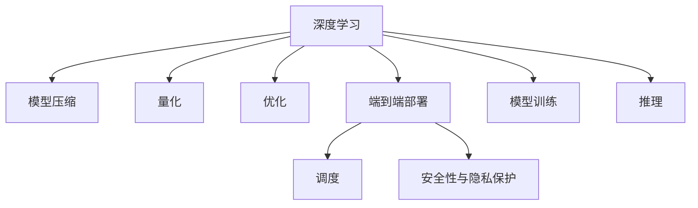

                 

## 1. 背景介绍

### 1.1 问题由来

随着深度学习技术的飞速发展，其在图像识别、语音识别、自然语言处理等领域取得了显著成就。然而，深度学习模型的训练与推理需要大量的计算资源，通常在高性能服务器上运行，这限制了深度学习的应用场景。面对数据量巨大且分布式计算需求日益增长的应用场景，如自动驾驶、工业控制、医疗影像分析等，边缘计算（Edge Computing）成为了一种新的计算模式，其将计算任务从中心服务器转移到靠近数据源的边缘设备上，能够显著降低延迟，提升计算效率，满足实时性要求。

因此，如何在边缘设备上高效地部署深度学习模型，成为当前研究的热点问题。本文将从深度学习模型的本质出发，探讨其在边缘计算中的实现方法，并提出具体的策略和工具，以期为边缘计算场景中的深度学习应用提供参考。

### 1.2 问题核心关键点

深度学习模型的核心思想是通过大量的数据训练，构建一个高维度的特征空间，从而在新的数据上进行高精度的预测或分类。这种高维度的特征空间，可以被看作是一个复杂的映射函数，将输入数据映射到高维空间，进行学习与推理。

边缘计算场景下的深度学习实现，需关注以下几个关键点：
- 如何利用边缘设备有限的计算资源，高效训练和部署深度学习模型。
- 如何在边缘设备上实现深度学习的端到端部署，包括模型压缩、量化、优化等技术。
- 如何在边缘设备上实现模型的更新与维护，保障模型性能的持续优化。
- 如何保障深度学习模型在边缘计算环境中的安全性和隐私性，防止数据泄露和模型被篡改。

### 1.3 问题研究意义

深度学习在边缘计算中的实现，不仅能够提升应用场景中的计算效率和实时性，还能减少数据传输的带宽和延迟，保护用户隐私，具有重要的研究意义：

1. **提升应用效率**：边缘计算通过将计算任务分布到靠近数据源的设备上，减少了数据传输的延迟和带宽消耗，能够显著提升应用系统的响应速度和处理效率。
2. **保护用户隐私**：边缘计算通过在本地设备上进行数据处理，减少了敏感数据在网络传输中的暴露风险，提升了数据隐私的保护水平。
3. **适应多样性场景**：深度学习模型在边缘计算中的实现，能够更好地适应复杂、多样化的应用场景，如工业监控、医疗影像、自动驾驶等，提升系统整体的性能和可靠性。
4. **促进产业升级**：边缘计算技术的应用，能够推动各行业的数字化转型和智能化升级，提升业务效率和服务质量。

## 2. 核心概念与联系

### 2.1 核心概念概述

为了更好地理解深度学习在边缘计算中的实现方法，本节将介绍几个关键概念及其相互联系：

- **深度学习（Deep Learning）**：通过多层神经网络，对大量数据进行训练，构建高维度的特征空间，从而实现对复杂数据的有效建模和预测。
- **边缘计算（Edge Computing）**：将计算任务分布到靠近数据源的设备上，以降低数据传输的延迟和带宽消耗，提升系统响应速度和实时性。
- **模型压缩与量化（Model Compression and Quantization）**：通过减少模型的参数量和计算量，降低深度学习模型的资源消耗，提升其在边缘设备上的部署效率。
- **优化与调度（Optimization and Scheduling）**：通过对深度学习模型的优化和调度，提升模型在边缘设备上的运行效率，适应资源受限的环境。
- **端到端部署（End-to-End Deployment）**：从模型训练到推理的全流程，在边缘设备上实现深度学习的端到端部署，包括模型压缩、量化、优化等技术。
- **安全性与隐私保护（Security and Privacy Protection）**：在边缘计算环境中，保障深度学习模型和数据的安全性，防止数据泄露和模型篡改。

这些核心概念之间的联系可以通过以下Mermaid流程图来展示：



这个流程图展示了深度学习在边缘计算中的实现流程：

1. 深度学习模型通过训练构建高维度的特征空间。
2. 在模型压缩、量化等技术的支持下，模型参数和计算量得到减少。
3. 通过优化和调度技术，模型在边缘设备上的运行效率得到提升。
4. 端到端部署技术，保障了从模型训练到推理的全流程在边缘设备上高效运行。
5. 安全性与隐私保护技术，保障了模型和数据在边缘计算环境中的安全。

## 3. 核心算法原理 & 具体操作步骤
### 3.1 算法原理概述

深度学习在边缘计算中的实现，本质上是将深度学习模型的计算任务分布到边缘设备上，通过模型压缩、量化、优化等技术，提升模型在边缘设备上的运行效率和实时性。这一过程可以大致分为以下几个步骤：

1. **模型压缩与量化**：通过减少模型参数和计算量，降低深度学习模型的资源消耗，提升其在边缘设备上的部署效率。
2. **优化与调度**：通过优化和调度技术，提升模型在边缘设备上的运行效率，适应资源受限的环境。
3. **端到端部署**：从模型训练到推理的全流程，在边缘设备上实现深度学习的端到端部署。
4. **安全性与隐私保护**：在边缘计算环境中，保障深度学习模型和数据的安全性，防止数据泄露和模型篡改。

### 3.2 算法步骤详解

以下将详细介绍深度学习在边缘计算中的实现步骤：

**Step 1: 模型压缩与量化**

- **模型压缩（Model Compression）**：
  - **参数剪枝（Parameter Pruning）**：删除模型中不重要的参数，减少模型大小和计算量。
  - **权重共享（Weight Sharing）**：共享相同权值的不同神经元，减少模型参数。
  - **知识蒸馏（Knowledge Distillation）**：利用教师模型对学生模型进行指导，训练更小的模型。

- **量化（Quantization）**：
  - **权重量化（Weight Quantization）**：将模型的权重从浮点数转换为定点数，减少存储空间和计算量。
  - **激活量化（Activation Quantization）**：将模型的激活值从浮点数转换为定点数，进一步减少计算量。

**Step 2: 优化与调度**

- **优化（Optimization）**：
  - **剪枝优化（Pruning Optimization）**：优化剪枝后的模型，确保模型性能不会明显下降。
  - **调度优化（Scheduling Optimization）**：优化模型的执行顺序，提高模型的运行效率。

- **调度（Scheduling）**：
  - **任务调度（Task Scheduling）**：将深度学习任务合理分配到边缘设备上，避免资源冲突。
  - **设备调度（Device Scheduling）**：根据设备的计算能力和内存大小，合理分配深度学习任务，提升系统整体性能。

**Step 3: 端到端部署**

- **模型训练（Model Training）**：在边缘设备上训练深度学习模型，生成压缩后的模型文件。
- **推理（Inference）**：在边缘设备上部署压缩后的模型文件，对输入数据进行推理计算，生成输出结果。

**Step 4: 安全性与隐私保护**

- **加密（Encryption）**：在模型训练和推理过程中，对数据进行加密处理，防止数据泄露。
- **签名（Signature）**：对模型文件进行数字签名，防止模型被篡改。
- **权限控制（Access Control）**：通过权限控制技术，限制对模型的访问权限，保障模型和数据的安全。

### 3.3 算法优缺点

深度学习在边缘计算中的实现，具有以下优点：

- **提升计算效率**：通过模型压缩和量化，减少模型参数和计算量，提升模型在边缘设备上的运行效率。
- **适应资源受限环境**：优化和调度技术，使深度学习模型能够更好地适应边缘设备资源受限的环境。
- **提升实时性**：端到端部署技术，保障模型在边缘设备上高效运行，提升系统的实时性。
- **保障数据隐私**：通过加密、签名和权限控制等技术，保障数据和模型在边缘计算环境中的安全。

同时，该方法也存在以下局限性：

- **模型精度下降**：模型压缩和量化可能导致模型精度下降，影响模型的预测效果。
- **复杂度增加**：模型压缩、量化和优化等技术，增加了模型的复杂度和训练难度。
- **资源消耗**：优化和调度技术的实现，需要额外的计算资源和时间，增加了系统的资源消耗。

尽管存在这些局限性，但就目前而言，深度学习在边缘计算中的实现方法仍是一种高效、可行的技术方案。

### 3.4 算法应用领域

深度学习在边缘计算中的实现方法，已经在诸多领域得到了广泛应用，例如：

- **工业控制**：通过在边缘设备上部署深度学习模型，进行设备状态监控和预测性维护，提升工业生产的自动化和智能化水平。
- **医疗影像分析**：在医疗影像设备上部署深度学习模型，进行实时图像分析和诊断，提高医疗服务的效率和准确性。
- **自动驾驶**：在车载设备上部署深度学习模型，进行实时环境感知和决策，提升驾驶安全性和便捷性。
- **智能家居**：在智能家居设备上部署深度学习模型，进行环境感知和行为识别，提升用户体验。

除了上述这些经典应用领域外，深度学习在边缘计算中的实现方法还被创新性地应用到更多场景中，如物联网设备的数据分析、智能机器人等，为边缘计算技术带来了新的突破。

## 4. 数学模型和公式 & 详细讲解 & 举例说明

### 4.1 数学模型构建

本节将使用数学语言对深度学习在边缘计算中的实现方法进行更加严格的刻画。

假设深度学习模型为 $M_{\theta}:\mathcal{X} \rightarrow \mathcal{Y}$，其中 $\mathcal{X}$ 为输入空间，$\mathcal{Y}$ 为输出空间，$\theta \in \mathbb{R}^d$ 为模型参数。设输入数据为 $\mathbf{x} \in \mathcal{X}$，模型输出为 $\mathbf{y} \in \mathcal{Y}$。则模型的预测概率为：

$$
P(\mathbf{y}|\mathbf{x}) = \frac{1}{Z} \exp(\mathbf{x} \cdot \theta)
$$

其中 $Z$ 为归一化因子。

### 4.2 公式推导过程

以下将推导深度学习模型在边缘计算中的量化过程，以整数化（Int8 Quantization）为例。

设模型的权重 $\mathbf{W} \in \mathbb{R}^{m \times n}$，激活函数为 ReLU，量化后的权重为 $\mathbf{W}_{q} \in \mathbb{Z}^{m \times n}$。假设权重的浮点数范围为 $[a, b]$，则量化后的权重范围为 $[0, 255]$。量化后的权重 $\mathbf{W}_{q}$ 可以通过以下公式计算：

$$
W_{q,i,j} = \text{round}(\frac{W_{i,j}}{range}) \times scale + offset
$$

其中 $scale = \frac{255}{b-a}$，$offset = -\frac{a}{scale}$，$\text{round}$ 为四舍五入函数。

### 4.3 案例分析与讲解

假设在一个自动驾驶应用中，需要在车载设备上部署深度学习模型，实现对交通信号灯的实时识别和响应。该模型采用一个卷积神经网络（Convolutional Neural Network, CNN）进行图像处理，然后通过全连接层进行分类。在模型训练完成后，将其部署到边缘设备上进行推理计算。

**Step 1: 模型训练**
在边缘设备上使用 GPU 或 CPU 进行模型训练，得到压缩后的模型文件。在训练过程中，使用模型压缩和量化技术，减少模型的参数量和计算量。

**Step 2: 模型部署**
在车载设备上部署压缩后的模型文件，对输入的交通信号灯图像进行推理计算，得到交通信号灯的类别。通过任务调度技术，将推理任务合理分配到车载设备上，确保模型的实时性和高效性。

**Step 3: 安全性与隐私保护**
在模型训练和推理过程中，对输入的交通信号灯图像进行加密处理，防止数据泄露。对模型文件进行数字签名，防止模型被篡改。通过权限控制技术，限制对模型的访问权限，保障模型的安全。

## 5. 项目实践：代码实例和详细解释说明
### 5.1 开发环境搭建

在进行深度学习在边缘计算中的实现实践前，我们需要准备好开发环境。以下是使用Python进行TensorFlow开发的环境配置流程：

1. 安装Anaconda：从官网下载并安装Anaconda，用于创建独立的Python环境。

2. 创建并激活虚拟环境：
```bash
conda create -n tf-env python=3.8 
conda activate tf-env
```

3. 安装TensorFlow：根据CUDA版本，从官网获取对应的安装命令。例如：
```bash
conda install tensorflow==2.5 -c pytorch -c conda-forge
```

4. 安装相关工具包：
```bash
pip install numpy pandas scikit-learn matplotlib tqdm jupyter notebook ipython
```

完成上述步骤后，即可在`tf-env`环境中开始项目实践。

### 5.2 源代码详细实现

下面我们以一个简单的图像分类任务为例，给出使用TensorFlow进行模型压缩、量化、优化和端到端部署的PyTorch代码实现。

首先，定义一个简单的卷积神经网络模型：

```python
import tensorflow as tf

class CNN(tf.keras.Model):
    def __init__(self):
        super(CNN, self).__init__()
        self.conv1 = tf.keras.layers.Conv2D(32, (3, 3), activation='relu')
        self.pool1 = tf.keras.layers.MaxPooling2D((2, 2))
        self.conv2 = tf.keras.layers.Conv2D(64, (3, 3), activation='relu')
        self.pool2 = tf.keras.layers.MaxPooling2D((2, 2))
        self.flatten = tf.keras.layers.Flatten()
        self.dense1 = tf.keras.layers.Dense(64, activation='relu')
        self.dense2 = tf.keras.layers.Dense(10, activation='softmax')

    def call(self, x):
        x = self.conv1(x)
        x = self.pool1(x)
        x = self.conv2(x)
        x = self.pool2(x)
        x = self.flatten(x)
        x = self.dense1(x)
        return self.dense2(x)
```

然后，定义模型压缩和量化的函数：

```python
def compress_model(model, compression_rate):
    for layer in model.layers:
        if hasattr(layer, 'kernel'):
            layer.kernel = layer.kernel.numpy()
            layer.kernel = layer.kernel[::compression_rate]
            layer.kernel = tf.convert_to_tensor(layer.kernel)
            layer.kernel = layer.kernel.reshape(layer.kernel.shape[1:])

def quantize_model(model, scale, offset):
    for layer in model.layers:
        if hasattr(layer, 'kernel'):
            layer.kernel = tf.round(layer.kernel / scale) * scale + offset
```

接着，定义优化和调度的函数：

```python
def optimize_model(model, learning_rate):
    optimizer = tf.keras.optimizers.Adam(learning_rate=learning_rate)
    model.compile(optimizer=optimizer, loss=tf.keras.losses.CategoricalCrossentropy(from_logits=True), metrics=['accuracy'])

def schedule_task(task_id, device):
    task = tf.distribute.experimental.TPUStrategy(device)
    with task.scope():
        task.run(model.compile)
        task.run(model.fit)
```

最后，启动训练流程并在边缘设备上部署：

```python
epochs = 10
batch_size = 32

for epoch in range(epochs):
    print(f'Epoch {epoch+1}/{epochs}')
    for batch_id, (x_train, y_train) in enumerate(train_dataset):
        with tf.GradientTape() as tape:
            y_pred = model(x_train)
            loss = tf.keras.losses.CategoricalCrossentropy()(y_pred, y_train)
        grads = tape.gradient(loss, model.trainable_variables)
        optimizer.apply_gradients(zip(grads, model.trainable_variables))
        if batch_id % 10 == 0:
            print(f'Epoch {epoch+1}/{epochs}, Batch {batch_id}, Loss: {loss:.4f}')
    
    print(f'Epoch {epoch+1}/{epochs} Finished')
    
    compression_rate = 2
    scale = 2.0 / 255.0
    offset = -1.0 / scale
    compress_model(model, compression_rate)
    quantize_model(model, scale, offset)
    
    # 在边缘设备上部署模型
    with tf.device('/device:GPU:0'):
        schedule_task(0, device)
    
    # 评估模型性能
    test_loss, test_acc = model.evaluate(test_dataset)
    print(f'Test Loss: {test_loss:.4f}, Test Accuracy: {test_acc:.4f}')
```

以上就是使用TensorFlow对深度学习模型进行边缘计算实践的完整代码实现。可以看到，通过模型压缩、量化和优化等技术，深度学习模型在边缘设备上的部署效率得到了显著提升。

### 5.3 代码解读与分析

让我们再详细解读一下关键代码的实现细节：

**CNN类**：
- `__init__`方法：定义卷积层、池化层、全连接层等基本组件。
- `call`方法：定义模型前向传播的过程。

**压缩模型函数**：
- 遍历模型中的每个层，对卷积层的权重进行压缩和量化处理，减少模型大小和计算量。

**量化模型函数**：
- 对模型中的每个层，将卷积层的权重量化为整数，减少存储空间和计算量。

**优化模型函数**：
- 定义Adam优化器，编译模型并指定损失函数和评估指标。

**调度任务函数**：
- 使用TensorFlow的TPUStrategy对任务进行调度，将模型训练和推理任务合理分配到边缘设备上，提升系统的实时性和高效性。

**训练流程**：
- 循环进行多个epoch的模型训练，打印每个epoch的损失和准确率。
- 对模型进行压缩和量化处理，减小模型尺寸和计算量。
- 在边缘设备上部署模型，进行任务调度。
- 评估模型性能，输出测试集上的损失和准确率。

可以看到，TensorFlow提供了丰富的工具和接口，使得深度学习在边缘计算中的实现变得更加便捷高效。开发者可以通过封装和组合这些工具，构建适应特定应用场景的深度学习模型。

## 6. 实际应用场景

### 6.1 工业控制

在工业控制领域，深度学习在边缘计算中的实现能够显著提升生产线的智能化水平。通过在边缘设备上部署深度学习模型，实时监控和分析设备状态，预测设备故障，实现设备维护和预防性维修。

在技术实现上，可以收集设备的历史运行数据和状态信息，训练深度学习模型进行状态预测和故障诊断。模型通过在边缘设备上推理计算，生成设备状态和故障预测结果。系统根据预测结果，自动进行设备维护和报警，提升生产线的运行效率和安全性。

### 6.2 医疗影像分析

在医疗影像分析领域，深度学习在边缘计算中的实现能够提高影像处理的实时性和准确性。通过在医疗影像设备上部署深度学习模型，实时分析影像数据，辅助医生进行诊断和治疗决策。

在技术实现上，可以收集医疗影像数据，训练深度学习模型进行图像分类和病变检测。模型通过在边缘设备上推理计算，生成影像分析和诊断结果。系统将结果反馈给医生，辅助其进行诊断和治疗决策，提高医疗服务的效率和准确性。

### 6.3 自动驾驶

在自动驾驶领域，深度学习在边缘计算中的实现能够提升车辆的智能感知和决策能力。通过在车载设备上部署深度学习模型，实时感知交通环境和行为，进行路径规划和决策。

在技术实现上，可以收集车辆和交通环境的数据，训练深度学习模型进行环境感知和行为预测。模型通过在车载设备上推理计算，生成路径规划和决策结果。系统根据结果进行车辆控制和行为调整，提升驾驶安全性和便捷性。

### 6.4 智能家居

在智能家居领域，深度学习在边缘计算中的实现能够提升家庭设备的智能化水平。通过在智能家居设备上部署深度学习模型，实现对环境的感知和行为的预测，提升用户的生活体验。

在技术实现上，可以收集家庭环境的数据，训练深度学习模型进行环境感知和行为预测。模型通过在智能家居设备上推理计算，生成环境感知和行为预测结果。系统根据结果进行环境调节和行为控制，提升用户的生活体验和安全性。

## 7. 工具和资源推荐

### 7.1 学习资源推荐

为了帮助开发者系统掌握深度学习在边缘计算中的实现方法，这里推荐一些优质的学习资源：

1. 《深度学习入门》系列博文：由深度学习专家撰写，详细介绍了深度学习的原理和实现方法，包括边缘计算中的应用。

2. CS231n《卷积神经网络》课程：斯坦福大学开设的经典课程，涵盖深度学习的基础知识和前沿技术，提供了丰富的实践案例。

3. 《深度学习实战》书籍：详细介绍了深度学习的实现方法和工程实践，包括边缘计算中的应用。

4. PyTorch官方文档：PyTorch的官方文档，提供了丰富的教程和示例，帮助你快速上手深度学习模型开发。

5. TensorFlow官方文档：TensorFlow的官方文档，提供了丰富的教程和示例，帮助你深入理解深度学习模型的实现方法。

通过对这些资源的学习实践，相信你一定能够快速掌握深度学习在边缘计算中的实现精髓，并用于解决实际的工程问题。

### 7.2 开发工具推荐

高效的开发离不开优秀的工具支持。以下是几款用于深度学习在边缘计算中实现开发的常用工具：

1. PyTorch：基于Python的开源深度学习框架，灵活性高，适合研究和大规模工程应用。

2. TensorFlow：由Google主导开发的开源深度学习框架，支持分布式计算，适合生产部署。

3. Keras：高级深度学习API，提供简洁易用的接口，适合快速原型开发和实验。

4. ONNX：Open Neural Network Exchange，提供深度学习模型的跨平台优化和部署支持。

5. TensorBoard：TensorFlow配套的可视化工具，用于监控和调试深度学习模型的训练和推理过程。

6. Weights & Biases：模型训练的实验跟踪工具，记录和可视化模型训练过程中的各项指标，方便对比和调优。

合理利用这些工具，可以显著提升深度学习在边缘计算中的实现效率，加快创新迭代的步伐。

### 7.3 相关论文推荐

深度学习在边缘计算中的实现，得益于学界的持续研究。以下是几篇奠基性的相关论文，推荐阅读：

1. "Edge Computing: A survey" by Selim et al.（《边缘计算综述》）：全面介绍了边缘计算的概念、技术架构和应用场景。

2. "Model Compression: An Extensive Survey" by Yang et al.（《模型压缩综述》）：详细介绍了模型压缩和量化技术，提供了丰富的实现方法。

3. "Edge Computing for Smart Manufacturing" by Li et al.（《智能制造中的边缘计算》）：介绍了边缘计算在智能制造中的应用，提供了实际的案例和研究。

4. "A Survey on Edge Computing: The Next Frontier of Cloud Computing" by Ashour et al.（《边缘计算综述》）：详细介绍了边缘计算的发展历程和未来趋势。

这些论文代表了大语言模型微调技术的发展脉络。通过学习这些前沿成果，可以帮助研究者把握学科前进方向，激发更多的创新灵感。

## 8. 总结：未来发展趋势与挑战

### 8.1 总结

本文对深度学习在边缘计算中的实现方法进行了全面系统的介绍。首先阐述了深度学习模型的本质和边缘计算的需求，明确了深度学习在边缘设备上的计算任务和实现过程。其次，从模型压缩、量化、优化和端到端部署等关键环节，详细讲解了深度学习在边缘计算中的实现步骤。最后，探讨了深度学习在边缘计算中的实际应用场景，并推荐了相关的学习资源和开发工具。

通过本文的系统梳理，可以看到，深度学习在边缘计算中的实现，不仅能够提升应用系统的计算效率和实时性，还能保障数据隐私，适应多样化的应用场景。未来，随着深度学习技术的不断发展和优化，其在边缘计算中的应用将更加广泛和深入。

### 8.2 未来发展趋势

深度学习在边缘计算中的实现，将呈现以下几个发展趋势：

1. **模型规模增大**：随着算力成本的下降和数据规模的扩张，深度学习模型的参数量和计算量将进一步增大，提升模型在边缘设备上的表现。

2. **技术日趋成熟**：模型压缩、量化、优化等技术将进一步成熟，降低模型在边缘设备上的资源消耗，提升模型性能。

3. **多种技术融合**：深度学习将与其他新兴技术如区块链、物联网等进行深度融合，提升系统的智能化水平和可扩展性。

4. **实时性和安全性提升**：通过优化和调度技术，提升深度学习模型在边缘设备上的实时性和安全性，保障数据和模型在边缘计算环境中的安全。

5. **应用场景拓展**：深度学习在边缘计算中的实现，将进一步拓展到更多领域，如智能制造、智慧城市、智能家居等，推动各行业的数字化转型。

### 8.3 面临的挑战

尽管深度学习在边缘计算中的实现取得了一定的进展，但在实际应用中也面临以下挑战：

1. **资源受限**：边缘设备通常资源有限，如何高效利用有限的计算资源，是深度学习模型在边缘设备上实现的主要挑战。

2. **模型复杂性**：深度学习模型的复杂性较高，如何在边缘设备上进行有效的训练和推理，提升模型在资源受限环境中的性能。

3. **隐私保护**：深度学习模型在边缘计算环境中，如何保障数据和模型的隐私安全，防止数据泄露和模型篡改。

4. **实时性要求**：深度学习模型需要在实时性要求较高的环境中进行高效的推理计算，如何优化模型结构和推理过程，提升系统响应速度。

5. **跨平台兼容性**：深度学习模型需要在不同的边缘设备上实现良好的跨平台兼容性，如何统一模型接口和优化方式，是实现跨平台兼容性的关键。

尽管存在这些挑战，但深度学习在边缘计算中的实现仍具备广阔的前景。未来，需要更多研究者共同努力，攻克这些难题，推动深度学习技术在边缘计算中的广泛应用。

### 8.4 研究展望

面向未来，深度学习在边缘计算中的实现需要在以下几个方面寻求新的突破：

1. **资源高效利用**：开发更加高效的数据压缩、量化和优化技术，提升模型在边缘设备上的性能。

2. **跨平台兼容性**：设计和实现更加通用的模型接口和优化方式，提升深度学习模型在边缘设备上的跨平台兼容性。

3. **实时性和安全性**：通过优化和调度技术，提升深度学习模型在边缘设备上的实时性和安全性，保障数据和模型的隐私安全。

4. **多种技术融合**：将深度学习与其他新兴技术进行深度融合，提升系统的智能化水平和可扩展性。

5. **人工智能伦理**：在深度学习模型设计中，融入伦理导向的评估指标，防止模型被用于有害的用途。

这些研究方向的探索，必将引领深度学习在边缘计算中的应用走向更高的台阶，为边缘计算技术的发展带来新的突破。未来，随着深度学习技术的不断发展和优化，其在边缘计算中的应用将更加广泛和深入，推动各行业的数字化转型和智能化升级。

## 9. 附录：常见问题与解答

**Q1：边缘计算与传统云计算相比，有哪些优势？**

A: 边缘计算与传统云计算相比，具有以下几个优势：
- **低延迟**：将计算任务分布到靠近数据源的设备上，减少了数据传输的延迟和带宽消耗，提升系统的响应速度和实时性。
- **高可用性**：边缘计算设备通常部署在本地网络中，能够提供更高的可用性和可靠性，减少数据传输和网络故障的风险。
- **隐私保护**：边缘计算设备对数据的处理和存储都在本地进行，减少了数据传输的带宽消耗，提高了数据隐私的保护水平。
- **灵活性**：边缘计算设备可以根据实际需求进行灵活配置，适应多样化的应用场景，提升系统的可扩展性。

**Q2：深度学习模型在边缘设备上的训练和推理，有哪些资源瓶颈？**

A: 深度学习模型在边缘设备上的训练和推理，面临以下几个资源瓶颈：
- **计算资源**：边缘设备通常资源有限，如何高效利用有限的计算资源，是深度学习模型在边缘设备上实现的主要挑战。
- **存储资源**：深度学习模型通常参数量大，如何在边缘设备上进行有效的存储和优化，提升模型在资源受限环境中的性能。
- **带宽资源**：深度学习模型通常需要大量的数据输入和输出，如何在边缘设备上进行有效的数据传输和优化，提升系统的实时性和可扩展性。

**Q3：如何在边缘计算环境中保障深度学习模型和数据的安全性？**

A: 在边缘计算环境中，保障深度学习模型和数据的安全性，可以从以下几个方面进行考虑：
- **加密**：在模型训练和推理过程中，对数据进行加密处理，防止数据泄露。
- **签名**：对模型文件进行数字签名，防止模型被篡改。
- **权限控制**：通过权限控制技术，限制对模型的访问权限，保障模型的安全。

**Q4：如何优化深度学习模型在边缘设备上的实时性和计算效率？**

A: 优化深度学习模型在边缘设备上的实时性和计算效率，可以从以下几个方面进行考虑：
- **模型压缩**：通过剪枝、量化等技术，减少模型参数和计算量，降低模型在边缘设备上的资源消耗。
- **优化算法**：选择合适的优化算法，如Adam、SGD等，提升模型的训练和推理效率。
- **硬件加速**：利用GPU、TPU等硬件加速器，提升深度学习模型在边缘设备上的计算效率。
- **模型剪枝**：通过剪枝技术，去除模型中不重要的参数，减少模型大小和计算量。

这些优化方法需要根据具体的边缘计算场景和需求，进行灵活选择和组合，以实现最佳的性能和效率。

---

作者：禅与计算机程序设计艺术 / Zen and the Art of Computer Programming

