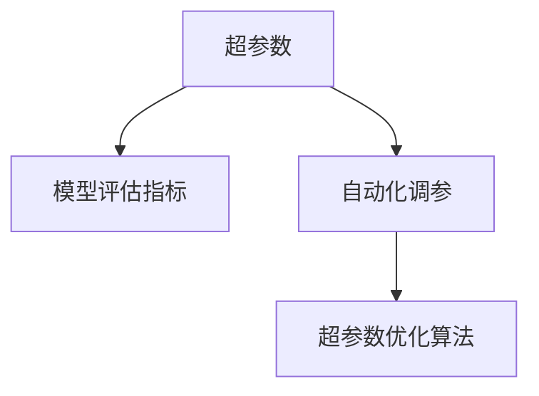

                 

## 1. 背景介绍

随着深度学习技术在人工智能领域的广泛应用，模型的调参成为了一个非常关键的步骤。模型调参通常需要手动调整大量的超参数，比如学习率、批量大小、优化器等。这个过程既耗时又容易陷入局部最优解，降低了模型的性能和泛化能力。为此，近年来自动化调参技术得到了越来越多的关注，旨在减少手动调参的复杂性，提高模型的性能。

### 1.1 问题由来
深度学习模型通常由多个神经网络层构成，每层都有多个超参数需要调整。传统的手动调参方法是通过多次试验来优化超参数，这样不仅耗时且容易陷入局部最优解。同时，由于超参数的数量和相互影响关系非常复杂，手动调参很难保证找到全局最优解。

自动化调参技术通过利用机器学习的方法，自动寻找超参数的最优值，从而提高模型的性能和泛化能力。它不仅可以大大减少调参的复杂性，还能保证调参过程更加高效和准确。

### 1.2 问题核心关键点
自动化调参技术主要包括：
- 自动超参数优化算法：通过机器学习的方法，自动寻找最优的超参数组合。
- 可解释的调参过程：提供模型调参的详细解释，帮助开发者理解模型调参的逻辑。
- 多目标优化：考虑多个指标（如准确率、召回率、F1值等），平衡多个目标，选出最优的超参数组合。

### 1.3 问题研究意义
自动化调参技术在深度学习中的应用，具有重要意义：
- 提高模型性能：通过优化超参数，能够显著提升模型的性能和泛化能力。
- 缩短开发周期：自动调参能够大幅缩短模型训练和调参的时间，加快模型开发速度。
- 降低开发成本：自动调参减少了手动调参的复杂性，降低了开发的成本。
- 增强模型可解释性：自动调参提供详细的调参过程，帮助开发者理解模型的工作原理。
- 提升模型可扩展性：自动调参使得模型更易于扩展，适应不同的应用场景。

## 2. 核心概念与联系

### 2.1 核心概念概述

为了更好地理解自动化调参技术，本节将介绍几个关键概念：

- 超参数：在深度学习模型中，不能由模型自动学习得到，需要手动设置的参数，如学习率、批量大小、优化器等。
- 自动化调参：利用机器学习算法，自动寻找最优的超参数组合。
- 超参数优化算法：用于寻找最优超参数组合的算法，如随机搜索、网格搜索、贝叶斯优化等。
- 模型评估指标：用于衡量模型性能的指标，如准确率、召回率、F1值、均方误差等。

这些概念之间的关系可以通过以下Mermaid流程图来展示：



这个流程图展示了自动化调参的核心概念及其之间的联系：

1. 超参数是深度学习模型的重要组成部分。
2. 模型评估指标用于衡量模型的性能，是超参数优化的依据。
3. 自动化调参通过超参数优化算法，自动寻找最优的超参数组合。

这些概念共同构成了自动化调参技术的框架，使其能够自动地优化深度学习模型的超参数。

## 3. 核心算法原理 & 具体操作步骤
### 3.1 算法原理概述

自动化调参技术的核心原理是通过优化算法自动寻找最优的超参数组合。常用的超参数优化算法包括：

- 随机搜索：在一定的超参数空间中随机选择一组超参数，然后计算模型在该超参数下的性能指标，迭代多次，选出性能最好的超参数组合。
- 网格搜索：在超参数空间中，定义一个网格状的超参数组合，然后计算每个组合的模型性能，选出性能最好的组合。
- 贝叶斯优化：利用贝叶斯统计方法，通过不断更新模型性能和超参数的关系，逐步逼近最优超参数组合。
- 梯度优化：利用梯度下降等优化算法，更新超参数，使得模型性能不断提升。

这些算法通常用于寻找最优的超参数组合，但不同的算法在计算效率和精度方面有所不同。因此，在实际应用中需要根据具体的任务和数据集，选择合适的超参数优化算法。

### 3.2 算法步骤详解

自动化调参技术通常包括以下几个关键步骤：

**Step 1: 准备数据集和基线模型**

- 收集数据集，并将其划分为训练集、验证集和测试集。
- 准备基线模型，即初始的未调参模型。

**Step 2: 定义超参数空间**

- 根据任务特点，定义超参数空间，包括学习率、批量大小、优化器等。
- 通常，超参数空间为一个多维空间，需要合理设置超参数的范围。

**Step 3: 选择超参数优化算法**

- 根据数据集大小、超参数数量和计算资源，选择合适的超参数优化算法。
- 常用的算法有随机搜索、网格搜索、贝叶斯优化等。

**Step 4: 训练和评估模型**

- 将超参数优化算法应用到基线模型中，不断调整超参数，训练模型。
- 在验证集上评估模型性能，选择性能最好的超参数组合。

**Step 5: 微调模型**

- 在测试集上使用最优的超参数组合，重新训练模型，获得最终的性能指标。

### 3.3 算法优缺点

自动化调参技术具有以下优点：
1. 高效性：自动调参能够显著减少手动调参的时间和复杂性，提高调参效率。
2. 准确性：自动调参可以自动寻找最优的超参数组合，避免手动调参的局部最优解。
3. 可扩展性：自动调参可以应用于不同的深度学习模型和任务，具有广泛的适用性。
4. 可解释性：自动调参能够提供详细的调参过程，帮助开发者理解模型的工作原理。

但自动化调参技术也存在一些缺点：
1. 计算资源需求高：自动调参需要大量的计算资源，尤其是贝叶斯优化等算法。
2. 参数优化复杂：自动调参需要对超参数空间进行全面探索，计算复杂度高。
3. 结果依赖数据集：自动调参的结果依赖于数据集的特点和质量，可能存在过拟合或欠拟合的问题。

### 3.4 算法应用领域

自动化调参技术在深度学习中得到了广泛的应用，覆盖了几乎所有常见的任务，例如：

- 图像分类：通过自动调参，显著提升图像分类的准确率。
- 目标检测：自动调参可以优化目标检测模型的参数，提高检测的准确率和召回率。
- 语音识别：通过自动调参，优化语音识别模型的超参数，提高识别的准确率和鲁棒性。
- 自然语言处理：自动调参可以优化NLP模型的参数，提高文本分类的准确率和情感分析的效果。
- 推荐系统：自动调参可以优化推荐模型的超参数，提高推荐效果和用户满意度。

除了上述这些经典任务外，自动调参技术也被创新性地应用到更多场景中，如可控文本生成、图像生成、视频分析等，为深度学习技术带来了全新的突破。随着超参数优化方法的不断进步，相信自动调参技术将在更广阔的应用领域发挥重要作用。

## 4. 数学模型和公式 & 详细讲解 & 举例说明

### 4.1 数学模型构建

本节将使用数学语言对自动化调参技术的核心算法进行更加严格的刻画。

记超参数空间为 $\mathcal{S}=\{\theta_1, \theta_2, \dots, \theta_k\}$，其中 $\theta_i$ 表示第 $i$ 个超参数，$k$ 为超参数的数量。设模型的性能指标为 $f(\theta)$，表示模型在超参数 $\theta$ 下的性能。

定义超参数优化算法的目标为：

$$
\min_{\theta \in \mathcal{S}} f(\theta)
$$

常用的超参数优化算法可以通过计算模型在超参数空间中的性能指标，自动寻找最优的超参数组合。

### 4.2 公式推导过程

以下我们以随机搜索为例，推导超参数优化算法的数学公式。

随机搜索算法在超参数空间中随机选择一组超参数 $\theta$，然后计算模型在该超参数下的性能指标 $f(\theta)$。算法迭代多次，选出性能最好的超参数组合。具体步骤如下：

1. 随机选择一组超参数 $\theta_0 \in \mathcal{S}$。
2. 计算模型在超参数 $\theta_0$ 下的性能指标 $f(\theta_0)$。
3. 记录当前最优的超参数组合 $\theta_{opt}$ 和性能指标 $f_{opt}$。
4. 重复步骤 1-3，直至达到预设的迭代次数 $N$。
5. 选择性能最好的超参数组合 $\theta_{opt}$。

随机搜索的数学公式如下：

$$
\theta_{opt} = \arg\min_{\theta \in \mathcal{S}} f(\theta)
$$

### 4.3 案例分析与讲解

以一个简单的二分类模型为例，分析自动调参的流程。

假设我们有数据集 $\mathcal{D} = \{(x_i, y_i)\}_{i=1}^N$，其中 $x_i$ 为输入特征，$y_i$ 为标签。我们选择一个简单的线性分类器，定义其超参数空间为 $\mathcal{S} = \{\theta_1 = w, \theta_2 = b\}$，其中 $w$ 为权重向量，$b$ 为偏置项。

我们选择随机搜索算法进行超参数优化。假设我们选择了 10 个随机超参数组合 $\{\theta_0^{(i)}\}_{i=1}^{10}$，计算每个组合的模型性能 $f(\theta_0^{(i)})$，得到如下结果：

$$
f(\theta_0^{(1)}) = 0.9, f(\theta_0^{(2)}) = 0.85, \dots, f(\theta_0^{(10)}) = 0.8
$$

最优的超参数组合为 $\theta_{opt} = (w_{opt}, b_{opt})$，其性能指标为 $f_{opt} = 0.9$。

通过自动调参，我们可以得到最优的超参数组合，避免了手动调参的复杂性和风险。

## 5. 项目实践：代码实例和详细解释说明
### 5.1 开发环境搭建

在进行自动调参实践前，我们需要准备好开发环境。以下是使用Python进行TensorFlow开发的环境配置流程：

1. 安装Anaconda：从官网下载并安装Anaconda，用于创建独立的Python环境。

2. 创建并激活虚拟环境：
```bash
conda create -n tf-env python=3.8 
conda activate tf-env
```

3. 安装TensorFlow：根据CUDA版本，从官网获取对应的安装命令。例如：
```bash
conda install tensorflow==2.7 -c tf -c conda-forge
```

4. 安装各类工具包：
```bash
pip install numpy pandas scikit-learn matplotlib tqdm jupyter notebook ipython
```

完成上述步骤后，即可在`tf-env`环境中开始自动调参实践。

### 5.2 源代码详细实现

下面我们以图像分类任务为例，给出使用TensorFlow和Keras实现自动调参的代码实现。

首先，定义图像分类任务的数据处理函数：

```python
import tensorflow as tf
from tensorflow.keras.preprocessing.image import ImageDataGenerator
from tensorflow.keras.applications.resnet50 import preprocess_input

def load_data(batch_size=32):
    train_datagen = ImageDataGenerator(
        rescale=1./255,
        shear_range=0.2,
        zoom_range=0.2,
        horizontal_flip=True)
    test_datagen = ImageDataGenerator(rescale=1./255)
    
    train_generator = train_datagen.flow_from_directory(
        'train',
        target_size=(224, 224),
        batch_size=batch_size,
        class_mode='categorical')
    test_generator = test_datagen.flow_from_directory(
        'test',
        target_size=(224, 224),
        batch_size=batch_size,
        class_mode='categorical')
    
    return train_generator, test_generator
```

然后，定义模型和优化器：

```python
from tensorflow.keras.models import Sequential
from tensorflow.keras.layers import Dense, Flatten, Conv2D, MaxPooling2D
from tensorflow.keras.optimizers import Adam

model = Sequential()
model.add(Conv2D(32, (3, 3), activation='relu', input_shape=(224, 224, 3)))
model.add(MaxPooling2D((2, 2)))
model.add(Conv2D(64, (3, 3), activation='relu'))
model.add(MaxPooling2D((2, 2)))
model.add(Flatten())
model.add(Dense(128, activation='relu'))
model.add(Dense(5, activation='softmax'))
model.compile(optimizer=Adam(lr=0.001), loss='categorical_crossentropy', metrics=['accuracy'])

```

接着，定义超参数空间和评估函数：

```python
from tensorflow.keras.wrappers.scikit_learn import KerasClassifier

def create_model(learning_rate):
    model = Sequential()
    model.add(Conv2D(32, (3, 3), activation='relu', input_shape=(224, 224, 3)))
    model.add(MaxPooling2D((2, 2)))
    model.add(Conv2D(64, (3, 3), activation='relu'))
    model.add(MaxPooling2D((2, 2)))
    model.add(Flatten())
    model.add(Dense(128, activation='relu'))
    model.add(Dense(5, activation='softmax'))
    model.compile(optimizer=Adam(lr=learning_rate), loss='categorical_crossentropy', metrics=['accuracy'])
    return model

n_splits = 5
n_splits = 5
learning_rate_values = [0.001, 0.01, 0.1, 0.05, 0.001]
classifier = KerasClassifier(build_fn=create_model, verbose=0)
param_grid = dict(learning_rate=learning_rate_values)
kfold = StratifiedKFold(n_splits=n_splits, random_state=1, shuffle=True)
```

最后，启动训练流程并在测试集上评估：

```python
from sklearn.model_selection import GridSearchCV

grid = GridSearchCV(classifier, param_grid=param_grid, cv=kfold, n_jobs=-1, verbose=2)
grid_result = grid.fit(train_generator, validation_data=test_generator)
print("Best: %f using %s" % (grid_result.best_score_, grid_result.best_params_))

```

以上就是使用TensorFlow和Keras进行自动调参的完整代码实现。可以看到，借助KerasClassifier和GridSearchCV，可以方便地实现超参数的自动调参。

### 5.3 代码解读与分析

让我们再详细解读一下关键代码的实现细节：

**KerasClassifier类**：
- `build_fn`方法：定义模型的构建函数，方便在网格搜索中重复使用。
- `verbose`参数：控制输出调参过程中的日志信息。

**param_grid字典**：
- 定义超参数空间的维度和范围，这里学习率的取值范围为[0.001, 0.01, 0.1, 0.05, 0.001]。

**GridSearchCV类**：
- `fit`方法：执行网格搜索，在指定的超参数空间中，选择最优的超参数组合。
- `best_score_`属性：返回网格搜索中的最优性能指标。
- `best_params_`属性：返回网格搜索中的最优超参数组合。

通过调用GridSearchCV，可以方便地自动调参，选择最优的超参数组合。

## 6. 实际应用场景
### 6.1 智能推荐系统

自动化调参技术在智能推荐系统中得到了广泛的应用。推荐系统通常需要优化多个超参数，如学习率、模型结构、特征维度等。通过自动调参，可以显著提升推荐模型的性能，提高用户的满意度和推荐效果。

在实际应用中，可以收集用户的历史行为数据，提取和推荐物品的特征，将数据集划分为训练集、验证集和测试集。在超参数空间中，通过自动调参，选择最优的超参数组合，训练推荐模型。微调模型后，在测试集上评估模型性能，选择性能最好的超参数组合。

### 6.2 医疗影像诊断

医疗影像诊断是一个复杂的任务，需要优化多个超参数，如学习率、滤波器大小、卷积核数量等。通过自动调参，可以显著提升模型的诊断准确率，提高医生的工作效率和诊断质量。

在实际应用中，可以收集医疗影像数据，提取和标注特征，将数据集划分为训练集、验证集和测试集。在超参数空间中，通过自动调参，选择最优的超参数组合，训练诊断模型。微调模型后，在测试集上评估模型性能，选择性能最好的超参数组合。

### 6.3 金融风险预测

金融风险预测是一个重要的任务，需要优化多个超参数，如学习率、特征选择、模型结构等。通过自动调参，可以显著提升模型的预测准确率，提高金融机构的决策效率和风险控制能力。

在实际应用中，可以收集金融数据，提取和标注特征，将数据集划分为训练集、验证集和测试集。在超参数空间中，通过自动调参，选择最优的超参数组合，训练预测模型。微调模型后，在测试集上评估模型性能，选择性能最好的超参数组合。

### 6.4 未来应用展望

随着自动化调参技术的不断发展，未来将在更多领域得到应用，为各行各业带来变革性影响。

在智慧医疗领域，通过自动化调参技术，构建更加精确的医学诊断模型，提升医疗服务的智能化水平。在智能教育领域，通过自动调参技术，构建更加个性化的推荐系统，因材施教，促进教育公平。在智能客服领域，通过自动调参技术，构建更加智能的客服系统，提升客户咨询体验。

此外，在智慧城市治理、智能制造、智能交通等领域，自动调参技术也将发挥重要作用，为传统行业数字化转型升级提供新的技术路径。

## 7. 工具和资源推荐
### 7.1 学习资源推荐

为了帮助开发者系统掌握自动化调参技术的理论基础和实践技巧，这里推荐一些优质的学习资源：

1. 《深度学习调参的艺术》系列博文：由深度学习专家撰写，深入浅出地介绍了深度学习调参的基本概念和常用方法。

2. 《TensorFlow调参指南》书籍：TensorFlow官方出版的调参指南，系统介绍了TensorFlow中的调参方法和工具。

3. 《Keras深度学习实战》书籍：Keras官方出版的实战指南，介绍了Keras中的调参方法和工具。

4. Keras文档：Keras官方文档，提供了详细的调参示例和API接口，方便开发者学习和使用。

5. Keras Tuner：Keras官方提供的调参库，提供了丰富的调参算法和超参数优化方法。

通过对这些资源的学习实践，相信你一定能够快速掌握自动化调参技术的精髓，并用于解决实际的深度学习问题。

### 7.2 开发工具推荐

高效的开发离不开优秀的工具支持。以下是几款用于深度学习调参开发的常用工具：

1. TensorFlow：由Google主导开发的开源深度学习框架，生产部署方便，适合大规模工程应用。提供了丰富的调参算法和工具。

2. Keras：Google开发的高级深度学习框架，易于使用，提供了便捷的调参API接口。

3. Keras Tuner：Keras官方提供的调参库，提供了丰富的调参算法和超参数优化方法。

4. Weights & Biases：模型训练的实验跟踪工具，可以记录和可视化模型训练过程中的各项指标，方便对比和调优。与主流深度学习框架无缝集成。

5. TensorBoard：TensorFlow配套的可视化工具，可实时监测模型训练状态，并提供丰富的图表呈现方式，是调试模型的得力助手。

6. Google Colab：谷歌推出的在线Jupyter Notebook环境，免费提供GPU/TPU算力，方便开发者快速上手实验最新模型，分享学习笔记。

合理利用这些工具，可以显著提升深度学习调参任务的开发效率，加快创新迭代的步伐。

### 7.3 相关论文推荐

深度学习调参技术的发展源于学界的持续研究。以下是几篇奠基性的相关论文，推荐阅读：

1. Bayesian Optimization for Hyperparameter Tuning: A Survey（贝叶斯优化用于超参数调优：综述）：详细介绍了贝叶斯优化的原理和应用，是超参数调优的经典文献。

2. CRAFT: A Comparative Study of Deep Learning Hyperparameter Search Methods（CRAFT：深度学习超参数搜索方法比较研究）：比较了多种超参数搜索方法的性能和效率，提供了调参的实验结果和分析。

3. Hyperband: A Novel Bandit-Based Approach to Hyperparameter Optimization（Hyperband：一种基于贝叶斯优化的超参数优化方法）：提出了Hyperband算法，进一步提高了超参数优化的效率。

4. AutoML：Efficient and Effective Automated Machine Learning（AutoML：高效自动化的机器学习）：综述了自动机器学习的研究进展和应用，介绍了自动调参技术的最新研究和发展。

5. Deep Learning Hyperparameter Optimization（深度学习超参数优化）：综述了深度学习调参技术的研究进展，介绍了多种调参算法和工具。

这些论文代表了大模型调参技术的发展脉络。通过学习这些前沿成果，可以帮助研究者把握学科前进方向，激发更多的创新灵感。

## 8. 总结：未来发展趋势与挑战

### 8.1 总结

本文对自动化调参技术进行了全面系统的介绍。首先阐述了自动化调参技术的研究背景和意义，明确了自动调参在深度学习模型优化中的重要价值。其次，从原理到实践，详细讲解了自动化调参的数学原理和关键步骤，给出了调参任务开发的完整代码实例。同时，本文还广泛探讨了自动调参技术在智能推荐、医疗影像诊断、金融风险预测等多个领域的应用前景，展示了自动调参技术的巨大潜力。此外，本文精选了调参技术的各类学习资源，力求为读者提供全方位的技术指引。

通过本文的系统梳理，可以看到，自动化调参技术正在成为深度学习模型优化的重要范式，极大地提升了模型性能和泛化能力。未来，随着超参数优化方法的不断进步，相信自动化调参技术将在更广泛的领域得到应用，为各行各业带来变革性影响。

### 8.2 未来发展趋势

展望未来，自动化调参技术将呈现以下几个发展趋势：

1. 超参数优化算法将不断创新：未来的超参数优化算法将更加高效和精确，能够更好地平衡计算资源和优化效果。

2. 自动化调参将更加普及：随着超参数优化算法的不断优化和调参工具的完善，自动化调参技术将更加普及，成为深度学习开发的标准流程。

3. 多目标调参将更加成熟：未来的自动化调参将更加注重多目标优化，考虑模型的准确率、召回率、鲁棒性等多个指标，提高模型的综合性能。

4. 自动调参与超网络结合：未来的自动调参将更加注重超网络的研究，通过超网络技术，实现自动化的模型选择和优化。

5. 自动化调参与生成对抗网络（GAN）结合：未来的自动调参将更加注重GAN的研究，通过GAN技术，生成更多的训练数据，提高模型的泛化能力。

以上趋势凸显了自动化调参技术的广阔前景。这些方向的探索发展，必将进一步提升深度学习模型的性能和泛化能力，为人工智能技术的发展提供更加坚实的基础。

### 8.3 面临的挑战

尽管自动化调参技术已经取得了瞩目成就，但在迈向更加智能化、普适化应用的过程中，它仍面临着诸多挑战：

1. 计算资源需求高：自动化调参需要大量的计算资源，尤其是贝叶斯优化等算法。如何降低计算资源需求，提高调参效率，是未来的重要研究方向。

2. 超参数空间复杂：深度学习模型通常具有复杂的超参数空间，如何有效探索超参数空间，是调参技术面临的重大挑战。

3. 结果依赖数据集：自动化调参的结果依赖于数据集的特点和质量，可能存在过拟合或欠拟合的问题。如何提高调参结果的泛化能力，是调参技术的重要研究方向。

4. 超参数搜索策略：当前的超参数搜索策略存在一些缺陷，如局部最优、收敛速度慢等。如何改进超参数搜索策略，提高调参效率和效果，是调参技术的重要研究方向。

5. 可解释性和可控性：自动化调参技术需要提供详细的调参过程，帮助开发者理解模型的工作原理，同时需要保证调参过程的可控性，避免模型过拟合。

这些挑战需要学界和工业界共同努力，积极探索和突破，才能使自动化调参技术更加成熟和稳定。

### 8.4 研究展望

面对自动化调参技术面临的挑战，未来的研究需要在以下几个方面寻求新的突破：

1. 探索更高效的超参数优化算法：开发更加高效的超参数优化算法，降低计算资源需求，提高调参效率。

2. 研究多目标超参数优化：考虑多个指标，平衡模型的准确率、召回率、鲁棒性等多个目标，提高调参结果的泛化能力。

3. 引入超网络和生成对抗网络：通过超网络和生成对抗网络技术，实现自动化的模型选择和优化，提高调参效率和效果。

4. 提高超参数空间探索能力：通过优化超参数搜索策略，提高超参数空间的探索能力，避免局部最优解，提高调参结果的泛化能力。

5. 增强调参的可解释性和可控性：通过提供详细的调参过程，帮助开发者理解模型的工作原理，同时保证调参过程的可控性，避免模型过拟合。

这些研究方向的探索，必将引领深度学习调参技术迈向更高的台阶，为构建安全、可靠、可解释、可控的智能系统铺平道路。面向未来，深度学习调参技术还需要与其他人工智能技术进行更深入的融合，如知识表示、因果推理、强化学习等，多路径协同发力，共同推动深度学习技术的进步。只有勇于创新、敢于突破，才能不断拓展深度学习模型的边界，让智能技术更好地造福人类社会。

## 9. 附录：常见问题与解答

**Q1：超参数优化算法的计算复杂度是否影响模型训练速度？**

A: 超参数优化算法通常需要大量的计算资源，尤其是在贝叶斯优化等算法中，计算复杂度较高。这可能会影响模型训练速度。因此，在实际应用中，需要根据具体的超参数优化算法和计算资源，合理设计调参流程，平衡计算资源和调参效率。

**Q2：自动调参是否会影响模型的可解释性？**

A: 自动调参可能会降低模型的可解释性，因为调参过程通常是黑盒的，开发者无法理解具体的调参细节。为了提高可解释性，可以引入可解释的调参算法，如Permutation Importance、SHAP值等，帮助开发者理解模型的调参逻辑。

**Q3：自动调参是否会影响模型的泛化能力？**

A: 自动调参可能会影响模型的泛化能力，因为调参结果依赖于数据集的特点和质量。为了提高泛化能力，可以引入正则化技术，如Dropout、L2正则化等，避免模型过拟合。同时，可以采用多目标调参，综合考虑模型的多个指标，提高泛化能力。

**Q4：如何选择合适的超参数优化算法？**

A: 选择合适的超参数优化算法需要考虑以下几个因素：
1. 数据集大小：数据集越大，超参数优化算法的计算资源需求越高。
2. 超参数数量：超参数数量越多，超参数优化算法的计算复杂度越高。
3. 计算资源：计算资源越丰富，超参数优化算法的选择范围越广。

常用的超参数优化算法包括随机搜索、网格搜索、贝叶斯优化、梯度优化等。在实际应用中，需要根据具体的任务和数据集，选择合适的超参数优化算法。

**Q5：自动调参是否可以提高模型的训练效率？**

A: 自动调参可以显著提高模型的训练效率，因为它可以自动寻找最优的超参数组合，避免手动调参的复杂性和风险。但需要注意的是，自动调参的计算资源需求较高，可能会影响训练速度。因此，需要合理设计调参流程，平衡计算资源和调参效率。

以上问题与解答，旨在帮助开发者更好地理解自动化调参技术的原理和实践，提升深度学习模型调参的效率和效果。

---

作者：禅与计算机程序设计艺术 / Zen and the Art of Computer Programming

