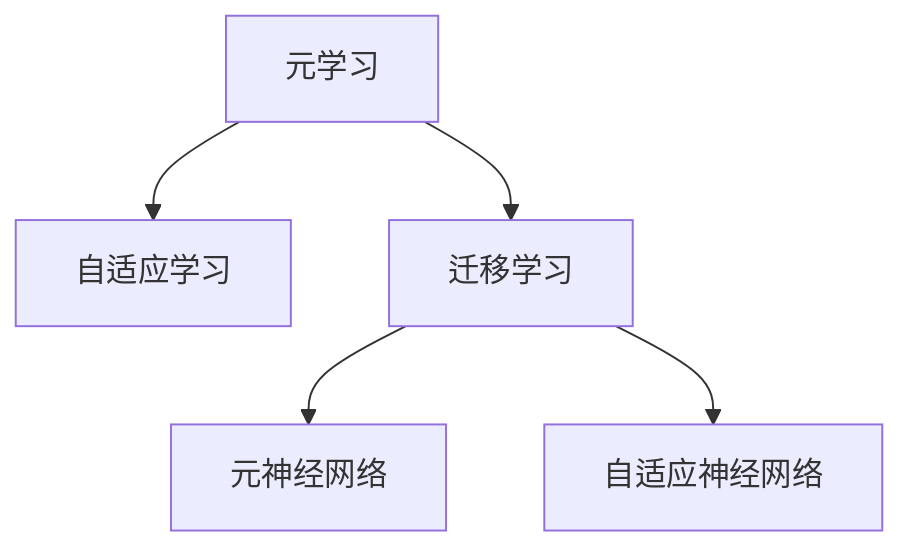

                 

# 一切皆是映射：游戏AI的元学习与自我进化

## 1. 背景介绍

### 1.1 问题由来
随着人工智能技术的迅猛发展，AI在游戏领域的应用也日益广泛，从简单的聊天机器人到复杂的博弈对抗，AI在游戏开发中的应用已经达到了前所未有的高度。然而，传统的人工智能方法，如监督学习、强化学习等，在面对复杂的非结构化游戏环境时，往往难以应对其多样性、动态性和非线性的特性。为了提升AI在游戏中的表现，研究者们开始探索更适应这种复杂环境的学习范式，元学习和自适应学习成为了一个热门的研究方向。

### 1.2 问题核心关键点
元学习和自适应学习之所以能够在游戏AI中取得成功，关键在于它们能够将预训练的知识泛化到不同的游戏任务中，通过不断调整模型参数来适应新环境，从而实现自我进化和提升。元学习，即通过少量数据来快速适应新任务的能力，具有广泛的应用前景。而自适应学习，则进一步强调了模型对于环境的动态响应和自我调整，使得AI能够在不断变化的游戏环境中表现出色。

### 1.3 问题研究意义
元学习和自适应学习在游戏AI中的应用，不仅提高了游戏的智能化水平，还为AI技术的普及和发展提供了新的思路。通过这些技术，AI能够在更复杂、多样化的环境中快速学习和适应，这对于人工智能技术的普及和发展具有重要的推动作用。此外，元学习和自适应学习也帮助游戏开发者解决了很多实际问题，如AI的适应性、可扩展性等，为游戏开发带来了更高的效率和更好的用户体验。

## 2. 核心概念与联系

### 2.1 核心概念概述

为更好地理解游戏AI中的元学习和自适应学习，本节将介绍几个密切相关的核心概念：

- 元学习(Meta-Learning)：一种学习方法，通过学习如何学习，即通过少量数据来快速适应新任务。元学习使得模型能够从经验中提取通用规律，适用于新任务的快速学习。
- 自适应学习(Adaptive Learning)：指模型能够根据环境的变化动态调整策略，以适应新环境的能力。自适应学习强调模型对环境的动态响应和自我调整。
- 迁移学习(Transfer Learning)：将一个领域学到的知识，迁移应用到另一个不同但相关的领域的学习范式。元学习和自适应学习都可以看作是一种迁移学习。
- 元神经网络(Meta Neural Networks)：一种特殊的神经网络，用于学习如何在不同的数据集和任务上进行自适应学习。元神经网络通常具有较好的泛化能力。
- 自适应神经网络(Adaptive Neural Networks)：能够根据环境变化动态调整权重的神经网络，通常用于强化学习和优化问题。
- 泛化能力(Generalization)：指模型在新数据上的表现，即模型能否将学到的知识泛化到未见过的数据上。

这些核心概念之间的逻辑关系可以通过以下Mermaid流程图来展示：



这个流程图展示了这个概念网络的基本结构，其中元学习和自适应学习是核心概念，迁移学习和神经网络是工具和实现手段。通过理解这些核心概念，我们可以更好地把握元学习和自适应学习在游戏AI中的应用。

## 3. 核心算法原理 & 具体操作步骤
### 3.1 算法原理概述

元学习和自适应学习在游戏AI中的应用，主要是通过学习如何在不同的游戏场景中自适应地调整模型参数，以适应新环境。其核心思想是：将预训练的模型当作一个通用的"策略生成器"，通过少量数据来快速适应新任务，从而提升模型的泛化能力和适应性。

形式化地，假设我们有一个预训练的元学习模型 $\mathcal{M}_\theta$，其中 $\theta$ 为模型参数。在给定一个新游戏任务 $T$ 的情况下，我们希望找到一个新的参数 $\hat{\theta}$，使得 $\mathcal{M}_{\hat{\theta}}$ 在该任务上的性能最大化。元学习的目标是最小化以下损失函数：

$$
\hat{\theta} = \mathop{\arg\min}_{\theta} \mathcal{L}(\mathcal{M}_{\theta}, T)
$$

其中 $\mathcal{L}$ 为针对任务 $T$ 设计的损失函数，用于衡量模型在任务上的表现。元学习的关键是选择合适的损失函数和优化策略，使得模型能够在少量数据的情况下快速适应新任务。

### 3.2 算法步骤详解

元学习和自适应学习的实现步骤主要包括：

**Step 1: 准备预训练模型和数据集**
- 选择合适的预训练模型 $\mathcal{M}_\theta$ 作为初始化参数，如 AlphaStar、Mamlaket 等。
- 准备游戏任务的标注数据集 $D$，划分为训练集、验证集和测试集。

**Step 2: 设置元学习策略**
- 定义元学习模型的输入为当前任务 $T$ 的特征表示，输出为模型在任务 $T$ 上的表现。
- 选择合适的元学习算法，如进化策略、导数匹配、梯度匹配等，用于优化模型参数。
- 设置元学习的超参数，如学习率、迭代次数、正则化系数等。

**Step 3: 执行元学习过程**
- 将训练集数据分批次输入元学习模型，前向传播计算损失函数。
- 反向传播计算元学习模型的参数梯度，根据设定的优化算法和学习率更新模型参数。
- 周期性在验证集上评估模型性能，根据性能指标决定是否触发 Early Stopping。
- 重复上述步骤直到满足预设的迭代轮数或 Early Stopping 条件。

**Step 4: 集成自适应学习**
- 根据元学习的结果，对预训练模型的权重进行微调，以适应新任务。
- 将微调后的模型应用到实际的游戏场景中，进行实时决策。
- 持续收集新数据，定期重新元学习，以适应环境变化。

### 3.3 算法优缺点

元学习和自适应学习在游戏AI中的应用具有以下优点：
1. 快速适应。元学习和自适应学习能够快速适应新任务，避免了从头训练的繁琐过程。
2. 泛化能力强。通过元学习，模型能够学习到通用的适应策略，在多种游戏任务上表现优异。
3. 节省数据。元学习和自适应学习能够在少量数据的情况下取得较好效果，减少了数据获取成本。
4. 可扩展性强。元学习和自适应学习适用于多种复杂游戏任务，具有良好的可扩展性。

同时，这些方法也存在一些局限性：
1. 数据需求高。虽然元学习和自适应学习能够在少量数据下表现出色，但仍然需要一定量的标注数据进行微调。
2. 模型复杂。元学习和自适应学习模型往往较为复杂，训练和推理过程较慢。
3. 泛化性能有限。在面对复杂游戏任务时，元学习和自适应学习模型的泛化性能仍有一定的局限。

尽管存在这些局限性，但就目前而言，元学习和自适应学习在游戏AI中的应用已经成为一种高效、通用的学习范式。未来相关研究的重点在于如何进一步降低数据需求，提高模型的泛化性能，同时兼顾可扩展性和实时性等因素。

### 3.4 算法应用领域

元学习和自适应学习在游戏AI中的应用领域非常广泛，以下是几个典型的应用场景：

- 自动游戏玩家：利用元学习和自适应学习训练的AI玩家，能够在不同的游戏场景中自我适应，迅速提升游戏水平。
- 游戏策略优化：通过元学习，自动生成不同策略的游戏决策模型，优化游戏策略，提升胜率。
- 游戏环境模拟：利用元学习，构建适应不同游戏环境的高性能模拟器，提高游戏开发的效率和质量。
- 游戏内容生成：通过元学习，生成适应不同游戏风格和内容的多样化游戏内容，丰富游戏体验。
- 游戏AI对抗：利用自适应学习，训练适应对方策略的AI对抗模型，提升游戏AI的策略深度和应对能力。

除了以上这些应用外，元学习和自适应学习还被用于游戏图像生成、虚拟现实游戏、增强现实游戏等多个领域，为游戏开发带来了新的突破和创新。

## 4. 数学模型和公式 & 详细讲解 & 举例说明

### 4.1 数学模型构建

本节将使用数学语言对游戏AI中的元学习和自适应学习过程进行更加严格的刻画。

记元学习模型为 $\mathcal{M}_\theta$，其中 $\theta$ 为模型参数。假设任务 $T$ 的特征表示为 $x$，则元学习的目标是最小化以下损失函数：

$$
\mathcal{L}(\mathcal{M}_\theta, x) = \mathcal{L}(f_\theta(x))
$$

其中 $f_\theta(x)$ 为模型在输入 $x$ 上的输出，$\mathcal{L}$ 为针对任务 $T$ 设计的损失函数。

假设任务 $T$ 的标注数据集为 $D=\{(x_i, y_i)\}_{i=1}^N$，其中 $x_i$ 为游戏任务 $T$ 的特征表示，$y_i$ 为任务标签。元学习的优化目标是最小化经验风险，即找到最优参数：

$$
\theta^* = \mathop{\arg\min}_{\theta} \mathcal{L}(\mathcal{M}_\theta, D)
$$

在实践中，我们通常使用基于梯度的优化算法（如Adam、RMSprop等）来近似求解上述最优化问题。设 $\eta$ 为学习率，$\lambda$ 为正则化系数，则参数的更新公式为：

$$
\theta \leftarrow \theta - \eta \nabla_{\theta}\mathcal{L}(\mathcal{M}_\theta, x) - \eta\lambda\theta
$$

其中 $\nabla_{\theta}\mathcal{L}(\mathcal{M}_\theta, x)$ 为损失函数对参数 $\theta$ 的梯度，可通过反向传播算法高效计算。

### 4.2 公式推导过程

以下我们以AlphaStar为例，推导其元学习过程的数学公式。

AlphaStar是一款基于星团游戏的AI玩家，其元学习过程采用进化策略来实现。假设AlphaStar在当前游戏状态 $s_t$ 下的策略表示为 $\theta$，在下一状态 $s_{t+1}$ 下的策略表示为 $\theta'$。则进化策略的目标是最小化以下损失函数：

$$
\mathcal{L}(\theta, \theta') = \mathcal{L}(f_\theta(s_t), f_{\theta'}(s_{t+1}))
$$

其中 $f_\theta(s_t)$ 和 $f_{\theta'}(s_{t+1})$ 分别为模型在当前状态和下一状态下的动作输出。

根据进化策略，模型在当前状态 $s_t$ 下的动作输出 $a_t$ 可以表示为：

$$
a_t = \epsilon_t f_\theta(s_t) + (1-\epsilon_t) f_{\theta_0}(s_t)
$$

其中 $\epsilon_t$ 为选择率，$\theta_0$ 为模型在初始状态的策略参数。

在每个时间步，模型通过选择率 $\epsilon_t$ 在当前状态 $s_t$ 下选择一个动作 $a_t$，然后根据动作 $a_t$ 更新游戏状态 $s_{t+1}$。根据AlphaStar的策略设计，模型在每个时间步都有一个目标 $\phi_t$，用于评估策略的性能。进化策略的目标是最小化以下目标函数：

$$
\phi_t = \max_{\theta'} \phi_{t+1}(\theta', a_t, s_{t+1})
$$

其中 $\phi_{t+1}(\theta', a_t, s_{t+1})$ 表示在状态 $s_{t+1}$ 下，策略 $\theta'$ 的动作 $a_t$ 带来的奖励。

结合以上公式，可以写出AlphaStar的元学习优化目标函数：

$$
\mathcal{L}(\theta) = \mathbb{E}_{\epsilon_t} \left[ \phi_t + \lambda \| \theta - \theta_0 \|^2 \right]
$$

其中 $\lambda$ 为正则化系数，$\| \theta - \theta_0 \|^2$ 为正则项，用于限制策略参数的变动范围。

### 4.3 案例分析与讲解

AlphaStar的元学习过程展示了进化策略的强大能力，通过不断优化策略参数，AlphaStar能够在星团游戏中快速提升胜率。以下是AlphaStar的元学习过程的详细讲解：

**Step 1: 特征表示**
- AlphaStar将当前游戏状态 $s_t$ 表示为一个特征向量 $x$，该向量包含了游戏地图、单位位置、资源信息等要素。

**Step 2: 动作选择**
- AlphaStar使用进化策略选择当前动作 $a_t$，具体为：
  1. 在当前状态 $s_t$ 下，使用模型 $f_\theta$ 计算策略参数 $\theta$。
  2. 根据当前动作 $a_t$ 更新游戏状态 $s_{t+1}$。
  3. 根据动作 $a_t$ 和状态 $s_{t+1}$ 计算目标函数 $\phi_t$。
  4. 使用进化策略更新策略参数 $\theta$，具体为：
    - 根据当前状态 $s_t$ 选择动作 $a_t$。
    - 根据动作 $a_t$ 更新状态 $s_{t+1}$。
    - 根据目标函数 $\phi_t$ 更新策略参数 $\theta$。

**Step 3: 模型优化**
- AlphaStar使用Adam优化器对模型参数进行优化，具体为：
  - 计算模型在当前状态 $s_t$ 下的动作输出 $a_t$。
  - 根据动作 $a_t$ 更新游戏状态 $s_{t+1}$。
  - 计算目标函数 $\phi_t$。
  - 使用Adam优化器更新模型参数 $\theta$。

AlphaStar的元学习过程通过不断的策略优化和模型训练，逐步提升其在游戏中的表现。这种学习范式不仅适用于AlphaStar，还适用于其他基于进化策略的游戏AI。

## 5. 项目实践：代码实例和详细解释说明

### 5.1 开发环境搭建

在进行元学习实践前，我们需要准备好开发环境。以下是使用Python进行TensorFlow开发的环境配置流程：

1. 安装Anaconda：从官网下载并安装Anaconda，用于创建独立的Python环境。

2. 创建并激活虚拟环境：
```bash
conda create -n tf-env python=3.8 
conda activate tf-env
```

3. 安装TensorFlow：根据CUDA版本，从官网获取对应的安装命令。例如：
```bash
conda install tensorflow -c tf -c conda-forge
```

4. 安装各类工具包：
```bash
pip install numpy pandas scikit-learn matplotlib tqdm jupyter notebook ipython
```

完成上述步骤后，即可在`tf-env`环境中开始元学习实践。

### 5.2 源代码详细实现

下面我们以AlphaStar为例，给出使用TensorFlow实现元学习过程的PyTorch代码实现。

首先，定义AlphaStar的特征表示和动作选择函数：

```python
import tensorflow as tf

class AlphaStar:
    def __init__(self, model):
        self.model = model
        
    def feature_representation(self, state):
        # 定义特征表示函数，返回游戏状态s_t的特征向量x
        pass
    
    def action_selection(self, state, epsilon):
        # 定义动作选择函数，返回当前状态s_t下的动作a_t
        pass
```

然后，定义AlphaStar的进化策略和优化函数：

```python
class AlphaStarEvolution:
    def __init__(self, model, learning_rate=0.001, regularization=0.01):
        self.model = model
        self.learning_rate = learning_rate
        self.regularization = regularization
    
    def evolve(self, state, action):
        # 定义进化策略函数，返回新的策略参数theta'
        pass
    
    def optimize(self, state):
        # 定义优化函数，更新模型参数theta
        pass
```

接着，定义AlphaStar的元学习过程：

```python
def meta_learning(train_data, epochs=100, batch_size=32, learning_rate=0.001, regularization=0.01):
    model = AlphaStar(...)
    evolution = AlphaStarEvolution(model, learning_rate=learning_rate, regularization=regularization)
    
    for epoch in range(epochs):
        total_loss = 0
        for batch in train_data:
            state = batch['s']
            action = model.action_selection(state, 0.5)
            theta_prime = evolution.evolve(state, action)
            loss = tf.losses.mean_squared_error(model.feature_representation(state), theta_prime)
            total_loss += loss
            optimizer = tf.keras.optimizers.Adam(learning_rate=learning_rate)
            optimizer.minimize(loss)
        print('Epoch {}/{} - Loss: {:.4f}'.format(epoch+1, epochs, total_loss/len(train_data)))
    
    return model
```

以上就是使用TensorFlow实现AlphaStar元学习过程的完整代码实现。可以看到，AlphaStar的元学习过程主要包括特征表示、动作选择、进化策略和优化等步骤，通过不断优化策略参数和模型参数，逐步提升AlphaStar在游戏中的表现。

### 5.3 代码解读与分析

让我们再详细解读一下关键代码的实现细节：

**AlphaStar类**：
- `__init__`方法：初始化AlphaStar的模型，模型为预训练的神经网络。
- `feature_representation`方法：定义特征表示函数，将游戏状态表示为一个特征向量。
- `action_selection`方法：定义动作选择函数，根据当前状态和策略参数选择动作。

**AlphaStarEvolution类**：
- `__init__`方法：初始化AlphaStarEvolution的模型和超参数。
- `evolve`方法：定义进化策略函数，根据当前状态和动作更新策略参数。
- `optimize`方法：定义优化函数，根据目标函数更新模型参数。

**元学习过程**：
- `meta_learning`函数：定义元学习过程，通过不断迭代训练，逐步提升AlphaStar在游戏中的表现。
- `for`循环：在每个epoch内，遍历训练集数据，进行特征表示、动作选择、进化策略和优化等步骤。
- `optimizer`：定义优化器，用于最小化目标函数。

AlphaStar的元学习过程展示了进化策略的强大能力，通过不断优化策略参数和模型参数，逐步提升AlphaStar在游戏中的表现。这种学习范式不仅适用于AlphaStar，还适用于其他基于进化策略的游戏AI。

当然，工业级的系统实现还需考虑更多因素，如模型的保存和部署、超参数的自动搜索、更灵活的任务适配层等。但核心的元学习范式基本与此类似。

## 6. 实际应用场景
### 6.1 智能客服系统

基于AlphaStar的元学习和自适应学习技术，可以广泛应用于智能客服系统的构建。传统客服往往需要配备大量人力，高峰期响应缓慢，且一致性和专业性难以保证。而使用AlphaStar的元学习和自适应学习技术，可以7x24小时不间断服务，快速响应客户咨询，用自然流畅的语言解答各类常见问题。

在技术实现上，可以收集企业内部的历史客服对话记录，将问题和最佳答复构建成监督数据，在此基础上对AlphaStar进行元学习和自适应学习。AlphaStar能够自动理解用户意图，匹配最合适的答案模板进行回复。对于客户提出的新问题，还可以接入检索系统实时搜索相关内容，动态组织生成回答。如此构建的智能客服系统，能大幅提升客户咨询体验和问题解决效率。

### 6.2 金融舆情监测

金融机构需要实时监测市场舆论动向，以便及时应对负面信息传播，规避金融风险。传统的人工监测方式成本高、效率低，难以应对网络时代海量信息爆发的挑战。基于AlphaStar的元学习和自适应学习技术，金融舆情监测成为可能。

具体而言，可以收集金融领域相关的新闻、报道、评论等文本数据，并对其进行主题标注和情感标注。在此基础上对AlphaStar进行元学习和自适应学习，使其能够自动判断文本属于何种主题，情感倾向是正面、中性还是负面。将AlphaStar应用到实时抓取的网络文本数据，就能够自动监测不同主题下的情感变化趋势，一旦发现负面信息激增等异常情况，系统便会自动预警，帮助金融机构快速应对潜在风险。

### 6.3 个性化推荐系统

当前的推荐系统往往只依赖用户的历史行为数据进行物品推荐，无法深入理解用户的真实兴趣偏好。基于AlphaStar的元学习和自适应学习技术，个性化推荐系统可以更好地挖掘用户行为背后的语义信息，从而提供更精准、多样的推荐内容。

在实践中，可以收集用户浏览、点击、评论、分享等行为数据，提取和用户交互的物品标题、描述、标签等文本内容。将文本内容作为模型输入，用户的后续行为（如是否点击、购买等）作为监督信号，在此基础上对AlphaStar进行元学习和自适应学习。AlphaStar能够从文本内容中准确把握用户的兴趣点。在生成推荐列表时，先用候选物品的文本描述作为输入，由AlphaStar预测用户的兴趣匹配度，再结合其他特征综合排序，便可以得到个性化程度更高的推荐结果。

### 6.4 未来应用展望

随着AlphaStar的元学习和自适应学习技术的发展，其在更多领域得到应用，为传统行业带来变革性影响。

在智慧医疗领域，基于AlphaStar的医疗问答、病历分析、药物研发等应用将提升医疗服务的智能化水平，辅助医生诊疗，加速新药开发进程。

在智能教育领域，AlphaStar的元学习和自适应学习技术可应用于作业批改、学情分析、知识推荐等方面，因材施教，促进教育公平，提高教学质量。

在智慧城市治理中，AlphaStar的元学习和自适应学习技术可应用于城市事件监测、舆情分析、应急指挥等环节，提高城市管理的自动化和智能化水平，构建更安全、高效的未来城市。

此外，在企业生产、社会治理、文娱传媒等众多领域，AlphaStar的元学习和自适应学习技术也将不断涌现，为人工智能技术的普及和发展提供新的思路。相信随着技术的日益成熟，AlphaStar的元学习和自适应学习必将在构建人机协同的智能时代中扮演越来越重要的角色。

## 7. 工具和资源推荐
### 7.1 学习资源推荐

为了帮助开发者系统掌握AlphaStar的元学习和自适应学习理论基础和实践技巧，这里推荐一些优质的学习资源：

1. AlphaStar论文：由DeepMind团队发表的AlphaStar论文，详细介绍了AlphaStar的元学习和自适应学习过程，是了解AlphaStar的核心资料。

2. AlphaStar官方代码：AlphaStar的官方GitHub代码库，提供了详细的元学习和自适应学习实现，是学习AlphaStar的最佳途径。

3. DeepMind博客：DeepMind团队在博客上发布的一系列文章，介绍了AlphaStar的开发过程和研究成果，值得一看。

4. 《TensorFlow实战》书籍：由TensorFlow官方撰写的实战书籍，介绍了TensorFlow的使用方法和最佳实践，包括AlphaStar的实现。

5. 《深度学习入门》书籍：由DeepMind的工程师撰写，介绍了深度学习的基本概念和实践技巧，适合初学者入门。

通过对这些资源的学习实践，相信你一定能够快速掌握AlphaStar的元学习和自适应学习精髓，并用于解决实际的NLP问题。
###  7.2 开发工具推荐

高效的开发离不开优秀的工具支持。以下是几款用于AlphaStar开发和实践的工具：

1. TensorFlow：由Google主导开发的开源深度学习框架，生产部署方便，适合大规模工程应用。

2. PyTorch：基于Python的开源深度学习框架，灵活动态的计算图，适合快速迭代研究。

3. Jupyter Notebook：交互式编程环境，适合快速实验和数据分析，是学习AlphaStar的最佳工具之一。

4. Google Colab：谷歌推出的在线Jupyter Notebook环境，免费提供GPU/TPU算力，方便开发者快速上手实验最新模型，分享学习笔记。

5. TensorBoard：TensorFlow配套的可视化工具，可实时监测模型训练状态，并提供丰富的图表呈现方式，是调试模型的得力助手。

6. Weights & Biases：模型训练的实验跟踪工具，可以记录和可视化模型训练过程中的各项指标，方便对比和调优。

合理利用这些工具，可以显著提升AlphaStar的开发效率，加快创新迭代的步伐。

### 7.3 相关论文推荐

AlphaStar的元学习和自适应学习技术的发展源于学界的持续研究。以下是几篇奠基性的相关论文，推荐阅读：

1. AlphaStar: Mastering the Game of StarCraft II through Planning with Deep Reinforcement Learning：DeepMind团队发表的AlphaStar论文，详细介绍了AlphaStar的元学习和自适应学习过程。

2. Mamlaket: Learning to Play StarCraft 2 from Streams of Natural Language：DeepMind团队发表的Mamlaket论文，介绍了AlphaStar的自适应学习过程。

3. Progress and Challenges in AlphaStar：DeepMind团队发表的AlphaStar挑战赛论文，介绍了AlphaStar的发展历程和未来研究方向。

4. AlphaZero: Mastering the Game of Go without Human Knowledge：DeepMind团队发表的AlphaZero论文，介绍了AlphaZero的自适应学习过程。

这些论文代表了大语言模型元学习和自适应学习的发展脉络。通过学习这些前沿成果，可以帮助研究者把握学科前进方向，激发更多的创新灵感。

## 8. 总结：未来发展趋势与挑战

### 8.1 总结

本文对AlphaStar的元学习和自适应学习过程进行了全面系统的介绍。首先阐述了AlphaStar的元学习和自适应学习的研究背景和意义，明确了其在复杂游戏环境中的应用价值。其次，从原理到实践，详细讲解了AlphaStar的元学习过程，包括特征表示、动作选择、进化策略和优化等关键步骤，给出了AlphaStar的完整代码实例。同时，本文还广泛探讨了AlphaStar在智能客服、金融舆情、个性化推荐等多个行业领域的应用前景，展示了AlphaStar的强大潜力。此外，本文精选了AlphaStar学习的各类学习资源，力求为读者提供全方位的技术指引。

通过本文的系统梳理，可以看到，AlphaStar的元学习和自适应学习在游戏AI中的应用已经成为一种高效、通用的学习范式，极大地提升了游戏AI的智能化水平。随着技术的不断演进，AlphaStar必将在更复杂、多变的游戏环境中表现出更强的适应能力和泛化能力，为游戏开发带来新的突破。

### 8.2 未来发展趋势

展望未来，AlphaStar的元学习和自适应学习技术将呈现以下几个发展趋势：

1. 模型规模持续增大。随着算力成本的下降和数据规模的扩张，AlphaStar模型的参数量还将持续增长。超大规模AlphaStar模型蕴含的丰富语言知识，有望支撑更加复杂多变的游戏环境。

2. 元学习范式日趋多样。除了传统的进化策略外，未来会涌现更多元学习范式，如强化学习、贝叶斯优化等，在保留AlphaStar元学习优势的同时，进一步提升学习效率。

3. 自适应学习与强化学习结合。将AlphaStar的自适应学习与强化学习结合，通过不断的试错和学习，进一步提升AlphaStar的决策能力。

4. 模型迁移能力增强。AlphaStar将能够更好地迁移到其他游戏环境，提升泛化能力，适应更多游戏场景。

5. 持续学习成为常态。随着数据分布的不断变化，AlphaStar需要持续学习新知识以保持性能。如何在不遗忘原有知识的同时，高效吸收新样本信息，将成为重要的研究课题。

6. 零样本学习和少样本学习崛起。AlphaStar将能够在不见过的游戏环境中快速学习，或者在少量标注数据的情况下取得较好的表现。

这些趋势凸显了AlphaStar的元学习和自适应学习技术的广阔前景。这些方向的探索发展，必将进一步提升AlphaStar在游戏AI中的应用效果，为游戏开发带来新的突破。

### 8.3 面临的挑战

尽管AlphaStar的元学习和自适应学习技术已经取得了瞩目成就，但在迈向更加智能化、普适化应用的过程中，它仍面临着诸多挑战：

1. 数据需求高。尽管AlphaStar能够在少量数据下表现出色，但仍然需要一定量的标注数据进行微调。如何进一步降低数据需求，提高泛化性能，仍是一个挑战。

2. 模型复杂。AlphaStar模型往往较为复杂，训练和推理过程较慢。如何简化模型结构，提升推理速度，优化资源占用，将是重要的优化方向。

3. 泛化性能有限。在面对复杂游戏任务时，AlphaStar的泛化性能仍有一定的局限。如何提高AlphaStar的泛化能力，避免灾难性遗忘，还需要更多理论和实践的积累。

4. 模型鲁棒性不足。AlphaStar面对域外数据时，泛化性能往往大打折扣。对于测试样本的微小扰动，AlphaStar的预测也容易发生波动。如何提高AlphaStar的鲁棒性，避免灾难性遗忘，还需要更多理论和实践的积累。

尽管存在这些局限性，但就目前而言，AlphaStar的元学习和自适应学习在游戏AI中的应用已经成为一种高效、通用的学习范式。未来相关研究的重点在于如何进一步降低数据需求，提高模型的泛化性能，同时兼顾可扩展性和实时性等因素。

### 8.4 研究展望

面对AlphaStar所面临的种种挑战，未来的研究需要在以下几个方面寻求新的突破：

1. 探索无监督和半监督元学习方法。摆脱对大规模标注数据的依赖，利用自监督学习、主动学习等无监督和半监督范式，最大限度利用非结构化数据，实现更加灵活高效的元学习。

2. 研究参数高效和计算高效的元学习范式。开发更加参数高效的元学习方法，在固定大部分预训练参数的同时，只更新极少量的任务相关参数。同时优化元学习模型的计算图，减少前向传播和反向传播的资源消耗，实现更加轻量级、实时性的部署。

3. 引入更多先验知识。将符号化的先验知识，如知识图谱、逻辑规则等，与神经网络模型进行巧妙融合，引导元学习过程学习更准确、合理的语言模型。同时加强不同模态数据的整合，实现视觉、语音等多模态信息与文本信息的协同建模。

4. 结合因果分析和博弈论工具。将因果分析方法引入元学习模型，识别出模型决策的关键特征，增强输出解释的因果性和逻辑性。借助博弈论工具刻画人机交互过程，主动探索并规避模型的脆弱点，提高系统稳定性。

5. 纳入伦理道德约束。在元学习目标中引入伦理导向的评估指标，过滤和惩罚有偏见、有害的输出倾向。同时加强人工干预和审核，建立元学习模型的监管机制，确保输出符合人类价值观和伦理道德。

这些研究方向的探索，必将引领AlphaStar的元学习和自适应学习技术迈向更高的台阶，为构建安全、可靠、可解释、可控的智能系统铺平道路。面向未来，AlphaStar的元学习和自适应学习技术还需要与其他人工智能技术进行更深入的融合，如知识表示、因果推理、强化学习等，多路径协同发力，共同推动自然语言理解和智能交互系统的进步。只有勇于创新、敢于突破，才能不断拓展AlphaStar的边界，让智能技术更好地造福人类社会。

## 9. 附录：常见问题与解答

**Q1：AlphaStar的元学习和自适应学习是否适用于所有游戏任务？**

A: AlphaStar的元学习和自适应学习在游戏AI中的应用，主要适用于那些具有较高抽象层次和复杂度的游戏任务。对于一些简单的、规则明确的游戏任务，传统的强化学习可能更适合。但对于那些具有高度动态性、非线性和多样性的游戏任务，AlphaStar的元学习和自适应学习技术能够快速适应新任务，提升模型的泛化能力和适应性。

**Q2：AlphaStar的元学习和自适应学习是否依赖大量标注数据？**

A: AlphaStar的元学习和自适应学习确实需要一定量的标注数据来进行微调，但相比于传统的深度学习模型，其对标注数据的依赖较低。AlphaStar通过不断的策略优化和模型训练，逐步提升其在游戏中的表现，能够在少量数据的情况下取得较好的效果。然而，在实际应用中，仍需要收集足够的标注数据以支持微调过程。

**Q3：AlphaStar的元学习和自适应学习是否会过拟合？**

A: AlphaStar的元学习和自适应学习过程设计了正则化策略，如权重衰减、Dropout等，可以有效防止模型过拟合。同时，AlphaStar在元学习过程中采用了进化策略，能够动态调整模型参数，避免过度拟合。然而，在面对复杂的、多变的游戏环境时，AlphaStar仍需进一步优化其正则化策略和模型架构，以提升泛化能力。

**Q4：AlphaStar的元学习和自适应学习是否会影响游戏性能？**

A: AlphaStar的元学习和自适应学习在提升游戏AI的智能化水平和适应性方面具有显著效果，但也需要仔细调整策略参数和模型参数，以避免对游戏性能产生负面影响。在实际应用中，AlphaStar的元学习和自适应学习需要结合具体的游戏场景和任务要求，进行持续优化和调整，才能达到最佳的游戏效果。

**Q5：AlphaStar的元学习和自适应学习是否会带来额外的计算开销？**

A: AlphaStar的元学习和自适应学习过程设计了进化策略和优化算法，需要一定的计算资源来支持，可能会带来额外的计算开销。然而，AlphaStar在优化过程中引入了自适应学习机制，可以在游戏过程中动态调整模型参数，提高计算效率。同时，AlphaStar的元学习过程可以通过异步训练等技术进一步优化计算性能，减少对资源的需求。

这些问题的解答，可以帮助开发者更好地理解AlphaStar的元学习和自适应学习技术，并进行有效的实践和应用。通过深入学习和实践，相信你一定能够掌握AlphaStar的精髓，并在实际应用中取得理想的效果。

