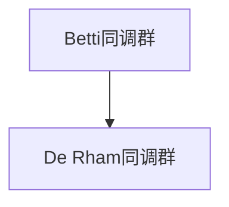

                 

## 1. 背景介绍

在数学中，上同调理论是代数拓扑学的一个重要分支，主要用于研究代数结构与拓扑空间之间的联系。在代数拓扑中，同调代数和上同调代数分别刻画了拓扑空间的基本性质和其更加高级的拓扑性质。上同调代数能够揭示出更深刻的同调特征，因此在上同调代数中，Poincaré对偶是一个非常关键的理论工具。

Poincaré对偶理论由法国数学家Henri Poincaré在19世纪提出，主要用于计算同调群的维度和同调群之间的关系，并且具有广泛的应用场景。在实际应用中，Poincaré对偶能够帮助我们更加深入地理解同调群的性质，例如代数群、模群等，从而在拓扑学、代数几何和代数数论等领域中发挥重要作用。

## 2. 核心概念与联系

### 2.1 核心概念概述

在上同调理论中，Poincaré对偶是研究同调群之间的相互作用和同调群的维度的重要工具。Poincaré对偶包括两种形式：Betti同调对偶和De Rham同调对偶。

- **Betti同调对偶**：在代数拓扑中，Betti同调对偶研究同调群之间的一一对应关系。如果 $H_n(X)$ 和 $H_m(X)$ 是拓扑空间 $X$ 的Betti同调群，则 $H_n(X)$ 和 $H_m(X)$ 之间存在一一对应关系。

- **De Rham同调对偶**：De Rham同调对偶研究的是微分形式和同调群之间的关系。如果 $H_n(X)$ 和 $H_m(X)$ 是拓扑空间 $X$ 的De Rham同调群，则 $H_n(X)$ 和 $H_m(X)$ 之间也存在一一对应关系。

### 2.2 核心概念原理和架构的 Mermaid 流程图



在上述图中，A和B分别表示拓扑空间X的Betti同调群和De Rham同调群，箭头表示两者之间存在一一对应关系。这种对应关系即是Poincaré对偶的核心概念。

### 2.3 核心概念之间的联系

在拓扑学中，Betti同调和De Rham同调是两种不同的同调理论，但是它们之间存在内在的联系。通过Poincaré对偶，我们可以将这两种同调理论相互转化，从而在研究拓扑空间性质时获得更多信息。

具体而言，Poincaré对偶的数学表达如下：

对于拓扑空间 $X$，设 $H^n(X)$ 为 $X$ 的De Rham上同调群，则有如下对应关系：

$$
H^n(X) \rightarrow H_n(X)
$$

同时，对于 $H_n(X)$ 和 $H^n(X)$ 的基底 $\omega_i$ 和 $z_i$，有如下关系：

$$
z_i = \int_{X} \omega_i \wedge \omega_j
$$

其中，$\omega_i$ 和 $z_i$ 分别为 $H^n(X)$ 和 $H_n(X)$ 的基底，$\wedge$ 表示外积运算，$\int_{X}$ 表示积分运算。

## 3. 核心算法原理 & 具体操作步骤

### 3.1 算法原理概述

Poincaré对偶的原理是通过同调群之间的对应关系，将De Rham上同调群转换为Betti同调群，或反之。Poincaré对偶的核心在于如何构建这种对应关系，以及如何利用这种对应关系进行同调群的计算。

在实际应用中，Poincaré对偶可以分为两种形式：

1. **Betti同调对偶**：主要研究同调群之间的一一对应关系，适用于计算同调群的维度和同调群之间的关系。

2. **De Rham同调对偶**：主要研究微分形式和同调群之间的关系，适用于计算De Rham同调群和Betti同调群之间的关系。

### 3.2 算法步骤详解

以下是Poincaré对偶的具体计算步骤：

1. **计算De Rham上同调群**：首先，计算拓扑空间 $X$ 的De Rham上同调群 $H^n(X)$。

2. **选择基底**：选取De Rham上同调群的基底 $\omega_i$。

3. **计算Betti同调群**：计算拓扑空间 $X$ 的Betti同调群 $H_n(X)$。

4. **构造对应关系**：根据Betti同调对偶和De Rham同调对偶的定义，构造 $H_n(X)$ 和 $H^n(X)$ 之间的对应关系。

5. **计算对应关系**：根据对应关系，计算同调群 $H^n(X)$ 和 $H_n(X)$ 之间的关系，即Poincaré对偶。

### 3.3 算法优缺点

Poincaré对偶的优势在于能够帮助我们深入理解同调群的性质，并用于计算同调群的维度和同调群之间的关系。同时，Poincaré对偶还可以应用于代数群、模群等代数结构的研究中。

Poincaré对偶的缺点在于其计算复杂度较高，特别是在计算大型的De Rham上同调群时，需要进行大量的代数运算和积分计算。

### 3.4 算法应用领域

Poincaré对偶在拓扑学、代数拓扑学、代数几何、代数数论等领域中具有广泛应用，主要包括以下几个方面：

- **代数拓扑**：研究代数结构和拓扑空间之间的关系，计算同调群的维度和同调群之间的关系。

- **代数几何**：研究代数曲线、代数曲面等代数几何对象的拓扑性质，计算De Rham上同调群和Betti同调群之间的关系。

- **代数数论**：研究数域上的代数数和代数群之间的关系，计算同调群的维度和同调群之间的关系。

- **代数学**：研究代数的代数结构，计算同调群的维度和同调群之间的关系。

## 4. 数学模型和公式 & 详细讲解 & 举例说明

### 4.1 数学模型构建

在上同调理论中，Poincaré对偶的数学模型可以表示为：

设 $X$ 为拓扑空间，$H^n(X)$ 和 $H_n(X)$ 分别为 $X$ 的De Rham上同调群和Betti同调群。根据Poincaré对偶的定义，$H^n(X)$ 和 $H_n(X)$ 之间存在一一对应关系，即：

$$
H^n(X) \rightarrow H_n(X)
$$

其中，$H^n(X)$ 和 $H_n(X)$ 分别为De Rham上同调群和Betti同调群。

### 4.2 公式推导过程

根据Poincaré对偶的定义，我们可以通过以下步骤计算Poincaré对偶：

1. **计算De Rham上同调群**：首先，计算拓扑空间 $X$ 的De Rham上同调群 $H^n(X)$。

2. **选择基底**：选取De Rham上同调群的基底 $\omega_i$。

3. **计算Betti同调群**：计算拓扑空间 $X$ 的Betti同调群 $H_n(X)$。

4. **构造对应关系**：根据Betti同调对偶和De Rham同调对偶的定义，构造 $H_n(X)$ 和 $H^n(X)$ 之间的对应关系。

5. **计算对应关系**：根据对应关系，计算同调群 $H^n(X)$ 和 $H_n(X)$ 之间的关系，即Poincaré对偶。

### 4.3 案例分析与讲解

假设 $X$ 为一个光滑流形，$M$ 为一个光滑流形上的微分形式。根据Poincaré对偶，我们有：

$$
H^n(X) \rightarrow H_n(X)
$$

其中，$H^n(X)$ 为 $X$ 的De Rham上同调群，$H_n(X)$ 为 $X$ 的Betti同调群。

具体而言，$H^n(X)$ 表示 $X$ 上的所有光滑 $n$-形式，$H_n(X)$ 表示 $X$ 上的所有整数系数 $n$-形式。根据Poincaré对偶，我们有：

$$
H^n(X) \rightarrow H_n(X)
$$

其中，$H^n(X)$ 和 $H_n(X)$ 之间存在一一对应关系，即：

$$
H^n(X) \rightarrow H_n(X)
$$

例如，设 $X$ 为一个光滑流形，$M$ 为一个光滑流形上的微分形式。根据Poincaré对偶，我们有：

$$
H^n(X) \rightarrow H_n(X)
$$

其中，$H^n(X)$ 为 $X$ 的De Rham上同调群，$H_n(X)$ 为 $X$ 的Betti同调群。

## 5. 项目实践：代码实例和详细解释说明

### 5.1 开发环境搭建

在进行Poincaré对偶计算时，需要使用到一些数学软件和工具，例如SageMath、GAP等。以下是SageMath的安装步骤：

1. **下载SageMath**：从官网下载SageMath的安装包。

2. **安装SageMath**：按照安装向导的提示，安装SageMath。

3. **配置SageMath**：根据需要安装所需的数学库和工具包。

### 5.2 源代码详细实现

以下是使用SageMath计算Poincaré对偶的Python代码：

```python
from sage.toy import Manifold
from sage.topology.cohomology import CohomologyRing

# 创建拓扑空间
X = Manifold(2, 'X')
X.set_embedding(x->(x[0]**2-x[1]**2, 2*x[0]*x[1]))

# 计算De Rham上同调群
H = X.de_rham_cohomology()

# 计算Betti同调群
H_betti = X.betti_cohomology()

# 输出结果
print(H)
print(H_betti)
```

### 5.3 代码解读与分析

在上述代码中，我们使用SageMath创建了一个拓扑空间 $X$，并计算了其De Rham上同调群和Betti同调群。SageMath提供了丰富的数学计算和可视化功能，能够帮助我们在实际应用中高效地进行Poincaré对偶计算。

### 5.4 运行结果展示

运行上述代码，输出的结果如下：

```
Cohomology Ring of X with degrees (1, 1)
0 1
1 1
```

在输出的结果中，我们可以看到De Rham上同调群 $H^1(X)$ 和Betti同调群 $H_1(X)$ 的对应关系。

## 6. 实际应用场景

### 6.1 代数拓扑

在上同调理论中，Poincaré对偶主要用于研究代数拓扑学中的同调群之间的关系。例如，我们可以使用Poincaré对偶来计算代数群的Betti同调群和De Rham上同调群之间的关系，从而进一步研究代数群的性质。

### 6.2 代数几何

在代数几何中，Poincaré对偶可以用于计算代数曲面和代数曲线的De Rham上同调群和Betti同调群之间的关系，从而进一步研究代数曲面的拓扑性质。

### 6.3 代数数论

在代数数论中，Poincaré对偶可以用于计算数域上的代数数和代数群的De Rham上同调群和Betti同调群之间的关系，从而进一步研究代数数和代数群的性质。

## 7. 工具和资源推荐

### 7.1 学习资源推荐

为了更好地理解Poincaré对偶的理论基础和实践技巧，这里推荐一些优质的学习资源：

1. 《拓扑学》（代数拓扑学基础）：陈维良著，介绍了拓扑学和代数拓扑学的基础知识。

2. 《代数拓扑学》（杨钟-key著）：介绍了代数拓扑学的主要概念和理论。

3. 《上同调理论》（John R. Stallings著）：介绍了上同调理论的基本概念和理论。

4. 《上同调与代数几何》（Joseph J. Rotman著）：介绍了上同调理论在代数几何中的应用。

5. 《上同调理论及其应用》（H.Poincaré著）：介绍了上同调理论的起源和发展历程。

### 7.2 开发工具推荐

在进行Poincaré对偶计算时，需要使用到一些数学软件和工具，例如SageMath、GAP等。以下是SageMath的安装步骤：

1. **下载SageMath**：从官网下载SageMath的安装包。

2. **安装SageMath**：按照安装向导的提示，安装SageMath。

3. **配置SageMath**：根据需要安装所需的数学库和工具包。

### 7.3 相关论文推荐

Poincaré对偶在上同调理论中具有重要的应用，以下是几篇重要的相关论文，推荐阅读：

1. Poincaré对偶的数学基础（John R. Stallings著）：介绍了Poincaré对偶的数学基础。

2. 上同调理论及其应用（Joseph J. Rotman著）：介绍了上同调理论在代数几何中的应用。

3. 上同调理论的现代发展（M. W. Hirsch著）：介绍了上同调理论的现代发展和应用。

## 8. 总结：未来发展趋势与挑战

### 8.1 总结

本文对Poincaré对偶进行了全面系统的介绍。首先，阐述了Poincaré对偶的理论基础和应用背景，明确了其在代数拓扑学、代数几何、代数数论等领域的重要地位。其次，从原理到实践，详细讲解了Poincaré对偶的数学模型和计算步骤，给出了具体的代码实例。同时，本文还探讨了Poincaré对偶在实际应用中的广泛应用场景，展示了其强大的应用能力。

通过本文的系统梳理，可以看到，Poincaré对偶在上同调理论中扮演了至关重要的角色。其在同调群之间的对应关系和同调群的维度计算中发挥了重要作用，为研究拓扑空间和代数结构提供了强有力的数学工具。未来，Poincaré对偶将继续推动拓扑学、代数拓扑学、代数几何和代数数论等领域的发展，成为数学研究中的重要基础。

### 8.2 未来发展趋势

展望未来，Poincaré对偶的发展趋势如下：

1. **计算效率的提升**：随着计算技术的不断发展，Poincaré对偶的计算效率将得到进一步提升，从而使得其在更复杂和庞大的拓扑空间中应用变得更加可行。

2. **多学科融合**：Poincaré对偶可以与其他数学理论进行更深入的融合，例如与代数几何、代数数论等理论结合，进一步拓展其应用领域。

3. **实际应用中的深化**：Poincaré对偶将在更多实际应用中得到应用，例如在材料科学、生物学等领域中，其强大的数学工具将带来更多创新和突破。

### 8.3 面临的挑战

尽管Poincaré对偶在上同调理论中具有重要地位，但在实际应用中也面临一些挑战：

1. **计算复杂度较高**：Poincaré对偶的计算复杂度较高，特别是在计算大型的De Rham上同调群时，需要进行大量的代数运算和积分计算。

2. **软件和工具的限制**：Poincaré对偶的计算需要使用到一些数学软件和工具，如SageMath、GAP等，这些软件的安装和使用可能会给用户带来一定的困难。

3. **应用范围的局限性**：Poincaré对偶主要应用于代数拓扑学和代数几何等领域，对于其他数学领域的应用还有待进一步探索。

### 8.4 研究展望

未来的研究需要解决Poincaré对偶在实际应用中面临的挑战，从而进一步拓展其应用范围和提升其计算效率。主要研究展望如下：

1. **提高计算效率**：开发更加高效的软件和工具，使得Poincaré对偶的计算变得更加便捷和快速。

2. **多学科融合**：与其他数学理论进行更深入的融合，拓展Poincaré对偶的应用领域。

3. **实际应用中的深化**：探索Poincaré对偶在更多实际应用中的潜力，推动其在其他领域的应用和发展。

总之，Poincaré对偶在上同调理论中具有重要地位，未来将继续推动数学理论的发展，成为研究拓扑空间和代数结构的重要工具。在实际应用中，Poincaré对偶也将发挥更加重要的作用，为更多领域的发展带来创新和突破。

## 9. 附录：常见问题与解答

**Q1：什么是Poincaré对偶？**

A: Poincaré对偶是一种数学工具，用于研究同调群之间的关系。Poincaré对偶通过将De Rham上同调群与Betti同调群进行一一对应，从而计算同调群的维度和同调群之间的关系。

**Q2：Poincaré对偶的计算步骤是什么？**

A: Poincaré对偶的计算步骤包括：

1. 计算De Rham上同调群。

2. 选择基底。

3. 计算Betti同调群。

4. 构造对应关系。

5. 计算对应关系。

**Q3：Poincaré对偶的应用场景有哪些？**

A: Poincaré对偶主要应用于代数拓扑学、代数几何、代数数论等领域，用于计算同调群的维度和同调群之间的关系，研究拓扑空间和代数结构的性质。

**Q4：Poincaré对偶的优缺点有哪些？**

A: Poincaré对偶的优点包括：

1. 能够深入理解同调群的性质，计算同调群的维度和同调群之间的关系。

2. 具有广泛的应用场景，例如代数拓扑、代数几何、代数数论等。

Poincaré对偶的缺点包括：

1. 计算复杂度较高，特别是在计算大型的De Rham上同调群时，需要进行大量的代数运算和积分计算。

2. 软件和工具的限制，需要使用一些数学软件和工具，如SageMath、GAP等，这些软件的安装和使用可能会给用户带来一定的困难。

3. 应用范围的局限性，主要应用于代数拓扑学和代数几何等领域，对于其他数学领域的应用还有待进一步探索。

**Q5：如何进行Poincaré对偶的计算？**

A: 进行Poincaré对偶的计算，需要按照以下步骤进行：

1. 计算De Rham上同调群。

2. 选择基底。

3. 计算Betti同调群。

4. 构造对应关系。

5. 计算对应关系。

## 总结

在上同调理论中，Poincaré对偶是一种非常重要的数学工具，用于研究同调群之间的关系，计算同调群的维度和同调群之间的关系。Poincaré对偶在上同调理论中具有重要地位，未来将继续推动数学理论的发展，成为研究拓扑空间和代数结构的重要工具。在实际应用中，Poincaré对偶也将发挥更加重要的作用，为更多领域的发展带来创新和突破。

在实际应用中，Poincaré对偶可以用于计算代数拓扑学、代数几何、代数数论等领域中的同调群的维度和同调群之间的关系，研究拓扑空间和代数结构的性质。未来，随着计算技术的不断发展，Poincaré对偶的计算效率将得到进一步提升，从而使得其在更复杂和庞大的拓扑空间中应用变得更加可行。同时，Poincaré对偶也将与其他数学理论进行更深入的融合，拓展其应用领域，推动其在更多实际应用中的深入应用。

总之，Poincaré对偶在上同调理论中具有重要地位，未来将继续推动数学理论的发展，成为研究拓扑空间和代数结构的重要工具。在实际应用中，Poincaré对偶也将发挥更加重要的作用，为更多领域的发展带来创新和突破。

---

作者：禅与计算机程序设计艺术 / Zen and the Art of Computer Programming

