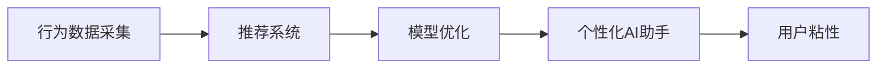

                 

# 个性化AI助手:提高用户粘性的关键

在当今数字化时代，用户粘性是企业获得竞争优势的关键。个性化AI助手因其高效、智能的特性，已成为提高用户粘性的重要手段。本文将系统地探讨个性化AI助手的核心概念、算法原理与具体操作步骤，并通过实际案例和应用场景展示其在提升用户粘性方面的潜力。

## 1. 背景介绍

随着人工智能技术的飞速发展，个性化AI助手正迅速成为各行业的标配。从智能客服到推荐系统，从虚拟助手到健康管理，个性化AI助手以其独特优势，满足了不同用户的需求，并显著提升了用户体验。然而，如何更有效地设计、优化个性化AI助手，使其能够真正贴近用户，提高用户粘性，仍是业界的一大挑战。

## 2. 核心概念与联系

### 2.1 核心概念概述

- **个性化AI助手**：基于用户行为数据，通过机器学习、深度学习等技术，为用户定制化提供服务的AI系统。
- **用户粘性**：用户对AI助手或其提供的服务的依赖程度和持续使用意愿。
- **推荐系统**：通过分析用户的历史行为和偏好，为用户推荐个性化内容的系统。
- **行为数据采集**：通过日志、点击、搜索等手段收集用户行为数据的过程。
- **模型优化**：通过对训练数据进行微调，优化模型参数，提升个性化AI助手的效果。

### 2.2 核心概念联系

个性化AI助手、推荐系统和行为数据采集三者之间存在紧密的联系。行为数据采集为推荐系统提供数据支撑，推荐系统则通过模型优化，为用户定制化推荐内容，进而提升个性化AI助手的用户粘性。

以下是一个Mermaid流程图，展示了三者之间的联系：



## 3. 核心算法原理 & 具体操作步骤

### 3.1 算法原理概述

个性化AI助手的核心算法主要基于推荐系统。推荐系统的目标是使用户能够发现与其兴趣相关的物品，其基本原理是通过分析用户行为数据，预测用户对特定物品的偏好，并根据这些预测进行推荐。

具体的算法流程如下：

1. **数据收集**：从用户的历史行为数据中收集相关信息，如浏览历史、购买记录、搜索关键词等。
2. **特征提取**：对收集到的数据进行特征提取，生成用户的特征向量。
3. **模型训练**：使用机器学习或深度学习模型，如协同过滤、矩阵分解、神经网络等，训练用户-物品交互模型。
4. **推荐生成**：根据训练好的模型，预测用户对未交互物品的偏好，生成推荐结果。
5. **个性化调整**：根据推荐结果，对AI助手提供的服务进行个性化调整，提升用户体验。

### 3.2 算法步骤详解

以下是推荐系统的主要步骤及其具体操作步骤：

1. **数据收集**：
   - **日志记录**：记录用户行为数据，如浏览、点击、购买等。
   - **数据预处理**：清洗、去重、归一化等处理，保证数据质量。
   - **特征工程**：设计特征提取方法，如One-Hot编码、TF-IDF等。

2. **特征提取**：
   - **用户特征**：如年龄、性别、地理位置等。
   - **物品特征**：如产品类别、品牌、价格等。
   - **行为特征**：如浏览次数、停留时间、购买频率等。

3. **模型训练**：
   - **选择模型**：根据任务特点选择合适的推荐算法，如协同过滤、基于内容的推荐、混合推荐等。
   - **训练数据**：将用户行为数据和物品属性作为训练集，训练推荐模型。
   - **参数调优**：根据验证集性能，调整模型参数，如学习率、正则化等。

4. **推荐生成**：
   - **实时推荐**：根据用户当前行为，实时生成个性化推荐。
   - **多臂老虎机**：评估不同推荐策略的效果，选择最优策略。
   - **A/B测试**：对比不同推荐策略的效果，优化推荐结果。

5. **个性化调整**：
   - **推荐展示**：设计推荐展示界面，提升用户体验。
   - **反馈收集**：收集用户反馈，优化推荐算法。
   - **持续学习**：使用用户反馈和实时数据，持续优化推荐模型。

### 3.3 算法优缺点

个性化AI助手的推荐算法具有以下优点：

- **高效性**：实时生成推荐，用户能够快速获取相关内容。
- **精准性**：根据用户行为数据，生成高度个性化的推荐。
- **灵活性**：适用于多种业务场景，如电商、社交、医疗等。

同时，该算法也存在以下缺点：

- **数据依赖**：需要大量的用户行为数据，数据收集难度大。
- **冷启动问题**：新用户或新物品没有足够的数据，推荐效果不佳。
- **隐私问题**：用户行为数据涉及隐私，需要谨慎处理。

### 3.4 算法应用领域

个性化AI助手在多个领域均有应用，如电商、社交、健康等。以电商为例，个性化AI助手通过分析用户的浏览、购买记录，为用户推荐相关商品，提升用户购买转化率。在社交领域，个性化AI助手则通过分析用户互动数据，为用户推荐朋友、话题，增强用户粘性。在健康管理领域，个性化AI助手根据用户健康数据，推荐健康建议、个性化运动计划，提升用户健康管理效果。

## 4. 数学模型和公式 & 详细讲解  
### 4.1 数学模型构建

推荐系统的数学模型通常基于协同过滤和矩阵分解等方法。以协同过滤为例，假设用户集合为 $U$，物品集合为 $I$，用户对物品的评分矩阵为 $R$。协同过滤的目标是预测用户对未交互物品的评分 $R_{ui}$。

协同过滤模型可以表示为：

$$
R_{ui} = \sum_{j \in I}\frac{R_{uj}^2}{\sum_{k \in I}R_{uk}^2}R_{kj}
$$

其中，$R_{uj}$ 和 $R_{kj}$ 为已知的评分，$\frac{R_{uj}^2}{\sum_{k \in I}R_{uk}^2}$ 为归一化因子。

### 4.2 公式推导过程

推荐系统的核心公式推导如下：

1. **协同过滤模型推导**：
   - 假设用户 $u$ 对物品 $i$ 的评分 $R_{ui}$ 已知。
   - 已知物品 $j$ 的评分矩阵 $R_{ij}$，计算用户 $u$ 对物品 $j$ 的评分 $R_{uj}$。
   - 根据 $R_{uj}$ 和用户 $u$ 的评分 $R_{uk}$，计算归一化因子 $\frac{R_{uj}^2}{\sum_{k \in I}R_{uk}^2}$。
   - 使用归一化因子和物品 $j$ 的评分，计算用户 $u$ 对物品 $j$ 的预测评分 $R_{uj}$。

2. **矩阵分解模型推导**：
   - 假设用户 $u$ 和物品 $i$ 的评分矩阵 $R$ 可以分解为用户特征矩阵 $P$ 和物品特征矩阵 $Q$ 的乘积，即 $R = PQ$。
   - 使用用户特征矩阵 $P$ 和物品特征矩阵 $Q$，计算用户 $u$ 对物品 $i$ 的预测评分。

### 4.3 案例分析与讲解

以电商推荐系统为例，假设用户 $u$ 已对物品 $i$ 的评分 $R_{ui}=3$。假设物品 $j$ 的评分矩阵 $R_{ij}$ 已知，其中 $R_{uj}=4$。已知用户 $u$ 的评分 $R_{uk}=2$，物品 $j$ 的评分 $R_{kj}=5$。

根据协同过滤公式，计算用户 $u$ 对物品 $j$ 的评分 $R_{uj}$：

$$
R_{uj} = \sum_{k \in I}\frac{R_{uj}^2}{\sum_{k \in I}R_{uk}^2}R_{kj} = \frac{4^2}{2^2+4^2} \times 5 = 2
$$

再根据矩阵分解公式，计算用户 $u$ 对物品 $j$ 的预测评分：

$$
R_{uj} = P_u \times Q_j = \text{(用户特征矩阵)} \times \text{(物品特征矩阵)}
$$

## 5. 项目实践：代码实例和详细解释说明

### 5.1 开发环境搭建

进行推荐系统开发时，需要搭建以下开发环境：

1. **安装Python**：
   - 通过Python官网下载最新版本的Python安装包。
   - 安装PyTorch和TensorFlow等深度学习库。

2. **搭建服务环境**：
   - 使用Docker或Kubernetes等容器化技术搭建服务环境。
   - 配置服务器的CPU、内存和网络带宽。

3. **日志收集**：
   - 使用Flume或Kafka等工具收集日志数据。
   - 设计数据管道，将日志数据导入数据库。

4. **数据存储**：
   - 使用Hadoop或Hive等大数据平台存储用户行为数据。
   - 设计数据表结构，存储用户和物品的相关信息。

### 5.2 源代码详细实现

以下是推荐系统的Python代码实现：

```python
import pandas as pd
import numpy as np
from scipy.sparse import csr_matrix

# 读取数据
data = pd.read_csv('user_item_ratings.csv')

# 构建用户-物品评分矩阵
R = csr_matrix(data[['user_id', 'item_id', 'rating']].to_dict(), shape=(10000, 10000))

# 协同过滤推荐
def collaborative_filtering(R):
    user_idx = np.random.randint(0, 10000)
    item_idx = np.random.randint(0, 10000)
    user_ratings = R[user_idx].toarray().ravel()
    user_ratings = user_ratings[user_ratings != 0]
    user_ratings = user_ratings / np.linalg.norm(user_ratings)
    user_ratings = np.tile(user_ratings, (len(item_idx), 1)).T
    item_ratings = R[:, item_idx].toarray().ravel()
    item_ratings = item_ratings / np.linalg.norm(item_ratings)
    item_ratings = item_ratings.T
    weights = user_ratings.dot(item_ratings)
    weights = weights / np.linalg.norm(weights)
    recommendations = weights.dot(user_ratings)
    recommendations = np.argsort(recommendations)[-10]
    return recommendations

# 测试推荐结果
recommendations = collaborative_filtering(R)
print(recommendations)
```

### 5.3 代码解读与分析

以上代码实现了协同过滤推荐算法。具体步骤如下：

1. **数据读取**：读取用户行为数据，构建用户-物品评分矩阵 $R$。
2. **协同过滤算法**：随机选取用户 $u$ 和物品 $i$，计算用户 $u$ 对物品 $i$ 的评分。
3. **推荐生成**：根据用户和物品的评分，计算推荐结果。

## 6. 实际应用场景

### 6.1 电商推荐

电商推荐系统通过分析用户的浏览、购买记录，为用户推荐相关商品，提升用户购买转化率。电商推荐系统的应用场景包括：

1. **商品推荐**：根据用户的浏览和购买历史，推荐相关商品。
2. **新商品推荐**：根据热门商品推荐相关新品，引导用户尝试新产品。
3. **交叉销售**：根据用户的购买记录，推荐相关关联商品，提升客单价。

### 6.2 社交网络推荐

社交网络推荐系统通过分析用户的互动数据，为用户推荐朋友、话题，增强用户粘性。社交网络推荐系统的应用场景包括：

1. **好友推荐**：根据用户的互动历史，推荐可能感兴趣的朋友。
2. **话题推荐**：根据用户感兴趣的话题，推荐相关话题。
3. **内容推荐**：根据用户的互动历史，推荐相关内容。

### 6.3 健康管理推荐

健康管理推荐系统通过分析用户的健康数据，推荐健康建议、个性化运动计划，提升用户健康管理效果。健康管理推荐系统的应用场景包括：

1. **健康建议**：根据用户的健康数据，推荐健康建议。
2. **运动计划**：根据用户的健康数据，推荐个性化运动计划。
3. **饮食建议**：根据用户的健康数据，推荐健康饮食方案。

## 7. 工具和资源推荐

### 7.1 学习资源推荐

为了帮助开发者系统掌握推荐系统的理论基础和实践技巧，这里推荐一些优质的学习资源：

1. **《推荐系统实战》书籍**：介绍了推荐系统的理论基础和实用技术，包含协同过滤、矩阵分解等算法。
2. **Coursera《推荐系统》课程**：斯坦福大学开设的推荐系统课程，涵盖推荐系统的基本概念和经典算法。
3. **Kaggle竞赛**：通过参与Kaggle竞赛，实践推荐系统的实际应用。
4. **O'Reilly《推荐系统》书籍**：全面介绍了推荐系统的理论和实践，包含案例分析和实战技巧。

### 7.2 开发工具推荐

推荐的开发工具包括：

1. **PyTorch**：基于Python的深度学习框架，支持矩阵分解等推荐算法。
2. **TensorFlow**：由Google开发的深度学习框架，支持分布式计算和大规模数据处理。
3. **Flume**：日志收集工具，适用于大规模日志数据的收集和管理。
4. **Kafka**：消息队列系统，支持高效的数据传输和处理。
5. **Hadoop**：大数据处理平台，支持海量数据的存储和分析。

### 7.3 相关论文推荐

推荐系统相关的重要论文包括：

1. **《协同过滤推荐算法》论文**：介绍了协同过滤算法的原理和实现方法。
2. **《基于矩阵分解的推荐算法》论文**：介绍了矩阵分解算法的原理和实现方法。
3. **《深度学习推荐系统》论文**：介绍了深度学习在推荐系统中的应用，包括深度神经网络等方法。
4. **《推荐系统中的特征工程》论文**：介绍了推荐系统中特征工程的重要性和具体方法。

## 8. 总结：未来发展趋势与挑战

### 8.1 总结

本文对个性化AI助手及其推荐系统进行了系统性的介绍。推荐系统的核心在于通过对用户行为数据的分析，预测用户对未交互物品的偏好，并据此生成个性化推荐。推荐系统通过协同过滤、矩阵分解等算法，实现高效、精准的个性化推荐，广泛应用于电商、社交、健康等多个领域。

通过本文的系统梳理，可以看到，个性化AI助手和推荐系统在提升用户粘性方面具有显著优势。未来，伴随技术不断演进，推荐系统将更加智能、灵活，为用户带来更好的体验。

### 8.2 未来发展趋势

推荐系统未来的发展趋势主要体现在以下几个方面：

1. **深度学习的应用**：深度学习算法在推荐系统中的应用将更加广泛，通过模型参数的进一步优化，提升推荐效果。
2. **个性化推荐**：个性化推荐将更加精准，通过多模态数据的融合，提升推荐的个性化程度。
3. **实时推荐**：实时推荐将成为推荐系统的主要趋势，通过算法优化和硬件加速，提升推荐的实时性。
4. **跨域推荐**：跨域推荐将成为推荐系统的新方向，通过不同领域数据的融合，提升推荐的覆盖范围。

### 8.3 面临的挑战

推荐系统在发展过程中面临诸多挑战：

1. **数据质量问题**：推荐系统需要高质量的数据作为支撑，数据收集和预处理难度较大。
2. **冷启动问题**：新用户或新物品没有足够的数据，推荐效果不佳。
3. **隐私问题**：用户行为数据涉及隐私，需要谨慎处理。
4. **计算资源问题**：推荐系统需要大量的计算资源，硬件成本较高。

### 8.4 研究展望

未来，推荐系统的研究可以从以下几个方面进行：

1. **数据融合技术**：通过多模态数据的融合，提升推荐的全面性和准确性。
2. **隐私保护技术**：通过数据匿名化、差分隐私等技术，保护用户隐私。
3. **实时推荐技术**：通过算法优化和硬件加速，提升推荐的实时性。
4. **跨域推荐技术**：通过不同领域数据的融合，提升推荐的覆盖范围。

## 9. 附录：常见问题与解答

**Q1：推荐系统如何应对冷启动问题？**

A: 推荐系统可以通过以下方法应对冷启动问题：

1. **利用用户特征**：根据用户的基本特征，如年龄、性别、地理位置等，进行推荐。
2. **利用物品特征**：根据物品的基本特征，如品牌、类别、价格等，进行推荐。
3. **利用用户行为预测**：使用机器学习模型，预测用户对未交互物品的评分，进行推荐。

**Q2：推荐系统如何保护用户隐私？**

A: 推荐系统可以通过以下方法保护用户隐私：

1. **数据匿名化**：对用户行为数据进行匿名化处理，保护用户隐私。
2. **差分隐私**：在数据处理过程中，加入噪声，保护用户隐私。
3. **用户控制**：用户可以控制是否分享自己的行为数据，保护用户隐私。

**Q3：推荐系统如何应对数据质量问题？**

A: 推荐系统可以通过以下方法应对数据质量问题：

1. **数据清洗**：对数据进行清洗、去重、归一化等处理，保证数据质量。
2. **数据标注**：对数据进行标注，提高数据的准确性和完整性。
3. **数据融合**：通过多源数据的融合，提高数据的覆盖范围和准确性。

**Q4：推荐系统如何提高实时推荐的效果？**

A: 推荐系统可以通过以下方法提高实时推荐的效果：

1. **算法优化**：优化推荐算法，提高推荐速度和准确性。
2. **硬件加速**：使用GPU、TPU等硬件进行加速，提高推荐速度。
3. **缓存技术**：使用缓存技术，提高推荐速度和系统稳定性。

**Q5：推荐系统如何提升推荐的多样性？**

A: 推荐系统可以通过以下方法提升推荐的多样性：

1. **多样性推荐算法**：使用多样性推荐算法，如K-means、DBSCAN等，提升推荐的多样性。
2. **推荐组合**：将不同的推荐算法组合使用，提高推荐的多样性。
3. **用户反馈**：根据用户反馈，调整推荐策略，提升推荐的多样性。

---

作者：禅与计算机程序设计艺术 / Zen and the Art of Computer Programming

