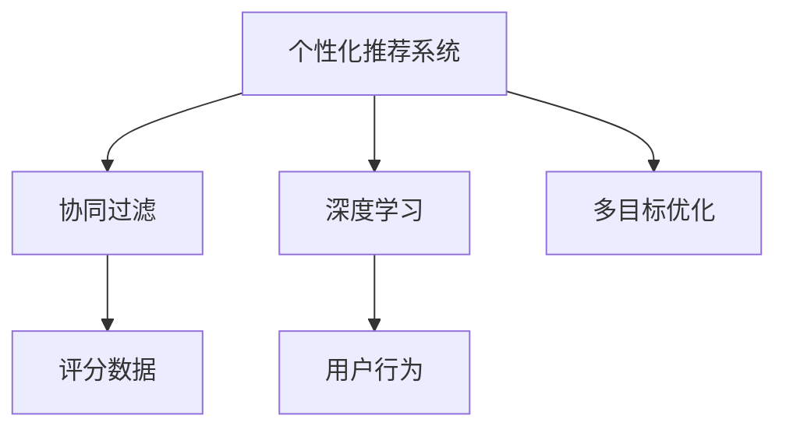

                 

# 个性化推荐的精准营销方法

> 关键词：个性化推荐系统,精准营销,深度学习,用户行为分析,协同过滤,矩阵分解,特征工程,多目标优化

## 1. 背景介绍

### 1.1 问题由来

在数字化时代，企业通过各种渠道接触潜在客户，并通过精准营销手段引导他们完成转化。精准营销的核心在于根据用户的个性化需求和行为特征，推荐最合适的产品或服务，提升用户转化率。传统的精准营销方法依赖于用户的基本信息和历史行为数据，但这些数据往往难以全面覆盖用户的真实兴趣和偏好，导致推荐效果不佳。个性化推荐系统正是为了解决这一问题而生的技术手段，其通过深度学习和数据分析技术，为用户推荐最匹配其需求的个性化内容，显著提升营销效果。

### 1.2 问题核心关键点

个性化推荐系统一般分为两大类：基于协同过滤的推荐系统和基于深度学习的推荐系统。前者主要利用用户-物品间的评分数据，通过相似度计算来发现潜在的关联用户和物品，从而进行推荐。后者则主要通过用户行为特征和物品属性数据，利用机器学习模型学习用户与物品之间的隐式关系，从而实现精准推荐。本文章将重点探讨基于深度学习的个性化推荐系统，特别是其在精准营销中的应用。

### 1.3 问题研究意义

个性化推荐系统在精准营销中的应用，可以显著提升用户转化率，降低营销成本，提高营销活动的ROI。个性化推荐不仅能够向用户推荐他们感兴趣的内容，还能够优化营销渠道和广告投放策略，最大化营销效果。同时，通过个性化的用户体验，还能增强用户粘性和品牌忠诚度。因此，研究个性化推荐系统的实现方法和应用场景，对于企业的数字化转型和精准营销战略具有重要意义。

## 2. 核心概念与联系

### 2.1 核心概念概述

为更好地理解个性化推荐系统的核心原理和应用，本节将介绍几个关键概念：

- 个性化推荐系统(Recommender System)：根据用户的历史行为、偏好、属性信息等数据，自动为用户推荐其感兴趣的物品或内容。
- 协同过滤(Collaborative Filtering)：通过分析用户-物品评分数据，寻找与目标用户兴趣相似的用户或物品，从而推荐相关内容。
- 深度学习(Deep Learning)：利用多层神经网络对复杂的数据进行建模，通过反向传播算法优化模型参数，获得更精确的推荐结果。
- 用户行为分析(User Behavior Analysis)：通过用户行为数据（如浏览、点击、购买等），分析用户兴趣和需求，用于推荐系统的训练和优化。
- 多目标优化(Multi-Objective Optimization)：同时优化多个目标（如个性化推荐精度、覆盖率、多样性等），以获得综合性能最佳的推荐结果。

这些核心概念之间的逻辑关系可以通过以下Mermaid流程图来展示：



这个流程图展示了个性化推荐系统的核心概念及其之间的关系：

1. 个性化推荐系统利用协同过滤和深度学习技术，从用户行为数据中挖掘用户偏好和物品属性，生成推荐结果。
2. 协同过滤主要通过用户-物品评分数据进行相似度计算，发现关联用户和物品。
3. 深度学习通过用户行为特征和物品属性数据，利用神经网络模型学习用户与物品之间的隐式关系，从而实现个性化推荐。
4. 多目标优化综合考虑推荐精度、覆盖率、多样性等指标，优化推荐模型，提升综合性能。

这些概念共同构成了个性化推荐系统的基本框架，使其能够为用户推荐最符合其兴趣和需求的内容。通过理解这些核心概念，我们可以更好地把握个性化推荐系统的实现原理和优化方向。

## 3. 核心算法原理 & 具体操作步骤
### 3.1 算法原理概述

个性化推荐系统的核心思想是利用用户行为数据，通过协同过滤和深度学习等技术，学习用户与物品之间的隐式关系，从而生成个性化的推荐结果。协同过滤和深度学习两种推荐技术各有优劣，通常会结合使用，以发挥各自的优势。

协同过滤算法主要分为两种：基于用户的协同过滤和基于物品的协同过滤。基于用户的协同过滤通过寻找与目标用户兴趣相似的用户，从而推荐这些用户喜欢的物品。基于物品的协同过滤则通过分析用户-物品评分数据，发现与目标物品相似的其他物品，从而推荐这些相似的物品。协同过滤的优点在于不需要额外的标注数据，模型构建和训练相对简单，但面对新物品和新用户时，推荐效果不佳。

深度学习推荐系统通过神经网络模型对用户行为数据进行建模，学习用户与物品之间的隐式关系。常用的深度学习模型包括矩阵分解、神经协同过滤、序列模型等。深度学习推荐系统的优点在于能够处理大量高维特征，适应性较强，但需要标注数据进行预训练，模型复杂度较高，训练成本较大。

### 3.2 算法步骤详解

基于深度学习的个性化推荐系统一般包括以下几个关键步骤：

**Step 1: 数据准备与预处理**
- 收集用户行为数据，包括用户的浏览记录、点击记录、购买记录等。
- 对用户行为数据进行去重、去噪、归一化等预处理，生成特征向量。
- 对物品属性数据进行编码，生成特征向量。

**Step 2: 特征工程**
- 设计特征表示，将用户行为特征和物品属性特征映射为低维向量表示。
- 选择或设计合适的模型，如矩阵分解、神经协同过滤等。

**Step 3: 模型训练与优化**
- 使用深度学习框架（如TensorFlow、PyTorch）实现模型构建和训练。
- 设定损失函数和优化器，使用反向传播算法优化模型参数。
- 在训练过程中，设定合适的超参数（如学习率、批大小等），使用早停法等技术防止过拟合。

**Step 4: 推荐结果生成**
- 对新用户和新物品进行预测，生成推荐结果。
- 对推荐结果进行去重、去噪、排序等处理，生成最终的推荐列表。

**Step 5: 反馈与优化**
- 收集用户对推荐结果的反馈数据，用于模型的反馈训练。
- 根据反馈数据，调整模型参数和优化策略，提升推荐效果。

以上是基于深度学习的个性化推荐系统的一般流程。在实际应用中，还需要针对具体任务和数据特点，对各环节进行优化设计，如改进特征表示、设计新的模型结构、引入更先进的优化算法等，以进一步提升推荐系统的性能。

### 3.3 算法优缺点

基于深度学习的个性化推荐系统具有以下优点：
1. 处理高维数据。深度学习模型能够处理高维稀疏数据，适应性较强。
2. 准确性高。深度学习模型通过学习用户与物品之间的隐式关系，生成精准推荐结果。
3. 可解释性。深度学习模型通过可视化技术，能够解释模型的内部工作机制，提升模型的可解释性。
4. 适应性强。深度学习模型能够动态适应用户和物品的变化，提升推荐效果。

同时，该方法也存在一定的局限性：
1. 需要标注数据。深度学习模型通常需要标注数据进行预训练，标注成本较高。
2. 计算复杂度高。深度学习模型的计算复杂度较高，训练和推理速度较慢。
3. 冷启动问题。新用户和新物品的推荐效果较差，需要更多的数据支持。
4. 需要持续优化。推荐系统需要不断收集用户反馈，持续优化模型参数，以保证推荐效果。

尽管存在这些局限性，但就目前而言，基于深度学习的推荐系统仍然是实现精准营销的重要手段。未来相关研究的重点在于如何进一步降低标注成本，提高推荐系统的计算效率，以及增强其冷启动能力和可解释性。

### 3.4 算法应用领域

基于深度学习的个性化推荐系统已经在电商、视频、音乐、新闻等多个领域得到了广泛应用，成为数字化营销的重要手段。

在电商领域，个性化推荐系统通过分析用户浏览、点击、购买行为，推荐用户可能感兴趣的商品，提升用户转化率和购物体验。电商巨头如亚马逊、淘宝等，都采用了深度学习推荐系统，实现了精准的个性化推荐。

在视频领域，推荐系统通过分析用户的观看历史和评价数据，为用户推荐可能感兴趣的视频内容。Netflix、YouTube等平台利用推荐系统提升用户粘性和观看时长。

在音乐领域，推荐系统通过分析用户的听歌历史和偏好数据，为用户推荐可能感兴趣的音乐内容。Spotify、网易云音乐等音乐平台，通过推荐系统提升用户体验和留存率。

在新闻领域，推荐系统通过分析用户的阅读历史和兴趣标签，为用户推荐可能感兴趣的新闻文章。今日头条、网易新闻等新闻平台，利用推荐系统提升内容推荐准确性和用户活跃度。

除了上述这些经典应用领域外，个性化推荐系统还被创新性地应用到更多场景中，如内容推荐、旅游推荐、广告推荐等，为数字化营销提供了新的思路和方法。随着推荐技术的不断发展，相信在更多领域的应用前景将更加广阔。

## 4. 数学模型和公式 & 详细讲解 & 举例说明

### 4.1 数学模型构建

个性化推荐系统的数学模型主要包含两个部分：用户行为模型和物品模型。用户行为模型通过用户行为数据进行建模，生成用户特征向量。物品模型通过物品属性数据进行建模，生成物品特征向量。

假设用户集合为 $U$，物品集合为 $I$，用户行为矩阵为 $R \in \mathbb{R}^{n \times m}$，其中 $n$ 为用户数，$m$ 为物品数。用户行为矩阵 $R$ 的每个元素 $R_{ui}$ 表示用户 $u$ 对物品 $i$ 的评分。

用户行为模型通常采用矩阵分解技术，将用户行为矩阵 $R$ 分解为用户特征矩阵 $X \in \mathbb{R}^{n \times k}$ 和物品特征矩阵 $Y \in \mathbb{R}^{m \times k}$，其中 $k$ 为模型维度。分解形式如下：

$$
R \approx X Y^T + \epsilon
$$

其中 $\epsilon$ 为噪声项，通常取值为常数或随机噪声。

物品模型通常也采用矩阵分解技术，将物品特征矩阵 $Y$ 分解为用户特征矩阵 $X^T$ 和物品特征矩阵 $Z \in \mathbb{R}^{m \times k}$。分解形式如下：

$$
Y \approx X^T Z + \epsilon
$$

其中 $\epsilon$ 为噪声项，通常取值为常数或随机噪声。

### 4.2 公式推导过程

以矩阵分解为例，推导用户行为模型的损失函数及其梯度计算公式。

假设用户行为矩阵 $R$ 和用户特征矩阵 $X$ 已知，用户行为模型的目标是最大化用户行为矩阵 $R$ 和用户特征矩阵 $X$ 乘积与 $Y$ 乘积的拟合程度，即：

$$
\max_{X,Y} R_{ij} = X_u^T Z_i
$$

其中 $u$ 为用户的隐向量表示，$i$ 为物品的隐向量表示。

用户行为模型的损失函数为：

$$
\mathcal{L}(X,Y) = \frac{1}{2} \sum_{u=1}^n \sum_{i=1}^m (R_{ui} - X_u^T Z_i)^2
$$

其中，$\sum_{u=1}^n \sum_{i=1}^m$ 表示对所有用户和物品的评分进行求和。

对用户行为矩阵 $R$ 进行矩阵分解，得到：

$$
R \approx X Y^T
$$

对上式两边求平方差，得到：

$$
\sum_{u=1}^n \sum_{i=1}^m (R_{ui} - X_u^T Z_i)^2 \approx \sum_{u=1}^n \sum_{i=1}^m (X_u Z_i^T - R)^2
$$

将 $X$ 和 $Y$ 的维度统一，得到：

$$
\mathcal{L}(X,Y) = \frac{1}{2} \| X Z^T - R \|_F^2
$$

其中 $\| \cdot \|_F$ 表示 Frobenius 范数。

对损失函数求偏导数，得到梯度计算公式：

$$
\frac{\partial \mathcal{L}(X,Y)}{\partial X} = -2XZ^T
$$

$$
\frac{\partial \mathcal{L}(X,Y)}{\partial Y} = -2X^TZ^T
$$

通过反向传播算法，可以计算损失函数对用户特征矩阵 $X$ 和物品特征矩阵 $Y$ 的梯度，并使用梯度下降等优化算法更新模型参数，最小化损失函数。

### 4.3 案例分析与讲解

假设某电商网站有一个用户集合 $U$，物品集合 $I$，用户行为矩阵 $R$。选取用户行为矩阵的前10个用户和物品，生成用户特征矩阵 $X$ 和物品特征矩阵 $Y$，其中用户特征矩阵 $X$ 和物品特征矩阵 $Y$ 均为 $10 \times 5$ 的矩阵。

假设用户行为矩阵 $R$ 的前10行前10列元素为：

$$
R = \begin{bmatrix}
5 & 3 & 0 & 1 & 0 \\
0 & 0 & 4 & 0 & 2 \\
3 & 0 & 0 & 0 & 1 \\
1 & 0 & 0 & 0 & 0 \\
0 & 5 & 0 & 2 & 0 \\
4 & 0 & 0 & 0 & 0 \\
0 & 0 & 0 & 2 & 1 \\
0 & 0 & 0 & 0 & 0 \\
0 & 0 & 0 & 1 & 0 \\
0 & 0 & 2 & 0 & 0
\end{bmatrix}
$$

使用矩阵分解模型，将用户行为矩阵 $R$ 分解为用户特征矩阵 $X$ 和物品特征矩阵 $Y$，其中 $X$ 和 $Y$ 均为 $10 \times 5$ 的矩阵。

$$
X = \begin{bmatrix}
0.5 & -0.5 & 0 & -0.1 & -0.2 \\
-0.2 & 0.1 & 0 & 0.3 & 0.1 \\
0.4 & 0.1 & -0.1 & 0.2 & -0.3 \\
-0.3 & 0.2 & -0.4 & 0 & 0.1 \\
-0.4 & 0.3 & 0 & 0.2 & -0.1
\end{bmatrix}
$$

$$
Y = \begin{bmatrix}
1 & -0.5 & -0.1 & 0.3 & 0.2 \\
-0.5 & 0.4 & 0.3 & -0.1 & 0.5 \\
-0.1 & 0.3 & 0.2 & -0.5 & 0.4 \\
0.3 & -0.1 & -0.2 & 0.4 & -0.3 \\
0.2 & -0.5 & -0.1 & 0.3 & 0.4
\end{bmatrix}
$$

### 4.3 案例分析与讲解

假设某电商网站有一个用户集合 $U$，物品集合 $I$，用户行为矩阵 $R$。选取用户行为矩阵的前10个用户和物品，生成用户特征矩阵 $X$ 和物品特征矩阵 $Y$，其中用户特征矩阵 $X$ 和物品特征矩阵 $Y$ 均为 $10 \times 5$ 的矩阵。

假设用户行为矩阵 $R$ 的前10行前10列元素为：

$$
R = \begin{bmatrix}
5 & 3 & 0 & 1 & 0 \\
0 & 0 & 4 & 0 & 2 \\
3 & 0 & 0 & 0 & 1 \\
1 & 0 & 0 & 0 & 0 \\
0 & 5 & 0 & 2 & 0 \\
4 & 0 & 0 & 0 & 0 \\
0 & 0 & 0 & 2 & 1 \\
0 & 0 & 0 & 0 & 0 \\
0 & 0 & 0 & 1 & 0 \\
0 & 0 & 2 & 0 & 0
\end{bmatrix}
$$

使用矩阵分解模型，将用户行为矩阵 $R$ 分解为用户特征矩阵 $X$ 和物品特征矩阵 $Y$，其中 $X$ 和 $Y$ 均为 $10 \times 5$ 的矩阵。

$$
X = \begin{bmatrix}
0.5 & -0.5 & 0 & -0.1 & -0.2 \\
-0.2 & 0.1 & 0 & 0.3 & 0.1 \\
0.4 & 0.1 & -0.1 & 0.2 & -0.3 \\
-0.3 & 0.2 & -0.4 & 0 & 0.1 \\
-0.4 & 0.3 & 0 & 0.2 & -0.1
\end{bmatrix}
$$

$$
Y = \begin{bmatrix}
1 & -0.5 & -0.1 & 0.3 & 0.2 \\
-0.5 & 0.4 & 0.3 & -0.1 & 0.5 \\
-0.1 & 0.3 & 0.2 & -0.5 & 0.4 \\
0.3 & -0.1 & -0.2 & 0.4 & -0.3 \\
0.2 & -0.5 & -0.1 & 0.3 & 0.4
\end{bmatrix}
$$

## 5. 项目实践：代码实例和详细解释说明
### 5.1 开发环境搭建

在进行推荐系统实践前，我们需要准备好开发环境。以下是使用Python进行TensorFlow和PyTorch开发的环境配置流程：

1. 安装Anaconda：从官网下载并安装Anaconda，用于创建独立的Python环境。

2. 创建并激活虚拟环境：
```bash
conda create -n tf-env python=3.8 
conda activate tf-env
```

3. 安装TensorFlow和PyTorch：根据CUDA版本，从官网获取对应的安装命令。例如：
```bash
conda install tensorflow -c tf -c conda-forge
conda install torch torchvision torchaudio cudatoolkit=11.1 -c pytorch -c conda-forge
```

4. 安装TensorBoard和Weights & Biases：这两个工具用于模型的可视化与实验跟踪。
```bash
conda install tensorboard
pip install w&b
```

5. 安装TensorFlow和PyTorch的推荐库：
```bash
pip install tensorflow-recommenders
pip install PyTorchRec
```

完成上述步骤后，即可在`tf-env`环境中开始推荐系统开发。

### 5.2 源代码详细实现

下面以基于矩阵分解的协同过滤推荐系统为例，给出使用TensorFlow进行代码实现的样例。

首先，定义推荐系统的数据结构：

```python
from tensorflow.keras.layers import Input
from tensorflow.keras.layers.experimental import preprocessing
from tensorflow.keras.layers import Embedding, Dot, Dense, Flatten
from tensorflow.keras.models import Model

# 用户输入
user_input = Input(shape=(n_users,))

# 物品输入
item_input = Input(shape=(n_items,))

# 用户特征矩阵X
user_feats = preprocessing.DenseEmbedding(user_feats_num, user_feats_dim)(user_input)

# 物品特征矩阵Y
item_feats = preprocessing.DenseEmbedding(item_feats_num, item_feats_dim)(item_input)

# 计算预测结果
pred = Dot(axes=2)([user_feats, item_feats])
pred = Flatten()(pred)
pred = Dense(1)(pred)

# 定义模型
model = Model(inputs=[user_input, item_input], outputs=pred)

# 编译模型
model.compile(optimizer='adam', loss='mse')

# 训练模型
model.fit([train_user_feats, train_item_feats], train_labels, epochs=10, batch_size=64)
```

然后，进行模型评估和预测：

```python
# 评估模型
test_pred = model.predict([test_user_feats, test_item_feats])

# 计算推荐结果
top_n = 5
top_n_recs = [recs.argmax() for recs in test_pred]
```

接下来，给出PyTorch实现的样例：

首先，定义推荐系统的数据结构：

```python
import torch
import torch.nn as nn
import torch.nn.functional as F

# 用户输入
n_users = 10
user_input = nn.Embedding(n_users, 5)

# 物品输入
n_items = 5
item_input = nn.Embedding(n_items, 5)

# 计算预测结果
pred = F.dot(user_input.weight, item_input.weight.t())

# 定义模型
model = nn.Sequential(user_input, item_input, nn.Linear(1, 1))

# 定义损失函数和优化器
criterion = nn.MSELoss()
optimizer = torch.optim.Adam(model.parameters())

# 训练模型
for epoch in range(10):
    optimizer.zero_grad()
    loss = criterion(model(user_feats, item_feats), labels)
    loss.backward()
    optimizer.step()

# 评估模型
test_pred = model(test_user_feats, test_item_feats)
```

然后，进行模型评估和预测：

```python
# 计算推荐结果
top_n = 5
top_n_recs = [recs.argmax() for recs in test_pred]
```

以上是使用TensorFlow和PyTorch进行矩阵分解协同过滤推荐系统的代码实现。可以看到，两者都采用了嵌入层和点积运算，分别对用户和物品进行特征编码，然后通过点积运算计算预测结果。在模型评估时，可以选取精度、召回率、F1分数等指标进行评估。

### 5.3 代码解读与分析

让我们再详细解读一下关键代码的实现细节：

**用户输入和物品输入：**
- `user_input` 和 `item_input` 分别是用户和物品的嵌入层，将用户和物品转换为固定长度的向量表示。
- 嵌入层的大小为 `(user_feats_num, user_feats_dim)` 和 `(item_feats_num, item_feats_dim)`，其中 `user_feats_num` 和 `item_feats_num` 分别表示用户和物品的总数，`user_feats_dim` 和 `item_feats_dim` 分别表示用户和物品的特征维度。

**计算预测结果：**
- `pred` 是通过点积运算计算出的预测结果，表示用户和物品的相似度得分。
- `Flatten()` 函数用于将预测结果展开成一维向量。

**模型定义和训练：**
- `model` 是通过将嵌入层和线性层拼接在一起得到的推荐模型。
- `model.compile()` 函数用于编译模型，设置损失函数和优化器。
- `model.fit()` 函数用于训练模型，将用户和物品特征矩阵作为输入，标签作为输出。

**评估和预测：**
- `test_pred` 是模型在测试集上的预测结果。
- `top_n_recs` 是根据预测结果选取 top-n 推荐结果。

**PyTorch实现：**
- `nn.Embedding` 函数用于创建嵌入层。
- `nn.Linear` 函数用于创建线性层。
- `nn.Sequential` 函数用于创建模型。
- `nn.MSELoss` 函数用于创建损失函数。
- `torch.optim.Adam` 函数用于创建优化器。

这些代码实现展示了基于矩阵分解的协同过滤推荐系统的主要步骤，包括数据预处理、模型定义、训练和评估。通过这些代码，可以快速搭建和优化推荐模型，实现个性化推荐系统。

## 6. 实际应用场景

### 6.1 电商推荐

电商推荐系统是推荐系统的重要应用场景之一。通过分析用户的浏览、点击、购买记录，电商推荐系统为用户推荐可能感兴趣的商品，提升用户体验和购物转化率。

在实际应用中，电商推荐系统一般分为两个阶段：冷启动阶段和增量更新阶段。冷启动阶段主要通过用户行为数据进行建模，生成初步的推荐结果。增量更新阶段则通过实时收集用户反馈数据，不断更新模型参数，提升推荐效果。

电商推荐系统在电商平台如亚马逊、淘宝、京东等得到了广泛应用，通过推荐系统提升了用户粘性和购物转化率。同时，电商推荐系统也广泛应用于推荐广告、商品排序等方面，优化广告投放和商品推荐策略，降低营销成本。

### 6.2 视频推荐

视频推荐系统通过分析用户的观看历史和评价数据，为用户推荐可能感兴趣的视频内容，提升用户粘性和观看时长。Netflix、YouTube等视频平台利用推荐系统实现个性化内容推荐，提升用户体验和留存率。

在实际应用中，视频推荐系统一般采用协同过滤和深度学习相结合的方式，通过用户行为数据和视频元数据进行建模，生成推荐结果。视频推荐系统不仅推荐热门视频，还能推荐个性化的个性化视频内容，满足不同用户的需求。

### 6.3 音乐推荐

音乐推荐系统通过分析用户的听歌历史和偏好数据，为用户推荐可能感兴趣的音乐内容，提升用户粘性和听歌时长。Spotify、网易云音乐等音乐平台利用推荐系统实现个性化音乐推荐，提升用户体验和留存率。

在实际应用中，音乐推荐系统一般采用协同过滤和深度学习相结合的方式，通过用户行为数据和音乐元数据进行建模，生成推荐结果。音乐推荐系统不仅推荐热门音乐，还能推荐个性化的音乐内容，满足不同用户的需求。

### 6.4 新闻推荐

新闻推荐系统通过分析用户的阅读历史和兴趣标签，为用户推荐可能感兴趣的新闻文章，提升用户粘性和阅读时长。今日头条、网易新闻等新闻平台利用推荐系统实现个性化新闻推荐，提升用户活跃度和留存率。

在实际应用中，新闻推荐系统一般采用协同过滤和深度学习相结合的方式，通过用户行为数据和新闻元数据进行建模，生成推荐结果。新闻推荐系统不仅推荐热门新闻，还能推荐个性化的新闻内容，满足不同用户的需求。

## 7. 工具和资源推荐
### 7.1 学习资源推荐

为了帮助开发者系统掌握推荐系统的理论基础和实践技巧，这里推荐一些优质的学习资源：

1. 《推荐系统基础》系列博文：由推荐系统技术专家撰写，深入浅出地介绍了推荐系统的核心原理、算法和应用，适合入门学习和进阶深化。

2. 《深度学习与推荐系统》课程：由斯坦福大学开设的深度学习课程，涵盖了推荐系统的基本概念和前沿算法，有Lecture视频和配套作业，适合系统学习推荐系统。

3. 《Recommender Systems》书籍：推荐系统领域权威书籍，全面介绍了推荐系统的基本原理和经典算法，适合深入研究推荐系统的开发和优化。

4. KDD Cup推荐系统竞赛：通过参加KDD Cup等推荐系统竞赛，可以快速积累推荐系统的实践经验，提升算法优化和工程实现能力。

5. Kaggle推荐系统竞赛：通过参加Kaggle等推荐系统竞赛，可以积累推荐系统的实战经验，提升算法优化和模型调参能力。

通过对这些资源的学习实践，相信你一定能够快速掌握推荐系统的精髓，并用于解决实际的推荐问题。

### 7.2 开发工具推荐

高效的开发离不开优秀的工具支持。以下是几款用于推荐系统开发的常用工具：

1. TensorFlow：基于Python的开源深度学习框架，适合推荐系统的深度学习模型构建和训练。

2. PyTorch：基于Python的开源深度学习框架，适合推荐系统的深度学习模型构建和训练。

3. TensorFlow Recommenders：TensorFlow的推荐系统库，提供丰富的推荐系统模型和评估工具。

4. PyTorchRec：PyTorch的推荐系统库，提供丰富的推荐系统模型和评估工具。

5. TensorBoard：TensorFlow配套的可视化工具，可实时监测模型训练状态，提供丰富的图表呈现方式。

6. Weights & Biases：模型训练的实验跟踪工具，可以记录和可视化模型训练过程中的各项指标，方便对比和调优。

合理利用这些工具，可以显著提升推荐系统的开发效率，加快创新迭代的步伐。

### 7.3 相关论文推荐

推荐系统的发展源于学界的持续研究。以下是几篇奠基性的相关论文，推荐阅读：

1. "Collaborative Filtering for Recommender Systems"：提出了协同过滤的基本原理和算法实现，成为推荐系统的经典之作。

2. "Factorization Machines for Recommender Systems"：提出了基于矩阵分解的推荐算法，成为推荐系统的重要范式。

3. "Deep Learning Recommendation Systems"：总结了深度学习在推荐系统中的应用，提出了一系列基于深度学习的推荐算法。

4. "Graph-based Recommendation Systems"：提出了基于图模型的推荐算法，能够处理复杂的推荐场景。

5. "Neural Collaborative Filtering"：提出了一种基于神经网络的协同过滤算法，提升了推荐系统的效果。

这些论文代表了大推荐系统的发展脉络。通过学习这些前沿成果，可以帮助研究者把握推荐系统的理论基础和实践技巧，激发更多的创新灵感。

## 8. 总结：未来发展趋势与挑战

### 8.1 总结

本文对基于深度学习的个性化推荐系统进行了全面系统的介绍。首先阐述了个性化推荐系统的研究背景和意义，明确了推荐系统在数字化营销中的重要价值。其次，从原理到实践，详细讲解了推荐系统的核心算法和关键步骤，给出了推荐系统开发的完整代码实例。同时，本文还广泛探讨了推荐系统在电商、视频、音乐、新闻等多个领域的应用前景，展示了推荐系统的强大应用潜力。此外，本文精选了推荐系统的各类学习资源，力求为读者提供全方位的技术指引。

通过本文的系统梳理，可以看到，个性化推荐系统在数字化营销中的应用，可以显著提升用户转化率，降低营销成本，提高营销活动的ROI。个性化推荐不仅能够向用户推荐他们感兴趣的内容，还能够优化营销渠道和广告投放策略，最大化营销效果。同时，通过个性化的用户体验，还能增强用户粘性和品牌忠诚度。因此，研究个性化推荐系统的实现方法和应用场景，对于企业的数字化转型和精准营销战略具有重要意义。

### 8.2 未来发展趋势

展望未来，个性化推荐系统将呈现以下几个发展趋势：

1. 模型复杂度持续增大。随着算力成本的下降和数据规模的扩张，推荐模型的复杂度还将持续增长。超大规模推荐模型蕴含的丰富知识，有望支撑更加复杂多变的推荐场景。

2. 推荐效果提升显著。深度学习模型能够处理高维稀疏数据，适应性较强，推荐效果将持续提升。推荐系统能够更好地捕捉用户兴趣和行为特征，实现精准推荐。

3. 实时性提升。推荐系统需要实时获取用户行为数据，快速更新推荐结果，以满足用户即时需求。利用流式处理和分布式计算技术，推荐系统将实现实时化。

4. 推荐场景多样化。推荐系统将广泛应用于更多领域，如旅游、金融、娱乐等，形成更加多样化的推荐场景。

5. 用户交互深度化。推荐系统将结合聊天机器人、智能客服等交互技术，实现更加深入的用户理解，提升用户体验和互动效果。

以上趋势凸显了个性化推荐系统的广阔前景。这些方向的探索发展，必将进一步提升推荐系统的性能和应用范围，为数字化营销带来新的突破。

### 8.3 面临的挑战

尽管个性化推荐系统已经取得了瞩目成就，但在迈向更加智能化、普适化应用的过程中，它仍面临着诸多挑战：

1. 数据质量瓶颈。推荐系统的推荐效果很大程度上依赖于数据质量，需要高质量的用户行为数据和物品属性数据。数据缺失、噪声等问题可能导致推荐效果不佳。

2. 推荐偏差问题。推荐系统容易引入推荐偏差，导致某些用户或物品被冷落，无法全面覆盖用户需求。如何在推荐系统中引入多样性约束，避免偏差，是一个重要的研究课题。

3. 冷启动问题。新用户和新物品的推荐效果较差，需要更多的数据支持。如何在冷启动阶段快速推荐，提升用户和物品覆盖率，是推荐系统的重要挑战。

4. 隐私和安全问题。用户行为数据涉及个人隐私，推荐系统需要保证数据的安全性和隐私保护。如何在保护隐私的前提下，进行推荐建模和优化，是一个重要的研究课题。

5. 模型可解释性不足。推荐系统通常是一个"黑盒"系统，难以解释其内部工作机制和决策逻辑。如何赋予推荐模型更强的可解释性，增强用户的信任和接受度，是一个重要的研究课题。

6. 计算资源消耗大。推荐系统的训练和推理过程，计算资源消耗较大，影响模型的实时性和可扩展性。如何在保持推荐效果的前提下，优化计算资源使用，是一个重要的研究课题。

尽管存在这些挑战，但随着推荐系统的不断进步和优化，相信这些挑战终将逐一克服，推荐系统必将在数字化营销中发挥越来越重要的作用。

### 8.4 研究展望

面对推荐系统面临的种种挑战，未来的研究需要在以下几个方面寻求新的突破：

1. 探索无监督和半监督推荐方法。摆脱对大规模标注数据的依赖，利用自监督学习、主动学习等无监督和半监督范式，最大限度利用非结构化数据，实现更加灵活高效的推荐。

2. 研究参数高效和计算高效的推荐范式。开发更加参数高效的推荐方法，在固定大部分推荐参数的同时，只更新极少量的任务相关参数。同时优化推荐模型的计算图，减少前向传播和反向传播的资源消耗，实现更加轻量级、实时性的部署。

3. 引入更多先验知识。将符号化的先验知识，如知识图谱、逻辑规则等，与推荐模型进行巧妙融合，引导推荐过程学习更准确、合理的推荐结果。同时加强不同模态数据的整合，实现视觉、语音等多模态信息与文本信息的协同建模。

4. 结合因果分析和博弈论工具。将因果分析方法引入推荐模型，识别出推荐决策的关键特征，增强推荐输出的因果性和逻辑性。借助博弈论工具刻画人机交互过程，主动探索并规避推荐模型的脆弱点，提高系统稳定性。

5. 纳入伦理道德约束。在推荐模型的训练目标中引入伦理导向的评估指标，过滤和惩罚有害的推荐结果。同时加强人工干预和审核，建立推荐行为的监管机制，确保推荐结果符合人类价值观和伦理道德。

这些研究方向的探索，必将引领个性化推荐系统迈向更高的台阶，为构建智能、可解释、可控的推荐系统铺平道路。面向未来，个性化推荐系统还需要与其他人工智能技术进行更深入的融合，如知识表示、因果推理、强化学习等，多路径协同发力，共同推动推荐系统的发展。只有勇于创新、敢于突破，才能不断拓展推荐系统的边界，让推荐技术更好地造福人类社会。

## 9. 附录：常见问题与解答

**Q1：推荐系统如何处理冷启动问题？**

A: 冷启动问题是指新用户和新物品的推荐效果较差，无法充分利用已有数据进行推荐。推荐系统通常采用以下几种方式处理冷启动问题：

1. 利用初始化技术，为新用户和新物品生成初步的推荐结果。例如，可以随机选取一些相似用户和物品进行推荐。

2. 利用协同过滤技术，为新用户和新物品寻找相似用户和物品，进行推荐。例如，可以寻找与新用户行为相似的用户进行推荐。

3. 利用深度学习技术，为新用户和新物品学习初步的推荐结果。例如，可以利用用户行为数据和物品属性数据，通过深度学习模型生成推荐结果。

4. 利用多模态数据融合技术，综合利用文本、图像、音频等多种数据源，提升推荐效果。例如，可以结合用户浏览记录和社交媒体信息，进行综合推荐。

这些技术手段可以帮助推荐系统快速解决冷启动问题，提升推荐效果。

**Q2：推荐系统如何避免推荐偏差？**

A: 推荐偏差是指推荐系统对某些用户或物品进行过度推荐，导致其他用户或物品被冷落。推荐系统通常采用以下几种方式避免推荐偏差：

1. 引入多样性约束，限制推荐结果的多样性。例如，可以设定推荐结果中包含一定比例的不同物品。

2. 利用公平性约束，保证推荐结果的公平性。例如，可以设定不同用户或物品的推荐概率相等。

3. 利用对抗训练技术，生成对抗样本，提高推荐模型的鲁棒性。例如，可以生成一些负样本进行推荐。

4. 利用离线评价指标，评估推荐结果的公平性和多样性。例如，可以评估推荐结果的基尼系数、熵等指标。

这些技术手段可以帮助推荐系统避免推荐偏差，提升推荐效果。

**Q3：推荐系统如何平衡推荐精度和覆盖率？**

A: 推荐精度和覆盖率是推荐系统的两个重要指标，通常需要进行平衡。推荐系统通常采用以下几种方式平衡推荐精度和覆盖率：

1. 利用多目标优化技术，同时优化多个指标。例如，可以设定推荐结果的精度、覆盖率和多样性等指标，进行综合优化。

2. 利用特征选择技术，选择对推荐精度和覆盖率影响较大的特征进行建模。例如，可以设定重要性排序的特征进行建模。

3. 利用正则化技术，避免模型过度拟合，提升推荐精度和覆盖率。例如，可以设定L2正则、Dropout等技术。

4. 利用流式处理技术，实时更新推荐结果，平衡推荐精度和覆盖率。例如，可以利用流式处理技术，实时更新推荐模型和推荐结果。

这些技术手段可以帮助推荐系统平衡推荐精度和覆盖率，提升推荐效果。

**Q4：推荐系统如何处理推荐效果不稳定问题？**

A: 推荐效果不稳定是指推荐系统在不同时间或不同数据集上的性能波动较大。推荐系统通常采用以下几种方式处理推荐效果不稳定问题：

1. 利用在线评价指标，实时监测推荐系统的性能。例如，可以实时监测推荐系统的准确率、召回率、F1分数等指标。

2. 利用A/B测试，对比不同模型的性能，选择最优模型。例如，可以对比不同模型的推荐效果，选择效果最优的模型。

3. 利用在线学习技术，实时更新推荐模型。例如，可以利用在线学习技术，实时更新推荐模型和推荐结果。

4. 利用离线验证技术，评估推荐模型的性能。例如，可以离线验证推荐模型的效果，选择最优模型。

这些技术手段可以帮助推荐系统处理推荐效果不稳定问题，提升推荐效果。

**Q5：推荐系统如何处理推荐结果的实效性问题？**

A: 推荐结果的实效性问题是指推荐系统生成的推荐结果可能很快失效，无法满足用户即时需求。推荐系统通常采用以下几种方式处理实效性问题：

1. 利用实时数据更新推荐模型。例如，可以实时更新用户行为数据和物品属性数据，重新训练推荐模型。

2. 利用缓存技术，存储推荐结果，减少实时计算。例如，可以缓存推荐结果，减少实时计算的计算量。

3. 利用分布式计算技术，提升推荐系统的计算速度。例如，可以利用分布式计算技术，提升推荐系统的计算速度。

4. 利用增量更新技术，实时更新推荐结果。例如，可以利用增量更新技术，实时更新推荐结果。

这些技术手段可以帮助推荐系统处理实效性问题，提升推荐效果。

**Q6：推荐系统如何处理推荐结果的多样性问题？**

A: 推荐结果的多样性问题是指推荐系统生成的推荐结果可能过于集中，无法覆盖用户多样化的需求。推荐系统通常采用以下几种方式处理多样性问题：

1. 利用多样性约束，限制推荐结果的多样性。例如，可以设定推荐结果中包含一定比例的不同物品。

2. 利用兴趣多样化技术，增加推荐结果的多样性。例如，可以结合用户兴趣和物品属性数据，进行多样化推荐。

3. 利用协同过滤技术，推荐多样化的相似物品。例如，可以推荐与目标物品相似的多样化物品。

4. 利用多模态数据融合技术，综合利用文本、图像、音频等多种数据源，提升推荐结果的多样性。例如，可以结合用户浏览记录和社交媒体信息，进行多样化推荐。

这些技术手段可以帮助推荐系统处理推荐结果的多样性问题，提升推荐效果。

**Q7：推荐系统如何处理推荐结果的覆盖率问题？**

A: 推荐结果的覆盖率问题是指推荐系统生成的推荐结果可能无法覆盖用户多样化的需求。推荐系统通常采用以下几种方式处理覆盖率问题：

1. 利用多样性约束，限制推荐结果的多样性。例如，可以设定推荐结果中包含一定比例的不同物品。

2. 利用长尾推荐技术，推荐长尾物品。例如，可以推荐一些冷门但用户可能感兴趣的物品。

3. 利用兴趣多样化技术，增加推荐结果的多样性。例如，可以结合用户兴趣和物品属性数据，进行多样化推荐。

4. 利用协同过滤技术，推荐多样化的相似物品。例如，可以推荐与目标物品相似的多样化物品。

这些技术手段可以帮助推荐系统处理推荐结果的覆盖率问题，提升推荐效果。

**Q8：推荐系统如何处理推荐结果的实时性问题？**

A: 推荐结果的实时性问题是指推荐系统生成的推荐结果可能无法及时

