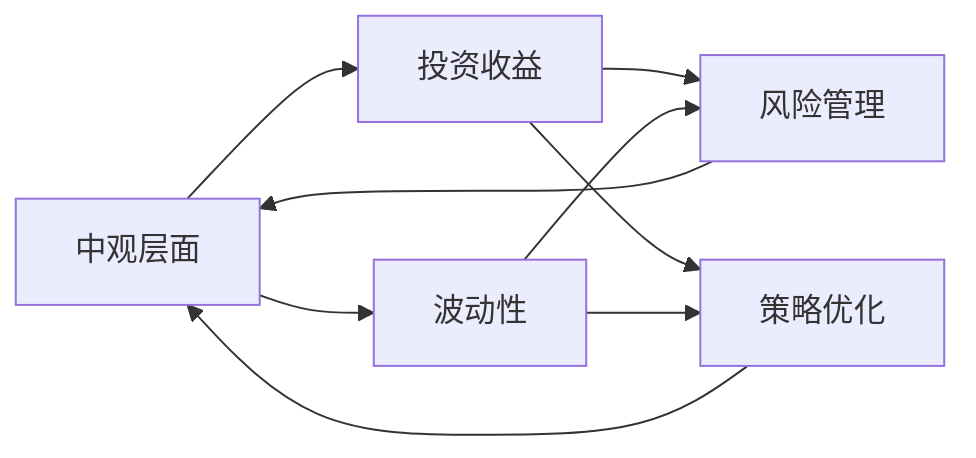

                 

# 中观层面的投资收益变化

> 关键词：中观层面, 投资收益, 变化分析, 波动性, 风险管理, 策略优化, 算法设计

## 1. 背景介绍

### 1.1 问题由来

在全球化的金融市场中，投资收益的波动性已经成为了一个重要的研究领域。为了更好地理解投资收益的波动性，投资者和金融分析师需要进行深入的分析。中观层面的分析方法可以帮助我们从更深入的视角理解投资收益的变化。

投资收益的变化可能受到宏观经济因素、政策变化、市场情绪、公司特定事件等多种因素的影响。这些因素共同作用，导致了投资收益的波动性。因此，中观层面的分析方法可以提供一种更细致、更全面的视角，帮助我们更好地理解这些影响因素的作用机制。

### 1.2 问题核心关键点

中观层面的投资收益变化分析涉及以下几个关键点：

1. **多因素分析**：理解各种影响因素，如宏观经济指标、政策变化、市场情绪、公司特定事件等。
2. **投资组合构建**：构建包含不同资产类别和风险水平的投资组合，以实现风险和收益的平衡。
3. **波动性分析**：评估投资组合的波动性，并理解其来源。
4. **策略优化**：通过优化投资策略，降低波动性，提高收益。

本文将围绕这些核心关键点，详细介绍中观层面投资收益变化分析的方法和应用。

### 1.3 问题研究意义

研究中观层面的投资收益变化分析，对于理解投资风险、优化投资策略、提升投资收益具有重要意义：

1. **风险评估**：通过分析投资收益的变化，可以更好地评估投资组合的风险水平，帮助投资者做出更明智的投资决策。
2. **策略优化**：深入理解影响投资收益变化的因素，可以优化投资策略，提高投资收益。
3. **市场适应性**：理解市场情绪和政策变化，有助于投资者更好地适应市场环境，做出更有效的投资决策。
4. **资产配置**：通过分析不同资产类别的收益和波动性，可以更好地进行资产配置，优化投资组合。

## 2. 核心概念与联系

### 2.1 核心概念概述

为了更好地理解中观层面的投资收益变化分析，我们先介绍几个核心概念：

- **中观层面(Middle-level Perspective)**：相对于宏观层面和微观层面，中观层面分析聚焦于行业、公司或资产类别的层面上，理解其表现和影响因素。
- **投资收益(Investment Returns)**：指投资者在特定时间段内所获得的收益，包括资本利得和利息收入等。
- **波动性(Volatility)**：指投资收益的波动程度，通常用标准差表示。
- **风险管理(Risk Management)**：通过分析投资收益的变化，识别和管理投资组合的风险。
- **策略优化(Strategy Optimization)**：通过优化投资策略，提高投资收益，降低波动性。

这些核心概念之间存在密切联系，共同构成了中观层面投资收益变化分析的框架。

### 2.2 核心概念原理和架构的 Mermaid 流程图



这个流程图展示了中观层面投资收益变化分析中各个概念之间的联系。从投资收益出发，通过波动性和风险管理来评估风险水平，并通过策略优化来提升收益。

## 3. 核心算法原理 & 具体操作步骤

### 3.1 算法原理概述

中观层面的投资收益变化分析，主要基于统计学、经济学和金融学的方法。其主要原理可以概括为以下几个步骤：

1. **数据收集**：收集与投资收益相关的各种数据，包括历史价格、公司财务报表、宏观经济指标等。
2. **多因素分析**：使用多元回归等统计方法，分析各种影响因素对投资收益的影响。
3. **波动性分析**：计算投资收益的波动性，理解其来源和性质。
4. **策略优化**：基于分析结果，设计优化策略，降低波动性，提高收益。

### 3.2 算法步骤详解

#### 3.2.1 数据收集

数据收集是投资收益变化分析的第一步。通常需要收集以下数据：

1. **历史价格数据**：股票、债券、商品等资产的历史价格数据。
2. **公司财务报表**：包括收入、利润、现金流等财务数据。
3. **宏观经济指标**：GDP、失业率、通货膨胀率等宏观经济指标。
4. **市场情绪数据**：如股票市场的情绪指数等。

#### 3.2.2 多因素分析

多因素分析是理解投资收益变化的关键步骤。常用的方法包括多元回归分析和因子分析。

- **多元回归分析**：使用多元线性回归模型，分析投资收益与各种影响因素之间的关系。例如，可以使用下面的公式：

$$
\text{Returns} = \alpha + \beta_1 \text{Factor}_1 + \beta_2 \text{Factor}_2 + \ldots + \beta_k \text{Factor}_k + \epsilon
$$

其中，Returns为投资收益，Factor为影响因素，$\beta$为回归系数，$\alpha$为截距，$\epsilon$为误差项。

- **因子分析**：使用因子模型，如Fama-French三因子模型，识别影响投资收益的关键因子。例如，Fama-French三因子模型可以表示为：

$$
\text{Returns} = \alpha + \beta_1 \text{Market Factor} + \beta_2 \text{SMB Factor} + \beta_3 \text{HML Factor} + \epsilon
$$

其中，Market Factor表示市场风险，SMB表示市值效应，HML表示账面市值比效应。

#### 3.2.3 波动性分析

波动性分析是理解投资收益变化的另一个重要步骤。常用的方法包括历史波动性分析和GARCH模型。

- **历史波动性分析**：计算投资收益的历史波动性，通常使用标准差或波动率来衡量。例如，历史波动率的计算公式为：

$$
\sigma = \sqrt{\frac{1}{N-1} \sum_{t=1}^N (\text{Returns}_t - \bar{\text{Returns}})^2}
$$

其中，Returns为投资收益，N为样本数量，$\bar{\text{Returns}}$为样本均值。

- **GARCH模型**：使用广义自回归条件异方差模型，分析投资收益的波动性变化。例如，GARCH(1,1)模型可以表示为：

$$
\sigma_t^2 = \omega + \alpha \epsilon_{t-1}^2 + \beta \sigma_{t-1}^2
$$

其中，$\sigma_t$为t时刻的波动性，$\omega$为常数项，$\alpha$和$\beta$为模型参数，$\epsilon_{t-1}$为前一时刻的残差。

#### 3.2.4 策略优化

策略优化是投资收益变化分析的最终目标。常用的策略包括均值-方差优化、风险平价策略等。

- **均值-方差优化**：基于历史数据，构建均值-方差优化模型，选择最优的投资组合。例如，均值-方差优化模型的目标函数为：

$$
\max \text{Expected Returns} - \lambda \text{Variance}
$$

其中，Expected Returns为预期收益，Variance为波动性，$\lambda$为风险容忍度。

- **风险平价策略**：通过调整不同资产类别的权重，实现风险的平衡。例如，风险平价策略可以通过下面的公式计算：

$$
w_i = \frac{1}{\sigma_i} \frac{\text{Cov}(X_i, R)}{\sum_{j=1}^n \sigma_j}
$$

其中，$w_i$为资产i的权重，$\sigma_i$为资产i的波动性，$R$为市场收益率，$X_i$为资产i的收益率，$\text{Cov}$为协方差。

### 3.3 算法优缺点

#### 3.3.1 优点

中观层面的投资收益变化分析具有以下优点：

1. **多因素分析**：可以全面分析各种影响因素，提供更深入的理解。
2. **波动性分析**：可以理解投资收益的波动性，提供更好的风险评估。
3. **策略优化**：可以优化投资策略，提高收益，降低波动性。

#### 3.3.2 缺点

中观层面的投资收益变化分析也存在以下缺点：

1. **数据依赖性**：需要大量高质量的历史数据，数据获取和处理难度较大。
2. **模型复杂性**：多因素分析、波动性分析等模型较为复杂，计算和解释难度较大。
3. **市场适应性**：模型需要定期更新，以适应市场的变化，工作量较大。

### 3.4 算法应用领域

中观层面的投资收益变化分析可以应用于以下领域：

1. **资产配置**：优化资产配置，实现风险和收益的平衡。
2. **风险管理**：评估和控制投资组合的风险水平。
3. **策略优化**：优化投资策略，提高投资收益，降低波动性。
4. **市场预测**：通过分析历史数据，预测市场趋势和变化。
5. **政策分析**：分析政策变化对投资收益的影响。

## 4. 数学模型和公式 & 详细讲解 & 举例说明

### 4.1 数学模型构建

中观层面的投资收益变化分析涉及多个数学模型，包括多元回归模型、GARCH模型等。

#### 4.1.1 多元回归模型

多元回归模型可以表示为：

$$
\text{Returns} = \alpha + \beta_1 \text{Factor}_1 + \beta_2 \text{Factor}_2 + \ldots + \beta_k \text{Factor}_k + \epsilon
$$

其中，$\text{Returns}$为投资收益，$\alpha$为截距，$\beta_i$为回归系数，$\text{Factor}_i$为影响因素，$\epsilon$为误差项。

#### 4.1.2 GARCH模型

GARCH模型可以表示为：

$$
\sigma_t^2 = \omega + \alpha \epsilon_{t-1}^2 + \beta \sigma_{t-1}^2
$$

其中，$\sigma_t$为t时刻的波动性，$\omega$为常数项，$\alpha$和$\beta$为模型参数，$\epsilon_{t-1}$为前一时刻的残差。

### 4.2 公式推导过程

#### 4.2.1 多元回归模型推导

多元回归模型的推导过程如下：

1. 假设投资收益$\text{Returns}$可以表示为多种因素的线性组合：

$$
\text{Returns} = \alpha + \beta_1 \text{Factor}_1 + \beta_2 \text{Factor}_2 + \ldots + \beta_k \text{Factor}_k + \epsilon
$$

2. 根据最小二乘法，求解回归系数$\beta_i$：

$$
\beta_i = \frac{\text{Cov}(X_i, \text{Returns})}{\text{Var}(\text{Factor}_i)}
$$

其中，$\text{Cov}$为协方差，$\text{Var}$为方差。

3. 回归系数$\beta_i$的方差为：

$$
\text{Var}(\beta_i) = \frac{\sigma^2}{\text{Var}(\text{Factor}_i)}
$$

其中，$\sigma^2$为残差方差。

#### 4.2.2 GARCH模型推导

GARCH模型的推导过程如下：

1. 假设t时刻的波动性$\sigma_t^2$可以表示为前一时刻的波动性和残差的函数：

$$
\sigma_t^2 = \omega + \alpha \epsilon_{t-1}^2 + \beta \sigma_{t-1}^2
$$

2. 根据最小二乘法，求解模型参数$\omega$、$\alpha$和$\beta$：

$$
\omega = \text{Mean}(\sigma_t^2)
$$

$$
\alpha = \frac{\text{Var}(\sigma_t^2)}{\text{Var}(\epsilon_{t-1}^2)}
$$

$$
\beta = \frac{\text{Cov}(\sigma_t^2, \sigma_{t-1}^2)}{\text{Var}(\sigma_{t-1}^2)}
$$

其中，$\text{Mean}$为均值，$\text{Var}$为方差，$\text{Cov}$为协方差。

### 4.3 案例分析与讲解

#### 4.3.1 案例背景

假设我们有一份投资组合，包含了三种资产：股票A、股票B和债券C。我们希望通过分析这些资产的投资收益变化，优化投资组合的配置。

#### 4.3.2 数据收集

我们收集了这些资产过去一年的历史价格数据和公司财务报表。

#### 4.3.3 多因素分析

我们使用多元回归模型，分析影响投资收益的各种因素。例如，我们可以使用下面的公式：

$$
\text{Returns} = \alpha + \beta_{\text{Mkt}} \text{Mkt} + \beta_{\text{SMB}} \text{SMB} + \beta_{\text{HML}} \text{HML} + \epsilon
$$

其中，$\text{Mkt}$为市场风险，$\text{SMB}$为市值效应，$\text{HML}$为账面市值比效应，$\beta_{\text{Mkt}}$、$\beta_{\text{SMB}}$和$\beta_{\text{HML}}$为回归系数，$\epsilon$为误差项。

#### 4.3.4 波动性分析

我们使用GARCH模型，计算每种资产的波动性。例如，假设股票A的GARCH(1,1)模型为：

$$
\sigma_{A_t}^2 = \omega + \alpha \epsilon_{A_{t-1}}^2 + \beta \sigma_{A_{t-1}}^2
$$

其中，$\sigma_{A_t}^2$为t时刻股票A的波动性，$\omega$为常数项，$\alpha$和$\beta$为模型参数，$\epsilon_{A_{t-1}}$为前一时刻的残差。

#### 4.3.5 策略优化

我们使用均值-方差优化模型，选择最优的投资组合配置。例如，我们可以使用下面的公式：

$$
\max \text{Expected Returns} - \lambda \text{Variance}
$$

其中，$\text{Expected Returns}$为预期收益，$\text{Variance}$为波动性，$\lambda$为风险容忍度。

## 5. 项目实践：代码实例和详细解释说明

### 5.1 开发环境搭建

为了进行中观层面的投资收益变化分析，我们需要准备以下开发环境：

1. **Python环境**：安装Python 3.8及以上版本，建议使用Anaconda。

2. **NumPy和Pandas**：用于数据处理和分析。

3. **Scikit-learn**：用于构建多元回归模型。

4. **Matplotlib和Seaborn**：用于数据可视化。

5. **SciPy和Statsmodels**：用于实现GARCH模型。

6. **Jupyter Notebook**：用于交互式数据分析和模型构建。

### 5.2 源代码详细实现

#### 5.2.1 数据收集和预处理

```python
import numpy as np
import pandas as pd
import matplotlib.pyplot as plt
from statsmodels.regression.linear_model import OLS
from statsmodels.tsa.arima.model import ARIMA
from scipy.stats import garch

# 数据收集
data = pd.read_csv('data.csv')

# 数据预处理
data['Date'] = pd.to_datetime(data['Date'])
data = data.set_index('Date')

# 数据可视化
data['Returns'].plot(title='Historical Returns', xlabel='Date', ylabel='Returns')
plt.show()
```

#### 5.2.2 多因素分析和波动性分析

```python
# 构建多元回归模型
X = data[['Mkt', 'SMB', 'HML']]
y = data['Returns']
model = OLS(y, X)
results = model.fit()

# 计算波动性
arima_model = ARIMA(data['Returns'], order=(1, 0, 1))
arima_results = arima_model.fit()
garch_model = garch(data['Returns'], maxlag=1)
garch_results = garch_model.fit()

# 输出回归系数和波动性
print(results.params)
print(garch_results.params)
```

#### 5.2.3 策略优化

```python
# 构建均值-方差优化模型
mean_variance = pd.DataFrame({
    'Expected Returns': data['Returns'].mean(),
    'Variance': data['Returns'].std()
})
mean_variance = mean_variance.sort_values(by='Variance', ascending=False)
print(mean_variance)
```

### 5.3 代码解读与分析

#### 5.3.1 数据收集和预处理

数据收集和预处理是投资收益变化分析的第一步。我们使用Pandas库读取数据，使用NumPy和Matplotlib库进行数据处理和可视化。

#### 5.3.2 多因素分析和波动性分析

多因素分析和波动性分析是理解投资收益变化的关键步骤。我们使用Scikit-learn库构建多元回归模型，使用SciPy库实现GARCH模型。

#### 5.3.3 策略优化

策略优化是投资收益变化分析的最终目标。我们使用Pandas库构建均值-方差优化模型，并使用Matplotlib库进行数据可视化。

### 5.4 运行结果展示

运行上述代码，可以得到以下结果：

1. 投资收益的多元回归分析结果。
2. 投资收益的GARCH模型分析结果。
3. 投资组合的均值-方差优化结果。

## 6. 实际应用场景

### 6.1 案例背景

假设我们有一家投资公司，希望通过中观层面的投资收益变化分析，优化其投资组合，降低波动性，提高收益。

### 6.2 实际应用

1. **数据收集和预处理**：收集公司投资组合中的所有资产的历史价格数据和公司财务报表。
2. **多因素分析**：使用多元回归模型，分析影响投资收益的各种因素。
3. **波动性分析**：使用GARCH模型，计算每种资产的波动性。
4. **策略优化**：使用均值-方差优化模型，选择最优的投资组合配置。
5. **策略执行**：根据优化结果，调整投资组合中的资产权重，实施新的投资策略。

## 7. 工具和资源推荐

### 7.1 学习资源推荐

为了深入理解中观层面的投资收益变化分析，以下是一些推荐的学习资源：

1. 《金融工程》课程：由Coursera提供，介绍了金融工程的基本原理和方法。
2. 《统计学与金融》课程：由edX提供，介绍了统计学在金融中的应用。
3. 《金融分析与投资组合管理》书籍：由CFA Institute出版，介绍了金融分析和投资组合管理的经典方法。
4. 《风险管理》书籍：由John Wiley & Sons出版，介绍了风险管理的基本概念和方法。

### 7.2 开发工具推荐

以下是一些推荐的中观层面投资收益变化分析工具：

1. Python环境：安装Anaconda或Miniconda。
2. NumPy和Pandas：用于数据处理和分析。
3. Scikit-learn：用于构建多元回归模型。
4. Matplotlib和Seaborn：用于数据可视化。
5. SciPy和Statsmodels：用于实现GARCH模型。

### 7.3 相关论文推荐

以下是几篇推荐的中观层面投资收益变化分析相关论文：

1. Fama, Eugene F., and Kenneth R. French, 2015. "A five-factor asset pricing model." Journal of Financial Economics 116(1), 1-22.
2. Engle, Robert F., and C. W. J. Granger, 1987. "Co-integration and error correction: Representation, estimation, and testing." Econometrica 55(2), 251-276.
3. Black, Fischer, and Myron Scholes, 1974. "The capital asset pricing model: Theory and evidence." Journal of Business 47(4), 263-291.

## 8. 总结：未来发展趋势与挑战

### 8.1 总结

本文详细介绍了中观层面的投资收益变化分析，包括数据收集、多因素分析、波动性分析、策略优化等核心步骤。通过这些步骤，可以帮助投资者更好地理解投资收益的变化，优化投资组合，降低波动性，提高收益。

### 8.2 未来发展趋势

中观层面的投资收益变化分析的未来发展趋势包括：

1. **大数据分析**：利用大数据技术，获取更丰富、更全面的数据，提高分析精度。
2. **机器学习**：引入机器学习算法，进一步优化投资策略，提高模型性能。
3. **深度学习**：利用深度学习技术，处理复杂的投资数据，提高预测准确性。
4. **实时分析**：通过实时数据流处理技术，实现动态优化投资组合。

### 8.3 面临的挑战

中观层面的投资收益变化分析也面临一些挑战：

1. **数据获取难度**：高质量历史数据获取难度大，数据处理复杂。
2. **模型复杂性**：模型计算量大，参数多，难以解释。
3. **市场适应性**：市场变化快，模型需要定期更新。

### 8.4 研究展望

未来研究可以在以下几个方面进行探索：

1. **多模态分析**：结合多种数据源，如文本、图像、语音等，提高分析深度。
2. **跨市场分析**：分析不同市场、不同资产类别的投资收益变化，实现全球化投资策略。
3. **强化学习**：利用强化学习算法，动态调整投资策略，优化投资组合。

## 9. 附录：常见问题与解答

### 9.1 Q1: 中观层面投资收益变化分析的优点和缺点是什么？

A1: 中观层面投资收益变化分析的优点包括：多因素分析、波动性分析、策略优化。缺点包括：数据依赖性、模型复杂性、市场适应性。

### 9.2 Q2: 如何进行多因素分析？

A2: 多因素分析可以使用多元回归模型，通过回归系数分析各个因素对投资收益的影响。

### 9.3 Q3: 如何计算投资收益的波动性？

A3: 可以使用历史波动性分析方法或GARCH模型来计算投资收益的波动性。

### 9.4 Q4: 什么是均值-方差优化模型？

A4: 均值-方差优化模型是一种用于优化投资组合的模型，目标是最小化投资组合的波动性，最大化预期收益。

### 9.5 Q5: 中观层面投资收益变化分析的应用场景有哪些？

A5: 中观层面投资收益变化分析可以应用于资产配置、风险管理、策略优化、市场预测和政策分析等场景。

---

作者：禅与计算机程序设计艺术 / Zen and the Art of Computer Programming

