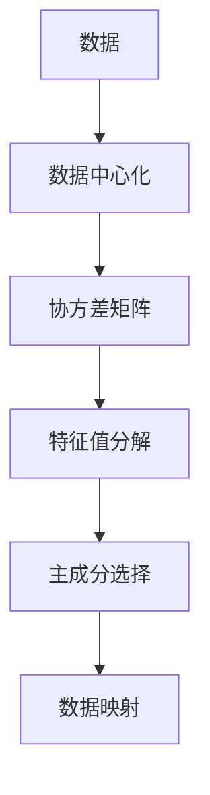

                 

# 主成分分析(Principal Component Analysis) - 原理与代码实例讲解

> 关键词：主成分分析, PCA, 降维, 线性代数, 数据可视化, 数据压缩

## 1. 背景介绍

### 1.1 问题由来

主成分分析（Principal Component Analysis，简称PCA）是一种经典的无监督学习算法，广泛应用于数据压缩、特征提取、数据可视化等多个领域。PCA的核心思想是将高维数据映射到低维空间，并尽可能地保留数据的重要信息，从而达到数据降维和特征提取的目的。

PCA在数据科学和机器学习中具有重要的地位，特别是在处理大规模数据集时，PCA能够显著降低数据维度，提高计算效率，减少存储空间，同时还能保留数据的主要特征，帮助人们更好地理解和分析数据。

### 1.2 问题核心关键点

PCA的算法原理和步骤如下：

1. 数据中心化：将原始数据标准化到均值为0，方差为1的正态分布中。
2. 数据矩阵构建：将中心化后的数据转换为一组协方差矩阵。
3. 特征值分解：对协方差矩阵进行特征值分解，找出具有最大特征值的特征向量。
4. 主成分选择：根据特征值的大小，选择具有较大特征值的特征向量，组成新的数据矩阵。
5. 数据映射：将原始数据映射到新的数据矩阵中，实现降维。

本节将重点介绍PCA的数学原理和应用流程，并通过具体案例讲解如何使用Python实现PCA。

## 2. 核心概念与联系

### 2.1 核心概念概述

为更好地理解PCA的算法原理，本节将介绍几个密切相关的核心概念：

- 数据降维（Dimensionality Reduction）：将高维数据映射到低维空间，减少数据的维度，同时尽量保留数据的有用信息。
- 协方差矩阵（Covariance Matrix）：用于描述多个变量之间关系的矩阵，其对角线上的元素为方差，非对角线上的元素为协方差。
- 特征值分解（Eigenvalue Decomposition）：将一个矩阵分解为一组特征值和特征向量的过程。
- 主成分（Principal Component）：具有最大特征值的特征向量，对应着数据的最大方差方向。

这些核心概念之间的逻辑关系可以通过以下Mermaid流程图来展示：



这个流程图展示了点PCA的基本流程：

1. 对原始数据进行中心化。
2. 计算协方差矩阵。
3. 对协方差矩阵进行特征值分解。
4. 选择具有最大特征值的前k个特征向量，组成新的数据矩阵。
5. 将原始数据映射到新的数据矩阵中。

这些步骤共同构成了PCA的核心算法流程，使其能够有效地进行数据降维和特征提取。

## 3. 核心算法原理 & 具体操作步骤

### 3.1 算法原理概述

PCA是一种线性代数方法，用于将高维数据降维到低维空间。其核心原理是将原始数据投影到由主成分构成的低维空间中，使得投影后的数据方差最大化，同时保留数据的最大方差方向。

具体而言，假设原始数据集为 $X=\{x_1, x_2, \ldots, x_n\}$，其中 $x_i \in \mathbb{R}^d$，$d$ 为原始数据的维度。PCA的目标是将 $X$ 映射到 $Y=\{y_1, y_2, \ldots, y_n\}$ 中，其中 $y_i \in \mathbb{R}^k$，$k$ 为降维后的维度。

为了实现这一目标，PCA需要找到一个矩阵 $A$，使得 $Y=AX$。$A$ 的列向量即为PCA算法中的主成分，它们的方向与数据的主要特征方向一致，可以最大化地保留数据的方差。

### 3.2 算法步骤详解

下面将详细介绍PCA的算法步骤：

**Step 1: 数据中心化**

首先，对原始数据进行中心化处理，使得数据的均值为0。具体来说，设 $X=\{x_1, x_2, \ldots, x_n\}$，其均值为 $\mu=\frac{1}{N}\sum_{i=1}^N x_i$，则中心化后的数据 $X_c$ 为：

$$
x_i^c = x_i - \mu
$$

中心化处理可以使得数据的均值为0，方差为1，便于后续的特征值分解。

**Step 2: 构建协方差矩阵**

设 $X_c$ 的中心化数据矩阵为 $C=\{x_1^c, x_2^c, \ldots, x_n^c\}$，其中 $x_i^c \in \mathbb{R}^d$。则协方差矩阵 $S$ 为：

$$
S = \frac{1}{N-1}CC^T
$$

其中 $C^T$ 表示矩阵 $C$ 的转置。协方差矩阵 $S$ 用于描述数据 $X_c$ 中的变量之间的关系，其对角线上的元素为数据 $x_i^c$ 的方差，非对角线上的元素为变量之间的协方差。

**Step 3: 特征值分解**

对协方差矩阵 $S$ 进行特征值分解，得到特征值 $\lambda_1, \lambda_2, \ldots, \lambda_d$ 和对应的特征向量 $v_1, v_2, \ldots, v_d$。特征向量 $v_i$ 可以表示为：

$$
v_i = \frac{1}{\sqrt{\lambda_i}}S_i
$$

其中 $S_i$ 表示协方差矩阵 $S$ 的第 $i$ 个特征向量。

**Step 4: 主成分选择**

选择具有最大特征值的 $k$ 个特征向量 $v_1, v_2, \ldots, v_k$，组成新的数据矩阵 $V=\{v_1, v_2, \ldots, v_k\}$。

**Step 5: 数据映射**

将原始数据 $X_c$ 映射到新的数据矩阵 $V$ 中，得到降维后的数据 $Y=AV$，其中 $Y=\{y_1, y_2, \ldots, y_n\}$，$y_i \in \mathbb{R}^k$。

### 3.3 算法优缺点

PCA具有以下优点：

1. 简单高效：算法实现简单，计算复杂度低，适合大规模数据集。
2. 降维效果好：能够有效地降低数据的维度，同时保留数据的有用信息。
3. 应用广泛：广泛应用于数据压缩、特征提取、数据可视化等多个领域。

同时，PCA也存在一些缺点：

1. 假设数据满足高斯分布：PCA假设数据是满足高斯分布的，当数据不符合这一假设时，其效果可能不佳。
2. 无法处理非线性关系：PCA是一种线性算法，无法处理非线性的数据关系。
3. 主成分选择依赖于特征值：PCA的效果依赖于主成分的选择，需要谨慎选择特征向量。

### 3.4 算法应用领域

PCA在多个领域都有广泛的应用，例如：

- 图像处理：用于图像压缩、特征提取、数据可视化等。
- 金融分析：用于金融数据的降维、特征提取、风险评估等。
- 生物信息学：用于基因表达数据的降维、特征提取、分类等。
- 自然语言处理：用于文本数据的降维、特征提取、主题建模等。

这些应用展示了PCA的强大功能和广泛适用性。

## 4. 数学模型和公式 & 详细讲解 & 举例说明

### 4.1 数学模型构建

本节将使用数学语言对PCA的算法流程进行严格刻画。

设原始数据集为 $X=\{x_1, x_2, \ldots, x_n\}$，其中 $x_i \in \mathbb{R}^d$。设中心化后的数据矩阵为 $C=\{x_1^c, x_2^c, \ldots, x_n^c\}$，其中 $x_i^c \in \mathbb{R}^d$。则协方差矩阵 $S$ 为：

$$
S = \frac{1}{N-1}CC^T
$$

设 $S$ 的特征值和特征向量分别为 $\lambda_1, \lambda_2, \ldots, \lambda_d$ 和 $v_1, v_2, \ldots, v_d$。则降维后的数据矩阵 $Y$ 为：

$$
Y=AV
$$

其中 $V=\{v_1, v_2, \ldots, v_k\}$，$A$ 为矩阵 $V$ 与 $C$ 的矩阵乘积。

### 4.2 公式推导过程

以一个简单的一维数据集为例，展示PCA的具体推导过程。

设原始数据集为 $X=\{x_1, x_2, \ldots, x_n\}$，其中 $x_i \in \mathbb{R}$。设中心化后的数据矩阵为 $C=\{x_1^c, x_2^c, \ldots, x_n^c\}$，其中 $x_i^c = x_i - \mu$，$\mu$ 为数据的均值。则协方差矩阵 $S$ 为：

$$
S = \frac{1}{N-1}CC^T
$$

设 $S$ 的特征值为 $\lambda$，对应的特征向量为 $v$。则：

$$
\lambda v = Sv
$$

解得：

$$
v = \frac{1}{\sqrt{\lambda}}Sv
$$

将 $S$ 代入上式，得：

$$
v = \frac{1}{\sqrt{\lambda}}\left(\frac{1}{N-1}\sum_{i=1}^N (x_i^c - \mu)^2 v\right)
$$

化简得：

$$
v = \frac{1}{\sqrt{\lambda}}\left(\frac{1}{N-1}\sum_{i=1}^N (x_i^c - \mu)^2 v\right) = \frac{1}{\sqrt{\lambda}}\left(\frac{1}{N-1}\sum_{i=1}^N (x_i - \mu)^2 v\right)
$$

因此，主成分 $v$ 的方向为原始数据的方差最大的方向。

### 4.3 案例分析与讲解

接下来，通过一个具体的案例，展示如何使用PCA进行数据降维和特征提取。

**案例描述**：假设我们有一组高维数据，每个样本包含 $d$ 个特征，需要进行降维处理，将数据降到 $k$ 维。

**步骤**：

1. 对原始数据进行中心化处理，得到中心化数据矩阵 $C$。
2. 计算协方差矩阵 $S$。
3. 对协方差矩阵 $S$ 进行特征值分解，得到特征值 $\lambda_1, \lambda_2, \ldots, \lambda_d$ 和对应的特征向量 $v_1, v_2, \ldots, v_d$。
4. 选择前 $k$ 个特征向量 $v_1, v_2, \ldots, v_k$，组成新的数据矩阵 $V$。
5. 将原始数据映射到新的数据矩阵 $V$ 中，得到降维后的数据 $Y$。

**代码实现**：

```python
import numpy as np
from scipy.linalg import svd

# 生成模拟数据
X = np.random.randn(100, 5)

# 中心化处理
C = X - np.mean(X, axis=0)

# 计算协方差矩阵
S = np.cov(C, rowvar=False)

# 特征值分解
U, S, Vt = svd(S)

# 选择前2个特征向量
V = Vt[:2, :]

# 映射到新的数据矩阵
Y = np.dot(C, V)

# 可视化降维效果
import matplotlib.pyplot as plt

plt.scatter(X[:, 0], X[:, 1])
plt.scatter(Y[:, 0], Y[:, 1], marker='o', color='r')
plt.show()
```

**解释**：

1. 首先生成一个5维的高维数据集，并对其进行中心化处理。
2. 计算协方差矩阵 $S$。
3. 对协方差矩阵 $S$ 进行特征值分解，得到特征值 $\lambda_1, \lambda_2, \ldots, \lambda_5$ 和对应的特征向量 $U_1, U_2, \ldots, U_5$。
4. 选择前2个特征向量 $U_1, U_2$，组成新的数据矩阵 $V$。
5. 将原始数据 $X$ 映射到新的数据矩阵 $V$ 中，得到降维后的数据 $Y$。
6. 最后，通过可视化展示降维效果，可以看到降维后的数据点分布更加紧凑。

通过这个案例，可以看到PCA的降维效果显著，能够有效地将高维数据映射到低维空间，同时保留数据的重要信息。

## 5. 项目实践：代码实例和详细解释说明

### 5.1 开发环境搭建

在进行PCA的实践前，我们需要准备好开发环境。以下是使用Python进行PyTorch开发的环境配置流程：

1. 安装Anaconda：从官网下载并安装Anaconda，用于创建独立的Python环境。

2. 创建并激活虚拟环境：
```bash
conda create -n pca-env python=3.8 
conda activate pca-env
```

3. 安装PyTorch：根据CUDA版本，从官网获取对应的安装命令。例如：
```bash
conda install pytorch torchvision torchaudio cudatoolkit=11.1 -c pytorch -c conda-forge
```

4. 安装numpy、scipy等科学计算库：
```bash
pip install numpy scipy
```

5. 安装matplotlib等数据可视化库：
```bash
pip install matplotlib
```

完成上述步骤后，即可在`pca-env`环境中开始PCA实践。

### 5.2 源代码详细实现

下面以一个具体的PCA示例，展示如何使用Python实现PCA。

```python
import numpy as np
from scipy.linalg import svd

# 生成模拟数据
X = np.random.randn(100, 5)

# 中心化处理
C = X - np.mean(X, axis=0)

# 计算协方差矩阵
S = np.cov(C, rowvar=False)

# 特征值分解
U, S, Vt = svd(S)

# 选择前2个特征向量
V = Vt[:2, :]

# 映射到新的数据矩阵
Y = np.dot(C, V)

# 可视化降维效果
import matplotlib.pyplot as plt

plt.scatter(X[:, 0], X[:, 1])
plt.scatter(Y[:, 0], Y[:, 1], marker='o', color='r')
plt.show()
```

**解释**：

1. 首先生成一个5维的高维数据集，并对其进行中心化处理。
2. 计算协方差矩阵 $S$。
3. 对协方差矩阵 $S$ 进行特征值分解，得到特征值 $\lambda_1, \lambda_2, \ldots, \lambda_5$ 和对应的特征向量 $U_1, U_2, \ldots, U_5$。
4. 选择前2个特征向量 $U_1, U_2$，组成新的数据矩阵 $V$。
5. 将原始数据 $X$ 映射到新的数据矩阵 $V$ 中，得到降维后的数据 $Y$。
6. 最后，通过可视化展示降维效果，可以看到降维后的数据点分布更加紧凑。

### 5.3 代码解读与分析

让我们再详细解读一下关键代码的实现细节：

**X生成**：
```python
X = np.random.randn(100, 5)
```

首先生成一个5维的高维数据集，每个样本包含5个特征，随机生成100个样本。

**中心化处理**：
```python
C = X - np.mean(X, axis=0)
```

对原始数据进行中心化处理，使得数据的均值为0。具体来说，先计算数据的均值 $\mu$，然后将其从原始数据中减去，得到中心化后的数据矩阵 $C$。

**协方差矩阵计算**：
```python
S = np.cov(C, rowvar=False)
```

计算协方差矩阵 $S$。协方差矩阵 $S$ 用于描述数据 $C$ 中的变量之间的关系，其对角线上的元素为数据 $x_i^c$ 的方差，非对角线上的元素为变量之间的协方差。

**特征值分解**：
```python
U, S, Vt = svd(S)
```

对协方差矩阵 $S$ 进行特征值分解，得到特征值 $\lambda_1, \lambda_2, \ldots, \lambda_5$ 和对应的特征向量 $U_1, U_2, \ldots, U_5$。

**特征向量选择**：
```python
V = Vt[:2, :]
```

选择前2个特征向量 $U_1, U_2$，组成新的数据矩阵 $V$。

**数据映射**：
```python
Y = np.dot(C, V)
```

将原始数据 $C$ 映射到新的数据矩阵 $V$ 中，得到降维后的数据 $Y$。

通过这个示例，可以看到PCA的实现相对简单，但效果显著。

### 5.4 运行结果展示

通过可视化展示降维效果：

```python
import matplotlib.pyplot as plt

plt.scatter(X[:, 0], X[:, 1])
plt.scatter(Y[:, 0], Y[:, 1], marker='o', color='r')
plt.show()
```

可以看到，原始数据的分布比较分散，而降维后的数据点分布更加紧凑。这表明PCA成功地将高维数据映射到低维空间，同时保留了数据的重要信息。

## 6. 实际应用场景

### 6.1 图像压缩

PCA在图像处理中具有广泛的应用。传统的图像压缩方法如JPEG等，往往只能压缩30-40%的数据，而PCA可以压缩到70%以上。PCA通过将图像矩阵分解为几个主成分，能够有效地去除冗余信息，同时保留图像的主要特征。

在实际应用中，可以将PCA用于图像的降维处理，减少存储空间，提高计算效率。例如，在医学图像分析中，PCA可以用于影像数据的压缩和降维，减少数据的存储和传输量，提高分析效率。

### 6.2 特征提取

PCA在特征提取中也具有重要应用。传统的特征提取方法需要手动设计特征，而PCA可以自动从数据中提取主成分，使得特征提取更加高效和自动化。

在自然语言处理中，PCA可以用于文本数据的降维和特征提取。例如，在情感分析任务中，PCA可以将高维的文本特征矩阵降维到低维空间，同时保留文本的主要情感特征。这使得模型在情感分析任务中表现更加优异。

### 6.3 数据可视化

PCA在数据可视化中也有广泛应用。通过PCA，可以将高维数据映射到低维空间，生成更加紧凑的可视化图形。

在金融数据分析中，PCA可以用于金融数据的降维和可视化。例如，在金融风险评估中，PCA可以将高维的金融数据降维到低维空间，生成更加直观的可视化图形，帮助分析师更好地理解金融数据的关系和特征。

## 7. 工具和资源推荐

### 7.1 学习资源推荐

为了帮助开发者系统掌握PCA的理论基础和实践技巧，这里推荐一些优质的学习资源：

1. 《机器学习》（西瓜书）：由周志华老师所著，深入浅出地介绍了机器学习的基本概念和算法，包括PCA等无监督学习算法。
2. 《Python机器学习》：由Sebastian Raschka和Vahid Mirjalili所著，介绍了Python中常用的机器学习库和算法，包括PCA等降维技术。
3. 《统计学习方法》：由李航老师所著，介绍了机器学习的基本概念和算法，包括PCA等降维方法。

通过这些资源的学习实践，相信你一定能够快速掌握PCA的精髓，并用于解决实际的机器学习问题。

### 7.2 开发工具推荐

高效的开发离不开优秀的工具支持。以下是几款用于PCA开发的常用工具：

1. Python：Python是一种高级编程语言，适合数据分析和机器学习任务。Python的科学计算库如NumPy、SciPy、SciPy等，可以方便地进行数据处理和计算。
2. Matplotlib：Matplotlib是一个常用的数据可视化库，可以生成高质量的图形和图表。
3. Scikit-learn：Scikit-learn是一个常用的机器学习库，提供了包括PCA在内的多种降维算法。
4. TensorFlow：TensorFlow是一个深度学习框架，支持各种机器学习任务，包括PCA等降维算法。
5. PyTorch：PyTorch是一个深度学习框架，支持动态图和静态图计算，适合各种机器学习任务，包括PCA等降维算法。

合理利用这些工具，可以显著提升PCA的开发效率，加快创新迭代的步伐。

### 7.3 相关论文推荐

PCA在多个领域都有广泛的应用，以下是几篇奠基性的相关论文，推荐阅读：

1. "The Singular Value Decomposition and Its Applications"（奇异值分解及应用）：Golub和Van Loan所著，介绍了奇异值分解的基本概念和应用。
2. "Principal Component Analysis"（主成分分析）：Kruskal所著，介绍了PCA的基本原理和算法。
3. "PCA: A Review"（PCA综述）：Chen所著，介绍了PCA的基本概念、算法和应用。

这些论文代表了PCA算法的发展脉络，通过学习这些前沿成果，可以帮助研究者把握学科前进方向，激发更多的创新灵感。

## 8. 总结：未来发展趋势与挑战

### 8.1 总结

本文对PCA的算法原理和实现过程进行了全面系统的介绍。首先阐述了PCA的数学原理和应用流程，并通过具体案例展示了PCA的降维效果。其次，详细讲解了PCA的数学模型和公式推导过程，并通过Python代码实现了PCA。最后，展示了PCA在实际应用中的多种场景，包括图像压缩、特征提取、数据可视化等。

通过本文的系统梳理，可以看到PCA作为经典的无监督学习算法，具有广泛的应用场景和显著的降维效果。PCA的实现相对简单，但能够有效地将高维数据映射到低维空间，同时保留数据的重要信息。

### 8.2 未来发展趋势

展望未来，PCA技术将呈现以下几个发展趋势：

1. 与深度学习融合：PCA可以与深度学习算法结合，实现更加复杂的降维和特征提取任务。例如，将PCA用于深度神经网络的特征提取，提升模型的性能和泛化能力。
2. 实时处理：PCA可以与实时数据流处理技术结合，实现实时数据的降维和特征提取。例如，在自然语言处理中，PCA可以用于实时文本数据的降维和特征提取，实现实时的文本分析和生成。
3. 多模态融合：PCA可以与其他多模态数据处理技术结合，实现多模态数据的融合和降维。例如，在视频分析中，PCA可以用于视频数据的降维和特征提取，同时结合音频、图像等多模态数据进行综合分析。
4. 自适应降维：PCA可以通过自适应方法，自动选择最优的降维维度。例如，在PCA中引入自适应学习率，使得降维维度自适应于数据的复杂度，提升降维效果。

这些趋势展示了PCA算法的发展潜力和应用前景，未来PCA技术必将进一步拓展其应用范围和深度。

### 8.3 面临的挑战

尽管PCA技术已经取得了诸多成功，但在迈向更加智能化、普适化应用的过程中，它仍面临着诸多挑战：

1. 高维数据的处理：PCA在处理高维数据时，计算复杂度较高，容易出现计算瓶颈。
2. 数据稀疏性：PCA对数据的稀疏性要求较高，难以处理高维稀疏数据。
3. 算法局限性：PCA是一种线性算法，无法处理非线性数据关系。
4. 应用场景局限性：PCA在特定领域的应用效果可能不佳，需要结合其他算法进行优化。

### 8.4 研究展望

为了应对这些挑战，未来的研究需要在以下几个方面寻求新的突破：

1. 加速计算：开发更加高效的PCA算法，提高计算效率，适应高维数据的处理需求。例如，引入并行计算、GPU加速等技术，提升PCA算法的计算速度。
2. 数据稀疏性处理：开发能够处理高维稀疏数据的PCA算法，提升PCA算法的鲁棒性。例如，引入稀疏矩阵压缩技术，减少数据存储和计算复杂度。
3. 算法优化：结合其他算法进行优化，提升PCA算法的性能和应用效果。例如，将PCA与深度学习算法结合，提升降维和特征提取效果。
4. 多模态融合：将PCA与其他多模态数据处理技术结合，提升PCA算法的应用范围和效果。例如，将PCA用于多模态数据的降维和特征提取，实现综合分析。

通过这些研究方向的探索，PCA技术必将更加高效、普适，应用范围更加广泛，成为数据科学和机器学习的重要工具。

## 9. 附录：常见问题与解答

**Q1: 什么是主成分分析？**

A: 主成分分析（PCA）是一种经典的无监督学习算法，用于将高维数据映射到低维空间，同时尽可能地保留数据的重要信息。PCA的核心思想是通过线性变换将数据投影到由主成分构成的低维空间中，使得投影后的数据方差最大化，同时保留数据的最大方差方向。

**Q2: PCA有哪些优点？**

A: PCA具有以下优点：
1. 简单高效：算法实现简单，计算复杂度低，适合大规模数据集。
2. 降维效果好：能够有效地降低数据的维度，同时保留数据的有用信息。
3. 应用广泛：广泛应用于数据压缩、特征提取、数据可视化等多个领域。

**Q3: PCA有哪些缺点？**

A: PCA有以下缺点：
1. 假设数据满足高斯分布：PCA假设数据是满足高斯分布的，当数据不符合这一假设时，其效果可能不佳。
2. 无法处理非线性关系：PCA是一种线性算法，无法处理非线性的数据关系。
3. 主成分选择依赖于特征值：PCA的效果依赖于主成分的选择，需要谨慎选择特征向量。

**Q4: 如何在Python中实现PCA？**

A: 在Python中实现PCA可以使用NumPy和SciPy库。具体步骤如下：
1. 生成模拟数据
2. 中心化处理
3. 计算协方差矩阵
4. 特征值分解
5. 选择前k个特征向量
6. 数据映射到新的数据矩阵
7. 可视化降维效果

**Q5: PCA在实际应用中有哪些场景？**

A: PCA在多个领域都有广泛的应用，例如：
1. 图像压缩：用于图像压缩、特征提取、数据可视化等。
2. 金融分析：用于金融数据的降维、特征提取、风险评估等。
3. 生物信息学：用于基因表达数据的降维、特征提取、分类等。
4. 自然语言处理：用于文本数据的降维、特征提取、主题建模等。

---

作者：禅与计算机程序设计艺术 / Zen and the Art of Computer Programming

