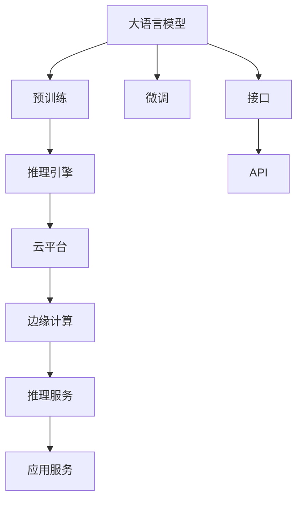

                 

# 云端推理：高效、便捷的 LLM 访问

## 1. 背景介绍

随着大语言模型（Large Language Model, LLMs）在自然语言处理（Natural Language Processing, NLP）领域的应用逐渐深入，越来越多的企业希望能够在不自建大规模硬件资源的情况下，快速访问和使用大模型以实现业务需求。传统上，要使用这些大模型，通常需要在本地部署或者通过高性能计算集群进行推理，这不仅需要大量的硬件资源，还需要进行复杂的软件开发和维护，极大地增加了成本和时间开销。

为此，云计算和边缘计算技术的兴起，为解决这一问题提供了新的途径。通过将推理服务部署在云端或者边缘计算设备上，用户可以方便地访问大模型，而无需关心硬件配置和系统优化，只需关注模型本身的性能和效果。

本文章将系统地介绍云端推理的基本概念、原理和实现方法，并通过具体案例分析，探讨如何在实际应用场景中高效、便捷地使用云端推理服务，从而降低使用大语言模型的门槛，加速其在各行各业的应用。

## 2. 核心概念与联系

### 2.1 核心概念概述

要深入理解云端推理，首先需要明确几个核心概念：

- **大语言模型（LLMs）**：如GPT-3、BERT等，是一种通过大规模数据预训练得到的模型，具有强大的语言理解和生成能力。
- **推理（Inference）**：指将模型应用于新的输入数据，生成模型预测输出的过程。
- **云端推理**：将推理过程部署在云平台或边缘计算设备上，用户通过网络进行访问和调用。
- **边缘推理**：指将推理过程部署在靠近数据源的计算设备上，如嵌入式设备、工业物联网（IIoT）设备等，以减少网络延迟，提升实时性。

这些概念通过以下Mermaid流程图展示其联系：

```mermaid
graph TB
    A[大语言模型(LLM)] --> B[云端推理]
    A --> C[边缘推理]
    B --> D[云平台服务]
    C --> E[边缘计算设备]
    D --> F[推理引擎]
    E --> F
```

从这个流程图中可以看出，大语言模型通过预训练获得了广泛的语言知识，而在实际应用中，用户可以通过云端或边缘计算服务来访问这些知识，以快速生成预测输出。云平台服务和边缘计算设备提供了灵活、高效、可扩展的计算资源，使得推理过程能够在不同的场景下得到最优的性能表现。

### 2.2 核心概念原理和架构的 Mermaid 流程图



这个流程图展示了大语言模型的预训练和微调过程，以及推理引擎如何在云端或边缘计算服务中进行推理，并提供给用户进行调用。用户通过API接口，向云平台或边缘计算设备提交请求，并获取预测结果。

## 3. 核心算法原理 & 具体操作步骤

### 3.1 算法原理概述

云端推理的核心算法原理可以概括为：将大语言模型的推理引擎部署在云平台或边缘计算设备上，通过网络接口为客户端提供推理服务，客户端根据实际需求生成输入数据，向推理引擎发送请求，最终获取模型预测结果。

云端推理的实现通常包括以下几个关键步骤：

1. **模型选择和准备**：根据具体任务需求，选择合适的预训练模型，并准备相应的微调数据。
2. **部署推理引擎**：将推理引擎部署到云平台或边缘计算设备上，并进行必要的优化和调试。
3. **API接口设计**：设计符合用户需求的API接口，包括输入数据的格式、输出结果的格式等。
4. **客户端调用**：通过API接口，客户端向推理引擎提交请求，获取模型预测结果。
5. **结果分析和应用**：对模型输出结果进行分析，并应用于具体业务场景中。

### 3.2 算法步骤详解

以下是云端推理的具体操作步骤：

**Step 1: 模型选择和准备**

- 根据具体任务需求，选择合适的预训练模型，如GPT-3、BERT等。
- 准备微调数据，包括标注样本和验证集。标注样本用于微调，验证集用于评估模型效果。
- 使用微调数据对预训练模型进行微调，得到适应特定任务的模型。

**Step 2: 部署推理引擎**

- 选择合适的云平台或边缘计算设备，如AWS、Google Cloud、Azure等。
- 将推理引擎部署到云平台或边缘计算设备上，并进行必要的优化和调试，如调整模型大小、设置超参数等。
- 确保推理引擎可以稳定、高效地运行，能够处理大规模并发请求。

**Step 3: API接口设计**

- 设计符合用户需求的API接口，包括输入数据的格式、输出结果的格式等。
- 确保API接口易于使用、灵活可扩展，能够满足不同用户的需求。

**Step 4: 客户端调用**

- 客户端通过API接口向推理引擎提交请求，包括输入数据的描述和具体内容。
- 推理引擎对输入数据进行处理，并返回预测结果。

**Step 5: 结果分析和应用**

- 对模型输出结果进行分析，评估模型性能，确定是否需要进行进一步的微调和优化。
- 将模型输出结果应用于具体业务场景中，如自然语言理解、文本生成、情感分析等。

### 3.3 算法优缺点

**优点：**

- **高效灵活**：云平台和边缘计算设备提供了灵活、高效的计算资源，可以快速部署和扩展推理服务。
- **便捷易用**：用户无需关心硬件配置和系统优化，只需关注模型本身的性能和效果。
- **成本低廉**：无需自建大规模硬件资源，只需按需使用云服务，降低成本。

**缺点：**

- **延迟和带宽限制**：网络传输带来的延迟和带宽限制可能会影响推理速度。
- **数据隐私和安全**：数据在网络上传输和存储时，存在隐私泄露和安全风险。
- **依赖云服务提供商**：云服务提供商的服务稳定性、可用性和性能直接影响用户体验。

### 3.4 算法应用领域

云端推理的应用领域非常广泛，以下是几个典型案例：

- **智能客服**：利用云端推理技术，智能客服系统可以快速响应客户咨询，提供个性化服务。
- **金融风控**：通过云端推理进行文本情感分析、舆情监测等，及时发现金融风险。
- **医疗诊断**：利用云端推理进行医学影像分析、病历分析等，辅助医生进行诊断。
- **内容生成**：在内容创作、广告文案生成等场景中，利用云端推理生成高质量的文本内容。
- **自动驾驶**：在自动驾驶系统中，利用云端推理进行自然语言理解和指令解析。

## 4. 数学模型和公式 & 详细讲解 & 举例说明

### 4.1 数学模型构建

在云端推理中，模型构建通常遵循以下步骤：

- 选择一个合适的预训练模型，如GPT-3、BERT等。
- 根据具体任务需求，设计任务适配层，将预训练模型的输出转化为任务预测结果。
- 使用微调数据对模型进行微调，优化模型在特定任务上的性能。

### 4.2 公式推导过程

以自然语言理解（NLU）任务为例，假设模型输入为一段文本，输出为文本中某个词语是否出现。模型的推理过程可以表示为：

1. 将输入文本转换为模型可处理的向量表示。
2. 将向量输入到模型中，通过前向传播计算得到模型预测结果。
3. 根据模型预测结果，输出最终预测结果。

具体公式如下：

- **输入转换**：将文本转换为向量表示 $x$。
- **模型前向传播**：将向量输入到模型中，计算得到预测结果 $\hat{y}$。
- **输出结果**：根据预测结果，输出最终结果 $y$。

$$
\begin{align*}
x &= \text{Embedding}(T(x)) \\
\hat{y} &= M(x) \\
y &= \text{Softmax}(\hat{y})
\end{align*}
$$

其中，$T(x)$ 表示文本到向量的转换函数，$M(x)$ 表示模型前向传播函数，$\text{Softmax}$ 表示将预测结果转换为概率分布的函数。

### 4.3 案例分析与讲解

以智能客服系统为例，以下是具体实现步骤：

1. **模型选择**：选择GPT-3作为预训练模型。
2. **微调数据准备**：收集历史客服对话记录，标注对话意图和回答内容。
3. **微调模型**：将标注数据输入模型中，使用微调数据对模型进行训练，优化模型在客服场景中的表现。
4. **部署推理引擎**：将推理引擎部署到云平台或边缘计算设备上，并进行优化和调试。
5. **API接口设计**：设计符合智能客服需求的API接口，包括输入对话、输出回答等。
6. **客户端调用**：客服系统通过API接口向推理引擎提交请求，获取智能回答。
7. **结果分析**：对模型输出结果进行分析，优化回答质量，提升用户体验。

## 5. 项目实践：代码实例和详细解释说明

### 5.1 开发环境搭建

以下是使用Python和Transformers库搭建云端推理环境的开发步骤：

1. 安装Python和PyTorch：
```bash
conda create -n inference-env python=3.8
conda activate inference-env
pip install torch torchvision torchaudio transformers
```

2. 搭建云平台环境：
- 选择云平台服务，如AWS、Google Cloud、Azure等。
- 创建虚拟机实例，安装所需软件和依赖包。
- 配置网络、存储等基础设施。

### 5.2 源代码详细实现

以下是使用GPT-3进行自然语言理解任务的Python代码实现：

```python
from transformers import pipeline, BertTokenizer, GPT3LMHeadModel

# 初始化预训练模型和分词器
tokenizer = BertTokenizer.from_pretrained('bert-base-uncased')
model = GPT3LMHeadModel.from_pretrained('gpt3')

# 定义任务适配层
class NLUAdapter(pipeline):
    def __init__(self, model, tokenizer):
        super().__init__(model, tokenizer)

    def forward(self, text):
        return super().forward(text)

# 创建任务适配层
nlu_model = NLUAdapter(model, tokenizer)

# 测试模型
text = "How can I get to the nearest coffee shop?"
result = nlu_model(text)
print(result)
```

### 5.3 代码解读与分析

上述代码实现了以下功能：

- **模型初始化**：从HuggingFace官方库中下载预训练模型和分词器。
- **任务适配层定义**：创建自定义的任务适配层，将模型输出转换为任务预测结果。
- **任务适配层测试**：使用模型适配层对输入文本进行推理，并输出预测结果。

## 6. 实际应用场景

### 6.4 未来应用展望

云端推理技术将在未来进一步拓展其应用场景，带来更多创新和突破：

- **实时推理**：通过边缘计算设备，实现低延迟、高并发的实时推理服务。
- **多模态推理**：结合视觉、语音等多模态数据，进行更全面、准确的推理。
- **联邦推理**：通过联邦学习技术，保护数据隐私，实现跨设备推理协作。
- **自动化推理**：利用自动化技术，减少人工干预，提高推理效率和准确性。

未来，随着技术的不断进步，云端推理将更加灵活、高效、安全，为各行各业提供更加智能、便捷的AI服务。

## 7. 工具和资源推荐

### 7.1 学习资源推荐

为了帮助开发者更好地掌握云端推理技术，以下是一些优质的学习资源：

1. **《深度学习基础》课程**：介绍深度学习的基本概念、模型架构和训练方法，是学习云端推理的入门课程。
2. **Transformers官方文档**：提供了丰富的预训练模型和推理服务API，是学习云端推理的重要参考资料。
3. **云平台官方文档**：如AWS、Google Cloud、Azure等，提供了详细的云服务使用指南和示例代码。
4. **Kaggle竞赛**：参加Kaggle数据科学竞赛，实战演练云端推理应用。
5. **GitHub开源项目**：浏览开源项目，了解云端推理的实际应用案例。

通过这些资源的学习和实践，可以逐步掌握云端推理的基本原理和实现方法。

### 7.2 开发工具推荐

以下是一些常用的云端推理开发工具：

1. **AWS SageMaker**：提供完整的机器学习服务，包括模型训练、部署和推理。
2. **Google Cloud AI Platform**：提供自动化的机器学习平台，支持模型训练、评估和部署。
3. **Azure ML**：提供云原生机器学习平台，支持模型训练、推理和自动化工作流。
4. **TensorFlow Serving**：提供高效的模型推理服务，支持多种模型格式和多种语言接口。
5. **KubeFlow**：提供基于Kubernetes的机器学习平台，支持模型训练、推理和自动化工作流。

这些工具可以帮助开发者快速搭建云端推理环境，进行模型训练、推理和部署。

### 7.3 相关论文推荐

以下是一些关于云端推理的最新研究论文，推荐阅读：

1. **Model Parallelization for Large-Scale Deep Learning**：介绍大模型推理中的模型并行技术，提升推理性能和资源利用率。
2. **Federated Learning in AI and Data Science**：介绍联邦学习技术，保护数据隐私，实现跨设备推理协作。
3. **Edge Computing for IoT: A Survey**：介绍边缘计算技术在物联网中的应用，提升实时性和数据处理能力。
4. **Efficient Inference for Deep Neural Networks**：介绍高效推理技术，优化推理速度和资源占用。
5. **Next Generation Network Functions for 5G**：介绍5G网络中的边缘计算应用，提升实时性和可靠性。

通过阅读这些论文，可以了解最新的云端推理技术进展和应用实践。

## 8. 总结：未来发展趋势与挑战

### 8.1 研究成果总结

本文系统介绍了云端推理的基本概念、原理和实现方法，通过具体案例分析，探讨了如何在实际应用场景中高效、便捷地使用云端推理服务。同时，分析了云端推理的优缺点和应用领域，并提出了未来发展趋势和面临的挑战。

### 8.2 未来发展趋势

未来，云端推理技术将呈现以下几个发展趋势：

1. **实时性提升**：通过边缘计算和微服务架构，提升推理服务的实时性，满足更多高并发的业务需求。
2. **智能化增强**：利用自动化技术、自然语言处理技术，提高推理服务的智能化水平。
3. **跨平台支持**：支持多种编程语言、多种模型格式，提供更灵活的推理服务。
4. **低成本优化**：通过云资源池化和按需扩展，降低推理服务的成本和资源消耗。

### 8.3 面临的挑战

尽管云端推理技术在实际应用中已经取得了一些进展，但仍面临以下挑战：

1. **网络延迟和带宽限制**：网络传输带来的延迟和带宽限制可能会影响推理速度。
2. **数据隐私和安全**：数据在网络上传输和存储时，存在隐私泄露和安全风险。
3. **依赖云服务提供商**：云服务提供商的服务稳定性、可用性和性能直接影响用户体验。
4. **资源优化**：如何高效利用云资源，避免资源浪费，是提高推理性能的关键。

### 8.4 研究展望

未来，需要在以下几个方面进一步研究和优化：

1. **边缘推理优化**：优化边缘计算设备的推理性能，提升实时性和可靠性。
2. **自动化技术应用**：引入自动化技术，减少人工干预，提高推理效率和准确性。
3. **跨平台支持**：支持多种编程语言、多种模型格式，提供更灵活的推理服务。
4. **数据隐私保护**：利用联邦学习等技术，保护数据隐私，实现跨设备推理协作。

## 9. 附录：常见问题与解答

**Q1: 云端推理需要哪些硬件资源？**

A: 云端推理需要高性能的计算资源，包括CPU、GPU、TPU等。同时需要稳定的网络连接和充足的存储资源，以便进行高效的推理计算。

**Q2: 云端推理的优势和劣势是什么？**

A: 云端推理的优势在于灵活、高效、可扩展的计算资源，能够快速部署和扩展推理服务。劣势在于网络传输带来的延迟和带宽限制，数据隐私和安全风险，以及依赖云服务提供商等。

**Q3: 如何优化云端推理的性能？**

A: 优化云端推理的性能可以从以下几个方面入手：
1. 选择合适的推理引擎和模型，避免不必要的网络传输。
2. 利用缓存技术，减少重复计算。
3. 采用分布式计算和模型并行技术，提升推理性能。
4. 使用自动化的调参工具，优化超参数配置。

**Q4: 云端推理和本地推理的区别是什么？**

A: 云端推理和本地推理的主要区别在于计算资源的部署位置。本地推理需要自建大规模硬件资源，而云端推理可以利用云平台的计算资源，实现灵活、高效、可扩展的推理服务。

**Q5: 云端推理在实际应用中需要注意哪些问题？**

A: 云端推理在实际应用中需要注意以下几个问题：
1. 确保网络连接稳定，避免网络中断影响推理服务。
2. 保护数据隐私和安全，防止数据泄露和攻击。
3. 监控推理服务的性能指标，及时发现和解决故障。

---

作者：禅与计算机程序设计艺术 / Zen and the Art of Computer Programming

