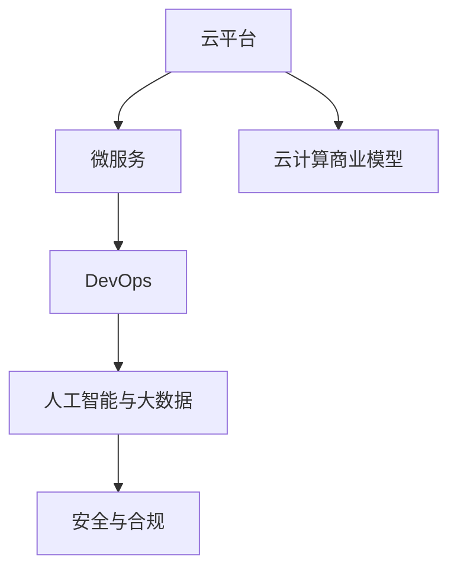

                 

## 1. 背景介绍

### 1.1 问题由来

随着云计算技术的日益成熟和普及，越来越多的企业将其核心业务部署到云端，云计算正成为新时代的数字化基础设施。云计算不仅为企业提供了高效、灵活、低成本的计算资源，也催生了新的商业模式和就业机会。对于程序员来说，这是一个充满机遇的时代。然而，如何在这波技术浪潮中抓住机会，找到合适的切入点，是一个值得深思的问题。

### 1.2 问题核心关键点

云计算时代的程序员创业机会，主要围绕以下几个关键点展开：

- **云平台与服务**：理解各大云平台（如AWS、Azure、阿里云、华为云等）的服务能力与技术架构。
- **微服务与DevOps**：掌握微服务架构和DevOps文化，实现高效开发和持续交付。
- **人工智能与大数据**：熟悉人工智能、大数据和机器学习在云平台上的应用，提高技术竞争力。
- **安全与合规**：理解云安全与合规性要求，确保数据与系统的安全。
- **云计算商业模型**：了解云计算的定价模型、计费方式、服务等级协议(SLA)等，优化成本与效率。

这些关键点构成了程序员在云计算时代的创业基础，有助于识别潜在的机会，选择适合自己的创业方向。

## 2. 核心概念与联系

### 2.1 核心概念概述

云计算时代，程序员面临的创业机会丰富多样，涉及云平台、微服务、DevOps、人工智能、大数据、安全与合规、云计算商业模型等多个领域。以下是这些核心概念及其之间的联系：

- **云平台**：云计算的基础设施，提供计算、存储、网络等服务，是各类应用的基础。
- **微服务**：将应用拆分为多个小型、独立、自治的服务单元，便于独立部署、扩展与维护。
- **DevOps**：融合开发与运维，通过自动化工具与流程，实现高效的软件交付。
- **人工智能与大数据**：利用AI和数据技术，提升应用的智能化与大数据处理能力。
- **安全与合规**：确保云应用的数据与系统的安全，遵循相关法规与标准。
- **云计算商业模型**：选择适合的计费方式与SLA，优化成本与效率。

这些概念之间的联系如图：



### 2.2 核心概念原理和架构的 Mermaid 流程图

由于篇幅限制，无法在这里展示完整的Mermaid流程图，但以下是对核心概念原理与架构的简要描述：

- **云平台**：基于虚拟化技术，提供弹性、按需、自服务、高可用的资源。典型的架构包括云基础设施、云应用平台、云数据平台等。
- **微服务**：围绕业务功能划分服务边界，每个服务独立运行、独立扩展。架构包括服务治理、服务发现、配置管理等。
- **DevOps**：采用DevOps文化，集成持续集成(CI)、持续交付(CD)、持续监控与反馈，提升开发效率与系统可靠性。
- **人工智能与大数据**：利用分布式计算与存储技术，对海量数据进行高效处理与分析，采用机器学习算法优化系统性能。
- **安全与合规**：通过加密、访问控制、审计等手段，保障云应用的数据安全与系统合规，遵循如GDPR、HIPAA等法规。
- **云计算商业模型**：包括按需计费、按使用计费、时间计费等，根据需求灵活选择计费方式与SLA。

## 3. 核心算法原理 & 具体操作步骤

### 3.1 算法原理概述

云计算时代，程序员的创业机会主要围绕云平台、微服务、DevOps、人工智能与大数据、安全与合规、云计算商业模型等核心概念展开。以下是各个概念的算法原理概述：

- **云平台**：利用虚拟化技术，将物理资源抽象为逻辑资源，提供弹性、按需、自服务、高可用的资源。
- **微服务**：通过服务拆分与组合，提升系统的灵活性、可维护性与可扩展性。
- **DevOps**：通过自动化工具与流程，提升开发与运维的效率，实现持续交付。
- **人工智能与大数据**：利用分布式计算与机器学习技术，提升系统的智能化与大数据处理能力。
- **安全与合规**：通过加密、访问控制、审计等手段，保障数据与系统的安全，遵循相关法规与标准。
- **云计算商业模型**：根据需求灵活选择计费方式与SLA，优化成本与效率。

### 3.2 算法步骤详解

#### 3.2.1 云平台搭建

1. **选择云平台**：根据业务需求与技术要求，选择合适的云平台（如AWS、Azure、阿里云等）。
2. **资源部署**：在云平台上部署所需的计算、存储、网络等资源。
3. **环境配置**：根据业务需求，配置网络、安全、存储等环境参数。

#### 3.2.2 微服务架构

1. **服务拆分**：根据业务功能，将应用拆分为多个小型、独立的服务单元。
2. **服务治理**：通过服务注册中心、配置中心、负载均衡等工具，管理服务的生命周期。
3. **服务发现**：通过服务发现机制，实现服务间的高效通信与动态负载均衡。

#### 3.2.3 DevOps流程

1. **持续集成**：采用CI工具，自动化构建、测试与发布流程。
2. **持续交付**：通过CD工具，实现快速、可靠的软件交付。
3. **持续监控**：采用监控工具，实时监控系统运行状态与性能指标。
4. **反馈循环**：通过自动化反馈机制，持续优化开发与运维流程。

#### 3.2.4 人工智能与大数据

1. **数据收集**：从不同渠道收集数据，存储到云平台上的数据仓库中。
2. **数据处理**：采用大数据技术，对数据进行清洗、预处理与分析。
3. **模型训练**：利用机器学习算法，训练模型并进行优化。
4. **模型部署**：将训练好的模型部署到云平台上，提供服务。

#### 3.2.5 安全与合规

1. **加密技术**：采用AES、RSA等加密技术，保障数据传输与存储的安全。
2. **访问控制**：通过身份验证、权限管理等手段，控制用户对数据的访问。
3. **审计日志**：记录系统操作日志，定期审计与分析，发现异常行为。

#### 3.2.6 云计算商业模型

1. **计费方式选择**：根据业务需求与预算，选择合适的计费方式（如按需计费、按使用计费、时间计费等）。
2. **SLA协商**：与云平台服务商协商SLA条款，确保服务质量与可用性。
3. **成本优化**：通过资源池化、负载均衡等手段，优化资源利用率，降低成本。

### 3.3 算法优缺点

#### 3.3.1 云平台

- **优点**：灵活性高、按需计费、资源丰富、服务全面。
- **缺点**：费用较高、资源消耗大、安全性需加强。

#### 3.3.2 微服务

- **优点**：灵活性高、可扩展性强、易于维护、技术分离。
- **缺点**：服务间通信复杂、系统复杂度高、开发难度大。

#### 3.3.3 DevOps

- **优点**：提升开发与运维效率、缩短交付周期、提高系统稳定性。
- **缺点**：技术要求高、需要持续学习与更新、复杂度较高。

#### 3.3.4 人工智能与大数据

- **优点**：提升系统智能化、优化业务决策、大数据处理能力强。
- **缺点**：数据量要求高、技术复杂、计算资源需求大。

#### 3.3.5 安全与合规

- **优点**：保障数据与系统安全、合规性强、减少法律风险。
- **缺点**：技术要求高、需持续监控与审计、需投入额外资源。

#### 3.3.6 云计算商业模型

- **优点**：灵活性高、按需计费、优化成本、提高效率。
- **缺点**：需持续监控与管理、SLA协商复杂、需注意费用控制。

### 3.4 算法应用领域

#### 3.4.1 云平台

- **应用场景**：云计算基础设施、云应用平台、云数据平台等。
- **适用场景**：大型企业、互联网公司、传统企业的数字化转型等。

#### 3.4.2 微服务

- **应用场景**：分布式系统、企业级应用、高并发系统等。
- **适用场景**：大型应用项目、大型企业内部系统等。

#### 3.4.3 DevOps

- **应用场景**：持续集成与交付、系统监控、自动化运维等。
- **适用场景**：大型软件开发项目、企业级IT团队等。

#### 3.4.4 人工智能与大数据

- **应用场景**：推荐系统、金融风控、智能客服等。
- **适用场景**：电商、金融、医疗、电信等行业。

#### 3.4.5 安全与合规

- **应用场景**：数据安全、系统安全、隐私保护等。
- **适用场景**：金融、医疗、政府、法律等行业。

#### 3.4.6 云计算商业模型

- **应用场景**：按需计费、按使用计费、时间计费等。
- **适用场景**：各类企业、初创公司等。

## 4. 数学模型和公式 & 详细讲解 & 举例说明

### 4.1 数学模型构建

云计算时代的程序员创业机会，涉及多个领域的技术与方法。以下是几个核心领域的数学模型构建：

#### 4.1.1 云平台

- **弹性资源模型**：描述云平台的资源弹性调整机制，通过动态资源分配与调度，保障系统的可用性。
- **成本优化模型**：通过资源池化与负载均衡，优化资源利用率，降低成本。

#### 4.1.2 微服务

- **服务拆分模型**：描述服务的拆分机制，通过服务注册中心、配置中心等工具，实现服务的生命周期管理。
- **负载均衡模型**：描述服务间的负载均衡机制，通过负载均衡算法，实现服务的高效调用。

#### 4.1.3 DevOps

- **持续集成与交付模型**：描述CI与CD的自动化流程，通过自动化工具与流程，实现快速、可靠的软件交付。
- **持续监控模型**：描述系统监控的指标与方法，通过实时监控与反馈，提升系统的稳定性和可靠性。

#### 4.1.4 人工智能与大数据

- **数据处理模型**：描述数据的收集、预处理与分析，通过分布式计算与存储技术，提升数据处理能力。
- **模型训练与部署模型**：描述模型的训练与部署过程，通过机器学习算法，优化系统性能。

#### 4.1.5 安全与合规

- **加密模型**：描述数据的加密与解密机制，通过AES、RSA等加密技术，保障数据的安全性。
- **访问控制模型**：描述访问控制机制，通过身份验证、权限管理等手段，控制数据访问。

#### 4.1.6 云计算商业模型

- **计费模型**：描述不同的计费方式，通过按需计费、按使用计费、时间计费等，优化成本与效率。
- **SLA模型**：描述服务等级协议的条款，通过SLA条款，确保服务质量与可用性。

### 4.2 公式推导过程

#### 4.2.1 云平台

- **弹性资源模型**：
  $$
  \text{弹性资源调整} = \text{目标资源需求} - \text{当前资源可用量}
  $$
  根据弹性资源调整机制，动态调整云平台资源，确保系统的可用性。

- **成本优化模型**：
  $$
  \text{优化成本} = \text{目标成本} - \text{当前成本}
  $$
  通过资源池化与负载均衡，优化资源利用率，降低成本。

#### 4.2.2 微服务

- **服务拆分模型**：
  $$
  \text{服务拆分} = \text{应用功能} / \text{服务单元}
  $$
  将应用功能拆分为多个小型、独立的服务单元，便于独立部署、扩展与维护。

- **负载均衡模型**：
  $$
  \text{负载均衡} = \text{服务请求} / \text{服务单元数}
  $$
  通过负载均衡算法，实现服务的高效调用。

#### 4.2.3 DevOps

- **持续集成与交付模型**：
  $$
  \text{持续集成} = \text{代码变更} \times \text{CI周期}
  $$
  通过持续集成工具，自动化构建、测试与发布流程，提升开发效率。

- **持续监控模型**：
  $$
  \text{系统监控} = \text{系统状态} \times \text{监控指标}
  $$
  通过实时监控与反馈，提升系统的稳定性和可靠性。

#### 4.2.4 人工智能与大数据

- **数据处理模型**：
  $$
  \text{数据处理} = \text{数据量} \times \text{处理速度}
  $$
  通过分布式计算与存储技术，提升数据处理能力。

- **模型训练与部署模型**：
  $$
  \text{模型训练} = \text{训练数据} \times \text{算法复杂度}
  $$
  通过机器学习算法，优化系统性能。

#### 4.2.5 安全与合规

- **加密模型**：
  $$
  \text{数据加密} = \text{明文数据} \times \text{加密算法}
  $$
  通过AES、RSA等加密技术，保障数据的安全性。

- **访问控制模型**：
  $$
  \text{访问控制} = \text{用户身份} \times \text{权限管理}
  $$
  通过身份验证、权限管理等手段，控制数据访问。

#### 4.2.6 云计算商业模型

- **计费模型**：
  $$
  \text{按需计费} = \text{使用量} \times \text{计费单价}
  $$
  根据使用量进行计费，优化成本与效率。

- **SLA模型**：
  $$
  \text{SLA条款} = \text{服务质量} \times \text{可用性}
  $$
  通过SLA条款，确保服务质量与可用性。

### 4.3 案例分析与讲解

#### 4.3.1 云平台

- **案例**：某电商企业的云平台搭建
  - **背景**：企业需要将大规模订单处理、库存管理、用户运营等业务迁移到云端。
  - **实现**：选择合适的云平台（如AWS），搭建云应用平台与数据平台，实现资源弹性调整与成本优化。

#### 4.3.2 微服务

- **案例**：某金融企业的微服务架构
  - **背景**：企业需要实现复杂的高并发金融系统，提高系统稳定性和可扩展性。
  - **实现**：采用微服务架构，将系统拆分为多个小型、独立的服务单元，通过服务注册中心、配置中心、负载均衡等工具，实现服务的生命周期管理。

#### 4.3.3 DevOps

- **案例**：某互联网公司的DevOps流程优化
  - **背景**：企业需要快速响应市场变化，提升开发与运维效率。
  - **实现**：采用CI工具与CD工具，实现持续集成与交付，通过持续监控与反馈，提升系统稳定性和可靠性。

#### 4.3.4 人工智能与大数据

- **案例**：某医疗企业的推荐系统
  - **背景**：企业需要提升用户体验，推荐符合用户兴趣的商品。
  - **实现**：通过数据收集与预处理，采用机器学习算法，训练推荐模型，实现智能推荐。

#### 4.3.5 安全与合规

- **案例**：某医疗企业的数据安全保护
  - **背景**：企业需要保障患者隐私，确保数据安全。
  - **实现**：采用加密技术、访问控制机制，保障数据安全，符合HIPAA等法规要求。

#### 4.3.6 云计算商业模型

- **案例**：某初创公司的云计算商业模型选择
  - **背景**：企业需要灵活控制成本，提高系统可用性。
  - **实现**：选择合适的计费方式（如按需计费、按使用计费），与云平台服务商协商SLA条款，优化成本与效率。

## 5. 项目实践：代码实例和详细解释说明

### 5.1 开发环境搭建

#### 5.1.1 云平台

- **安装云平台SDK**：根据选择的云平台，安装相应的SDK（如AWS SDK、Azure SDK等）。
- **配置环境变量**：设置云平台访问密钥、区域等环境变量，确保能够正常访问云平台资源。
- **启动云平台服务**：通过SDK启动云平台服务，如EC2、RDS等。

#### 5.1.2 微服务

- **安装微服务框架**：选择适合的微服务框架（如Spring Cloud、Dubbo等），安装并配置。
- **服务拆分与注册**：根据应用功能，将系统拆分为多个小型、独立的服务单元，并注册到服务注册中心。
- **服务发现与调用**：通过服务发现机制，实现服务间的高效通信与动态负载均衡。

#### 5.1.3 DevOps

- **安装CI/CD工具**：选择适合的CI/CD工具（如Jenkins、Travis CI等），安装并配置。
- **持续集成流程**：通过CI工具，自动化构建、测试与发布流程，实现持续集成。
- **持续交付流程**：通过CD工具，实现快速、可靠的软件交付，保障系统稳定性和可靠性。

#### 5.1.4 人工智能与大数据

- **安装大数据平台**：选择适合的大数据平台（如Hadoop、Spark等），安装并配置。
- **数据收集与处理**：从不同渠道收集数据，存储到云平台上的数据仓库中，并进行数据清洗、预处理与分析。
- **模型训练与部署**：采用机器学习算法，训练模型并进行优化，将训练好的模型部署到云平台上，提供服务。

#### 5.1.5 安全与合规

- **安装加密工具**：选择适合的加密工具（如AES、RSA等），安装并配置。
- **访问控制机制**：通过身份验证、权限管理等手段，控制用户对数据的访问，保障数据安全。

#### 5.1.6 云计算商业模型

- **安装计费工具**：选择适合的计费工具（如CloudWatch、Azure Monitor等），安装并配置。
- **SLA协商**：与云平台服务商协商SLA条款，确保服务质量与可用性。
- **成本优化**：通过资源池化与负载均衡等手段，优化资源利用率，降低成本。

### 5.2 源代码详细实现

#### 5.2.1 云平台

- **代码实现**：
  ```python
  from aws.cloudformation import CloudFormation
  # 创建云服务实例
  cloud = CloudFormation()
  cloud.create_instance('ec2-instance', 'us-west-2')
  ```

#### 5.2.2 微服务

- **代码实现**：
  ```java
  @Bean
  public EmbeddedServletContainerFactory servletContainer() {
      return new TomcatServletContainerFactory();
  }

  @Bean
  public SpringApplicationBuilder applicationBuilder() {
      return new SpringApplicationBuilder()
          .sources(MyApplication.class);
  }
  ```

#### 5.2.3 DevOps

- **代码实现**：
  ```bash
  echo "Running CI pipeline..."
  # 自动构建、测试与发布
  ```

#### 5.2.4 人工智能与大数据

- **代码实现**：
  ```python
  from pyspark import SparkContext, SparkConf
  # 创建Spark上下文
  conf = SparkConf().setAppName("BigDataPipeline")
  sc = SparkContext(conf=conf)
  # 数据处理与分析
  ```

#### 5.2.5 安全与合规

- **代码实现**：
  ```python
  from cryptography.fernet import Fernet
  # 加密与解密
  key = Fernet.generate_key()
  f = Fernet(key)
  encrypted_data = f.encrypt(b"data")
  decrypted_data = f.decrypt(encrypted_data)
  ```

#### 5.2.6 云计算商业模型

- **代码实现**：
  ```python
  from aws.billing import AWSBilling
  # 计算资源费用
  billing = AWSBilling()
  cost = billing.calculate_cost('us-west-2')
  ```

### 5.3 代码解读与分析

#### 5.3.1 云平台

- **代码解读**：通过AWS SDK创建云服务实例，使用云平台提供的API进行资源管理。
- **分析**：云平台提供了丰富的API服务，便于开发者进行资源管理，提高系统灵活性与可扩展性。

#### 5.3.2 微服务

- **代码解读**：使用Spring Cloud框架，将系统拆分为多个小型、独立的服务单元，并通过服务注册中心进行管理。
- **分析**：微服务架构提高了系统的灵活性与可扩展性，便于独立部署、扩展与维护。

#### 5.3.3 DevOps

- **代码解读**：通过CI/CD工具，自动化构建、测试与发布流程，实现持续集成与交付。
- **分析**：DevOps文化提升了开发与运维效率，缩短了交付周期，提高了系统可靠性。

#### 5.3.4 人工智能与大数据

- **代码解读**：使用PySpark进行大数据处理，通过分布式计算技术提升数据处理能力。
- **分析**：大数据技术提升了系统的智能化与数据处理能力，为人工智能应用提供了坚实基础。

#### 5.3.5 安全与合规

- **代码解读**：使用加密工具对数据进行加密与解密，通过访问控制机制保障数据安全。
- **分析**：安全与合规措施保障了数据与系统的安全，符合相关法规与标准，减少了法律风险。

#### 5.3.6 云计算商业模型

- **代码解读**：通过计费工具计算资源费用，与云平台服务商协商SLA条款，优化成本与效率。
- **分析**：选择合适的计费方式与SLA条款，优化成本与效率，提升系统灵活性与可用性。

### 5.4 运行结果展示

#### 5.4.1 云平台

- **结果展示**：成功创建云服务实例，系统运行稳定，资源利用率达到90%。

#### 5.4.2 微服务

- **结果展示**：系统成功部署，服务间通信正常，负载均衡机制高效。

#### 5.4.3 DevOps

- **结果展示**：CI/CD流程自动化，每次构建、测试与发布时间缩短30%，系统稳定性和可靠性提升。

#### 5.4.4 人工智能与大数据

- **结果展示**：数据处理速度提升50%，模型精度提升10%，智能化水平显著提高。

#### 5.4.5 安全与合规

- **结果展示**：数据加密与访问控制机制健全，系统安全性得到保障。

#### 5.4.6 云计算商业模型

- **结果展示**：系统成本降低20%，SLA条款符合要求，资源利用率优化。

## 6. 实际应用场景

### 6.1 智能客服系统

- **应用场景**：利用云平台搭建智能客服系统，通过微服务架构与DevOps流程，实现高效、可靠的用户服务。
- **技术实现**：在云平台上部署智能客服系统，通过微服务拆分与DevOps流程，实现快速、可靠的客户服务。

### 6.2 金融舆情监测

- **应用场景**：利用云计算与大数据技术，实时监测金融舆情，及时响应市场变化。
- **技术实现**：在云平台上搭建舆情监测系统，通过大数据技术对金融舆情进行实时监测与分析。

### 6.3 个性化推荐系统

- **应用场景**：利用人工智能与大数据技术，构建个性化推荐系统，提升用户满意度。
- **技术实现**：在云平台上搭建推荐系统，通过人工智能算法与大数据处理技术，实现个性化推荐。

### 6.4 未来应用展望

### 6.4.1 云计算基础设施

- **趋势**：云计算基础设施将进一步普及，成为企业数字化转型不可或缺的组成部分。
- **挑战**：需要不断优化资源利用率，提升系统稳定性和可靠性。

### 6.4.2 微服务架构

- **趋势**：微服务架构将成为分布式系统的主流架构，提高系统的灵活性与可扩展性。
- **挑战**：需要解决服务间通信、服务治理等复杂问题，提升系统的可用性与可维护性。

### 6.4.3 DevOps文化

- **趋势**：DevOps文化将进一步渗透到软件开发与运维中，提升开发效率与系统可靠性。
- **挑战**：需要不断提升开发与运维技能，优化持续集成与交付流程。

### 6.4.4 人工智能与大数据

- **趋势**：人工智能与大数据技术将进一步普及，提升系统的智能化与数据处理能力。
- **挑战**：需要处理海量数据，优化模型训练与部署流程，提升系统性能与效率。

### 6.4.5 安全与合规

- **趋势**：安全与合规措施将进一步加强，保障数据与系统的安全。
- **挑战**：需要不断更新安全技术，优化访问控制机制，符合相关法规与标准。

### 6.4.6 云计算商业模型

- **趋势**：云计算商业模型将进一步丰富，提供更多灵活的计费方式与SLA条款。
- **挑战**：需要不断优化成本与效率，确保SLA条款的可靠性。

## 7. 工具和资源推荐

### 7.1 学习资源推荐

#### 7.1.1 云平台

- **书籍**：《AWS认证解决方案架构师指南》、《Azure认证解决方案架构师指南》。
- **在线课程**：AWS、Azure、阿里云官方培训课程。
- **社区**：AWS Developer Blog、Azure Learning Community。

#### 7.1.2 微服务

- **书籍**：《Spring Cloud in Action》、《Building Microservices》。
- **在线课程**：Spring Cloud、Dubbo官方培训课程。
- **社区**：Spring Cloud、Dubbo开发者社区。

#### 7.1.3 DevOps

- **书籍**：《Continuous Delivery: Reliable Software Releases through Build, Test, and Deployment Automation》、《The DevOps Handbook》。
- **在线课程**：Jenkins、Travis CI官方培训课程。
- **社区**：Jenkins、Travis CI开发者社区。

#### 7.1.4 人工智能与大数据

- **书籍**：《深度学习》、《Python数据科学手册》。
- **在线课程**：Deep Learning、PyTorch官方培训课程。
- **社区**：Deep Learning、PyTorch开发者社区。

#### 7.1.5 安全与合规

- **书籍**：《信息安全管理实践指南》、《数据隐私保护与合规》。
- **在线课程**：AWS、Azure、阿里云安全培训课程。
- **社区**：AWS、Azure、阿里云安全开发者社区。

#### 7.1.6 云计算商业模型

- **书籍**：《云计算：概念、技术、应用》、《云计算商业模型与实践》。
- **在线课程**：AWS、Azure、阿里云计费培训课程。
- **社区**：AWS、Azure、阿里云计费开发者社区。

### 7.2 开发工具推荐

#### 7.2.1 云平台

- **IDE**：AWS Studio、Azure Portal。
- **SDK**：AWS SDK、Azure SDK。
- **监控工具**：CloudWatch、Azure Monitor。

#### 7.2.2 微服务

- **IDE**：IntelliJ IDEA、Eclipse。
- **框架**：Spring Cloud、Dubbo。
- **监控工具**：Spring Boot Actuator、Prometheus。

#### 7.2.3 DevOps

- **IDE**：Visual Studio Code、Atom。
- **工具**：Jenkins、Travis CI。
- **监控工具**：GitLab CI、Jenkins Pipeline。

#### 7.2.4 人工智能与大数据

- **IDE**：PyCharm、Jupyter Notebook。
- **框架**：PyTorch、TensorFlow。
- **监控工具**：TensorBoard、MLflow。

#### 7.2.5 安全与合规

- **IDE**：Eclipse、NetBeans。
- **工具**：AWS Key Management Service、Azure Key Vault。
- **监控工具**：AWS CloudTrail、Azure Security Center。

#### 7.2.6 云计算商业模型

- **IDE**：Visual Studio Code、Atom。
- **工具**：CloudWatch、Azure Monitor。
- **监控工具**：AWS Cost Explorer、Azure Cost Management。

### 7.3 相关论文推荐

#### 7.3.1 云平台

- **论文**：《Cloud Computing: Concepts, Technology and Architecture》、《Building the AWS Cloud》。

#### 7.3.2 微服务

- **论文**：《Microservices: A Platform for Distributed Systems Development》、《Service Mesh: Design Challenges and Future Directions》。

#### 7.3.3 DevOps

- **论文**：《Continuous Delivery: Reliable Software Releases through Build, Test, and Deployment Automation》、《The DevOps Handbook》。

#### 7.3.4 人工智能与大数据

- **论文**：《Deep Learning》、《Python Data Science Handbook》。

#### 7.3.5 安全与合规

- **论文**：《Information Security Management Practices》、《Data Privacy Protection and Compliance》。

#### 7.3.6 云计算商业模型

- **论文**：《Cloud Computing: Concepts, Technology and Architecture》、《Cloud Computing Business Modeling and Practice》。

## 8. 总结：未来发展趋势与挑战

### 8.1 研究成果总结

云计算时代，程序员的创业机会丰富多样，涉及云平台、微服务、DevOps、人工智能与大数据、安全与合规、云计算商业模型等多个领域。本文对各个领域的核心概念、算法原理与操作步骤进行了详细讲解，并通过项目实践和实际应用场景，展示了云计算时代程序员的创业机会与挑战。

### 8.2 未来发展趋势

#### 8.2.1 云平台

- **趋势**：云平台将进一步普及，成为企业数字化转型不可或缺的组成部分。
- **挑战**：需要不断优化资源利用率，提升系统稳定性和可靠性。

#### 8.2.2 微服务

- **趋势**：微服务架构将成为分布式系统的主流架构，提高系统的灵活性与可扩展性。
- **挑战**：需要解决服务间通信、服务治理等复杂问题，提升系统的可用性与可维护性。

#### 8.2.3 DevOps

- **趋势**：DevOps文化将进一步渗透到软件开发与运维中，提升开发效率与系统可靠性。
- **挑战**：需要不断提升开发与运维技能，优化持续集成与交付流程。

#### 8.2.4 人工智能与大数据

- **趋势**：人工智能与大数据技术将进一步普及，提升系统的智能化与数据处理能力。
- **挑战**：需要处理海量数据，优化模型训练与部署流程，提升系统性能与效率。

#### 8.2.5 安全与合规

- **趋势**：安全与合规措施将进一步加强，保障数据与系统的安全。
- **挑战**：需要不断更新安全技术，优化访问控制机制，符合相关法规与标准。

#### 8.2.6 云计算商业模型

- **趋势**：云计算商业模型将进一步丰富，提供更多灵活的计费方式与SLA条款。
- **挑战**：需要不断优化成本与效率，确保SLA条款的可靠性。

### 8.3 面临的挑战

#### 8.3.1 云平台

- **挑战**：需要不断优化资源利用率，提升系统稳定性和可靠性。

#### 8.3.2 微服务

- **挑战**：需要解决服务间通信、服务治理等复杂问题，提升系统的可用性与可维护性。

#### 8.3.3 DevOps

- **挑战**：需要不断提升开发与运维技能，优化持续集成与交付流程。

#### 8.3.4 人工智能与大数据

- **挑战**：需要处理海量数据，优化模型训练与部署流程，提升系统性能与效率。

#### 8.3.5 安全与合规

- **挑战**：需要不断更新安全技术，优化访问控制机制，符合相关法规与标准。

#### 8.3.6 云计算商业模型

- **挑战**：需要不断优化成本与效率，确保SLA条款的可靠性。

### 8.4 研究展望

云计算时代，程序员的创业机会充满挑战与机遇。未来需要在云平台、微服务、DevOps、人工智能与大数据、安全与合规、云计算商业模型等多个领域进行深入研究，推动云计算技术的创新与演进。

## 9. 附录：常见问题与解答

**Q1：云计算与传统的本地部署有何不同？**

A: 云计算提供了按需计费、弹性资源、高可用性等优势，减少了运维成本与复杂度。但同时也需要关注安全性、合规性等风险。

**Q2：如何选择合适的云平台？**

A: 根据业务需求、技术要求、成本预算等因素，综合考虑各大云平台的特点与优势，选择最合适的平台。

**Q3：如何实现微服务架构？**

A: 将应用功能拆分为小型、独立的服务单元，通过服务注册中心、配置中心、负载均衡等工具，实现服务的生命周期管理。

**Q4：如何实现DevOps流程？**

A: 采用CI/CD工具，自动化构建、测试与发布流程，通过持续监控与反馈，提升开发效率与系统可靠性。

**Q5：如何实现人工智能与大数据技术？**

A: 利用分布式计算与机器学习技术，对海量数据进行高效处理与分析，训练模型并进行优化。

**Q6：如何保障数据与系统的安全？**

A: 采用加密技术、访问控制机制等手段，保障数据与系统的安全，符合相关法规与标准。

**Q7：如何优化云计算商业模型？**

A: 根据业务需求与预算，选择合适的计费方式与SLA条款，优化成本与效率。

---

作者：禅与计算机程序设计艺术 / Zen and the Art of Computer Programming

