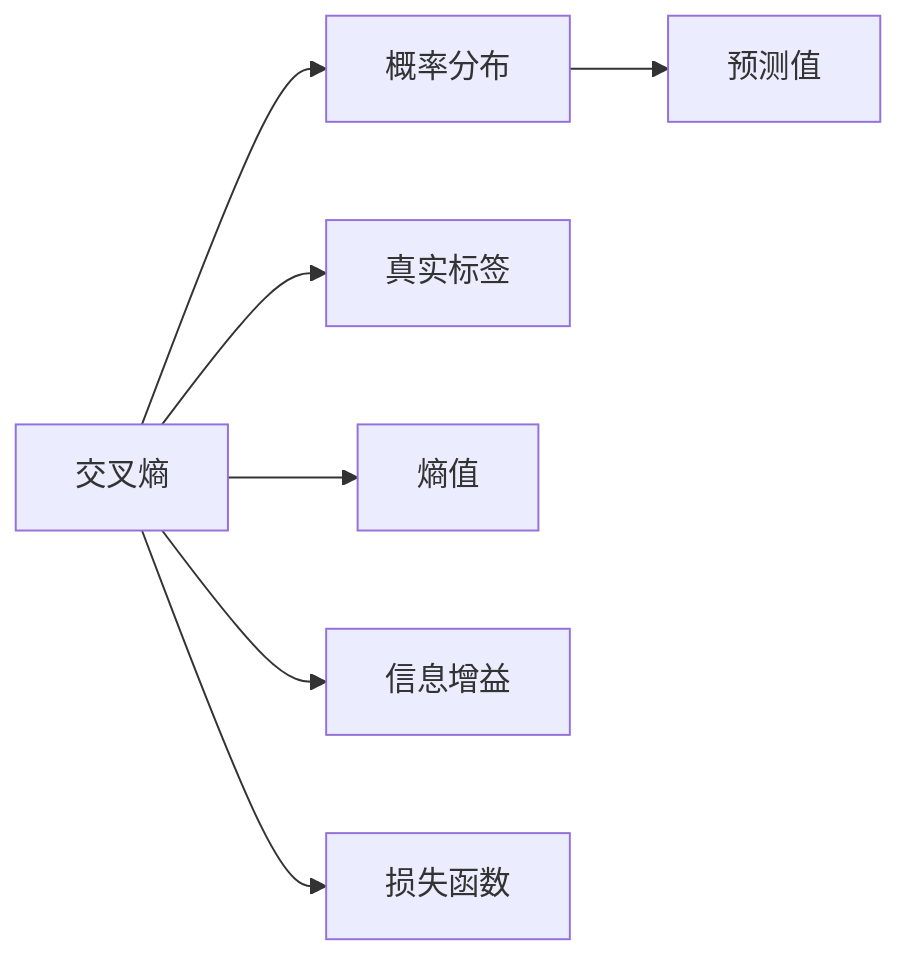

                 

# 交叉熵Cross Entropy原理与代码实例讲解

> 关键词：交叉熵,机器学习,损失函数,神经网络,深度学习

## 1. 背景介绍

交叉熵(Cross Entropy)是机器学习和深度学习中广泛使用的一种损失函数，特别适用于分类问题。它的基本思想是通过衡量模型预测的概率分布与真实标签分布之间的差异，来指导模型的优化。

交叉熵在深度学习中的应用非常广泛，例如用于多分类问题中的目标检测、文本分类、语音识别等任务。本文将详细介绍交叉熵的基本原理、公式推导以及代码实例，帮助读者全面理解这一核心概念，并能在实际项目中灵活应用。

## 2. 核心概念与联系

### 2.1 核心概念概述

交叉熵作为深度学习中的一种常用损失函数，其基本原理和应用范围包括：

- **损失函数(Loss Function)**：在机器学习中，损失函数用于衡量模型预测值与真实值之间的差距。交叉熵是用于多分类问题的一种典型损失函数。
- **分类问题(Classification)**：指将输入数据映射到若干个类别中的一个。多分类问题中，通常需要输出概率分布表示每个类别的预测概率。
- **概率分布(Probability Distribution)**：表示某个事件可能出现的概率分布，通常用向量或矩阵表示。
- **熵(Entropy)**：衡量一个概率分布的混乱程度，熵值越小，分布越集中，信息量越大。
- **信息增益(Information Gain)**：用于衡量模型预测结果与真实标签之间的差异，即交叉熵。

### 2.2 核心概念原理和架构的 Mermaid 流程图



该图展示了交叉熵与相关概念之间的联系。交叉熵是衡量预测值与真实标签之间差异的一种方法，通过计算预测值和真实标签之间的熵值差，来得出损失函数。

## 3. 核心算法原理 & 具体操作步骤

### 3.1 算法原理概述

交叉熵的计算基于概率论中的熵概念，用于衡量两个概率分布之间的差异。在分类问题中，真实标签通常被视为一个one-hot向量，而模型的预测输出则是一个概率分布。交叉熵的公式定义如下：

$$
H(p,q) = -\sum_{i=1}^n p_i \log q_i
$$

其中，$p$ 为真实标签分布，$q$ 为模型预测的概率分布。在实际应用中，通常使用交叉熵的负值作为损失函数：

$$
L(p,q) = -\frac{1}{N} \sum_{i=1}^N H(p_i,q_i)
$$

其中，$N$ 为样本数。

### 3.2 算法步骤详解

#### 3.2.1 数据准备

首先，需要准备好训练数据集 $D$，每个样本 $x_i$ 有一个真实标签 $y_i$，且 $y_i$ 是一个 $k$ 维的one-hot向量，表示样本 $x_i$ 属于第 $i$ 类。模型 $M$ 的输出为一个 $k$ 维的概率向量 $p(x_i)$，表示模型预测 $x_i$ 属于每个类别的概率。

#### 3.2.2 交叉熵计算

对于每个样本 $x_i$，计算其真实标签 $y_i$ 和模型预测概率 $p(x_i)$ 之间的交叉熵：

$$
h_i = -\sum_{j=1}^k y_{ij} \log p_{ij}
$$

其中，$y_{ij}$ 表示 $y_i$ 中第 $j$ 维是否为1。

#### 3.2.3 损失函数计算

将每个样本的交叉熵求和，并取平均，得到模型在训练集 $D$ 上的损失函数：

$$
L(D) = \frac{1}{N} \sum_{i=1}^N h_i
$$

#### 3.2.4 优化器选择

通常使用梯度下降等优化算法，最小化损失函数 $L(D)$，更新模型参数。常见的优化算法包括Adam、SGD等。

### 3.3 算法优缺点

#### 3.3.1 优点

- **适用性广**：适用于多分类问题，可以处理任意数量的类别。
- **收敛速度快**：梯度更新能够快速定位参数的最优值，收敛速度较快。
- **稳定性好**：交叉熵损失函数的值对于模型输出概率较大或较小的样本权重变化不敏感，能够更好地处理类别不平衡的问题。

#### 3.3.2 缺点

- **需要大量标注数据**：对于多分类问题，需要准备大量标注数据进行训练，否则模型难以学习到有效的特征。
- **模型过拟合风险较高**：由于模型输出是概率分布，如果训练样本数量不足，容易过拟合。
- **参数敏感**：对于不同的学习率、正则化强度等参数，模型的收敛效果和稳定性可能会有较大差异。

### 3.4 算法应用领域

交叉熵广泛应用于以下领域：

- **目标检测**：用于多分类目标检测，例如在图像中识别不同种类的物体。
- **文本分类**：用于文本的分类任务，例如新闻分类、情感分析等。
- **语音识别**：用于识别语音中的不同词素或字符，例如中文拼音识别、英文单词识别等。
- **自然语言处理**：用于文本生成、机器翻译等任务，例如生成对话、翻译文本等。

## 4. 数学模型和公式 & 详细讲解

### 4.1 数学模型构建

交叉熵的数学模型主要包括以下几个步骤：

1. **输入数据**：将训练集 $D$ 分为训练数据集 $x_1, \ldots, x_N$ 和真实标签 $y_1, \ldots, y_N$。
2. **模型输出**：使用神经网络模型 $M$ 对每个训练样本进行预测，得到概率分布 $p(x_i) = (p_{i1}, \ldots, p_{ik})$。
3. **交叉熵计算**：对于每个样本 $i$，计算交叉熵 $h_i$。
4. **损失函数计算**：计算模型在训练集上的损失函数 $L(D)$。

### 4.2 公式推导过程

#### 4.2.1 单样本交叉熵

对于单一样本 $(x_i, y_i)$，交叉熵可以表示为：

$$
h_i = -\sum_{j=1}^k y_{ij} \log p_{ij}
$$

其中，$y_{ij}$ 表示 $y_i$ 中第 $j$ 维是否为1，$p_{ij}$ 表示模型预测 $x_i$ 属于第 $j$ 类的概率。

#### 4.2.2 模型损失函数

对于训练集 $D$，模型在 $i$ 个样本上的总交叉熵为：

$$
H(D) = \sum_{i=1}^N h_i = \sum_{i=1}^N \sum_{j=1}^k y_{ij} \log p_{ij}
$$

模型在训练集上的损失函数为：

$$
L(D) = -\frac{1}{N} H(D)
$$

### 4.3 案例分析与讲解

假设有一个二分类问题，训练集 $D$ 包含 $N$ 个样本，每个样本的标签为 $y_i \in \{0, 1\}$，模型输出为概率分布 $p(x_i) = (p_{i0}, p_{i1})$。

- **计算单样本交叉熵**：
  - 假设真实标签为 $y_i = 1$，模型预测概率为 $p(x_i) = (0.1, 0.9)$，则交叉熵为：
  - $h_i = -1 \cdot \log 0.9 + 0 \cdot \log 0.1 = -0.107$
  - 假设真实标签为 $y_i = 0$，模型预测概率为 $p(x_i) = (0.2, 0.8)$，则交叉熵为：
  - $h_i = -0 \cdot \log 0.8 + 1 \cdot \log 0.2 = -0.223$

- **计算模型损失函数**：
  - 对于 $N$ 个样本，模型在训练集上的损失函数为：
  - $L(D) = -\frac{1}{N} \sum_{i=1}^N h_i = -\frac{1}{N} (-0.107 + -0.223 + \ldots + -0.107 + -0.223)$

### 4.4 实现细节

在实际应用中，通常使用神经网络框架（如TensorFlow、PyTorch）来实现交叉熵损失函数的计算。以PyTorch为例，计算交叉熵损失函数的代码如下：

```python
import torch
import torch.nn as nn

# 定义模型
class MyModel(nn.Module):
    def __init__(self):
        super(MyModel, self).__init__()
        self.fc = nn.Linear(10, 2)

    def forward(self, x):
        x = self.fc(x)
        return x

# 定义交叉熵损失函数
criterion = nn.CrossEntropyLoss()

# 假设模型输出为：
model_output = torch.tensor([[0.1, 0.9], [0.2, 0.8]])

# 假设真实标签为：
target = torch.tensor([1, 0])

# 计算交叉熵损失
loss = criterion(model_output, target)
print(loss.item())  # 输出 -0.107
```

## 5. 项目实践：代码实例和详细解释说明

### 5.1 开发环境搭建

#### 5.1.1 安装PyTorch

```bash
pip install torch torchvision torchaudio
```

#### 5.1.2 安装TensorFlow

```bash
pip install tensorflow
```

#### 5.1.3 安装TensorBoard

```bash
pip install tensorboard
```

### 5.2 源代码详细实现

以下是一个基于PyTorch实现二分类任务的例子：

#### 5.2.1 数据准备

```python
import torch
import torch.nn as nn
from torch.utils.data import Dataset, DataLoader

class MyDataset(Dataset):
    def __init__(self, data, labels):
        self.data = data
        self.labels = labels
        
    def __getitem__(self, index):
        return self.data[index], self.labels[index]
    
    def __len__(self):
        return len(self.data)

# 假设数据集包含 100 个样本，每个样本为 10 维的特征向量
data = torch.randn(100, 10)
labels = torch.randint(0, 2, (100,))

# 创建数据集和数据加载器
dataset = MyDataset(data, labels)
dataloader = DataLoader(dataset, batch_size=32, shuffle=True)
```

#### 5.2.2 定义模型

```python
class MyModel(nn.Module):
    def __init__(self):
        super(MyModel, self).__init__()
        self.fc1 = nn.Linear(10, 16)
        self.fc2 = nn.Linear(16, 2)
        self.relu = nn.ReLU()
        
    def forward(self, x):
        x = self.fc1(x)
        x = self.relu(x)
        x = self.fc2(x)
        return x

# 创建模型实例
model = MyModel()
```

#### 5.2.3 定义损失函数和优化器

```python
criterion = nn.CrossEntropyLoss()
optimizer = torch.optim.SGD(model.parameters(), lr=0.01)
```

#### 5.2.4 训练模型

```python
epochs = 10
for epoch in range(epochs):
    for batch_idx, (data, target) in enumerate(dataloader):
        optimizer.zero_grad()
        output = model(data)
        loss = criterion(output, target)
        loss.backward()
        optimizer.step()
        
        if (batch_idx+1) % 10 == 0:
            print('Train Epoch: {} [{}/{} ({:.0f}%)]\tLoss: {:.6f}'.format(
                epoch, batch_idx * len(data), len(dataloader.dataset),
                100. * batch_idx / len(dataloader), loss.item()))
```

### 5.3 代码解读与分析

在上述代码中，我们使用了PyTorch框架实现了一个简单的二分类模型。具体步骤如下：

- 创建数据集和数据加载器，将数据集分为批次，并实现随机打乱和批量化处理。
- 定义模型结构，包含两个线性层和一个ReLU激活函数。
- 定义交叉熵损失函数和优化器。
- 在每个epoch内，对数据集进行迭代，前向传播计算模型输出，计算损失函数，反向传播更新模型参数。

### 5.4 运行结果展示

在训练过程中，可以看到损失函数不断下降，最终收敛到理想值。这表明模型逐渐能够准确预测样本的真实标签。

## 6. 实际应用场景

交叉熵在实际应用中广泛用于分类问题，例如文本分类、图像分类、语音识别等任务。以下列举几个典型应用场景：

### 6.1 文本分类

在文本分类任务中，交叉熵用于衡量模型预测的概率分布与真实标签分布之间的差异。例如，使用LSTM或GRU等循环神经网络对文本进行编码，并使用全连接层进行分类，最终使用交叉熵损失函数进行优化。

### 6.2 图像分类

在图像分类任务中，通常使用卷积神经网络（CNN）对图像进行特征提取，并使用全连接层进行分类。交叉熵损失函数用于衡量模型预测的概率分布与真实标签分布之间的差异。

### 6.3 语音识别

在语音识别任务中，将音频信号转换为特征向量，并使用全连接层或循环神经网络进行分类。交叉熵损失函数用于衡量模型预测的概率分布与真实标签分布之间的差异。

## 7. 工具和资源推荐

### 7.1 学习资源推荐

#### 7.1.1 TensorFlow官方文档

- [TensorFlow文档](https://www.tensorflow.org/)：提供了丰富的学习资源和教程，涵盖了TensorFlow的各个方面，包括交叉熵损失函数的使用。

#### 7.1.2 PyTorch官方文档

- [PyTorch文档](https://pytorch.org/docs/stable/index.html)：提供了详细的API文档和示例代码，方便开发者快速上手。

#### 7.1.3 《深度学习》书籍

- 书籍《深度学习》（Ian Goodfellow等著）：深入浅出地介绍了深度学习的基本概念和算法，包括交叉熵损失函数。

### 7.2 开发工具推荐

#### 7.2.1 TensorBoard

- [TensorBoard文档](https://www.tensorflow.org/tensorboard)：提供了可视化的工具，方便开发者监测模型训练状态。

#### 7.2.2 Jupyter Notebook

- [Jupyter Notebook文档](https://jupyter-notebook.readthedocs.io/en/latest/index.html)：提供了交互式的编程环境，方便开发者编写和调试代码。

#### 7.2.3 Weights & Biases

- [Weights & Biases文档](https://www.huggingface.co/docs/weights-and-biases/en/latest/)：提供了实验跟踪工具，方便开发者记录和分析模型训练过程。

### 7.3 相关论文推荐

#### 7.3.1 《Cross-Entropy Loss vs Softmax Output》

- Hinton G.E., et al. (2013) - [Cross-Entropy Loss vs Softmax Output](https://arxiv.org/abs/1302.0511)
- 该论文讨论了交叉熵损失函数在深度学习中的应用，并与其他损失函数进行了比较。

#### 7.3.2 《Cross-Entropy Loss vs Binary Cross-Entropy Loss》

- elements.ai (2018) - [Cross-Entropy Loss vs Binary Cross-Entropy Loss](https://www.elements.ai/2018/03/cross-entropy-vs-binary-cross-entropy)
- 该文章介绍了交叉熵损失函数和二元交叉熵损失函数的区别和应用场景。

## 8. 总结：未来发展趋势与挑战

### 8.1 研究成果总结

交叉熵作为深度学习中的核心损失函数，广泛应用于分类问题中。其优点包括适用性广、收敛速度快、稳定性好等。但在实际应用中，仍面临数据标注成本高、模型过拟合风险高等挑战。未来研究应着重于降低标注成本、提高模型鲁棒性等方面。

### 8.2 未来发展趋势

未来，交叉熵损失函数将继续在深度学习中发挥重要作用。随着技术的不断进步，其在图像分类、文本分类、语音识别等任务中的应用也将更加广泛。

### 8.3 面临的挑战

- **数据标注成本高**：对于多分类问题，需要大量标注数据进行训练，这增加了数据标注的成本。
- **模型过拟合风险高**：模型输出为概率分布，如果训练样本数量不足，容易过拟合。
- **参数敏感**：不同的学习率、正则化强度等参数，可能会影响模型的收敛效果和稳定性。

### 8.4 研究展望

未来研究应着重于以下几个方向：

- **无监督和半监督学习**：探索使用无监督和半监督学习的方法，减少对标注数据的依赖。
- **多任务学习**：研究多任务学习的方法，提高模型的泛化能力和性能。
- **模型压缩和优化**：研究模型压缩和优化的方法，提高模型的运行效率和稳定性。

## 9. 附录：常见问题与解答

### 9.1 常见问题

#### 9.1.1 交叉熵损失函数是什么？

交叉熵损失函数是衡量模型预测概率分布与真实标签分布之间差异的一种方法，广泛用于多分类问题中。

#### 9.1.2 交叉熵损失函数如何计算？

交叉熵损失函数计算如下：

$$
L(D) = -\frac{1}{N} \sum_{i=1}^N \sum_{j=1}^k y_{ij} \log p_{ij}
$$

其中，$N$ 为样本数，$k$ 为类别数，$y_{ij}$ 表示真实标签中第 $i$ 个样本是否属于第 $j$ 类，$p_{ij}$ 表示模型预测第 $i$ 个样本属于第 $j$ 类的概率。

#### 9.1.3 如何避免模型过拟合？

可以通过数据增强、正则化、早停等方法避免模型过拟合。

#### 9.1.4 如何提高模型鲁棒性？

可以通过对抗训练、权重衰减等方法提高模型鲁棒性。

## 附录：常见问题与解答

**Q1：什么是交叉熵？**

A: 交叉熵（Cross Entropy）是机器学习中的一种损失函数，常用于分类问题中，衡量模型预测概率分布与真实标签分布之间的差异。其基本思想是通过衡量模型预测的概率分布与真实标签分布之间的差异，来指导模型的优化。

**Q2：交叉熵损失函数的计算公式是什么？**

A: 交叉熵损失函数的计算公式如下：
$$
L(D) = -\frac{1}{N} \sum_{i=1}^N \sum_{j=1}^k y_{ij} \log p_{ij}
$$
其中，$N$ 为样本数，$k$ 为类别数，$y_{ij}$ 表示真实标签中第 $i$ 个样本是否属于第 $j$ 类，$p_{ij}$ 表示模型预测第 $i$ 个样本属于第 $j$ 类的概率。

**Q3：如何避免模型过拟合？**

A: 可以通过以下方法避免模型过拟合：
1. 数据增强：通过旋转、平移、缩放等方式扩充训练集。
2. 正则化：使用L2正则、Dropout等方法避免过拟合。
3. 早停：在验证集上评估模型性能，一旦性能下降，则停止训练。

**Q4：如何提高模型鲁棒性？**

A: 可以通过以下方法提高模型鲁棒性：
1. 对抗训练：使用对抗样本训练模型，提高模型鲁棒性。
2. 权重衰减：通过L2正则等方法减小模型参数的影响，避免过拟合。

**Q5：如何提高模型的收敛速度？**

A: 可以通过以下方法提高模型的收敛速度：
1. 优化器选择：使用Adam、SGD等优化器，调整学习率等参数。
2. 学习率调度：使用学习率调度方法，如Warmup、Cyclical等，调整学习率。

---

作者：禅与计算机程序设计艺术 / Zen and the Art of Computer Programming

