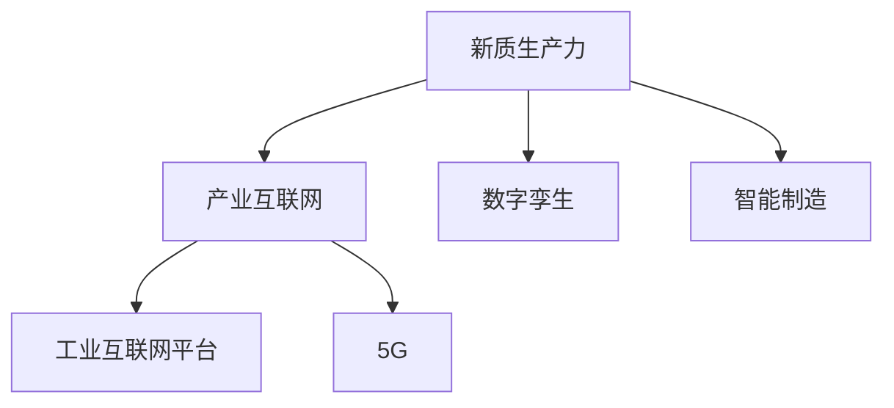

                 

# 产业转型升级与新质生产力

## 1. 背景介绍

### 1.1 问题由来

在数字化、网络化和智能化的浪潮推动下，产业结构正在经历深刻的转型升级。传统的工业化生产方式、业务流程和商业模式正在被新一代技术重构。无论是制造、零售、金融、医疗还是娱乐，各行各业都面临着技术升级、业务模式创新、客户需求变化等多重挑战。

然而，这些转型升级并非一帆风顺。许多企业在探索新质生产力的过程中，面临着数据孤岛、系统集成、资源调度、流程再造等复杂问题。如何提升企业的数字化能力、智能化水平和市场响应速度，以持续创造经济价值，成为了众多企业亟需解决的痛点。

### 1.2 问题核心关键点

面对产业转型升级的挑战，新质生产力的提出提供了一种全新的解决方案。新质生产力，是指通过数字化、网络化、智能化等新技术，重构产业流程、商业模式和组织结构，以实现更高效率、更优质量、更广应用的生产力形态。其核心在于“新质”二字，即利用新技术实现生产力的质的飞跃，而非量的增加。

新质生产力的实现，离不开三个核心要素：
- **数据要素**：数据的全面感知、实时采集、分析挖掘、应用实践，是提升新质生产力的基础。
- **技术要素**：云计算、大数据、物联网、人工智能等技术的深入应用，是新质生产力实现的驱动力。
- **组织要素**：跨部门、跨企业的协同合作，是新质生产力实现的重要保障。

### 1.3 问题研究意义

新质生产力的研究，对于推动产业结构优化升级、提升企业竞争力、实现经济社会高质量发展具有重要意义：

1. **推动产业升级**：通过新技术的应用，传统产业可以实现智能化转型，提升生产效率和产品质量，形成新的产业生态和竞争优势。
2. **提升企业竞争力**：数字化、智能化水平提升，可以帮助企业快速响应市场变化，提高资源利用率和客户满意度，实现成本降低和价值创造。
3. **促进经济高质量发展**：新质生产力的推动，可以带动整个产业链的协同发展，提升全要素生产率，推动经济从要素驱动向创新驱动转变。
4. **实现社会可持续发展**：新质生产力通过技术应用和模式创新，可以实现资源节约、环境友好、社会包容的可持续发展目标。

## 2. 核心概念与联系

### 2.1 核心概念概述

为了更好地理解新质生产力的实现机制，本节将介绍几个关键概念及其之间的联系：

- **新质生产力**：通过数字化、网络化、智能化等新技术，重构产业流程、商业模式和组织结构，实现更高效率、更优质量、更广应用的生产力形态。
- **产业互联网**：基于新一代信息通信技术和实体经济深度融合，推动工业、农业、服务业等实体经济产业的数字化转型升级。
- **数字孪生**：构建与实体世界高度一致的数字模型，实现虚拟与现实的深度融合，推动生产系统的智能化升级。
- **智能制造**：通过智能技术、智能系统、智能服务，实现制造业的自动化、信息化、网络化和智能化。
- **工业互联网平台**：提供通用能力和技术支撑，支持各类工业APP的开发和应用，实现工业资源的共享和优化。
- **5G**：新一代移动通信技术，提供更高的带宽、更低的时延、更大的连接数，支持工业互联网、智慧城市、智能交通等多领域的应用。

这些概念之间的关系可以通过以下Mermaid流程图来展示：



这个流程图展示了新质生产力的核心要素及其相互关系：

1. **新质生产力**：通过产业互联网、数字孪生、智能制造、工业互联网平台和5G等技术的深度融合，实现生产力的质的飞跃。
2. **产业互联网**：提供基础设施和技术支撑，促进实体经济的数字化转型。
3. **数字孪生**：实现实体世界的数字化仿真，推动生产系统的智能化升级。
4. **智能制造**：利用先进制造技术，提升制造过程的自动化和智能化水平。
5. **工业互联网平台**：提供通用能力和技术支撑，支持各类工业APP的开发和应用。
6. **5G**：提供新一代通信技术，支持工业互联网、智慧城市、智能交通等多领域的应用。

这些概念共同构成了新质生产力的技术框架，为其在各个行业的应用提供了坚实的支撑。

## 3. 核心算法原理 & 具体操作步骤

### 3.1 算法原理概述

新质生产力的实现，涉及到多个技术环节和业务流程，需要跨部门、跨企业的协同合作。其核心算法原理可以概括为“数据驱动、技术支撑、协同创新”。

**数据驱动**：通过全面感知、实时采集、分析挖掘、应用实践，实现数据的深度利用。数据成为驱动新质生产力发展的核心要素。

**技术支撑**：云计算、大数据、物联网、人工智能等技术的应用，为产业转型升级提供了强大的技术支撑。这些技术的应用，可以大幅提升生产效率、降低运营成本、优化资源配置。

**协同创新**：新质生产力的实现，需要跨部门、跨企业的协同合作。通过信息共享、数据融合、业务协同，实现整体产业链的优化升级。

### 3.2 算法步骤详解

新质生产力的实现，通常包括以下几个关键步骤：

**Step 1: 数据感知与采集**
- 构建全面感知系统，实现对生产环境的全面监控。例如，通过物联网设备采集生产设备的运行状态、能耗数据、质量指标等。
- 采用数据采集平台，实时收集企业内部和外部的各类数据，如供应链数据、销售数据、客户数据等。

**Step 2: 数据存储与治理**
- 建立数据仓库和数据湖，实现数据的集中管理和高效存储。
- 实施数据治理，包括数据标准化、质量管理、安全管理等，确保数据的一致性、完整性和可靠性。

**Step 3: 数据分析与挖掘**
- 应用大数据技术，对海量数据进行统计分析、趋势预测、模式挖掘等。例如，通过数据挖掘技术，发现客户行为规律、产品需求趋势等。
- 引入人工智能算法，如机器学习、深度学习、自然语言处理等，进行更深入的智能分析。

**Step 4: 数据应用与实践**
- 将分析结果应用到生产决策、营销策略、产品设计等各个环节。例如，通过数据分析优化生产计划、库存管理、物流调度和客户关系管理等。
- 开发智能应用系统，实现数据的实时监测、可视化和自动化处理。

**Step 5: 技术集成与协同创新**
- 利用云计算、工业互联网、数字孪生等技术，实现跨部门、跨企业的协同工作。例如，通过工业互联网平台，实现设备互联、数据共享、服务协同。
- 引入AI助手、RPA（机器人流程自动化）等技术，提高工作效率和质量。

### 3.3 算法优缺点

新质生产力的实现，具有以下优点：

1. **效率提升**：通过数据驱动和智能技术的应用，实现生产流程的自动化和智能化，大幅提升生产效率和运营效率。
2. **成本降低**：数据驱动的决策支持、智能技术的优化管理，有助于降低资源浪费和运营成本。
3. **质量提升**：通过数据分析和智能检测，提高产品质量和一致性，满足客户高标准需求。
4. **创新加速**：数据驱动的创新模式，快速响应市场变化，加速产品迭代和新业务模式的探索。

同时，新质生产力的实现也面临一些挑战：

1. **数据孤岛**：企业内部和外部的数据资源分散，难以实现有效整合和共享。
2. **技术复杂**：涉及多种新兴技术的集成应用，技术门槛较高，需要跨学科的团队合作。
3. **协同难度**：跨部门、跨企业的协同合作，存在沟通障碍和利益冲突。
4. **数据安全**：海量数据的采集、存储和处理，面临数据安全和隐私保护的风险。
5. **人才短缺**：新技术的普及需要高水平的技术人才，当前技术人才供给不足。

### 3.4 算法应用领域

新质生产力的实现，已经在多个行业领域得到了广泛应用，例如：

- **制造业**：智能制造、数字孪生、工业互联网平台，推动制造业的自动化、信息化、网络化和智能化。
- **零售业**：通过数据分析、智能推荐、智慧物流等技术，提升客户体验和运营效率。
- **金融业**：利用大数据、人工智能、区块链等技术，提升金融服务的智能化水平。
- **医疗健康**：通过智能诊断、远程医疗、智慧医院等技术，提升医疗服务的精准度和可及性。
- **教育**：利用在线教育、智能学习、AI教师等技术，提升教育质量和学习效果。

这些行业领域的成功实践，展示了新质生产力的广泛适用性和巨大潜力。

## 4. 数学模型和公式 & 详细讲解 & 举例说明

### 4.1 数学模型构建

新质生产力的实现，涉及到大量的数学模型和算法。以下我们将详细介绍其中几个关键模型及其构建过程。

**1. 预测模型**
- **线性回归模型**：用于预测连续变量的值，例如，预测生产设备的能耗、故障率等。
  - 数学模型：$\hat{y} = \beta_0 + \beta_1 x_1 + \ldots + \beta_n x_n$
  - 公式推导：最小二乘法求解$\beta_1, \ldots, \beta_n$
- **逻辑回归模型**：用于分类问题，例如，预测产品是否合格、客户是否流失等。
  - 数学模型：$\log \frac{p}{1-p} = \beta_0 + \beta_1 x_1 + \ldots + \beta_n x_n$
  - 公式推导：使用梯度下降法求解$\beta_1, \ldots, \beta_n$

**2. 聚类模型**
- **K-means聚类**：将数据划分为K个簇，每个簇内部数据点距离簇中心最近。
  - 数学模型：$\min_{C, \mu} \sum_{i=1}^n ||x_i - \mu_k||^2$
  - 公式推导：使用迭代优化算法求解最优的簇中心$\mu_k$和簇划分$C$

**3. 关联规则模型**
- **Apriori算法**：用于挖掘数据中的关联规则，例如，挖掘商品销售中的关联购买模式。
  - 数学模型：$频繁项集 = \{T_1, T_2, \ldots, T_k\}$
  - 公式推导：基于支持度和置信度的迭代算法求解

**4. 异常检测模型**
- **孤立森林算法**：用于检测数据中的异常点，例如，检测生产过程中的异常设备。
  - 数学模型：$Y = \prod_{i=1}^n \frac{x_i}{\sum_{x_j}p(x_j|x_i)}$
  - 公式推导：基于树结构划分和概率估计的迭代算法求解

**5. 时间序列模型**
- **ARIMA模型**：用于预测时间序列数据，例如，预测生产设备的维护周期。
  - 数学模型：$Y_t = \phi(B) Y_{t-1} + \theta(B) \epsilon_t$
  - 公式推导：基于差分自回归移动平均模型的迭代求解

### 4.2 公式推导过程

以线性回归模型为例，介绍其公式推导过程。

设训练数据集为$D = \{(x_i, y_i)\}_{i=1}^n$，其中$x_i$为自变量向量，$y_i$为因变量。目标构建线性回归模型$\hat{y} = \theta^T x_i$，其中$\theta = (\theta_0, \theta_1, \ldots, \theta_n)^T$为模型参数。

根据最小二乘法，求解最优的$\theta$，使得预测值$\hat{y}$与真实值$y$的误差最小。最小二乘法的目标函数为：

$$
\sum_{i=1}^n (\hat{y}_i - y_i)^2
$$

其中$\hat{y}_i = \theta^T x_i$，$\epsilon_i = y_i - \hat{y}_i$为误差项。

对目标函数求导并令导数为0，得到：

$$
\frac{\partial}{\partial \theta} \sum_{i=1}^n (\hat{y}_i - y_i)^2 = 0
$$

整理后得到：

$$
\sum_{i=1}^n x_i (y_i - \hat{y}_i) = 0
$$

将$\hat{y}_i = \theta^T x_i$代入，得到：

$$
\sum_{i=1}^n x_i x_i^T \theta - \sum_{i=1}^n x_i y_i = 0
$$

进一步整理得到：

$$
\theta = (\sum_{i=1}^n x_i x_i^T)^{-1} \sum_{i=1}^n x_i y_i
$$

这就是线性回归模型的参数求解公式。

### 4.3 案例分析与讲解

以某制造业企业的生产能耗预测为例，分析线性回归模型的应用。

假设企业有多个生产设备，需要预测每个设备的能耗情况。设设备$i$的能耗为$y_i$，影响能耗的因素包括设备类型、工作状态、环境温度等，设设备类型$x_{i1}$、工作状态$x_{i2}$、环境温度$x_{i3}$。

构建线性回归模型$\hat{y}_i = \theta_0 + \theta_1 x_{i1} + \theta_2 x_{i2} + \theta_3 x_{i3} + \epsilon_i$，其中$\epsilon_i$为误差项。

根据实际数据，求解模型参数$\theta_0, \theta_1, \theta_2, \theta_3$，得到最优的线性回归模型。模型训练完成后，可以用于预测新设备的能耗情况，优化生产调度，降低能源消耗。

## 5. 项目实践：代码实例和详细解释说明

### 5.1 开发环境搭建

在进行新质生产力相关的项目实践时，需要先搭建好开发环境。以下是使用Python进行Pandas和Scikit-learn开发的Python环境配置流程：

1. 安装Anaconda：从官网下载并安装Anaconda，用于创建独立的Python环境。
   ```bash
   conda create -n pyenv python=3.8
   conda activate pyenv
   ```

2. 安装Pandas：
   ```bash
   conda install pandas
   ```

3. 安装Scikit-learn：
   ```bash
   conda install scikit-learn
   ```

4. 安装必要的库：
   ```bash
   conda install matplotlib jupyter notebook
   ```

完成上述步骤后，即可在`pyenv`环境中开始新质生产力的项目实践。

### 5.2 源代码详细实现

以下是使用Pandas和Scikit-learn实现线性回归模型的Python代码：

```python
import pandas as pd
from sklearn.linear_model import LinearRegression

# 读取数据
data = pd.read_csv('data.csv')

# 分割训练集和测试集
train_data = data[data['split'] == 0]
test_data = data[data['split'] == 1]

# 提取特征和标签
X_train = train_data.drop(columns=['split', 'y'])
y_train = train_data['y']
X_test = test_data.drop(columns=['split', 'y'])
y_test = test_data['y']

# 构建线性回归模型
model = LinearRegression()
model.fit(X_train, y_train)

# 预测测试集
y_pred = model.predict(X_test)

# 计算评估指标
print('Mean Squared Error:', y_pred - y_test).mean()
print('R-squared:', model.score(X_test, y_test))
```

### 5.3 代码解读与分析

让我们再详细解读一下关键代码的实现细节：

**数据读取**：
- 使用Pandas库读取CSV格式的数据文件，并按`split`列进行分割，将数据分为训练集和测试集。

**模型训练**：
- 使用Scikit-learn库的`LinearRegression`类，构建线性回归模型。
- 对训练集进行模型训练，通过`fit`方法拟合模型参数。

**预测与评估**：
- 使用训练好的模型对测试集进行预测。
- 计算预测结果与真实结果的均方误差和决定系数（R-squared），评估模型性能。

## 6. 实际应用场景

### 6.1 智能制造

在新质生产力中，智能制造是实现产业升级的重要环节。通过数字化、网络化和智能化技术的应用，智能制造可以实现生产流程的自动化、信息化和网络化，大幅提升生产效率和产品质量。

以某制造业企业的生产设备预测与维护为例：

1. **数据采集**：通过物联网设备采集生产设备的运行状态、能耗数据、质量指标等。
2. **数据分析**：利用机器学习算法，分析设备运行数据，预测设备故障、能耗等指标。
3. **模型应用**：根据预测结果，调整生产计划、库存管理和设备维护策略，提升生产效率和产品质量。
4. **协同创新**：通过工业互联网平台，实现设备互联、数据共享、服务协同，提高整体生产系统的智能化水平。

### 6.2 零售业

在新质生产力中，零售业通过大数据、人工智能和区块链技术的应用，可以实现客户需求精准预测、库存管理优化、供应链协同等。

以某零售企业的需求预测和库存管理为例：

1. **数据采集**：通过POS系统、社交媒体、物流系统等采集客户消费数据、供应链数据、市场数据等。
2. **数据分析**：利用大数据和机器学习算法，分析客户消费行为、市场趋势，预测需求变化。
3. **模型应用**：根据预测结果，优化库存管理、物流调度和价格策略，提升客户满意度和经济效益。
4. **协同创新**：通过区块链技术，实现供应链数据的透明化、可追溯，提升供应链协同效率和信息安全性。

### 6.3 金融业

在新质生产力中，金融业通过大数据、人工智能和区块链技术的应用，可以实现风险控制、欺诈检测、智能投顾等。

以某金融企业的风险控制和欺诈检测为例：

1. **数据采集**：通过各种金融数据接口采集客户交易数据、信用数据、社交数据等。
2. **数据分析**：利用机器学习算法，分析交易行为、信用记录，识别风险和欺诈行为。
3. **模型应用**：根据风险评估结果，调整信贷政策、保险策略，降低风险和欺诈损失。
4. **协同创新**：通过区块链技术，实现交易数据透明化、去中心化，提升金融服务的可信度和安全性。

### 6.4 医疗健康

在新质生产力中，医疗健康通过智能诊断、远程医疗、智慧医院等技术的应用，可以实现医疗服务的高效化、精准化和个性化。

以某医院的患者诊断和治疗方案为例：

1. **数据采集**：通过电子病历、医疗影像、基因数据等采集患者的医疗信息。
2. **数据分析**：利用机器学习算法，分析患者医疗信息，预测疾病风险、制定治疗方案。
3. **模型应用**：根据分析结果，提供精准诊疗服务，提升医疗服务质量。
4. **协同创新**：通过智能诊断平台，实现医生与患者、医生与医生之间的协同工作，提高诊疗效率和准确性。

## 7. 工具和资源推荐

### 7.1 学习资源推荐

为了帮助开发者系统掌握新质生产力的理论基础和实践技巧，这里推荐一些优质的学习资源：

1. 《新质生产力：数字时代的产业转型升级》：介绍新质生产力的概念、原理和应用案例，系统阐述新质生产力实现的全过程。
2. 《机器学习实战》：通过大量实际案例，详细讲解机器学习算法的实现方法和应用场景，帮助开发者快速上手。
3. 《Python数据分析实战》：介绍Python在数据分析中的应用，包括Pandas、NumPy、Scikit-learn等库的使用，提供数据分析项目的完整案例。
4. 《区块链技术与应用》：介绍区块链的基本原理、应用场景和实现方法，提供区块链项目的实战案例。
5. 《工业互联网平台实战》：介绍工业互联网平台的概念、架构和应用案例，提供工业互联网平台的开发和部署指南。
6. 《5G技术与应用》：介绍5G的基本原理、关键技术和应用场景，提供5G项目的开发和部署指南。

通过对这些资源的学习实践，相信你一定能够快速掌握新质生产力的精髓，并用于解决实际的产业问题。

### 7.2 开发工具推荐

高效的开发离不开优秀的工具支持。以下是几款用于新质生产力开发的常用工具：

1. Jupyter Notebook：交互式的Python开发环境，支持代码、数据分析和文档的混合编辑，适合进行模型开发和调试。
2. Matplotlib：用于绘制图表和数据可视化，支持多种图表类型和样式。
3. Seaborn：基于Matplotlib的高级数据可视化库，支持统计图表和复杂图表的绘制。
4. Pandas：用于数据处理和分析，支持数据的导入、清洗、转换和分析，适合进行大规模数据处理。
5. Scikit-learn：用于机器学习和数据挖掘，提供丰富的算法库和模型评估工具，适合进行数据分析和建模。
6. TensorFlow和PyTorch：用于深度学习和人工智能，提供强大的计算图和模型库，适合进行深度学习模型的开发和训练。
7. Hadoop和Spark：用于大数据处理和分析，提供分布式计算和数据存储能力，适合进行大规模数据处理和分析。

合理利用这些工具，可以显著提升新质生产力的开发效率，加快创新迭代的步伐。

### 7.3 相关论文推荐

新质生产力的研究源于学界的持续研究。以下是几篇奠基性的相关论文，推荐阅读：

1. 《智能制造：工业互联网下的新质生产力》：介绍智能制造的概念、实现方法和应用案例，推动制造业的数字化和智能化转型。
2. 《新质生产力：产业互联网下的智能零售》：介绍新质生产力在零售业的应用，利用大数据和人工智能技术，提升客户体验和运营效率。
3. 《区块链技术在新质生产力中的应用》：介绍区块链的基本原理和应用场景，在新质生产力的数据治理、供应链协同等方面发挥重要作用。
4. 《工业互联网平台：新质生产力的基础设施》：介绍工业互联网平台的概念、架构和应用案例，推动工业资源的高效利用和协同创新。
5. 《5G技术在新质生产力中的应用》：介绍5G的基本原理和关键技术，在新质生产力的智能制造、智慧城市等领域发挥重要作用。

这些论文代表了大规模新质生产力的发展脉络。通过学习这些前沿成果，可以帮助研究者把握学科前进方向，激发更多的创新灵感。

## 8. 总结：未来发展趋势与挑战

### 8.1 总结

本文对新质生产力的实现机制进行了全面系统的介绍。首先阐述了新质生产力的概念和核心要素，明确了其在产业转型升级中的重要价值。其次，从原理到实践，详细讲解了新质生产力的数学模型和算法原理，提供了多个实际应用案例。同时，本文还推荐了大量的学习资源、开发工具和相关论文，为读者提供了全面的技术指引。

通过本文的系统梳理，可以看到，新质生产力的实现，需要跨部门、跨企业的协同合作，依托于多种新兴技术的深度融合。只有全面提升数字化能力、智能化水平和协同创新能力，才能实现生产力的质的飞跃，推动产业的高质量发展。

### 8.2 未来发展趋势

展望未来，新质生产力的实现，将呈现以下几个发展趋势：

1. **数据驱动**：数据将成为新质生产力的核心驱动要素，数据治理、数据安全和数据共享将成为重要研究方向。
2. **技术创新**：云计算、大数据、物联网、人工智能等技术的不断创新和融合，将推动新质生产力的持续升级和应用。
3. **协同创新**：跨部门、跨企业的协同合作，将提升整体产业链的优化升级，实现更高效的资源配置和价值创造。
4. **智能应用**：智能制造、智能物流、智能金融、智能医疗等领域的智能应用，将推动新质生产力的广泛应用和深化发展。
5. **隐私保护**：数据隐私和安全将成为新质生产力实现的重要保障，隐私保护技术和监管机制将成为关键研究课题。

这些趋势凸显了新质生产力的广阔前景，展示了其在各行业的应用潜力。

### 8.3 面临的挑战

尽管新质生产力的实现前景光明，但在迈向更加智能化、普适化应用的过程中，它仍面临着诸多挑战：

1. **技术复杂性**：新质生产力的实现需要跨学科的团队合作，技术门槛较高，开发难度较大。
2. **数据孤岛**：企业内部和外部的数据资源分散，难以实现有效整合和共享。
3. **协同难度**：跨部门、跨企业的协同合作，存在沟通障碍和利益冲突。
4. **数据安全**：海量数据的采集、存储和处理，面临数据安全和隐私保护的风险。
5. **人才短缺**：新技术的普及需要高水平的技术人才，当前技术人才供给不足。

### 8.4 研究展望

面对新质生产力的挑战，未来的研究需要在以下几个方面寻求新的突破：

1. **数据融合与共享**：通过数据治理、数据标准化、数据联邦等技术，实现跨部门、跨企业的数据融合与共享。
2. **智能协同**：利用人工智能技术，实现智能决策、智能调度、智能协同，提升整体系统的智能化水平。
3. **技术创新**：开发新型智能算法、智能模型和智能系统，提升新质生产力的实现效果和应用范围。
4. **隐私保护**：研究和引入隐私保护技术，如差分隐私、联邦学习、多方安全计算等，保障数据安全和隐私保护。
5. **生态构建**：构建新质生产力的生态系统，促进技术、应用、市场、政策等多方面的协同创新。

这些研究方向将为新质生产力的实现提供坚实的理论基础和技术支撑，推动新质生产力的持续发展和应用推广。

## 9. 附录：常见问题与解答

**Q1：新质生产力的实现是否需要大量的数据支持？**

A: 新质生产力的实现，数据确实非常重要。全面感知、实时采集、分析挖掘、应用实践，是实现新质生产力的核心要素之一。但并不需要海量数据，关键在于数据的全面性和多样性，以及数据治理和数据质量。可以通过数据增强、数据清洗、数据融合等技术手段，提升数据的价值和应用效果。

**Q2：新质生产力的技术实现是否复杂？**

A: 新质生产力的技术实现确实具有一定的复杂性，涉及多种新兴技术的集成应用。但只要明确技术路径、构建合理的技术栈，通过团队合作和持续优化，是可以逐步实现新质生产力的。技术复杂性并不是难以逾越的障碍，关键在于目标明确、循序渐进。

**Q3：新质生产力的实现是否需要大规模投入？**

A: 新质生产力的实现，确实需要一定的投入，包括技术研发、设备采购、人力资源等。但随着技术的不断成熟和市场的应用推广，投入成本将逐步降低。同时，新质生产力的实施，将带来显著的效率提升和成本降低，具有较高的投资回报率。

**Q4：新质生产力的实现是否存在数据隐私和安全风险？**

A: 新质生产力的实现，确实面临数据隐私和安全风险。需要采取多层次的安全防护措施，如数据加密、访问控制、审计监控等，保障数据安全和隐私保护。同时，也需要引入隐私保护技术，如差分隐私、联邦学习、多方安全计算等，降低数据泄露和滥用的风险。

**Q5：新质生产力的实现是否需要跨部门、跨企业的协同合作？**

A: 新质生产力的实现，确实需要跨部门、跨企业的协同合作，实现数据共享、技术协同和业务协同。需要建立跨组织的管理机制和技术架构，确保协同工作的顺利进行。但只要明确目标、制定规则、加强沟通，跨部门、跨企业的协同合作是可以实现的，将大幅提升新质生产力的实施效果和应用范围。

---

作者：禅与计算机程序设计艺术 / Zen and the Art of Computer Programming

