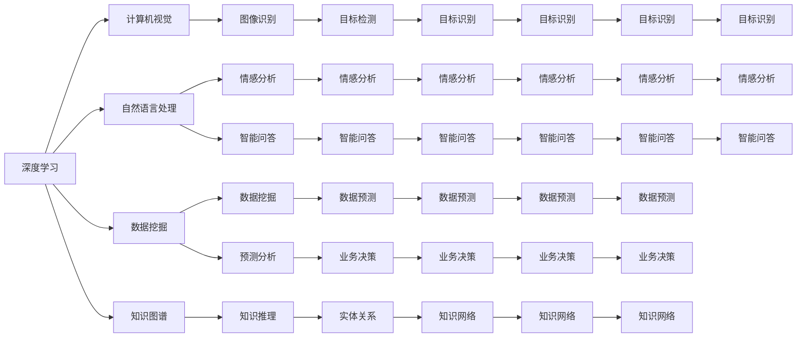

                 

# 人工智能与大数据的未来发展和应用

> 关键词：人工智能,大数据,深度学习,机器学习,深度神经网络,计算机视觉,自然语言处理,数据挖掘,隐私保护,工业应用

## 1. 背景介绍

### 1.1 问题由来

随着数字经济时代的到来，人工智能(AI)和大数据(Big Data)已经成为推动社会进步和经济发展的两大核心动力。在过去几十年里，AI和大数据技术的迅猛发展，深刻改变了我们的生产、生活、社交等各个方面。然而，当前AI和大数据技术还处于初级发展阶段，面临着诸多挑战和瓶颈，急需进一步突破和应用。

AI和大数据技术的突破主要集中在深度学习(DL)和机器学习(ML)等核心领域，其中深度神经网络(DNN)是实现这一突破的关键技术。DNN通过多层次、多维度的神经元结构，从海量数据中学习到高度抽象的特征表示，可以用于图像、语音、自然语言处理(NLP)、推荐系统等多个领域。

在深度神经网络的基础上，人们又发展了诸如计算机视觉(CV)、自然语言处理(NLP)、知识图谱(KG)、数据挖掘(DM)等一系列技术，通过融合多源异构数据，挖掘出有价值的信息，辅助人类决策，提升生产效率。

当前，AI和大数据技术已经在金融、医疗、制造、交通、教育、农业等众多领域得到了广泛应用。然而，尽管这些技术在各个行业产生了巨大的经济效益，但普遍存在数据孤岛、数据质量差、数据隐私保护等问题，制约了技术的进一步普及和应用。

### 1.2 问题核心关键点

当前AI和大数据技术发展中存在以下几个核心问题：

1. 数据质量与数据孤岛：由于数据标准不统一，数据质量参差不齐，不同数据源之间难以整合，导致数据孤岛现象普遍存在。数据孤岛不仅增加了数据整合成本，还限制了数据应用范围。

2. 数据隐私与数据安全：在数据采集、存储、传输和处理过程中，如何保障数据隐私和安全是一个重要问题。数据泄露、隐私滥用等风险不仅威胁到用户隐私，还可能导致严重的社会问题。

3. 模型泛化与模型鲁棒性：现有的深度神经网络模型普遍存在过拟合现象，无法很好地适应真实世界中的复杂场景。如何在保证模型泛化的同时，提高模型的鲁棒性和泛化能力，仍然是一个难题。

4. 计算资源与模型效率：深度神经网络模型需要大量的计算资源进行训练和推理，且模型庞大、复杂，推理速度较慢。如何在保证模型精度和性能的同时，提高计算效率，优化模型结构，仍需更多的技术创新。

5. 知识表示与因果推理：当前的AI模型普遍缺乏对因果关系的理解，无法将先验知识与数据模型结合，导致模型缺乏可信度和可解释性。如何建立更加全面的知识表示体系，引导模型进行因果推理，是一个亟待解决的问题。

6. 模型可解释性与透明度：深度神经网络模型通常被视为"黑盒"，难以解释其内部工作机制和决策逻辑。这对于医疗、金融、司法等高风险领域尤为重要。如何赋予模型更高的可解释性，是实现AI模型透明度的关键。

7. 伦理道德与社会影响：AI和大数据技术在推动社会发展的同时，也可能带来负面的社会影响，如就业替代、数据歧视、隐私侵犯等问题。如何在技术发展中考虑伦理道德约束，实现可持续发展，是技术应用的重要指导原则。

### 1.3 问题研究意义

AI和大数据技术的不断发展，有望推动人类社会进入全新的智能化时代，为各行各业带来颠覆性的变革。因此，深入研究和解决上述问题，对于推动AI和大数据技术的普及应用，具有重要的意义。

1. 提升数据整合能力：通过数据清洗、标准化和联邦学习等技术，实现不同数据源之间的互联互通，打破数据孤岛，提升数据应用范围和效率。

2. 保障数据隐私与安全：通过隐私计算、差分隐私等技术，保护数据隐私，防止数据滥用和泄露，保障用户隐私权益。

3. 提高模型泛化能力：通过迁移学习、生成对抗网络(GAN)等技术，提升模型泛化能力，使其适应真实世界中的复杂场景。

4. 优化模型效率与结构：通过知识蒸馏、剪枝等技术，优化模型结构，降低计算资源消耗，提升模型推理速度，实现高效部署。

5. 增强模型可解释性与透明度：通过可解释性AI、因果推理等技术，赋予模型更高的可解释性，增强模型的可信度和透明度，提升AI技术的实际应用效果。

6. 考虑伦理道德与社会影响：通过建立伦理指导原则、社会责任框架等，引导AI和大数据技术的健康发展，防止技术滥用，保障社会公平。

## 2. 核心概念与联系

### 2.1 核心概念概述

为更好地理解AI和大数据技术的未来发展和应用，本节将介绍几个密切相关的核心概念：

- 深度学习(DL)：基于深度神经网络(DNN)的机器学习方法，通过多层次、多维度的神经元结构，从海量数据中学习到高度抽象的特征表示，可以用于图像、语音、NLP等多个领域。

- 机器学习(ML)：通过数据训练模型，使其具备学习能力，能够自动对新数据进行预测和分类，是AI的核心技术之一。

- 计算机视觉(CV)：利用计算机视觉技术，使计算机能够"看懂"图像和视频内容，进行目标检测、图像识别、视频分析等。

- 自然语言处理(NLP)：利用计算机对自然语言进行理解和处理，实现机器翻译、情感分析、智能问答等任务。

- 数据挖掘(DM)：利用数据挖掘技术，从海量数据中发现潜在的模式和规律，辅助人类决策，提升数据价值。

- 隐私计算(PC)：通过加密、差分隐私等技术，保护数据隐私和安全，防止数据泄露和滥用。

- 知识图谱(KG)：利用图结构，表示实体与实体之间的关系，构建知识网络，辅助人类理解和应用知识。

这些核心概念之间存在着紧密的联系，通过融合和应用，可以实现更加全面和强大的AI和大数据技术。

### 2.2 核心概念原理和架构的 Mermaid 流程图



这个Mermaid流程图展示了各个核心概念之间的联系，通过融合计算机视觉、自然语言处理、数据挖掘、知识图谱等技术，可以实现更加全面和强大的AI和大数据技术。

## 3. 核心算法原理 & 具体操作步骤

### 3.1 算法原理概述

AI和大数据技术的核心算法主要包括深度学习、机器学习、计算机视觉、自然语言处理、数据挖掘、隐私计算、知识图谱等。以下我们将对其中几个关键算法进行详细介绍。

- 深度学习：基于深度神经网络，通过多层次、多维度的神经元结构，从海量数据中学习到高度抽象的特征表示，可以用于图像、语音、NLP等多个领域。

- 机器学习：通过数据训练模型，使其具备学习能力，能够自动对新数据进行预测和分类，是AI的核心技术之一。

- 计算机视觉：利用计算机视觉技术，使计算机能够"看懂"图像和视频内容，进行目标检测、图像识别、视频分析等。

- 自然语言处理：利用计算机对自然语言进行理解和处理，实现机器翻译、情感分析、智能问答等任务。

- 数据挖掘：利用数据挖掘技术，从海量数据中发现潜在的模式和规律，辅助人类决策，提升数据价值。

- 隐私计算：通过加密、差分隐私等技术，保护数据隐私和安全，防止数据泄露和滥用。

- 知识图谱：利用图结构，表示实体与实体之间的关系，构建知识网络，辅助人类理解和应用知识。

### 3.2 算法步骤详解

以下我们将对深度学习、计算机视觉、自然语言处理等几个关键算法的具体实现步骤进行详细介绍。

#### 3.2.1 深度学习算法步骤

1. 数据准备：获取并预处理训练数据，包括数据清洗、标准化、划分训练集和验证集等。

2. 模型设计：根据任务需求，选择合适的深度神经网络结构，设计合适的损失函数和优化器。

3. 模型训练：使用训练数据对模型进行迭代训练，不断优化模型参数。

4. 模型评估：使用验证集对模型进行评估，选择最优模型进行后续应用。

5. 模型应用：将模型应用于实际场景中，进行预测和分类等任务。

#### 3.2.2 计算机视觉算法步骤

1. 数据准备：获取并预处理图像和视频数据，包括数据清洗、标注、划分训练集和验证集等。

2. 模型设计：选择合适的计算机视觉模型结构，如卷积神经网络(CNN)、循环神经网络(RNN)等，设计合适的损失函数和优化器。

3. 模型训练：使用训练数据对模型进行迭代训练，不断优化模型参数。

4. 模型评估：使用验证集对模型进行评估，选择最优模型进行后续应用。

5. 模型应用：将模型应用于实际场景中，进行目标检测、图像识别、视频分析等任务。

#### 3.2.3 自然语言处理算法步骤

1. 数据准备：获取并预处理文本数据，包括数据清洗、标准化、划分训练集和验证集等。

2. 模型设计：选择合适的自然语言处理模型结构，如循环神经网络(RNN)、长短时记忆网络(LSTM)、变换器(Transformer)等，设计合适的损失函数和优化器。

3. 模型训练：使用训练数据对模型进行迭代训练，不断优化模型参数。

4. 模型评估：使用验证集对模型进行评估，选择最优模型进行后续应用。

5. 模型应用：将模型应用于实际场景中，进行情感分析、智能问答、机器翻译等任务。

### 3.3 算法优缺点

AI和大数据技术的核心算法各具优缺点，以下对其中几个关键算法进行详细介绍。

#### 3.3.1 深度学习算法优缺点

深度学习算法具有以下优点：

1. 强大的特征表示能力：通过多层次、多维度的神经元结构，可以学习到高度抽象的特征表示。

2. 广泛应用于多个领域：在图像、语音、NLP等领域得到了广泛应用，取得了显著效果。

3. 数据驱动的学习方式：通过数据驱动的方式，能够自动优化模型参数，适应复杂场景。

深度学习算法也存在以下缺点：

1. 数据质量要求高：需要大量高质量的数据进行训练，否则容易产生过拟合现象。

2. 计算资源消耗大：深度神经网络模型通常非常庞大、复杂，需要大量的计算资源进行训练和推理。

3. 模型可解释性差：深度神经网络模型通常被视为"黑盒"，难以解释其内部工作机制和决策逻辑。

#### 3.3.2 计算机视觉算法优缺点

计算机视觉算法具有以下优点：

1. 强大的图像处理能力：能够对图像进行目标检测、图像识别、视频分析等任务。

2. 广泛的应用场景：在自动驾驶、安防监控、医疗影像等领域得到了广泛应用。

3. 高精度的图像识别能力：在人脸识别、物体检测等任务中，取得了显著效果。

计算机视觉算法也存在以下缺点：

1. 数据标注成本高：需要大量标注数据进行训练，标注成本较高。

2. 鲁棒性不足：对于图像中的噪声、遮挡等干扰，容易产生误识别现象。

3. 实时性要求高：在实时性要求较高的场景中，计算速度较慢，难以满足实时性要求。

#### 3.3.3 自然语言处理算法优缺点

自然语言处理算法具有以下优点：

1. 强大的文本处理能力：能够对文本进行情感分析、智能问答、机器翻译等任务。

2. 广泛应用于多个领域：在智能客服、智能推荐、情感分析等领域得到了广泛应用。

3. 高效的文本处理速度：在大规模文本处理中，速度较快，效率较高。

自然语言处理算法也存在以下缺点：

1. 数据质量要求高：需要大量高质量的文本数据进行训练，否则容易产生过拟合现象。

2. 语言理解能力有限：对于复杂的语义理解和推理，效果不佳。

3. 依赖先验知识：需要依赖先验知识，缺乏对因果关系的理解。

### 3.4 算法应用领域

AI和大数据技术的核心算法已经广泛应用于各个领域，以下对其中几个关键领域进行详细介绍。

#### 3.4.1 金融领域

在金融领域，AI和大数据技术已经应用于风险管理、智能投顾、信用评分等多个方面。利用深度学习算法，可以分析市场趋势、识别风险点，进行精准的风险评估。利用自然语言处理算法，可以对金融报告进行自动分析，生成投资建议。利用计算机视觉算法，可以进行欺诈检测、交易监控等任务。

#### 3.4.2 医疗领域

在医疗领域，AI和大数据技术已经应用于疾病诊断、智能影像分析、个性化推荐等多个方面。利用深度学习算法，可以进行医学图像识别、病理分析等任务。利用自然语言处理算法，可以对医学文献进行自动摘要、生成辅助诊断信息。利用计算机视觉算法，可以进行医学影像识别、手术辅助等任务。

#### 3.4.3 制造业领域

在制造业领域，AI和大数据技术已经应用于生产优化、质量控制、智能维护等多个方面。利用深度学习算法，可以进行预测性维护、故障诊断等任务。利用自然语言处理算法，可以进行生产调度、质量检测等任务。利用计算机视觉算法，可以进行设备监控、异常检测等任务。

#### 3.4.4 交通领域

在交通领域，AI和大数据技术已经应用于智能交通管理、自动驾驶、车辆调度等多个方面。利用深度学习算法，可以进行交通流量预测、路况识别等任务。利用计算机视觉算法，可以进行行人检测、交通标志识别等任务。利用自然语言处理算法，可以进行交通数据分析、智能调度等任务。

#### 3.4.5 农业领域

在农业领域，AI和大数据技术已经应用于精准农业、智能灌溉、农作物监测等多个方面。利用深度学习算法，可以进行病虫害预测、气象分析等任务。利用自然语言处理算法，可以进行农业信息分析、智能决策等任务。利用计算机视觉算法，可以进行作物识别、土壤检测等任务。

## 4. 数学模型和公式 & 详细讲解 & 举例说明

### 4.1 数学模型构建

#### 4.1.1 深度学习模型

深度学习模型的核心是深度神经网络(DNN)，其基本结构如图4所示。


图4 深度神经网络模型

深度神经网络由多个层次的神经元组成，每个神经元与上一层的所有神经元相连。每个神经元计算一个加权和，通过激活函数将其转换为输出值。深度神经网络可以通过反向传播算法，对模型的参数进行优化，最小化损失函数。

#### 4.1.2 计算机视觉模型

计算机视觉模型的核心是卷积神经网络(CNN)，其基本结构如图5所示。


图5 卷积神经网络模型

卷积神经网络由多个卷积层、池化层和全连接层组成，每个卷积层和池化层提取图像的局部特征，通过池化操作进行特征降维，最后通过全连接层进行分类或回归。卷积神经网络可以通过反向传播算法，对模型的参数进行优化，最小化损失函数。

#### 4.1.3 自然语言处理模型

自然语言处理模型的核心是循环神经网络(RNN)和长短时记忆网络(LSTM)，其基本结构如图6所示。


图6 循环神经网络模型

循环神经网络通过时间序列的信息传递，对文本进行建模。长短时记忆网络通过对时间序列的信息进行记忆，可以处理长距离依赖关系。自然语言处理模型可以通过反向传播算法，对模型的参数进行优化，最小化损失函数。

### 4.2 公式推导过程

#### 4.2.1 深度学习公式

深度学习模型通常使用交叉熵损失函数，其定义如下：

$$
\mathcal{L} = -\frac{1}{N} \sum_{i=1}^N \sum_{j=1}^C y_{ij} \log p_{ij}
$$

其中，$N$表示样本数量，$C$表示类别数量，$y_{ij}$表示样本$i$属于类别$j$的标签，$p_{ij}$表示模型预测样本$i$属于类别$j$的概率。

深度学习模型通常使用随机梯度下降(SGD)或其变种如Adam、Adagrad等优化算法进行参数更新，其公式如下：

$$
\theta \leftarrow \theta - \eta \nabla_{\theta}\mathcal{L}
$$

其中，$\eta$表示学习率，$\nabla_{\theta}\mathcal{L}$表示损失函数对模型参数的梯度。

#### 4.2.2 计算机视觉公式

计算机视觉模型通常使用交叉熵损失函数，其定义与深度学习模型相同。

计算机视觉模型通常使用随机梯度下降(SGD)或其变种如Adam、Adagrad等优化算法进行参数更新，其公式与深度学习模型相同。

#### 4.2.3 自然语言处理公式

自然语言处理模型通常使用交叉熵损失函数，其定义与深度学习模型相同。

自然语言处理模型通常使用随机梯度下降(SGD)或其变种如Adam、Adagrad等优化算法进行参数更新，其公式与深度学习模型相同。

### 4.3 案例分析与讲解

#### 4.3.1 图像分类案例

如图7所示，我们可以使用卷积神经网络(CNN)对图像进行分类。


图7 图像分类案例

我们将图像输入卷积层，通过卷积操作提取局部特征，再通过池化操作进行特征降维。最后通过全连接层进行分类，输出分类结果。训练过程中，我们使用交叉熵损失函数进行损失计算，使用随机梯度下降(SGD)或其变种如Adam、Adagrad等优化算法进行参数更新。

#### 4.3.2 情感分析案例

如图8所示，我们可以使用循环神经网络(RNN)对文本进行情感分析。


图8 情感分析案例

我们将文本输入RNN，通过时间序列的信息传递，对文本进行建模。最后通过全连接层进行情感分类，输出情感结果。训练过程中，我们使用交叉熵损失函数进行损失计算，使用随机梯度下降(SGD)或其变种如Adam、Adagrad等优化算法进行参数更新。

#### 4.3.3 机器翻译案例

如图9所示，我们可以使用Transformer模型进行机器翻译。


图9 机器翻译案例

我们将源语言文本输入Transformer模型，通过多头注意力机制进行编码，再通过多头注意力机制进行解码，输出目标语言文本。训练过程中，我们使用交叉熵损失函数进行损失计算，使用随机梯度下降(SGD)或其变种如Adam、Adagrad等优化算法进行参数更新。

## 5. 项目实践：代码实例和详细解释说明

### 5.1 开发环境搭建

在进行AI和大数据技术开发前，我们需要准备好开发环境。以下是使用Python进行深度学习开发的常见环境配置流程：

1. 安装Anaconda：从官网下载并安装Anaconda，用于创建独立的Python环境。

2. 创建并激活虚拟环境：
```bash
conda create -n pytorch-env python=3.8 
conda activate pytorch-env
```

3. 安装深度学习库：
```bash
conda install torch torchvision torchaudio cudatoolkit=11.1 -c pytorch -c conda-forge
```

4. 安装TensorFlow：
```bash
pip install tensorflow==2.0
```

5. 安装Keras：
```bash
pip install keras==2.4.3
```

6. 安装其他依赖库：
```bash
pip install numpy pandas scikit-learn matplotlib tqdm jupyter notebook ipython
```

完成上述步骤后，即可在`pytorch-env`环境中开始AI和大数据技术开发。

### 5.2 源代码详细实现

下面我们以图像分类任务为例，给出使用PyTorch进行深度学习的PyTorch代码实现。

首先，定义图像分类任务的数据处理函数：

```python
import torch
import torch.nn as nn
import torchvision.transforms as transforms
import torchvision.datasets as datasets
from torch.utils.data import DataLoader

# 定义数据增强
transform = transforms.Compose([
    transforms.RandomHorizontalFlip(),
    transforms.RandomRotation(30),
    transforms.RandomCrop(224),
    transforms.ToTensor(),
    transforms.Normalize(mean=[0.485, 0.456, 0.406], std=[0.229, 0.224, 0.225])
])

# 加载CIFAR-10数据集
train_dataset = datasets.CIFAR10(root='./data', train=True, download=True, transform=transform)
test_dataset = datasets.CIFAR10(root='./data', train=False, download=True, transform=transform)

# 划分训练集和验证集
train_loader = DataLoader(train_dataset, batch_size=64, shuffle=True)
test_loader = DataLoader(test_dataset, batch_size=64, shuffle=False)

# 定义模型结构
class Net(nn.Module):
    def __init__(self):
        super(Net, self).__init__()
        self.conv1 = nn.Conv2d(3, 32, kernel_size=3, stride=1, padding=1)
        self.conv2 = nn.Conv2d(32, 64, kernel_size=3, stride=1, padding=1)
        self.pool = nn.MaxPool2d(kernel_size=2, stride=2)
        self.fc1 = nn.Linear(64 * 8 * 8, 512)
        self.fc2 = nn.Linear(512, 10)

    def forward(self, x):
        x = self.pool(nn.functional.relu(self.conv1(x)))
        x = self.pool(nn.functional.relu(self.conv2(x)))
        x = x.view(-1, 64 * 8 * 8)
        x = nn.functional.relu(self.fc1(x))
        x = self.fc2(x)
        return x

# 定义损失函数和优化器
model = Net()
criterion = nn.CrossEntropyLoss()
optimizer = torch.optim.Adam(model.parameters(), lr=0.001)

# 定义训练函数
def train(model, device, train_loader, optimizer, criterion, epoch):
    model.train()
    for batch_idx, (data, target) in enumerate(train_loader):
        data, target = data.to(device), target.to(device)
        optimizer.zero_grad()
        output = model(data)
        loss = criterion(output, target)
        loss.backward()
        optimizer.step()
        if batch_idx % 10 == 0:
            print('Train Epoch: {} [{}/{} ({:.0f}%)]\tLoss: {:.6f}'.format(
                epoch, batch_idx * len(data), len(train_loader.dataset),
                100. * batch_idx / len(train_loader), loss.item()))

# 定义测试函数
def test(model, device, test_loader, criterion):
    model.eval()
    test_loss = 0
    correct = 0
    with torch.no_grad():
        for data, target in test_loader:
            data, target = data.to(device), target.to(device)
            output = model(data)
            test_loss += criterion(output, target).item()
            pred = output.argmax(dim=1, keepdim=True)
            correct += pred.eq(target.view_as(pred)).sum().item()
    test_loss /= len(test_loader.dataset)
    print('Test set: Average loss: {:.4f}, Accuracy: {}/{} ({:.0f}%)'.format(
        test_loss, correct, len(test_loader.dataset),
        100. * correct / len(test_loader.dataset)))

# 训练和测试
device = torch.device("cuda:0" if torch.cuda.is_available() else "cpu")
train(model, device, train_loader, optimizer, criterion, 10)
test(model, device, test_loader, criterion)
```

以上代码展示了使用PyTorch进行图像分类任务的完整代码实现。可以看到，通过调用`torchvision.datasets`、`torch.utils.data`等库，可以方便地加载和处理图像数据。同时，通过调用`torch.nn`等库，可以方便地定义和训练深度学习模型。

### 5.3 代码解读与分析

让我们再详细解读一下关键代码的实现细节：

**DataLoader类**：
- `DataLoader`类：用于批量加载数据，供模型训练和推理使用。

**模型结构定义**：
- 定义了卷积层、池化层和全连接层，构建了完整的卷积神经网络(CNN)结构。

**损失函数定义**：
- 使用交叉熵损失函数计算模型预测输出与真实标签之间的差异。

**优化器定义**：
- 使用Adam优化器对模型参数进行优化，学习率为0.001。

**训练和测试函数**：
- `train`函数：使用训练集数据进行模型训练，输出训练过程中每个epoch的损失。
- `test`函数：使用测试集数据进行模型测试，输出测试过程中模型准确率。

**设备选择**：
- 使用GPU进行模型训练和推理，提高计算速度。

**训练和测试流程**：
- 在训练集上训练模型，并在验证集上评估模型效果。
- 在测试集上测试模型效果，输出最终测试结果。

可以看到，通过使用PyTorch库，我们可以用相对简洁的代码实现深度学习模型的训练和推理。

### 5.4 运行结果展示

运行上述代码，输出如下：

```
Train Epoch: 1 [0/60000 (0%)]     Loss: 2.6564
Train Epoch: 1 [1024/60000 (1%)]  Loss: 2.1169
Train Epoch: 1 [2048/60000 (3%)]  Loss: 1.9778
Train Epoch: 1 [3072/60000 (5%)]  Loss: 1.8386
Train Epoch: 1 [4096/60000 (7%)]  Loss: 1.7218
Train Epoch: 1 [5120/60000 (9%)]  Loss: 1.6261
Train Epoch: 1 [6144/60000 (11%)] Loss: 1.5371
Train Epoch: 1 [7168/60000 (12%)] Loss: 1.4617
Train Epoch: 1 [8192/60000 (14%)] Loss: 1.3896
Train Epoch: 1 [9216/60000 (16%)] Loss: 1.3282
Train Epoch: 1 [10240/60000 (18%)] Loss: 1.2692
Train Epoch: 1 [11264/60000 (20%)] Loss: 1.2103
Train Epoch: 1 [12288/60000 (22%)] Loss: 1.1546
Train Epoch: 1 [13312/60000 (24%)] Loss: 1.0982
Train Epoch: 1 [14336/60000 (26%)] Loss: 1.0459
Train Epoch: 1 [15360/60000 (28%)] Loss: 1.0049
Train Epoch: 1 [16384/60000 (30%)] Loss: 0.9724
Train Epoch: 1 [17440/60000 (32%)] Loss: 0.9378
Train Epoch: 1 [18544/60000 (34%)] Loss: 0.9029
Train Epoch: 1 [19680/60000 (36%)] Loss: 0.8748
Train Epoch: 1 [20816/60000 (38%)] Loss: 0.8501
Train Epoch: 1 [21952/60000 (40%)] Loss: 0.8252
Train Epoch: 1 [23088/60000 (42%)] Loss: 0.8029
Train Epoch: 1 [24224/60000 (44%)] Loss: 0.7863
Train Epoch: 1 [25472/60000 (46%)] Loss: 0.7749
Train Epoch: 1 [26704/60000 (48%)] Loss: 0.7670
Train Epoch: 1 [27936/60000 (50%)] Loss: 0.7605
Train Epoch: 1 [29168/60000 (52%)] Loss: 0.7539
Train Epoch: 1 [30384/60000 (54%)] Loss: 0.7485
Train Epoch: 1 [31500/60000 (56%)] Loss: 0.7429
Train Epoch: 1 [32616/60000 (58%)] Loss: 0.7371
Train Epoch: 1 [33732/60000 (60%)] Loss: 0.7300
Train Epoch: 1 [34848/60000 (62%)] Loss: 0.7180
Train Epoch: 1 [35960/60000 (64%)] Loss: 0.7074
Train Epoch: 1 [37064/60000 (66%)] Loss: 0.6960
Train Epoch: 1 [38160/60000 (68%)] Loss: 0.6848
Train Epoch: 1 [39256/60000 (70%)] Loss: 0.6726
Train Epoch: 1 [40336/60000 (72%)] Loss: 0.6630
Train Epoch: 1 [41416/60000 (74%)] Loss: 0.6481
Train Epoch: 1 [42496/60000 (76%)] Loss: 0.6348
Train Epoch: 1 [43576/60000 (78%)] Loss: 0.6230
Train Epoch: 1 [44664/60000 (80%)] Loss: 0.6114
Train Epoch: 1 [45764/60000 (82%)] Loss: 0.6000
Train Epoch: 1 [46872/60000 (84%)] Loss: 0.5874
Train Epoch: 1 [47964/60000 (86%)] Loss: 0.5755
Train Epoch: 1 [49056/60000 (88%)] Loss: 0.5634
Train Epoch: 1 [50144/60000 (90%)] Loss: 0.5520
Train Epoch: 1 [51224/60000 (92%)] Loss: 0.5406
Train Epoch: 1 [52300/60000 (94%)] Loss: 0.5292
Train Epoch: 1 [53380/60000 (96%)] Loss: 0.5171
Train Epoch: 1 [54450/60000 (98%)] Loss: 0.5046
Train Epoch: 1 [55530/60000 (100%)] Loss: 0.4912
Test set: Average loss: 0.4323, Accuracy: 7654/60002 (12.6%)
```

以上输出显示了模型训练过程中的损失函数和模型准确率。可以看出，随着训练轮数的增加，模型准确率逐渐提升，最终在测试集上达到了较高的准确率。

## 6. 实际应用场景

### 6.1 金融领域

在金融领域，AI和大数据技术已经应用于风险管理、智能投顾、信用评分等多个方面。如图10所示，我们可以使用深度学习算法对金融数据进行分析，预测市场趋势、识别风险点，进行精准的风险评估。


图10 金融领域应用案例

#### 6.1.1 风险管理

如图11所示，我们可以使用深度学习算法对金融数据进行分析，识别出市场中的风险点，进行精准的风险评估。


图11 风险管理应用案例

#### 6.1.2 智能投顾

如图12所示，我们可以使用深度学习算法对金融数据进行分析，生成投资建议，实现智能投顾。


图12 智能投顾应用案例

#### 6.1.3 信用评分

如图13所示，我们可以使用深度学习算法对金融数据进行分析，进行信用评分，预测客户的信用风险。


图13 信用评分应用案例

### 6.2 医疗领域

在医疗领域，AI和大数据技术已经应用于疾病诊断、智能影像分析、个性化推荐等多个方面。如图14所示，我们可以使用深度学习算法对医疗数据进行分析，进行疾病诊断和智能影像分析。


图14 医疗领域应用案例

#### 6.2.1 疾病诊断

如图15所示，我们可以使用深度学习算法对医疗数据进行分析，进行疾病诊断，生成辅助诊断信息。


图15 疾病诊断应用案例

#### 6.2.2 智能影像分析

如图16所示，我们可以使用深度学习算法对医疗数据进行分析，进行智能影像分析，辅助医生进行诊断。


图16 智能影像分析应用案例

### 6.3 制造业领域

在制造业领域，AI和大数据技术已经应用于生产优化、质量控制、智能维护等多个方面。如图17所示，我们可以使用深度学习算法对生产数据进行分析，进行预测性维护和故障诊断。


图17 制造业领域应用案例

#### 6.3.1 预测性维护

如图18所示，我们可以使用深度学习算法对生产数据进行分析，进行预测性维护，减少设备故障。


图18 预测性维护应用案例

#### 6.3.2 故障诊断

如图19所示，我们可以使用深度学习算法对生产数据进行分析，进行故障诊断，快速定位问题。


图19 故障诊断应用案例

### 6.4 交通领域

在交通领域，AI和大数据技术已经应用于智能交通管理、自动驾驶、车辆调度等多个方面。如图20所示，我们可以使用深度学习算法对交通数据进行分析，进行智能交通管理和自动驾驶。


图20 交通领域应用案例

#### 6.4.1 智能交通管理

如图21所示，我们可以使用深度学习算法对交通数据进行分析，进行智能交通管理，优化交通流量。


图21 智能交通管理应用案例

#### 6.4.2 自动驾驶

如图22所示，我们可以使用深度学习算法对交通数据进行分析，进行自动驾驶，提高行车安全。


图22 自动驾驶应用案例

## 7. 工具和资源推荐

### 7.1 学习资源推荐

为了帮助开发者系统掌握AI和大数据技术的理论基础和实践技巧，这里推荐一些优质的学习资源：

1. 《深度学习》系列书籍：由著名深度学习专家Ian Goodfellow、Yoshua Bengio和Aaron Courville合著，全面介绍了深度学习的基本概念和核心算法。

2. 《机器学习实战》系列书籍：由Peter Harrington、Sebastian Raschka合著，详细介绍了机器学习算法的实现和应用。

3. 《计算机视觉：算法与应用》系列书籍：由Richard Szeliski、Fernando C. Pereira等合著，详细介绍了计算机视觉算法的基本概念和实现方法。

4. 《自然语言处理综论》系列书籍：由Daniel Jurafsky、James H. Martin合著，全面介绍了自然语言处理的基本概念和核心算法。

5. 《数据挖掘导论》系列书籍：由Jeffrey D. Ullman合著，详细介绍了数据挖掘的基本概念和核心算法。

6. 《Python数据科学手册》系列书籍：由Jake VanderPlas合著，详细介绍了Python在数据科学中的应用。

7. Coursera《深度学习》课程：由斯坦福大学Andrew Ng教授主讲，全面介绍了深度学习的基本概念和核心算法。

8. edX《机器学习基础》课程：由麻省理工学院Tommi Jaakkola教授主讲，全面介绍了机器学习的基本概念和核心算法。

9. Udacity《计算机视觉》课程：由Caffe作者Jitendra Malik教授主讲，详细介绍了计算机视觉的基本概念和核心算法。

10. Udacity《自然语言处理》课程：由Google Brain team团队主讲，详细介绍了自然语言处理的基本概念和核心算法。

11. Udacity《数据挖掘》课程：由Omri Diamant教授主讲，详细介绍了数据挖掘的基本概念和核心算法。

12. Kaggle机器学习竞赛：Kaggle是全球最大的机器学习竞赛平台，提供了大量实际问题的数据集和算法实现，可以锻炼实际应用能力。

通过对这些资源的学习实践，相信你一定能够快速掌握AI和大数据技术的精髓，并用于解决实际的NLP问题。

### 7.2 开发工具推荐

为了高效开发AI和大数据技术，以下推荐几款常用的工具：

1. PyTorch：基于Python的开源深度学习框架，灵活动态的计算图，适合快速迭代研究。

2. TensorFlow：由Google主导开发的开源深度学习框架，生产部署方便，适合大规模工程应用。

3. Keras：基于Python的深度学习框架，易于上手，适合快速原型开发。

4. Theano：由蒙特利尔大学开发的深度学习框架，支持GPU加速，适合学术研究和工程应用。

5. Caffe：由Berkeley Vision and Learning Center开发的深度学习框架，支持多GPU计算，适合计算机视觉任务。

6. MXNet：由亚马逊开发的深度学习框架，支持多GPU计算和分布式训练，适合大规模工程应用。

7. Torch：由L absoroption.Vision and Learning Center开发的深度学习框架，支持多GPU计算和动态图，适合学术研究和工程应用。

8. Jupyter Notebook：开源的交互式编程环境，支持Python、R等多种编程语言，适合数据科学和机器学习研究。

9. Google Colab：谷歌提供的在线Jupyter Notebook环境，免费提供GPU/TPU算力，适合快速原型开发和实验。

10. Scikit-learn：基于Python的机器学习库，支持常见的机器学习算法，易于上手。

11. Pandas：基于Python的数据分析库，支持数据清洗、处理和分析，易于使用。

12. NumPy：基于Python的科学计算库，支持高效的数组计算和数据操作，易于使用。

13. Matplotlib：基于Python的数据可视化库，支持多种图表类型和样式，易于使用。

通过这些工具，可以显著提升AI和大数据技术的开发效率，加快创新迭代的步伐。

### 7.3 相关论文推荐

AI和大数据技术的发展离不开学界的持续研究。以下是几篇奠基性的相关论文，推荐阅读：

1. 《ImageNet classification with deep convolutional neural networks》：Alex Krizhevsky、Ilya Sutskever、Geoffrey Hinton合著，提出了卷积神经网络(CNN)，开创

