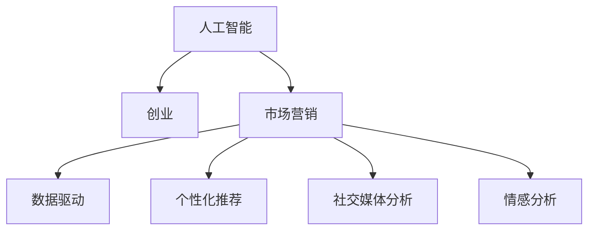

                 

# 人工智能创业：市场营销技巧

> 关键词：人工智能, 创业, 市场营销, 策略, 策略分析, 数据驱动, 客户需求, 用户行为, 技术转化

## 1. 背景介绍

### 1.1 问题由来

在过去几十年里，人工智能(AI)技术取得了突飞猛进的发展，从最初的计算数学到如今的深度学习，AI已经渗透到了我们生活的方方面面。随着AI技术的不断成熟，越来越多的创业公司将AI视为推动企业成长的引擎。然而，即便拥有先进的技术和创新的理念，很多AI创业公司仍面临市场营销的挑战。如何有效地利用AI技术，推广产品，吸引客户，实现商业成功？市场营销技巧，成为AI创业的关键要素。

### 1.2 问题核心关键点

市场营销的核心在于如何最大化地利用现有的资源，将产品和服务有效地传达给目标客户，并激发其购买欲望。对于AI创业公司而言，除了传统的产品定价、广告推广等策略，AI技术可以提供更加个性化、数据驱动的营销方案。

1. **客户细分**：通过分析用户行为数据，AI可以自动将客户分为不同群体，针对性地制定营销策略。
2. **需求预测**：利用机器学习算法，预测市场需求变化，优化库存管理和生产计划。
3. **个性化推荐**：根据用户的历史行为和偏好，AI可以生成个性化的产品推荐，提升用户满意度。
4. **社交媒体分析**：通过AI技术对社交媒体数据进行深度挖掘，发现潜在的市场趋势和机会。
5. **情感分析**：分析用户反馈和评论，识别出品牌形象和产品优劣，及时调整策略。

## 2. 核心概念与联系

### 2.1 核心概念概述

为更好地理解AI创业公司在市场营销中的策略，本节将介绍几个密切相关的核心概念：

- **人工智能**：利用机器学习、深度学习等技术，使计算机系统能够模拟人类智能的决策和行为。
- **创业**：指创业者创立新企业的活动，通过创新和价值创造来实现商业成功。
- **市场营销**：企业通过调研和分析市场，策划和实施策略，以达成销售目标和品牌建设。
- **数据驱动**：利用大数据分析技术，从海量数据中挖掘有价值的市场信息和客户行为，辅助决策。
- **个性化推荐**：根据用户的行为和偏好，推荐个性化的产品或服务，提升用户体验。
- **社交媒体分析**：利用社交媒体上的大量数据，分析和挖掘市场趋势和用户情感。
- **情感分析**：通过自然语言处理技术，分析和理解用户反馈和评论的情感倾向，优化产品和服务。

这些核心概念之间的逻辑关系可以通过以下Mermaid流程图来展示：



这个流程图展示了这个主题中的核心概念及其相互关系：

1. 人工智能技术为创业提供工具和方法，驱动市场营销策略的实施。
2. 市场营销利用人工智能技术提升效果，实现商业成功。
3. 数据驱动和个性化推荐利用人工智能分析用户数据，优化营销效果。
4. 社交媒体分析和情感分析利用AI技术分析用户情感和市场趋势，辅助决策。

## 3. 核心算法原理 & 具体操作步骤

### 3.1 算法原理概述

基于AI的市场营销策略，核心在于利用数据和算法，对市场和客户进行深入分析，并基于分析结果制定精准的营销策略。以下是几种主要的AI营销算法：

1. **聚类算法**：用于对客户进行分类，发现相似用户群体，实现精准营销。
2. **预测算法**：用于预测市场趋势和客户需求，优化库存管理和生产计划。
3. **推荐算法**：用于根据用户历史行为，生成个性化产品推荐，提升用户满意度。
4. **情感分析算法**：用于分析用户评论和反馈，了解用户情感和产品优劣，优化产品和服务。

这些算法通常通过机器学习、深度学习等技术实现，在数据驱动的市场营销中发挥重要作用。

### 3.2 算法步骤详解

AI驱动的市场营销通常包括以下几个关键步骤：

**Step 1: 数据收集与预处理**
- 从各种渠道（如社交媒体、电商平台、用户反馈等）收集数据。
- 对数据进行清洗、去重、标准化等预处理操作。
- 使用特征工程方法，提取有用的特征。

**Step 2: 模型训练与优化**
- 选择适合的机器学习模型，如聚类、回归、分类、推荐等。
- 使用历史数据对模型进行训练，优化模型参数。
- 在验证集上评估模型效果，进行调参优化。

**Step 3: 模型应用与效果评估**
- 将训练好的模型应用到实时数据中，进行预测和推荐。
- 收集实际效果反馈，评估模型性能。
- 根据反馈调整模型，持续优化。

### 3.3 算法优缺点

基于AI的市场营销算法具有以下优点：
1. 高效精准。通过数据驱动的方法，AI可以精准地定位目标客户，提升营销效果。
2. 预测性强。通过预测算法，企业可以提前预判市场趋势和客户需求，优化资源配置。
3. 个性化强。个性化推荐算法可以根据用户行为生成定制化推荐，提升用户满意度。
4. 情感分析能力强。情感分析算法可以快速识别用户情感倾向，及时调整产品和服务。

同时，这些算法也存在一些局限性：
1. 依赖数据质量。模型的效果很大程度上取决于数据的质量和数量。
2. 技术门槛高。需要专业的数据科学和机器学习知识。
3. 计算资源需求高。训练和推理大模型需要强大的计算资源。
4. 动态调整困难。模型一旦训练完成，调整策略需要重新训练。

尽管存在这些局限性，但AI驱动的市场营销在提高营销精准性和效率方面具有巨大的潜力。

### 3.4 算法应用领域

基于AI的市场营销算法已经在诸多领域得到应用，例如：

1. **电子商务**：推荐系统、库存管理、用户细分等。
2. **金融服务**：风险评估、信用评分、客户服务等。
3. **医疗健康**：个性化治疗方案、疾病预测、患者管理等。
4. **媒体娱乐**：内容推荐、广告投放、用户画像等。
5. **政府公共服务**：公共安全预测、交通管理、城市规划等。

AI驱动的市场营销正逐步渗透到各个行业，助力企业提升竞争力。

## 4. 数学模型和公式 & 详细讲解  
### 4.1 数学模型构建

在本节中，我们将介绍几种常用的AI市场营销数学模型，并通过具体公式进行详细讲解。

### 4.2 公式推导过程

假设我们有一个二元分类问题，其中每个样本$x_i$对应一个标签$y_i$，模型的目标是通过训练数据集$D=\{(x_i,y_i)\}_{i=1}^N$，学习一个分类器$f(x)$，使得其在测试集上的分类误差最小。我们采用逻辑回归模型，其中$f(x)=\frac{1}{1+e^{-z(x)}}$，$z(x)=w\cdot x+b$，其中$w$为权重向量，$b$为偏置项。

逻辑回归模型的损失函数为交叉熵损失：

$$
L(y,f(x))=-\frac{1}{N}\sum_{i=1}^N(y_i\log f(x_i)+(1-y_i)\log(1-f(x_i)))
$$

通过最小化该损失函数，逻辑回归模型可以学习到最优的参数$w$和$b$。

### 4.3 案例分析与讲解

以电商平台的个性化推荐系统为例，假设我们有一个商品推荐模型$R(x)$，其目标是根据用户的历史行为$x$，预测用户是否会购买商品$y$。我们采用协同过滤算法，其中$R(x)=\sum_{i=1}^N\alpha_i y_i\dot{x_i}$，$\alpha_i$为相似度系数。

模型的训练过程如下：
- 从历史交易数据中提取用户行为特征$x_i$。
- 使用用户历史购买行为数据$y_i$作为标签，训练模型$R(x)$。
- 在测试集上评估模型的预测准确度，优化模型参数。

通过这种方法，我们可以有效地提升电商平台的推荐效果，增加用户的购买转化率。

## 5. 项目实践：代码实例和详细解释说明

### 5.1 开发环境搭建

在进行AI市场营销的实践前，我们需要准备好开发环境。以下是使用Python进行TensorFlow开发的教程：

1. 安装Anaconda：从官网下载并安装Anaconda，用于创建独立的Python环境。

2. 创建并激活虚拟环境：
```bash
conda create -n tf-env python=3.7
conda activate tf-env
```

3. 安装TensorFlow：根据CUDA版本，从官网获取对应的安装命令。例如：
```bash
conda install tensorflow=2.6.0
```

4. 安装各类工具包：
```bash
pip install numpy pandas scikit-learn matplotlib tqdm jupyter notebook ipython
```

完成上述步骤后，即可在`tf-env`环境中开始项目实践。

### 5.2 源代码详细实现

下面我们以推荐系统为例，给出使用TensorFlow对协同过滤算法进行实现的PyTorch代码实现。

首先，定义协同过滤算法的模型：

```python
import tensorflow as tf
from tensorflow.keras import layers

class协同过滤模型(layers.Layer):
    def __init__(self, N):
        super(协同过滤模型, self).__init__()
        self.N = N
        self.W = self.add_weight("weight", [N, N], initializer='uniform')
    
    def call(self, x):
        return tf.matmul(x, self.W)
```

然后，定义损失函数和优化器：

```python
def mse_loss(y_true, y_pred):
    return tf.reduce_mean(tf.square(y_true - y_pred))

model =协同过滤模型(N=1000)
optimizer = tf.keras.optimizers.Adam(lr=0.001)
```

接着，定义训练和评估函数：

```python
def train_epoch(model, data, optimizer, batch_size=32):
    for x, y in data:
        with tf.GradientTape() as tape:
            y_pred = model(x)
            loss = mse_loss(y, y_pred)
        grads = tape.gradient(loss, model.trainable_variables)
        optimizer.apply_gradients(zip(grads, model.trainable_variables))

def evaluate(model, data):
    y_true, y_pred = [], []
    for x, y in data:
        y_pred.append(model(x).numpy())
    y_true.append(y)
    return mse_loss(y_true, y_pred)
```

最后，启动训练流程并在测试集上评估：

```python
epochs = 10
batch_size = 32

for epoch in range(epochs):
    train_epoch(model, train_data, optimizer, batch_size)
    print(f"Epoch {epoch+1}, training loss: {evaluate(model, train_data)}")
    
print(f"Epoch {epoch+1}, test loss: {evaluate(model, test_data)}")
```

以上就是使用TensorFlow对协同过滤算法进行实现的完整代码实现。可以看到，通过TensorFlow的高级API，我们能够以非常简洁的代码实现复杂的推荐算法。

### 5.3 代码解读与分析

让我们再详细解读一下关键代码的实现细节：

**协同过滤模型类**：
- `__init__`方法：初始化权重矩阵$W$。
- `call`方法：实现前向传播，计算预测结果$y_pred$。

**mse_loss函数**：
- 计算均方误差损失，用于评估模型预测准确度。

**训练和评估函数**：
- `train_epoch`函数：对数据进行批次化加载，前向传播计算损失，反向传播更新模型参数。
- `evaluate`函数：在测试集上评估模型性能。

**训练流程**：
- 定义总的epoch数和batch size，开始循环迭代
- 每个epoch内，在训练集上训练，输出训练误差
- 在测试集上评估，输出测试误差

可以看到，TensorFlow配合高级API使得协同过滤算法的代码实现变得非常简洁高效。开发者可以将更多精力放在模型设计和数据处理上，而不必过多关注底层的实现细节。

当然，工业级的系统实现还需考虑更多因素，如模型的保存和部署、超参数的自动搜索、更灵活的模型架构等。但核心的推荐范式基本与此类似。

## 6. 实际应用场景

### 6.1 电商平台个性化推荐

基于协同过滤算法的推荐系统，可以广泛应用于电商平台。通过分析用户的购买行为、浏览记录、评分反馈等数据，推荐系统可以生成个性化的商品推荐，提升用户购物体验和购买转化率。

具体实现上，可以收集用户的历史行为数据，提取有用的特征，使用协同过滤算法训练推荐模型，并将其部署到电商平台的推荐页面上，实时向用户展示个性化推荐商品。

### 6.2 金融风险管理

金融领域需要实时监控市场动态和用户行为，及时发现潜在风险。基于协同过滤算法的推荐系统，可以通过分析用户的交易行为，预测用户的风险等级，及时提醒金融机构进行风险控制。

在实现上，可以收集金融产品的交易数据，提取关键特征，训练协同过滤推荐模型，对用户的风险等级进行预测。系统可以根据预测结果，自动调整用户访问权限和交易限制，保障金融系统的安全。

### 6.3 媒体内容推荐

媒体平台需要不断推出新的内容，吸引用户关注。基于协同过滤算法的推荐系统，可以分析用户的观看历史、点赞记录、评论反馈等数据，推荐相关内容，提升用户黏性和平台流量。

具体实现上，可以收集用户的媒体消费数据，使用协同过滤算法训练推荐模型，向用户展示个性化推荐内容。系统可以根据用户的观看行为，动态调整推荐策略，提升内容推荐的效果。

### 6.4 未来应用展望

随着AI技术的不断进步，基于协同过滤算法的推荐系统将有更广阔的应用前景。未来可能涌现出更多的应用场景，如智能客服、个性化医疗、智能物流等。

在智能客服场景中，推荐系统可以分析用户的咨询历史，推荐相关解决方案，提升客服效率和用户体验。

在个性化医疗中，推荐系统可以分析用户的健康数据，推荐个性化的治疗方案，提升医疗效果和用户满意度。

在智能物流中，推荐系统可以分析用户的订单历史，推荐配送路线和包裹存储方案，提升物流效率和用户体验。

## 7. 工具和资源推荐

### 7.1 学习资源推荐

为了帮助开发者系统掌握AI驱动市场营销的理论基础和实践技巧，这里推荐一些优质的学习资源：

1. 《Python深度学习》系列书籍：通过Python实现的深度学习模型，包括协同过滤算法，适合初学者学习。
2. CS229《机器学习》课程：斯坦福大学开设的经典机器学习课程，涵盖协同过滤算法等内容。
3. 《Deep Learning with PyTorch》书籍：基于PyTorch实现的深度学习模型，适合进阶学习。
4. Coursera上的深度学习专业课程：由斯坦福大学提供，涵盖协同过滤算法等AI相关内容。
5. Kaggle上的推荐系统竞赛：通过实际数据集训练推荐模型，积累实战经验。

通过对这些资源的学习实践，相信你一定能够快速掌握AI驱动市场营销的精髓，并用于解决实际的商业问题。

### 7.2 开发工具推荐

高效的开发离不开优秀的工具支持。以下是几款用于AI市场营销开发的常用工具：

1. TensorFlow：基于Python的开源深度学习框架，提供丰富的API和工具，适合各类AI应用开发。
2. PyTorch：基于Python的开源深度学习框架，灵活的计算图设计，适合科研和工程实践。
3. Keras：高级API封装，适合快速搭建和训练深度学习模型。
4. scikit-learn：开源机器学习库，提供常用的机器学习算法和工具。
5. Jupyter Notebook：交互式笔记本环境，方便数据处理和模型调试。
6. Tableau：数据可视化工具，用于分析复杂数据集，辅助决策。

合理利用这些工具，可以显著提升AI市场营销任务的开发效率，加快创新迭代的步伐。

### 7.3 相关论文推荐

AI驱动的市场营销技术不断发展，相关的研究论文也在不断涌现。以下是几篇具有代表性的论文，推荐阅读：

1. "Scalable Collaborative Filtering for Large Datasets"（协方差分解算法）：提出了矩阵分解的方法，适用于大规模数据集上的协同过滤。
2. "Beyond Recommendation: Highly-Social Networks in the era of Consumption Data"（基于消费数据的高度社交网络）：探讨了消费数据对推荐系统的影响，提出新的社交网络推荐算法。
3. "Deep Recommendation"（深度推荐系统）：提出深度学习模型，在协同过滤基础上提升推荐精度。
4. "Generative Model-Based Collaborative Filtering"（生成模型基础上的协同过滤）：提出了基于生成模型的推荐方法，提升了推荐系统的稳定性和效果。
5. "Online Recommendation with Partially Observed User-Item Interactions"（部分观察用户物品交互的在线推荐）：提出了在线推荐算法，适用于实时数据处理。

这些论文代表了AI驱动市场营销技术的发展脉络，通过学习这些前沿成果，可以帮助研究者把握学科前进方向，激发更多的创新灵感。

## 8. 总结：未来发展趋势与挑战

### 8.1 总结

本文对AI驱动的市场营销技术进行了全面系统的介绍。首先阐述了AI技术在市场营销中的应用背景和意义，明确了数据驱动和个性化推荐在市场营销中的重要性。其次，从原理到实践，详细讲解了协同过滤算法的数学模型和关键步骤，给出了市场营销任务开发的完整代码实例。同时，本文还广泛探讨了AI营销技术在电商、金融、媒体等诸多行业领域的应用前景，展示了AI驱动的市场营销技术的广阔应用空间。最后，本文精选了市场营销技术的各类学习资源，力求为读者提供全方位的技术指引。

通过本文的系统梳理，可以看到，AI驱动的市场营销技术在提高营销精准性和效率方面具有巨大的潜力。AI技术与市场营销的结合，为传统营销方式注入了新的活力，带来了更加个性化的营销体验。未来，伴随AI技术的不断进步，基于协同过滤等算法的市场营销技术也将不断演进，为企业的市场竞争力和品牌建设带来新的突破。

### 8.2 未来发展趋势

展望未来，AI驱动的市场营销技术将呈现以下几个发展趋势：

1. **数据融合**：融合多模态数据，提升市场分析的深度和广度。
2. **实时计算**：实现实时数据处理和推荐，提升用户体验。
3. **跨领域应用**：向更多行业领域拓展，如智能客服、个性化医疗等。
4. **用户参与**：通过用户互动反馈，优化推荐算法，提升推荐效果。
5. **算法创新**：开发新的协同过滤算法和推荐模型，提升推荐精度和泛化能力。

这些趋势展示了AI驱动市场营销技术的前景，预示着未来的市场营销将更加个性化、精准化和智能化。

### 8.3 面临的挑战

尽管AI驱动的市场营销技术已经取得了显著成果，但在迈向更加智能化、普适化应用的过程中，它仍面临诸多挑战：

1. **数据隐私**：用户的个人信息和行为数据需要妥善保护，避免数据泄露和滥用。
2. **算法透明**：推荐算法的决策过程需要具备可解释性，增强用户信任。
3. **模型公平**：推荐系统需要避免偏见和歧视，保证公平性。
4. **计算资源**：大规模数据的处理和实时推荐需要强大的计算资源，如何优化计算效率，降低成本，是关键问题。
5. **用户适应性**：如何动态调整推荐策略，适应用户需求的变化，是未来的研究方向。

这些挑战需要我们不断探索和解决，才能充分发挥AI技术在市场营销中的潜力。

### 8.4 研究展望

面对AI驱动市场营销所面临的挑战，未来的研究需要在以下几个方面寻求新的突破：

1. **隐私保护**：开发隐私保护算法，保障用户数据安全。
2. **可解释性**：引入可解释性算法，增强用户对推荐系统的信任。
3. **公平性**：开发公平性算法，消除推荐系统中的偏见和歧视。
4. **计算优化**：优化计算图和算法，提高实时推荐和处理效率。
5. **用户互动**：引入用户反馈机制，动态调整推荐策略。

这些研究方向将引领AI驱动市场营销技术的发展方向，推动其在更广泛的应用场景中发挥更大价值。总之，AI技术在市场营销中的潜力和应用前景广阔，需要不断探索和优化，才能实现商业成功。

## 9. 附录：常见问题与解答

**Q1：AI驱动的市场营销是否适用于所有行业？**

A: AI驱动的市场营销虽然具有广泛的适用性，但对于一些特殊行业，如医疗、法律等，需要结合行业特点进行定制化设计。此外，对于一些需要高度人工干预和复杂决策的场景，AI可能无法完全替代人工。

**Q2：如何选择合适的协同过滤算法？**

A: 选择合适的协同过滤算法需要考虑数据特点、计算资源、推荐效果等因素。常用的算法包括基于矩阵分解的算法、基于树形结构的算法等。在实际应用中，可以通过A/B测试等方式，评估不同算法的表现，选择最适合的算法。

**Q3：如何优化协同过滤算法的推荐效果？**

A: 协同过滤算法的优化可以从数据处理、模型训练、参数调优等方面入手：
1. 数据处理：清洗、去重、标准化数据，提取有用的特征。
2. 模型训练：选择合适的机器学习算法，调整超参数。
3. 参数调优：使用交叉验证、网格搜索等方法，优化模型参数。
4. 推荐策略：引入用户反馈、上下文信息等，动态调整推荐策略。

**Q4：AI驱动的市场营销在落地部署时需要注意哪些问题？**

A: AI驱动的市场营销在落地部署时需要注意以下问题：
1. 数据隐私：保护用户数据，避免泄露。
2. 算法透明：增强算法的可解释性，增强用户信任。
3. 模型公平：消除算法偏见，保证公平性。
4. 计算资源：优化计算资源配置，提高实时处理效率。
5. 用户反馈：引入用户反馈机制，动态调整推荐策略。

只有从数据、算法、工程、业务等多个维度协同发力，才能真正实现AI驱动市场营销的成功。总之，AI驱动的市场营销需要不断优化和调整，才能满足实际需求。

