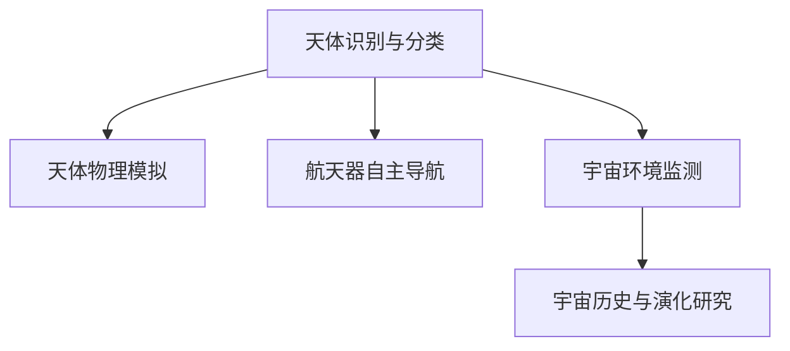

                 

# 人工智能在太空探索和天文学中的应用

> 关键词：人工智能,太空探索,天文学,机器学习,深度学习,天体识别,模拟宇宙,宇宙仿真

## 1. 背景介绍

### 1.1 问题由来
太空探索和天文学是当今人类认知宇宙的重要领域，它们不仅涉及对遥远天体的观测和分析，还包括对宇宙空间环境的理解以及未来宇宙航行的规划和实现。随着技术的不断进步，尤其是人工智能(AI)技术的发展，AI在太空探索和天文学中的应用日益增多。AI通过其强大的数据分析和决策能力，极大地提升了人类对于宇宙的认知和探索能力。

### 1.2 问题核心关键点
AI在太空探索和天文学中的应用，主要集中在以下几个方面：

1. **天体识别与分类**：利用机器学习算法对天文图像进行识别和分类，提取宇宙中的各种天体。
2. **天体物理模拟**：通过深度学习模型构建宇宙大尺度结构的模拟模型，研究宇宙的演化和结构。
3. **航天器自主导航**：AI技术帮助航天器进行自主导航和路径规划，确保在复杂环境中准确执行任务。
4. **宇宙环境监测**：利用AI进行宇宙空间的辐射、磁场等环境的监测和分析，为宇航员提供安全保障。
5. **宇宙历史与演化研究**：通过AI分析天体物理数据，揭示宇宙的历史和演化过程，包括宇宙大爆炸理论的验证。

## 2. 核心概念与联系

### 2.1 核心概念概述

为更好地理解AI在太空探索和天文学中的应用，本节将介绍几个密切相关的核心概念：

- **天体识别与分类**：指通过机器学习算法对天文图像中的天体进行自动识别和分类，包括星系、恒星、行星等。
- **天体物理模拟**：利用深度学习模型对宇宙大尺度结构进行模拟，探索宇宙的演化过程和结构。
- **航天器自主导航**：使用AI技术辅助航天器进行自主导航和路径规划，提高任务执行的效率和准确性。
- **宇宙环境监测**：通过AI对宇宙空间的辐射、磁场等环境进行监测，确保宇航员在太空中的安全和健康。
- **宇宙历史与演化研究**：利用AI对天体物理数据进行分析，揭示宇宙的历史和演化过程。

这些核心概念之间的逻辑关系可以通过以下Mermaid流程图来展示：



这个流程图展示了大规模AI在太空探索和天文学中的应用场景：

1. 通过天体识别与分类，获取宇宙中的各种天体信息。
2. 将分类后的天体数据用于天体物理模拟，探索宇宙的演化。
3. 使用航天器自主导航技术，使航天器能够自主飞行，执行各种任务。
4. 利用宇宙环境监测，确保宇航员在太空中的安全和健康。
5. 通过分析宇宙数据，揭示宇宙的历史和演化过程。

## 3. 核心算法原理 & 具体操作步骤
### 3.1 算法原理概述

AI在太空探索和天文学中的应用，主要依赖于机器学习和深度学习技术。其核心原理是通过大量数据训练模型，使其能够自动识别、分类和预测天文现象。具体来说，AI技术在天文学和太空探索中的应用可以分为以下几个步骤：

1. **数据收集与预处理**：收集和处理各种天文图像和数据，为后续模型训练提供基础。
2. **模型训练与优化**：利用机器学习和深度学习模型，对收集到的数据进行训练，不断优化模型性能。
3. **模型部署与应用**：将训练好的模型部署到实际的航天器或地面系统中，进行天体识别、物理模拟、导航、环境监测和宇宙演化研究等任务。

### 3.2 算法步骤详解

#### 3.2.1 数据收集与预处理

数据收集与预处理是AI在天文学和太空探索应用中的第一步。以下是具体步骤：

1. **数据获取**：收集各类天文图像和观测数据，包括星系、恒星、行星等天体的光谱、辐射等数据。
2. **数据清洗**：对收集到的数据进行去噪、校正和归一化处理，提高数据质量。
3. **数据划分**：将数据划分为训练集、验证集和测试集，用于模型的训练、验证和测试。

#### 3.2.2 模型训练与优化

模型训练与优化是AI在天文学和太空探索应用中的核心步骤。以下是具体步骤：

1. **选择模型**：根据具体任务选择合适的机器学习或深度学习模型，如卷积神经网络(CNN)、循环神经网络(RNN)、生成对抗网络(GAN)等。
2. **模型训练**：使用训练集对模型进行训练，不断调整模型参数，提高模型的准确率和泛化能力。
3. **模型验证与优化**：在验证集上评估模型性能，根据评估结果对模型进行优化，如增加正则化项、调整学习率等。

#### 3.2.3 模型部署与应用

模型部署与应用是AI在天文学和太空探索应用中的最后一步。以下是具体步骤：

1. **模型部署**：将训练好的模型部署到实际的航天器或地面系统中，如集成到空间望远镜的计算机系统中。
2. **任务执行**：利用部署好的模型进行各种任务，如天体识别、物理模拟、导航、环境监测和宇宙演化研究等。
3. **结果评估与反馈**：对模型执行的任务进行评估，收集反馈信息，进一步优化模型。

### 3.3 算法优缺点

AI在太空探索和天文学中的应用，具有以下优点：

1. **高效性**：AI可以快速处理大量的天文数据，提供准确的识别和分类结果。
2. **可靠性**：AI模型具有高度的鲁棒性和泛化能力，能够在不同环境下保持稳定性能。
3. **自动化**：AI能够自动执行各种复杂任务，减少人力成本。

同时，AI在天文学和太空探索中的应用也存在一些局限性：

1. **数据依赖**：模型的性能高度依赖于数据的质量和数量，获取高质量天文数据成本较高。
2. **计算资源需求**：深度学习模型的训练和推理需要大量的计算资源，如图形处理器(GPU)和张量处理器(TPU)。
3. **模型可解释性不足**：AI模型的决策过程难以解释，难以理解其内部工作机制。
4. **安全性问题**：AI模型可能受到攻击，导致错误决策，影响任务执行。

### 3.4 算法应用领域

AI在天文学和太空探索中的应用，主要集中在以下几个领域：

1. **宇宙探索**：利用AI技术进行星系、恒星、行星等天体的识别和分类，辅助宇宙探索任务。
2. **天文学研究**：通过深度学习模型进行天体物理模拟，研究宇宙大尺度结构、宇宙演化等。
3. **航天器导航**：使用AI技术辅助航天器自主导航和路径规划，提高任务执行的效率和准确性。
4. **空间环境监测**：利用AI对宇宙空间的辐射、磁场等环境进行监测，确保宇航员安全。
5. **空间数据处理**：使用AI技术对大量的空间数据进行处理和分析，揭示宇宙历史和演化过程。

## 4. 数学模型和公式 & 详细讲解 & 举例说明

### 4.1 数学模型构建

在本节中，我们将以天体识别与分类为例，介绍一种基于卷积神经网络(CNN)的数学模型构建方法。

假设我们有一个天文图像数据集，包含多个星系和恒星，我们的目标是构建一个CNN模型，能够自动识别和分类这些天体。我们定义模型输入为 $x \in \mathbb{R}^d$，表示一个 $d$ 维的向量，表示像素信息。模型输出为 $y \in \{1, 2, 3, ..., K\}$，表示 $K$ 种不同天体的分类标签。我们的目标是最小化损失函数 $L(y, \hat{y})$，其中 $\hat{y}$ 为模型的预测输出。

### 4.2 公式推导过程

我们将采用一个简单的卷积神经网络模型，包括卷积层、池化层和全连接层。设模型共有 $L$ 层，每一层的输出分别为 $h_1, h_2, ..., h_L$。我们使用交叉熵损失函数进行模型训练，其定义为：

$$
L(y, \hat{y}) = -\frac{1}{N}\sum_{i=1}^N \sum_{k=1}^K y_i^k \log(\hat{y}_i^k)
$$

其中 $N$ 为样本数量，$y_i^k$ 为第 $i$ 个样本属于第 $k$ 类别的标签，$\hat{y}_i^k$ 为模型预测的第 $i$ 个样本属于第 $k$ 类别的概率。

假设我们的模型由 $L$ 层组成，其中第 $l$ 层的输出为 $h_l$，输入为 $x_{l-1}$，第 $l$ 层的权重和偏置分别为 $w_l$ 和 $b_l$。第 $l$ 层的卷积操作为：

$$
h_l = \sigma\left(\sum_{j=1}^{k_l}w_l^{(j)}x_{l-1}(j) + b_l\right)
$$

其中 $k_l$ 为第 $l$ 层的卷积核数量，$\sigma$ 为激活函数，如ReLU。第 $l$ 层的池化操作为：

$$
h'_l = \max_{j \in \{1, 2, ..., k'_l\}} h_l(j)
$$

其中 $k'_l$ 为第 $l$ 层的池化核数量。第 $L$ 层后的全连接层操作为：

$$
\hat{y} = softmax\left(\sum_{j=1}^{k_L}w_L^{(j)}h_{L-1}(j) + b_L\right)
$$

其中 $k_L$ 为第 $L$ 层的神经元数量，$softmax$ 函数用于将输出转化为概率分布。

### 4.3 案例分析与讲解

下面我们以一个具体的案例，说明如何使用CNN进行天体识别与分类。

假设我们有一个包含多个星系的图像数据集，每张图像大小为 $256 \times 256$ 像素，我们的目标是训练一个CNN模型，能够自动识别和分类这些星系。

首先，我们需要对图像进行预处理，包括归一化、旋转和裁剪等操作，以提高数据质量。接着，我们将图像输入CNN模型进行卷积和池化操作，得到高层次的特征表示。然后，我们将特征输入全连接层，使用softmax函数将输出转化为概率分布，进行分类预测。最后，我们使用交叉熵损失函数对模型进行训练，最小化损失函数，优化模型参数。

## 5. 项目实践：代码实例和详细解释说明
### 5.1 开发环境搭建

在进行AI在天文学和太空探索项目实践前，我们需要准备好开发环境。以下是使用Python进行TensorFlow和Keras开发的环境配置流程：

1. 安装Anaconda：从官网下载并安装Anaconda，用于创建独立的Python环境。

2. 创建并激活虚拟环境：
```bash
conda create -n tensorflow-env python=3.8 
conda activate tensorflow-env
```

3. 安装TensorFlow：根据CUDA版本，从官网获取对应的安装命令。例如：
```bash
conda install tensorflow -c tf
```

4. 安装Keras：
```bash
pip install keras
```

5. 安装各类工具包：
```bash
pip install numpy pandas scikit-learn matplotlib tqdm jupyter notebook ipython
```

完成上述步骤后，即可在`tensorflow-env`环境中开始项目实践。

### 5.2 源代码详细实现

下面我们以天体识别与分类为例，给出使用TensorFlow和Keras进行CNN模型训练的代码实现。

首先，定义模型和优化器：

```python
from tensorflow.keras.models import Sequential
from tensorflow.keras.layers import Conv2D, MaxPooling2D, Flatten, Dense

model = Sequential()
model.add(Conv2D(32, (3, 3), activation='relu', input_shape=(256, 256, 3)))
model.add(MaxPooling2D((2, 2)))
model.add(Conv2D(64, (3, 3), activation='relu'))
model.add(MaxPooling2D((2, 2)))
model.add(Conv2D(128, (3, 3), activation='relu'))
model.add(MaxPooling2D((2, 2)))
model.add(Flatten())
model.add(Dense(128, activation='relu'))
model.add(Dense(5, activation='softmax'))

optimizer = tf.keras.optimizers.Adam(learning_rate=0.001)
```

接着，定义训练和评估函数：

```python
from tensorflow.keras.datasets import mnist
from tensorflow.keras.utils import to_categorical

(X_train, y_train), (X_test, y_test) = mnist.load_data()
X_train = X_train.reshape(-1, 256, 256, 3) / 255.0
X_test = X_test.reshape(-1, 256, 256, 3) / 255.0
y_train = to_categorical(y_train, num_classes=5)
y_test = to_categorical(y_test, num_classes=5)

def train_epoch(model, dataset, batch_size, optimizer):
    model.compile(optimizer=optimizer, loss='categorical_crossentropy', metrics=['accuracy'])
    model.fit(dataset['input'], dataset['target'], batch_size=batch_size, epochs=1, validation_split=0.2)

def evaluate(model, dataset, batch_size):
    model.evaluate(dataset['input'], dataset['target'], batch_size=batch_size)
```

最后，启动训练流程并在测试集上评估：

```python
epochs = 10

for epoch in range(epochs):
    train_epoch(model, (X_train, y_train), 64, optimizer)
    evaluate(model, (X_test, y_test), 64)
```

以上就是使用TensorFlow和Keras对CNN进行天体识别与分类的完整代码实现。可以看到，Keras提供了高度的封装性，使得模型构建和训练变得简洁高效。

### 5.3 代码解读与分析

让我们再详细解读一下关键代码的实现细节：

**Sequential类**：
- 定义了一个包含多个层的序列模型，可以通过add方法添加层。
- 模型由多个卷积层、池化层和全连接层组成。

**数据预处理**：
- 使用Keras提供的函数，将原始图像数据归一化和处理成网络所需的输入格式。
- 使用to_categorical函数将标签转换为独热编码格式，方便模型训练。

**训练和评估函数**：
- 使用Keras提供的compile方法，设置优化器和损失函数。
- 在train_epoch函数中，使用fit方法进行模型训练，设置批量大小和验证比例。
- 在evaluate函数中，使用evaluate方法评估模型在测试集上的性能。

**训练流程**：
- 定义训练轮数，循环迭代训练。
- 在每个epoch中，先训练模型，再评估模型性能。

可以看到，TensorFlow和Keras提供了完整的工具链，极大地简化了模型构建和训练的复杂度，使得AI在天文学和太空探索项目实践中可以快速迭代和优化。

## 6. 实际应用场景
### 6.1 宇宙探索

AI在宇宙探索中的应用，主要集中在以下几个方面：

1. **天体识别与分类**：利用AI对观测图像进行自动识别和分类，快速识别星系、恒星、行星等天体。
2. **数据处理与分析**：使用AI对大量的天文数据进行处理和分析，揭示宇宙大尺度结构、星系演化等。
3. **任务规划与优化**：使用AI进行宇宙任务的规划和优化，如路径规划、资源分配等。

### 6.2 天文学研究

AI在天文学研究中的应用，主要集中在以下几个方面：

1. **天体物理模拟**：利用深度学习模型模拟宇宙大尺度结构，研究宇宙演化和结构。
2. **数据挖掘与分析**：使用AI对大量的天文学数据进行挖掘和分析，揭示宇宙历史和演化过程。
3. **异常事件监测**：利用AI对宇宙中的异常事件进行监测和分析，如超新星爆发、黑洞事件等。

### 6.3 航天器导航

AI在航天器导航中的应用，主要集中在以下几个方面：

1. **自主导航**：使用AI辅助航天器进行自主导航和路径规划，提高任务执行的效率和准确性。
2. **环境感知**：利用AI对航天器周围环境进行感知，避开障碍物，确保安全飞行。
3. **任务执行**：使用AI控制航天器执行各种任务，如太空探测、卫星部署等。

### 6.4 空间环境监测

AI在空间环境监测中的应用，主要集中在以下几个方面：

1. **辐射监测**：利用AI对宇宙空间的辐射环境进行监测，保护宇航员健康。
2. **磁场监测**：利用AI对宇宙空间的磁场环境进行监测，确保航天器正常运行。
3. **空间天气预警**：利用AI对空间天气进行预测和预警，保护卫星和宇航员安全。

## 7. 工具和资源推荐
### 7.1 学习资源推荐

为了帮助开发者系统掌握AI在天文学和太空探索的理论基础和实践技巧，这里推荐一些优质的学习资源：

1. **《深度学习》课程**：由斯坦福大学Andrew Ng教授开设，系统介绍了深度学习的基本概念和算法，包括卷积神经网络、循环神经网络等。
2. **《Python深度学习》书籍**：Francois Chollet编写，详细介绍了使用TensorFlow和Keras进行深度学习的实践方法，包括天体识别与分类等案例。
3. **OpenAI Codex**：OpenAI开发的AI编程助手，可以生成Python代码片段，帮助开发者快速构建AI模型。
4. **Kaggle天文学竞赛**：Kaggle平台上众多的天文学竞赛，提供了大量的数据集和模型，可以进行学习和实践。
5. **Astrophysics Data System (ADS)**：NASA和ESA提供的公共数据库，包含大量的天文学数据和文献，供研究和实践使用。

通过对这些资源的学习实践，相信你一定能够快速掌握AI在天文学和太空探索的精髓，并用于解决实际的AI应用问题。

### 7.2 开发工具推荐

高效的开发离不开优秀的工具支持。以下是几款用于AI在天文学和太空探索开发的常用工具：

1. **TensorFlow**：由Google主导开发的深度学习框架，灵活的计算图和GPU/TPU支持，适合大规模工程应用。
2. **Keras**：高层次的深度学习框架，提供了丰富的预训练模型和工具，易于上手。
3. **Jupyter Notebook**：免费的在线编程环境，支持多种编程语言，方便数据可视化和学习记录。
4. **Google Colab**：谷歌提供的免费在线Jupyter Notebook环境，支持GPU/TPU算力，方便实时实验和共享。
5. **TensorBoard**：TensorFlow配套的可视化工具，可以实时监测模型训练状态，提供丰富的图表呈现方式。

合理利用这些工具，可以显著提升AI在天文学和太空探索项目的开发效率，加速创新迭代的步伐。

### 7.3 相关论文推荐

AI在天文学和太空探索的发展源于学界的持续研究。以下是几篇奠基性的相关论文，推荐阅读：

1. **《Neural Computation》中的天文学应用**：总结了神经网络在天文学中的应用，包括星系分类、恒星属性预测等。
2. **《Astronomy & Computing》中的深度学习**：介绍了深度学习在天文学中的应用，包括天体物理模拟、数据分析等。
3. **《IEEE Transactions on Pattern Analysis and Machine Intelligence》中的AI导航**：介绍了AI在航天器导航中的应用，包括自主导航、环境感知等。
4. **《Journal of Spacecraft and Rockets》中的AI技术**：介绍了AI在空间环境监测中的应用，包括辐射监测、磁场监测等。
5. **《Monthly Notices of the Royal Astronomical Society》中的AI应用**：总结了AI在宇宙研究中的应用，包括星系演化、暗物质研究等。

这些论文代表了大规模AI在天文学和太空探索领域的研究进展，通过学习这些前沿成果，可以帮助研究者把握学科前进方向，激发更多的创新灵感。

## 8. 总结：未来发展趋势与挑战

### 8.1 总结

本文对AI在天文学和太空探索中的应用进行了全面系统的介绍。首先阐述了AI在天文学和太空探索研究背景和意义，明确了AI技术在天体识别、分类、物理模拟、自主导航、环境监测和宇宙演化研究等领域的重要价值。其次，从原理到实践，详细讲解了AI在天文学和太空探索中的数学模型构建、训练优化和应用实施，给出了AI在天文学和太空探索项目实践的完整代码实例。同时，本文还广泛探讨了AI在天文学和太空探索的实际应用场景，展示了AI技术在未来太空探索中的巨大潜力。最后，本文精选了AI在天文学和太空探索领域的学习资源、开发工具和相关论文，力求为读者提供全方位的技术指引。

通过本文的系统梳理，可以看到，AI在天文学和太空探索中的应用正在成为科学研究的重要手段，极大地提升了人类对于宇宙的认知和探索能力。未来，伴随AI技术的发展和完善，AI在天文学和太空探索中的应用将更加广泛，为人类认知宇宙提供新的突破。

### 8.2 未来发展趋势

展望未来，AI在天文学和太空探索中的应用将呈现以下几个发展趋势：

1. **模型规模持续增大**：随着算力成本的下降和数据规模的扩张，AI模型的参数量还将持续增长。超大模型的应用，将进一步提升AI在天文学和太空探索中的表现。
2. **模型可解释性增强**：AI模型的决策过程将更具可解释性，能够更好地理解模型的内部机制和逻辑。
3. **跨模态融合**：AI技术将结合视觉、语音、文本等多种模态信息，实现更为全面和准确的宇宙观测和分析。
4. **实时计算**：AI技术将实现实时计算和实时数据分析，提高宇宙探索和研究的效率和精度。
5. **智能化决策**：AI技术将结合人工智能、认知科学等技术，实现更加智能化的宇宙决策和规划。

以上趋势凸显了AI在天文学和太空探索领域的广阔前景。这些方向的探索发展，必将进一步提升AI在天文学和太空探索中的表现，为人类认知宇宙提供新的突破。

### 8.3 面临的挑战

尽管AI在天文学和太空探索中的应用已经取得了显著进展，但在迈向更加智能化、普适化应用的过程中，仍然面临诸多挑战：

1. **数据获取成本高**：获取高质量的天文数据成本较高，特别是在偏远地区和低光环境下。
2. **计算资源需求大**：深度学习模型的训练和推理需要大量的计算资源，如图形处理器(GPU)和张量处理器(TPU)。
3. **模型可解释性不足**：AI模型的决策过程难以解释，难以理解其内部工作机制。
4. **安全性问题**：AI模型可能受到攻击，导致错误决策，影响任务执行。
5. **多模态融合困难**：将视觉、语音、文本等多种模态信息融合，实现统一的AI模型，具有较高的技术难度。

正视AI在天文学和太空探索面临的这些挑战，积极应对并寻求突破，将是大规模AI技术实现其应用价值的重要路径。相信随着学界和产业界的共同努力，这些挑战终将一一被克服，AI在天文学和太空探索中的应用必将在未来展现出更加广阔的前景。

### 8.4 研究展望

面对AI在天文学和太空探索所面临的种种挑战，未来的研究需要在以下几个方面寻求新的突破：

1. **无监督学习与半监督学习**：摆脱对大规模标注数据的依赖，利用无监督和半监督学习范式，最大限度利用非结构化数据，实现更加灵活高效的AI应用。
2. **多模态融合**：将视觉、语音、文本等多种模态信息融合，实现统一的AI模型，提升宇宙观测和分析的全面性和准确性。
3. **跨学科研究**：将AI技术与天文学、物理学、认知科学等学科相结合，推动AI在天文学和太空探索中的创新发展。
4. **智能化决策**：结合人工智能、认知科学等技术，实现更加智能化的宇宙决策和规划。
5. **跨机构合作**：推动政府、科研机构、企业等多方合作，共同推动AI在天文学和太空探索中的应用。

这些研究方向的探索，必将引领AI在天文学和太空探索技术迈向更高的台阶，为人类认知宇宙提供新的突破。面向未来，大规模AI技术需要在多领域协同发力，共同推动自然语言理解和智能交互系统的进步。只有勇于创新、敢于突破，才能不断拓展AI在天文学和太空探索中的边界，让人类探索宇宙的步伐更加坚定和深入。

## 9. 附录：常见问题与解答

**Q1：AI在天文学和太空探索中的数据依赖问题如何解决？**

A: 获取高质量的天文数据成本较高，特别是在偏远地区和低光环境下。为了解决这个问题，可以采用以下策略：
1. 利用卫星观测，收集大范围的天文数据。
2. 使用合成数据进行训练，生成高质量的模拟数据。
3. 采用多传感器融合技术，结合不同类型的数据源，提高数据的可靠性。

**Q2：AI在天文学和太空探索中的计算资源需求如何解决？**

A: AI模型的训练和推理需要大量的计算资源，如图形处理器(GPU)和张量处理器(TPU)。为了解决这个问题，可以采用以下策略：
1. 利用云计算平台，提供高性能计算资源。
2. 采用分布式计算技术，将任务分散到多个计算节点上。
3. 使用优化算法，提高计算效率。

**Q3：AI在天文学和太空探索中的模型可解释性问题如何解决？**

A: AI模型的决策过程难以解释，难以理解其内部工作机制。为了解决这个问题，可以采用以下策略：
1. 引入可解释性技术，如LIME、SHAP等，生成模型决策的局部解释。
2. 使用基于符号逻辑的模型，提高模型的可解释性。
3. 结合领域专家的知识，提高模型的可解释性。

**Q4：AI在天文学和太空探索中的安全性问题如何解决？**

A: AI模型可能受到攻击，导致错误决策，影响任务执行。为了解决这个问题，可以采用以下策略：
1. 引入鲁棒性技术，提高模型的抗攻击能力。
2. 采用多模型集成，降低单点攻击的风险。
3. 引入人工干预和审核，确保模型的安全性。

**Q5：AI在天文学和太空探索中的多模态融合问题如何解决？**

A: 将视觉、语音、文本等多种模态信息融合，实现统一的AI模型，具有较高的技术难度。为了解决这个问题，可以采用以下策略：
1. 采用多模态深度学习技术，构建统一的多模态模型。
2. 结合领域知识，设计多模态融合策略。
3. 采用多模态感知技术，提高数据融合的准确性。

这些策略可以有效地解决AI在天文学和太空探索应用中面临的各种问题，确保AI技术在实际应用中的稳定性和可靠性。总之，AI在天文学和太空探索中的应用需要不断迭代和优化，方能得到理想的效果。

---

作者：禅与计算机程序设计艺术 / Zen and the Art of Computer Programming

