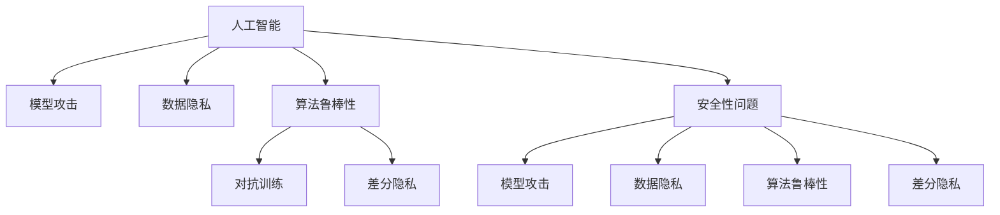

                 

# 人工智能技术的安全性问题

> 关键词：人工智能, 安全性问题, 模型攻击, 数据隐私, 算法鲁棒性, 对抗训练, 差分隐私

## 1. 背景介绍

### 1.1 问题由来

随着人工智能技术的快速发展，特别是深度学习、机器学习等算法的广泛应用，使得AI系统在各行各业取得了巨大成功。从自动驾驶、智能推荐到医疗诊断，AI技术已经渗透到我们生活的方方面面。然而，与此同时，安全性问题也逐渐成为AI系统面临的重要挑战。

人工智能系统本质上是一种基于数据的自动化决策系统，其决策过程往往依赖于大量的数据和复杂的模型。由于数据源的多样性和算法的复杂性，AI系统很容易受到各种攻击，如模型攻击、数据泄漏、算法鲁棒性不足等，这些攻击不仅可能导致系统失效，还会引发严重的社会问题。

### 1.2 问题核心关键点

安全性问题通常可以从以下几个方面进行探讨：

- **模型攻击**：指攻击者通过特定手段改变模型的行为，使其产生错误的输出结果。常见的模型攻击方式包括对抗样本攻击、后门攻击、模型篡改等。
- **数据隐私**：指AI系统在处理敏感数据时，可能造成数据的非法泄露和滥用，对用户隐私造成威胁。
- **算法鲁棒性**：指AI模型在不同分布或异常输入下的稳定性和可靠性。
- **对抗训练**：指通过引入对抗样本或噪声，提高AI模型的鲁棒性和泛化能力。
- **差分隐私**：指在保护数据隐私的同时，仍能提供有价值的信息。

这些关键点共同构成了AI系统安全性的核心内容，帮助理解在实际应用中如何保障AI系统的高安全性。

## 2. 核心概念与联系

### 2.1 核心概念概述

为更好地理解人工智能技术的安全性问题，本节将介绍几个密切相关的核心概念：

- **人工智能(AI)**：基于数据驱动的自动化决策系统，能够通过学习历史数据，自动地进行复杂的决策和预测。
- **模型攻击**：指攻击者通过特定手段改变模型输出，使其产生错误或不可靠的决策。
- **数据隐私**：指保护用户数据不被未经授权的访问、使用或泄露。
- **算法鲁棒性**：指模型在不同分布或异常输入下的稳定性和可靠性。
- **对抗训练**：指通过引入对抗样本或噪声，增强模型的鲁棒性和泛化能力。
- **差分隐私**：指在提供隐私保护的同时，仍能提供有价值的信息。

这些核心概念之间的逻辑关系可以通过以下Mermaid流程图来展示：



这个流程图展示了人工智能、模型攻击、数据隐私、算法鲁棒性、对抗训练和差分隐私等核心概念及其之间的关系：

1. 人工智能通过学习历史数据进行决策，安全性问题通常来源于模型攻击、数据隐私泄露、算法鲁棒性不足等。
2. 模型攻击和数据隐私问题可能会导致人工智能系统的安全性受到威胁。
3. 对抗训练和差分隐私技术可以增强模型的鲁棒性和隐私保护能力，从而提升系统的安全性。

## 3. 核心算法原理 & 具体操作步骤
### 3.1 算法原理概述

人工智能技术的安全性问题可以从多个角度进行分析和解决，以下是其中几种主要方法：

1. **模型攻击的检测与防御**：通过检测和防御模型攻击，保障AI系统的决策正确性。
2. **数据隐私保护**：通过隐私保护技术，确保用户数据的安全性。
3. **算法鲁棒性提升**：通过增强算法鲁棒性，确保AI系统在各种情况下都能稳定运行。
4. **对抗训练**：通过引入对抗样本，提高模型的泛化能力和鲁棒性。
5. **差分隐私**：通过加入噪声，保护数据隐私的同时提供有用的信息。

### 3.2 算法步骤详解

**模型攻击的检测与防御**：

1. **模型攻击的检测**：
   - 收集大量的正常数据和攻击数据，用于训练检测模型。
   - 使用异常检测算法，如基于统计的方法、基于深度学习的方法等，检测模型的输出是否异常。
   - 如果发现异常，及时采取措施，如丢弃异常样本、重新训练模型等。

2. **模型攻击的防御**：
   - 使用防御技术，如对抗训练、模型蒸馏、鲁棒正则化等，增强模型的鲁棒性。
   - 定期更新模型，减少攻击者利用旧模型的漏洞。

**数据隐私保护**：

1. **数据匿名化**：
   - 使用数据匿名化技术，如数据泛化、数据扰动、数据替换等，使得攻击者难以从数据中恢复原始信息。
   - 确保数据匿名化不影响模型的性能。

2. **差分隐私**：
   - 通过加入噪声，使得攻击者难以从数据中推断出原始信息。
   - 确保差分隐私的参数，如噪声水平、敏感度等，不影响模型的性能。

**算法鲁棒性提升**：

1. **数据增强**：
   - 通过增加训练数据的多样性，增强模型的泛化能力。
   - 确保数据增强后的模型性能不下降。

2. **对抗训练**：
   - 使用对抗样本训练模型，使得模型在对抗样本攻击下依然能够保持稳定。
   - 确保对抗训练后的模型在正常数据上的性能不下降。

**对抗训练**：

1. **对抗样本生成**：
   - 使用对抗生成技术，如FGSM、PGD等，生成对抗样本。
   - 确保对抗样本的真实性，不会引发系统误报。

2. **对抗训练**：
   - 使用对抗训练技术，如TPG、TRADES等，训练模型。
   - 确保对抗训练后的模型在正常数据上的性能不下降。

**差分隐私**：

1. **噪声加入**：
   - 使用噪声加入技术，如Laplace机制、Gaussian机制等，保护数据隐私。
   - 确保噪声加入后的模型性能不下降。

2. **参数设置**：
   - 根据数据敏感度和隐私需求，设置合适的噪声水平和敏感度。
   - 确保差分隐私的参数设置不会影响模型性能。

### 3.3 算法优缺点

人工智能技术的安全性问题解决方法具有以下优点：

1. **提高系统的安全性**：通过检测和防御模型攻击，保障AI系统的决策正确性；通过隐私保护技术，确保用户数据的安全性；通过增强算法鲁棒性，确保AI系统在各种情况下都能稳定运行。
2. **增强模型的泛化能力**：通过数据增强和对抗训练，提高模型的泛化能力和鲁棒性。
3. **保护数据隐私**：通过差分隐私技术，保护数据隐私的同时提供有用的信息。

同时，这些方法也存在一定的局限性：

1. **高成本**：检测和防御模型攻击，隐私保护，增强算法鲁棒性等技术需要较高的成本。
2. **复杂性**：这些技术实现复杂，需要专业的知识和技能。
3. **性能影响**：部分技术可能会影响模型的性能，如对抗训练。
4. **效果不确定**：部分技术的效果可能取决于具体的攻击方式和数据分布。

尽管存在这些局限性，但就目前而言，这些方法仍然是保障AI系统安全性的重要手段。未来相关研究的重点在于如何进一步降低这些方法的成本和复杂度，提高其效果和可操作性。

### 3.4 算法应用领域

人工智能技术的安全性问题已经在多个领域得到了应用，例如：

- **金融领域**：在金融交易、风险控制、信用评估等场景中，AI系统需要保障决策的正确性和数据隐私。
- **医疗领域**：在医疗诊断、治疗方案推荐、病历分析等场景中，AI系统需要确保模型的鲁棒性和数据隐私。
- **智能推荐系统**：在推荐广告、商品、内容等场景中，AI系统需要保护用户隐私，同时提供个性化的推荐服务。
- **智能监控系统**：在智能安防、视频监控、交通管理等场景中，AI系统需要保障系统的稳定性和数据隐私。
- **自动驾驶**：在自动驾驶汽车中，AI系统需要确保决策的正确性和数据隐私，保障行车安全。

除了上述这些经典应用场景外，人工智能技术的安全性问题还将在更多领域得到广泛应用，为社会带来更大的安全保障。

## 4. 数学模型和公式 & 详细讲解 & 举例说明（备注：数学公式请使用latex格式，latex嵌入文中独立段落使用 $$，段落内使用 $)
### 4.1 数学模型构建

人工智能技术的安全性问题涉及多个数学模型，以下是其中几个主要模型：

- **对抗样本模型**：用于生成对抗样本的模型，如FGSM、PGD等。
- **差分隐私模型**：用于加入噪声保护数据隐私的模型，如Laplace机制、Gaussian机制等。
- **异常检测模型**：用于检测异常样本的模型，如基于统计的方法、基于深度学习的方法等。

### 4.2 公式推导过程

**对抗样本模型**：

假设模型为 $f_{\theta}(x)$，其中 $x$ 为输入，$\theta$ 为模型参数。对抗样本 $x_{\delta}$ 定义为：

$$
x_{\delta} = x + \delta
$$

其中 $\delta$ 为扰动向量，满足 $\|\delta\|_{\infty} \leq \epsilon$。攻击者的目标是通过最小的扰动 $\delta$，使得模型 $f_{\theta}(x_{\delta})$ 输出错误的决策。

常见的对抗样本生成方法有FGSM和PGD：

- **FGSM**：
  $$
  x_{\delta} = x + \alpha \cdot \mathrm{sgn}(f_{\theta}(x) - y) \cdot \nabla f_{\theta}(x)
  $$

  其中，$\alpha$ 为步长，$y$ 为目标决策，$\nabla f_{\theta}(x)$ 为模型梯度。

- **PGD**：
  $$
  x_{\delta} = x + \alpha \cdot \nabla f_{\theta}(x) / \|\nabla f_{\theta}(x)\|
  $$

  其中，$\alpha$ 为步长，$\nabla f_{\theta}(x)$ 为模型梯度。

**差分隐私模型**：

假设数据集为 $D$，目标函数为 $f(D)$，隐私参数为 $\epsilon$。差分隐私模型使用噪声 $\Delta$ 保护数据隐私，定义为：

$$
f_{\epsilon}(D) = f(D) + \Delta
$$

其中，$\Delta$ 为噪声，满足 $\|\Delta\|_{\infty} \leq \sigma$。差分隐私的目标是使得攻击者难以从 $f_{\epsilon}(D)$ 中推断出 $D$ 的信息。

常见的差分隐私机制有Laplace机制和Gaussian机制：

- **Laplace机制**：
  $$
  \Delta \sim \mathcal{L}(\frac{\Delta}{\epsilon})
  $$

  其中，$\mathcal{L}(\frac{\Delta}{\epsilon})$ 为Laplace分布，$\Delta$ 为噪声。

- **Gaussian机制**：
  $$
  \Delta \sim \mathcal{N}(0, 2\sigma^2/\epsilon^2)
  $$

  其中，$\mathcal{N}(0, 2\sigma^2/\epsilon^2)$ 为高斯分布，$\Delta$ 为噪声。

**异常检测模型**：

假设模型为 $f_{\theta}(x)$，其中 $x$ 为输入，$\theta$ 为模型参数。异常检测的目标是识别出异常样本 $x_{an}$，满足：

$$
f_{\theta}(x_{an}) \geq \tau
$$

其中 $\tau$ 为阈值。常见的异常检测方法有基于统计的方法和基于深度学习的方法。

### 4.3 案例分析与讲解

**案例1：对抗样本攻击**

假设有一家银行的AI系统用于识别信用卡交易是否为欺诈行为。攻击者可以通过对抗样本攻击，使得模型将正常交易误判为欺诈行为。为防止此类攻击，可以采用对抗训练技术，训练模型在对抗样本下仍能正确分类。

**案例2：数据隐私保护**

假设有一家电商公司，需要根据用户的历史购物记录，推荐商品。在推荐过程中，需要保护用户数据的隐私，防止数据泄露。可以采用差分隐私技术，通过加入噪声，保护用户数据隐私，同时提供有用的信息。

**案例3：异常检测**

假设有一家医院，需要实时监测患者的生命体征数据，预防病情恶化。在数据收集过程中，需要识别异常数据，及时预警。可以采用基于深度学习的异常检测模型，识别出异常数据，提供早期预警。

## 5. 项目实践：代码实例和详细解释说明
### 5.1 开发环境搭建

在进行人工智能技术安全性问题研究前，我们需要准备好开发环境。以下是使用Python进行PyTorch开发的环境配置流程：

1. 安装Anaconda：从官网下载并安装Anaconda，用于创建独立的Python环境。

2. 创建并激活虚拟环境：
```bash
conda create -n pytorch-env python=3.8 
conda activate pytorch-env
```

3. 安装PyTorch：根据CUDA版本，从官网获取对应的安装命令。例如：
```bash
conda install pytorch torchvision torchaudio cudatoolkit=11.1 -c pytorch -c conda-forge
```

4. 安装TensorFlow：使用Anaconda的`conda install tensorflow`命令即可安装。

5. 安装各类工具包：
```bash
pip install numpy pandas scikit-learn matplotlib tqdm jupyter notebook ipython
```

完成上述步骤后，即可在`pytorch-env`环境中开始安全性问题研究的实践。

### 5.2 源代码详细实现

下面是使用PyTorch进行对抗样本生成的代码实现：

```python
import torch
import torch.nn as nn
import torch.optim as optim

class Net(nn.Module):
    def __init__(self):
        super(Net, self).__init__()
        self.fc1 = nn.Linear(784, 256)
        self.fc2 = nn.Linear(256, 128)
        self.fc3 = nn.Linear(128, 10)

    def forward(self, x):
        x = torch.relu(self.fc1(x))
        x = torch.relu(self.fc2(x))
        x = self.fc3(x)
        return x

net = Net().to('cuda')

# 加载预训练的模型
net.load_state_dict(torch.load('mnist_pretrained.pt'))

# 生成对抗样本
def generate_adversarial_sample(input_data, target_label):
    optim = optim.SGD(net.parameters(), lr=0.01)
    adv_x = torch.clone(input_data)
    adv_x.requires_grad = True
    net.zero_grad()
    output = net(adv_x)
    loss = nn.CrossEntropyLoss()(output, target_label)
    loss.backward()
    optim.step()
    return adv_x

# 测试
input_data = torch.randn(1, 784).to('cuda')
target_label = torch.tensor([3], dtype=torch.long).to('cuda')
adv_x = generate_adversarial_sample(input_data, target_label)
```

在这个代码中，我们定义了一个简单的神经网络模型，用于生成对抗样本。具体来说，我们通过梯度下降方法，对输入数据进行扰动，使得模型输出错误的分类。这个对抗样本可以用于检测和防御模型攻击，提高模型的鲁棒性。

### 5.3 代码解读与分析

让我们再详细解读一下关键代码的实现细节：

**Net类**：
- `__init__`方法：初始化神经网络模型，包括全连接层。
- `forward`方法：定义前向传播过程，包括多个全连接层的计算。

**generate_adversarial_sample函数**：
- 定义了一个简单的对抗样本生成函数，使用梯度下降方法对输入数据进行扰动，生成对抗样本。
- 函数中，我们首先定义了优化器、目标标签和输入数据。
- 然后，将输入数据复制一份，并定义为其梯度，以便在后续的梯度下降中更新数据。
- 接着，计算模型的输出和损失函数，并反向传播计算梯度。
- 最后，使用优化器更新模型参数，得到对抗样本。

**测试部分**：
- 定义输入数据和目标标签。
- 调用`generate_adversarial_sample`函数生成对抗样本。

通过这段代码，我们可以看到，使用PyTorch进行对抗样本生成非常简单，只需要几行代码即可实现。这为开发者提供了便捷的工具，用于检测和防御模型攻击。

## 6. 实际应用场景
### 6.1 智能推荐系统

在智能推荐系统中，用户数据的隐私保护是一个重要的问题。由于用户数据包含了大量的个人信息，如浏览历史、购买记录等，如果处理不当，可能会引发隐私泄露问题。通过差分隐私技术，可以在保护用户隐私的同时，提供个性化的推荐服务。

具体来说，可以将用户的历史数据作为训练集，训练推荐模型。在推荐过程中，加入噪声，使得攻击者难以从推荐结果中推断出用户数据。同时，使用Laplace机制或Gaussian机制生成噪声，确保模型的推荐效果不受影响。

### 6.2 自动驾驶

自动驾驶系统需要实时处理大量的传感器数据，如摄像头、雷达等，进行环境感知和决策。如果传感器数据被篡改或攻击，可能会导致系统失效或安全事故。为防止此类攻击，可以使用对抗训练技术，增强模型的鲁棒性。

具体来说，可以使用对抗样本攻击模型，训练模型在对抗样本下仍能正确决策。同时，定期更新模型，减少攻击者利用旧模型的漏洞。这样，即使攻击者篡改传感器数据，模型也能够识别出异常，保障行车安全。

### 6.3 智能监控系统

智能监控系统需要实时监测视频数据，进行行为分析和异常检测。如果视频数据被篡改或攻击，可能会导致系统误报或漏报，影响安全监控效果。为防止此类攻击，可以使用差分隐私技术，保护视频数据的隐私。

具体来说，可以将视频数据作为训练集，训练异常检测模型。在训练过程中，加入噪声，使得攻击者难以从视频数据中推断出原始信息。同时，使用Laplace机制或Gaussian机制生成噪声，确保模型的检测效果不受影响。这样，即使攻击者篡改视频数据，模型也能够识别出异常，保障系统安全。

### 6.4 未来应用展望

人工智能技术的安全性问题将在未来得到更广泛的应用，为社会带来更大的安全保障。以下列举几个未来的应用场景：

- **医疗领域**：在医疗诊断、治疗方案推荐、病历分析等场景中，AI系统需要确保模型的鲁棒性和数据隐私。
- **金融领域**：在金融交易、风险控制、信用评估等场景中，AI系统需要保障决策的正确性和数据隐私。
- **智能推荐系统**：在推荐广告、商品、内容等场景中，AI系统需要保护用户隐私，同时提供个性化的推荐服务。
- **智能监控系统**：在智能安防、视频监控、交通管理等场景中，AI系统需要保障系统的稳定性和数据隐私。
- **自动驾驶**：在自动驾驶汽车中，AI系统需要确保决策的正确性和数据隐私，保障行车安全。

## 7. 工具和资源推荐
### 7.1 学习资源推荐

为了帮助开发者系统掌握人工智能技术安全性问题的理论基础和实践技巧，这里推荐一些优质的学习资源：

1. **《深度学习》课程**：斯坦福大学开设的深度学习课程，讲解深度学习的核心概念和应用。
2. **《机器学习》课程**：Andrew Ng在Coursera上开设的机器学习课程，讲解机器学习的基本算法和应用。
3. **《Python深度学习》书籍**：Francois Chollet所著的深度学习书籍，讲解深度学习在实际应用中的实现。
4. **《AI安全》课程**：哈佛大学开设的AI安全课程，讲解AI安全的基本概念和攻击方法。
5. **《差分隐私》书籍**：Dwork在《差分隐私》一书中详细讲解了差分隐私的基本概念和应用。

通过对这些资源的学习实践，相信你一定能够快速掌握人工智能技术安全性问题的精髓，并用于解决实际的AI系统问题。

### 7.2 开发工具推荐

高效的开发离不开优秀的工具支持。以下是几款用于人工智能技术安全性问题研究的常用工具：

1. **PyTorch**：基于Python的开源深度学习框架，灵活的计算图，适合快速迭代研究。
2. **TensorFlow**：由Google主导开发的开源深度学习框架，生产部署方便，适合大规模工程应用。
3. **TensorBoard**：TensorFlow配套的可视化工具，实时监测模型训练状态，并提供丰富的图表呈现方式。
4. **Weights & Biases**：模型训练的实验跟踪工具，可以记录和可视化模型训练过程中的各项指标。
5. **Keras**：基于TensorFlow和Theano等后端的高层API，适合快速搭建深度学习模型。

合理利用这些工具，可以显著提升人工智能技术安全性问题的开发效率，加快创新迭代的步伐。

### 7.3 相关论文推荐

人工智能技术安全性问题的研究源于学界的持续研究。以下是几篇奠基性的相关论文，推荐阅读：

1. **《Adversarial Examples in Deep Learning》**：Goodfellow等人提出的对抗样本生成技术，奠定了对抗样本研究的基础。
2. **《A Survey on Adversarial Machine Learning》**：Bakhtin等人综述了当前对抗机器学习的各种攻击和防御方法，是理解对抗攻击的重要参考资料。
3. **《Differential Privacy》**：Dwork等人提出的差分隐私技术，保护用户数据隐私的同时提供有用的信息。
4. **《On the Implementation of Machine Learning Algorithms》**：Chawla等人提出的异常检测方法，是理解异常检测技术的重要参考资料。
5. **《On the Robustness of Neural Networks to Adversarial Examples》**：Madry等人提出的对抗训练方法，增强模型的鲁棒性，是理解对抗训练技术的重要参考资料。

这些论文代表了大语言模型微调技术的发展脉络。通过学习这些前沿成果，可以帮助研究者把握学科前进方向，激发更多的创新灵感。

## 8. 总结：未来发展趋势与挑战
### 8.1 总结

本文对人工智能技术安全性问题进行了全面系统的介绍。首先阐述了人工智能技术安全性问题的研究背景和意义，明确了安全性问题对于保障AI系统可靠性和用户隐私的重要性。其次，从原理到实践，详细讲解了安全性问题的数学模型和关键步骤，给出了安全性问题研究的完整代码实例。同时，本文还广泛探讨了安全性问题在多个领域的应用前景，展示了安全性问题技术的广阔前景。此外，本文精选了安全性问题的各类学习资源，力求为读者提供全方位的技术指引。

通过本文的系统梳理，可以看到，人工智能技术安全性问题已经成为AI系统的重要研究方向。这些问题的解决，对于保障AI系统的可靠性和用户隐私，具有重要的实际意义。未来，随着AI技术的不断发展，安全性问题将更加复杂多样，需要更多的研究来应对和解决。

### 8.2 未来发展趋势

展望未来，人工智能技术安全性问题的发展趋势如下：

1. **数据隐私保护**：随着数据量的增加和数据来源的多样化，数据隐私保护技术将得到更广泛的应用。未来将会出现更多隐私保护技术，如联邦学习、多方安全计算等。
2. **模型攻击检测与防御**：对抗样本和后门攻击等模型攻击技术将得到进一步发展，对抗训练和鲁棒正则化等防御技术也将更加完善。
3. **差分隐私技术**：差分隐私技术将在更多领域得到应用，如医疗、金融、智能推荐等。未来将出现更多差分隐私机制，如联邦差分隐私、安全多方计算等。
4. **异常检测技术**：异常检测技术将得到更广泛的应用，如网络安全、金融欺诈检测等。未来将出现更多异常检测方法，如基于深度学习的异常检测、基于时间序列的异常检测等。
5. **安全多方计算**：安全多方计算技术将得到更广泛的应用，如多方协同计算、隐私保护等。未来将出现更多安全多方计算机制，如同态加密、零知识证明等。

这些趋势凸显了人工智能技术安全性问题的广阔前景。这些方向的探索发展，必将进一步提升AI系统的安全性，为构建安全、可靠、可控的智能系统铺平道路。

### 8.3 面临的挑战

尽管人工智能技术安全性问题取得了一定的进展，但在迈向更加智能化、普适化应用的过程中，它仍面临诸多挑战：

1. **高成本**：检测和防御模型攻击，隐私保护，增强算法鲁棒性等技术需要较高的成本。
2. **复杂性**：这些技术实现复杂，需要专业的知识和技能。
3. **性能影响**：部分技术可能会影响模型的性能，如对抗训练。
4. **效果不确定**：部分技术的效果可能取决于具体的攻击方式和数据分布。
5. **数据隐私保护**：如何在使用数据的同时，保护用户隐私，是一个重要的挑战。

尽管存在这些挑战，但这些问题的解决将有助于保障AI系统的安全性，推动AI技术的广泛应用。

### 8.4 研究展望

面对人工智能技术安全性问题所面临的种种挑战，未来的研究需要在以下几个方面寻求新的突破：

1. **降低成本和复杂度**：开发更加成本低廉、易用的检测和防御技术，提高其可操作性。
2. **提高模型性能**：在增强鲁棒性和隐私保护的同时，提高模型的性能和准确性。
3. **多种技术结合**：将检测和防御技术、隐私保护技术、鲁棒性提升技术等相结合，提升AI系统的综合安全性。
4. **跨领域应用**：将AI安全性问题应用于更多领域，如医疗、金融、智能推荐等。
5. **持续更新**：AI系统需要持续更新，以应对不断变化的安全威胁和攻击手段。

这些研究方向的研究突破，将有助于提升AI系统的安全性，推动AI技术的广泛应用。只有勇于创新、敢于突破，才能不断拓展AI系统的边界，让智能技术更好地造福人类社会。

## 9. 附录：常见问题与解答

**Q1：人工智能系统安全性问题的主要来源是什么？**

A: 人工智能系统安全性问题的主要来源包括模型攻击、数据隐私泄露、算法鲁棒性不足等。模型攻击指攻击者通过特定手段改变模型输出，数据隐私泄露指AI系统在处理敏感数据时可能造成数据非法泄露和滥用，算法鲁棒性不足指AI模型在不同分布或异常输入下的稳定性和可靠性。

**Q2：如何检测人工智能系统的安全性问题？**

A: 检测人工智能系统的安全性问题，可以从以下几个方面入手：
1. 检测模型攻击：使用异常检测算法，如基于统计的方法、基于深度学习的方法等，检测模型的输出是否异常。
2. 检测数据隐私泄露：使用数据匿名化技术，如数据泛化、数据扰动、数据替换等，使得攻击者难以从数据中恢复原始信息。
3. 检测算法鲁棒性不足：使用对抗训练技术，增强模型的鲁棒性和泛化能力。

**Q3：如何保护人工智能系统的数据隐私？**

A: 保护人工智能系统的数据隐私，可以从以下几个方面入手：
1. 数据匿名化：使用数据匿名化技术，如数据泛化、数据扰动、数据替换等，使得攻击者难以从数据中恢复原始信息。
2. 差分隐私：通过加入噪声，保护数据隐私的同时提供有用的信息。

**Q4：如何增强人工智能系统的鲁棒性？**

A: 增强人工智能系统的鲁棒性，可以从以下几个方面入手：
1. 数据增强：通过增加训练数据的多样性，增强模型的泛化能力。
2. 对抗训练：使用对抗样本训练模型，使得模型在对抗样本下仍能保持稳定。
3. 鲁棒正则化：通过正则化技术，增强模型的鲁棒性。

**Q5：人工智能系统的安全性问题如何在实际应用中得到保障？**

A: 保障人工智能系统的安全性，可以从以下几个方面入手：
1. 检测和防御模型攻击：通过检测和防御模型攻击，保障AI系统的决策正确性。
2. 保护用户数据隐私：通过隐私保护技术，确保用户数据的安全性。
3. 增强算法鲁棒性：通过增强算法鲁棒性，确保AI系统在各种情况下都能稳定运行。
4. 引入对抗训练：通过引入对抗样本，提高模型的泛化能力和鲁棒性。

通过以上措施，可以最大限度地保障人工智能系统的安全性，构建安全、可靠、可控的智能系统。

---

作者：禅与计算机程序设计艺术 / Zen and the Art of Computer Programming

