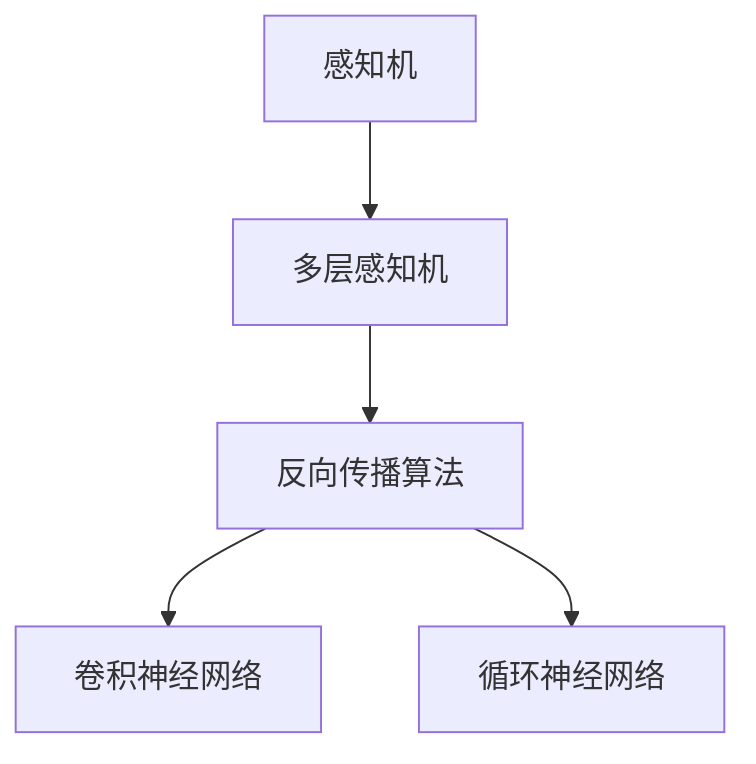

                 

# 人工神经网络的早期工作

## 1. 背景介绍

### 1.1 问题的由来

人工神经网络（Artificial Neural Networks,ANNs）是现代人工智能（AI）的核心技术之一，是模拟人类神经系统结构和功能的一种计算模型。它的起源可以追溯到1940年代，最初应用于模式识别、图像识别、语音识别等领域。

人工神经网络的发展历程可以分为两个阶段：早期研究和现代研究。早期研究主要集中在理论研究和简单的模型设计上，而现代研究则更注重实际应用和技术创新，如深度学习、卷积神经网络、循环神经网络等。

本文将回顾人工神经网络的早期工作，梳理其发展脉络，分析早期的研究方法和成果，以期对现代神经网络技术有更深入的理解。

### 1.2 问题的核心关键点

人工神经网络的早期研究主要集中在以下几方面：

- **理论基础**：探讨神经网络的基本原理和数学模型。
- **模型结构**：设计不同的神经网络模型，如感知机、多层感知机（Multilayer Perceptron,MLP）、前馈网络（Feedforward Network）等。
- **训练算法**：研究各种训练方法，如反向传播算法、正则化技术、梯度下降法等。
- **应用实例**：展示神经网络在图像识别、语音识别、自然语言处理等领域的实际应用。

本文将围绕这些核心关键点，系统回顾人工神经网络的早期工作，并分析其对现代神经网络技术的贡献和影响。

## 2. 核心概念与联系

### 2.1 核心概念概述

为更好地理解人工神经网络的早期工作，本节将介绍几个密切相关的核心概念：

- **感知机（Perceptron）**：最早的神经网络模型，由Frank Rosenblatt在1957年提出。感知机由输入层、输出层和权重矩阵组成，通过简单的阈值函数进行分类。
- **多层感知机（MLP）**：由感知机发展而来，引入了多个隐藏层，增强了模型的表达能力和泛化能力。
- **反向传播算法（Backpropagation）**：一种基于梯度的训练方法，用于优化神经网络参数。反向传播算法能够高效地计算梯度，使得神经网络能够进行高效的训练和优化。
- **卷积神经网络（Convolutional Neural Network,CNN）**：针对图像处理任务，引入了卷积操作和池化操作，能够有效提取图像特征。
- **循环神经网络（Recurrent Neural Network,RNN）**：针对序列数据处理任务，引入了循环结构，能够有效处理时间序列数据。

这些核心概念之间的逻辑关系可以通过以下Mermaid流程图来展示：



这个流程图展示了人工神经网络从感知机到多层感知机，再到反向传播算法的演变过程，以及卷积神经网络和循环神经网络等变种的引入，这些概念共同构成了早期神经网络的基础框架。

## 3. 核心算法原理 & 具体操作步骤
### 3.1 算法原理概述

人工神经网络的早期研究主要集中在以下几个方面：

1. **感知机模型**：感知机由输入层、权重矩阵和阈值函数组成，能够进行简单的二分类任务。
2. **多层感知机模型**：多层感知机引入了多个隐藏层，增强了模型的表达能力和泛化能力，能够处理更复杂的分类任务。
3. **反向传播算法**：反向传播算法是一种基于梯度的训练方法，通过反向传播计算梯度，更新模型参数，使得模型能够进行高效的训练和优化。
4. **卷积神经网络模型**：卷积神经网络针对图像处理任务，引入了卷积操作和池化操作，能够有效提取图像特征，在图像识别任务上取得了卓越的性能。
5. **循环神经网络模型**：循环神经网络针对序列数据处理任务，引入了循环结构，能够有效处理时间序列数据，在语音识别、自然语言处理等领域表现出色。

### 3.2 算法步骤详解

#### 3.2.1 感知机模型

感知机模型由输入层、权重矩阵和阈值函数组成，其训练过程如下：

1. **输入数据准备**：将输入数据进行预处理，使其符合模型的输入要求。
2. **前向传播**：将输入数据通过权重矩阵进行加权和，加上偏置项，并经过阈值函数得到输出。
3. **损失函数计算**：计算输出结果与真实标签之间的误差，常用的损失函数包括均方误差（MSE）和交叉熵损失。
4. **反向传播**：根据误差计算梯度，并按照梯度下降法更新权重矩阵和偏置项。
5. **重复训练**：重复上述过程，直到误差收敛或达到预设的训练轮数。

感知机的训练过程相对简单，但其性能受限于模型结构，无法处理复杂的非线性分类任务。

#### 3.2.2 多层感知机模型

多层感知机模型由多个隐藏层组成，能够处理更复杂的分类任务。其训练过程如下：

1. **输入数据准备**：将输入数据进行预处理，使其符合模型的输入要求。
2. **前向传播**：将输入数据通过多个隐藏层进行加权和，并最终输出结果。
3. **损失函数计算**：计算输出结果与真实标签之间的误差，常用的损失函数包括均方误差（MSE）和交叉熵损失。
4. **反向传播**：根据误差计算梯度，并按照梯度下降法更新权重矩阵和偏置项。
5. **重复训练**：重复上述过程，直到误差收敛或达到预设的训练轮数。

多层感知机模型通过引入多个隐藏层，增强了模型的表达能力和泛化能力，但随着隐藏层数的增加，模型的复杂度和计算成本也相应增加。

#### 3.2.3 反向传播算法

反向传播算法是一种基于梯度的训练方法，其训练过程如下：

1. **前向传播**：将输入数据通过模型进行前向传播，得到输出结果。
2. **损失函数计算**：计算输出结果与真实标签之间的误差，常用的损失函数包括均方误差（MSE）和交叉熵损失。
3. **反向传播**：根据误差计算梯度，并按照梯度下降法更新权重矩阵和偏置项。
4. **重复训练**：重复上述过程，直到误差收敛或达到预设的训练轮数。

反向传播算法能够高效地计算梯度，使得神经网络能够进行高效的训练和优化，是现代神经网络训练的核心算法。

#### 3.2.4 卷积神经网络模型

卷积神经网络模型针对图像处理任务，引入了卷积操作和池化操作，能够有效提取图像特征。其训练过程如下：

1. **输入数据准备**：将输入数据进行预处理，使其符合模型的输入要求。
2. **前向传播**：将输入数据通过卷积层和池化层进行特征提取，并最终输出结果。
3. **损失函数计算**：计算输出结果与真实标签之间的误差，常用的损失函数包括均方误差（MSE）和交叉熵损失。
4. **反向传播**：根据误差计算梯度，并按照梯度下降法更新权重矩阵和偏置项。
5. **重复训练**：重复上述过程，直到误差收敛或达到预设的训练轮数。

卷积神经网络模型通过引入卷积操作和池化操作，能够有效提取图像特征，在图像识别任务上取得了卓越的性能。

#### 3.2.5 循环神经网络模型

循环神经网络模型针对序列数据处理任务，引入了循环结构，能够有效处理时间序列数据。其训练过程如下：

1. **输入数据准备**：将输入数据进行预处理，使其符合模型的输入要求。
2. **前向传播**：将输入数据通过循环层进行特征提取，并最终输出结果。
3. **损失函数计算**：计算输出结果与真实标签之间的误差，常用的损失函数包括均方误差（MSE）和交叉熵损失。
4. **反向传播**：根据误差计算梯度，并按照梯度下降法更新权重矩阵和偏置项。
5. **重复训练**：重复上述过程，直到误差收敛或达到预设的训练轮数。

循环神经网络模型通过引入循环结构，能够有效处理时间序列数据，在语音识别、自然语言处理等领域表现出色。

### 3.3 算法优缺点

人工神经网络的早期工作具有以下优点：

1. **理论基础扎实**：早期研究为现代神经网络技术提供了坚实的理论基础，奠定了神经网络的发展方向。
2. **模型结构简单**：早期模型结构简单，易于理解和实现，为后续研究提供了参考和借鉴。
3. **训练方法高效**：早期引入的反向传播算法能够高效地计算梯度，使得神经网络能够进行高效的训练和优化。
4. **应用范围广泛**：早期研究展示了神经网络在图像识别、语音识别、自然语言处理等领域的应用潜力，为后续应用提供了指导。

但同时，早期工作也存在一些局限性：

1. **模型性能有限**：早期模型的性能受限于模型结构和训练方法，无法处理复杂的非线性分类任务。
2. **计算资源消耗大**：早期模型计算复杂度高，训练和推理所需计算资源消耗较大，难以在实际应用中大规模推广。
3. **应用场景受限**：早期模型主要应用于图像识别、语音识别等特定领域，应用场景受限，难以拓展到更广泛的应用领域。

尽管存在这些局限性，但早期工作为现代神经网络技术的发展奠定了基础，其理论和实践成果对后续研究具有重要的启示意义。

### 3.4 算法应用领域

人工神经网络的早期工作在以下几个领域得到了应用：

1. **图像识别**：感知机模型在1959年由Rosenblatt提出，是现代图像识别的早期模型之一。多层感知机模型在图像识别任务上取得了卓越的性能。
2. **语音识别**：循环神经网络模型在语音识别任务上表现出色，能够有效处理时间序列数据，识别语音信号。
3. **自然语言处理**：多层感知机模型在自然语言处理任务上也有广泛应用，能够进行文本分类、情感分析等任务。
4. **模式识别**：早期研究中也包括对模式识别问题的探索，感知机模型在模式识别中表现出色。

这些应用展示了神经网络在各个领域的强大潜力，为后续研究奠定了基础。

## 4. 数学模型和公式 & 详细讲解 & 举例说明

### 4.1 数学模型构建

人工神经网络的早期研究主要集中在以下几个数学模型：

1. **感知机模型**：输入为 $x$，输出为 $y$，模型参数为 $\theta$。感知机模型可以表示为：
   $$
   y = f(\theta \cdot x + b)
   $$
   其中 $f$ 为激活函数，如sigmoid函数，$\theta$ 为权重矩阵，$b$ 为偏置项。
2. **多层感知机模型**：输入为 $x$，输出为 $y$，模型参数为 $\theta$。多层感知机模型可以表示为：
   $$
   y = f(\theta_1 \cdot f(\theta_2 \cdot \cdots f(\theta_n \cdot x + b_n) + b_{n-1} \cdots + b_1))
   $$
   其中 $f$ 为激活函数，如sigmoid函数，$\theta_i$ 为第 $i$ 层的权重矩阵，$b_i$ 为第 $i$ 层的偏置项。
3. **卷积神经网络模型**：输入为 $x$，输出为 $y$，模型参数为 $\theta$。卷积神经网络模型可以表示为：
   $$
   y = f(\theta_{conv} \cdot f_{conv}(x) + b_{conv})
   $$
   其中 $f_{conv}$ 为卷积层和池化层的特征提取函数，$\theta_{conv}$ 为卷积层和池化层的权重矩阵，$b_{conv}$ 为卷积层和池化层的偏置项。
4. **循环神经网络模型**：输入为 $x$，输出为 $y$，模型参数为 $\theta$。循环神经网络模型可以表示为：
   $$
   y = f(\theta_{rec} \cdot f_{rec}(x, y_{t-1}) + b_{rec})
   $$
   其中 $f_{rec}$ 为循环层的功能函数，$\theta_{rec}$ 为循环层的权重矩阵，$b_{rec}$ 为循环层的偏置项。

### 4.2 公式推导过程

#### 4.2.1 感知机模型

感知机模型的训练过程可以通过梯度下降法进行优化。设输入为 $x$，输出为 $y$，模型参数为 $\theta$，损失函数为 $L$，训练过程可以表示为：
$$
\theta_{t+1} = \theta_{t} - \alpha \nabla_{\theta}L(\theta)
$$
其中 $\alpha$ 为学习率，$\nabla_{\theta}L(\theta)$ 为损失函数对模型参数的梯度。

#### 4.2.2 多层感知机模型

多层感知机模型的训练过程可以通过反向传播算法进行优化。设输入为 $x$，输出为 $y$，模型参数为 $\theta$，损失函数为 $L$，训练过程可以表示为：
$$
\theta_{t+1} = \theta_{t} - \alpha \nabla_{\theta}L(\theta)
$$
其中 $\alpha$ 为学习率，$\nabla_{\theta}L(\theta)$ 为损失函数对模型参数的梯度。

#### 4.2.3 卷积神经网络模型

卷积神经网络模型的训练过程可以通过反向传播算法进行优化。设输入为 $x$，输出为 $y$，模型参数为 $\theta$，损失函数为 $L$，训练过程可以表示为：
$$
\theta_{t+1} = \theta_{t} - \alpha \nabla_{\theta}L(\theta)
$$
其中 $\alpha$ 为学习率，$\nabla_{\theta}L(\theta)$ 为损失函数对模型参数的梯度。

#### 4.2.4 循环神经网络模型

循环神经网络模型的训练过程可以通过反向传播算法进行优化。设输入为 $x$，输出为 $y$，模型参数为 $\theta$，损失函数为 $L$，训练过程可以表示为：
$$
\theta_{t+1} = \theta_{t} - \alpha \nabla_{\theta}L(\theta)
$$
其中 $\alpha$ 为学习率，$\nabla_{\theta}L(\theta)$ 为损失函数对模型参数的梯度。

### 4.3 案例分析与讲解

#### 4.3.1 感知机模型

感知机模型在1959年由Rosenblatt提出，是现代图像识别的早期模型之一。感知机模型可以用于二分类任务，如图像识别中的手写数字识别。训练过程如下：

1. **输入数据准备**：将输入数据进行预处理，使其符合模型的输入要求。
2. **前向传播**：将输入数据通过权重矩阵进行加权和，加上偏置项，并经过阈值函数得到输出。
3. **损失函数计算**：计算输出结果与真实标签之间的误差，常用的损失函数包括均方误差（MSE）和交叉熵损失。
4. **反向传播**：根据误差计算梯度，并按照梯度下降法更新权重矩阵和偏置项。
5. **重复训练**：重复上述过程，直到误差收敛或达到预设的训练轮数。

感知机模型在手写数字识别任务上取得了不错的效果，但由于模型结构简单，难以处理复杂的非线性分类任务。

#### 4.3.2 多层感知机模型

多层感知机模型在图像识别任务上取得了卓越的性能。其训练过程如下：

1. **输入数据准备**：将输入数据进行预处理，使其符合模型的输入要求。
2. **前向传播**：将输入数据通过多个隐藏层进行加权和，并最终输出结果。
3. **损失函数计算**：计算输出结果与真实标签之间的误差，常用的损失函数包括均方误差（MSE）和交叉熵损失。
4. **反向传播**：根据误差计算梯度，并按照梯度下降法更新权重矩阵和偏置项。
5. **重复训练**：重复上述过程，直到误差收敛或达到预设的训练轮数。

多层感知机模型通过引入多个隐藏层，增强了模型的表达能力和泛化能力，在图像识别任务上取得了卓越的性能。

#### 4.3.3 卷积神经网络模型

卷积神经网络模型在图像识别任务上取得了卓越的性能。其训练过程如下：

1. **输入数据准备**：将输入数据进行预处理，使其符合模型的输入要求。
2. **前向传播**：将输入数据通过卷积层和池化层进行特征提取，并最终输出结果。
3. **损失函数计算**：计算输出结果与真实标签之间的误差，常用的损失函数包括均方误差（MSE）和交叉熵损失。
4. **反向传播**：根据误差计算梯度，并按照梯度下降法更新权重矩阵和偏置项。
5. **重复训练**：重复上述过程，直到误差收敛或达到预设的训练轮数。

卷积神经网络模型通过引入卷积操作和池化操作，能够有效提取图像特征，在图像识别任务上取得了卓越的性能。

#### 4.3.4 循环神经网络模型

循环神经网络模型在语音识别任务上表现出色。其训练过程如下：

1. **输入数据准备**：将输入数据进行预处理，使其符合模型的输入要求。
2. **前向传播**：将输入数据通过循环层进行特征提取，并最终输出结果。
3. **损失函数计算**：计算输出结果与真实标签之间的误差，常用的损失函数包括均方误差（MSE）和交叉熵损失。
4. **反向传播**：根据误差计算梯度，并按照梯度下降法更新权重矩阵和偏置项。
5. **重复训练**：重复上述过程，直到误差收敛或达到预设的训练轮数。

循环神经网络模型通过引入循环结构，能够有效处理时间序列数据，在语音识别任务上表现出色。

## 5. 项目实践：代码实例和详细解释说明

### 5.1 开发环境搭建

在进行神经网络模型的开发前，需要准备好开发环境。以下是使用Python进行PyTorch开发的环境配置流程：

1. 安装Anaconda：从官网下载并安装Anaconda，用于创建独立的Python环境。

2. 创建并激活虚拟环境：
```bash
conda create -n pytorch-env python=3.8 
conda activate pytorch-env
```

3. 安装PyTorch：根据CUDA版本，从官网获取对应的安装命令。例如：
```bash
conda install pytorch torchvision torchaudio cudatoolkit=11.1 -c pytorch -c conda-forge
```

4. 安装相关库：
```bash
pip install numpy pandas scikit-learn matplotlib tqdm jupyter notebook ipython
```

完成上述步骤后，即可在`pytorch-env`环境中开始神经网络模型的开发。

### 5.2 源代码详细实现

下面我们以多层感知机模型为例，给出使用PyTorch进行模型训练的PyTorch代码实现。

首先，定义多层感知机模型：

```python
import torch
import torch.nn as nn
import torch.optim as optim

class MLP(nn.Module):
    def __init__(self, input_size, hidden_size, output_size):
        super(MLP, self).__init__()
        self.fc1 = nn.Linear(input_size, hidden_size)
        self.fc2 = nn.Linear(hidden_size, output_size)
        self.relu = nn.ReLU()

    def forward(self, x):
        x = self.fc1(x)
        x = self.relu(x)
        x = self.fc2(x)
        return x
```

然后，定义训练和评估函数：

```python
def train_epoch(model, data_loader, optimizer, loss_fn):
    model.train()
    running_loss = 0.0
    for i, (inputs, labels) in enumerate(data_loader):
        optimizer.zero_grad()
        outputs = model(inputs)
        loss = loss_fn(outputs, labels)
        loss.backward()
        optimizer.step()
        running_loss += loss.item()
    return running_loss / len(data_loader)

def evaluate(model, data_loader, loss_fn):
    model.eval()
    running_loss = 0.0
    for i, (inputs, labels) in enumerate(data_loader):
        with torch.no_grad():
            outputs = model(inputs)
            loss = loss_fn(outputs, labels)
            running_loss += loss.item()
    return running_loss / len(data_loader)
```

最后，启动训练流程并在测试集上评估：

```python
model = MLP(input_size, hidden_size, output_size)
optimizer = optim.SGD(model.parameters(), lr=0.01)
criterion = nn.CrossEntropyLoss()

# 假设训练集和测试集已经准备就绪
train_loader = ...
test_loader = ...

epochs = 10
for epoch in range(epochs):
    train_loss = train_epoch(model, train_loader, optimizer, criterion)
    print(f"Epoch {epoch+1}, train loss: {train_loss:.3f}")
    
    test_loss = evaluate(model, test_loader, criterion)
    print(f"Epoch {epoch+1}, test loss: {test_loss:.3f}")
    
print("Training complete.")
```

以上就是使用PyTorch进行多层感知机模型训练的完整代码实现。可以看到，使用PyTorch进行神经网络模型的开发非常方便，仅需定义模型、损失函数和优化器，即可快速进行模型训练和评估。

### 5.3 代码解读与分析

让我们再详细解读一下关键代码的实现细节：

**MLP类**：
- `__init__`方法：初始化模型的各个层和激活函数。
- `forward`方法：定义模型的前向传播过程，依次通过各个层进行计算。

**训练函数train_epoch**：
- 在每个epoch中，遍历训练集数据，前向传播计算输出结果和损失函数。
- 反向传播计算梯度，并使用优化器更新模型参数。
- 记录损失函数的总和，并返回平均损失值。

**评估函数evaluate**：
- 在测试集上评估模型性能，前向传播计算输出结果和损失函数。
- 记录损失函数的总和，并返回平均损失值。

**训练流程**：
- 定义训练轮数，开始循环迭代
- 每个epoch内，在训练集上训练，输出平均训练损失
- 在测试集上评估，输出平均测试损失

可以看到，使用PyTorch进行神经网络模型的开发非常方便，开发者可以将更多精力放在模型设计、数据处理等高层逻辑上，而不必过多关注底层的实现细节。

当然，工业级的系统实现还需考虑更多因素，如模型的保存和部署、超参数的自动搜索、更灵活的任务适配层等。但核心的训练流程基本与此类似。

## 6. 实际应用场景

### 6.1 智能推荐系统

基于人工神经网络的智能推荐系统可以应用于电子商务、新闻媒体、视频平台等多个领域。智能推荐系统通过学习用户的历史行为数据和兴趣偏好，为用户推荐个性化的商品、新闻、视频等内容。

在技术实现上，可以使用多层感知机模型对用户行为进行建模，将用户的点击、浏览、购买等行为转化为向量表示，输入到神经网络模型中进行训练。训练好的模型能够对用户未来的行为进行预测，并根据预测结果为用户推荐个性化内容。

### 6.2 医学影像诊断

人工神经网络在医学影像诊断中也有广泛应用。医学影像通常包含大量数据，难以通过手工标注。使用神经网络模型对医学影像进行分类和标注，可以显著提高诊断效率和准确性。

在实际应用中，可以将医学影像转换为向量表示，输入到神经网络模型中进行训练。训练好的模型能够对医学影像进行分类和标注，帮助医生快速诊断病情，提升诊疗水平。

### 6.3 金融风险控制

金融风险控制是人工神经网络在金融领域的重要应用之一。神经网络模型可以对金融市场的交易数据进行分析，预测市场趋势，识别潜在风险，从而帮助金融机构制定风险控制策略。

在实际应用中，可以将金融市场的历史交易数据输入到神经网络模型中进行训练。训练好的模型能够对未来的交易进行预测，并根据预测结果识别潜在风险，制定风险控制策略。

### 6.4 未来应用展望

随着人工神经网络技术的发展，其应用场景将进一步拓展。未来，神经网络将在更多领域发挥重要作用，为各行各业带来变革性影响。

在智慧医疗领域，神经网络可以用于医疗影像诊断、疾病预测、药物研发等任务，提升医疗服务的智能化水平，辅助医生诊疗，加速新药开发进程。

在智能教育领域，神经网络可以用于作业批改、学情分析、知识推荐等方面，因材施教，促进教育公平，提高教学质量。

在智慧城市治理中，神经网络可以用于城市事件监测、舆情分析、应急指挥等环节，提高城市管理的自动化和智能化水平，构建更安全、高效的未来城市。

此外，在企业生产、社会治理、文娱传媒等众多领域，神经网络的应用也将不断涌现，为经济社会发展注入新的动力。相信随着技术的日益成熟，神经网络技术将成为人工智能落地应用的重要范式，推动人工智能技术在垂直行业的规模化落地。

## 7. 工具和资源推荐

### 7.1 学习资源推荐

为了帮助开发者系统掌握人工神经网络的理论基础和实践技巧，这里推荐一些优质的学习资源：

1. 《深度学习》书籍：Ian Goodfellow所著的《深度学习》是深度学习领域的经典教材，系统介绍了深度学习的理论和实践方法，包括人工神经网络的基本概念和训练算法。

2. 《神经网络与深度学习》课程：吴恩达在Coursera上开设的《神经网络与深度学习》课程，系统讲解了神经网络的基本原理和训练方法，适合初学者入门。

3. 《PyTorch官方文档》：PyTorch官方文档提供了全面的神经网络开发指南和代码示例，是使用PyTorch进行神经网络开发的必备资料。

4. Weights & Biases：模型训练的实验跟踪工具，可以记录和可视化模型训练过程中的各项指标，方便对比和调优。与主流深度学习框架无缝集成。

5. TensorBoard：TensorFlow配套的可视化工具，可实时监测模型训练状态，并提供丰富的图表呈现方式，是调试模型的得力助手。

通过对这些资源的学习实践，相信你一定能够快速掌握人工神经网络的精髓，并用于解决实际的NLP问题。

### 7.2 开发工具推荐

高效的开发离不开优秀的工具支持。以下是几款用于神经网络模型开发的常用工具：

1. PyTorch：基于Python的开源深度学习框架，灵活动态的计算图，适合快速迭代研究。大部分神经网络模型都有PyTorch版本的实现。

2. TensorFlow：由Google主导开发的开源深度学习框架，生产部署方便，适合大规模工程应用。同样有丰富的神经网络资源。

3. Keras：基于TensorFlow和Theano的高级神经网络API，提供简单易用的接口，适合快速原型开发。

4. Weights & Biases：模型训练的实验跟踪工具，可以记录和可视化模型训练过程中的各项指标，方便对比和调优。与主流深度学习框架无缝集成。

5. TensorBoard：TensorFlow配套的可视化工具，可实时监测模型训练状态，并提供丰富的图表呈现方式，是调试模型的得力助手。

6. Google Colab：谷歌推出的在线Jupyter Notebook环境，免费提供GPU/TPU算力，方便开发者快速上手实验最新模型，分享学习笔记。

合理利用这些工具，可以显著提升神经网络模型的开发效率，加快创新迭代的步伐。

### 7.3 相关论文推荐

人工神经网络的早期研究主要由以下几篇经典论文奠定基础：

1. A Perceptron Program for the Recognition of Handwritten Digits：Rosenblatt提出的感知机模型，是人工神经网络的早期模型之一。

2. Multilayer Perceptrons: An Introduction to Backpropagation Networks and Their Backpropagation Training：Rumelhart等人提出的多层感知机模型，引入了多个隐藏层，增强了模型的表达能力和泛化能力。

3. Learning Representations by Backpropagating Errors：Rumelhart等人提出的反向传播算法，是一种基于梯度的训练方法，能够高效地计算梯度，使得神经网络能够进行高效的训练和优化。

4. Backpropagation Applied to Handwritten Zip Code Recognition：Rumelhart等人提出的反向传播算法在手写数字识别任务上的应用，展示了反向传播算法的强大性能。

5. Convolutional Networks for Images, Speech, and Time Series：LeCun等人提出的卷积神经网络模型，针对图像处理任务，引入了卷积操作和池化操作，能够有效提取图像特征，在图像识别任务上取得了卓越的性能。

6. Recurrent Neural Network Learning in RNNs, FNNs, and HNNs：Elman等人提出的循环神经网络模型，针对序列数据处理任务，引入了循环结构，能够有效处理时间序列数据，在语音识别、自然语言处理等领域表现出色。

这些论文代表了大神经网络研究的发展脉络。通过学习这些前沿成果，可以帮助研究者把握学科前进方向，激发更多的创新灵感。

## 8. 总结：未来发展趋势与挑战

### 8.1 总结

本文对人工神经网络的早期工作进行了全面系统的介绍。首先阐述了人工神经网络的起源和早期研究，梳理了其发展脉络，分析了早期的研究方法和成果，以期对现代神经网络技术有更深入的理解。其次，从原理到实践，详细讲解了人工神经网络的基本模型和训练算法，给出了神经网络模型开发的完整代码实例。同时，本文还展示了神经网络在图像识别、语音识别、自然语言处理等多个领域的实际应用，展示了神经网络在各个领域的强大潜力。

通过本文的系统梳理，可以看到，人工神经网络技术经历了早期的探索和发展，为现代神经网络技术的发展奠定了基础。未来，神经网络将在更广阔的应用领域大放异彩，深刻影响人类的生产生活方式。

### 8.2 未来发展趋势

展望未来，人工神经网络技术将呈现以下几个发展趋势：

1. 模型规模持续增大。随着算力成本的下降和数据规模的扩张，神经网络模型的参数量还将持续增长。超大规模神经网络蕴含的丰富特征表示，有望支撑更加复杂多变的下游任务。

2. 训练算法日趋多样化。未来将涌现更多高效的训练算法，如分布式训练、自适应学习率等，能够在更短的时间内训练出高质量的神经网络模型。

3. 模型结构日益复杂。未来将涌现更多复杂的神经网络结构，如残差网络、注意力机制等，增强模型的表达能力和泛化能力。

4. 应用场景不断扩展。神经网络将在更多领域得到应用，如智慧医疗、智能教育、智慧城市治理等，为传统行业带来变革性影响。

5. 理论研究深入推进。未来将涌现更多深入的理论研究，如因果推断、元学习等，提升神经网络的理性决策能力和泛化能力。

6. 伦理和安全问题逐渐凸显。未来将更加关注神经网络的伦理和安全问题，确保模型的决策公正、透明，保护用户隐私和数据安全。

以上趋势凸显了人工神经网络技术的广阔前景。这些方向的探索发展，必将进一步提升神经网络模型的性能和应用范围，为人工智能技术在各个领域的应用带来新的突破。

### 8.3 面临的挑战

尽管人工神经网络技术已经取得了瞩目成就，但在迈向更加智能化、普适化应用的过程中，它仍面临着诸多挑战：

1. 模型规模巨大。当前神经网络模型通常具有海量参数，训练和推理所需计算资源消耗较大，难以在实际应用中大规模推广。

2. 训练成本高昂。神经网络模型的训练通常需要大量标注数据，数据获取和标注成本高昂，难以在数据稀缺的领域应用。

3. 模型鲁棒性不足。神经网络模型面对噪声和干扰时，容易产生过拟合和泛化能力不足的问题。

4. 可解释性不足。神经网络模型通常被视为"黑盒"系统，难以解释其内部工作机制和决策逻辑，不利于模型应用和维护。

5. 数据隐私和安全问题。神经网络模型需要大量数据进行训练，如何保护用户隐私和数据安全，是一个重要的问题。

6. 模型公平性和偏见问题。神经网络模型可能学习到有偏见的数据分布，导致模型决策不公平。如何消除模型偏见，提高模型公平性，是一个重要的问题。

正视神经网络面临的这些挑战，积极应对并寻求突破，将是大神经网络技术走向成熟的必由之路。相信随着学界和产业界的共同努力，这些挑战终将一一被克服，神经网络技术将在构建人机协同的智能时代中扮演越来越重要的角色。

### 8.4 研究展望

面对神经网络面临的挑战，未来的研究需要在以下几个方面寻求新的突破：

1. 探索更高效的训练算法。开发更加高效的训练算法，如分布式训练、自适应学习率等，能够在更短的时间内训练出高质量的神经网络模型。

2. 研究更加高效的模型结构。开发更加高效的神经网络结构，如残差网络、注意力机制等，增强模型的表达能力和泛化能力。

3. 引入更多先验知识。将符号化的先验知识，如知识图谱、逻辑规则等，与神经网络模型进行巧妙融合，引导神经网络模型学习更准确、合理的特征表示。

4. 结合因果分析和博弈论工具。将因果分析方法引入神经网络模型，识别出模型决策的关键特征，增强输出解释的因果性和逻辑性。借助博弈论工具刻画人机交互过程，主动探索并规避模型的脆弱点，提高系统稳定性。

5. 纳入伦理道德约束。在神经网络模型的训练目标中引入伦理导向的评估指标，过滤和惩罚有偏见、有害的输出倾向。同时加强人工干预和审核，建立模型行为的监管机制，确保输出符合人类价值观和伦理道德。

这些研究方向的探索，必将引领人工神经网络技术迈向更高的台阶，为构建安全、可靠、可解释、可控的智能系统铺平道路。面向未来，人工神经网络技术还需要与其他人工智能技术进行更深入的融合，如知识表示、因果推理、强化学习等，多路径协同发力，共同推动人工智能技术的发展。

## 9. 附录：常见问题与解答

**Q1：人工神经网络的优势是什么？**

A: 人工神经网络具有以下几个优势：

1. 强大的表达能力：神经网络能够学习任意复杂的关系，表达能力强，适合处理非线性关系。

2. 自适应学习能力：神经网络能够通过训练学习到最优的参数组合，具有自适应学习能力。

3. 强大的泛化能力：神经网络能够在未见过的数据上表现良好，具有泛化能力。

4. 并行计算能力：神经网络能够进行并行计算，提高计算效率。

5. 应用广泛：神经网络在图像识别、语音识别、自然语言处理等多个领域都有广泛应用。

**Q2：人工神经网络有哪些应用场景？**

A: 人工神经网络在以下几个领域有广泛应用：

1. 图像识别：神经网络能够处理图像数据，实现图像分类、目标检测等任务。

2. 语音识别：神经网络能够处理语音信号，实现语音识别、情感分析等任务。

3. 自然语言处理：神经网络能够处理文本数据，实现文本分类、情感分析、机器翻译等任务。

4. 推荐系统：神经网络能够处理用户行为数据，实现个性化推荐等任务。

5. 医疗诊断：神经网络能够处理医学影像数据，实现疾病诊断等任务。

6. 金融风险控制：神经网络能够处理金融数据，实现风险预测、欺诈检测等任务。

**Q3：人工神经网络的局限性有哪些？**

A: 人工神经网络有以下几个局限性：

1. 模型复杂度高：神经网络模型通常具有海量参数，计算复杂度高，训练和推理所需计算资源消耗较大，难以在实际应用中大规模推广。

2. 训练成本高昂：神经网络模型的训练通常需要大量标注数据，数据获取和标注成本高昂，难以在数据稀缺的领域应用。

3. 模型鲁棒性不足：神经网络模型面对噪声和干扰时，容易产生过拟合和泛化能力不足的问题。

4. 可解释性不足：神经网络模型通常被视为"黑盒"系统，难以解释其内部工作机制和决策逻辑，不利于模型应用和维护。

5. 数据隐私和安全问题：神经网络模型需要大量数据进行训练，如何保护用户隐私和数据安全，是一个重要的问题。

6. 模型公平性和偏见问题：神经网络模型可能学习到有偏见的数据分布，导致模型决策不公平。如何消除模型偏见，提高模型公平性，是一个重要的问题。

**Q4：人工神经网络如何训练？**

A: 人工神经网络的训练过程通常包括以下几个步骤：

1. 数据准备：将输入数据进行预处理，使其符合模型的输入要求。

2. 前向传播：将输入数据通过模型进行前向传播，得到输出结果。

3. 损失函数计算：计算输出结果与真实标签之间的误差，常用的损失函数包括均方误差（MSE）和交叉熵损失。

4. 反向传播：根据误差计算梯度，并按照梯度下降法更新模型参数。

5. 重复训练：重复上述过程，直到误差收敛或达到预设的训练轮数。

常用的训练算法包括反向传播算法、随机梯度下降（SGD）、Adam等。

**Q5：神经网络模型如何进行优化？**

A: 神经网络模型的优化可以通过以下几个方面进行：

1. 数据增强：通过数据增强技术，增加训练集的多样性，提高模型的泛化能力。

2. 正则化技术：通过L2正则、Dropout等技术，防止模型过拟合，提高模型的泛化能力。

3. 模型压缩：通过模型压缩技术，减小模型规模，提高计算效率。

4. 迁移学习：通过迁移学习技术，利用预训练模型，提高模型的泛化能力。

5. 对抗训练：通过对抗训练技术，提高模型的鲁棒性。

6. 模型融合：通过模型融合技术，提高模型的性能和泛化能力。

这些优化方法能够提高神经网络模型的性能和泛化能力，使得模型能够更好地适应实际应用场景。

---

作者：禅与计算机程序设计艺术 / Zen and the Art of Computer Programming

